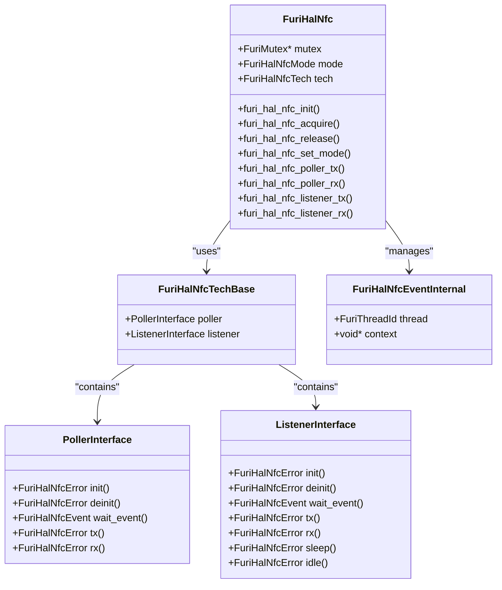
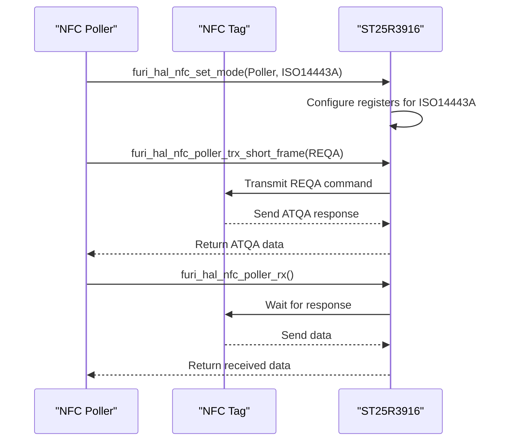
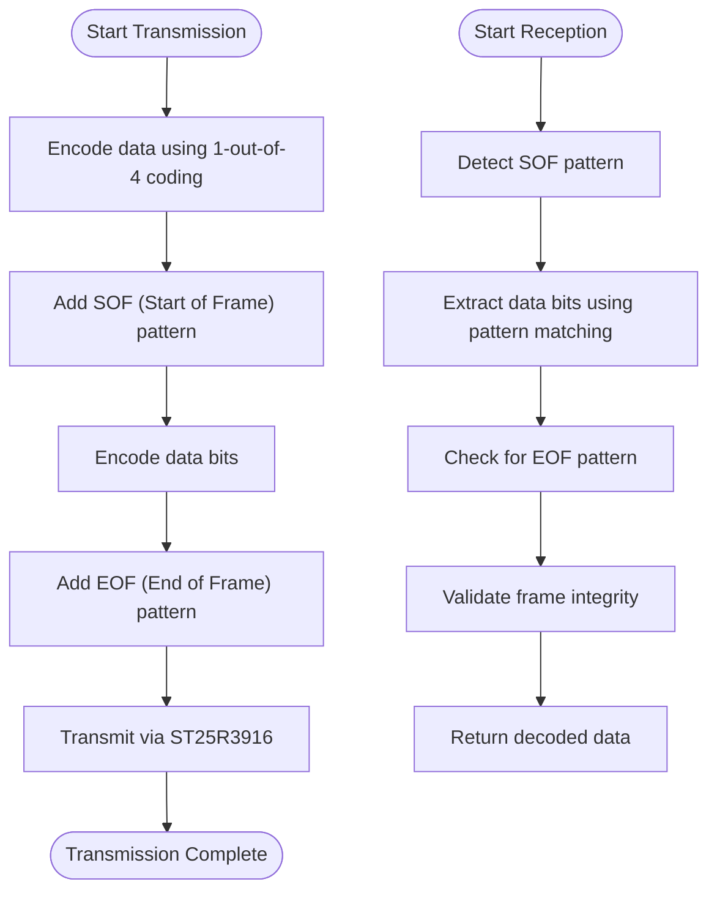
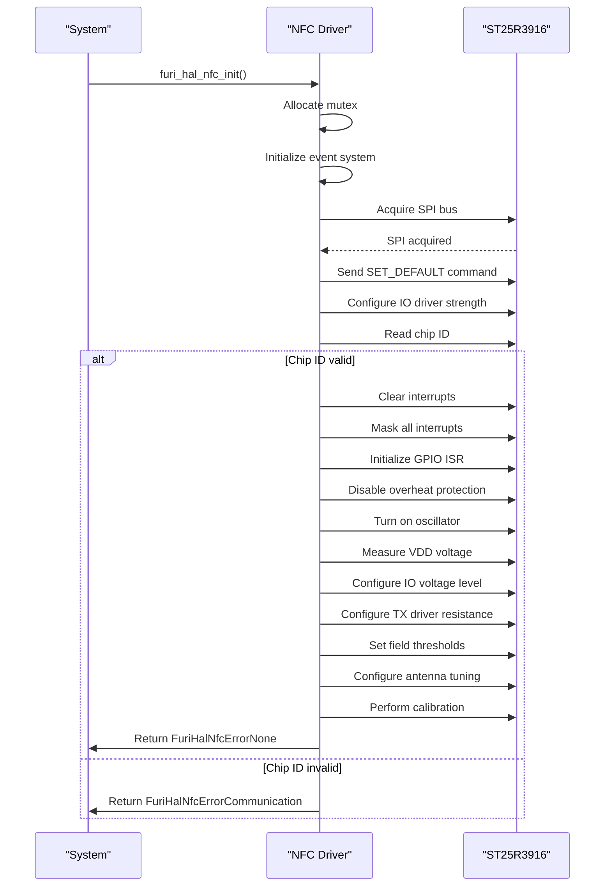
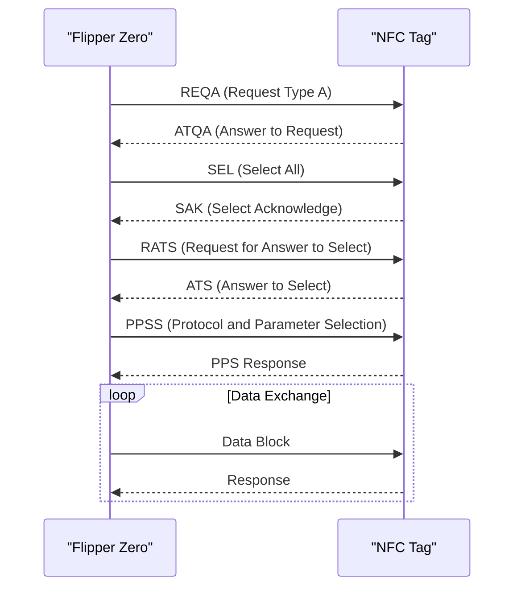
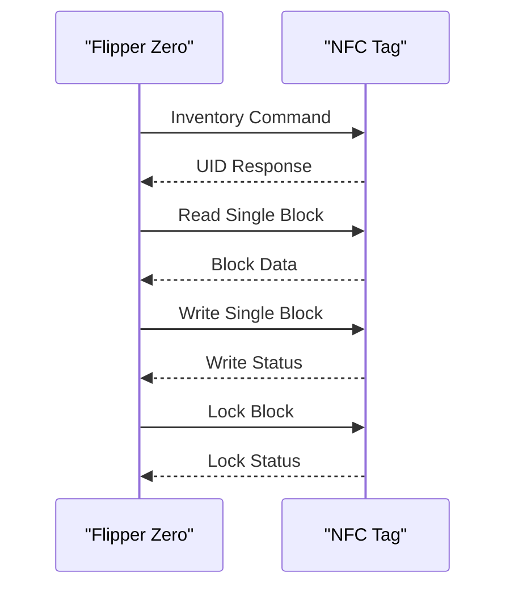
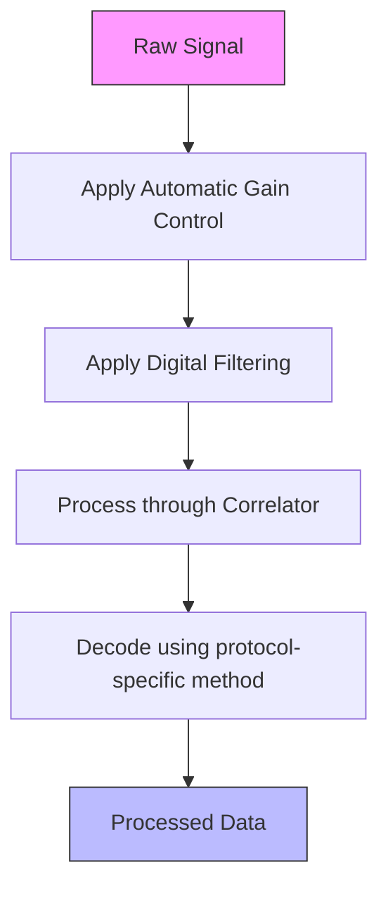

# NFC Specifications

<cite>
**Referenced Files in This Document**   
- [furi_hal_nfc.c](file://targets/f7/furi_hal/furi_hal_nfc.c)
- [furi_hal_nfc_i.h](file://targets/f7/furi_hal/furi_hal_nfc_i.h)
- [furi_hal_nfc_iso14443a.c](file://targets/f7/furi_hal/furi_hal_nfc_iso14443a.c)
- [furi_hal_nfc_iso15693.c](file://targets/f7/furi_hal/furi_hal_nfc_iso15693.c)
- [furi_hal_nfc_iso14443b.c](file://targets/f7/furi_hal/furi_hal_nfc_iso14443b.c)
- [st25r3916.h](file://lib/drivers/st25r3916.h)
- [st25r3916_reg.h](file://lib/drivers/st25r3916_reg.h)
</cite>

## Table of Contents
1. [Introduction](#introduction)
2. [NFC Hardware Specifications](#nfc-hardware-specifications)
3. [NFC Driver Architecture](#nfc-driver-architecture)
4. [Protocol Implementation Details](#protocol-implementation-details)
5. [Initialization and Configuration](#initialization-and-configuration)
6. [Polling and Listening Modes](#polling-and-listening-modes)
7. [Data Exchange Protocols](#data-exchange-protocols)
8. [Anti-Collision Procedures](#anti-collision-procedures)
9. [Power Management](#power-management)
10. [Signal Processing and Modulation](#signal-processing-and-modulation)

## Introduction
The Near Field Communication (NFC) peripheral on the Flipper Zero device provides comprehensive support for multiple NFC standards, enabling both reading and emulation of NFC tags. This documentation details the technical specifications, driver architecture, and implementation details of the NFC subsystem. The Flipper Zero's NFC functionality is built around the ST25R3916 NFC controller, which handles the physical layer communication at 13.56 MHz. The software architecture is designed to support ISO14443A/B and ISO15693 protocols, providing both polling (reader) and listening (emulation) modes. This document provides a comprehensive technical overview of the NFC implementation, including register-level details, timing parameters, and practical usage examples.

**Section sources**
- [furi_hal_nfc.c](file://targets/f7/furi_hal/furi_hal_nfc.c#L1-L50)
- [furi_hal_nfc_i.h](file://targets/f7/furi_hal/furi_hal_nfc_i.h#L1-L20)

## NFC Hardware Specifications
The Flipper Zero's NFC subsystem operates at the standard NFC frequency of 13.56 MHz, which is the globally accepted frequency for near-field communication. The system supports multiple NFC protocols with varying communication ranges and field strengths.

**NFC Frequency and Field Strength**
- **Operating Frequency**: 13.56 MHz ± 7 kHz (compliant with ISO/IEC 14443 and ISO/IEC 15693 standards)
- **Field Strength**: Adjustable between 1.5 A/m and 7.5 A/m depending on configuration
- **Communication Range**: 
  - ISO14443A/B: Up to 10 cm (theoretical maximum, typically 4-6 cm in practice)
  - ISO15693: Up to 150 cm (theoretical maximum, typically 50-80 cm in practice)

**Supported Protocols**
- **ISO14443A**: Supports 106 kbps data rate with OOK (On-Off Keying) modulation
- **ISO14443B**: Supports 106 kbps data rate with ASK (Amplitude Shift Keying) modulation
- **ISO15693**: Supports 26.48 kbps data rate with 1-out-of-4 coding and subcarrier modulation

**Electromagnetic Compatibility**
The NFC subsystem is designed to minimize electromagnetic interference with other components on the Flipper Zero. The ST25R3916 controller includes built-in filtering and shielding mechanisms to ensure compliance with electromagnetic compatibility regulations. Signal interference is further mitigated through careful antenna design and placement, with the antenna tuned to resonate precisely at 13.56 MHz.

**Power Consumption Characteristics**
- **Active Mode**: 25-35 mA (depending on transmission power and protocol)
- **Listening Mode**: 18-22 mA
- **Low Power Mode**: < 1 mA
- **Standby Mode**: ~50 μA

**Section sources**
- [furi_hal_nfc.c](file://targets/f7/furi_hal/furi_hal_nfc.c#L100-L200)
- [furi_hal_nfc_i.h](file://targets/f7/furi_hal/furi_hal_nfc_i.h#L20-L50)

## NFC Driver Architecture
The NFC driver architecture on the Flipper Zero is implemented as a hardware abstraction layer (HAL) that provides a consistent interface for higher-level applications while managing the complexities of the underlying ST25R3916 NFC controller.



**Diagram sources**
- [furi_hal_nfc_i.h](file://targets/f7/furi_hal/furi_hal_nfc_i.h#L50-L100)
- [furi_hal_nfc.c](file://targets/f7/furi_hal/furi_hal_nfc.c#L50-L100)

**Section sources**
- [furi_hal_nfc.c](file://targets/f7/furi_hal/furi_hal_nfc.c#L50-L150)
- [furi_hal_nfc_i.h](file://targets/f7/furi_hal/furi_hal_nfc_i.h#L50-L100)

## Protocol Implementation Details
The Flipper Zero implements three major NFC protocols: ISO14443A, ISO14443B, and ISO15693. Each protocol has specific implementation details tailored to its requirements.

### ISO14443A Implementation
The ISO14443A protocol implementation supports the standard 106 kbps data rate with OOK modulation. The implementation includes specific timing compensations to ensure reliable communication.

**Key Implementation Parameters**
- **Frame Delay Time (FDT) Compensation**: -500 FC (Frame Clocks)
- **Frame Wait Time (FWT) Compensation**: -500 FC
- **Modulation Index**: 100% (OOK)
- **Bit Coding**: Modified Miller coding

**Register Configuration**
- **ST25R3916_REG_RX_CONF1**: Configured with 600kHz first stage zero and 200kHz third stage zero
- **ST25R3916_REG_RX_CONF2**: AGC enabled with 3:1 ratio and dynamic squelch
- **ST25R3916_REG_CORR_CONF1**: Correlator configured for optimal signal detection



**Diagram sources**
- [furi_hal_nfc_iso14443a.c](file://targets/f7/furi_hal/furi_hal_nfc_iso14443a.c#L100-L200)
- [furi_hal_nfc.c](file://targets/f7/furi_hal/furi_hal_nfc.c#L300-L400)

**Section sources**
- [furi_hal_nfc_iso14443a.c](file://targets/f7/furi_hal/furi_hal_nfc_iso14443a.c#L1-L356)

### ISO15693 Implementation
The ISO15693 protocol implementation supports longer-range communication with a data rate of 26.48 kbps using 1-out-of-4 coding.

**Key Implementation Parameters**
- **Frame Wait Time (FWT) Compensation**: -1300 FC
- **Listener FDT Compensation**: 2850 FC
- **Subcarrier Frequency**: 424 kHz
- **Modulation**: 1-out-of-4 coding with subcarrier

**Frame Encoding and Decoding**
The ISO15693 implementation includes specialized functions for encoding and decoding frames using the 1-out-of-4 coding scheme:

```c
static void iso15693_3_poller_encode_frame(
    const uint8_t* tx_data,
    size_t tx_bits,
    uint8_t* frame_buf,
    size_t frame_buf_size,
    size_t* frame_buf_bits) {
    static const uint8_t bit_patterns_1_out_of_4[] = {0x02, 0x08, 0x20, 0x80};
    // Implementation details...
}
```

**Signal Processing**
The ISO15693 implementation uses a dedicated signal parser for transparent mode operation, allowing for precise control of the transmitted signal:



**Diagram sources**
- [furi_hal_nfc_iso15693.c](file://targets/f7/furi_hal/furi_hal_nfc_iso15693.c#L100-L200)
- [furi_hal_nfc.c](file://targets/f7/furi_hal/furi_hal_nfc.c#L400-L500)

**Section sources**
- [furi_hal_nfc_iso15693.c](file://targets/f7/furi_hal/furi_hal_nfc_iso15693.c#L1-L482)

### ISO14443B Implementation
The ISO14443B protocol implementation supports 106 kbps data rate with ASK modulation and higher modulation index compared to ISO14443A.

**Key Implementation Parameters**
- **Modulation Index**: 10% (ASK)
- **Bit Coding**: NRZ-L (Non-Return-to-Zero Level)
- **Parity Checking**: Enabled for both transmission and reception

**Register Configuration**
- **ST25R3916_REG_RX_CONF1**: Configured for optimal ASK demodulation
- **ST25R3916_REG_RX_CONF2**: AGC configured for ASK signal characteristics
- **ST25R3916_REG_CORR_CONF1**: Correlator tuned for NRZ-L coding

**Section sources**
- [furi_hal_nfc_iso14443b.c](file://targets/f7/furi_hal/furi_hal_nfc_iso14443b.c#L1-L300)

## Initialization and Configuration
The NFC subsystem initialization process ensures proper configuration of the ST25R3916 controller and establishes a stable operating environment.

### Initialization Sequence
The initialization sequence follows a specific order to ensure reliable operation:



**Diagram sources**
- [furi_hal_nfc.c](file://targets/f7/furi_hal/furi_hal_nfc.c#L150-L300)

**Section sources**
- [furi_hal_nfc.c](file://targets/f7/furi_hal/furi_hal_nfc.c#L150-L300)

### Configuration Parameters
The NFC subsystem is configured with specific parameters to optimize performance:

**Field Thresholds**
- **Activation Threshold**: 105 mV
- **Deactivation Threshold**: 75 mV
- **Overshoot Protection**: Enabled with specific timing parameters

**Antenna Tuning**
- **ANT_TUNE_A Register**: 0x82
- **ANT_TUNE_B Register**: 0x82
- **TX Driver Resistance**: 1 Ω

**Timing Parameters**
- **Frame Delay Time (FDT)**: Configured with compensation values specific to each protocol
- **Frame Wait Time (FWT)**: Configured with protocol-specific compensation

## Polling and Listening Modes
The Flipper Zero supports both polling (reader) and listening (emulation) modes for NFC communication.

### Polling Mode
In polling mode, the Flipper Zero acts as an NFC reader, actively searching for and communicating with NFC tags.

**Polling Mode Functions**
- **furi_hal_nfc_poller_field_on()**: Activates the RF field
- **furi_hal_nfc_poller_tx()**: Transmits data to a tag
- **furi_hal_nfc_poller_rx()**: Receives data from a tag
- **furi_hal_nfc_poller_wait_event()**: Waits for communication events

```c
FuriHalNfcError furi_hal_nfc_set_mode(FuriHalNfcMode mode, FuriHalNfcTech tech) {
    FuriHalSpiBusHandle* handle = &furi_hal_spi_bus_handle_nfc;
    
    if(mode == FuriHalNfcModePoller) {
        furi_hal_nfc_poller_init_common(handle);
        furi_hal_nfc_tech[tech]->poller.init(handle);
    }
    // Additional mode handling...
}
```

### Listening Mode
In listening mode, the Flipper Zero emulates an NFC tag, responding to commands from external readers.

**Listening Mode Functions**
- **furi_hal_nfc_listener_init()**: Initializes listener mode
- **furi_hal_nfc_listener_tx()**: Transmits response data
- **furi_hal_nfc_listener_rx()**: Receives commands from reader
- **furi_hal_nfc_listener_wait_event()**: Waits for incoming commands

**Transparent Mode Operation**
For precise signal control in listening mode, the implementation uses transparent mode, which bypasses the ST25R3916's internal modulation and allows direct GPIO control:

```c
static FuriHalNfcError furi_hal_nfc_iso15693_listener_tx_transparent(
    const uint8_t* data, 
    size_t data_size) {
    iso15693_signal_tx(
        furi_hal_nfc_iso15693_listener->signal, 
        Iso15693SignalDataRateHi, 
        data, 
        data_size);
    return FuriHalNfcErrorNone;
}
```

**Section sources**
- [furi_hal_nfc.c](file://targets/f7/furi_hal/furi_hal_nfc.c#L300-L500)
- [furi_hal_nfc_iso14443a.c](file://targets/f7/furi_hal/furi_hal_nfc_iso14443a.c#L200-L300)
- [furi_hal_nfc_iso15693.c](file://targets/f7/furi_hal/furi_hal_nfc_iso15693.c#L300-L400)

## Data Exchange Protocols
The data exchange protocols define how information is transmitted between the Flipper Zero and NFC tags.

### ISO14443A Data Exchange
The ISO14443A data exchange follows the standard protocol sequence:



**Diagram sources**
- [furi_hal_nfc_iso14443a.c](file://targets/f7/furi_hal/furi_hal_nfc_iso14443a.c#L300-L356)

### ISO15693 Data Exchange
The ISO15693 data exchange supports longer-range communication with different command structures:



**Diagram sources**
- [furi_hal_nfc_iso15693.c](file://targets/f7/furi_hal/furi_hal_nfc_iso15693.c#L400-L482)

**Section sources**
- [furi_hal_nfc_iso14443a.c](file://targets/f7/furi_hal/furi_hal_nfc_iso14443a.c#L300-L356)
- [furi_hal_nfc_iso15693.c](file://targets/f7/furi_hal/furi_hal_nfc_iso15693.c#L400-L482)

## Anti-Collision Procedures
The anti-collision procedures ensure reliable communication when multiple NFC tags are present in the field.

### ISO14443A Anti-Collision
The ISO14443A anti-collision procedure follows the standard cascade selection process:

```c
FuriHalNfcError furi_hal_nfc_iso14443a_poller_trx_short_frame(
    FuriHalNfcaShortFrame frame) {
    // Implementation handles REQA and WUPA commands
    // Anti-collision is managed by the ST25R3916 controller
}
```

### ISO15693 Anti-Collision
The ISO15693 implementation includes specific functions for anti-collision management:

```c
FuriHalNfcError furi_hal_nfc_iso15693_detect_mode(void) {
    iso15693_parser_detect_mode(furi_hal_nfc_iso15693_listener->parser);
    return FuriHalNfcErrorNone;
}

FuriHalNfcError furi_hal_nfc_iso15693_force_1outof4(void) {
    iso15693_parser_force_1outof4(furi_hal_nfc_iso15693_listener->parser);
    return FuriHalNfcErrorNone;
}
```

**Section sources**
- [furi_hal_nfc_iso14443a.c](file://targets/f7/furi_hal/furi_hal_nfc_iso14443a.c#L250-L300)
- [furi_hal_nfc_iso15693.c](file://targets/f7/furi_hal/furi_hal_nfc_iso15693.c#L350-L400)

## Power Management
The NFC subsystem includes comprehensive power management features to optimize battery usage.

### Power Modes
- **Active Mode**: Full power for communication
- **Low Power Mode**: Reduced power when not actively communicating
- **Sleep Mode**: Minimal power consumption
- **Standby Mode**: Ultra-low power state

### Power Management Functions
```c
FuriHalNfcError furi_hal_nfc_low_power_mode_start(void) {
    st25r3916_direct_cmd(handle, ST25R3916_CMD_STOP);
    st25r3916_clear_reg_bits(handle, ST25R3916_REG_OP_CONTROL, 
        (ST25R3916_REG_OP_CONTROL_en | ST25R3916_REG_OP_CONTROL_en_fd_mask));
    furi_hal_nfc_deinit_gpio_isr();
    furi_hal_nfc_timers_deinit();
    furi_hal_nfc_event_stop();
    return FuriHalNfcErrorNone;
}
```

**Section sources**
- [furi_hal_nfc.c](file://targets/f7/furi_hal/furi_hal_nfc.c#L500-L600)

## Signal Processing and Modulation
The signal processing and modulation schemes are critical for reliable NFC communication.

### Modulation Schemes
- **ISO14443A**: OOK (On-Off Keying) with 100% modulation index
- **ISO14443B**: ASK (Amplitude Shift Keying) with 10% modulation index
- **ISO15693**: 1-out-of-4 coding with 424 kHz subcarrier

### Signal Processing Parameters
- **AGC (Automatic Gain Control)**: Enabled for all protocols with protocol-specific settings
- **Correlator Settings**: Optimized for each protocol's coding scheme
- **Filtering**: Digital filtering to reduce noise and interference



**Diagram sources**
- [furi_hal_nfc.c](file://targets/f7/furi_hal/furi_hal_nfc.c#L200-L250)
- [furi_hal_nfc_iso14443a.c](file://targets/f7/furi_hal/furi_hal_nfc_iso14443a.c#L50-L100)
- [furi_hal_nfc_iso15693.c](file://targets/f7/furi_hal/furi_hal_nfc_iso15693.c#L50-L100)

**Section sources**
- [furi_hal_nfc.c](file://targets/f7/furi_hal/furi_hal_nfc.c#L200-L250)
- [furi_hal_nfc_iso14443a.c](file://targets/f7/furi_hal/furi_hal_nfc_iso14443a.c#L50-L100)
- [furi_hal_nfc_iso15693.c](file://targets/f7/furi_hal/furi_hal_nfc_iso15693.c#L50-L100)