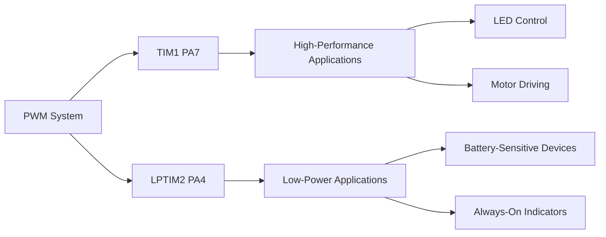
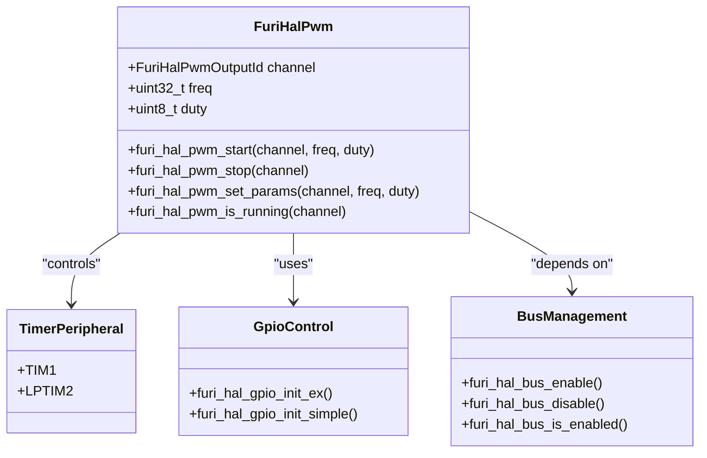
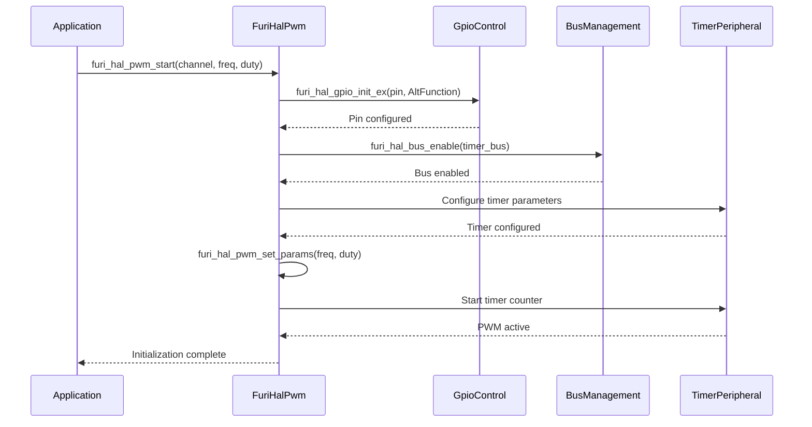
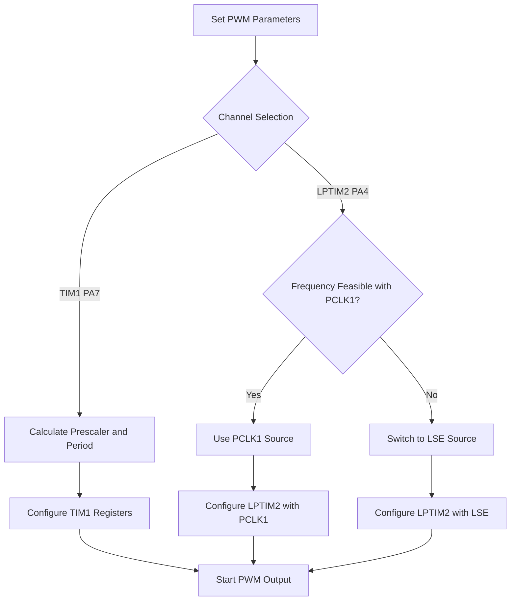
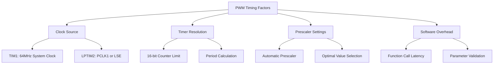
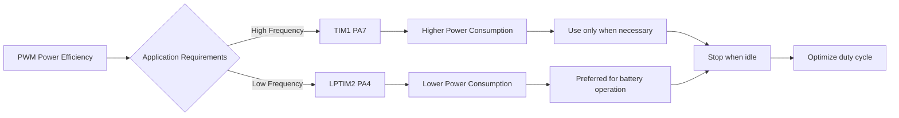

# PWM Specifications

<cite>
**Referenced Files in This Document**   
- [furi_hal_pwm.h](file://targets/f7/furi_hal/furi_hal_pwm.h#L1-L51)
- [furi_hal_pwm.c](file://targets/f7/furi_hal/furi_hal_pwm.c#L1-L146)
- [furi_hal_resources.h](file://targets/f7/furi_hal/furi_hal_resources.h#L1-L233)
- [furi_hal_bus.h](file://targets/f7/furi_hal/furi_hal_bus.h#L1-L113)
</cite>

## Table of Contents
1. [Introduction](#introduction)
2. [PWM Hardware Overview](#pwm-hardware-overview)
3. [PWM Driver Architecture](#pwm-driver-architecture)
4. [Initialization and Configuration](#initialization-and-configuration)
5. [Frequency and Resolution Analysis](#frequency-and-resolution-analysis)
6. [Output Voltage Levels](#output-voltage-levels)
7. [Practical Implementation Examples](#practical-implementation-examples)
8. [Timing Accuracy and Limitations](#timing-accuracy-and-limitations)
9. [Power Efficiency Considerations](#power-efficiency-considerations)

## Introduction
This document provides comprehensive technical documentation for the Pulse Width Modulation (PWM) peripheral on the Flipper Zero device. The PWM system enables precise control of various hardware components through duty cycle and frequency modulation. The documentation covers the furi_hal_pwm driver implementation, including initialization sequences, parameter configuration, timer-based operation, and register-level details. Practical applications such as LED brightness control, motor driving, and analog signal generation are discussed, along with timing accuracy, frequency limitations, and power efficiency considerations.

**Section sources**
- [furi_hal_pwm.h](file://targets/f7/furi_hal/furi_hal_pwm.h#L1-L51)
- [furi_hal_pwm.c](file://targets/f7/furi_hal/furi_hal_pwm.c#L1-L146)

## PWM Hardware Overview
The Flipper Zero device implements PWM functionality through two distinct timer peripherals: TIM1 and LPTIM2. These timers provide hardware-based PWM generation with different characteristics and use cases. The PWM outputs are available on specific GPIO pins that have been configured for alternate function operation.

The two PWM channels are:
- **TIM1 Channel 1 on PA7**: High-performance PWM channel using the advanced control timer (TIM1)
- **LPTIM2 Channel on PA4**: Low-power PWM channel using the low-power timer (LPTIM2)

These channels provide flexibility for different application requirements, balancing performance and power consumption. The PA7 and PA4 pins are accessible through the device's expansion header, allowing external components to be connected for various control applications.



**Diagram sources**
- [furi_hal_pwm.h](file://targets/f7/furi_hal/furi_hal_pwm.h#L1-L51)
- [furi_hal_pwm.c](file://targets/f7/furi_hal/furi_hal_pwm.c#L1-L146)
- [furi_hal_resources.h](file://targets/f7/furi_hal/furi_hal_resources.h#L1-L233)

## PWM Driver Architecture
The PWM driver architecture is implemented as a hardware abstraction layer (HAL) that provides a simple interface for PWM control while managing the underlying timer peripherals and GPIO configurations. The driver consists of four primary functions that handle all aspects of PWM operation.

The architecture follows a modular design pattern with clear separation between initialization, parameter setting, and state management. The driver leverages the STM32WB microcontroller's hardware timers and the Flipper Zero's bus management system to ensure proper resource allocation and power management.



**Diagram sources**
- [furi_hal_pwm.h](file://targets/f7/furi_hal/furi_hal_pwm.h#L1-L51)
- [furi_hal_pwm.c](file://targets/f7/furi_hal/furi_hal_pwm.c#L1-L146)

**Section sources**
- [furi_hal_pwm.h](file://targets/f7/furi_hal/furi_hal_pwm.h#L1-L51)
- [furi_hal_pwm.c](file://targets/f7/furi_hal/furi_hal_pwm.c#L1-L146)

## Initialization and Configuration
The PWM initialization process involves configuring both the GPIO pin for alternate function operation and enabling the corresponding timer peripheral. The driver provides a comprehensive initialization sequence that ensures proper hardware setup before PWM generation begins.

### Initialization Sequence
The initialization sequence for PWM channels follows a specific order to ensure reliable operation:



**Diagram sources**
- [furi_hal_pwm.c](file://targets/f7/furi_hal/furi_hal_pwm.c#L1-L146)

### Configuration Functions
The PWM driver provides four main functions for controlling PWM operation:

**:furi_hal_pwm_start**
- **Purpose**: Initialize and start PWM output on specified channel
- **Parameters**: 
  - *channel*: PWM output identifier (FuriHalPwmOutputId)
  - *freq*: Desired frequency in Hz
  - *duty*: Duty cycle as percentage (0-100)
- **Process**: Configures GPIO, enables timer bus, sets timer parameters, and starts counter

**:furi_hal_pwm_stop**
- **Purpose**: Stop PWM output and release resources
- **Parameters**: *channel*: PWM output identifier
- **Process**: Reverts GPIO to analog mode and disables timer bus

**:furi_hal_pwm_set_params**
- **Purpose**: Modify PWM frequency and duty cycle
- **Parameters**: *channel*, *freq*, *duty*
- **Process**: Calculates and applies new timer prescaler, period, and compare values

**:furi_hal_pwm_is_running**
- **Purpose**: Check if PWM channel is active
- **Parameters**: *channel*
- **Return**: Boolean indicating running state

**Section sources**
- [furi_hal_pwm.h](file://targets/f7/furi_hal/furi_hal_pwm.h#L1-L51)
- [furi_hal_pwm.c](file://targets/f7/furi_hal/furi_hal_pwm.c#L1-L146)

## Frequency and Resolution Analysis
The PWM system on the Flipper Zero offers different frequency ranges and resolution characteristics depending on which timer peripheral is used. The frequency range and resolution are determined by the timer's clock source, prescaler values, and counter width.

### TIM1 PA7 Channel
The TIM1 timer operates with a 64MHz clock source derived from the system clock. The frequency range and resolution are calculated as follows:

- **Clock Source**: 64MHz (from APB2 bus)
- **Counter Width**: 16-bit (0xFFFF maximum)
- **Prescaler Range**: 1 to 65536
- **Maximum Frequency**: ~64kHz (when prescaler = 1, period = 1)
- **Minimum Frequency**: ~0.97Hz (when prescaler = 65536, period = 65535)

The resolution at any given frequency is determined by the period value. For example, at 1kHz frequency:
- Period = 64000000 / 1000 = 64000
- Since this exceeds the 16-bit limit, the prescaler is automatically calculated
- Actual period = 64000 / (prescaler + 1)
- Resolution = period / 100 (for 1% duty cycle steps)

### LPTIM2 PA4 Channel
The LPTIM2 timer offers more flexible clocking options and lower power operation:

- **Clock Sources**: PCLK1 (varies) or LSE (32.768kHz)
- **Counter Width**: 16-bit
- **Prescaler Options**: 1, 2, 4, 8, 16, 32, 64, 128
- **Maximum Frequency**: ~8kHz (with PCLK1 source)
- **Minimum Frequency**: ~0.5Hz (with LSE source)

The LPTIM2 implementation includes automatic clock source selection based on the desired frequency. When the requested frequency cannot be achieved with the PCLK1 source and available prescalers, the driver automatically switches to the LSE (32.768kHz) clock source for lower frequency operation.



**Diagram sources**
- [furi_hal_pwm.c](file://targets/f7/furi_hal/furi_hal_pwm.c#L1-L146)

**Section sources**
- [furi_hal_pwm.c](file://targets/f7/furi_hal/furi_hal_pwm.c#L1-L146)

## Output Voltage Levels
The PWM output voltage levels are determined by the GPIO pin's power supply and the device's logic levels. The Flipper Zero operates with a 3.3V logic system, which defines the PWM output characteristics.

**:Voltage Specifications**
- **High Level**: 3.3V (nominal, matches VDD)
- **Low Level**: 0V (ground)
- **Logic Thresholds**: 
  - Input High: > 2.0V
  - Input Low: < 1.0V
- **Drive Strength**: Configured for very high speed operation

The actual output voltage may vary slightly depending on the load conditions and power supply stability. The GPIO pins are configured with push-pull output drivers, providing strong drive capability for both high and low states.

**:Signal Characteristics**
- **Rise Time**: < 10ns (typical)
- **Fall Time**: < 10ns (typical)
- **Output Impedance**: ~25Ω (typical)
- **Maximum Load Current**: 25mA per pin (absolute maximum)

When driving external components, appropriate current limiting resistors should be used to prevent exceeding the GPIO pin's current capabilities. For higher current applications, external driver circuits (such as transistors or motor drivers) should be employed.

**Section sources**
- [furi_hal_pwm.c](file://targets/f7/furi_hal/furi_hal_pwm.c#L1-L146)
- [furi_hal_resources.h](file://targets/f7/furi_hal/furi_hal_resources.h#L1-L233)

## Practical Implementation Examples
The PWM functionality on the Flipper Zero can be applied to various practical applications, including LED control, motor driving, and analog signal generation.

### LED Brightness Control
PWM is commonly used for controlling LED brightness through pulse width modulation. The human eye perceives the average light intensity, allowing smooth brightness control from 0% to 100%.

```c
// Example: Gradual LED brightness increase
void led_fade_example() {
    // Start PWM on PA7 at 1kHz
    furi_hal_pwm_start(FuriHalPwmOutputIdTim1PA7, 1000, 0);
    
    // Gradually increase brightness
    for(uint8_t duty = 0; duty <= 100; duty++) {
        furi_hal_pwm_set_params(FuriHalPwmOutputIdTim1PA7, 1000, duty);
        furi_delay_ms(50); // 50ms per step
    }
    
    // Hold at maximum brightness
    furi_delay_ms(1000);
    
    // Gradually decrease brightness
    for(uint8_t duty = 100; duty >= 0; duty--) {
        furi_hal_pwm_set_params(FuriHalPwmOutputIdTim1PA7, 1000, duty);
        furi_delay_ms(50); // 50ms per step
    }
    
    // Stop PWM
    furi_hal_pwm_stop(FuriHalPwmOutputIdTim1PA7);
}
```

### Motor Speed Control
PWM can control DC motor speed by varying the average voltage applied to the motor. Higher duty cycles result in higher average voltage and faster motor speeds.

```c
// Example: Motor speed control with acceleration profile
void motor_control_example() {
    // Use PA4 for motor control (lower frequency capability)
    furi_hal_pwm_start(FuriHalPwmOutputIdLptim2PA4, 20000, 0);
    
    // Acceleration phase
    for(uint8_t speed = 0; speed <= 80; speed += 5) {
        furi_hal_pwm_set_params(FuriHalPwmOutputIdLptim2PA4, 20000, speed);
        furi_delay_ms(200); // 200ms per speed increment
    }
    
    // Run at 80% speed
    furi_delay_ms(2000);
    
    // Deceleration phase
    for(uint8_t speed = 80; speed >= 0; speed -= 5) {
        furi_hal_pwm_set_params(FuriHalPwmOutputIdLptim2PA4, 20000, speed);
        furi_delay_ms(200); // 200ms per speed decrement
    }
    
    // Stop motor
    furi_hal_pwm_stop(FuriHalPwmOutputIdLptim2PA4);
}
```

### Analog Signal Generation
PWM can generate analog-like signals when combined with a low-pass filter. This technique converts the digital PWM signal into a continuous analog voltage.

```c
// Example: Generate variable analog voltage
void analog_signal_example() {
    // Generate 100Hz signal with varying duty cycle
    furi_hal_pwm_start(FuriHalPwmOutputIdTim1PA7, 100, 50);
    
    // Create sine wave approximation
    const uint8_t sine_wave[] = {50, 60, 70, 79, 87, 92, 95, 97, 98, 99, 99, 98, 97, 95, 92, 87, 79, 70, 60, 50, 40, 30, 21, 13, 8, 5, 3, 2, 1, 1, 2, 3, 5, 8, 13, 21, 30, 40};
    
    while(1) {
        for(int i = 0; i < 38; i++) {
            furi_hal_pwm_set_params(FuriHalPwmOutputIdTim1PA7, 100, sine_wave[i]);
            furi_delay_ms(26); // ~26ms per step for 1Hz output
        }
    }
}
```

**Section sources**
- [furi_hal_pwm.h](file://targets/f7/furi_hal/furi_hal_pwm.h#L1-L51)
- [furi_hal_pwm.c](file://targets/f7/furi_hal/furi_hal_pwm.c#L1-L146)

## Timing Accuracy and Limitations
The timing accuracy of the PWM system is influenced by several factors, including clock source stability, timer resolution, and software overhead.

### Clock Source Stability
The TIM1 timer uses the system clock (64MHz), which is derived from a high-precision oscillator. This provides excellent frequency stability for most applications. The LPTIM2 timer can use either the PCLK1 clock or the LSE (32.768kHz) crystal. The LSE crystal offers good long-term stability but may have slightly higher jitter compared to the main system clock.

### Frequency Limitations
The PWM system has both maximum and minimum frequency limitations based on the timer capabilities:

**:TIM1 PA7 Limitations**
- **Maximum Frequency**: Approximately 64kHz
- **Minimum Frequency**: Approximately 0.97Hz
- **Frequency Resolution**: Limited by 16-bit counter and prescaler

**:LPTIM2 PA4 Limitations**
- **Maximum Frequency**: Approximately 8kHz (with PCLK1)
- **Minimum Frequency**: Approximately 0.5Hz (with LSE)
- **Frequency Resolution**: Enhanced at lower frequencies due to automatic clock source switching

### Duty Cycle Accuracy
The duty cycle accuracy is limited by the timer's counter resolution. At higher frequencies, the period value is smaller, reducing the number of available duty cycle steps. For example:

- At 1kHz: Period ≈ 64000, providing ~640 steps for 0.1% resolution
- At 10kHz: Period ≈ 6400, providing ~64 steps for 1% resolution
- At 50kHz: Period ≈ 1280, providing ~12 steps for 8% resolution

The driver automatically calculates the optimal prescaler and period values to maximize resolution for the requested frequency.



**Diagram sources**
- [furi_hal_pwm.c](file://targets/f7/furi_hal/furi_hal_pwm.c#L1-L146)

**Section sources**
- [furi_hal_pwm.c](file://targets/f7/furi_hal/furi_hal_pwm.c#L1-L146)

## Power Efficiency Considerations
Power efficiency is a critical consideration for battery-powered devices like the Flipper Zero. The PWM system offers different power characteristics depending on the timer peripheral used.

### TIM1 vs LPTIM2 Power Consumption
The two PWM channels have significantly different power profiles:

**:TIM1 PA7 (High-Performance)**
- **Advantages**: Higher frequency capability, better timing precision
- **Disadvantages**: Higher power consumption, requires APB2 bus activation
- **Use Cases**: Applications requiring high-frequency PWM or precise timing

**:LPTIM2 PA4 (Low-Power)**
- **Advantages**: Optimized for low power operation, can operate in low-power modes
- **Disadvantages**: Lower maximum frequency
- **Use Cases**: Battery-sensitive applications, always-on indicators

### Power Management Strategies
Effective power management when using PWM involves several strategies:

1. **Use LPTIM2 for low-frequency applications**: When frequencies below 8kHz are sufficient, LPTIM2 provides better power efficiency.

2. **Stop PWM when not needed**: Always call furi_hal_pwm_stop() when PWM output is no longer required to disable the timer peripheral and reduce power consumption.

3. **Optimize frequency selection**: Use the lowest acceptable frequency for the application, as higher frequencies generally consume more power.

4. **Consider duty cycle impact**: While the PWM signal itself has minimal power difference between duty cycles, the driven load (LED, motor) will consume power proportional to the duty cycle.

### Current Consumption Estimates
Approximate current consumption for PWM operation:
- **TIM1 Active**: ~1-2mA additional current
- **LPTIM2 Active**: ~0.1-0.5mA additional current
- **PWM Stopped**: Negligible additional current

These values are in addition to the current consumed by the external load connected to the PWM output.



**Diagram sources**
- [furi_hal_pwm.c](file://targets/f7/furi_hal/furi_hal_pwm.c#L1-L146)
- [furi_hal_bus.h](file://targets/f7/furi_hal/furi_hal_bus.h#L1-L113)

**Section sources**
- [furi_hal_pwm.c](file://targets/f7/furi_hal/furi_hal_pwm.c#L1-L146)
- [furi_hal_bus.h](file://targets/f7/furi_hal/furi_hal_bus.h#L1-L113)