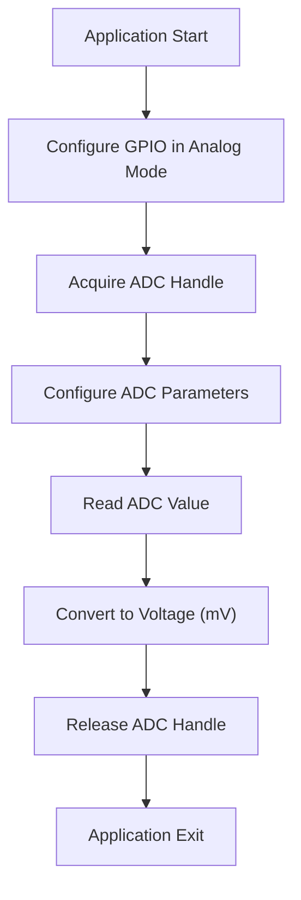
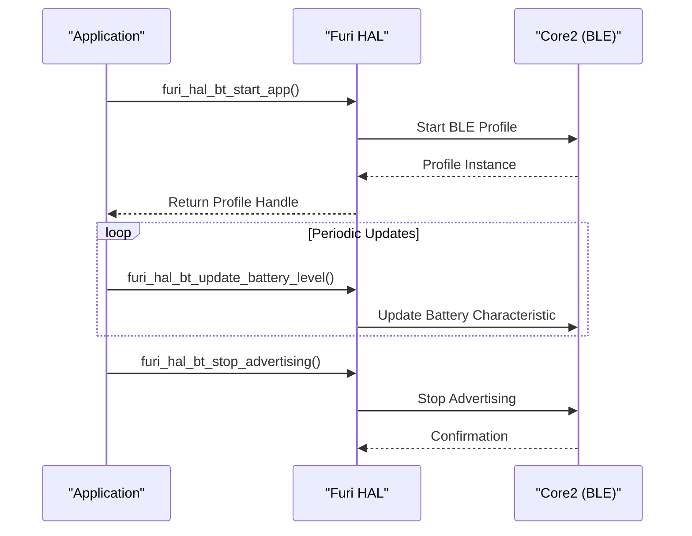
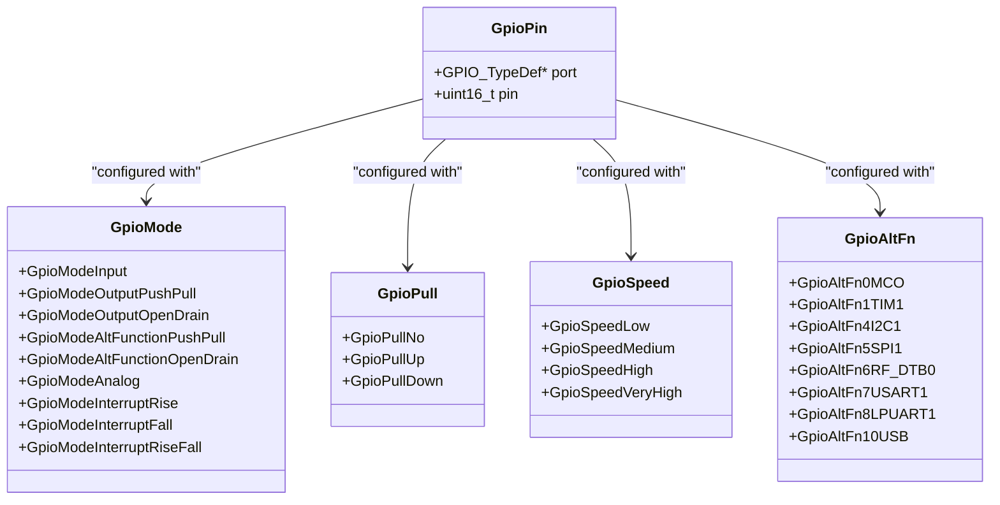
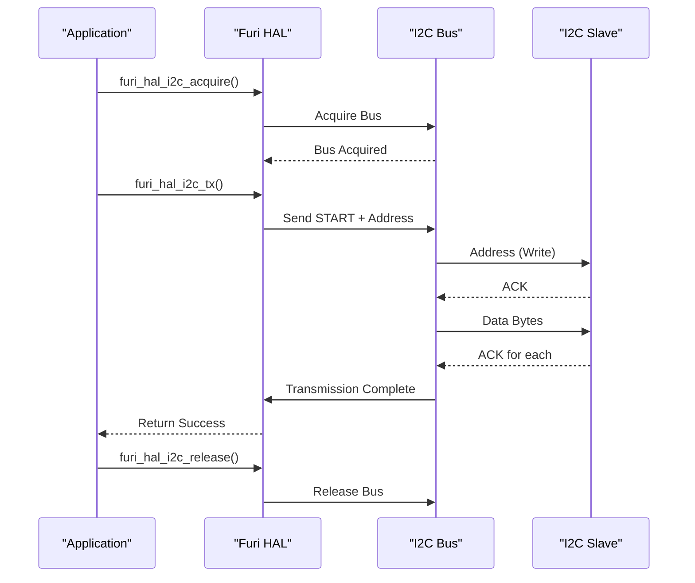
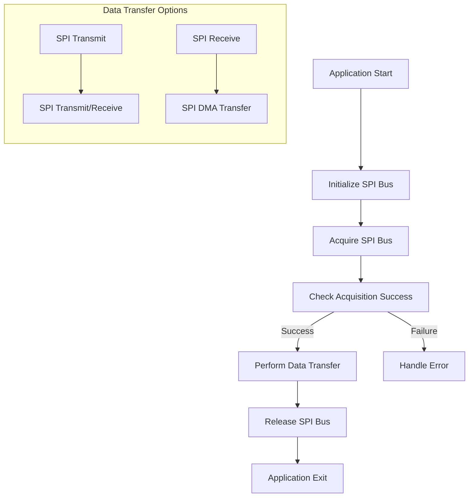
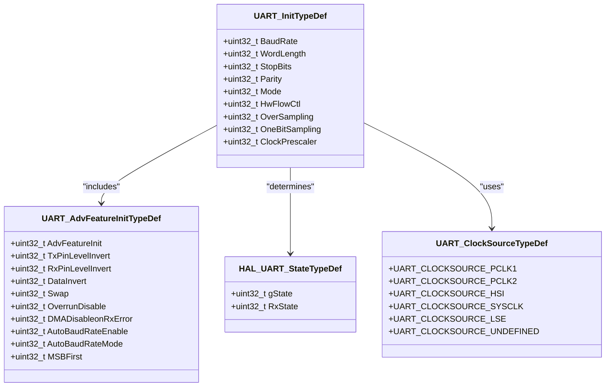
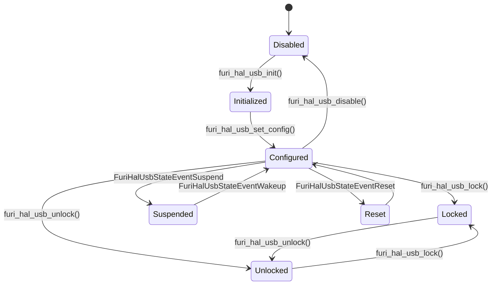
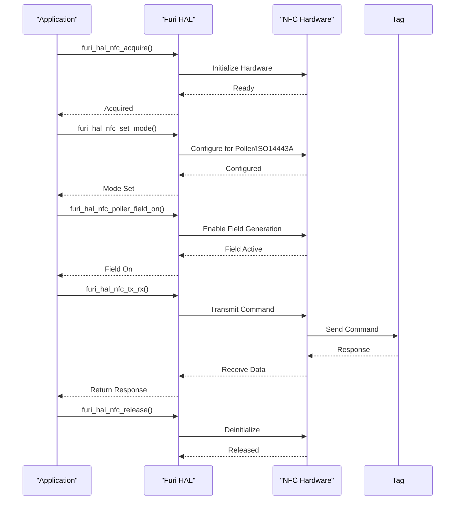
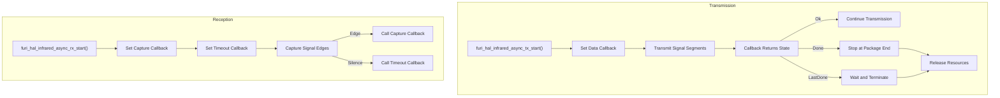

# Peripheral Specifications

<cite>
**Referenced Files in This Document**   
- [furi_hal_adc.h](file://targets/furi_hal_include/furi_hal_adc.h)
- [furi_hal_bt.h](file://targets/furi_hal_include/furi_hal_bt.h)
- [furi_hal_i2c.h](file://targets/furi_hal_include/furi_hal_i2c.h)
- [furi_hal_spi.h](file://targets/furi_hal_include/furi_hal_spi.h)
- [furi_hal_nfc.h](file://targets/furi_hal_include/furi_hal_nfc.h)
- [furi_hal_infrared.h](file://targets/furi_hal_include/furi_hal_infrared.h)
- [furi_hal_usb.h](file://targets/furi_hal_include/furi_hal_usb.h)
- [furi_hal_gpio.h](file://targets/f7/furi_hal/furi_hal_gpio.h)
- [stm32wbxx_hal_uart.h](file://lib/stm32wb_hal/Inc/stm32wbxx_hal_uart.h)
</cite>

## Table of Contents
1. [Introduction](#introduction)
2. [ADC Interface](#adc-interface)
3. [Bluetooth Interface](#bluetooth-interface)
4. [GPIO Interface](#gpio-interface)
5. [I2C Interface](#i2c-interface)
6. [SPI Interface](#spi-interface)
7. [UART Interface](#uart-interface)
8. [USB Interface](#usb-interface)
9. [NFC Interface](#nfc-interface)
10. [Infrared Interface](#infrared-interface)

## Introduction
This document provides comprehensive technical specifications for the peripheral interfaces available on the Flipper Zero device. The documentation covers hardware abstraction layer (HAL) APIs for various communication and sensing peripherals, including ADC, Bluetooth, GPIO, I2C, SPI, UART, USB, NFC, and Infrared. Each section details the electrical characteristics, protocol specifications, configuration options, and operational modes for the respective peripheral. The information is derived from the firmware's hardware abstraction layer headers and provides insight into how these peripherals can be utilized in applications.

## ADC Interface

The Analog-to-Digital Converter (ADC) interface on the Flipper Zero provides 12-bit resolution for analog signal measurement. The ADC subsystem uses an internal voltage reference to ensure measurement accuracy despite power supply fluctuations.

### Electrical Characteristics
- **Resolution**: 12 bits (effective ~10 bits)
- **Voltage Scales**: 2.048V or 2.5V reference
- **Input Impedance**: Should be kept below 10kΩ for optimal oversampling results
- **Sampling Time Options**: 2.5 to 640.5 ADC clock cycles
- **Oversampling Options**: 2x to 256x averaging for noise reduction

### Configuration and Usage
The ADC interface follows a handle-based acquisition pattern:

1. Initialize GPIO pin in `GpioModeAnalog`
2. Acquire ADC handle using `furi_hal_adc_acquire()`
3. Configure ADC parameters with `furi_hal_adc_configure()` or `furi_hal_adc_configure_ex()`
4. Read values using `furi_hal_adc_read()`
5. Release handle with `furi_hal_adc_release()`

The default configuration uses:
- 2.048V scale
- 64MHz synchronous clock
- 64x oversampling
- 247.5 ADC clock sampling time

This configuration provides approximately 260μs conversion time with ~0.1% precision for signals in the 0-2.048V range.

### Channel Configuration
The ADC supports multiple channels:
- **Fast Channels (0-5)**: General purpose analog inputs
- **Slow Channels (6-18)**: Additional analog inputs
- **Special Channels**: 
  - VREFINT: Internal voltage reference for calibration
  - TEMPSENSOR: On-die temperature sensor (requires ≥5μs sampling)
  - VBAT: Battery voltage measurement (requires ≥12μs sampling)

**Diagram sources**
- [furi_hal_adc.h](file://targets/furi_hal_include/furi_hal_adc.h#L1-L230)

**Section sources**
- [furi_hal_adc.h](file://targets/furi_hal_include/furi_hal_adc.h#L1-L230)

## Bluetooth Interface

The Bluetooth/BLE interface on the Flipper Zero provides both standard Bluetooth functionality and specialized debugging/test modes for development and analysis.

### Stack Configuration
The Bluetooth subsystem supports multiple stack configurations:
- **Light Stack**: Minimal functionality for basic operations
- **Full Stack**: Complete BLE/GATT/GAP support
- **Testing Stack**: Specialized for RF testing and analysis

### Key Features
- **Dual-core Architecture**: BLE operations run on a separate core (Core2)
- **Profile Management**: Dynamic switching between different BLE profiles
- **Advertising Control**: Start/stop advertising with configurable parameters
- **Battery Monitoring**: Real-time battery level and charging state updates
- **RF Testing**: Tone transmission and packet transmission testing modes

### API Functions
The interface provides comprehensive control over Bluetooth operations:

- **Initialization**: `furi_hal_bt_init()` - Initializes the Bluetooth subsystem
- **Stack Management**: `furi_hal_bt_start_radio_stack()` - Starts the radio stack
- **Profile Control**: `furi_hal_bt_start_app()` - Starts a BLE application profile
- **State Monitoring**: `furi_hal_bt_is_active()` - Checks if BLE is currently active
- **RF Testing**: `furi_hal_bt_start_tone_tx()` - Initiates tone transmission for testing

The interface also provides NVM (Non-Volatile Memory) access through SRAM2 with hardware semaphore protection for safe concurrent access.

**Diagram sources**
- [furi_hal_bt.h](file://targets/furi_hal_include/furi_hal_bt.h#L1-L298)

**Section sources**
- [furi_hal_bt.h](file://targets/furi_hal_include/furi_hal_bt.h#L1-L298)

## GPIO Interface

The General Purpose Input/Output (GPIO) interface provides low-level control over the Flipper Zero's digital pins with comprehensive configuration options.

### Pin Configuration Options
The GPIO system supports multiple modes and configurations:

**Modes**:
- Input
- Output (Push-Pull or Open-Drain)
- Alternate Function (Push-Pull or Open-Drain)
- Analog
- Interrupt (Rising, Falling, or Both Edges)
- Event (Rising, Falling, or Both Edges)

**Pull Resistors**:
- No Pull
- Pull-Up
- Pull-Down

**Speed Settings**:
- Low
- Medium
- High
- Very High

**Alternate Functions**:
The GPIO pins support multiple alternate functions mapped to hardware peripherals:
- TIM1/TIM2 (Timer channels)
- I2C1/I2C3
- SPI1/SPI2
- USART1/LPUART1
- RF interfaces (CC1101)
- IR transmitter
- USB
- LCD
- EVENTOUT

### API Structure
The GPIO interface uses a structured approach with three initialization functions of increasing complexity:

1. **Simple Initialization**: `furi_hal_gpio_init_simple()` - Basic mode configuration
2. **Normal Initialization**: `furi_hal_gpio_init()` - Mode, pull, and speed configuration
3. **Extended Initialization**: `furi_hal_gpio_init_ex()` - Full configuration including alternate function

Each GPIO pin is represented by a `GpioPin` structure containing:
- **port**: Pointer to the GPIO port register (GPIOA, GPIOB, etc.)
- **pin**: Pin number (0-15)

The interface also supports external interrupt configuration with callback functions for interrupt handling.

**Diagram sources**
- [furi_hal_gpio.h](file://targets/f7/furi_hal/furi_hal_gpio.h#L1-L287)

**Section sources**
- [furi_hal_gpio.h](file://targets/f7/furi_hal/furi_hal_gpio.h#L1-L287)

## I2C Interface

The Inter-Integrated Circuit (I2C) interface provides a robust implementation for communicating with I2C slave devices with support for standard and advanced transaction types.

### Transaction Control
The I2C interface supports three transaction beginning signals:
- **Start**: Begin with START condition
- **Restart**: Begin with RESTART condition (follows previous transaction)
- **Resume**: Continue previous transaction of same type

And three transaction ending signals:
- **Stop**: End with STOP condition
- **AwaitRestart**: End with clock stretching, await restart
- **Pause**: Pause with clock stretching, resume with same type

### Communication Functions
The interface provides several functions for different communication patterns:

**Basic Operations**:
- `furi_hal_i2c_tx()`: Transmit data to slave
- `furi_hal_i2c_rx()`: Receive data from slave
- `furi_hal_i2c_trx()`: Transmit and receive in single transaction

**Extended Operations**:
- `furi_hal_i2c_tx_ext()`: Extended transmit with 10-bit addressing and transaction control
- `furi_hal_i2c_rx_ext()`: Extended receive with 10-bit addressing and transaction control

**Utility Functions**:
- `furi_hal_i2c_is_device_ready()`: Check if device is present and ready
- `furi_hal_i2c_read_reg_8()`: Read 8-bit register value
- `furi_hal_i2c_read_reg_16()`: Read 16-bit register value
- `furi_hal_i2c_write_reg_8()`: Write 8-bit register value
- `furi_hal_i2c_write_reg_16()`: Write 16-bit register value

### Initialization and Resource Management
The I2C interface uses a handle-based system:
1. Initialize with `furi_hal_i2c_init()`
2. Acquire bus handle with `furi_hal_i2c_acquire()`
3. Perform transactions
4. Release handle with `furi_hal_i2c_release()`

This ensures proper resource management and prevents bus conflicts between different components.

**Diagram sources**
- [furi_hal_i2c.h](file://targets/furi_hal_include/furi_hal_i2c.h#L1-L288)

**Section sources**
- [furi_hal_i2c.h](file://targets/furi_hal_include/furi_hal_i2c.h#L1-L288)

## SPI Interface

The Serial Peripheral Interface (SPI) provides high-speed synchronous communication with external devices using a master-slave architecture.

### Bus Configuration
The SPI interface supports:
- Full-duplex and half-duplex communication
- DMA-assisted transfers for large data volumes
- Configurable clock polarity and phase
- Multiple slave selection through software-controlled chip select

### Key Functions
The interface provides a comprehensive set of functions for SPI communication:

**Initialization**:
- `furi_hal_spi_config_init_early()`: Early initialization
- `furi_hal_spi_config_init()`: Normal initialization
- `furi_hal_spi_dma_init()`: DMA initialization

**Bus Management**:
- `furi_hal_spi_bus_init()`: Initialize SPI bus
- `furi_hal_spi_bus_deinit()`: Deinitialize SPI bus
- `furi_hal_spi_acquire()`: Acquire bus access
- `furi_hal_spi_release()`: Release bus access

**Data Transfer**:
- `furi_hal_spi_bus_rx()`: Receive data
- `furi_hal_spi_bus_tx()`: Transmit data
- `furi_hal_spi_bus_trx()`: Transmit and receive simultaneously
- `furi_hal_spi_bus_trx_dma()`: DMA-assisted transmit/receive

### Operational Flow
The typical SPI communication sequence:
1. Initialize the SPI bus
2. Acquire the bus handle
3. Perform one or more data transfers
4. Release the bus handle

The interface uses blocking calls for simplicity, with timeouts to prevent indefinite waiting. For high-performance applications, the DMA-assisted transfer function allows efficient handling of large data blocks without CPU intervention.

**Diagram sources**
- [furi_hal_spi.h](file://targets/furi_hal_include/furi_hal_spi.h#L1-L129)

**Section sources**
- [furi_hal_spi.h](file://targets/furi_hal_include/furi_hal_spi.h#L1-L129)

## UART Interface

The Universal Asynchronous Receiver/Transmitter (UART) interface provides asynchronous serial communication capabilities for the Flipper Zero device.

### Configuration Parameters
The UART interface supports extensive configuration options:

**Core Parameters**:
- Baud Rate: Configurable up to maximum supported by clock source
- Word Length: 7, 8, or 9 data bits
- Stop Bits: 1, 0.5, 2, or 1.5 stop bits
- Parity: None, Even, or Odd
- Mode: Receiver only, Transmitter only, or Both
- Hardware Flow Control: CTS/RTS support

**Advanced Features**:
- Over-sampling: 8x or 16x for improved noise immunity
- One-bit sampling: Single sample or three-sample majority vote
- Clock prescaling: Division of input clock
- Signal inversion: TX/RX pin level inversion
- Data inversion: Logic level inversion
- Pin swapping: TX/RX pin swap
- Auto-baud rate detection
- MSB-first transmission

### Implementation Details
The UART interface is implemented using the STM32WBxx HAL UART driver, which provides:
- Interrupt-driven operation
- DMA support for high-throughput applications
- Error detection and handling (overrun, noise, framing, parity)
- Timeout mechanisms for blocking operations
- Ring buffer support for continuous data streams

The interface supports both standard UART and Low-Power UART (LPUART) peripherals, allowing for flexible power management in battery-operated scenarios.

**Diagram sources**
- [stm32wbxx_hal_uart.h](file://lib/stm32wb_hal/Inc/stm32wbxx_hal_uart.h#L1-L1749)

**Section sources**
- [stm32wbxx_hal_uart.h](file://lib/stm32wb_hal/Inc/stm32wbxx_hal_uart.h#L1-L1749)

## USB Interface

The Universal Serial Bus (USB) interface provides multiple device configurations for different use cases.

### Device Modes
The USB interface supports several predefined device configurations:
- **CDC Single**: Single virtual COM port
- **CDC Dual**: Dual virtual COM ports
- **HID**: Human Interface Device (keyboard, mouse, etc.)
- **HID U2F**: HID with Universal 2nd Factor authentication
- **CCID**: Chip/Smart Card Interface Device

### State Management
The interface provides comprehensive state management:
- **Initialization**: `furi_hal_usb_init()` - Initialize USB hardware
- **Configuration**: `furi_hal_usb_set_config()` - Set device mode
- **State Callbacks**: `furi_hal_usb_set_state_callback()` - Register for state change notifications
- **Locking**: Configuration locking to prevent unwanted mode changes
- **Reinitialization**: `furi_hal_usb_reinit()` - Restart USB subsystem

### Event Handling
The USB interface generates state events for important transitions:
- **Reset**: USB bus reset detected
- **Wakeup**: Resume from suspend mode
- **Suspend**: Entering suspend mode
- **Descriptor Request**: Host requesting device descriptors

These events allow applications to respond appropriately to USB state changes, such as saving power during suspend or reinitializing after a reset.

**Diagram sources**
- [furi_hal_usb.h](file://targets/furi_hal_include/furi_hal_usb.h#L1-L93)

**Section sources**
- [furi_hal_usb.h](file://targets/furi_hal_include/furi_hal_usb.h#L1-L93)

## NFC Interface

The Near Field Communication (NFC) interface provides low-level access to the NFC hardware for implementing various NFC protocols.

### Operating Modes
The NFC interface supports two primary operating modes:
- **Poller Mode**: Act as a reader/initiator
- **Listener Mode**: Act as a tag/target

### Supported Technologies
The interface supports multiple NFC standards:
- **ISO14443A**: Type A contactless smart cards
- **ISO14443B**: Type B contactless smart cards
- **ISO15693**: Vicinity cards (longer range)
- **FeliCa**: Sony's NFC system

### Event System
The NFC interface uses an event-driven architecture with the following events:
- **Oscillator On**: NFC oscillator started
- **Field On/Off**: External field detected/lost
- **Listener Active**: Reader issued wake-up command
- **Transmission Start/End**: TX operations
- **Reception Start/End**: RX operations
- **Collision**: Multiple tags detected
- **Timer Expiration**: FWT or block timer expired
- **Timeout**: No activity for specified period
- **Abort Request**: User requested operation abort

### Power Management
The interface includes power management functions:
- `furi_hal_nfc_low_power_mode_start()`: Enter low-power state
- `furi_hal_nfc_low_power_mode_stop()`: Exit low-power state

These functions allow applications to conserve power when NFC is not actively being used, which is critical for battery-operated devices.

**Diagram sources**
- [furi_hal_nfc.h](file://targets/furi_hal_include/furi_hal_nfc.h#L1-L495)

**Section sources**
- [furi_hal_nfc.h](file://targets/furi_hal_include/furi_hal_nfc.h#L1-L495)

## Infrared Interface

The Infrared (IR) interface provides both transmission and reception capabilities for infrared signals used in remote controls and other applications.

### Transmission System
The IR transmission system uses DMA-driven PWM for precise timing:
- **Frequency Range**: 10kHz to 1MHz
- **Duty Cycle**: Configurable (typically 30-50%)
- **Output Pins**: Internal IR LED or external PA7 pin
- **Asynchronous Operation**: Non-blocking transmission

The transmission system uses callback functions to provide data:
- `FuriHalInfraredTxGetDataISRCallback`: Provides duration and level for next signal segment
- `FuriHalInfraredTxSignalSentISRCallback`: Notifies when signal is sent

### Reception System
The IR reception system captures signal timing with high precision:
- **Capture Callback**: `FuriHalInfraredRxCaptureCallback` - Called on each edge with duration
- **Timeout Callback**: `FuriHalInfraredRxTimeoutCallback` - Called after silence period
- **Configurable Timeout**: Set silence detection threshold in microseconds

### Automatic Detection
The interface includes automatic detection of external IR modules:
- **Detection Method**: Weak pull-up with voltage threshold
- **Threshold**: Module must pull input to ≤0.9V
- **Output Selection**: Automatic or manual pin selection

### Operational States
The interface tracks transmission state through callback return values:
- **Ok**: More data available
- **Done**: End of current package
- **LastDone**: End of package and no more data

**Diagram sources**
- [furi_hal_infrared.h](file://targets/furi_hal_include/furi_hal_infrared.h#L1-L178)

**Section sources**
- [furi_hal_infrared.h](file://targets/furi_hal_include/furi_hal_infrared.h#L1-L178)