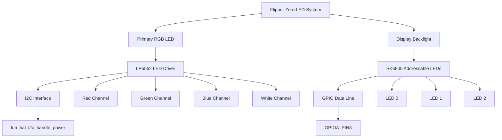
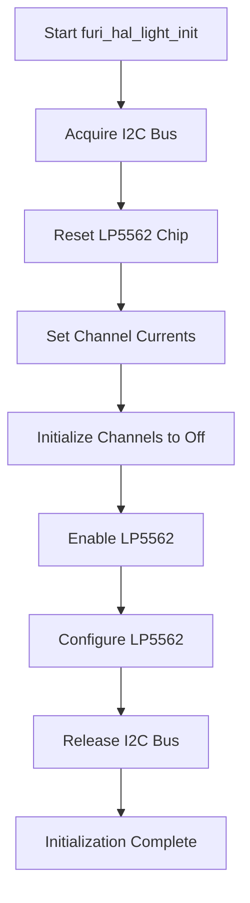
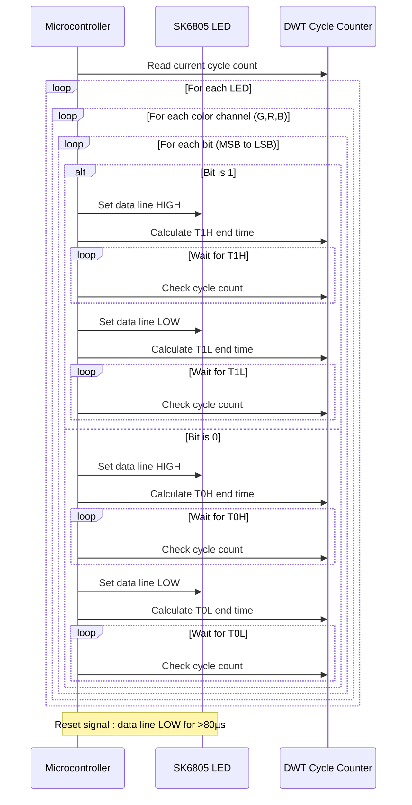

# RGB LED Specifications

<cite>
**Referenced Files in This Document**   
- [furi_hal_light.h](file://targets\furi_hal_include\furi_hal_light.h)
- [furi_hal_light.c](file://targets\f7\furi_hal\furi_hal_light.c)
- [SK6805.h](file://lib\drivers\SK6805.h)
- [SK6805.c](file://lib\drivers\SK6805.c)
</cite>

## Table of Contents
1. [Introduction](#introduction)
2. [LED Hardware Architecture](#led-hardware-architecture)
3. [Color Characteristics and Brightness Levels](#color-characteristics-and-brightness-levels)
4. [Driver Implementation Details](#driver-implementation-details)
5. [SK6805 LED Driver Protocol](#sk6805-led-driver-protocol)
6. [Practical Examples](#practical-examples)
7. [Power Consumption and Thermal Management](#power-consumption-and-thermal-management)
8. [Performance Considerations](#performance-considerations)

## Introduction
This document provides comprehensive technical specifications for the RGB LED (light) peripheral on the Flipper Zero device. The documentation covers the hardware architecture, driver implementation, color characteristics, brightness control, and power requirements. The Flipper Zero features a multi-color LED system that supports both individual RGB color control and white backlight illumination. The system is implemented using two distinct hardware components: the LP5562 LED driver for the main RGB LED and the SK6805 addressable LEDs for the display backlight. This document details the implementation of the furi_hal_light driver, including initialization sequences, color mixing, animation control, and the low-level protocol requirements for the SK6805 LED driver.

**Section sources**
- [furi_hal_light.h](file://targets\furi_hal_include\furi_hal_light.h)
- [furi_hal_light.c](file://targets\f7\furi_hal\furi_hal_light.c)

## LED Hardware Architecture

The Flipper Zero's LED system consists of multiple components working together to provide visual feedback and illumination. The architecture is divided into two main subsystems: the primary RGB LED controlled by the LP5562 driver and the display backlight system using SK6805 addressable LEDs.



**Diagram sources**
- [furi_hal_light.c](file://targets\f7\furi_hal\furi_hal_light.c)
- [SK6805.c](file://lib\drivers\SK6805.c)

**Section sources**
- [furi_hal_light.c](file://targets\f7\furi_hal\furi_hal_light.c)
- [SK6805.c](file://lib\drivers\SK6805.c)

## Color Characteristics and Brightness Levels

The RGB LED system on the Flipper Zero provides precise control over color and brightness through the furi_hal_light driver. The primary RGB LED supports individual control of red, green, and blue channels, allowing for a wide range of color mixing possibilities.

### Color Channels
The LED system exposes four distinct channels through the Light enum (inferred from usage patterns in the code):

- **Red**: Controlled through the LightRed flag
- **Green**: Controlled through the LightGreen flag  
- **Blue**: Controlled through the LightBlue flag
- **White/Backlight**: Controlled through the LightBacklight flag

Each color channel can be set to a brightness value ranging from 0 (off) to 255 (maximum brightness). The brightness values are 8-bit unsigned integers, providing 256 discrete intensity levels for smooth transitions.

### Current Settings
The driver configures specific current levels for each LED channel during initialization to ensure consistent color output and prevent overcurrent conditions:

- **Red LED current**: 50 units
- **Green LED current**: 50 units  
- **Blue LED current**: 50 units
- **White LED current**: 150 units

The higher current setting for the white LED reflects its role as a display backlight, requiring greater luminance than the status indicator RGB LED.

### Color Mixing
Color mixing is achieved by setting different brightness values for the red, green, and blue channels simultaneously. For example:
- **White**: All RGB channels set to maximum brightness
- **Yellow**: Red and green channels at maximum, blue channel off
- **Purple**: Red and blue channels at maximum, green channel off
- **Cyan**: Green and blue channels at maximum, red channel off

The furi_hal_light_set function allows for setting multiple channels at once by combining Light enum values with bitwise OR operations.

**Section sources**
- [furi_hal_light.c](file://targets\f7\furi_hal\furi_hal_light.c#L15-L30)
- [furi_hal_light.h](file://targets\furi_hal_include\furi_hal_light.h#L15-L25)

## Driver Implementation Details

The furi_hal_light driver provides a comprehensive API for controlling the LED system on the Flipper Zero device. The implementation is divided into initialization, direct control, animation control, and sequence execution functionalities.

### Initialization Sequence
The driver initialization process follows a specific sequence to ensure proper configuration of the LP5562 LED driver:



**Diagram sources**
- [furi_hal_light.c](file://targets\f7\furi_hal\furi_hal_light.c#L15-L30)

The initialization function (furi_hal_light_init) performs the following steps:
1. Acquires the I2C bus handle for power-related peripherals
2. Resets the LP5562 LED driver chip
3. Configures the current settings for each LED channel
4. Initializes all channels to zero brightness (off)
5. Enables and configures the LP5562 chip
6. Releases the I2C bus handle

### Direct Control Functions
The driver provides several functions for direct LED control:

#### furi_hal_light_set
This function sets the brightness level for specified LED channels:
```c
void furi_hal_light_set(Light light, uint8_t value);
```
The function acquires the I2C bus, sets the specified channels to the requested brightness value, and releases the bus. When setting the backlight channel, it checks the cfw_settings.rgb_backlight flag to determine whether to use the RGB backlight library or execute a brightness ramp through the LP5562.

#### furi_hal_light_sequence
This function executes a simple text-based sequence for creating lighting effects:
```c
void furi_hal_light_sequence(const char* sequence);
```
The sequence string uses specific characters to control the LEDs:
- **R/r**: Set red LED on/off
- **G/g**: Set green LED on/off  
- **B/b**: Set blue LED on/off
- **W/w**: Set white/backlight on/off
- **.**: 250ms delay
- **-**: 500ms delay

### Animation Control
The driver supports hardware-based blinking animations through the LP5562's built-in engine:

#### furi_hal_light_blink_start
```c
void furi_hal_light_blink_start(Light light, uint8_t brightness, uint16_t on_time, uint16_t period);
```
This function configures the LP5562's Engine2 to create a blinking pattern with the specified parameters:
- **light**: Which LED channels to blink
- **brightness**: Brightness level during the "on" phase
- **on_time**: Duration of the "on" phase in milliseconds
- **period**: Total period of the blink cycle in milliseconds

#### furi_hal_light_blink_stop
Stops any active blinking animation by stopping the LP5562 Engine2 program.

#### furi_hal_light_blink_set_color
Changes the color of an active blinking animation by reconfiguring which channels are controlled by Engine2.

**Section sources**
- [furi_hal_light.c](file://targets\f7\furi_hal\furi_hal_light.c)
- [furi_hal_light.h](file://targets\furi_hal_include\furi_hal_light.h)

## SK6805 LED Driver Protocol

The display backlight system uses SK6805 addressable LEDs, which require a specific timing-based protocol for communication. Unlike the I2C-controlled LP5562, the SK6805 LEDs are controlled through a single GPIO data line using a high-speed bit-banging approach.

### Hardware Interface
The SK6805 driver is connected to GPIOA_PIN8 (GPIOA, pin 8) on the STM32WB microcontroller. The driver uses direct register access and cycle-accurate timing to ensure proper signal generation.

### Protocol Timing Requirements
The SK6805 protocol is a one-wire timing-based protocol where each bit is represented by the duration of high and low signals:

#### Bit 1 Encoding
- **T1H**: 600ns high (approximately 30 CPU cycles at 48MHz)
- **T1L**: 600ns low (approximately 26 CPU cycles at 48MHz)

#### Bit 0 Encoding
- **T0H**: 300ns high (approximately 11 CPU cycles at 48MHz)  
- **T0L**: 900ns low (approximately 43 CPU cycles at 48MHz)

The timing is implemented using the DWT (Data Watchpoint and Trace) unit's cycle counter for precise timing without relying on less accurate delay functions.

### Data Transmission
Each SK6805 LED requires 24 bits of data (8 bits for green, 8 bits for red, and 8 bits for blue). The data is transmitted in GRB (Green-Red-Blue) order, which is different from the standard RGB order.



**Diagram sources**
- [SK6805.c](file://lib\drivers\SK6805.c#L70-L100)

### Driver Functions
The SK6805 driver provides the following API:

#### SK6805_init
Initializes the GPIO pin for output with high speed and sets the initial state to low.

#### SK6805_get_led_count
Returns the number of SK6805 LEDs in the system, defined by the SK6805_LED_COUNT macro (3 LEDs).

#### SK6805_set_led_color
Sets the color for a specific LED by storing the RGB values in a buffer. The color values are automatically reordered from RGB to GRB format required by the SK6805.

#### SK6805_update
Transmits the buffered color data to all SK6805 LEDs. This function:
1. Reinitializes the GPIO pin (ensuring proper timing)
2. Enters a critical section to prevent interruptions
3. Transmits 24 bits for each LED (G, R, B channels)
4. Uses cycle-accurate timing based on the DWT cycle counter

The function uses FURI_CRITICAL_ENTER() and FURI_CRITICAL_EXIT() to disable interrupts during transmission, ensuring timing accuracy.

**Section sources**
- [SK6805.c](file://lib\drivers\SK6805.c)
- [SK6805.h](file://lib\drivers\SK6805.h)

## Practical Examples

This section provides practical examples demonstrating how to use the RGB LED system for various applications.

### Setting Specific Colors
To set the RGB LED to a specific color, use the furi_hal_light_set function with the appropriate channel flags:

```c
// Turn on red LED at half brightness
furi_hal_light_set(LightRed, 128);

// Turn on green and blue LEDs at full brightness (creates cyan)
furi_hal_light_set(LightGreen | LightBlue, 255);

// Turn off all LEDs
furi_hal_light_set(LightRed | LightGreen | LightBlue, 0);
```

### Creating Lighting Effects
The furi_hal_light_sequence function allows for creating simple lighting sequences:

```c
// Create a heartbeat effect
furi_hal_light_sequence("R.r-R.r-R.r-");

// Create a police light effect
furi_hal_light_sequence("R.rG.gB.b-R.rG.gB.b-");

// Fade in and out white backlight
furi_hal_light_sequence("w-W.w-W.w-");
```

### Hardware-Based Blinking
For efficient blinking without CPU intervention, use the hardware blinking functions:

```c
// Start blinking red LED at 50% brightness, 200ms on, 1000ms period
furi_hal_light_blink_start(LightRed, 128, 200, 1000);

// Change blinking color to purple (red + blue)
furi_hal_light_blink_set_color(LightRed | LightBlue);

// Stop blinking
furi_hal_light_blink_stop();
```

### Backlight Control
Control the display backlight using the LightBacklight flag:

```c
// Set backlight to 75% brightness
furi_hal_light_set(LightBacklight, 192);

// Use hardware ramp for smooth brightness transition
// (automatically used when RGB backlight is disabled)
furi_hal_light_set(LightBacklight, 255); // Will ramp from current to 255
```

### SK6805 Backlight Control
Control the addressable backlight LEDs:

```c
// Initialize SK6805 driver
SK6805_init();

// Set first LED to red
SK6805_set_led_color(0, 255, 0, 0);

// Set second LED to green  
SK6805_set_led_color(1, 0, 255, 0);

// Set third LED to blue
SK6805_set_led_color(2, 0, 0, 255);

// Update all LEDs with new colors
SK6805_update();
```

**Section sources**
- [furi_hal_light.c](file://targets\f7\furi_hal\furi_hal_light.c)
- [SK6805.c](file://lib\drivers\SK6805.c)

## Power Consumption and Thermal Management

The RGB LED system on the Flipper Zero has specific power consumption characteristics that must be considered for battery life and thermal management.

### Power Requirements
The LP5562 driver chip operates from the device's power supply and controls the current to each LED channel. The configured current settings determine the power consumption:

- **Red LED**: 50 units of current
- **Green LED**: 50 units of current
- **Blue LED**: 50 units of current
- **White LED**: 150 units of current

The exact current values in milliamps depend on the LP5562's internal current reference and external resistors, but the relative settings show that the white backlight requires three times the current of the individual RGB channels.

### Power Management Features
The driver implements several power-saving features:

1. **I2C Bus Management**: The driver acquires and releases the I2C bus handle around each operation, allowing other peripherals to use the bus when not needed for LED control.

2. **Conditional Backlight Control**: When the RGB backlight feature is enabled (cfw_settings.rgb_backlight), the driver uses the rgb_backlight_update function instead of the LP5562 ramp function, potentially offering more efficient control.

3. **Hardware Animation**: The LP5562's built-in blinking engine allows for hardware-controlled animations without CPU intervention, reducing power consumption compared to software-based blinking.

### Thermal Considerations
While the individual LEDs are low-power surface-mount devices, prolonged operation at maximum brightness could contribute to heat buildup, especially when multiple LEDs are active simultaneously. The white backlight LEDs, operating at higher current, may generate more heat than the status indicator RGB LED.

The system does not appear to implement active thermal management or brightness limiting based on temperature, so applications should consider implementing their own limits for extended high-brightness operation.

**Section sources**
- [furi_hal_light.c](file://targets\f7\furi_hal\furi_hal_light.c)
- [SK6805.c](file://lib\drivers\SK6805.c)

## Performance Considerations

### PWM Frequency and Color Transitions
The LP5562 LED driver uses internal PWM for brightness control, but the specific PWM frequency is not exposed in the furi_hal_light API. The hardware is capable of high-frequency PWM, which ensures flicker-free operation and smooth color transitions.

For smooth brightness transitions, the driver provides the lp5562_execute_ramp function, which creates a linear brightness ramp between two values over a specified time (100ms in the current implementation). This hardware-based ramping ensures consistent transition speed regardless of CPU load.

### SK6805 Timing Constraints
The SK6805 protocol has strict timing requirements that affect system performance:

1. **Interrupt Disabling**: The SK6805_update function disables interrupts during data transmission to ensure timing accuracy, which can affect real-time performance and responsiveness.

2. **CPU Utilization**: The bit-banging implementation uses busy-wait loops with cycle counting, consuming CPU cycles during transmission. For 3 LEDs requiring 72 bits total, this represents a significant CPU investment for each update.

3. **Transmission Time**: At approximately 48MHz CPU speed, each bit transmission takes about 1.2 microseconds for "1" bits and 1.5 microseconds for "0" bits, resulting in a total transmission time of approximately 86.4 microseconds for 3 LEDs.

### Optimization Recommendations
1. **Minimize SK6805 Updates**: Only call SK6805_update when LED colors have actually changed to reduce CPU usage and power consumption.

2. **Use Hardware Blinking**: For simple blinking patterns, use furi_hal_light_blink_start instead of software timers and repeated furi_hal_light_set calls.

3. **Batch Color Changes**: When changing multiple LED colors, set all colors with SK6805_set_led_color first, then call SK6805_update once.

4. **Consider Power Implications**: Be mindful of the higher current draw of the white backlight channel when designing battery-powered applications.

**Section sources**
- [furi_hal_light.c](file://targets\f7\furi_hal\furi_hal_light.c)
- [SK6805.c](file://lib\drivers\SK6805.c)