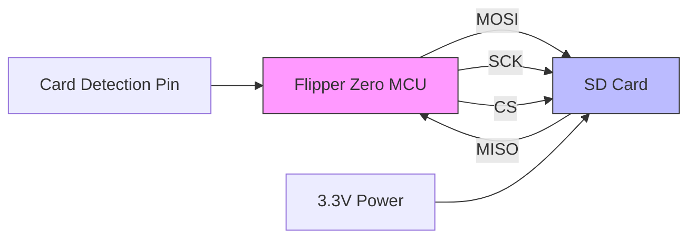
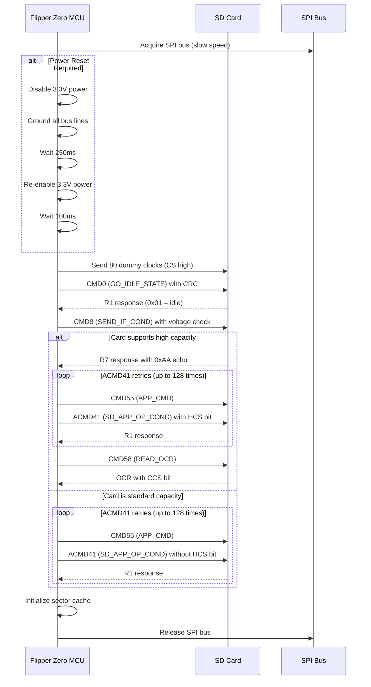
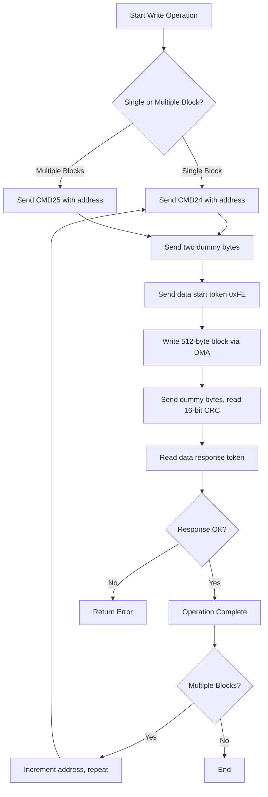
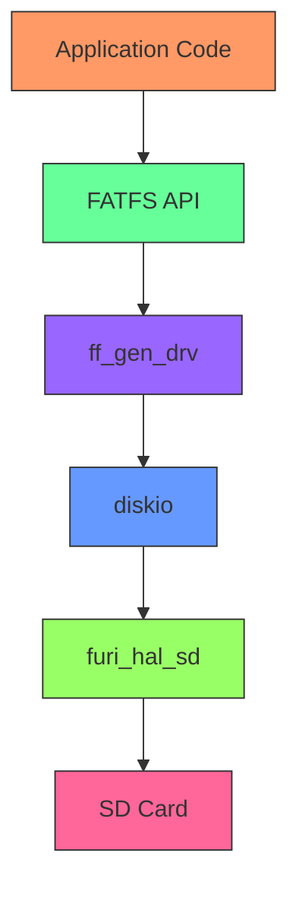

# SD Card Specifications

<cite>
**Referenced Files in This Document**   
- [furi_hal_sd.h](file://targets\furi_hal_include\furi_hal_sd.h)
- [furi_hal_sd.c](file://targets\f7\furi_hal\furi_hal_sd.c)
- [ff.h](file://lib\fatfs\ff.h)
- [diskio.h](file://lib\fatfs\diskio.h)
- [ff_gen_drv.h](file://lib\fatfs\ff_gen_drv.h)
- [storage_sd_api.c](file://applications\services\storage\storage_sd_api.c)
- [storage.h](file://applications\services\storage\storage.h)
</cite>

## Table of Contents
1. [Introduction](#introduction)
2. [SD Card Interface Specifications](#sd-card-interface-specifications)
3. [Driver Implementation](#driver-implementation)
4. [FATFS Integration](#fatfs-integration)
5. [File System Operations](#file-system-operations)
6. [Practical Examples](#practical-examples)
7. [Reliability and Power Considerations](#reliability-and-power-considerations)
8. [Conclusion](#conclusion)

## Introduction
The Flipper Zero device features an SD card interface that enables expandable storage for applications, data logging, and file management. This document provides comprehensive technical documentation for the SD card peripheral, covering interface specifications, driver implementation, FATFS integration, and practical usage examples. The SD card system is implemented using a SPI-based interface with robust error handling and performance optimization features.

**Section sources**
- [furi_hal_sd.h](file://targets\furi_hal_include\furi_hal_sd.h)
- [furi_hal_sd.c](file://targets\f7\furi_hal\furi_hal_sd.c)

## SD Card Interface Specifications

### Supported Card Types and Capacity
The Flipper Zero supports SDHC (Secure Digital High Capacity) cards with capacities up to 32GB. The device uses the SPI mode of operation rather than the native SD mode, which simplifies the hardware interface but limits maximum data transfer rates. The system can also work with standard SDSC (Standard Capacity) cards, automatically detecting and configuring the appropriate communication protocol based on the card's capabilities.

The maximum theoretical capacity is determined by the FAT32 file system limitations, which support volumes up to 2TB, though practical limitations of available SDHC cards cap this at 32GB. The system automatically detects whether a card is SDHC/SDXC (high capacity) or SDSC (standard capacity) during initialization and adjusts addressing accordingly.

### Physical Interface
The SD card communicates with the Flipper Zero via a 4-wire SPI interface consisting of:
- **MOSI (Master Out Slave In)**: Data from Flipper Zero to SD card
- **MISO (Master In Slave Out)**: Data from SD card to Flipper Zero
- **SCK (Serial Clock)**: Clock signal generated by Flipper Zero
- **CS (Chip Select)**: Active-low selection signal

Additionally, a card detection pin (SD_CD) is used to detect the presence of an SD card in the slot. This pin is configured as an input with a pull-up resistor, and the card holder connects it to ground when a card is inserted.

### Electrical and Timing Specifications
The SD card interface operates at 3.3V logic levels, with the Flipper Zero providing power to the SD card through a dedicated power control circuit. The SPI bus operates at different speeds depending on the operation:
- **Initialization**: 400 kHz (slow speed) for card detection and initialization
- **Normal operation**: Up to 18 MHz (fast speed) for read/write operations

The system implements proper timing requirements for SD card communication, including:
- 80 dummy clock cycles after power-up before sending commands
- Appropriate guard times (10μs) before and after chip select transitions
- Command response timeout of 1 second
- Data transfer timeout scaling with block count



**Diagram sources**
- [furi_hal_sd.c](file://targets\f7\furi_hal\furi_hal_sd.c#L200-L300)
- [furi_hal_sd.h](file://targets\furi_hal_include\furi_hal_sd.h)

**Section sources**
- [furi_hal_sd.h](file://targets\furi_hal_include\furi_hal_sd.h)
- [furi_hal_sd.c](file://targets\f7\furi_hal\furi_hal_sd.c)

## Driver Implementation

### Initialization Sequence
The SD card driver initialization follows the standard SD card SPI mode initialization procedure with several optimization and error recovery features. The initialization sequence is implemented in the `furi_hal_sd_init()` function and proceeds as follows:

1. **Hardware Setup**: Acquire the SPI bus and configure the SD card SPI handle
2. **Power Management**: If requested, perform a power reset by disabling 3.3V power, grounding all bus lines, then re-enabling power
3. **Dummy Clocks**: Send 80 dummy clock cycles with CS high to synchronize the card
4. **Mode Detection**: Send CMD0 (GO_IDLE_STATE) to reset the card to SPI mode
5. **Interface Check**: Send CMD8 (SEND_IF_COND) to determine if the card supports high capacity (SDHC/SDXC)
6. **Initialization Loop**: Execute ACMD41 (SD_APP_OP_COND) in a loop until the card exits idle state
7. **OCR Reading**: For high-capacity cards, read the OCR (Operating Conditions Register) to confirm high-capacity support
8. **Sector Cache**: Initialize the sector cache for performance optimization



**Diagram sources**
- [furi_hal_sd.c](file://targets\f7\furi_hal\furi_hal_sd.c#L900-L1000)

**Section sources**
- [furi_hal_sd.c](file://targets\f7\furi_hal\furi_hal_sd.c)

### Command Protocol
The SD card driver implements a comprehensive command protocol that follows the SD specification for SPI mode operation. Each command is transmitted as a 6-byte frame consisting of:
- **Start bit (1 bit)**: Always 0
- **Transmission bit (1 bit)**: Always 1
- **Command index (6 bits)**: Command number (0-63)
- **Argument (32 bits)**: Command-specific parameter
- **CRC7 (7 bits)**: Cyclic Redundancy Check
- **End bit (1 bit)**: Always 1

The driver supports the following key commands:
- **CMD0 (GO_IDLE_STATE)**: Reset card to idle state
- **CMD8 (SEND_IF_COND)**: Check voltage and interface conditions
- **CMD9 (SEND_CSD)**: Read Card Specific Data register
- **CMD10 (SEND_CID)**: Read Card Identification register
- **CMD16 (SET_BLOCKLEN)**: Set block length (512 bytes)
- **CMD17 (READ_SINGLE_BLOCK)**: Read a single data block
- **CMD18 (READ_MULTIPLE_BLOCK)**: Read multiple data blocks
- **CMD24 (WRITE_SINGLE_BLOCK)**: Write a single data block
- **CMD25 (WRITE_MULTIPLE_BLOCK)**: Write multiple data blocks
- **CMD58 (READ_OCR)**: Read Operating Conditions Register

The command response varies by command type:
- **R1**: Single byte response with status flags
- **R2**: Two byte response (R1 + additional status)
- **R3**: Five byte response (R1 + OCR)
- **R7**: Five byte response (R1 + interface conditions)

### Data Transfer Modes
The SD card driver implements both single-block and multiple-block data transfer modes with DMA (Direct Memory Access) support for improved performance. All data transfers use a fixed block size of 512 bytes, which is standard for SD cards.

#### Read Operations
Read operations follow this sequence:
1. Send CMD17 (READ_SINGLE_BLOCK) or CMD18 (READ_MULTIPLE_BLOCK) with the block address
2. Wait for the data start token (0xFE)
3. Read the 512-byte data block using DMA
4. Read and discard the 16-bit CRC
5. For multiple blocks, repeat until all blocks are read
6. Send CMD12 (STOP_TRANSMISSION) to terminate multiple block read

The driver implements a sector cache to optimize read performance. Single-sector reads first check the cache, and if the data is present, it is returned immediately without accessing the SD card. After a successful read, the data is stored in the cache for future access.

#### Write Operations
Write operations follow this sequence:
1. Send CMD24 (WRITE_SINGLE_BLOCK) or CMD25 (WRITE_MULTIPLE_BLOCK) with the block address
2. Send two dummy bytes for timing
3. Send the data start token (0xFE)
4. Write the 512-byte data block using DMA
5. Send dummy bytes and read the 16-bit CRC
6. Read the data response token to verify successful write
7. For multiple blocks, repeat until all blocks are written
8. Send the stop token (0xFD) to terminate multiple block write

Before any write operation, the driver invalidates the corresponding sectors in the cache to maintain data consistency. The driver also implements write error recovery by monitoring the data response token and retrying failed operations.



**Diagram sources**
- [furi_hal_sd.c](file://targets\f7\furi_hal\furi_hal_sd.c#L600-L800)

**Section sources**
- [furi_hal_sd.c](file://targets\f7\furi_hal\furi_hal_sd.c)

## FATFS Integration

### Architecture Overview
The FATFS integration in the Flipper Zero firmware follows a layered architecture that separates the low-level SD card driver from the high-level file system operations. This architecture consists of three main layers:

1. **Hardware Abstraction Layer (HAL)**: `furi_hal_sd` module that handles direct communication with the SD card via SPI
2. **Disk I/O Layer**: FATFS `diskio` module that provides a standardized interface for block device operations
3. **File System Layer**: FATFS core module that implements the FAT12/FAT16/FAT32 file system logic

The integration is facilitated by the `ff_gen_drv` generic driver layer, which acts as a bridge between FATFS and the underlying storage drivers. This design allows the system to support multiple storage devices while maintaining a consistent file system interface.



**Diagram sources**
- [ff_gen_drv.h](file://lib\fatfs\ff_gen_drv.h)
- [diskio.h](file://lib\fatfs\diskio.h)
- [furi_hal_sd.c](file://targets\f7\furi_hal\furi_hal_sd.c)

**Section sources**
- [ff_gen_drv.h](file://lib\fatfs\ff_gen_drv.h)
- [diskio.h](file://lib\fatfs\diskio.h)

### Disk I/O Interface
The disk I/O interface is defined in `diskio.h` and provides the following functions that must be implemented by storage drivers:

- **disk_initialize()**: Initialize the physical drive
- **disk_status()**: Get the status of the drive
- **disk_read()**: Read one or more sectors
- **disk_write()**: Write one or more sectors
- **disk_ioctl()**: Perform device-specific control operations

The Flipper Zero implements these functions by mapping them to the corresponding `furi_hal_sd` functions:

```c
DSTATUS disk_initialize(BYTE pdrv) {
    if (pdrv != 0) return STA_NOINIT;
    return (DSTATUS)furi_hal_sd_init(false);
}

DRESULT disk_read(BYTE pdrv, BYTE* buff, DWORD sector, UINT count) {
    if (pdrv != 0) return RES_PARERR;
    FuriStatus status = furi_hal_sd_read_blocks((uint32_t*)buff, sector, count);
    return (DRESULT)(status == FuriStatusOk ? RES_OK : RES_ERROR);
}
```

The driver also implements several IOCTL (I/O control) commands that provide additional functionality:
- **CTRL_SYNC**: Ensure all pending writes are completed
- **GET_SECTOR_COUNT**: Get the total number of sectors on the card
- **GET_SECTOR_SIZE**: Get the sector size (always 512 bytes)
- **MMC_GET_CSD**: Get the Card Specific Data register
- **MMC_GET_CID**: Get the Card Identification register

### Driver Registration
The SD card driver is registered with the FATFS system using the `FATFS_LinkDriver()` function, which connects the driver implementation to a logical drive letter. In the Flipper Zero system, the SD card is typically assigned the drive letter "S:".

The driver registration process involves:
1. Defining a `Diskio_drvTypeDef` structure with function pointers to the driver implementation
2. Calling `FATFS_LinkDriver()` to register the driver with a drive path
3. Mounting the file system using `f_mount()`

This registration process allows the FATFS system to route file operations to the appropriate physical device based on the drive letter in the file path.

## File System Operations

### Supported File System Types
The Flipper Zero SD card system supports the following file system types:
- **FAT12**: For small capacity cards (typically < 32MB)
- **FAT16**: For medium capacity cards (typically 32MB to 2GB)
- **FAT32**: For high capacity cards (typically 2GB to 32GB)

The system automatically detects the file system type during the mount process by examining the partition boot sector. The FAT32 file system is recommended for SDHC cards as it provides the best compatibility and performance.

### File Operations
The FATFS library provides a comprehensive API for file system operations, which are accessible through the standard FATFS functions. The most commonly used operations include:

#### File Management
- **f_open()**: Open or create a file with specified access mode
- **f_close()**: Close an open file and flush any pending writes
- **f_read()**: Read data from a file
- **f_write()**: Write data to a file
- **f_lseek()**: Move the file pointer to a specified position
- **f_truncate()**: Truncate a file at the current position
- **f_sync()**: Flush cached data to ensure it is written to the card

#### Directory Operations
- **f_opendir()**: Open a directory for reading
- **f_readdir()**: Read the next directory entry
- **f_mkdir()**: Create a new directory
- **f_unlink()**: Delete a file or directory
- **f_rename()**: Rename or move a file or directory

#### File Information
- **f_stat()**: Get information about a file or directory
- **f_getfree()**: Get the number of free clusters on the drive
- **f_getlabel()**: Get the volume label
- **f_chmod()**: Change file attributes (read-only, hidden, etc.)

### Error Handling
The FATFS system returns detailed error codes through the `FRESULT` enumeration, which helps diagnose issues with file operations:

- **FR_OK**: Operation completed successfully
- **FR_DISK_ERR**: Low-level disk I/O error
- **FR_NOT_READY**: Physical drive cannot work
- **FR_NO_FILE**: File not found
- **FR_NO_PATH**: Path not found
- **FR_DENIED**: Access denied
- **FR_WRITE_PROTECTED**: Drive is write-protected
- **FR_INVALID_DRIVE**: Logical drive number is invalid
- **FR_NOT_ENABLED**: Volume has no work area
- **FR_NO_FILESYSTEM**: No valid FAT volume found

The system implements robust error recovery for SD card operations, including automatic reinitialization and retry logic when communication errors occur.

## Practical Examples

### Mounting an SD Card
To mount an SD card and make it available for file operations, use the following code:

```c
#include "ff.h"
#include "storage.h"

FATFS fs;
FRESULT result;

// Mount the SD card
result = f_mount(&fs, "S:", 1);
if (result == FR_OK) {
    FURI_LOG_I("SD", "SD card mounted successfully");
} else {
    FURI_LOG_E("SD", "Failed to mount SD card: %d", result);
}
```

The second parameter of `f_mount()` specifies the mount option:
- **0**: Do not mount the volume now
- **1**: Mount the volume immediately
- **2**: Mount the volume and force a full scan

### Reading a File
To read data from a file on the SD card:

```c
#include "ff.h"

FIL file;
FRESULT result;
UINT bytes_read;
char buffer[256];

// Open the file for reading
result = f_open(&file, "S:/test.txt", FA_READ);
if (result == FR_OK) {
    // Read data from the file
    result = f_read(&file, buffer, sizeof(buffer), &bytes_read);
    if (result == FR_OK) {
        FURI_LOG_I("SD", "Read %d bytes: %s", bytes_read, buffer);
    }
    
    // Close the file
    f_close(&file);
} else {
    FURI_LOG_E("SD", "Failed to open file: %d", result);
}
```

### Writing a File
To write data to a file on the SD card:

```c
#include "ff.h"

FIL file;
FRESULT result;
UINT bytes_written;
const char* data = "Hello, Flipper Zero!";

// Open the file for writing (create if it doesn't exist)
result = f_open(&file, "S:/log.txt", FA_WRITE | FA_OPEN_ALWAYS);
if (result == FR_OK) {
    // Move to the end of the file for appending
    f_lseek(&file, f_size(&file));
    
    // Write data to the file
    result = f_write(&file, data, strlen(data), &bytes_written);
    if (result == FR_OK) {
        FURI_LOG_I("SD", "Wrote %d bytes to file", bytes_written);
        
        // Ensure data is written to the card
        f_sync(&file);
    }
    
    // Close the file
    f_close(&file);
} else {
    FURI_LOG_E("SD", "Failed to open file: %d", result);
}
```

### Directory Listing
To list files in a directory:

```c
#include "ff.h"

DIR dir;
FILINFO file_info;
FRESULT result;

// Open the root directory
result = f_opendir(&dir, "S:/");
if (result == FR_OK) {
    // Read each file in the directory
    while (1) {
        result = f_readdir(&dir, &file_info);
        if (result != FR_OK || file_info.fname[0] == 0) {
            break; // No more files or error
        }
        
        if (file_info.fname[0] != '.') {
            if (file_info.fattrib & AM_DIR) {
                FURI_LOG_I("SD", "DIR: %s", file_info.fname);
            } else {
                FURI_LOG_I("SD", "FILE: %s (%lu bytes)", 
                          file_info.fname, file_info.fsize);
            }
        }
    }
    
    // Close the directory
    f_closedir(&dir);
} else {
    FURI_LOG_E("SD", "Failed to open directory: %d", result);
}
```

### Handling Card Insertion/Removal
The system provides functions to detect SD card presence and handle insertion/removal events:

```c
#include "furi_hal_sd.h"

// Check if SD card is present
if (furi_hal_sd_is_present()) {
    FURI_LOG_I("SD", "SD card is inserted");
    
    // Get SD card information
    FuriHalSdInfo info;
    if (furi_hal_sd_info(&info) == FuriStatusOk) {
        FURI_LOG_I("SD", "Capacity: %llu bytes", info.capacity);
        FURI_LOG_I("SD", "Manufacturer: %s", info.oem_id);
        FURI_LOG_I("SD", "Product: %s", info.product_name);
    }
} else {
    FURI_LOG_I("SD", "SD card is not inserted");
}
```

## Reliability and Power Considerations

### Reliability Features
The SD card implementation includes several reliability features to ensure data integrity and robust operation:

#### Error Recovery
The driver implements comprehensive error recovery mechanisms:
- **Automatic Reinitialization**: When a read or write operation fails, the driver automatically attempts to reinitialize the SD card up to 10 times (configurable via `furi_hal_sd_max_mount_retry_count()`)
- **Power Cycling**: Every other retry includes a power reset of the SD card to recover from persistent errors
- **Sector Cache**: A sector cache improves read performance and reduces wear on the SD card by minimizing redundant reads

#### Data Integrity
The system ensures data integrity through:
- **CRC Checking**: All commands and data transfers include CRC validation
- **Write Verification**: After write operations, the driver checks the data response token to confirm successful writing
- **Synchronization**: The `f_sync()` function ensures all cached data is written to the card before returning

### Wear Leveling
While the FAT32 file system itself does not implement wear leveling, the SD card's internal controller typically includes wear leveling algorithms. The Flipper Zero system does not implement additional wear leveling at the firmware level, relying on the SD card's built-in mechanisms. However, the system minimizes unnecessary writes by:
- Using a sector cache to reduce redundant reads
- Batching small writes when possible
- Avoiding frequent updates to file metadata

### Power Consumption
The SD card interface is designed to minimize power consumption, which is critical for a battery-powered device:

#### Power States
The system implements several power management features:
- **Dynamic Clock Scaling**: Uses slow speed (400kHz) for initialization and fast speed (up to 18MHz) only during active data transfer
- **Power Gating**: Can completely disable 3.3V power to the SD card when not in use
- **Low Power SPI**: Configures SPI pins with appropriate drive strength to minimize power consumption

#### Power Consumption Characteristics
Typical power consumption values:
- **Idle (card present)**: ~0.5mA (primarily from pull-up resistors)
- **Active Read/Write**: 20-50mA depending on data transfer rate
- **Power-Off**: 0mA (when 3.3V power is disabled)

The system automatically powers down the SD card when it is not being accessed for an extended period, and reinitializes it when needed. This significantly extends battery life during typical usage patterns where the SD card is accessed intermittently.

## Conclusion
The SD card implementation in the Flipper Zero provides a robust and reliable storage solution with comprehensive support for standard SDHC cards up to 32GB. The system uses a well-structured layered architecture with the furi_hal_sd driver providing low-level SPI communication, integrated with the FATFS file system through a standardized disk I/O interface.

Key features of the implementation include:
- Support for SDHC cards with automatic high-capacity detection
- Robust initialization sequence with error recovery
- Sector caching for improved read performance
- Comprehensive FATFS integration with standard file operations
- Automatic retry and reinitialization for improved reliability
- Power management features to minimize battery consumption

The API provides a familiar interface for developers accustomed to FATFS, making it easy to implement file-based applications on the Flipper Zero platform. The combination of hardware reliability features and software error handling ensures data integrity even in challenging operating conditions.