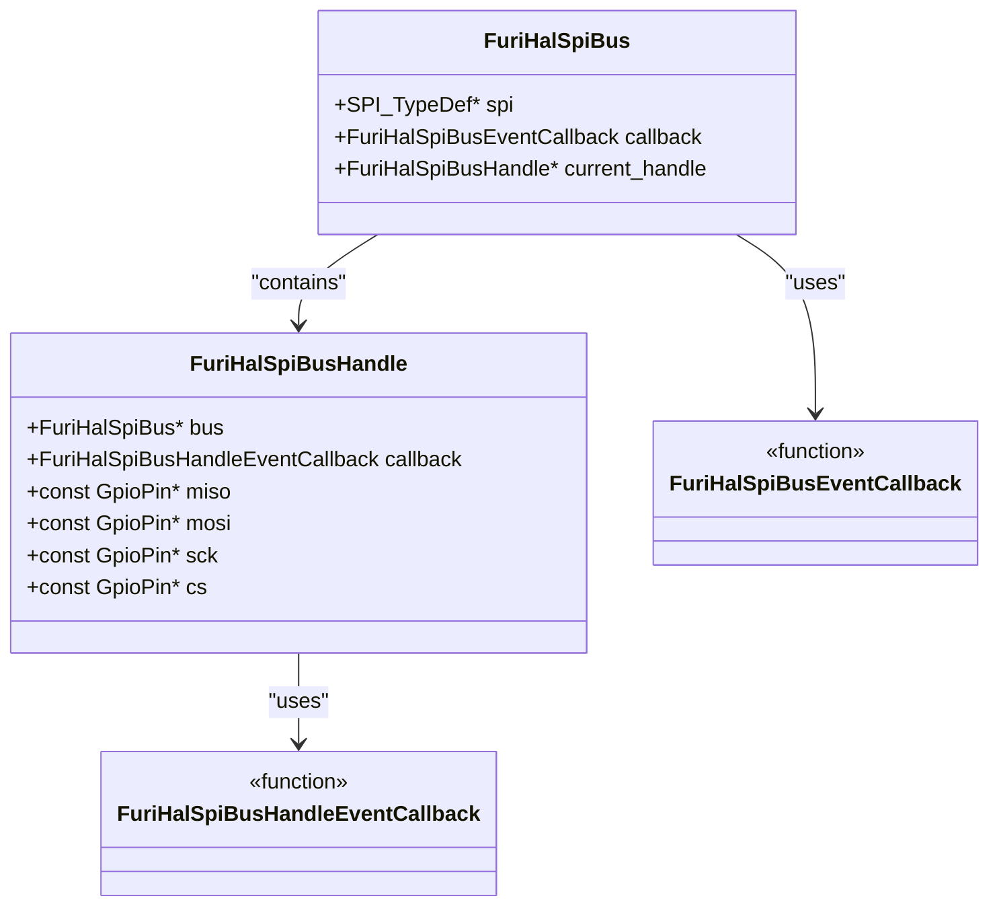
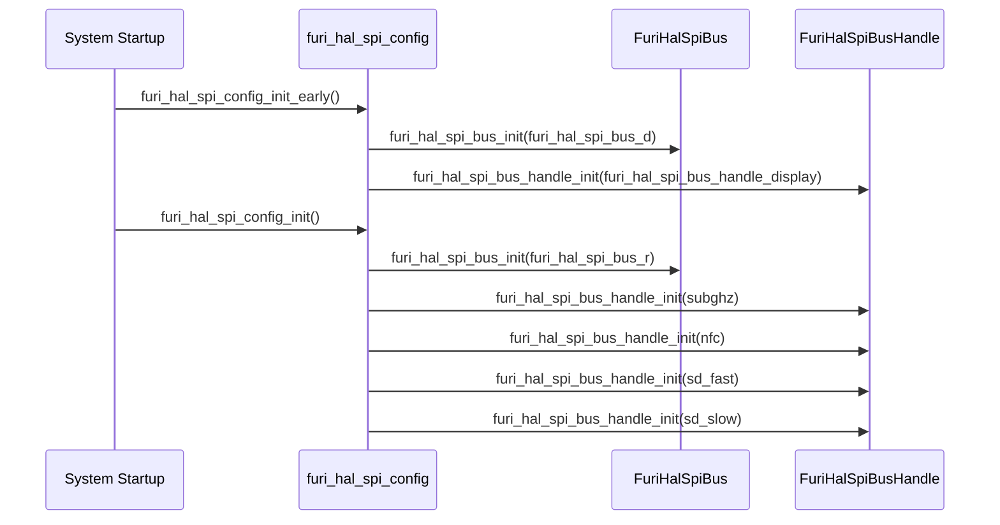
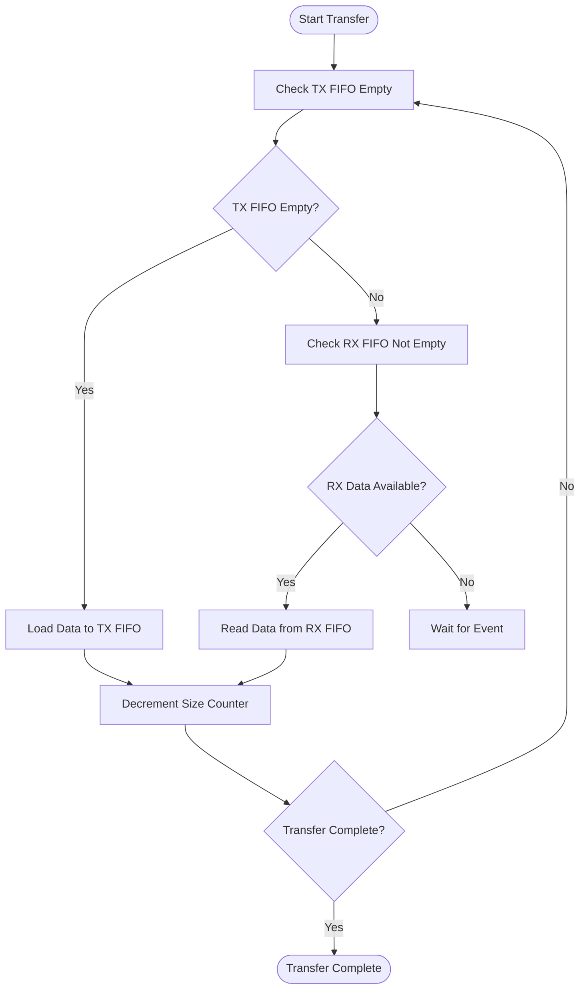

# SPI Specifications

<cite>
**Referenced Files in This Document**   
- [furi_hal_spi.h](file://targets/furi_hal_include/furi_hal_spi.h)
- [furi_hal_spi.c](file://targets/f7/furi_hal/furi_hal_spi.c)
- [furi_hal_spi_types.h](file://targets/f7/furi_hal/furi_hal_spi_types.h)
- [furi_hal_spi_config.c](file://targets/f7/furi_hal/furi_hal_spi_config.c)
- [furi_hal_spi_config.h](file://targets/f7/furi_hal/furi_hal_spi_config.h)
</cite>

## Table of Contents
1. [Introduction](#introduction)
2. [SPI Clock Speeds](#spi-clock-speeds)
3. [Data Frame Formats](#data-frame-formats)
4. [Electrical Characteristics](#electrical-characteristics)
5. [furi_hal_spi Driver Implementation](#furi_hal_spi-driver-implementation)
6. [Initialization Sequences](#initialization-sequences)
7. [Clock Polarity and Phase Configurations](#clock-polarity-and-phase-configurations)
8. [Master/Slave Operation Modes](#masterslave-operation-modes)
9. [Register-Level Configuration](#register-level-configuration)
10. [Data Transfer Protocols](#data-transfer-protocols)
11. [Practical Examples](#practical-examples)
12. [Signal Integrity Considerations](#signal-integrity-considerations)

## Introduction
The Serial Peripheral Interface (SPI) on the Flipper Zero device provides a high-speed synchronous serial communication interface for connecting various peripherals such as sensors, displays, and storage devices. This document details the SPI specifications, implementation, and usage patterns within the Flipper Zero firmware. The SPI implementation is based on the STM32WB microcontroller's hardware SPI peripherals with a layered software architecture that provides both low-level register access and high-level abstractions for application development.

**Section sources**
- [furi_hal_spi.h](file://targets/furi_hal_include/furi_hal_spi.h#L1-L129)

## SPI Clock Speeds
The Flipper Zero supports multiple SPI clock speeds through configurable baud rate prescalers. The available clock speeds are implemented as predefined presets in the firmware, allowing for optimized communication with different peripherals. The SPI clock speeds are derived from the system clock with various prescaler values.

The following SPI clock speed presets are available:

- **8 MHz**: Implemented with `LL_SPI_BAUDRATEPRESCALER_DIV8`
- **4 MHz**: Implemented with `LL_SPI_BAUDRATEPRESCALER_DIV16`
- **16 MHz**: Implemented with `LL_SPI_BAUDRATEPRESCALER_DIV2`
- **2 MHz**: Implemented with `LL_SPI_BAUDRATEPRESCALER_DIV32`

These presets are defined in the `furi_hal_spi_config.c` file and are used to configure specific peripherals based on their requirements. For example, the SD card can operate in both fast mode (16 MHz) and slow mode (2 MHz), while the display typically operates at 4 MHz.

The actual SPI clock frequency is determined by dividing the peripheral clock by the selected prescaler value. The STM32WB SPI peripheral supports the following prescaler values: DIV2, DIV4, DIV8, DIV16, DIV32, DIV64, DIV128, and DIV256, providing a wide range of possible clock frequencies.

**Section sources**
- [furi_hal_spi_config.c](file://targets/f7/furi_hal/furi_hal_spi_config.c#L17-L69)
- [furi_hal_spi_config.h](file://targets/f7/furi_hal/furi_hal_spi_config.h#L10-L24)

## Data Frame Formats
The Flipper Zero SPI implementation supports standard 8-bit data frames, which is the most common configuration for SPI communication. The data frame format is configured through the `DataWidth` parameter in the SPI initialization structure.

Key data frame characteristics:
- **Data width**: 8 bits (configured with `LL_SPI_DATAWIDTH_8BIT`)
- **Bit order**: MSB first (configured with `LL_SPI_MSB_FIRST`)
- **Frame format**: Standard SPI frame with no additional protocol overhead

The 8-bit data width is consistent across all SPI presets, ensuring compatibility with the majority of SPI peripherals. The MSB-first bit order is the default configuration and is suitable for most applications.

The data frame format is implemented in the `LL_SPI_InitTypeDef` structure, which contains all the necessary parameters for configuring the SPI peripheral. The data width is set to 8-bit in all predefined presets, as shown in the configuration code:

```c
.DataWidth = LL_SPI_DATAWIDTH_8BIT,
```

This configuration ensures that each SPI transaction transfers one byte of data per clock cycle, with the most significant bit transmitted first.

**Section sources**
- [furi_hal_spi_config.c](file://targets/f7/furi_hal/furi_hal_spi_config.c#L13-L70)
- [furi_hal_spi_types.h](file://targets/f7/furi_hal/furi_hal_spi_types.h#L10-L11)

## Electrical Characteristics
The electrical characteristics of the SPI interface on the Flipper Zero are determined by the STM32WB microcontroller's GPIO capabilities and the board's physical design. The SPI signals operate at 3.3V logic levels, which is standard for modern microcontrollers and compatible with most SPI peripherals.

Key electrical characteristics:
- **Voltage levels**: 3.3V CMOS logic
- **GPIO speed**: Very high speed (configured with `GpioSpeedVeryHigh`)
- **Pull resistors**: Configured per peripheral requirements (pull-up, pull-down, or no pull)
- **Output type**: Push-pull for all SPI signals

The GPIO pins used for SPI communication are configured with very high speed to support the maximum clock frequencies. The pull resistor configuration varies depending on the specific peripheral and bus requirements:

- **MISO (Master In Slave Out)**: Typically no pull or pull-down depending on the bus
- **MOSI (Master Out Slave In)**: Typically no pull or pull-down
- **SCK (Serial Clock)**: Typically no pull or pull-down
- **CS (Chip Select)**: Typically pull-up for active-low configuration

The external SPI pins (PA4, PA6, PA7, PB3, PC3) are designed to interface with external devices and may require appropriate level shifting when connecting to 5V systems. The internal peripherals (display, SD card, NFC, Sub-GHz) are all designed to operate at 3.3V and do not require level shifting.

**Section sources**
- [furi_hal_spi_config.c](file://targets/f7/furi_hal/furi_hal_spi_config.c#L220-L225)
- [furi_hal_spi_config.c](file://targets/f7/furi_hal/furi_hal_spi_config.c#L245-L250)

## furi_hal_spi Driver Implementation
The furi_hal_spi driver provides a comprehensive software interface for SPI communication on the Flipper Zero device. The driver is implemented as a layered architecture that abstracts the hardware details while providing efficient access to the SPI peripherals.

The driver architecture consists of several key components:
- **SPI Bus**: Represents a physical SPI peripheral (SPI1 or SPI2)
- **SPI Bus Handle**: Represents a specific peripheral connected to a bus
- **Event callbacks**: Handle bus state transitions and GPIO configuration
- **Transaction functions**: Perform data transfer operations

The driver uses a handle-based system where each peripheral has its own bus handle that encapsulates the configuration and GPIO pins. This allows multiple peripherals to share the same SPI bus while maintaining their individual configurations.

The driver implementation includes both polling and DMA-based transfer methods. The DMA functionality is particularly important for high-speed transfers such as SD card operations, where CPU efficiency is critical.



**Diagram sources**
- [furi_hal_spi_types.h](file://targets/f7/furi_hal/furi_hal_spi_types.h#L30-L62)
- [furi_hal_spi.c](file://targets/f7/furi_hal/furi_hal_spi.c#L50-L70)

**Section sources**
- [furi_hal_spi.c](file://targets/f7/furi_hal/furi_hal_spi.c#L0-L379)
- [furi_hal_spi_types.h](file://targets/f7/furi_hal/furi_hal_spi_types.h#L0-L62)

## Initialization Sequences
The SPI subsystem on the Flipper Zero follows a well-defined initialization sequence during system startup. The initialization process ensures that the SPI buses and their associated peripherals are properly configured before use.

The initialization sequence consists of the following steps:

1. **Early initialization**: Called before the scheduler starts
2. **Main initialization**: Called during normal system initialization
3. **Bus initialization**: Configures the SPI hardware and mutexes
4. **Handle initialization**: Configures individual peripheral handles

The initialization is performed through dedicated functions:
- `furi_hal_spi_config_init_early()`: Initializes display SPI bus
- `furi_hal_spi_config_init()`: Initializes radio SPI bus and all peripheral handles

During early initialization, the display SPI bus (SPI2) is set up to support early display functionality. The main initialization then configures the radio SPI bus (SPI1) and initializes all peripheral handles including Sub-GHz, NFC, SD card (both fast and slow modes), and external SPI.

The bus initialization process includes:
- Creating a mutex for bus access control
- Setting the current handle to NULL
- Configuring the event callback for bus state management

The event callback system allows for custom actions during bus state transitions, such as enabling/disabling the SPI peripheral clock and acquiring/releasing the bus mutex.



**Diagram sources**
- [furi_hal_spi_config.c](file://targets/f7/furi_hal/furi_hal_spi_config.c#L200-L215)
- [furi_hal_spi_config.c](file://targets/f7/furi_hal/furi_hal_spi_config.c#L217-L230)

**Section sources**
- [furi_hal_spi_config.c](file://targets/f7/furi_hal/furi_hal_spi_config.c#L200-L230)

## Clock Polarity and Phase Configurations
The Flipper Zero supports multiple SPI modes through configurable clock polarity (CPOL) and clock phase (CPHA) settings. These configurations determine the SPI mode according to the standard SPI mode numbering convention.

The available clock polarity and phase configurations are:

- **Mode 0 (CPOL=0, CPHA=0)**: Clock polarity low, clock phase 1-edge
- **Mode 3 (CPOL=0, CPHA=1)**: Clock polarity low, clock phase 2-edge

All SPI presets on the Flipper Zero use clock polarity low (`LL_SPI_POLARITY_LOW`). The clock phase varies depending on the peripheral:

- **Mode 0**: Used for CC1101 (Sub-GHz), display, SD card, and external SPI
- **Mode 3**: Used for ST25R3916 (NFC)

The clock polarity and phase are configured in the `LL_SPI_InitTypeDef` structure:

```c
.ClockPolarity = LL_SPI_POLARITY_LOW,
.ClockPhase = LL_SPI_PHASE_1EDGE, // Mode 0
// or
.ClockPhase = LL_SPI_PHASE_2EDGE, // Mode 3
```

Mode 0 (CPHA=0) samples data on the first clock edge, while Mode 3 (CPHA=1) samples data on the second clock edge. The choice of mode is determined by the requirements of the connected peripheral. For example, the ST25R3916 NFC controller requires Mode 3 operation, while most other peripherals use Mode 0.

The clock polarity setting determines the idle state of the clock line. With CPOL=0, the clock line is low when idle, which is the most common configuration.

**Section sources**
- [furi_hal_spi_config.c](file://targets/f7/furi_hal/furi_hal_spi_config.c#L14-L15)
- [furi_hal_spi_config.c](file://targets/f7/furi_hal/furi_hal_spi_config.c#L27-L28)

## Master/Slave Operation Modes
The Flipper Zero SPI implementation operates exclusively in master mode. The device initiates all SPI transactions and controls the clock signal (SCK) and chip select (CS) lines.

Key characteristics of the master mode implementation:
- **Mode**: Master (`LL_SPI_MODE_MASTER`)
- **NSS (Chip Select)**: Software managed (`LL_SPI_NSS_SOFT`)
- **Transfer direction**: Full duplex (`LL_SPI_FULL_DUPLEX`)

The master mode is configured in all SPI presets:

```c
.Mode = LL_SPI_MODE_MASTER,
.NSS = LL_SPI_NSS_SOFT,
.TransferDirection = LL_SPI_FULL_DUPLEX,
```

The software-managed chip select allows for flexible control of multiple peripherals on the same bus. The CS line is controlled by GPIO operations in the bus handle event callbacks, rather than using the hardware NSS functionality.

The full duplex configuration enables simultaneous transmission and reception of data, which is the standard SPI operation mode. This allows for efficient communication where data can be exchanged in both directions during the same clock cycles.

Although the hardware supports slave mode, the Flipper Zero firmware does not implement or use SPI slave functionality. All SPI communication is initiated by the Flipper Zero as the master device.

**Section sources**
- [furi_hal_spi_config.c](file://targets/f7/furi_hal/furi_hal_spi_config.c#L13-L14)
- [furi_hal_spi_config.c](file://targets/f7/furi_hal/furi_hal_spi_config.c#L26-L27)

## Register-Level Configuration
The SPI peripheral on the Flipper Zero is configured at the register level using the STM32WB Low-Layer (LL) API. The configuration is performed through the `LL_SPI_Init()` function, which sets the appropriate register values based on the `LL_SPI_InitTypeDef` structure.

Key registers and their configurations:

- **SPI_CR1 (Control Register 1)**: Configured with mode, baud rate, clock polarity/phase, and data width
- **SPI_CR2 (Control Register 2)**: Configured with NSS mode and RX FIFO threshold
- **SPI_SR (Status Register)**: Monitored for TXE, RXNE, and BSY flags during data transfer
- **SPI_DR (Data Register)**: Used for data transmission and reception

The initialization process configures the following key parameters:

```c
LL_SPI_InitTypeDef spi_init = {
    .Mode = LL_SPI_MODE_MASTER,
    .TransferDirection = LL_SPI_FULL_DUPLEX,
    .DataWidth = LL_SPI_DATAWIDTH_8BIT,
    .ClockPolarity = LL_SPI_POLARITY_LOW,
    .ClockPhase = LL_SPI_PHASE_1EDGE,
    .NSS = LL_SPI_NSS_SOFT,
    .BaudRate = LL_SPI_BAUDRATEPRESCALER_DIV8,
    .BitOrder = LL_SPI_MSB_FIRST,
    .CRCCalculation = LL_SPI_CRCCALCULATION_DISABLE,
    .CRCPoly = 7,
};
```

Additionally, the RX FIFO threshold is set to quarter level:

```c
LL_SPI_SetRxFIFOThreshold(spi, LL_SPI_RX_FIFO_TH_QUARTER);
```

The DMA channels are also configured for high-speed transfers, with DMA2 Channel 6 for RX and Channel 7 for TX.

The register-level configuration ensures optimal performance and direct hardware control, while the higher-level abstractions provide ease of use for application developers.

**Section sources**
- [furi_hal_spi_config.c](file://targets/f7/furi_hal/furi_hal_spi_config.c#L13-L70)
- [furi_hal_spi.c](file://targets/f7/furi_hal/furi_hal_spi.c#L150-L160)

## Data Transfer Protocols
The Flipper Zero implements several data transfer protocols for SPI communication, supporting both polling and DMA-based operations. The protocols are designed to be efficient and reliable for various use cases.

The main data transfer functions are:

- **furi_hal_spi_bus_rx()**: Receive data from SPI
- **furi_hal_spi_bus_tx()**: Transmit data to SPI
- **furi_hal_spi_bus_trx()**: Simultaneous transmit and receive
- **furi_hal_spi_bus_trx_dma()**: DMA-based transmit and receive

The polling-based transfer functions use a state machine approach to manage the SPI FIFOs:



For DMA transfers, the protocol involves:
1. Configuring DMA channels for TX and RX
2. Setting up interrupt service routine for completion detection
3. Enabling DMA requests on the SPI peripheral
4. Starting DMA transfer
5. Waiting for completion semaphore
6. Cleaning up DMA configuration

The transfer functions include timeout parameters to prevent infinite blocking, although the current implementation has a FIXME comment indicating that the timeout is not fully implemented.

The data transfer protocols are designed to be thread-safe through the use of bus acquisition and release mechanisms, ensuring that only one peripheral can use the bus at a time.

**Diagram sources**
- [furi_hal_spi.c](file://targets/f7/furi_hal/furi_hal_spi.c#L100-L150)

**Section sources**
- [furi_hal_spi.c](file://targets/f7/furi_hal/furi_hal_spi.c#L80-L200)

## Practical Examples
This section provides practical examples demonstrating how to communicate with SPI peripherals on the Flipper Zero device.

### Basic SPI Communication Example
```c
// Acquire the SPI bus for a specific peripheral
furi_hal_spi_acquire(&furi_hal_spi_bus_handle_subghz);

// Transmit data to the peripheral
uint8_t tx_data[] = {0x01, 0x02, 0x03};
bool success = furi_hal_spi_bus_tx(
    &furi_hal_spi_bus_handle_subghz,
    tx_data,
    sizeof(tx_data),
    100 // 100ms timeout
);

// Receive data from the peripheral
uint8_t rx_data[3];
success = furi_hal_spi_bus_rx(
    &furi_hal_spi_bus_handle_subghz,
    rx_data,
    sizeof(rx_data),
    100 // 100ms timeout
);

// Release the SPI bus
furi_hal_spi_release(&furi_hal_spi_bus_handle_subghz);
```

### Full Duplex Communication Example
```c
// Perform simultaneous transmit and receive
uint8_t tx_buffer[] = {0x01, 0x02, 0x03};
uint8_t rx_buffer[3];

furi_hal_spi_acquire(&furi_hal_spi_bus_handle_nfc);

bool success = furi_hal_spi_bus_trx(
    &furi_hal_spi_bus_handle_nfc,
    tx_buffer,
    rx_buffer,
    sizeof(tx_buffer),
    100 // 100ms timeout
);

furi_hal_spi_release(&furi_hal_spi_bus_handle_nfc);
```

### Using External SPI Pins
```c
// Initialize the external SPI handle (not initialized by default)
furi_hal_spi_bus_handle_init(&furi_hal_spi_bus_handle_external);

// Use the external SPI interface
furi_hal_spi_acquire(&furi_hal_spi_bus_handle_external);

uint8_t data = 0x55;
furi_hal_spi_bus_tx(&furi_hal_spi_bus_handle_external, &data, 1, 100);

furi_hal_spi_release(&furi_hal_spi_bus_handle_external);
```

### DMA-Based High-Speed Transfer
```c
// For large data transfers, DMA is automatically used when the scheduler is running
furi_hal_spi_acquire(&furi_hal_spi_bus_handle_sd_fast);

// This will use DMA if the scheduler is running
uint8_t large_buffer[512];
bool success = furi_hal_spi_bus_trx_dma(
    &furi_hal_spi_bus_handle_sd_fast,
    tx_buffer,
    rx_buffer,
    sizeof(large_buffer),
    1000 // 1 second timeout
);

furi_hal_spi_release(&furi_hal_spi_bus_handle_sd_fast);
```

These examples demonstrate the typical usage patterns for SPI communication on the Flipper Zero, including proper bus management with acquire/release calls and appropriate error handling.

**Section sources**
- [furi_hal_spi.c](file://targets/f7/furi_hal/furi_hal_spi.c#L50-L200)
- [furi_hal_spi_config.h](file://targets/f7/furi_hal/furi_hal_spi_config.h#L50-L70)

## Signal Integrity Considerations
Signal integrity is crucial for reliable SPI communication, especially at higher clock speeds. The Flipper Zero design incorporates several features to ensure good signal integrity.

### Maximum Cable Lengths
The maximum cable length for reliable SPI communication depends on the clock speed and environmental conditions:

- **16 MHz**: Up to 10 cm (4 inches) recommended
- **8 MHz**: Up to 15 cm (6 inches) recommended
- **4 MHz**: Up to 25 cm (10 inches) recommended
- **2 MHz**: Up to 50 cm (20 inches) recommended

These recommendations assume proper PCB layout and minimal electromagnetic interference. Longer cables may require signal conditioning or lower clock speeds.

### Noise Immunity Characteristics
The SPI interface on the Flipper Zero has the following noise immunity characteristics:

- **Differential signaling**: Not used (single-ended signals)
- **Termination resistors**: Not implemented on external pins
- **Shielding**: Not provided for external connections
- **Grounding**: Common ground between devices is essential

To improve noise immunity:
1. Keep SPI traces as short as possible
2. Use twisted pairs for longer runs (SCK with GND)
3. Provide a solid ground plane
4. Avoid running SPI lines parallel to high-speed digital signals
5. Use shielded cables for external connections

### External Connection Guidelines
When connecting external SPI devices:

1. **Power supply**: Ensure both devices share a common ground and compatible voltage levels
2. **Pull-up resistors**: May be needed on CS lines (typically 4.7kΩ to 10kΩ)
3. **Decoupling capacitors**: Place 100nF capacitors near the power pins of external devices
4. **Signal routing**: Route SCK, MOSI, and CS together, with MISO potentially requiring special attention due to direction

The external SPI pins (PA4, PA6, PA7, PB3, PC3) are designed for moderate-speed communication with external devices. For high-speed or long-distance communication, consider using level shifters and proper signal conditioning.

**Section sources**
- [furi_hal_spi_config.c](file://targets/f7/furi_hal/furi_hal_spi_config.c#L220-L225)
- [furi_hal_spi_config.c](file://targets/f7/furi_hal/furi_hal_spi_config.c#L245-L250)