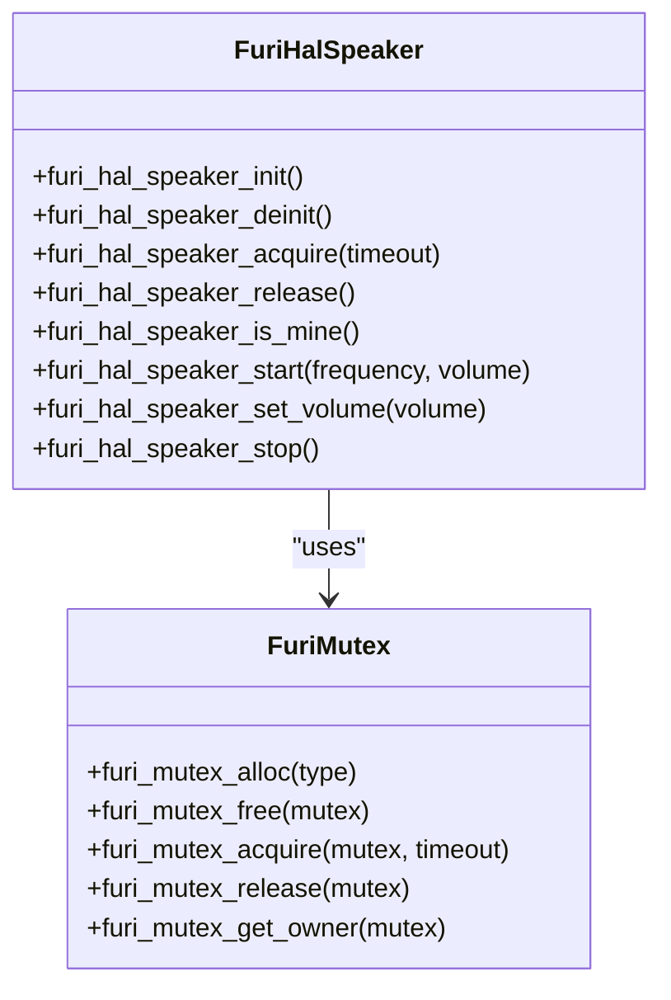
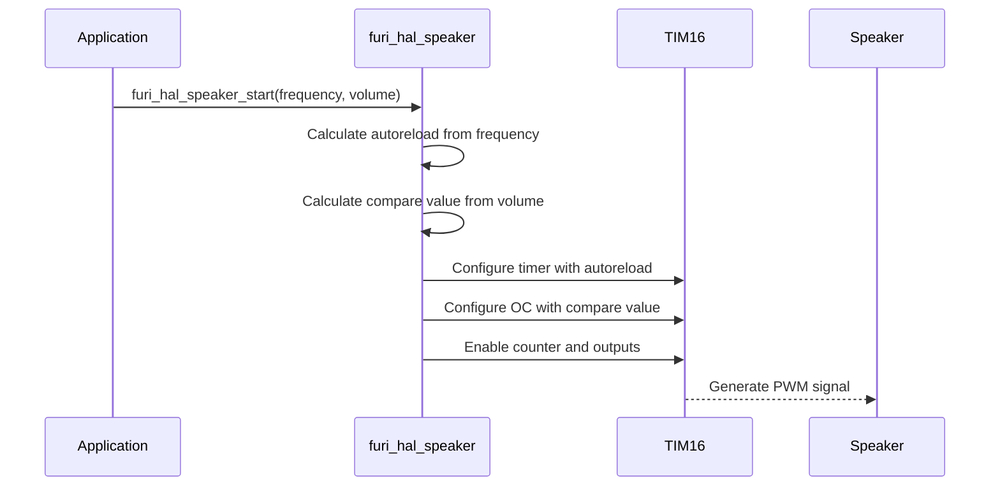
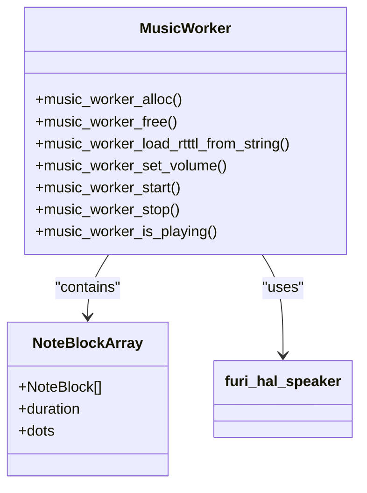

# Speaker Specifications

<cite>
**Referenced Files in This Document**   
- [furi_hal_speaker.c](file://targets/f7/furi_hal/furi_hal_speaker.c#L0-L140)
- [furi_hal_speaker.h](file://targets/furi_hal_include/furi_hal_speaker.h#L0-L69)
- [speaker_debug.c](file://applications/debug/speaker_debug/speaker_debug.c#L0-L122)
- [music_worker.c](file://lib/music_worker/music_worker.c#L0-L508)
- [music_worker.h](file://lib/music_worker/music_worker.h#L0-L38)
- [notification_app.c](file://applications/services/notification/notification_app.c#L160-L612)
- [signal_reader.c](file://lib/signal_reader/signal_reader.c#L0-L323)
- [furi_hal_bus.c](file://targets/f7/furi_hal/furi_hal_bus.c#L0-L200)
</cite>

## Table of Contents
1. [Introduction](#introduction)
2. [Speaker Hardware Specifications](#speaker-hardware-specifications)
3. [furi_hal_speaker Driver Architecture](#furi_hal_speaker-driver-architecture)
4. [PWM System and Audio Output](#pwm-system-and-audio-output)
5. [Tone Generation and Audio Playback](#tone-generation-and-audio-playback)
6. [Practical Implementation Examples](#practical-implementation-examples)
7. [Audio Quality and Performance](#audio-quality-and-performance)
8. [Conclusion](#conclusion)

## Introduction
This document provides comprehensive technical documentation for the speaker/audio peripheral on the Flipper Zero device. The speaker system enables audio feedback, notification sounds, and melody playback through a software-controlled PWM (Pulse Width Modulation) system. The implementation is centered around the `furi_hal_speaker` driver, which provides a high-level interface for tone generation and audio playback while managing hardware resources and preventing conflicts between applications. This documentation covers the audio output characteristics, driver implementation details, PWM interaction, practical usage examples, and performance considerations.

**Section sources**
- [furi_hal_speaker.c](file://targets/f7/furi_hal/furi_hal_speaker.c#L0-L140)
- [furi_hal_speaker.h](file://targets/furi_hal_include/furi_hal_speaker.h#L0-L69)

## Speaker Hardware Specifications

### Audio Output Characteristics
The Flipper Zero speaker system is designed to provide audible feedback and simple audio playback capabilities. The system uses PWM to generate audio signals through a piezoelectric speaker. Key specifications include:

- **Frequency Range**: The system can generate tones from approximately 20Hz to 20kHz, covering the full range of human hearing, though practical limitations may reduce effective range
- **Output Type**: PWM-driven piezoelectric speaker
- **Signal Generation**: Digital PWM signal converted to analog audio through speaker impedance
- **Volume Control**: Software-controlled amplitude modulation through PWM duty cycle adjustment

### Power Output and Efficiency
The speaker system is optimized for low power consumption, which is critical for a battery-powered device like the Flipper Zero. The power output is limited by the device's power budget and the capabilities of the STM32WB microcontroller's timer peripherals. The system prioritizes battery life over audio power, resulting in moderate volume levels suitable for close-range feedback rather than loudspeaker applications.

### Frequency Response
The frequency response of the speaker system is primarily determined by the piezoelectric element's physical characteristics and the PWM generation capabilities. The system can accurately reproduce frequencies across the audible spectrum, but higher frequencies may experience attenuation due to the speaker element's mechanical limitations. The PWM frequency and resolution also affect the fidelity of tone generation, particularly at lower frequencies where timing precision becomes more critical.

**Section sources**
- [furi_hal_speaker.c](file://targets/f7/furi_hal/furi_hal_speaker.c#L0-L140)
- [furi_hal_speaker.h](file://targets/furi_hal_include/furi_hal_speaker.h#L0-L69)

## furi_hal_speaker Driver Architecture

### Driver Initialization and Resource Management
The `furi_hal_speaker` driver implements a resource management system to prevent conflicts when multiple applications attempt to use the speaker simultaneously. The driver uses a mutex-based ownership model to ensure exclusive access to the speaker hardware.



**Diagram sources**
- [furi_hal_speaker.c](file://targets/f7/furi_hal/furi_hal_speaker.c#L0-L140)
- [furi_hal_speaker.h](file://targets/furi_hal_include/furi_hal_speaker.h#L0-L69)

The driver initialization process sets up a mutex to manage speaker ownership:

```c
void furi_hal_speaker_init(void) {
    furi_assert(furi_hal_speaker_mutex == NULL);
    furi_hal_speaker_mutex = furi_mutex_alloc(FuriMutexTypeNormal);
    FURI_LOG_I(TAG, "Init OK");
}
```

Applications must acquire ownership of the speaker before using it, ensuring that only one application can control the audio output at a time:

```c
bool furi_hal_speaker_acquire(uint32_t timeout) {
    furi_check(!FURI_IS_IRQ_MODE());
    
    if(furi_mutex_acquire(furi_hal_speaker_mutex, timeout) == FuriStatusOk) {
        furi_hal_power_insomnia_enter();
        furi_hal_bus_enable(FuriHalBusTIM16);
        furi_hal_gpio_init_ex(
            &gpio_speaker, GpioModeAltFunctionPushPull, GpioPullNo, GpioSpeedLow, GpioAltFn14TIM16);
        return true;
    } else {
        return false;
    }
}
```

### Ownership Model and Thread Safety
The speaker driver implements a robust ownership model that integrates with the Flipper Zero's power management system. When an application acquires the speaker, the system prevents sleep mode (insomnia mode) to ensure continuous audio playback. The GPIO pin is configured for alternate function to connect to the TIM16 timer output.

The `furi_hal_speaker_is_mine()` function checks whether the current thread owns the speaker, with a special case for interrupt service routines (ISRs) which always return true to prevent deadlocks:

```c
bool furi_hal_speaker_is_mine(void) {
    return (FURI_IS_IRQ_MODE()) ||
           (furi_mutex_get_owner(furi_hal_speaker_mutex) == furi_thread_get_current_id());
}
```

This design ensures that audio operations can be safely performed from ISRs while maintaining thread safety in normal operation.

**Section sources**
- [furi_hal_speaker.c](file://targets/f7/furi_hal/furi_hal_speaker.c#L0-L140)
- [furi_hal_speaker.h](file://targets/furi_hal_include/furi_hal_speaker.h#L0-L69)

## PWM System and Audio Output

### TIM16 Timer Configuration
The speaker system uses TIM16, a 16-bit general-purpose timer on the STM32WB microcontroller, to generate PWM signals for audio output. The timer is configured with a fixed prescaler and variable auto-reload value to control the output frequency.

```c
#define FURI_HAL_SPEAKER_TIMER      TIM16
#define FURI_HAL_SPEAKER_CHANNEL    LL_TIM_CHANNEL_CH1
#define FURI_HAL_SPEAKER_PRESCALER  500
```

The prescaler value of 500 divides the system clock (typically 64MHz) to create a base frequency for the timer. The auto-reload value determines the period of the PWM signal and is calculated based on the desired audio frequency:

```c
static inline uint32_t furi_hal_speaker_calculate_autoreload(float frequency) {
    uint32_t autoreload = (SystemCoreClock / FURI_HAL_SPEAKER_PRESCALER / frequency) - 1;
    if(autoreload < 2) {
        autoreload = 2;
    } else if(autoreload > UINT16_MAX) {
        autoreload = UINT16_MAX;
    }
    return autoreload;
}
```

This calculation ensures that the auto-reload value stays within the valid range for a 16-bit timer (2 to 65535), preventing overflow and underflow conditions.

### PWM Signal Generation
The PWM signal is generated using the timer's output compare functionality in PWM1 mode. The duty cycle of the PWM signal controls the audio volume, while the frequency determines the pitch of the sound.



**Diagram sources**
- [furi_hal_speaker.c](file://targets/f7/furi_hal/furi_hal_speaker.c#L0-L140)
- [furi_hal_bus.c](file://targets/f7/furi_hal/furi_hal_bus.c#L0-L200)

The `furi_hal_speaker_start` function configures the timer with the calculated parameters:

```c
void furi_hal_speaker_start(float frequency, float volume) {
    furi_check(furi_hal_speaker_is_mine());

    if(volume <= 0) {
        furi_hal_speaker_stop();
        return;
    }

    LL_TIM_InitTypeDef TIM_InitStruct = {0};
    TIM_InitStruct.Prescaler = FURI_HAL_SPEAKER_PRESCALER - 1;
    TIM_InitStruct.Autoreload = furi_hal_speaker_calculate_autoreload(frequency);
    LL_TIM_Init(FURI_HAL_SPEAKER_TIMER, &TIM_InitStruct);

    LL_TIM_OC_InitTypeDef TIM_OC_InitStruct = {0};
    TIM_OC_InitStruct.OCMode = LL_TIM_OCMODE_PWM1;
    TIM_OC_InitStruct.OCState = LL_TIM_OCSTATE_ENABLE;
    TIM_OC_InitStruct.CompareValue = furi_hal_speaker_calculate_compare(volume);
    LL_TIM_OC_Init(FURI_HAL_SPEAKER_TIMER, FURI_HAL_SPEAKER_CHANNEL, &TIM_OC_InitStruct);

    LL_TIM_EnableAllOutputs(FURI_HAL_SPEAKER_TIMER);
    LL_TIM_EnableCounter(FURI_HAL_SPEAKER_TIMER);
}
```

### Bus and Peripheral Management
The speaker driver integrates with the Flipper Zero's bus management system to enable and disable the TIM16 peripheral as needed. This ensures that the timer is only powered when actively used, conserving energy.

```c
// In furi_hal_speaker_acquire
furi_hal_bus_enable(FuriHalBusTIM16);

// In furi_hal_speaker_release
furi_hal_bus_disable(FuriHalBusTIM16);
```

The bus management system controls the clock gating for the timer peripheral, completely disabling it when not in use to minimize power consumption.

**Section sources**
- [furi_hal_speaker.c](file://targets/f7/furi_hal/furi_hal_speaker.c#L0-L140)
- [furi_hal_bus.c](file://targets/f7/furi_hal/furi_hal_bus.c#L0-L200)

## Tone Generation and Audio Playback

### Tone Generation Implementation
The core tone generation functionality is provided by the `furi_hal_speaker_start` function, which takes frequency and volume parameters to produce a continuous tone. The frequency parameter specifies the pitch in Hertz, while the volume parameter is a normalized value from 0.0 to 1.0.

The volume is converted to a PWM compare value through a non-linear transformation that includes cubic scaling to better match human perception of loudness:

```c
static inline uint32_t furi_hal_speaker_calculate_compare(float volume) {
    if(volume < 0) volume = 0;
    if(volume > 1) volume = 1;
    volume = volume * volume * volume;

#ifdef FURI_HAL_SPEAKER_NEW_VOLUME
    uint32_t compare_value = volume * FURI_HAL_SPEAKER_MAX_VOLUME;
    uint32_t clip_value = volume * LL_TIM_GetAutoReload(FURI_HAL_SPEAKER_TIMER) / 2;
    if(compare_value > clip_value) {
        compare_value = clip_value;
    }
#else
    uint32_t compare_value = volume * LL_TIM_GetAutoReload(FURI_HAL_SPEAKER_TIMER) / 2;
#endif

    if(compare_value == 0) {
        compare_value = 1;
    }

    return compare_value;
}
```

This implementation ensures that the duty cycle never reaches 0% (which would stop the timer) by setting a minimum compare value of 1.

### Music Worker Implementation
The `music_worker` library provides higher-level functionality for playing melodies and RTTTL (Ring Tone Text Transfer Language) formatted tunes. It operates as a separate thread that processes note sequences and generates the appropriate speaker commands.



**Diagram sources**
- [music_worker.c](file://lib/music_worker/music_worker.c#L0-L508)
- [music_worker.h](file://lib/music_worker/music_worker.h#L0-L38)

The music worker parses RTTTL strings and converts them to a sequence of notes with specified frequencies, durations, and volumes:

```c
static int32_t music_worker_thread_callback(void* context) {
    furi_assert(context);
    MusicWorker* instance = context;

    NoteBlockArray_it_t it;
    NoteBlockArray_it(it, instance->notes);
    if(furi_hal_speaker_acquire(1000)) {
        while(instance->should_work) {
            if(NoteBlockArray_end_p(it)) {
                NoteBlockArray_it(it, instance->notes);
                furi_delay_ms(10);
            } else {
                NoteBlock* note_block = NoteBlockArray_ref(it);

                float note_from_a4 = (float)note_block->semitone - NOTE_C4_SEMITONE;
                float frequency = NOTE_C4 * powf(TWO_POW_TWELTH_ROOT, note_from_a4);
                float duration = 60.0 * furi_kernel_get_tick_frequency() * 4 / instance->bpm /
                                 note_block->duration;
                uint32_t dots = note_block->dots;
                while(dots > 0) {
                    duration += duration / 2;
                    dots--;
                }
                uint32_t next_tick = furi_get_tick() + duration;
                float volume = instance->volume;

                if(instance->callback) {
                    instance->callback(
                        note_block->semitone,
                        note_block->dots,
                        note_block->duration,
                        0.0,
                        instance->callback_context);
                }

                furi_hal_speaker_stop();
                furi_hal_speaker_start(frequency, volume);
                while(instance->should_work && furi_get_tick() < next_tick) {
                    volume *= 0.9945679;
                    furi_hal_speaker_set_volume(volume);
                    furi_delay_ms(2);
                }
                NoteBlockArray_next(it);
            }
        }

        furi_hal_speaker_stop();
        furi_hal_speaker_release();
    } else {
        FURI_LOG_E(TAG, "Speaker system is busy with another process.");
    }

    return 0;
}
```

The music worker implements a simple envelope generator by gradually reducing the volume during each note (volume *= 0.9945679), creating a more natural sound.

### RTTTL Parsing
The RTTTL parser extracts timing and note information from the standard format string, which consists of three parts separated by colons: name, defaults, and note sequence.

```c
bool music_worker_load_rtttl_from_string(MusicWorker* instance, const char* string) {
    furi_assert(instance);

    const char* cursor = string;

    // Skip name
    cursor += skip_till(cursor, ':');
    if(*cursor != ':') {
        return false;
    }

    // Duration
    cursor += skip_till(cursor, '=');
    if(*cursor != '=') {
        return false;
    }
    cursor++;
    cursor += extract_number(cursor, &instance->duration);

    // Octave
    cursor += skip_till(cursor, '=');
    if(*cursor != '=') {
        return false;
    }
    cursor++;
    cursor += extract_number(cursor, &instance->octave);

    // BPM
    cursor += skip_till(cursor, '=');
    if(*cursor != '=') {
        return false;
    }
    cursor++;
    cursor += extract_number(cursor, &instance->bpm);

    // Notes
    cursor += skip_till(cursor, ':');
    if(*cursor != ':') {
        return false;
    }
    cursor++;
    if(!music_worker_parse_notes(instance, cursor)) {
        return false;
    }

    return true;
}
```

This implementation supports the standard RTTTL format with duration, octave, and BPM defaults that can be overridden for individual notes.

**Section sources**
- [music_worker.c](file://lib/music_worker/music_worker.c#L0-L508)
- [music_worker.h](file://lib/music_worker/music_worker.h#L0-L38)

## Practical Implementation Examples

### Generating Beeps and Tones
The simplest use of the speaker system is generating beeps and tones for user feedback. Applications must first acquire speaker ownership, then use the `furi_hal_speaker_start` function to generate a tone.

```c
// Example: Generate a 1kHz beep at 50% volume
if(furi_hal_speaker_acquire(100)) {
    furi_hal_speaker_start(1000.0f, 0.5f);
    furi_delay_ms(200); // Play for 200ms
    furi_hal_speaker_stop();
    furi_hal_speaker_release();
}
```

For repeated beeps, applications can use a loop with appropriate delays:

```c
// Example: Three short beeps
for(int i = 0; i < 3; i++) {
    if(furi_hal_speaker_acquire(100)) {
        furi_hal_speaker_start(800.0f, 0.3f);
        furi_delay_ms(100);
        furi_hal_speaker_stop();
        furi_hal_speaker_release();
        furi_delay_ms(200); // Gap between beeps
    }
}
```

### Playing Melodies
The music worker library simplifies melody playback using RTTTL format:

```c
// Example: Play a simple melody
MusicWorker* music_worker = music_worker_alloc();
if(music_worker_load_rtttl_from_string(
    music_worker, 
    "entertainer:d=4,o=5,b=100:16e6,16d6,8c6,8b,8c,4d")) {
    music_worker_set_volume(music_worker, 0.8f);
    music_worker_start(music_worker);
    
    // Wait for playback to complete or be stopped
    while(music_worker_is_playing(music_worker)) {
        furi_delay_ms(100);
    }
}
music_worker_free(music_worker);
```

### Audio Feedback in Notifications
The notification system integrates speaker output for system alerts and user feedback:

```c
// In notification_app.c
static void notification_sound_on(float freq, float volume, bool force) {
    if(!furi_hal_rtc_is_flag_set(FuriHalRtcFlagStealthMode) || force) {
        if(furi_hal_speaker_is_mine() || furi_hal_speaker_acquire(30)) {
            furi_hal_speaker_start(freq, volume);
        }
    }
}
```

This implementation checks the stealth mode flag before playing sounds and attempts to acquire speaker ownership with a short timeout.

### Speaker Debug Application
The speaker_debug application provides a CLI interface for testing the speaker system:

```c
// In speaker_debug.c
static bool speaker_app_music_play(SpeakerDebugApp* app, const char* rtttl) {
    if(music_worker_is_playing(app->music_worker)) {
        music_worker_stop(app->music_worker);
    }

    if(!music_worker_load_rtttl_from_string(app->music_worker, rtttl)) {
        FURI_LOG_E(TAG, "Failed to load RTTTL");
        return false;
    }

    music_worker_set_volume(app->music_worker, 1.0f);
    music_worker_start(app->music_worker);

    return true;
}
```

This application allows users to test RTTTL strings through the command line interface.

**Section sources**
- [speaker_debug.c](file://applications/debug/speaker_debug/speaker_debug.c#L0-L122)
- [music_worker.c](file://lib/music_worker/music_worker.c#L0-L508)
- [notification_app.c](file://applications/services/notification/notification_app.c#L160-L612)

## Audio Quality and Performance

### Audio Quality Considerations
The audio quality of the Flipper Zero speaker system is limited by several factors:

- **PWM Resolution**: The effective resolution of the PWM signal varies with frequency, as the auto-reload value determines the number of available duty cycle steps. At higher frequencies, the resolution decreases, potentially causing audible quantization noise.
- **Sampling Effects**: The system generates tones directly rather than using sampled audio, which limits it to simple waveforms (square waves) rather than complex sounds.
- **Speaker Characteristics**: The piezoelectric speaker has a non-flat frequency response, with reduced output at lower frequencies and potential resonance peaks at certain frequencies.

The cubic volume scaling (`volume = volume * volume * volume`) helps compensate for the non-linear perception of loudness, making volume changes feel more natural to users.

### Power Consumption During Audio Playback
Audio playback significantly impacts power consumption due to several factors:

- **Timer Operation**: The TIM16 timer must remain active and clocked, consuming power even when generating simple tones.
- **CPU Activity**: The music worker thread and associated processing consume CPU cycles, preventing deep sleep modes.
- **Power Management**: The `furi_hal_power_insomnia_enter()` call prevents the system from entering low-power sleep states while the speaker is in use.

Applications should minimize audio playback duration and release speaker ownership promptly to conserve battery life.

### Distortion Characteristics
The speaker system may exhibit distortion under certain conditions:

- **Frequency Limitations**: At very low frequencies (below 100Hz), the PWM timer may not have sufficient resolution to generate clean waveforms.
- **Volume Artifacts**: The non-linear volume scaling and limited PWM resolution can cause harmonic distortion, particularly at low volume levels.
- **Cross-Application Interference**: If multiple applications attempt to use the speaker simultaneously, the ownership arbitration may cause audio glitches or dropouts.

The system's design prioritizes reliability and power efficiency over high-fidelity audio reproduction, making it suitable for notification sounds and simple melodies rather than music playback.

**Section sources**
- [furi_hal_speaker.c](file://targets/f7/furi_hal/furi_hal_speaker.c#L0-L140)
- [music_worker.c](file://lib/music_worker/music_worker.c#L0-L508)

## Conclusion
The Flipper Zero speaker system provides a flexible and reliable audio output capability through a well-designed driver architecture. The `furi_hal_speaker` driver manages hardware resources effectively, preventing conflicts between applications while providing simple interfaces for tone generation and audio playback. The integration with the PWM system via TIM16 enables precise frequency control, while the music worker library adds higher-level functionality for melody playback.

Key strengths of the implementation include:
- Robust resource management with mutex-based ownership
- Efficient power management through bus control
- Support for standard audio formats like RTTTL
- Thread-safe operation with ISR compatibility

For optimal use, applications should:
- Always acquire and release speaker ownership properly
- Minimize audio playback duration to conserve battery
- Use appropriate volume levels to avoid distortion
- Handle the case where speaker acquisition fails due to another application using the resource

The system strikes a balance between audio quality, power efficiency, and implementation complexity, making it well-suited for the Flipper Zero's intended use cases of user feedback and notification sounds.

**Section sources**
- [furi_hal_speaker.c](file://targets/f7/furi_hal/furi_hal_speaker.c#L0-L140)
- [furi_hal_speaker.h](file://targets/furi_hal_include/furi_hal_speaker.h#L0-L69)
- [music_worker.c](file://lib/music_worker/music_worker.c#L0-L508)
- [music_worker.h](file://lib/music_worker/music_worker.h#L0-L38)