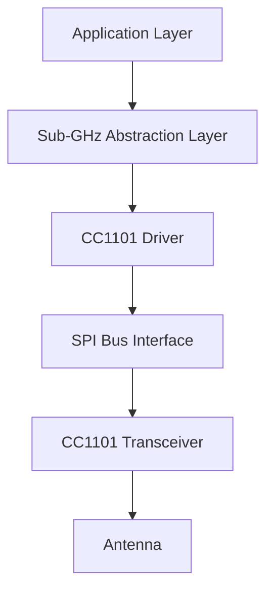
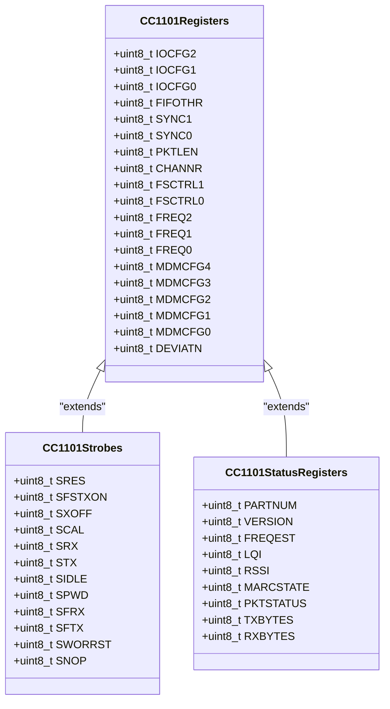
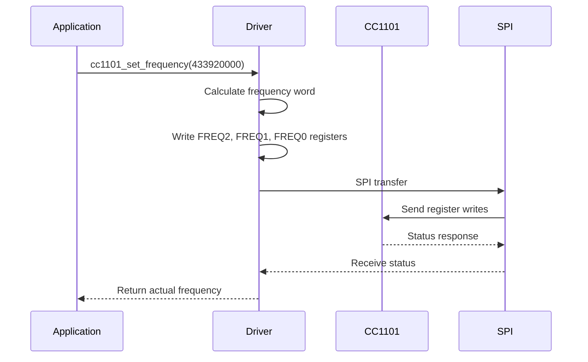
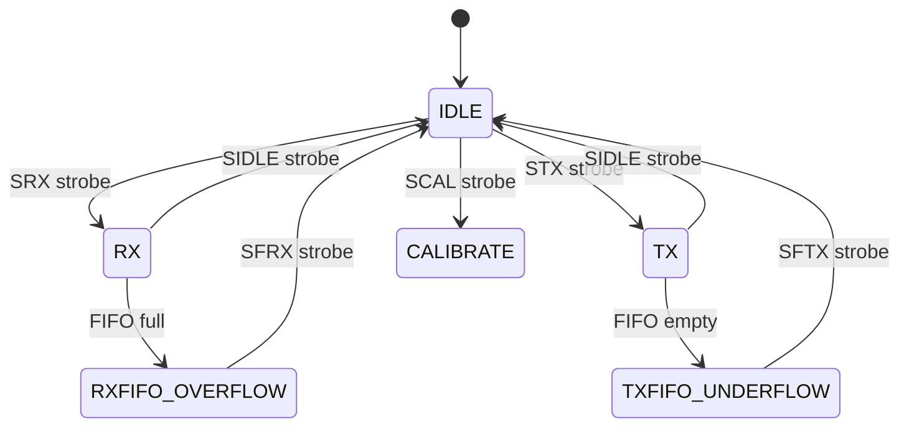
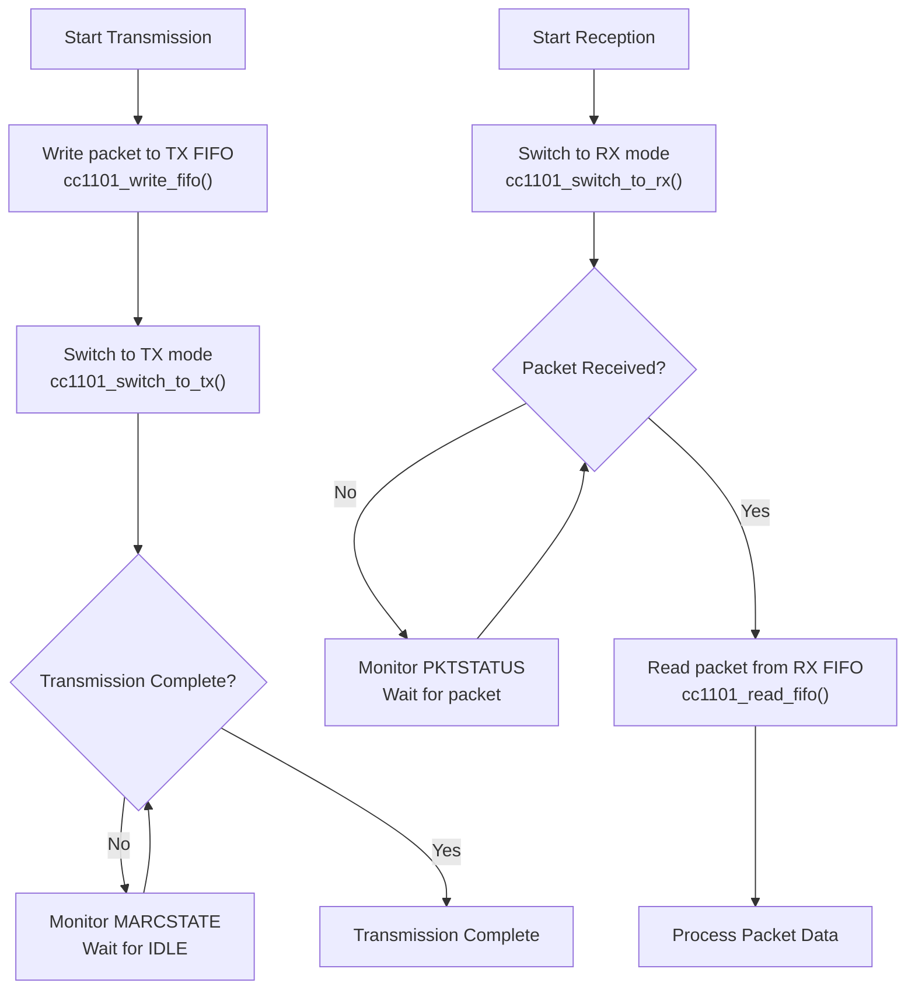

# Sub-GHz Specifications

<cite>
**Referenced Files in This Document**   
- [cc1101.h](file://lib/drivers/cc1101.h)
- [cc1101.c](file://lib/drivers/cc1101.c)
- [cc1101_regs.h](file://lib/drivers/cc1101_regs.h)
- [cc1101_ext.c](file://applications/drivers/subghz/cc1101_ext/cc1101_ext.c)
- [cc1101_ext.h](file://applications/drivers/subghz/cc1101_ext/cc1101_ext.h)
- [cc1101_configs.c](file://lib/subghz/devices/cc1101_configs.c)
- [cc1101_configs.h](file://lib/subghz/devices/cc1101_configs.h)
</cite>

## Table of Contents
1. [Introduction](#introduction)
2. [Sub-GHz Radio Overview](#sub-ghz-radio-overview)
3. [Hardware Specifications](#hardware-specifications)
4. [CC1101 Register-Level Configuration](#cc1101-register-level-configuration)
5. [Driver Implementation Details](#driver-implementation-details)
6. [Transmitter and Receiver Modes](#transmitter-and-receiver-modes)
7. [Frequency Tuning and Calibration](#frequency-tuning-and-calibration)
8. [Packet Handling and FIFO Operations](#packet-handling-and-fifo-operations)
9. [Practical Usage Examples](#practical-usage-examples)
10. [Regulatory Compliance and Signal Propagation](#regulatory-compliance-and-signal-propagation)

## Introduction
The Sub-GHz radio peripheral on the Flipper Zero device enables wireless communication in the sub-gigahertz frequency bands, primarily used for low-power, long-range applications such as remote controls, sensors, and telemetry systems. This document provides a comprehensive technical overview of the Sub-GHz subsystem, focusing on the Texas Instruments CC1101 transceiver chip, its integration with the Flipper Zero firmware, and practical usage patterns. The analysis covers hardware specifications, register-level configuration, driver implementation, and application-level functionality.

**Section sources**
- [cc1101.h](file://lib/drivers/cc1101.h#L1-L195)
- [cc1101_regs.h](file://lib/drivers/cc1101_regs.h#L1-L213)

## Sub-GHz Radio Overview
The Flipper Zero's Sub-GHz functionality is built around the CC1101 radio transceiver, a highly integrated, low-power RF transceiver designed for frequency bands between 300 MHz and 928 MHz. The CC1101 supports multiple modulation schemes including ASK (Amplitude Shift Keying) and FSK (Frequency Shift Keying), making it suitable for a wide range of wireless protocols.

The radio subsystem is accessed through a dedicated SPI bus and controlled via a layered software architecture that includes low-level register access, device abstraction, and high-level protocol handling. The system supports both transmission and reception of wireless signals, enabling the Flipper Zero to act as a universal remote, signal analyzer, or protocol development platform.



**Diagram sources**
- [cc1101.h](file://lib/drivers/cc1101.h#L1-L195)
- [cc1101.c](file://lib/drivers/cc1101.c#L1-L188)

**Section sources**
- [cc1101.h](file://lib/drivers/cc1101.h#L1-L195)
- [cc1101.c](file://lib/drivers/cc1101.c#L1-L188)

## Hardware Specifications
The CC1101 transceiver on the Flipper Zero supports operation in two primary frequency ranges:
- **300–433 MHz**: Commonly used for industrial, scientific, and medical (ISM) applications
- **868–915 MHz**: Used in Europe (868 MHz) and North America (915 MHz) for ISM band communications

### Modulation Schemes
The device supports multiple modulation types:
- **ASK/OOK (On-Off Keying)**: Simple amplitude modulation used in many legacy remote controls
- **FSK (Frequency Shift Keying)**: More robust modulation with better noise immunity
- **GFSK (Gaussian Frequency Shift Keying)**: FSK with Gaussian filtering for reduced spectral width

### Transmission Power and Receiver Sensitivity
- **Transmission Power**: Configurable up to +10 dBm, with programmable power amplifier (PA) table for fine-grained control
- **Receiver Sensitivity**: Up to -110 dBm at 1.2 kbps data rate, enabling long-range reception
- **Data Rates**: Supports data rates from 0.1 kbps to 600 kbps

### Antenna Requirements
The Flipper Zero uses a quarter-wave monopole antenna optimized for the target frequency bands. Proper antenna tuning is critical for optimal performance, and the device includes calibration routines to ensure accurate frequency synthesis.

**Section sources**
- [cc1101_regs.h](file://lib/drivers/cc1101_regs.h#L1-L213)
- [cc1101_configs.c](file://lib/subghz/devices/cc1101_configs.c#L1-L200)

## CC1101 Register-Level Configuration
The CC1101 is configured through a comprehensive register map that controls all aspects of radio operation. The following key registers are used in the Flipper Zero implementation:

### Frequency Control Registers
- **CC1101_FREQ2 (0x0D)**: Frequency control word, high byte
- **CC1101_FREQ1 (0x0E)**: Frequency control word, middle byte  
- **CC1101_FREQ0 (0x0F)**: Frequency control word, low byte

These registers set the carrier frequency using a 24-bit frequency word calculated from the crystal oscillator (26 MHz) and frequency divider values.

### Modem Configuration Registers
- **CC1101_MDMCFG4 (0x10)**: Data rate and bandwidth settings
- **CC1101_MDMCFG3 (0x11)**: Data rate fine-tuning
- **CC1101_MDMCFG2 (0x12)**: Modulation format and sync word detection
- **CC1101_DEVIATN (0x15)**: Frequency deviation for FSK modulation

### Packet Handling Registers
- **CC1101_PKTLEN (0x06)**: Maximum packet length (up to 255 bytes)
- **CC1101_PKTCTRL1 (0x07)**: Packet automation control (preamble, sync word, etc.)
- **CC1101_ADDR (0x09)**: Device address for packet filtering



**Diagram sources**
- [cc1101_regs.h](file://lib/drivers/cc1101_regs.h#L1-L213)

**Section sources**
- [cc1101_regs.h](file://lib/drivers/cc1101_regs.h#L1-L213)

## Driver Implementation Details
The CC1101 driver implementation provides both low-level and high-level APIs for controlling the radio transceiver.

### Low-Level API
The low-level API provides direct access to the CC1101's SPI interface:

```c
CC1101Status cc1101_strobe(FuriHalSpiBusHandle* handle, uint8_t strobe);
CC1101Status cc1101_write_reg(FuriHalSpiBusHandle* handle, uint8_t reg, uint8_t data);
CC1101Status cc1101_read_reg(FuriHalSpiBusHandle* handle, uint8_t reg, uint8_t* data);
```

These functions handle SPI communication with proper timing and status checking, ensuring reliable register access.

### High-Level API
The high-level API abstracts common operations:

```c
uint32_t cc1101_set_frequency(FuriHalSpiBusHandle* handle, uint32_t value);
CC1101Status cc1101_switch_to_rx(FuriHalSpiBusHandle* handle);
CC1101Status cc1101_switch_to_tx(FuriHalSpiBusHandle* handle);
void cc1101_set_pa_table(FuriHalSpiBusHandle* handle, const uint8_t value[8]);
```

The driver includes robust error handling and timeout mechanisms to prevent system hangs during SPI communication.



**Diagram sources**
- [cc1101.c](file://lib/drivers/cc1101.c#L1-L188)
- [cc1101.h](file://lib/drivers/cc1101.h#L1-L195)

**Section sources**
- [cc1101.c](file://lib/drivers/cc1101.c#L1-L188)
- [cc1101.h](file://lib/drivers/cc1101.h#L1-L195)

## Transmitter and Receiver Modes
The CC1101 supports multiple operational modes controlled through strobe commands:

### State Machine
The radio operates through a state machine with the following states:
- **IDLE**: Standby mode, ready for configuration
- **RX**: Receiving mode, listening for incoming signals
- **TX**: Transmitting mode, sending data
- **CALIBRATE**: Frequency synthesizer calibration
- **SETTLING**: PLL settling after frequency change

### Mode Transitions
Mode changes are performed using strobe commands:
- **SRX (0x34)**: Switch to receive mode
- **STX (0x35)**: Switch to transmit mode  
- **SIDLE (0x36)**: Switch to idle mode
- **SFRX (0x3A)**: Flush RX FIFO
- **SFTX (0x3B)**: Flush TX FIFO

The driver includes helper functions like `cc1101_switch_to_rx()` and `cc1101_switch_to_tx()` that wrap these strobe commands with proper state verification.



**Diagram sources**
- [cc1101_regs.h](file://lib/drivers/cc1101_regs.h#L1-L213)
- [cc1101.c](file://lib/drivers/cc1101.c#L1-L188)

**Section sources**
- [cc1101_regs.h](file://lib/drivers/cc1101_regs.h#L1-L213)
- [cc1101.c](file://lib/drivers/cc1101.c#L1-L188)

## Frequency Tuning and Calibration
Accurate frequency synthesis is critical for reliable wireless communication. The CC1101 uses a frequency synthesizer that must be properly configured and calibrated.

### Frequency Calculation
The carrier frequency is set using a 24-bit frequency word calculated as:
```
FREQ = (frequency × 2^16) / 26,000,000
```

The `cc1101_set_frequency()` function implements this calculation and writes the appropriate values to the FREQ2, FREQ1, and FREQ0 registers.

### Calibration Process
The frequency synthesizer requires periodic calibration to maintain accuracy:
- **Automatic Calibration**: Enabled via MCSM0.FS_AUTOCAL bit
- **Manual Calibration**: Triggered by SCAL strobe command (0x33)

The `cc1101_calibrate()` function initiates manual calibration, which adjusts the frequency synthesizer components for optimal performance.

### Intermediate Frequency
The receiver's intermediate frequency (IF) can be configured using `cc1101_set_intermediate_frequency()`, which writes to the FSCTRL0 register. This setting affects receiver bandwidth and selectivity.

**Section sources**
- [cc1101.c](file://lib/drivers/cc1101.c#L1-L188)
- [cc1101_regs.h](file://lib/drivers/cc1101_regs.h#L1-L213)

## Packet Handling and FIFO Operations
The CC1101 includes 64-byte RX and TX FIFOs for packet data buffering.

### Writing to TX FIFO
```c
uint8_t cc1101_write_fifo(FuriHalSpiBusHandle* handle, const uint8_t* data, uint8_t size);
```
This function writes data to the TX FIFO using burst mode. The data must include any required preamble, sync word, and length byte depending on packet configuration.

### Reading from RX FIFO
```c
uint8_t cc1101_read_fifo(FuriHalSpiBusHandle* handle, uint8_t* data, uint8_t* size);
```
This function reads received packet data from the RX FIFO. The actual packet length is determined by reading the first byte of received data, which contains the packet length.

### FIFO Management
Proper FIFO management is essential:
- **Flush RX FIFO**: Use SFRX strobe when RXFIFO_OVERFLOW state is detected
- **Flush TX FIFO**: Use SFTX strobe when TXFIFO_UNDERFLOW state is detected
- **Monitor FIFO levels**: Configure FIFOTHR register to set threshold interrupts



**Diagram sources**
- [cc1101.c](file://lib/drivers/cc1101.c#L1-L188)
- [cc1101_regs.h](file://lib/drivers/cc1101_regs.h#L1-L213)

**Section sources**
- [cc1101.c](file://lib/drivers/cc1101.c#L1-L188)
- [cc1101_regs.h](file://lib/drivers/cc1101_regs.h#L1-L213)

## Practical Usage Examples
The Sub-GHz subsystem enables various practical applications:

### Signal Capture
To capture wireless signals:
1. Set frequency using `cc1101_set_frequency()`
2. Configure packet parameters (sync word, data rate)
3. Switch to RX mode with `cc1101_switch_to_rx()`
4. Monitor for packets and read data from FIFO

### Protocol Analysis
The system can analyze unknown protocols by:
- Capturing raw signal data
- Analyzing timing and modulation characteristics
- Decoding packet structure and content

### Custom Packet Transmission
To transmit custom packets:
1. Configure TX parameters (frequency, modulation, data rate)
2. Set PA table for desired transmission power
3. Write packet data to TX FIFO
4. Switch to TX mode to initiate transmission

These capabilities make the Flipper Zero a powerful tool for wireless security research, IoT device testing, and protocol development.

**Section sources**
- [cc1101.c](file://lib/drivers/cc1101.c#L1-L188)
- [cc1101.h](file://lib/drivers/cc1101.h#L1-L195)

## Regulatory Compliance and Signal Propagation
### Regulatory Considerations
The Sub-GHz radio must comply with regional regulations:
- **FCC (USA)**: Limits on transmission power and duty cycle
- **ETSI (Europe)**: Restrictions on 868 MHz band usage
- **ARIB (Japan)**: Specific requirements for 920 MHz band

Users must ensure compliance with local regulations when transmitting signals.

### Signal Propagation Characteristics
Sub-GHz signals exhibit favorable propagation characteristics:
- **Long Range**: Better penetration through walls and obstacles compared to 2.4 GHz
- **Low Power Consumption**: Enables battery-powered devices with long lifetimes
- **Interference Resistance**: Less crowded spectrum than 2.4 GHz band

Antenna design and placement significantly impact performance, with quarter-wave monopoles providing optimal results for the target frequency bands.

**Section sources**
- [cc1101_regs.h](file://lib/drivers/cc1101_regs.h#L1-L213)
- [cc1101_configs.c](file://lib/subghz/devices/cc1101_configs.c#L1-L200)