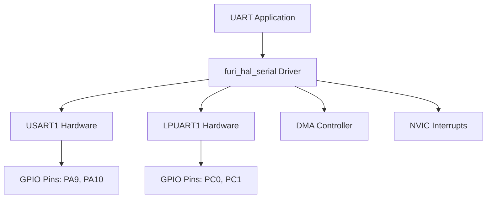
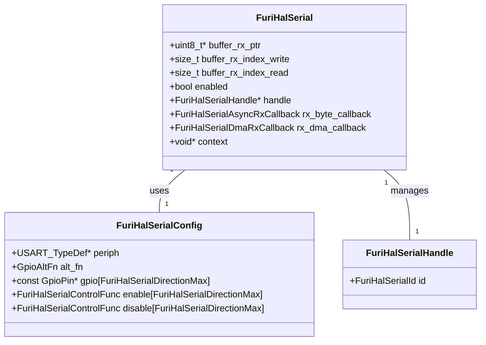
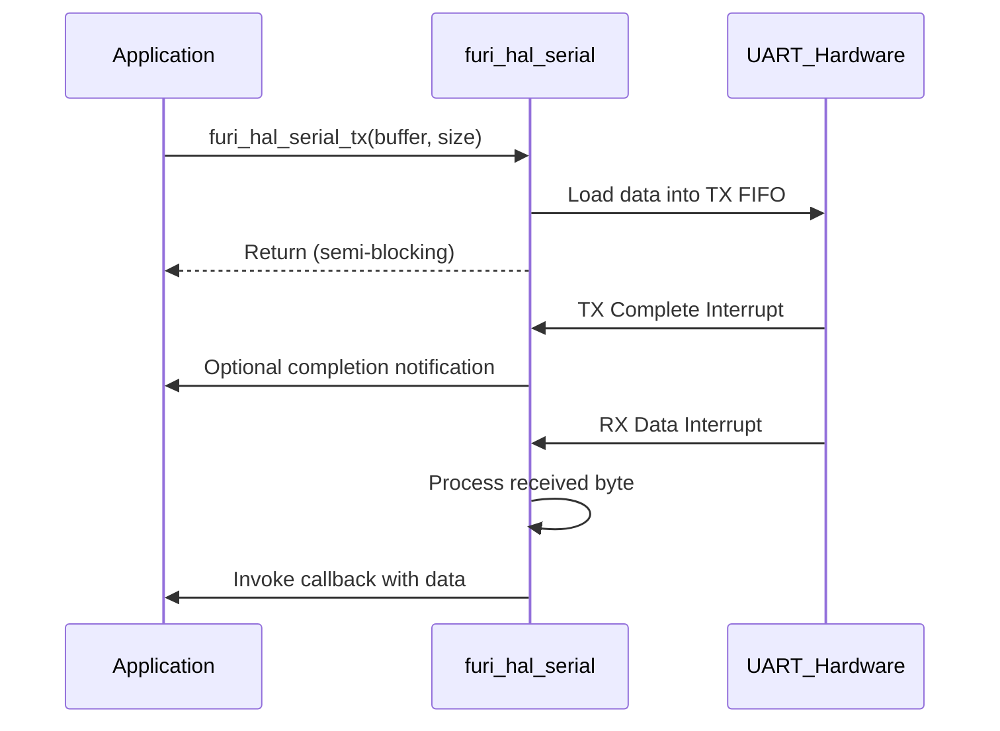

# UART Specifications

<cite>
**Referenced Files in This Document**   
- [furi_hal_serial.h](file://targets/f7/furi_hal/furi_hal_serial.h#L0-L251)
- [furi_hal_serial.c](file://targets/f7/furi_hal/furi_hal_serial.c#L0-L963)
- [furi_hal_serial_types.h](file://targets/f7/furi_hal/furi_hal_serial_types.h#L0-L23)
- [stm32wbxx_hal_uart.h](file://lib/stm32wb_hal/Inc/stm32wbxx_hal_uart.h#L0-L1749)
- [stm32wbxx_hal_uart.c](file://lib/stm32wb_hal/Src/stm32wbxx_hal_uart.c#L0-L4802)
- [uart_echo.c](file://applications/debug/uart_echo/uart_echo.c#L0-L340)
</cite>

## Table of Contents
1. [Introduction](#introduction)
2. [UART Peripheral Overview](#uart-peripheral-overview)
3. [Baud Rate Configuration](#baud-rate-configuration)
4. [Data Frame Formats](#data-frame-formats)
5. [Electrical Characteristics](#electrical-characteristics)
6. [furi_hal_serial Driver Implementation](#furi_hal_serial-driver-implementation)
7. [Initialization Sequences](#initialization-sequences)
8. [Data Transmission and Reception Modes](#data-transmission-and-reception-modes)
9. [Register-Level Configuration](#register-level-configuration)
10. [Practical Examples](#practical-examples)
11. [Signal Integrity Considerations](#signal-integrity-considerations)

## Introduction
The Universal Asynchronous Receiver/Transmitter (UART) peripheral on the Flipper Zero device provides serial communication capabilities for interfacing with external devices. This document details the UART specifications, implementation, and usage patterns within the Flipper Zero firmware. The UART system is implemented through the furi_hal_serial driver, which abstracts the underlying STM32WB hardware peripherals to provide a consistent interface for applications. The documentation covers technical specifications, driver architecture, configuration details, and practical implementation examples to enable developers to effectively utilize the UART functionality.

## UART Peripheral Overview
The Flipper Zero device implements two UART interfaces through the STM32WB microcontroller: USART1 and LPUART1. These interfaces provide asynchronous serial communication capabilities for connecting to external devices, debugging, and expansion modules. The USART1 interface operates at higher speeds and is typically used for high-throughput applications, while the LPUART1 interface is optimized for low-power operation and is commonly used for expansion port communication.

The UART peripherals support standard asynchronous serial communication with configurable baud rates, data formats, and flow control options. Both interfaces are accessible through the furi_hal_serial driver, which provides a unified API for initialization, configuration, and data transfer operations. The driver abstracts the hardware differences between the two UART interfaces, allowing applications to use either interface with minimal code changes.



**Diagram sources**
- [furi_hal_serial.h](file://targets/f7/furi_hal/furi_hal_serial.h#L0-L251)
- [furi_hal_serial.c](file://targets/f7/furi_hal/furi_hal_serial.c#L0-L963)

**Section sources**
- [furi_hal_serial.h](file://targets/f7/furi_hal/furi_hal_serial.h#L0-L251)
- [furi_hal_serial.c](file://targets/f7/furi_hal/furi_hal_serial.c#L0-L963)

## Baud Rate Configuration
The UART peripherals on the Flipper Zero support a wide range of baud rates from 9600 to 4,000,000 bps. The supported baud rate range is explicitly defined in the `furi_hal_serial_is_baud_rate_supported` function, which validates that requested baud rates fall within the acceptable range.

```c
bool furi_hal_serial_is_baud_rate_supported(FuriHalSerialHandle* handle, uint32_t baud) {
    furi_check(handle);
    return baud >= 9600UL && baud <= 4000000UL;
}
```

The default baud rate used in the UART echo application is 230,400 bps, which represents a common high-speed setting for modern serial communication:

```c
#define DEFAULT_BAUD_RATE 230400
```

Baud rate configuration is performed through the `furi_hal_serial_set_br` function, which calculates the appropriate prescaler and baud rate register values based on the UART clock frequency. The function handles both USART1 and LPUART1 interfaces, applying the correct configuration sequence for each peripheral.

For USART1, the baud rate is configured with 16x oversampling:
```c
#define FURI_HAL_SERIAL_USART_OVERSAMPLING LL_USART_OVERSAMPLING_16
```

The baud rate calculation takes into account the UART clock source and applies the appropriate prescaler to achieve the desired baud rate. The prescaler values are determined based on the ratio between the UART clock frequency and the target baud rate, with different prescaler options available to accommodate various clock configurations.

**Section sources**
- [furi_hal_serial.c](file://targets/f7/furi_hal/furi_hal_serial.c#L500-L600)
- [uart_echo.c](file://applications/debug/uart_echo/uart_echo.c#L17-L17)

## Data Frame Formats
The UART peripherals on the Flipper Zero support standard asynchronous serial data frames with configurable parameters. The default data frame format consists of:

- **Data bits**: 8 bits
- **Stop bits**: 1 bit
- **Parity**: None
- **Flow control**: None

These parameters are configured during initialization in the respective UART initialization functions. For USART1, the configuration is set using the LL_USART_Init structure:

```c
LL_USART_InitTypeDef USART_InitStruct;
USART_InitStruct.DataWidth = LL_USART_DATAWIDTH_8B;
USART_InitStruct.StopBits = LL_USART_STOPBITS_1;
USART_InitStruct.Parity = LL_USART_PARITY_NONE;
USART_InitStruct.HardwareFlowControl = LL_USART_HWCONTROL_NONE;
```

For LPUART1, similar configuration parameters are applied:

```c
LL_LPUART_InitTypeDef LPUART_InitStruct;
LPUART_InitStruct.DataWidth = LL_LPUART_DATAWIDTH_8B;
LPUART_InitStruct.StopBits = LL_LPUART_STOPBITS_1;
LPUART_InitStruct.Parity = LL_LPUART_PARITY_NONE;
LPUART_InitStruct.HardwareFlowControl = LL_LPUART_HWCONTROL_NONE;
```

The data frame format follows the standard asynchronous serial protocol with a start bit, data bits, optional parity bit, and stop bit(s). The receiver detects the start bit (logic low) and samples the data bits at the configured baud rate. The frame ends with one or more stop bits (logic high), providing a minimum inter-character gap.

The driver does not currently expose APIs to modify the data frame format parameters, indicating that the default configuration is intended for most use cases. Applications requiring different data frame formats would need to modify the initialization code or implement custom configuration functions.

**Section sources**
- [furi_hal_serial.c](file://targets/f7/furi_hal/furi_hal_serial.c#L400-L500)

## Electrical Characteristics
The UART interfaces on the Flipper Zero operate at standard 3.3V CMOS logic levels, consistent with the STM32WB microcontroller's I/O voltage. The GPIO pins are configured with push-pull output drivers and pull-up resistors to ensure stable signal levels during communication.

For USART1, the GPIO pins are configured as follows:
```c
furi_hal_gpio_init_ex(
    &gpio_usart_tx,
    GpioModeAltFunctionPushPull,
    GpioPullUp,
    GpioSpeedVeryHigh,
    GpioAltFn7USART1);
furi_hal_gpio_init_ex(
    &gpio_usart_rx,
    GpioModeAltFunctionPushPull,
    GpioPullUp,
    GpioSpeedVeryHigh,
    GpioAltFn7USART1);
```

For LPUART1 (expansion port), the GPIO pins are configured similarly:
```c
furi_hal_gpio_init_ex(
    &gpio_ext_pc0,
    GpioModeAltFunctionPushPull,
    GpioPullUp,
    GpioSpeedVeryHigh,
    GpioAltFn8LPUART1);
furi_hal_gpio_init_ex(
    &gpio_ext_pc1,
    GpioModeAltFunctionPushPull,
    GpioPullUp,
    GpioSpeedVeryHigh,
    GpioAltFn8LPUART1);
```

Key electrical characteristics:
- **Logic high level**: 3.3V ±10%
- **Logic low level**: 0V to 0.4V
- **Output drive strength**: Very high (configurable)
- **Input threshold**: CMOS levels (approximately 1.4V switching threshold)
- **Maximum pin current**: 25mA per STM32WB specifications

The expansion port UART (LPUART1) is accessible through the device's expansion connector, allowing external devices to communicate with the Flipper Zero. When using the expansion port, developers should ensure that connected devices are compatible with 3.3V logic levels to prevent damage to either device.

**Section sources**
- [furi_hal_serial.c](file://targets/f7/furi_hal/furi_hal_serial.c#L400-L500)

## furi_hal_serial Driver Implementation
The furi_hal_serial driver provides a hardware abstraction layer for UART communication on the Flipper Zero device. The driver implements a modular architecture that supports both USART1 and LPUART1 interfaces through a unified API.

The driver structure is defined by the `FuriHalSerial` type, which maintains state information for each UART channel:
```c
typedef struct {
    uint8_t* buffer_rx_ptr;
    size_t buffer_rx_index_write;
    size_t buffer_rx_index_read;
    bool enabled;
    FuriHalSerialHandle* handle;
    FuriHalSerialAsyncRxCallback rx_byte_callback;
    FuriHalSerialDmaRxCallback rx_dma_callback;
    void* context;
} FuriHalSerial;
```

The driver supports two primary receive modes:
1. **Byte-oriented interrupt mode**: Individual bytes trigger interrupts
2. **DMA-based circular buffer mode**: DMA controller manages data reception

The configuration for each UART interface is stored in a static array:
```c
static const FuriHalSerialConfig furi_hal_serial_config[FuriHalSerialIdMax] = {
    [FuriHalSerialIdUsart] = { /* USART1 configuration */ },
    [FuriHalSerialIdLpuart] = { /* LPUART1 configuration */ },
};
```

Each configuration includes the peripheral register base address, GPIO pin assignments, and function pointers for enabling/disabling transmission and reception.

The driver implements comprehensive error handling, detecting and reporting various UART error conditions through the receive event system:
- **Framing errors**: Incorrect stop bit detection
- **Noise errors**: Signal interference detected
- **Overrun errors**: Receive buffer overflow
- **Idle line detection**: Bus inactivity



**Diagram sources**
- [furi_hal_serial.h](file://targets/f7/furi_hal/furi_hal_serial.h#L0-L251)
- [furi_hal_serial.c](file://targets/f7/furi_hal/furi_hal_serial.c#L0-L963)

**Section sources**
- [furi_hal_serial.c](file://targets/f7/furi_hal/furi_hal_serial.c#L0-L963)
- [furi_hal_serial.h](file://targets/f7/furi_hal/furi_hal_serial.h#L0-L251)

## Initialization Sequences
The UART initialization process follows a structured sequence to properly configure the hardware peripherals and GPIO pins. The initialization is performed by the `furi_hal_serial_init` function, which routes to interface-specific initialization functions based on the UART identifier.

### USART1 Initialization Sequence
1. Enable USART1 bus clock
2. Configure USART1 clock source to PCLK2
3. Initialize GPIO pins (PA9 for TX, PA10 for RX) as alternate function push-pull
4. Configure USART initialization structure with default parameters
5. Enable USART peripheral
6. Wait for transmit and receive enable acknowledge flags
7. Set baud rate using `furi_hal_serial_set_br`
8. Disable error interrupts initially

```c
static void furi_hal_serial_usart_init(FuriHalSerialHandle* handle, uint32_t baud) {
    furi_hal_bus_enable(FuriHalBusUSART1);
    LL_RCC_SetUSARTClockSource(LL_RCC_USART1_CLKSOURCE_PCLK2);
    
    // GPIO initialization
    furi_hal_gpio_init_ex(&gpio_usart_tx, GpioModeAltFunctionPushPull, 
                         GpioPullUp, GpioSpeedVeryHigh, GpioAltFn7USART1);
    furi_hal_gpio_init_ex(&gpio_usart_rx, GpioModeAltFunctionPushPull, 
                         GpioPullUp, GpioSpeedVeryHigh, GpioAltFn7USART1);
    
    // USART configuration
    LL_USART_InitTypeDef USART_InitStruct = { /* configuration */ };
    LL_USART_Init(USART1, &USART_InitStruct);
    LL_USART_EnableFIFO(USART1);
    LL_USART_ConfigAsyncMode(USART1);
    
    LL_USART_Enable(USART1);
    
    // Wait for enable acknowledge
    while(!LL_USART_IsActiveFlag_TEACK(USART1) || 
          !LL_USART_IsActiveFlag_REACK(USART1));
    
    furi_hal_serial_set_br(handle, baud);
    LL_USART_DisableIT_ERROR(USART1);
    furi_hal_serial[handle->id].enabled = true;
}
```

### LPUART1 Initialization Sequence
1. Enable LPUART1 bus clock
2. Configure LPUART1 clock source to PCLK1
3. Initialize GPIO pins (PC0 for RX, PC1 for TX) as alternate function push-pull
4. Configure LPUART initialization structure with default parameters
5. Enable LPUART peripheral
6. Wait for transmit and receive enable acknowledge flags
7. Set baud rate using `furi_hal_serial_set_br`
8. Disable error interrupts initially

The initialization sequences ensure that both UART interfaces are properly configured with the correct clock sources, GPIO settings, and operational parameters before being made available for communication.

**Section sources**
- [furi_hal_serial.c](file://targets/f7/furi_hal/furi_hal_serial.c#L400-L500)

## Data Transmission and Reception Modes
The furi_hal_serial driver implements multiple data transmission and reception modes to accommodate different application requirements.

### Transmission Modes
The driver provides two primary transmission functions:

1. **Semi-blocking transmission** (`furi_hal_serial_tx`):
   - Fills the transmission FIFO with data
   - Returns when all data is in the transmit pipe
   - Real transmission completes asynchronously
   - Example usage:
   ```c
   furi_hal_serial_tx(handle, buffer, buffer_size);
   ```

2. **Blocking transmission completion** (`furi_hal_serial_tx_wait_complete`):
   - Waits for all transmitted data to be sent
   - Polls the transfer complete flag
   - Ensures data is fully transmitted before returning
   - Example usage:
   ```c
   furi_hal_serial_tx_wait_complete(handle);
   ```

### Reception Modes
The driver supports three reception modes:

1. **Asynchronous byte reception**:
   - Uses interrupt-driven byte-by-byte reception
   - Callback function invoked for each received byte
   - Implemented through `furi_hal_serial_async_rx_start`
   - Suitable for low-throughput applications

2. **DMA-based circular buffer reception**:
   - Uses DMA controller for efficient data transfer
   - Implements a 256-byte circular buffer
   - Reduces CPU overhead for high-throughput applications
   - Implemented through `furi_hal_serial_dma_rx_start`

3. **Direct polling reception**:
   - Checks for available data using `furi_hal_serial_async_rx_available`
   - Retrieves data using `furi_hal_serial_async_rx`
   - Only callable from interrupt context



**Diagram sources**
- [furi_hal_serial.c](file://targets/f7/furi_hal/furi_hal_serial.c#L600-L800)

**Section sources**
- [furi_hal_serial.c](file://targets/f7/furi_hal/furi_hal_serial.c#L600-L800)
- [furi_hal_serial.h](file://targets/f7/furi_hal/furi_hal_serial.h#L0-L251)

## Register-Level Configuration
The UART configuration at the register level involves direct manipulation of the STM32WB peripheral registers through the LL (Low Layer) HAL API. The driver uses LL functions to configure and control the UART peripherals efficiently.

### USART1 Register Configuration
Key registers and their configuration:

- **USART1_CR1**: Control Register 1
  - UE (bit 0): USART enable
  - RE (bit 2): Receiver enable
  - TE (bit 3): Transmitter enable
  - RXNEIE (bit 5): RXNE interrupt enable
  - TCIE (bit 6): Transmission complete interrupt enable
  - IDLEIE (bit 4): IDLE interrupt enable

- **USART1_CR2**: Control Register 2
  - STOP[13:12]: Stop bits (00 = 1 stop bit)

- **USART1_BRR**: Baud Rate Register
  - DIV_Fraction[3:0]: Fractional part of baud rate divider
  - DIV_Mantissa[15:4]: Mantissa part of baud rate divider

- **USART1_GTPR**: Guard time and prescaler register
  - PSC[7:0]: Prescaler value

### LPUART1 Register Configuration
LPUART1 uses similar registers with different bit mappings:

- **LPUART1_BRR**: Baud Rate Register
  - DIV_Mantissa[15:4]: Mantissa part
  - DIV_Frac[2:0]: Fractional part

- **LPUART1_CR1**: Control Register 1
  - UE: LPUART enable
  - RE: Receiver enable
  - TE: Transmitter enable

The driver configures these registers through the LL HAL functions rather than direct register access, providing better code readability and maintainability:

```c
// USART1 configuration
LL_USART_SetPrescaler(USART1, prescaler);
LL_USART_SetBaudRate(USART1, uartclk, prescaler, 
                    FURI_HAL_SERIAL_USART_OVERSAMPLING, baud);

// LPUART1 configuration
LL_LPUART_SetPrescaler(LPUART1, prescaler);
LL_LPUART_SetBaudNormally(LPUART1, uartclk, prescaler, baud);
```

Interrupts are configured to handle various UART events:
- **RXNE (Receive Register Not Empty)**: Data reception
- **IDLE (Idle Line Detected)**: Bus idle detection
- **Error interrupts**: Framing, noise, and overrun errors

DMA configuration uses circular buffering to efficiently manage data reception without CPU intervention for each byte transfer.

**Section sources**
- [furi_hal_serial.c](file://targets/f7/furi_hal/furi_hal_serial.c#L400-L963)
- [stm32wbxx_hal_uart.c](file://lib/stm32wb_hal/Src/stm32wbxx_hal_uart.c#L0-L4802)

## Practical Examples
This section provides practical examples demonstrating how to establish serial communication, handle interrupts, and implement protocol framing using the furi_hal_serial driver.

### UART Echo Application Example
The UART echo application demonstrates basic UART functionality by receiving data and transmitting it back:

```c
static void uart_echo_on_irq_cb(FuriHalSerialHandle* handle, 
                               FuriHalSerialRxEvent event, void* context) {
    UartEchoApp* app = context;
    WorkerEventFlags flag = 0;

    if(event & FuriHalSerialRxEventData) {
        uint8_t data = furi_hal_serial_async_rx(handle);
        furi_stream_buffer_send(app->rx_stream, &data, 1, 0);
        flag |= WorkerEventRxData;
    }

    if(event & FuriHalSerialRxEventIdle) {
        flag |= WorkerEventRxIdle;
    }

    if(event & FuriHalSerialRxEventFrameError) {
        flag |= WorkerEventRxFramingError;
    }

    furi_thread_flags_set(furi_thread_get_id(app->worker_thread), flag);
}

static int32_t uart_echo_worker(void* context) {
    UartEchoApp* app = context;

    while(1) {
        uint32_t events = furi_thread_flags_wait(WORKER_EVENTS_MASK, 
                                               FuriFlagWaitAny, FuriWaitForever);
        
        if(events & WorkerEventRxData) {
            size_t length = 0;
            do {
                uint8_t data[64];
                length = furi_stream_buffer_receive(app->rx_stream, data, 64, 0);
                if(length > 0) {
                    furi_hal_serial_tx(app->serial_handle, data, length);
                }
            } while(length > 0);
        }
    }
    return 0;
}
```

### Establishing Serial Communication
To establish serial communication with an external device:

```c
// Initialize UART handle
FuriHalSerialHandle* serial_handle = furi_hal_serial_get_handle(FuriHalSerialIdLpuart);

// Initialize UART with desired baud rate
furi_hal_serial_init(serial_handle, 115200);

// Start asynchronous reception
furi_hal_serial_async_rx_start(serial_handle, 
                              uart_receive_callback, 
                              app_context, 
                              true); // Report errors
```

### Protocol Framing Implementation
Implementing protocol framing with packet detection:

```c
typedef struct {
    uint8_t buffer[256];
    uint16_t index;
    bool packet_started;
} ProtocolDecoder;

static void protocol_uart_callback(FuriHalSerialHandle* handle,
                                  FuriHalSerialRxEvent event,
                                  void* context) {
    ProtocolDecoder* decoder = context;
    
    if(event & FuriHalSerialRxEventData) {
        uint8_t data = furi_hal_serial_async_rx(handle);
        
        // Simple packet framing: start with 0xAA, end with 0x55
        if(data == 0xAA) {
            decoder->index = 0;
            decoder->packet_started = true;
        } else if(data == 0x55 && decoder->packet_started) {
            // Complete packet received
            process_packet(decoder->buffer, decoder->index);
            decoder->packet_started = false;
        } else if(decoder->packet_started) {
            if(decoder->index < sizeof(decoder->buffer)) {
                decoder->buffer[decoder->index++] = data;
            }
        }
    }
}
```

**Section sources**
- [uart_echo.c](file://applications/debug/uart_echo/uart_echo.c#L0-L340)
- [furi_hal_serial.c](file://targets/f7/furi_hal/furi_hal_serial.c#L600-L800)

## Signal Integrity Considerations
Proper signal integrity is essential for reliable UART communication, especially at higher baud rates. The following considerations should be addressed when implementing UART communication on the Flipper Zero.

### Cable Length Limitations
The maximum cable length for reliable UART communication depends on the baud rate and environmental conditions:

- **Up to 115,200 bps**: Up to 15 meters with proper cabling
- **230,400 bps and above**: Recommended maximum of 3-5 meters
- **1,000,000+ bps**: Keep cables as short as possible (under 1 meter)

The primary limitation is signal rise/fall time degradation over longer cables, which can cause bit errors at high baud rates.

### Noise Immunity
The Flipper Zero UART interfaces include several features to improve noise immunity:

1. **Hardware filtering**: The STM32WB UART peripherals include noise detection circuitry that can identify and report noisy signals.

2. **DMA reception**: Using DMA for reception reduces the risk of data loss due to CPU interrupts or processing delays.

3. **Circular buffering**: The 256-byte circular buffer provides headroom for temporary processing delays.

4. **Error detection**: The driver reports framing, noise, and overrun errors to the application.

### Best Practices for Signal Integrity
1. **Use twisted-pair cables** for differential noise rejection
2. **Implement proper grounding** between devices
3. **Use shielded cables** in electrically noisy environments
4. **Add series resistors** (22-100 ohms) at the driver output to reduce ringing
5. **Avoid running UART lines parallel to high-speed digital signals**
6. **Use appropriate termination** for longer cables

### Electrical Interface Considerations
When connecting to external devices:

1. **Voltage level compatibility**: Ensure connected devices use 3.3V logic levels
2. **Current limitations**: Do not exceed 25mA per pin
3. **ESD protection**: Consider adding ESD protection diodes for exposed connectors
4. **Level shifting**: Use level shifters when interfacing with 5V devices

The expansion port UART (LPUART1) is particularly susceptible to signal integrity issues due to its external accessibility. Applications using the expansion port should implement robust error handling and potentially lower baud rates for improved reliability.

**Section sources**
- [furi_hal_serial.c](file://targets/f7/furi_hal/furi_hal_serial.c#L0-L963)
- [furi_hal_serial.h](file://targets/f7/furi_hal/furi_hal_serial.h#L0-L251)