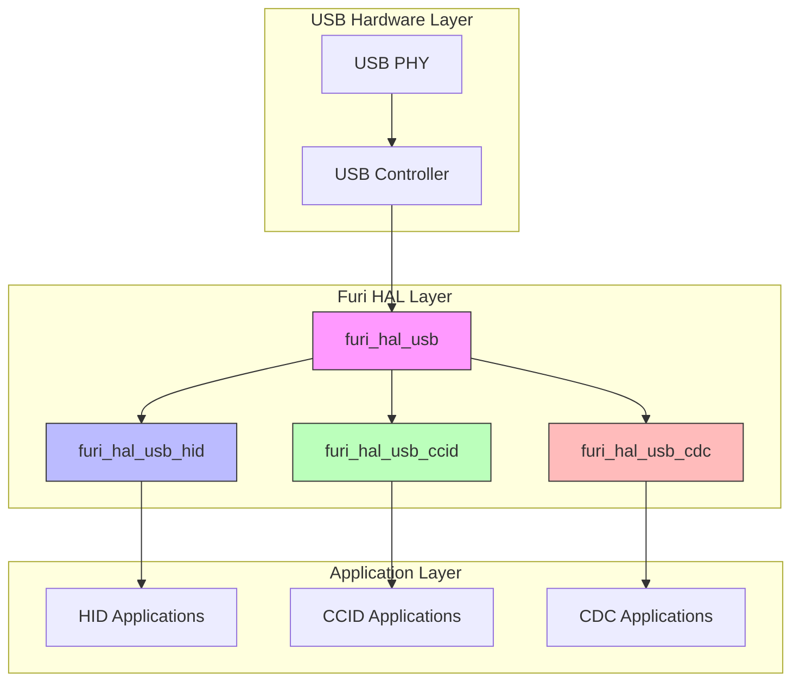
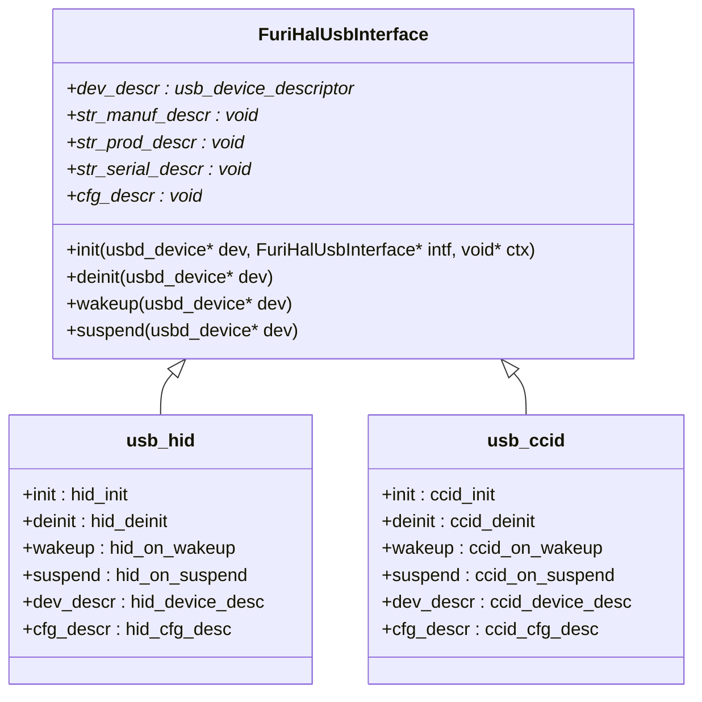
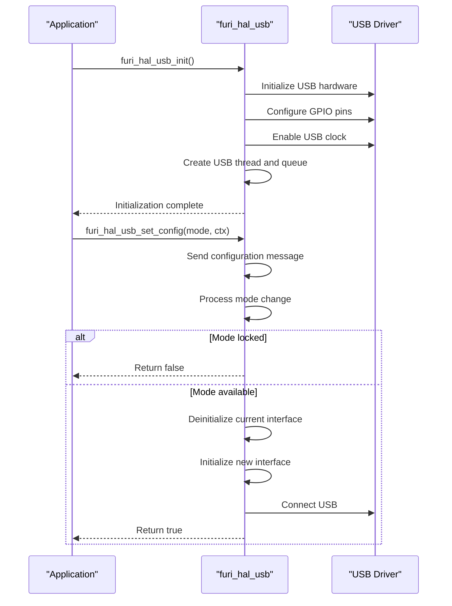
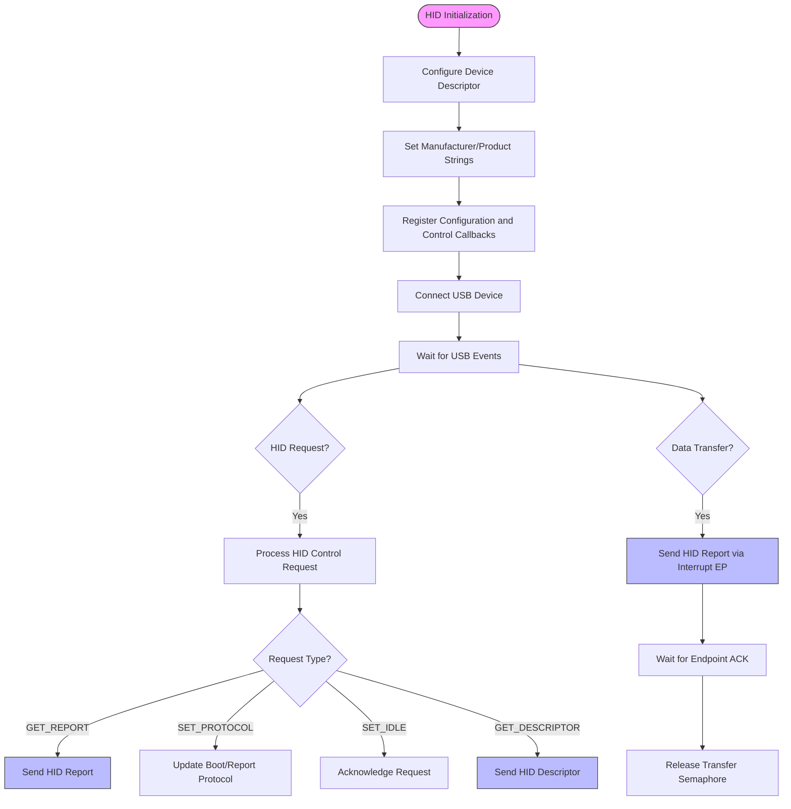
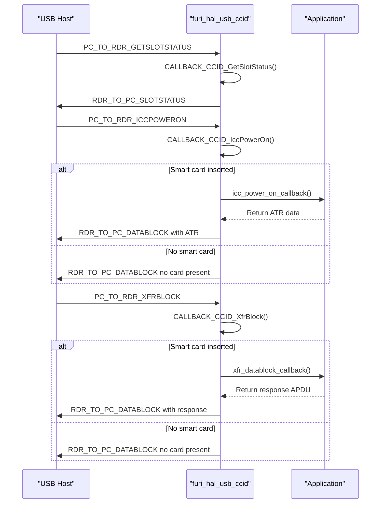
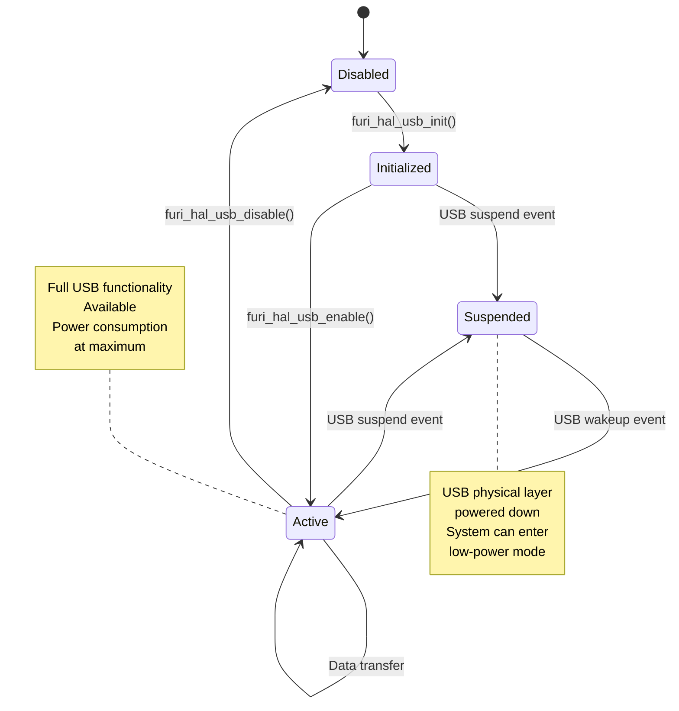

# USB Specifications

<cite>
**Referenced Files in This Document**   
- [furi_hal_usb.h](file://targets/furi_hal_include/furi_hal_usb.h)
- [furi_hal_usb.c](file://targets/f7/furi_hal/furi_hal_usb.c)
- [furi_hal_usb_hid.h](file://targets/furi_hal_include/furi_hal_usb_hid.h)
- [furi_hal_usb_hid.c](file://targets/f7/furi_hal/furi_hal_usb_hid.c)
- [furi_hal_usb_ccid.h](file://targets/furi_hal_include/furi_hal_usb_ccid.h)
- [furi_hal_usb_ccid.c](file://targets/f7/furi_hal/furi_hal_usb_ccid.c)
</cite>

## Table of Contents
1. [Introduction](#introduction)
2. [USB Architecture Overview](#usb-architecture-overview)
3. [USB Device Classes](#usb-device-classes)
4. [USB Initialization and Configuration](#usb-initialization-and-configuration)
5. [HID Implementation Details](#hid-implementation-details)
6. [CCID Implementation Details](#ccid-implementation-details)
7. [Data Transfer Mechanisms](#data-transfer-mechanisms)
8. [Power Management](#power-management)
9. [Practical Implementation Examples](#practical-implementation-examples)
10. [Conclusion](#conclusion)

## Introduction
The Flipper Zero device implements a comprehensive USB subsystem that supports multiple device classes including CDC, HID, and CCID. The USB functionality is managed through a hardware abstraction layer (HAL) that provides a consistent interface for different USB device modes. This documentation details the USB specifications, architecture, and implementation for the Flipper Zero, focusing on the furi_hal_usb driver implementation, supported device classes, initialization sequences, and data transfer mechanisms.

**Section sources**
- [furi_hal_usb.h](file://targets/furi_hal_include/furi_hal_usb.h#L1-L93)
- [furi_hal_usb.c](file://targets/f7/furi_hal/furi_hal_usb.c#L1-L480)

## USB Architecture Overview



**Diagram sources**
- [furi_hal_usb.h](file://targets/furi_hal_include/furi_hal_usb.h#L1-L93)
- [furi_hal_usb.c](file://targets/f7/furi_hal/furi_hal_usb.c#L1-L480)

**Section sources**
- [furi_hal_usb.h](file://targets/furi_hal_include/furi_hal_usb.h#L1-L93)
- [furi_hal_usb.c](file://targets/f7/furi_hal/furi_hal_usb.c#L1-L480)

## USB Device Classes

The Flipper Zero supports multiple USB device classes through its flexible USB HAL implementation. The supported device classes include:

- **HID (Human Interface Device)**: Implements keyboard, mouse, and consumer control functionality
- **CCID (Chip/Smart Card Interface Device)**: Provides smart card emulation capabilities
- **CDC (Communication Device Class)**: Supports serial communication (not fully detailed in available sources)

Each device class is implemented as a separate module that integrates with the core USB HAL through the FuriHalUsbInterface structure.



**Diagram sources**
- [furi_hal_usb.h](file://targets/furi_hal_include/furi_hal_usb.h#L1-L93)
- [furi_hal_usb_hid.c](file://targets/f7/furi_hal/furi_hal_usb_hid.c#L1-L552)
- [furi_hal_usb_ccid.c](file://targets/f7/furi_hal/furi_hal_usb_ccid.c#L1-L653)

**Section sources**
- [furi_hal_usb.h](file://targets/furi_hal_include/furi_hal_usb.h#L1-L93)
- [furi_hal_usb_hid.c](file://targets/f7/furi_hal/furi_hal_usb_hid.c#L1-L552)
- [furi_hal_usb_ccid.c](file://targets/f7/furi_hal/furi_hal_usb_ccid.c#L1-L653)

## USB Initialization and Configuration



The USB initialization process on the Flipper Zero follows a structured sequence that ensures proper hardware configuration and thread management. The process begins with `furi_hal_usb_init()`, which performs the following steps:

1. Configures the USB clock source to PLLSAI1
2. Initializes GPIO pins PA11 and PA12 for USB D+ and D- signals
3. Enables the USB voltage supply (VddUSB)
4. Initializes the USB device structure and buffer memory
5. Registers USB event handlers for suspend, wakeup, and reset events
6. Creates a dedicated USB service thread and message queue for asynchronous operations

The USB configuration is managed through a message-passing system that allows thread-safe mode switching. The `furi_hal_usb_set_config()` function sends a configuration message to the USB service thread, which then processes the mode change request. The system supports mode locking through `furi_hal_usb_lock()` and `furi_hal_usb_unlock()` functions to prevent unwanted mode changes during critical operations.

**Section sources**
- [furi_hal_usb.c](file://targets/f7/furi_hal/furi_hal_usb.c#L1-L480)

## HID Implementation Details

The HID (Human Interface Device) implementation on the Flipper Zero provides comprehensive support for keyboard, mouse, and consumer control functionality. The implementation follows the USB HID specification and supports both boot and report protocols.



The HID implementation features a composite report descriptor that defines three separate report types:

1. **Keyboard Report** (Report ID 1): Supports up to 6 simultaneous key presses plus modifier keys
2. **Mouse Report** (Report ID 2): Supports X/Y movement, wheel scrolling, and three mouse buttons
3. **Consumer Report** (Report ID 3): Supports consumer control keys such as volume, brightness, and media controls

The HID report structure is defined in the `hid_report_desc` array using HID usage tables. The implementation includes an ASCII to keycode conversion table (`hid_asciimap`) that maps ASCII characters to their corresponding HID key codes, facilitating text input operations.

HID state management is handled through callback mechanisms. Applications can register a state callback using `furi_hal_hid_set_state_callback()` to receive notifications when the USB connection state changes (connected/disconnected). The implementation also provides functions to query the current state of keyboard LEDs (Num Lock, Caps Lock, Scroll Lock).

**Section sources**
- [furi_hal_usb_hid.h](file://targets/furi_hal_include/furi_hal_usb_hid.h#L1-L280)
- [furi_hal_usb_hid.c](file://targets/f7/furi_hal/furi_hal_usb_hid.c#L1-L552)

## CCID Implementation Details

The CCID (Chip/Smart Card Interface Device) implementation enables the Flipper Zero to emulate a smart card reader, allowing it to interface with smart card systems and applications.



The CCID implementation follows the USB CCID specification (revision 1.1) and supports the following features:

- Single smart card slot (CCID_SLOT_INDEX = 0)
- T=0 protocol support
- 5V voltage support
- Maximum clock frequency of 16MHz
- Maximum data rate of 307,200 bps
- Maximum CCID message length of 3072 bytes

The implementation uses a worker thread model to handle incoming CCID commands. When a command is received on the bulk OUT endpoint, the worker thread processes it and invokes the appropriate callback function. The system supports two primary callbacks:

1. **icc_power_on_callback**: Called when the host requests to power on the smart card, allowing the application to provide the card's Answer To Reset (ATR) data
2. **xfr_datablock_callback**: Called when the host sends an APDU (Application Protocol Data Unit) to the card, allowing the application to process the command and return a response

Smart card presence is managed through `furi_hal_usb_ccid_insert_smartcard()` and `furi_hal_usb_ccid_remove_smartcard()` functions, which update the internal state and affect the responses to slot status requests.

**Section sources**
- [furi_hal_usb_ccid.h](file://targets/furi_hal_include/furi_hal_usb_ccid.h#L1-L49)
- [furi_hal_usb_ccid.c](file://targets/f7/furi_hal/furi_hal_usb_ccid.c#L1-L653)

## Data Transfer Mechanisms

The Flipper Zero USB implementation supports multiple data transfer types depending on the device class:

```mermaid
graph TD
subgraph "HID Data Transfer"
HID_Start([HID Data Transfer])
HID_Start --> PrepareReport["Prepare HID Report"]
PrepareReport --> AcquireSemaphore["Acquire Transfer Semaphore"]
AcquireSemaphore --> CheckConnection{"Connected?"}
CheckConnection --> |Yes| WriteEndpoint["Write to IN Endpoint"]
CheckConnection --> |No| FailTransfer["Fail Transfer"]
WriteEndpoint --> WaitACK["Wait for Endpoint ACK"]
WaitACK --> ReleaseSemaphore["Release Semaphore"]
ReleaseSemaphore --> Complete["Transfer Complete"]
end
subgraph "CCID Data Transfer"
CCID_Start([CCID Data Transfer])
CCID_Start --> RegisterCallback["Register RX Endpoint Callback"]
RegisterCallback --> WaitData["Wait for Data on OUT Endpoint"]
WaitData --> ProcessData["Process CCID Command"]
ProcessData --> ExecuteCallback["Execute Application Callback"]
ExecuteCallback --> PrepareResponse["Prepare Response"]
PrepareResponse --> SendResponse["Send Response via IN Endpoint"]
SendResponse --> CompleteCCID["Transfer Complete"]
end
style HID_Start fill:#f9f,stroke:#333
style CCID_Start fill:#f9f,stroke:#333
style Complete fill:#bbf,stroke:#333
style CompleteCCID fill:#bbf,stroke:#333
```



For HID devices, data transfer occurs through interrupt endpoints with a fixed interval of 2ms (HID_INTERVAL = 2). The implementation uses a semaphore-based synchronization mechanism to prevent race conditions during report transmission. Each HID report transmission follows these steps:

1. Acquire the transfer semaphore with a timeout of 4ms (twice the HID interval)
2. Verify the USB connection is active
3. Write the report data to the IN endpoint using `usbd_ep_write()`
4. Wait for the endpoint transmit complete interrupt
5. Release the semaphore

For CCID devices, data transfer uses bulk endpoints for both directions:
- **IN Endpoint** (CCID_IN_EPADDR = 0x82): Device-to-host transfers for command responses
- **OUT Endpoint** (CCID_OUT_EPADDR = 0x01): Host-to-device transfers for commands

The implementation uses a worker thread model where the RX endpoint callback signals the worker thread when data is available. The worker thread then processes the received CCID command, invokes the appropriate application callback, and sends the response back to the host.

**Section sources**
- [furi_hal_usb_hid.c](file://targets/f7/furi_hal/furi_hal_usb_hid.c#L1-L552)
- [furi_hal_usb_ccid.c](file://targets/f7/furi_hal/furi_hal_usb_ccid.c#L1-L653)

## Power Management

The USB subsystem on the Flipper Zero includes power management features to optimize energy consumption:



The power management system responds to USB suspend and wakeup events to conserve power when the USB connection is idle. When a suspend event occurs:
- The `susp_evt()` handler is called
- The `usb.connected` flag is set to false
- The interface-specific suspend handler is invoked
- Power insomnia is exited, allowing the system to enter low-power modes

When a wakeup event occurs:
- The `wkup_evt()` handler is called
- The `usb.connected` flag is set to true
- The interface-specific wakeup handler is invoked
- Power insomnia is entered to prevent the system from sleeping during USB activity

The system also supports explicit USB enable/disable control through `furi_hal_usb_enable()` and `furi_hal_usb_disable()` functions, allowing applications to control when the USB interface is active.

**Section sources**
- [furi_hal_usb.c](file://targets/f7/furi_hal/furi_hal_usb.c#L1-L480)

## Practical Implementation Examples

### HID Keyboard Example
```c
// Configure HID with custom vendor ID and product name
FuriHalUsbHidConfig hid_cfg = {
    .vid = 0x1234,
    .pid = 0x5678,
    .manuf = "Flipper Devices Inc.",
    .product = "Flipper Zero HID"
};

// Set USB configuration to HID mode
furi_hal_usb_set_config(&usb_hid, &hid_cfg);

// Press and release the 'A' key
furi_hal_hid_kb_press(HID_KEYBOARD_A);
furi_hal_hid_kb_release(HID_KEYBOARD_A);

// Type the string "Hello"
const char* text = "Hello";
for(int i = 0; text[i] != '\0'; i++) {
    uint16_t key = HID_ASCII_TO_KEY(text[i]);
    if(key != HID_KEYBOARD_NONE) {
        furi_hal_hid_kb_press(key);
        furi_hal_hid_kb_release(key);
    }
}
```

### CCID Smart Card Emulation Example
```c
// CCID callback functions
void icc_power_on_callback(uint8_t* dataBlock, uint32_t* dataBlockLen, void* context) {
    // Return a sample ATR (Answer To Reset)
    uint8_t atr[] = {0x3B, 0x7D, 0x94, 0x00, 0x00, 0x6A};
    memcpy(dataBlock, atr, sizeof(atr));
    *dataBlockLen = sizeof(atr);
}

void xfr_datablock_callback(
    const uint8_t* pcToReaderDataBlock,
    uint32_t pcToReaderDataBlockLen,
    uint8_t* readerToPcDataBlock,
    uint32_t* readerToPcDataBlockLen,
    void* context) {
    
    // Parse incoming APDU
    // For example, handle SELECT command
    if(pcToReaderDataBlockLen >= 5 && 
       pcToReaderDataBlock[0] == 0x00 && 
       pcToReaderDataBlock[1] == 0xA4) {
        
        // Return success status word
        readerToPcDataBlock[0] = 0x90;
        readerToPcDataBlock[1] = 0x00;
        *readerToPcDataBlockLen = 2;
    }
}

// Set up CCID callbacks
CcidCallbacks ccid_cb = {
    .icc_power_on_callback = icc_power_on_callback,
    .xfr_datablock_callback = xfr_datablock_callback
};

// Configure CCID
FuriHalUsbCcidConfig ccid_cfg = {
    .vid = 0x1234,
    .pid = 0xABCD,
    .manuf = "Flipper Devices Inc.",
    .product = "Flipper Zero CCID"
};

// Set USB configuration to CCID mode
furi_hal_usb_set_config(&usb_ccid, &ccid_cfg);
furi_hal_usb_ccid_set_callbacks(&ccid_cb, NULL);

// Insert virtual smart card
furi_hal_usb_ccid_insert_smartcard();
```

These examples demonstrate how to configure and use the USB HID and CCID functionalities on the Flipper Zero. The HID example shows how to send keyboard input, while the CCID example illustrates smart card emulation with ATR generation and APDU processing.

**Section sources**
- [furi_hal_usb_hid.h](file://targets/furi_hal_include/furi_hal_usb_hid.h#L1-L280)
- [furi_hal_usb_hid.c](file://targets/f7/furi_hal/furi_hal_usb_hid.c#L1-L552)
- [furi_hal_usb_ccid.h](file://targets/furi_hal_include/furi_hal_usb_ccid.h#L1-L49)
- [furi_hal_usb_ccid.c](file://targets/f7/furi_hal/furi_hal_usb_ccid.c#L1-L653)

## Conclusion
The Flipper Zero's USB implementation provides a robust and flexible framework for supporting multiple USB device classes. The architecture separates the core USB functionality from device-specific implementations, allowing for easy extension and maintenance. The system supports HID for human interface devices and CCID for smart card emulation, with a well-defined API for application developers. The implementation includes comprehensive power management, thread-safe operation, and support for custom device descriptors, making it suitable for a wide range of applications. The message-passing architecture ensures reliable operation in a multi-threaded environment, while the callback mechanisms provide applications with real-time notifications of USB events.