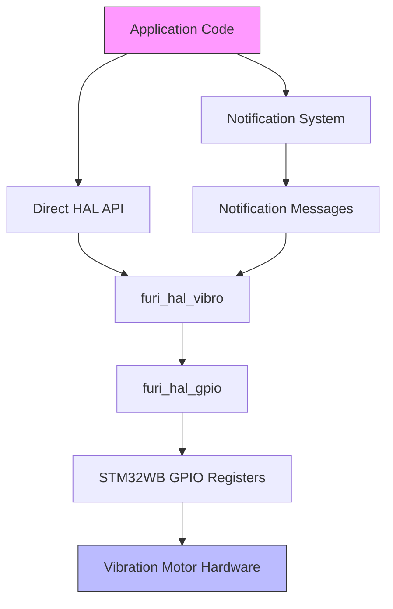
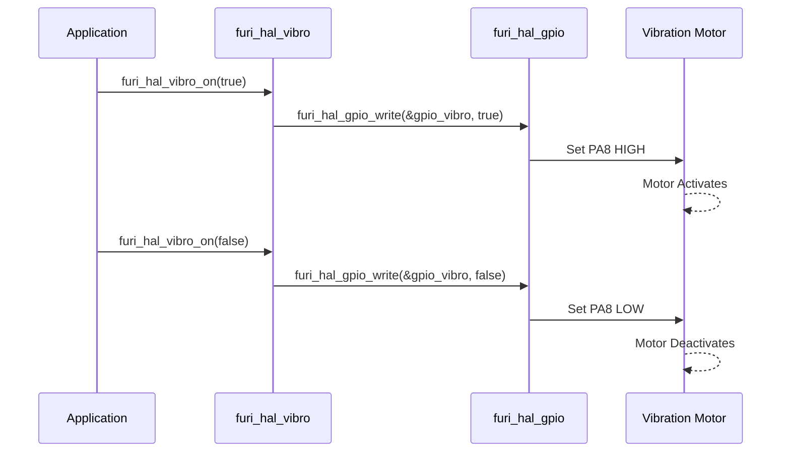

# Vibration Motor Specifications

<cite>
**Referenced Files in This Document**   
- [furi_hal_vibro.h](file://targets/furi_hal_include/furi_hal_vibro.h#L1-L29)
- [furi_hal_vibro.c](file://targets/f7/furi_hal/furi_hal_vibro.c#L1-L15)
- [furi_hal_resources.h](file://targets/f7/furi_hal/furi_hal_resources.h#L55-L189)
- [furi_hal_resources.c](file://targets/f7/furi_hal/furi_hal_resources.c#L1-L291)
- [vibro_test.c](file://applications/debug/vibro_test/vibro_test.c#L1-L68)
- [notification_messages.h](file://applications/services/notification/notification_messages.h#L1-L151)
- [notification_messages.c](file://applications/services/notification/notification_messages.c#L1-L596)
</cite>

## Table of Contents
1. [Introduction](#introduction)
2. [Hardware Specifications](#hardware-specifications)
3. [Driver Architecture](#driver-architecture)
4. [API Implementation](#api-implementation)
5. [Control Mechanisms](#control-mechanisms)
6. [Haptic Feedback Patterns](#haptic-feedback-patterns)
7. [Practical Usage Examples](#practical-usage-examples)
8. [Initialization Sequence](#initialization-sequence)
9. [Power and Lifespan Considerations](#power-and-lifespan-considerations)

## Introduction
This document provides comprehensive technical documentation for the vibration motor peripheral on the Flipper Zero device. The vibration motor serves as a haptic feedback mechanism, providing tactile responses to user interactions and system events. The implementation consists of a hardware interface layer (Furi HAL) that abstracts the GPIO control, a notification system that manages predefined haptic patterns, and application-level interfaces that allow developers to implement custom vibration sequences. This documentation covers the electrical specifications, driver architecture, API usage, and practical implementation patterns for the vibration motor system.

## Hardware Specifications
The vibration motor on the Flipper Zero device is controlled through a dedicated GPIO pin that provides on/off control. The motor operates at the device's logic voltage level of 3.3V, which is standard for the STM32WB microcontroller platform. The motor is connected to GPIOA pin 8 (PA8) on the STM32WB55RG microcontroller, which is specifically designated for vibration control.

The vibration motor draws current when activated, with the exact current draw depending on the specific motor model used in the Flipper Zero hardware revision. The GPIO pin is configured in push-pull output mode with low speed, providing sufficient drive capability for the small haptic motor. The pin is initialized with a pull-down resistor to ensure the motor remains off during system startup and reset conditions, preventing unintended vibration activation.

The vibration characteristics are binary in nature—either on or off—without hardware-level pulse-width modulation (PWM) for intensity control. However, software-based PWM can be implemented by rapidly toggling the motor state to achieve variable perceived intensity through duty cycle modulation.

**Section sources**
- [furi_hal_resources.h](file://targets/f7/furi_hal/furi_hal_resources.h#L187-L189)
- [furi_hal_vibro.c](file://targets/f7/furi_hal/furi_hal_vibro.c#L1-L15)

## Driver Architecture
The vibration motor driver is implemented as part of the Furi Hardware Abstraction Layer (HAL), providing a simple interface for controlling the haptic feedback system. The architecture follows a layered approach with clear separation between hardware access, driver logic, and application interfaces.

The driver consists of two primary components: the header file (`furi_hal_vibro.h`) which defines the public API, and the implementation file (`furi_hal_vibro.c`) which contains the actual control logic. The driver interfaces with the GPIO subsystem through the `furi_hal_gpio` module, abstracting the low-level register operations required to control the vibration motor pin.

The notification system provides an additional layer of abstraction, allowing applications to trigger predefined haptic patterns without directly managing the motor state. This system uses message sequences that can combine vibration commands with delays and other notifications (such as LED changes) to create complex feedback patterns.



**Diagram sources**
- [furi_hal_vibro.h](file://targets/furi_hal_include/furi_hal_vibro.h#L1-L29)
- [furi_hal_vibro.c](file://targets/f7/furi_hal/furi_hal_vibro.c#L1-L15)
- [notification_messages.h](file://applications/services/notification/notification_messages.h#L1-L151)

**Section sources**
- [furi_hal_vibro.h](file://targets/furi_hal_include/furi_hal_vibro.h#L1-L29)
- [furi_hal_vibro.c](file://targets/f7/furi_hal/furi_hal_vibro.c#L1-L15)

## API Implementation
The vibration motor API is minimal and focused on essential control functions. The public interface is defined in `furi_hal_vibro.h` and consists of two primary functions: initialization and state control.

The `furi_hal_vibro_init()` function initializes the GPIO pin connected to the vibration motor, configuring it as a push-pull output with no pull resistors and low speed. This function is typically called during system startup as part of the hardware initialization sequence.

The `furi_hal_vibro_on(bool value)` function controls the state of the vibration motor, accepting a boolean parameter where `true` activates the motor and `false` deactivates it. This function directly writes to the GPIO pin using the `furi_hal_gpio_write()` function from the GPIO abstraction layer.

```c
void furi_hal_vibro_init(void) {
    furi_hal_gpio_init(&gpio_vibro, GpioModeOutputPushPull, GpioPullNo, GpioSpeedLow);
    furi_hal_gpio_write(&gpio_vibro, false);
    FURI_LOG_I(TAG, "Init OK");
}

void furi_hal_vibro_on(bool value) {
    furi_hal_gpio_write(&gpio_vibro, value);
}
```

The implementation is straightforward, reflecting the binary nature of the vibration motor control. There is no built-in support for intensity control at the HAL level, leaving such functionality to be implemented at higher levels through software PWM techniques.

**Section sources**
- [furi_hal_vibro.h](file://targets/furi_hal_include/furi_hal_vibro.h#L1-L29)
- [furi_hal_vibro.c](file://targets/f7/furi_hal/furi_hal_vibro.c#L1-L15)

## Control Mechanisms
The vibration motor can be controlled through two primary mechanisms: direct HAL API calls and the notification system. The direct API provides immediate control over the motor state, while the notification system enables the execution of predefined haptic patterns.

Direct control is achieved by calling `furi_hal_vibro_on(true)` to activate the motor and `furi_hal_vibro_on(false)` to deactivate it. This approach gives applications complete control over the timing and duration of vibration events.

The notification system provides a more sophisticated control mechanism through message sequences. Applications can send notification messages to trigger predefined vibration patterns, such as single or double pulses. This system is particularly useful for consistent user feedback across different applications.

For intensity control, software PWM can be implemented by rapidly toggling the motor state with varying duty cycles. For example, a 50% intensity could be achieved by alternating 10ms on and 10ms off periods, while 25% intensity would use 5ms on and 15ms off periods. The effectiveness of this approach depends on the mechanical response time of the vibration motor.



**Diagram sources**
- [furi_hal_vibro.c](file://targets/f7/furi_hal/furi_hal_vibro.c#L1-L15)
- [furi_hal_gpio.h](file://targets/f7/furi_hal/furi_hal_gpio.h#L1-L50)

**Section sources**
- [furi_hal_vibro.c](file://targets/f7/furi_hal/furi_hal_vibro.c#L1-L15)

## Haptic Feedback Patterns
The Flipper Zero firmware includes several predefined haptic feedback patterns through the notification system. These patterns are implemented as sequences of notification messages that combine vibration commands with delays to create specific tactile experiences.

The available patterns include:
- **Single vibration pulse**: A brief vibration to acknowledge user input
- **Double vibration pulse**: Two quick vibrations to indicate successful operations
- **Continuous vibration**: Sustained vibration for alerts or warnings

These patterns are defined in the `notification_messages.c` file as `NotificationSequence` structures. For example, the single vibration pattern (`sequence_single_vibro`) consists of turning the vibration on, waiting 100ms, and then turning it off:

```c
const NotificationSequence sequence_single_vibro = {
    &message_vibro_on,
    &message_delay_100,
    &message_vibro_off,
    NULL,
};
```

The double vibration pattern (`sequence_double_vibro`) creates two pulses with a pause between them:

```c
const NotificationSequence sequence_double_vibro = {
    &message_vibro_on,
    &message_delay_100,
    &message_vibro_off,
    &message_delay_100,
    &message_vibro_on,
    &message_delay_100,
    &message_vibro_off,
    NULL,
};
```

Applications can trigger these patterns by sending the appropriate notification message through the notification service, allowing for consistent haptic feedback across the system without each application needing to implement its own timing logic.

**Section sources**
- [notification_messages.h](file://applications/services/notification/notification_messages.h#L1-L151)
- [notification_messages.c](file://applications/services/notification/notification_messages.c#L1-L596)

## Practical Usage Examples
The `vibro_test.c` application provides a practical example of how to implement haptic feedback in Flipper Zero applications. This debug application demonstrates both direct motor control and notification-based control.

In the test application, vibration is controlled through user input events. When the OK button is pressed, the vibration is activated, and when it is released, the vibration is deactivated. This is implemented using the notification system to ensure consistent behavior with other system notifications.

```c
if(event.key == InputKeyOk) {
    if(event.type == InputTypePress) {
        notification_message(notification, &sequence_set_vibro_on);
        notification_message(notification, &sequence_set_green_255);
    } else if(event.type == InputTypeRelease) {
        notification_message(notification, &sequence_reset_vibro);
        notification_message(notification, &sequence_reset_green);
    }
}
```

For custom applications, developers can implement their own vibration patterns by creating sequences of `furi_hal_vibro_on()` calls with appropriate delays. For example, a custom alert pattern might use a series of short pulses:

```c
// Custom triple-pulse alert
furi_hal_vibro_on(true);
furi_delay_ms(50);
furi_hal_vibro_off();
furi_delay_ms(50);
furi_hal_vibro_on(true);
furi_delay_ms(50);
furi_hal_vibro_off();
furi_delay_ms(50);
furi_hal_vibro_on(true);
furi_delay_ms(50);
furi_hal_vibro_off();
```

When implementing custom patterns, developers should consider the mechanical limitations of the vibration motor and avoid excessively rapid toggling that could reduce motor lifespan.

**Section sources**
- [vibro_test.c](file://applications/debug/vibro_test/vibro_test.c#L1-L68)

## Initialization Sequence
The vibration motor initialization occurs during the early stages of system startup as part of the hardware resources initialization. The sequence is implemented in the `furi_hal_resources_init_early()` function, which configures critical GPIO pins before the main system initialization.

The initialization sequence for the vibration motor is as follows:
1. Enable the GPIOA peripheral clock through the bus system
2. Configure the VIBRO pin (PA8) with a pull-down resistor at the power level to ensure it remains low during reset
3. Initialize the GPIO pin as a push-pull output with no pull resistors and low speed
4. Set the initial state to off (low)

```c
void furi_hal_vibro_init(void) {
    furi_hal_gpio_init(&gpio_vibro, GpioModeOutputPushPull, GpioPullNo, GpioSpeedLow);
    furi_hal_gpio_write(&gpio_vibro, false);
    FURI_LOG_I(TAG, "Init OK");
}
```

The pull-down configuration is particularly important as it prevents the motor from activating during power-up or reset conditions, which could occur if the pin were left floating. This ensures a predictable startup state and prevents unintended battery drain.

The initialization is performed early in the boot process to make the vibration motor available for system notifications during startup and to ensure proper pin configuration before any application code attempts to use it.

**Section sources**
- [furi_hal_vibro.c](file://targets/f7/furi_hal/furi_hal_vibro.c#L1-L15)
- [furi_hal_resources.c](file://targets/f7/furi_hal/furi_hal_resources.c#L1-L291)

## Power and Lifespan Considerations
While specific power consumption data for the vibration motor is not available in the firmware code, several considerations should be taken into account for power management and motor longevity.

The vibration motor draws current when active, contributing to overall system power consumption. Since the Flipper Zero is battery-powered, prolonged vibration should be avoided to conserve battery life. Applications should use the minimum vibration duration necessary to convey the intended feedback.

For motor lifespan, continuous operation should be limited to prevent overheating and mechanical wear. The motor is designed for intermittent use rather than continuous operation. As a general guideline, vibration periods should be kept under 500ms for single events, with adequate cooldown periods between successive activations.

When implementing software PWM for intensity control, developers should avoid extremely high frequencies that could cause excessive switching losses or mechanical stress on the motor. A PWM frequency in the range of 50-100Hz is typically sufficient for perceived intensity control without compromising motor lifespan.

Applications should also consider user experience when designing vibration patterns. Excessive or unpredictable vibration can be annoying to users and may lead to the feature being disabled. Consistent, purposeful haptic feedback provides the best user experience while minimizing unnecessary power consumption and motor wear.

**Section sources**
- [furi_hal_vibro.c](file://targets/f7/furi_hal/furi_hal_vibro.c#L1-L15)
- [notification_messages.c](file://applications/services/notification/notification_messages.c#L1-L596)