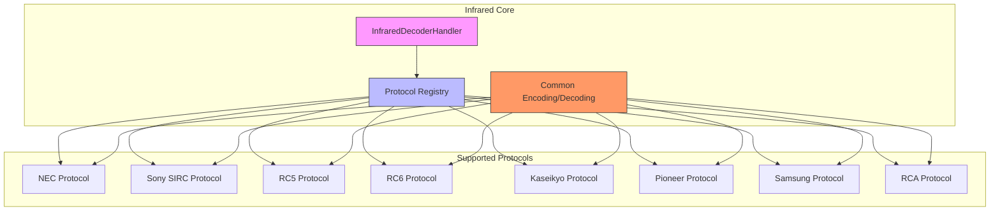
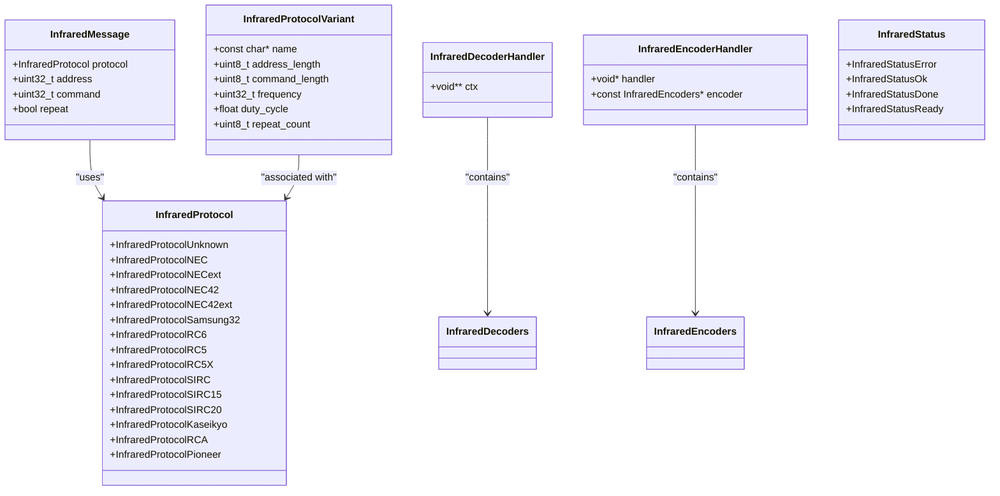
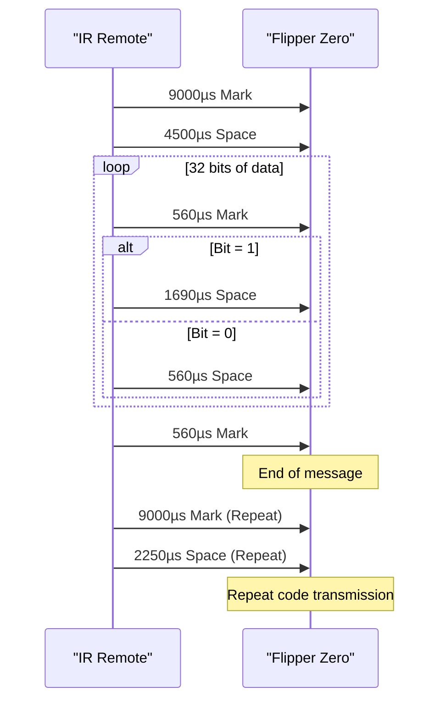
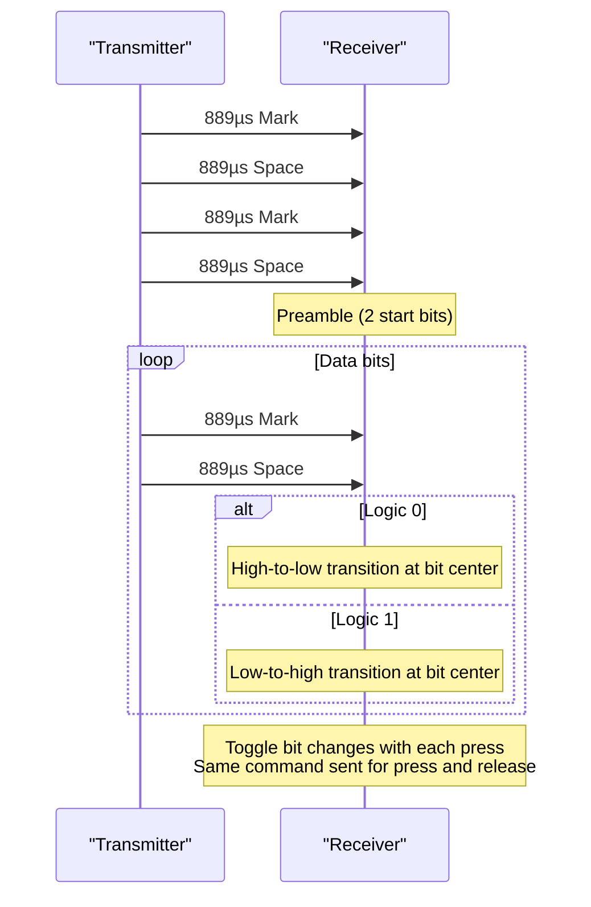
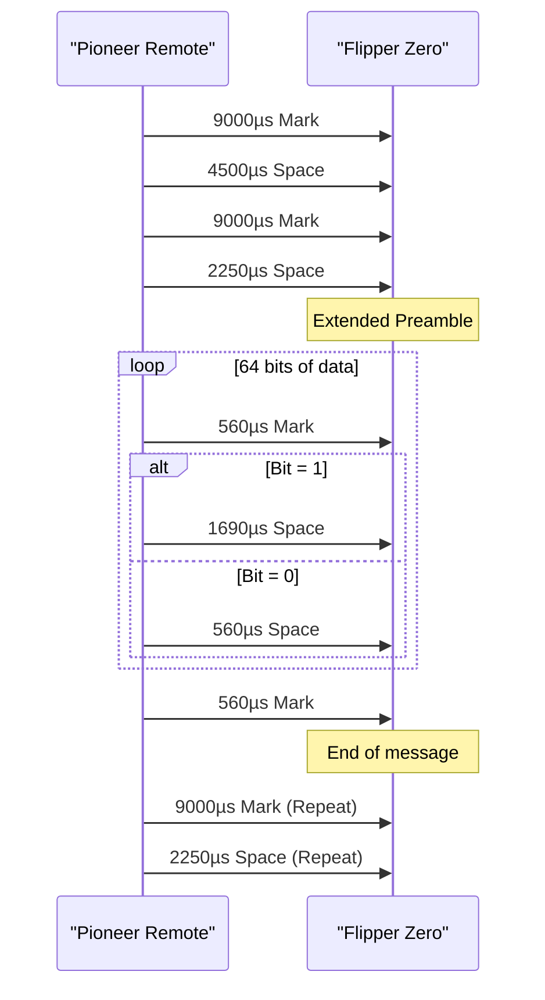
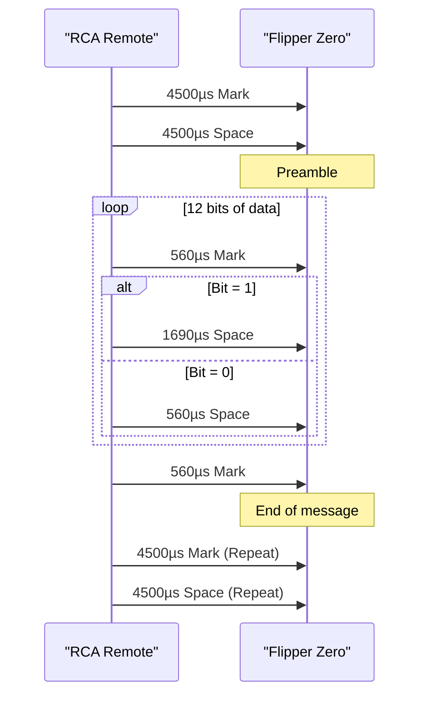
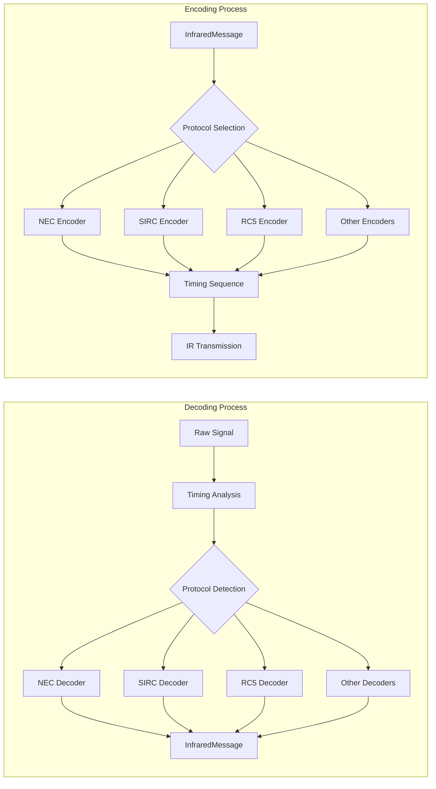

# Infrared Protocols

<cite>
**Referenced Files in This Document**   
- [infrared.c](file://lib/infrared/encoder_decoder/infrared.c)
- [infrared.h](file://lib/infrared/encoder_decoder/infrared.h)
- [infrared_protocol_nec.c](file://lib/infrared/encoder_decoder/nec/infrared_protocol_nec.c)
- [infrared_protocol_nec.h](file://lib/infrared/encoder_decoder/nec/infrared_protocol_nec.h)
- [infrared_protocol_sirc.c](file://lib/infrared/encoder_decoder/sirc/infrared_protocol_sirc.c)
- [infrared_protocol_sirc.h](file://lib/infrared/encoder_decoder/sirc/infrared_protocol_sirc.h)
- [infrared_protocol_rc5.c](file://lib/infrared/encoder_decoder/rc5/infrared_protocol_rc5.c)
- [infrared_protocol_rc5.h](file://lib/infrared/encoder_decoder/rc5/infrared_protocol_rc5.h)
- [infrared_protocol_rc6.c](file://lib/infrared/encoder_decoder/rc6/infrared_protocol_rc6.c)
- [infrared_protocol_rc6.h](file://lib/infrared/encoder_decoder/rc6/infrared_protocol_rc6.h)
- [infrared_protocol_kaseikyo.c](file://lib/infrared/encoder_decoder/kaseikyo/infrared_protocol_kaseikyo.c)
- [infrared_protocol_kaseikyo.h](file://lib/infrared/encoder_decoder/kaseikyo/infrared_protocol_kaseikyo.h)
- [infrared_protocol_pioneer.c](file://lib/infrared/encoder_decoder/pioneer/infrared_protocol_pioneer.c)
- [infrared_protocol_pioneer.h](file://lib/infrared/encoder_decoder/pioneer/infrared_protocol_pioneer.h)
- [infrared_protocol_samsung.c](file://lib/infrared/encoder_decoder/samsung/infrared_protocol_samsung.c)
- [infrared_protocol_samsung.h](file://lib/infrared/encoder_decoder/samsung/infrared_protocol_samsung.h)
- [infrared_protocol_rca.c](file://lib/infrared/encoder_decoder/rca/infrared_protocol_rca.c)
- [infrared_protocol_rca.h](file://lib/infrared/encoder_decoder/rca/infrared_protocol_rca.h)
</cite>

## Table of Contents
1. [Introduction](#introduction)
2. [Infrared Protocol Architecture](#infrared-protocol-architecture)
3. [Core Data Structures](#core-data-structures)
4. [Protocol Registry System](#protocol-registry-system)
5. [Protocol-Specific Implementations](#protocol-specific-implementations)
6. [NEC Protocol](#nec-protocol)
7. [Sony SIRC Protocol](#sony-sirc-protocol)
8. [RC5 and RC6 Protocols](#rc5-and-rc6-protocols)
9. [Kaseikyo Protocol](#kaseikyo-protocol)
10. [Pioneer Protocol](#pioneer-protocol)
11. [Samsung Protocol](#samsung-protocol)
12. [RCA Protocol](#rca-protocol)
13. [Signal Encoding and Decoding](#signal-encoding-and-decoding)
14. [Error Detection and Timing Tolerance](#error-detection-and-timing-tolerance)
15. [Universal Remote Creation](#universal-remote-creation)
16. [Learning Mode Functionality](#learning-mode-functionality)

## Introduction
The Flipper Zero supports a comprehensive suite of infrared protocols for remote control emulation and signal analysis. This documentation details the technical specifications, implementation architecture, and operational characteristics of the supported infrared protocols including NEC, Sony SIRC, RC5, RC6, Pioneer, Kaseikyo, Samsung, and RCA. The system is designed to capture, analyze, encode, and transmit infrared signals with high precision, enabling universal remote functionality and protocol learning capabilities. The infrared subsystem follows a modular architecture with a centralized registry system that manages multiple protocol implementations through a consistent interface.

## Infrared Protocol Architecture
The infrared protocol system in Flipper Zero employs a modular, extensible architecture that allows for multiple protocol implementations to coexist and be managed through a unified interface. The core architecture consists of a protocol registry that maintains handlers for both encoding and decoding operations across all supported protocols. This design enables concurrent processing of different protocol types during signal reception and provides a consistent API for signal transmission.



**Diagram sources**
- [infrared.c](file://lib/infrared/encoder_decoder/infrared.c#L20-L100)
- [infrared.h](file://lib/infrared/encoder_decoder/infrared.h#L50-L100)

**Section sources**
- [infrared.c](file://lib/infrared/encoder_decoder/infrared.c#L1-L200)
- [infrared.h](file://lib/infrared/encoder_decoder/infrared.h#L1-L200)

## Core Data Structures
The infrared system utilizes several key data structures to represent messages, protocols, and decoder/encoder states. These structures provide a consistent interface across different protocol implementations while allowing for protocol-specific variations in addressing, command structure, and timing parameters.



**Diagram sources**
- [infrared.h](file://lib/infrared/encoder_decoder/infrared.h#L60-L150)
- [infrared.c](file://lib/infrared/encoder_decoder/infrared.c#L15-L50)

**Section sources**
- [infrared.h](file://lib/infrared/encoder_decoder/infrared.h#L1-L200)

## Protocol Registry System
The protocol registry system is the central component that manages all supported infrared protocols. It maintains a static array of protocol handlers that provide consistent interfaces for allocation, encoding, decoding, resetting, and freeing resources. This registry enables the system to simultaneously process signals from multiple protocols during reception and select the appropriate encoding method for transmission.

```c
static const InfraredEncoderDecoder infrared_encoder_decoder[] = {
    {
        .decoder =
            {.alloc = infrared_decoder_nec_alloc,
             .decode = infrared_decoder_nec_decode,
             .reset = infrared_decoder_nec_reset,
             .check_ready = infrared_decoder_nec_check_ready,
             .free = infrared_decoder_nec_free},
        .encoder =
            {.alloc = infrared_encoder_nec_alloc,
             .encode = infrared_encoder_nec_encode,
             .reset = infrared_encoder_nec_reset,
             .free = infrared_encoder_nec_free},
        .get_protocol_variant = infrared_protocol_nec_get_variant,
    },
    {
        .decoder =
            {.alloc = infrared_decoder_samsung32_alloc,
             .decode = infrared_decoder_samsung32_decode,
             .reset = infrared_decoder_samsung32_reset,
             .check_ready = infrared_decoder_samsung32_check_ready,
             .free = infrared_decoder_samsung32_free},
        .encoder =
            {.alloc = infrared_encoder_samsung32_alloc,
             .encode = infrared_encoder_samsung32_encode,
             .reset = infrared_encoder_samsung32_reset,
             .free = infrared_encoder_samsung32_free},
        .get_protocol_variant = infrared_protocol_samsung32_get_variant,
    },
    // Additional protocols follow the same pattern
};
```

The registry system allows for efficient protocol lookup and instantiation through helper functions that map protocol enumerations to their corresponding implementations. This design supports easy addition of new protocols by simply extending the array with the appropriate function pointers and variant information.

**Section sources**
- [infrared.c](file://lib/infrared/encoder_decoder/infrared.c#L50-L200)

## Protocol-Specific Implementations
Each infrared protocol is implemented as a separate module within the encoder_decoder directory, following a consistent naming convention and interface pattern. The implementation structure includes dedicated decoder and encoder components that handle the specific timing, modulation, and data encoding requirements of each protocol. All protocol implementations adhere to the common interface defined in the registry system, ensuring compatibility with the core infrared processing functions.

The protocol-specific files are organized in subdirectories under lib/infrared/encoder_decoder/ with each protocol having its own directory containing implementation files for decoding, encoding, and protocol variant definitions. This modular structure facilitates maintenance and extension of the infrared protocol support.

## NEC Protocol
The NEC protocol implementation supports multiple variants including standard NEC, NEC extended, NEC42, and NEC42 extended formats. The protocol uses pulse distance modulation with a 38kHz carrier frequency and follows a specific timing structure for preamble, data bits, and repeat codes.



**Diagram sources**
- [infrared_protocol_nec.h](file://lib/infrared/encoder_decoder/nec/infrared_protocol_nec.h#L1-L30)
- [infrared_protocol_nec.c](file://lib/infrared/encoder_decoder/nec/infrared_protocol_nec.c#L1-L74)

**Section sources**
- [infrared_protocol_nec.c](file://lib/infrared/encoder_decoder/nec/infrared_protocol_nec.c#L1-L74)
- [infrared_protocol_nec.h](file://lib/infrared/encoder_decoder/nec/infrared_protocol_nec.h#L1-L30)

The NEC protocol defines several timing constants:
- **Preamble mark**: 9000µs ± 10%
- **Preamble space**: 4500µs ± 10%
- **Bit 1 mark**: 560µs
- **Bit 1 space**: 1690µs
- **Bit 0 mark**: 560µs
- **Bit 0 space**: 560µs
- **Silence time**: 50ms minimum between messages

The protocol supports address and command fields of varying lengths depending on the variant, with the standard NEC using 8-bit address and 8-bit command, while extended variants support longer addressing schemes.

## Sony SIRC Protocol
The Sony SIRC (Sony Infrared Remote Control) protocol uses pulse width modulation with a 40kHz carrier frequency. The Flipper Zero implementation supports three variants: SIRC (12-bit), SIRC15 (15-bit), and SIRC20 (20-bit), which differ in the length of the address field.

```mermaid
flowchart TD
Start([Preamble]) --> Mark["900µs Mark"]
Mark --> Space["2250µs Space"]
Space --> Data["Data Transmission"]
Data --> Command["7-bit Command<br/>(LSB first)"]
Data --> Address["5/8/13-bit Address<br/>(LSB first)"]
Command --> End
Address --> End
End([End of Message]) --> Repeat["Repeat Sequence"]
Repeat --> Mark
Repeat --> Space
Note: SIRC: 5b addr, SIRC15: 8b addr, SIRC20: 13b addr
```

**Diagram sources**
- [infrared_protocol_sirc.h](file://lib/infrared/encoder_decoder/sirc/infrared_protocol_sirc.h#L1-L38)
- [infrared_protocol_sirc.c](file://lib/infrared/encoder_decoder/sirc/infrared_protocol_sirc.c#L1-L50)

**Section sources**
- [infrared_protocol_sirc.c](file://lib/infrared/encoder_decoder/sirc/infrared_protocol_sirc.c#L1-L50)
- [infrared_protocol_sirc.h](file://lib/infrared/encoder_decoder/sirc/infrared_protocol_sirc.h#L1-L38)

Key characteristics of the SIRC protocol:
- **Carrier frequency**: 40kHz
- **Preamble mark**: 2400µs
- **Preamble space**: 600µs
- **Bit 1 duration**: 1200µs
- **Bit 0 duration**: 600µs
- **Inter-message gap**: 45ms minimum

Unlike some other protocols, SIRC does not have a distinct repeat code. Instead, the entire message is retransmitted for repeat commands, and the system must detect rapid successive transmissions to identify repeat sequences.

## RC5 and RC6 Protocols
The RC5 and RC6 protocols use Manchester encoding with a 36kHz carrier frequency. These protocols are characterized by their biphase modulation scheme where each bit period is divided into two halves, with a transition in the middle of each bit period.



**Diagram sources**
- [infrared_protocol_rc5.h](file://lib/infrared/encoder_decoder/rc5/infrared_protocol_rc5.h#L1-L30)
- [infrared_protocol_rc5.c](file://lib/infrared/encoder_decoder/rc5/infrared_protocol_rc5.c#L1-L50)
- [infrared_protocol_rc6.h](file://lib/infrared/encoder_decoder/rc6/infrared_protocol_rc6.h#L1-L30)
- [infrared_protocol_rc6.c](file://lib/infrared/encoder_decoder/rc6/infrared_protocol_rc6.c#L1-L50)

**Section sources**
- [infrared_protocol_rc5.c](file://lib/infrared/encoder_decoder/rc5/infrared_protocol_rc5.c#L1-L50)
- [infrared_protocol_rc5.h](file://lib/infrared/encoder_decoder/rc5/infrared_protocol_rc5.h#L1-L30)
- [infrared_protocol_rc6.c](file://lib/infrared/encoder_decoder/rc6/infrared_protocol_rc6.c#L1-L50)
- [infrared_protocol_rc6.h](file://lib/infrared/encoder_decoder/rc6/infrared_protocol_rc6.h#L1-L30)

RC5 protocol specifications:
- **Bit period**: 1778µs (889µs + 889µs)
- **Carrier frequency**: 36kHz
- **Duty cycle**: 1/3
- **Message structure**: 2 start bits, 1 toggle bit, 5 address bits, 6 command bits
- **Toggle bit**: Changes state with each key press, remains the same for key release

RC6 is an extension of RC5 with additional features including a mode bit and support for longer messages, while maintaining backward compatibility with RC5 receivers.

## Kaseikyo Protocol
The Kaseikyo protocol, also known as JVC protocol, uses pulse distance modulation with a 38kHz carrier frequency. It features a unique preamble structure and supports both standard and extended address formats.

```mermaid
flowchart LR
A[Preamble] --> B[4500µs Mark]
A --> C[4500µs Space]
B --> D[Data Transmission]
C --> D
D --> E[8-bit Address<br/>(MSB first)]
D --> F[8-bit Command<br/>(MSB first)]
E --> G[End of Message]
F --> G
G --> H[Repeat Code]
H --> I[9000µs Mark]
H --> J[2250µs Space]
```

**Diagram sources**
- [infrared_protocol_kaseikyo.h](file://lib/infrared/encoder_decoder/kaseikyo/infrared_protocol_kaseikyo.h#L1-L30)
- [infrared_protocol_kaseikyo.c](file://lib/infrared/encoder_decoder/kaseikyo/infrared_protocol_kaseikyo.c#L1-L50)

**Section sources**
- [infrared_protocol_kaseikyo.c](file://lib/infrared/encoder_decoder/kaseikyo/infrared_protocol_kaseikyo.c#L1-L50)
- [infrared_protocol_kaseikyo.h](file://lib/infrared/encoder_decoder/kaseikyo/infrared_protocol_kaseikyo.h#L1-L30)

Key timing parameters for Kaseikyo:
- **Preamble mark**: 4500µs
- **Preamble space**: 4500µs
- **Bit period**: 1120µs
- **Bit 1**: 560µs mark, 1680µs space
- **Bit 0**: 560µs mark, 560µs space
- **Inter-message gap**: 45ms minimum

The protocol transmits address and command bytes with most significant bit first, and includes a repeat code that consists of a mark and space without the data payload.

## Pioneer Protocol
The Pioneer protocol uses pulse distance modulation with a 38kHz carrier frequency and features a distinctive preamble structure with dual mark pulses. This protocol supports both standard and extended command formats.



**Diagram sources**
- [infrared_protocol_pioneer.h](file://lib/infrared/encoder_decoder/pioneer/infrared_protocol_pioneer.h#L1-L30)
- [infrared_protocol_pioneer.c](file://lib/infrared/encoder_decoder/pioneer/infrared_protocol_pioneer.c#L1-L50)

**Section sources**
- [infrared_protocol_pioneer.c](file://lib/infrared/encoder_decoder/pioneer/infrared_protocol_pioneer.c#L1-L50)
- [infrared_protocol_pioneer.h](file://lib/infrared/encoder_decoder/pioneer/infrared_protocol_pioneer.h#L1-L30)

Pioneer protocol characteristics:
- **Carrier frequency**: 38kHz
- **First preamble mark**: 9000µs
- **First preamble space**: 4500µs
- **Second preamble mark**: 9000µs
- **Second preamble space**: 2250µs
- **Bit 1**: 560µs mark, 1690µs space
- **Bit 0**: 560µs mark, 560µs space
- **Message length**: 64 bits (extended format)

The dual preamble structure distinguishes Pioneer from other NEC-based protocols and provides improved noise immunity in home theater environments.

## Samsung Protocol
The Samsung protocol is based on the NEC standard but uses a different address and command structure. It employs pulse distance modulation with a 38kHz carrier frequency and supports 32-bit messages.

```mermaid
flowchart TD
A[Preamble] --> B[9000µs Mark]
A --> C[4500µs Space]
B --> D[Data Transmission]
C --> D
D --> E[16-bit Address<br/>(MSB first)]
D --> F[16-bit Command<br/>(MSB first)]
E --> G[End of Message]
F --> G
G --> H[Repeat Code]
H --> I[9000µs Mark]
H --> J[2250µs Space]
```

**Diagram sources**
- [infrared_protocol_samsung.h](file://lib/infrared/encoder_decoder/samsung/infrared_protocol_samsung.h#L1-L30)
- [infrared_protocol_samsung.c](file://lib/infrared/encoder_decoder/samsung/infrared_protocol_samsung.c#L1-L50)

**Section sources**
- [infrared_protocol_samsung.c](file://lib/infrared/encoder_decoder/samsung/infrared_protocol_samsung.c#L1-L50)
- [infrared_protocol_samsung.h](file://lib/infrared/encoder_decoder/samsung/infrared_protocol_samsung.h#L1-L30)

Samsung protocol specifications:
- **Carrier frequency**: 38kHz
- **Preamble mark**: 9000µs
- **Preamble space**: 4500µs
- **Bit 1**: 560µs mark, 1690µs space
- **Bit 0**: 560µs mark, 560µs space
- **Address length**: 16 bits
- **Command length**: 16 bits
- **Message length**: 32 bits total

The protocol is functionally similar to NEC but with doubled address and command fields, providing a larger address space for device addressing in home entertainment systems.

## RCA Protocol
The RCA protocol uses pulse distance modulation with a 38kHz carrier frequency and features a simple preamble structure followed by data transmission. It supports both standard and extended formats with varying address and command lengths.



**Diagram sources**
- [infrared_protocol_rca.h](file://lib/infrared/encoder_decoder/rca/infrared_protocol_rca.h#L1-L30)
- [infrared_protocol_rca.c](file://lib/infrared/encoder_decoder/rca/infrared_protocol_rca.c#L1-L50)

**Section sources**
- [infrared_protocol_rca.c](file://lib/infrared/encoder_decoder/rca/infrared_protocol_rca.c#L1-L50)
- [infrared_protocol_rca.h](file://lib/infrared/encoder_decoder/rca/infrared_protocol_rca.h#L1-L30)

RCA protocol characteristics:
- **Carrier frequency**: 38kHz
- **Preamble mark**: 4500µs
- **Preamble space**: 4500µs
- **Bit 1**: 560µs mark, 1690µs space
- **Bit 0**: 560µs mark, 560µs space
- **Message length**: 12 bits (8 command + 4 address)
- **Inter-message gap**: 45ms minimum

The protocol uses a symmetric preamble and follows the same pulse distance modulation scheme as NEC, making it compatible with many NEC-based decoders with appropriate timing adjustments.

## Signal Encoding and Decoding
The signal encoding and decoding system in Flipper Zero employs a two-stage processing approach that separates protocol-agnostic timing analysis from protocol-specific data interpretation. The decoder processes raw signal timings and levels, while the encoder generates precise timing sequences for transmission.



**Diagram sources**
- [infrared.c](file://lib/infrared/encoder_decoder/infrared.c#L150-L250)
- [infrared.h](file://lib/infrared/encoder_decoder/infrared.h#L100-L150)

**Section sources**
- [infrared.c](file://lib/infrared/encoder_decoder/infrared.c#L150-L300)
- [infrared.h](file://lib/infrared/encoder_decoder/infrared.h#L100-L200)

The decoding process works as follows:
1. The system receives a series of timing values representing high (mark) and low (space) signal levels
2. Each protocol decoder analyzes the timing sequence against its expected preamble and bit patterns
3. When a valid preamble is detected, the decoder begins processing data bits
4. The decoded address and command values are extracted and packaged into an InfraredMessage structure
5. The message is returned to the calling application for further processing

The encoding process follows these steps:
1. An InfraredMessage structure is provided with protocol type, address, command, and repeat flag
2. The appropriate encoder is selected based on the protocol field
3. The encoder generates a sequence of timing values and signal levels
4. These values are transmitted via the infrared LED using PWM modulation
5. For repeat messages, the encoder generates the appropriate repeat code sequence

## Error Detection and Timing Tolerance
The infrared system implements robust error detection and timing tolerance mechanisms to handle signal noise and timing variations. Each protocol defines specific tolerance values for preamble and bit timing, allowing for reliable decoding even with imperfect signals.

```c
const InfraredCommonProtocolSpec infrared_protocol_nec = {
    .timings =
        {
            .preamble_mark = INFRARED_NEC_PREAMBLE_MARK,
            .preamble_space = INFRARED_NEC_PREAMBLE_SPACE,
            .bit1_mark = INFRARED_NEC_BIT1_MARK,
            .bit1_space = INFRARED_NEC_BIT1_SPACE,
            .bit0_mark = INFRARED_NEC_BIT0_MARK,
            .bit0_space = INFRARED_NEC_BIT0_SPACE,
            .preamble_tolerance = INFRARED_NEC_PREAMBLE_TOLERANCE,
            .bit_tolerance = INFRARED_NEC_BIT_TOLERANCE,
            .silence_time = INFRARED_NEC_SILENCE,
            .min_split_time = INFRARED_NEC_MIN_SPLIT_TIME,
        },
    // Additional protocol specifications
};
```

The timing tolerance system works by defining acceptable ranges for each timing parameter. When a signal is received, the system checks whether the measured duration falls within the acceptable range (nominal value ± tolerance). This approach allows the system to decode signals from remotes with slightly different timing characteristics while rejecting noise and invalid signals.

Key error detection mechanisms include:
- **Preamble validation**: Ensures the initial timing sequence matches the expected pattern
- **Bit timing verification**: Validates that each bit period falls within acceptable tolerance
- **Level alternation checking**: Detects and handles cases where signal levels do not alternate properly
- **Message completeness verification**: Ensures the expected number of bits are received
- **Checksum validation**: For protocols that include error detection codes

The system also implements a reset mechanism that clears the decoder state when invalid timing sequences are detected, preventing error propagation and ensuring reliable operation with subsequent signals.

**Section sources**
- [infrared_protocol_nec.c](file://lib/infrared/encoder_decoder/nec/infrared_protocol_nec.c#L1-L74)
- [infrared.c](file://lib/infrared/encoder_decoder/infrared.c#L200-L300)

## Universal Remote Creation
The universal remote creation functionality in Flipper Zero leverages the comprehensive protocol support to emulate a wide range of remote controls. Users can create custom remote configurations by capturing signals from existing remotes or manually configuring protocol parameters.

The process involves:
1. **Signal capture**: Recording infrared signals from an existing remote control
2. **Protocol identification**: Analyzing the captured signal to determine the protocol type
3. **Parameter extraction**: Extracting address, command, and timing information from the signal
4. **Configuration storage**: Saving the decoded information in a persistent format
5. **Transmission**: Reproducing the signal when needed

The system supports both raw signal recording and protocol-specific encoding methods, providing flexibility for different use cases. Raw recording captures the exact timing sequence, while protocol-specific encoding stores the logical message structure and regenerates the timing during transmission.

This functionality enables the Flipper Zero to serve as a universal remote control for various consumer electronics devices, supporting legacy and modern infrared protocols across different manufacturers and device types.

## Learning Mode Functionality
The learning mode functionality allows the Flipper Zero to capture and analyze infrared signals from existing remote controls. This feature enables users to teach the device new commands and create custom remote configurations.

The learning process works as follows:
1. The user enters learning mode through the device interface
2. The infrared receiver is activated and begins monitoring for signals
3. The user presses a button on the remote control to be learned
4. The system captures the timing sequence of the transmitted signal
5. The captured signal is analyzed to identify the protocol type
6. The address and command values are extracted and stored
7. The user can assign a label to the captured command for easy identification

The learning mode supports multiple capture attempts and provides feedback on successful signal reception. It can handle various signal types, including single transmissions, repeated sequences, and complex multi-message protocols.

Advanced learning features include:
- **Signal validation**: Verifying the integrity of captured signals
- **Protocol auto-detection**: Identifying the protocol type from the timing characteristics
- **Repeat code handling**: Properly capturing and reproducing repeat sequences
- **Signal quality assessment**: Evaluating the reliability of captured signals
- **Multiple capture modes**: Supporting both raw timing capture and protocol-aware decoding

This functionality transforms the Flipper Zero into a versatile tool for infrared signal analysis and remote control emulation, enabling users to work with devices that may not have documented protocol specifications.