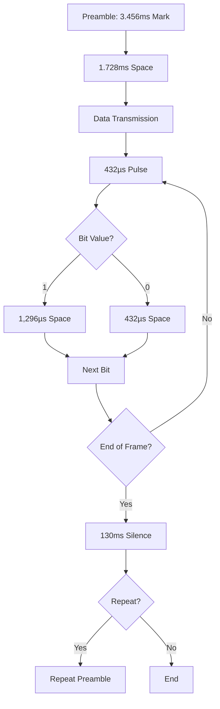
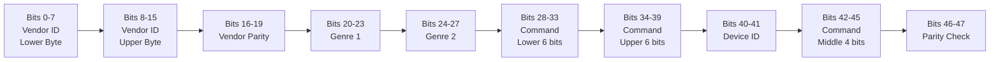
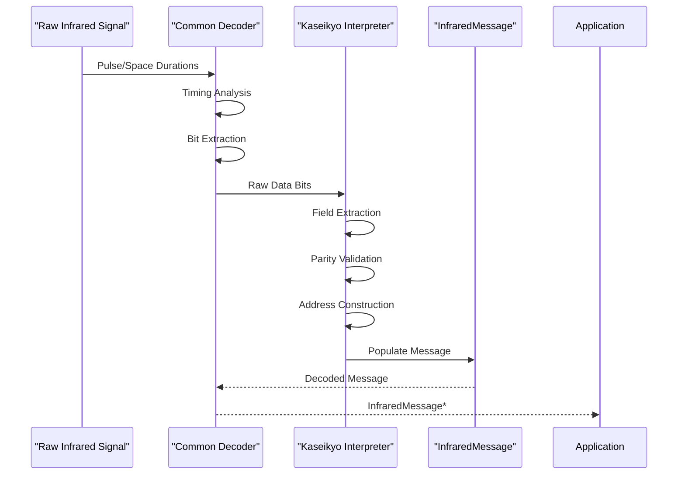
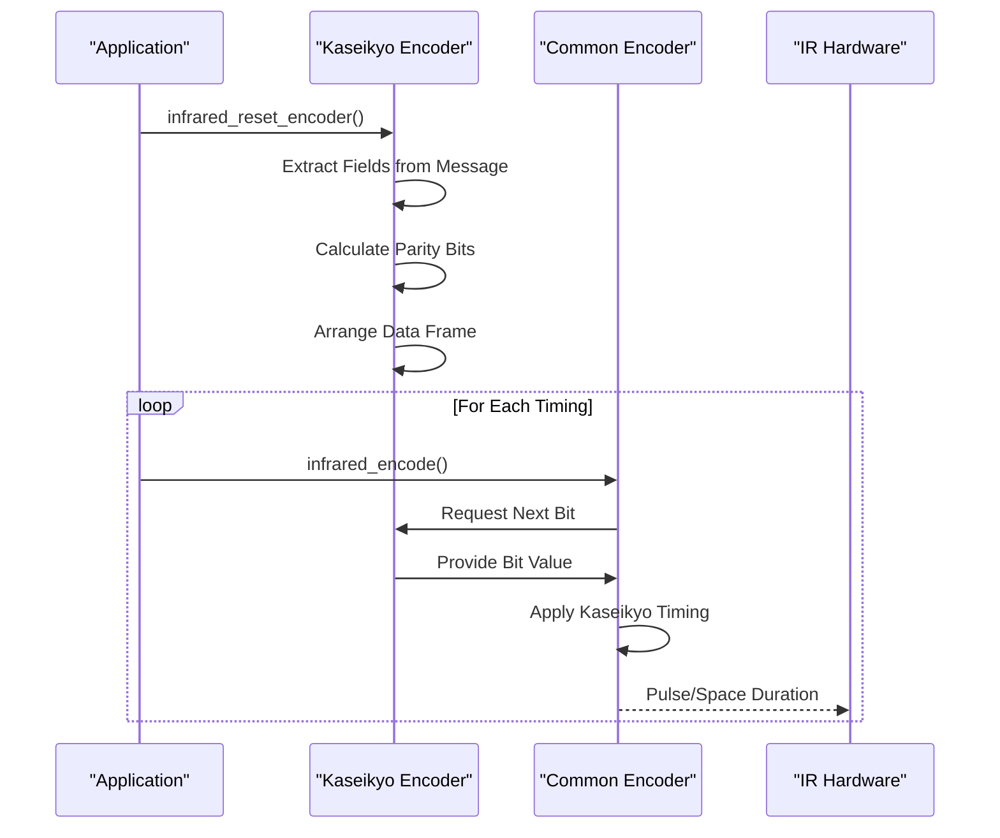
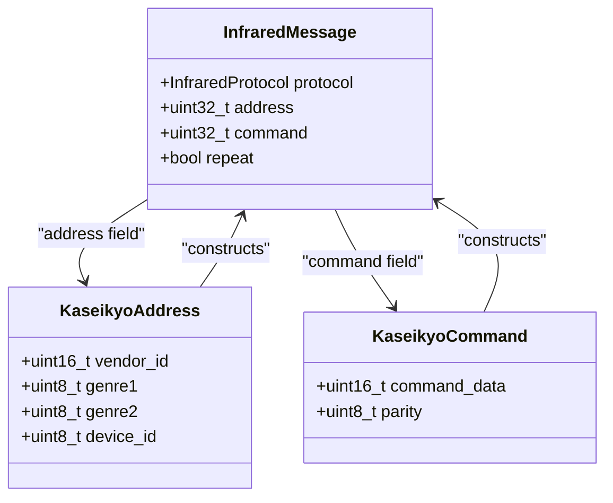
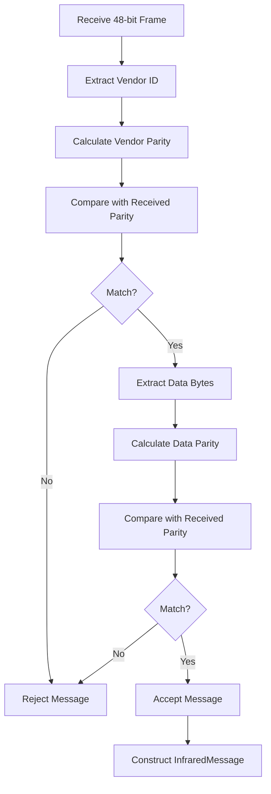
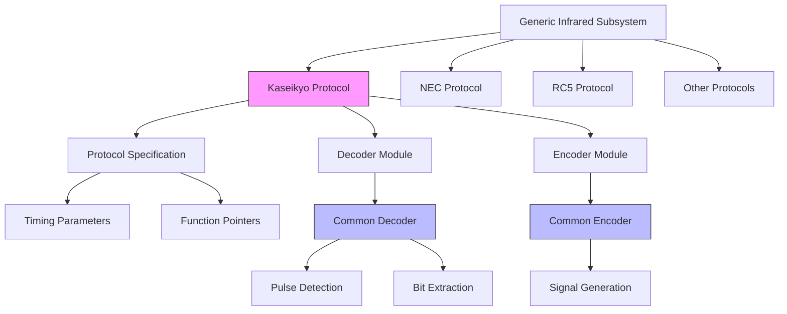

# Kaseikyo Protocol

<cite>
**Referenced Files in This Document**   
- [infrared_protocol_kaseikyo.h](file://lib/infrared/encoder_decoder/kaseikyo/infrared_protocol_kaseikyo.h)
- [infrared_protocol_kaseikyo_i.h](file://lib/infrared/encoder_decoder/kaseikyo/infrared_protocol_kaseikyo_i.h)
- [infrared_decoder_kaseikyo.c](file://lib/infrared/encoder_decoder/kaseikyo/infrared_decoder_kaseikyo.c)
- [infrared_encoder_kaseikyo.c](file://lib/infrared/encoder_decoder/kaseikyo/infrared_encoder_kaseikyo.c)
- [infrared_protocol_kaseikyo.c](file://lib/infrared/encoder_decoder/kaseikyo/infrared_protocol_kaseikyo.c)
- [infrared.h](file://lib/infrared/encoder_decoder/infrared.h)
</cite>

## Table of Contents
1. [Introduction](#introduction)
2. [Protocol Overview](#protocol-overview)
3. [Timing Specifications](#timing-specifications)
4. [Frame Structure and Data Encoding](#frame-structure-and-data-encoding)
5. [Decoder Implementation](#decoder-implementation)
6. [Encoder Implementation](#encoder-implementation)
7. [Address and Command Structure](#address-and-command-structure)
8. [Error Detection and Validation](#error-detection-and-validation)
9. [Implementation Architecture](#implementation-architecture)
10. [Usage and Integration](#usage-and-integration)

## Introduction
The Kaseikyo protocol is an infrared communication standard widely used in Japanese consumer electronics for remote control applications. This document provides a comprehensive analysis of the Kaseikyo protocol implementation within the Flipper Zero firmware, detailing its technical specifications, timing requirements, data structure, and software implementation. The protocol employs pulse distance modulation at a 38kHz carrier frequency and features a 48-bit frame structure with sophisticated addressing and error detection capabilities. This implementation enables the Flipper Zero device to both decode and transmit Kaseikyo-compliant infrared signals, facilitating control of various Japanese electronics including Panasonic, Toshiba, and other brands that adopted this standard.

## Protocol Overview
The Kaseikyo protocol is a pulse distance modulation scheme designed for reliable infrared communication in consumer electronics. It operates at a carrier frequency of 38kHz, which is the standard frequency for most infrared remote control systems. The protocol features a 48-bit frame structure that includes device addressing, command data, and error detection mechanisms. Unlike simpler infrared protocols, Kaseikyo supports extended addressing capabilities and robust error checking through parity bits, making it suitable for complex home entertainment systems with multiple devices.

The protocol begins with a preamble consisting of a 3.36ms mark (pulse) followed by a 1.665ms space (no pulse), which serves to synchronize the receiver and distinguish Kaseikyo signals from other infrared protocols. Following the preamble, the 48-bit data payload is transmitted using pulse distance modulation, where binary 1 and 0 are represented by different space durations following a fixed pulse width. The protocol also defines a repeat code mechanism for continuous keypresses, with a repeat period of approximately 130ms.

**Section sources**
- [infrared_protocol_kaseikyo.h](file://lib/infrared/encoder_decoder/kaseikyo/infrared_protocol_kaseikyo.h#L10-L30)
- [infrared.h](file://lib/infrared/encoder_decoder/infrared.h#L10)

## Timing Specifications
The Kaseikyo protocol employs precise timing parameters to ensure reliable signal transmission and reception. The fundamental timing unit is defined as 432 microseconds (µs), from which all other timing values are derived. This unit-based approach simplifies the implementation and ensures consistency across different devices.

The protocol uses pulse distance modulation, where each bit transmission begins with a fixed 432µs pulse (mark), followed by a space duration that determines the bit value:
- **Binary 1**: 432µs pulse followed by 1,296µs space (3 × unit)
- **Binary 0**: 432µs pulse followed by 432µs space (1 × unit)

The preamble sequence consists of an 8-unit mark (3,456µs) followed by a 4-unit space (1,728µs), providing a distinctive pattern that allows receivers to identify Kaseikyo signals and synchronize their decoding process. The protocol also defines a repeat period of 130,000µs (130ms) for handling continuous keypresses, with repeat messages beginning with a 3,456µs mark followed by a 56,000µs space.

Timing tolerance is carefully specified to accommodate variations in transmitter and receiver components:
- Preamble tolerance: ±200µs
- Bit timing tolerance: ±120µs

These tolerances ensure reliable operation across different environmental conditions and component variations while preventing false triggering from noise or interference.

**Diagram sources**
- [infrared_protocol_kaseikyo_i.h](file://lib/infrared/encoder_decoder/kaseikyo/infrared_protocol_kaseikyo_i.h#L5-L20)
- [infrared_protocol_kaseikyo.c](file://lib/infrared/encoder_decoder/kaseikyo/infrared_protocol_kaseikyo.c#L5-L15)

**Section sources**
- [infrared_protocol_kaseikyo_i.h](file://lib/infrared/encoder_decoder/kaseikyo/infrared_protocol_kaseikyo_i.h#L5-L20)
- [infrared_protocol_kaseikyo.c](file://lib/infrared/encoder_decoder/kaseikyo/infrared_protocol_kaseikyo.c#L5-L15)

## Frame Structure and Data Encoding
The Kaseikyo protocol transmits data in a 48-bit frame structure that contains addressing information, command data, and error detection fields. This structured approach allows for precise device targeting and reliable command execution in complex home entertainment systems.

The 48-bit frame is organized as follows:
- **Bits 0-7**: Vendor ID (lower byte)
- **Bits 8-15**: Vendor ID (upper byte)
- **Bits 16-19**: Vendor parity (lower nibble)
- **Bits 20-23**: Genre 1 (device category)
- **Bits 24-27**: Genre 2 (device sub-category)
- **Bits 28-33**: Command data (lower 6 bits)
- **Bits 34-39**: Command data (upper 6 bits)
- **Bits 40-41**: Device ID (2 bits)
- **Bits 42-45**: Command data (middle 4 bits)
- **Bits 46-47**: Parity check

The frame structure demonstrates a sophisticated approach to device addressing, combining vendor identification with device categorization and specific device identification. The vendor ID (16 bits) allows for thousands of different manufacturers, while the genre fields (4 bits each) categorize devices into types such as television, audio system, or air conditioner. The device ID (2 bits) enables addressing of up to four devices of the same type from the same manufacturer.

Command data is distributed across multiple bit positions (bits 28-33, 34-39, and 42-45), totaling 16 bits of command information. This allows for up to 65,536 unique commands per device, providing extensive functionality for complex devices.

**Diagram sources**
- [infrared_decoder_kaseikyo.c](file://lib/infrared/encoder_decoder/kaseikyo/infrared_decoder_kaseikyo.c#L10-L30)
- [infrared_encoder_kaseikyo.c](file://lib/infrared/encoder_decoder/kaseikyo/infrared_encoder_kaseikyo.c#L10-L30)

**Section sources**
- [infrared_decoder_kaseikyo.c](file://lib/infrared/encoder_decoder/kaseikyo/infrared_decoder_kaseikyo.c#L10-L30)
- [infrared_encoder_kaseikyo.c](file://lib/infrared/encoder_decoder/kaseikyo/infrared_encoder_kaseikyo.c#L10-L30)

## Decoder Implementation
The Kaseikyo decoder implementation follows a modular design that leverages common infrared decoding infrastructure while providing protocol-specific interpretation logic. The decoder is implemented as a state machine that processes incoming pulse and space durations, validates the signal structure, and extracts the encoded data.

The decoder initialization and lifecycle management functions provide the interface between the generic infrared subsystem and the Kaseikyo-specific implementation:
- `infrared_decoder_kaseikyo_alloc()`: Allocates and initializes a new decoder instance
- `infrared_decoder_kaseikyo_reset()`: Resets the decoder state for new signal reception
- `infrared_decoder_kaseikyo_free()`: Deallocates decoder resources
- `infrared_decoder_kaseikyo_check_ready()`: Determines if a complete message has been decoded

The core decoding logic is implemented in the `infrared_decoder_kaseikyo_interpret()` function, which processes the raw data bits after they have been extracted by the common decoding infrastructure. This function performs several critical operations:
1. Extracts individual data fields from the received bit stream
2. Calculates and verifies vendor parity and data parity
3. Constructs the final `InfraredMessage` structure with protocol, address, and command information
4. Validates the integrity of the received data

The implementation uses the common infrared decoding framework (`infrared_common_decode`) for low-level pulse detection and timing analysis, focusing its specialized logic on the protocol-specific interpretation of the received data. This separation of concerns allows for efficient code reuse while maintaining protocol-specific accuracy.

**Diagram sources**
- [infrared_decoder_kaseikyo.c](file://lib/infrared/encoder_decoder/kaseikyo/infrared_decoder_kaseikyo.c#L1-L50)
- [infrared_protocol_kaseikyo.c](file://lib/infrared/encoder_decoder/kaseikyo/infrared_protocol_kaseikyo.c#L1-L40)

**Section sources**
- [infrared_decoder_kaseikyo.c](file://lib/infrared/encoder_decoder/kaseikyo/infrared_decoder_kaseikyo.c#L1-L50)

## Encoder Implementation
The Kaseikyo encoder implementation is responsible for generating the precise timing sequences required to transmit valid Kaseikyo protocol signals. Like the decoder, it integrates with the common infrared encoding framework while providing protocol-specific data formatting and transmission logic.

The encoder lifecycle functions manage the encoder state and message preparation:
- `infrared_encoder_kaseikyo_alloc()`: Creates and initializes a new encoder instance
- `infrared_encoder_kaseikyo_reset()`: Configures the encoder with a specific message to transmit
- `infrared_encoder_kaseikyo_free()`: Releases encoder resources
- `infrared_encoder_kaseikyo_encode()`: Generates the next timing value for transmission

The `infrared_encoder_kaseikyo_reset()` function is particularly important as it prepares the 48-bit data frame from the input message structure. It performs the following operations:
1. Extracts the vendor ID, genre information, device ID, and command data from the message address and command fields
2. Calculates the vendor parity by XORing the vendor ID bytes and compressing the result to 4 bits
3. Calculates the data parity by XORing the relevant data bytes
4. Arranges all fields into the proper bit positions in the 6-byte data array

The actual signal generation is handled by the common encoding framework (`infrared_common_encode_pdwm`), which converts the prepared data into the appropriate pulse and space durations according to the Kaseikyo timing specifications. This modular approach ensures consistency across different protocols while allowing each protocol to define its unique data structure and formatting rules.

**Diagram sources**
- [infrared_encoder_kaseikyo.c](file://lib/infrared/encoder_decoder/kaseikyo/infrared_encoder_kaseikyo.c#L1-L40)
- [infrared_protocol_kaseikyo.c](file://lib/infrared/encoder_decoder/kaseikyo/infrared_protocol_kaseikyo.c#L1-L40)

**Section sources**
- [infrared_encoder_kaseikyo.c](file://lib/infrared/encoder_decoder/kaseikyo/infrared_encoder_kaseikyo.c#L1-L40)

## Address and Command Structure
The Kaseikyo protocol employs a sophisticated addressing scheme that combines manufacturer identification, device categorization, and specific device targeting. This hierarchical approach allows for precise control of multiple devices in complex home entertainment systems while minimizing the risk of unintended device activation.

The address field (26 bits) is constructed from multiple components:
- **16-bit Vendor ID**: Uniquely identifies the manufacturer (e.g., Panasonic, Toshiba)
- **4-bit Genre 1**: Primary device category (e.g., television, audio system)
- **4-bit Genre 2**: Secondary device category or function
- **2-bit Device ID**: Identifies specific devices when multiple units of the same type are present

The command field (10 bits effectively, though 16 bits are available) provides extensive functionality for device control. Commands are distributed across the frame to enhance noise resistance and error detection capabilities.

This addressing structure enables several important features:
- **Manufacturer-specific commands**: Different manufacturers can implement unique command sets
- **Category-based control**: Commands can target all devices of a specific category
- **Multi-device support**: Multiple devices of the same type can be individually addressed
- **Backward compatibility**: New device categories can be added without affecting existing implementations

The protocol's design reflects the needs of the Japanese consumer electronics market, where complex home theater systems with components from multiple manufacturers are common. The extended addressing capabilities ensure that commands reach only the intended devices, even in systems with numerous infrared-controlled components.

**Diagram sources**
- [infrared_decoder_kaseikyo.c](file://lib/infrared/encoder_decoder/kaseikyo/infrared_decoder_kaseikyo.c#L10-L30)
- [infrared_encoder_kaseikyo.c](file://lib/infrared/encoder_decoder/kaseikyo/infrared_encoder_kaseikyo.c#L10-L30)

**Section sources**
- [infrared_decoder_kaseikyo.c](file://lib/infrared/encoder_decoder/kaseikyo/infrared_decoder_kaseikyo.c#L10-L30)
- [infrared_encoder_kaseikyo.c](file://lib/infrared/encoder_decoder/kaseikyo/infrared_encoder_kaseikyo.c#L10-L30)

## Error Detection and Validation
The Kaseikyo protocol incorporates multiple error detection mechanisms to ensure reliable communication in noisy environments. These mechanisms are critical for preventing unintended device activation and ensuring command integrity.

The protocol implements two independent parity checking systems:
- **Vendor parity**: Calculated as the XOR of the vendor ID bytes, then compressed to 4 bits by XORing the nibbles
- **Data parity**: Calculated as the XOR of bytes 2, 3, and 4 of the data frame

During decoding, the `infrared_decoder_kaseikyo_interpret()` function performs the following validation steps:
1. Extracts the received vendor parity and data parity from the frame
2. Recalculates the expected vendor parity from the received vendor ID
3. Recalculates the expected data parity from the relevant data bytes
4. Compares the received and calculated parity values
5. Only accepts the message if both parity checks pass

This dual-parity system provides robust error detection, capable of identifying single-bit errors in the vendor ID, genre information, command data, and device ID fields. The separation of vendor parity from data parity allows for efficient error detection while minimizing the overhead of additional check bits.

The timing tolerances (±200µs for preamble, ±120µs for bits) also contribute to error resilience by accommodating minor variations in transmitter and receiver components while rejecting signals with significant timing deviations that might indicate noise or interference.

**Diagram sources**
- [infrared_decoder_kaseikyo.c](file://lib/infrared/encoder_decoder/kaseikyo/infrared_decoder_kaseikyo.c#L10-L30)
- [infrared_protocol_kaseikyo_i.h](file://lib/infrared/encoder_decoder/kaseikyo/infrared_protocol_kaseikyo_i.h#L5-L20)

**Section sources**
- [infrared_decoder_kaseikyo.c](file://lib/infrared/encoder_decoder/kaseikyo/infrared_decoder_kaseikyo.c#L10-L30)

## Implementation Architecture
The Kaseikyo protocol implementation follows a modular architecture that integrates with the Flipper Zero's generic infrared subsystem. This design promotes code reuse, maintainability, and consistency across different infrared protocols.

The implementation consists of three main components:
1. **Protocol specification**: Defines timing parameters and protocol characteristics
2. **Decoder module**: Processes incoming signals and extracts data
3. **Encoder module**: Generates outgoing signals from data

The architecture leverages a common infrared framework that provides shared functionality for pulse detection, timing analysis, and signal generation. Protocol-specific modules implement only the unique aspects of their respective protocols, such as data interpretation and formatting.

The `infrared_protocol_kaseikyo` constant structure defines the protocol's timing parameters and function pointers to the implementation functions. This approach allows the generic infrared subsystem to handle different protocols through a consistent interface, with the specific behavior determined by the function pointers in the protocol specification.

The use of internal header files (`infrared_protocol_kaseikyo_i.h`) for private definitions and constants ensures proper encapsulation while allowing necessary access between related modules. This architectural pattern balances modularity with performance, minimizing code duplication while maintaining clear boundaries between protocol implementations.

**Diagram sources**
- [infrared_protocol_kaseikyo.c](file://lib/infrared/encoder_decoder/kaseikyo/infrared_protocol_kaseikyo.c#L1-L40)
- [infrared_protocol_kaseikyo.h](file://lib/infrared/encoder_decoder/kaseikyo/infrared_protocol_kaseikyo.h#L1-L30)
- [infrared_protocol_kaseikyo_i.h](file://lib/infrared/encoder_decoder/kaseikyo/infrared_protocol_kaseikyo_i.h#L1-L30)

**Section sources**
- [infrared_protocol_kaseikyo.c](file://lib/infrared/encoder_decoder/kaseikyo/infrared_protocol_kaseikyo.c#L1-L40)

## Usage and Integration
The Kaseikyo protocol implementation is integrated into the Flipper Zero firmware as part of the comprehensive infrared subsystem. Applications can use the protocol through the generic infrared interface, which provides a consistent API for all supported protocols.

To use the Kaseikyo protocol, applications follow these steps:
1. Allocate an infrared decoder or encoder using `infrared_alloc_decoder()` or `infrared_alloc_encoder()`
2. For decoding: Provide pulse/space durations to `infrared_decode()` until a message is ready
3. For encoding: Reset the encoder with `infrared_reset_encoder()` and call `infrared_encode()` to generate timing values
4. Check the protocol field of the `InfraredMessage` to confirm it is `InfraredProtocolKaseikyo`
5. Process the address and command fields according to the Kaseikyo addressing scheme
6. Free the decoder/encoder resources when no longer needed

The implementation supports both one-time transmission and repeat codes, making it suitable for simulating both single button presses and continuous keypresses. The timing precision and error detection features ensure reliable operation with a wide range of Kaseikyo-compatible devices.

Unit tests in the firmware repository verify the correctness of the implementation by testing both encoding and decoding functionality with known test vectors, ensuring the protocol works as expected in real-world scenarios.

**Section sources**
- [infrared.h](file://lib/infrared/encoder_decoder/infrared.h#L1-L220)
- [infrared_protocol_kaseikyo.c](file://lib/infrared/encoder_decoder/kaseikyo/infrared_protocol_kaseikyo.c#L1-L40)
- [infrared_decoder_kaseikyo.c](file://lib/infrared/encoder_decoder/kaseikyo/infrared_decoder_kaseikyo.c#L1-L50)
- [infrared_encoder_kaseikyo.c](file://lib/infrared/encoder_decoder/kaseikyo/infrared_encoder_kaseikyo.c#L1-L40)