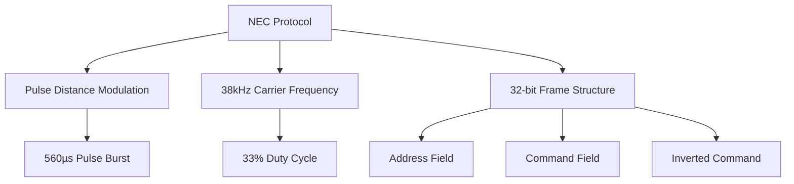
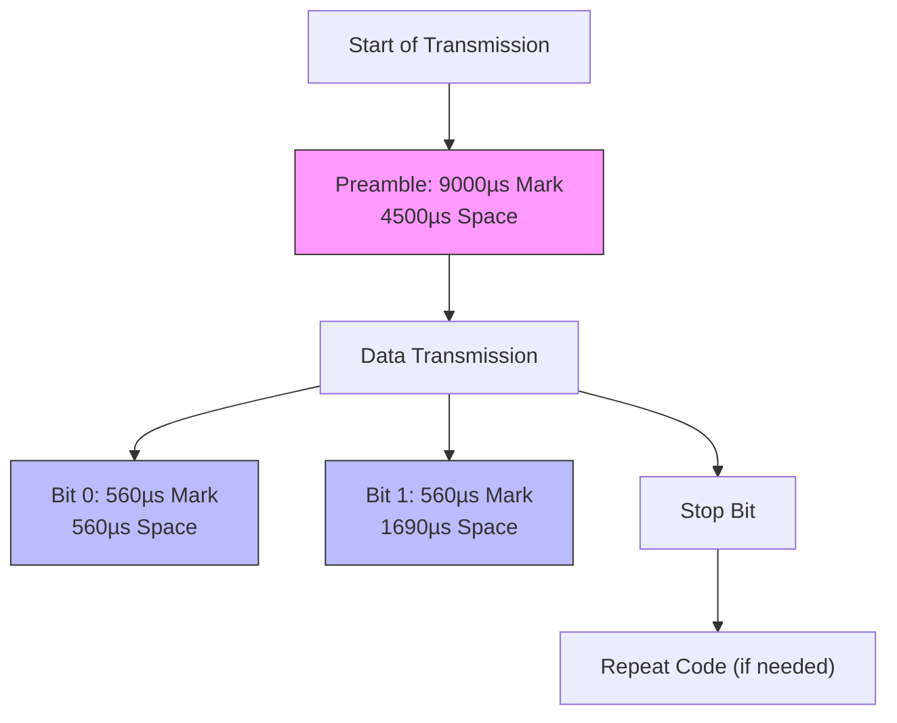
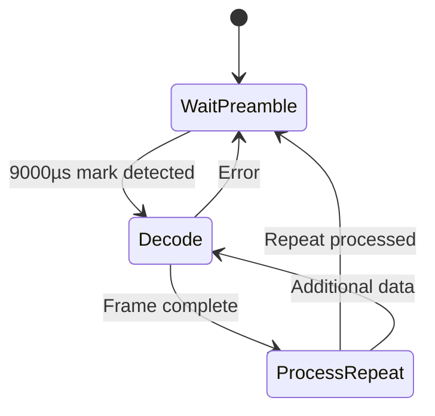
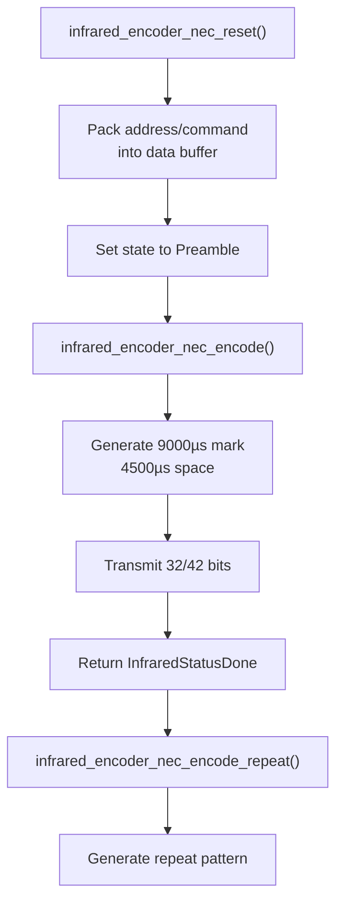
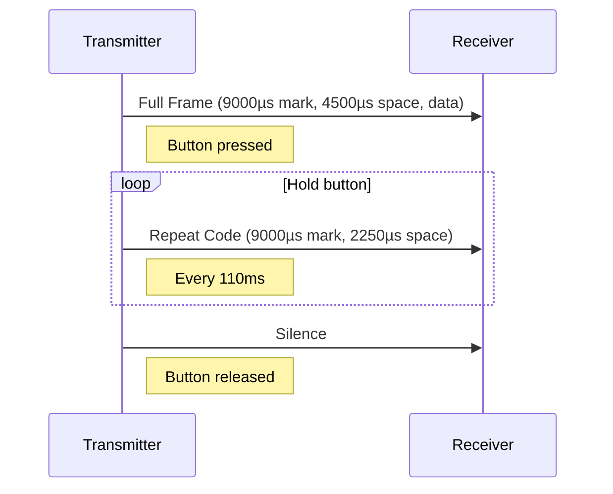
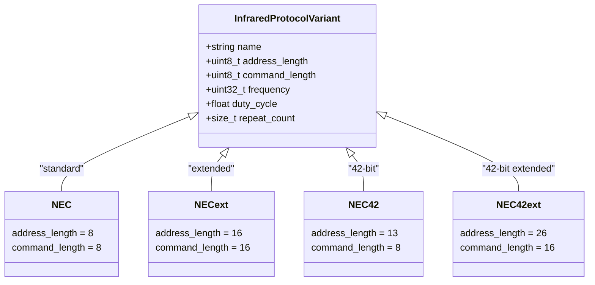
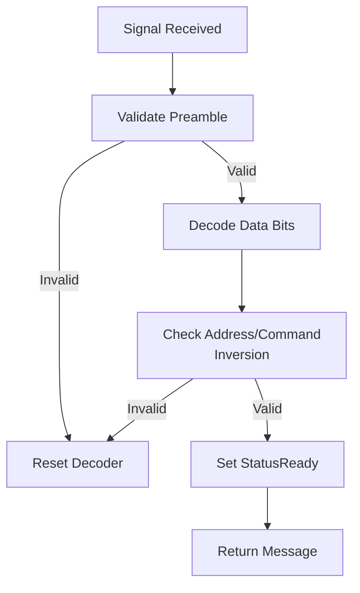

# NEC Protocol

<cite>
**Referenced Files in This Document**   
- [infrared_protocol_nec.h](file://lib/infrared/encoder_decoder/nec/infrared_protocol_nec.h)
- [infrared_protocol_nec.c](file://lib/infrared/encoder_decoder/nec/infrared_protocol_nec.c)
- [infrared_decoder_nec.c](file://lib/infrared/encoder_decoder/nec/infrared_decoder_nec.c)
- [infrared_encoder_nec.c](file://lib/infrared/encoder_decoder/nec/infrared_encoder_nec.c)
- [infrared_protocol_nec_i.h](file://lib/infrared/encoder_decoder/nec/infrared_protocol_nec_i.h)
- [infrared_common_i.h](file://lib/infrared/encoder_decoder/common/infrared_common_i.h)
- [infrared_i.h](file://lib/infrared/encoder_decoder/infrared_i.h)
- [infrared.h](file://lib/infrared/encoder_decoder/infrared.h)
</cite>

## Table of Contents
1. [Introduction](#introduction)
2. [NEC Protocol Overview](#nec-protocol-overview)
3. [Timing Specifications](#timing-specifications)
4. [Frame Structure](#frame-structure)
5. [Decoder Implementation](#decoder-implementation)
6. [Encoder Implementation](#encoder-implementation)
7. [Repeat Code Mechanism](#repeat-code-mechanism)
8. [Protocol Variants](#protocol-variants)
9. [Error Handling](#error-handling)
10. [Integration with Flipper Zero API](#integration-with-flipper-zero-api)
11. [Common Issues and Troubleshooting](#common-issues-and-troubleshooting)

## Introduction
The NEC infrared protocol is a widely used standard for remote control communication in consumer electronics. This document provides a comprehensive analysis of the NEC protocol implementation within the Flipper Zero firmware, detailing its technical specifications, code architecture, and practical applications. The implementation supports multiple NEC variants including standard NEC, NECext, NEC42, and NEC42ext protocols.

**Section sources**
- [infrared_protocol_nec.h](file://lib/infrared/encoder_decoder/nec/infrared_protocol_nec.h#L1-L30)
- [infrared.h](file://lib/infrared/encoder_decoder/infrared.h#L1-L220)

## NEC Protocol Overview
The NEC protocol uses pulse distance modulation at a 38kHz carrier frequency to transmit data between infrared devices. It employs a 32-bit frame structure for standard NEC protocol, with additional variants supporting extended address and command lengths. The protocol is characterized by its distinctive preamble, data encoding scheme, and repeat code mechanism.

The implementation in the Flipper Zero firmware follows a modular design pattern, separating the protocol specification from the encoding and decoding logic. This allows for efficient reuse of common functionality across different infrared protocols while maintaining protocol-specific customization.



**Diagram sources**
- [infrared_protocol_nec.h](file://lib/infrared/encoder_decoder/nec/infrared_protocol_nec.h#L1-L30)
- [infrared.h](file://lib/infrared/encoder_decoder/infrared.h#L1-L220)

**Section sources**
- [infrared_protocol_nec.h](file://lib/infrared/encoder_decoder/nec/infrared_protocol_nec.h#L1-L30)
- [infrared.h](file://lib/infrared/encoder_decoder/infrared.h#L1-L220)

## Timing Specifications
The NEC protocol implementation uses precise timing parameters to ensure reliable communication. All timing values are defined in microseconds (µs) and include tolerance thresholds to accommodate signal variations.

**Key Timing Parameters:**
- **Preamble Mark:** 9000µs (±200µs tolerance)
- **Preamble Space:** 4500µs (±200µs tolerance)
- **Bit 1 Mark:** 560µs (±120µs tolerance)
- **Bit 1 Space:** 1690µs (±120µs tolerance)
- **Bit 0 Mark:** 560µs (±120µs tolerance)
- **Bit 0 Space:** 560µs (±120µs tolerance)
- **Repeat Period:** 110,000µs (110ms)
- **Repeat Mark:** 9000µs
- **Repeat Space:** 2250µs

The carrier frequency is fixed at 38kHz with a 33% duty cycle, which is consistent across all NEC protocol variants. The timing tolerances (200µs for preamble, 120µs for bits) allow the decoder to handle minor timing variations due to environmental factors or hardware differences.



**Diagram sources**
- [infrared_protocol_nec_i.h](file://lib/infrared/encoder_decoder/nec/infrared_protocol_nec_i.h#L4-L19)
- [infrared.h](file://lib/infrared/encoder_decoder/infrared.h#L1-L220)

**Section sources**
- [infrared_protocol_nec_i.h](file://lib/infrared/encoder_decoder/nec/infrared_protocol_nec_i.h#L4-L19)
- [infrared.h](file://lib/infrared/encoder_decoder/infrared.h#L1-L220)

## Frame Structure
The NEC protocol uses a structured 32-bit frame for data transmission, consisting of four 8-bit fields. The frame structure includes built-in error checking through address and command inversion.

**Standard NEC Frame (32 bits):**
- **Address:** 8 bits (device identifier)
- **Address Inverse:** 8 bits (logical NOT of address)
- **Command:** 8 bits (function code)
- **Command Inverse:** 8 bits (logical NOT of command)

The frame structure provides automatic error detection: if the received address does not match the inverse of the address inverse field, or if the command does not match the inverse of the command inverse field, the decoder can detect a transmission error.

Extended variants of the protocol support different frame structures:
- **NECext:** 16-bit address, 16-bit command (32 bits total)
- **NEC42:** 13-bit address, 8-bit command with extended fields (42 bits total)
- **NEC42ext:** Extended 42-bit format with full address and command representation

```mermaid
erDiagram
NEC_FRAME {
uint8_t address
uint8_t address_inverse
uint8_t command
uint8_t command_inverse
}
NEC_FRAME ||--o{ NEC_VARIANTS : "has variants"
class NEC_VARIANTS {
NEC
NECext
NEC42
NEC42ext
}
```

**Diagram sources**
- [infrared_protocol_nec.c](file://lib/infrared/encoder_decoder/nec/infrared_protocol_nec.c#L1-L74)
- [infrared_decoder_nec.c](file://lib/infrared/encoder_decoder/nec/infrared_decoder_nec.c#L1-L98)

**Section sources**
- [infrared_protocol_nec.c](file://lib/infrared/encoder_decoder/nec/infrared_protocol_nec.c#L1-L74)
- [infrared_decoder_nec.c](file://lib/infrared/encoder_decoder/nec/infrared_decoder_nec.c#L1-L98)

## Decoder Implementation
The NEC decoder implementation follows a state machine pattern using the common infrared decoder framework. The decoder processes incoming signal levels and durations to reconstruct the transmitted message.

**Decoder State Machine:**
- **Wait Preamble:** Awaiting the initial 9000µs mark signal
- **Decode:** Processing data bits based on pulse distance
- **Process Repeat:** Handling repeat code sequences

The decoder uses the `infrared_common_decode_pdwm` function for pulse distance width modulation, which analyzes the space duration between 560µs mark pulses to determine bit values (560µs space = 0, 1690µs space = 1).

Key functions in the decoder implementation:
- `infrared_decoder_nec_alloc()`: Allocates and initializes decoder context
- `infrared_decoder_nec_decode()`: Processes incoming signal timing
- `infrared_decoder_nec_interpret()`: Validates and interprets received data
- `infrared_decoder_nec_check_ready()`: Checks if a complete message is ready

The interpretation function performs critical validation by checking that the address matches the inverse of the address inverse field and that the command matches the inverse of the command inverse field.



**Diagram sources**
- [infrared_decoder_nec.c](file://lib/infrared/encoder_decoder/nec/infrared_decoder_nec.c#L1-L98)
- [infrared_common_i.h](file://lib/infrared/encoder_decoder/common/infrared_common_i.h#L1-L89)

**Section sources**
- [infrared_decoder_nec.c](file://lib/infrared/encoder_decoder/nec/infrared_decoder_nec.c#L1-L98)
- [infrared_common_i.h](file://lib/infrared/encoder_decoder/common/infrared_common_i.h#L1-L89)

## Encoder Implementation
The NEC encoder generates the appropriate signal pattern for transmission based on the specified message. It follows a state machine approach to produce the correct timing sequence.

**Encoder State Machine:**
- **Silence:** Initial state with no output
- **Preamble:** Generates 9000µs mark and 4500µs space
- **Encode:** Transmits data bits using pulse distance modulation
- **Encode Repeat:** Generates repeat codes when needed

The encoder implementation handles all NEC variants by packing the address and command data into the appropriate format:
- For standard NEC: Combines address with its inverse and command with its inverse
- For NECext: Uses full 16-bit address and command without inversion
- For NEC42 and NEC42ext: Handles the extended 42-bit format with proper bit positioning

Key functions in the encoder implementation:
- `infrared_encoder_nec_alloc()`: Creates encoder instance
- `infrared_encoder_nec_reset()`: Configures encoder with message data
- `infrared_encoder_nec_encode()`: Generates next timing value
- `infrared_encoder_nec_encode_repeat()`: Handles repeat code generation



**Diagram sources**
- [infrared_encoder_nec.c](file://lib/infrared/encoder_decoder/nec/infrared_encoder_nec.c#L1-L91)
- [infrared_protocol_nec.c](file://lib/infrared/encoder_decoder/nec/infrared_protocol_nec.c#L1-L74)

**Section sources**
- [infrared_encoder_nec.c](file://lib/infrared/encoder_decoder/nec/infrared_encoder_nec.c#L1-L91)
- [infrared_protocol_nec.c](file://lib/infrared/encoder_decoder/nec/infrared_protocol_nec.c#L1-L74)

## Repeat Code Mechanism
The NEC protocol includes a repeat code mechanism to handle continuous button presses. When a button is held down, the transmitter sends a repeat code instead of retransmitting the full frame.

**Repeat Code Structure:**
- **Pause:** 4ms to 150ms (gap from previous transmission)
- **Mark:** 9000µs pulse burst
- **Space:** 2250µs
- **Mark:** 560µs (first bit of next frame)

The repeat code is detected by the decoder through the `infrared_decoder_nec_decode_repeat()` function, which checks for the specific timing pattern. When a valid repeat code is detected, the decoder sets the message's repeat flag to true, indicating that this is a repeated command rather than a new one.

The repeat period is set to 110ms, which prevents excessive transmission while ensuring responsive control. The implementation includes minimum and maximum pause times (4ms and 150ms) to distinguish between intentional repeats and signal noise.



**Diagram sources**
- [infrared_protocol_nec_i.h](file://lib/infrared/encoder_decoder/nec/infrared_protocol_nec_i.h#L13-L17)
- [infrared_decoder_nec.c](file://lib/infrared/encoder_decoder/nec/infrared_decoder_nec.c#L50-L75)

**Section sources**
- [infrared_protocol_nec_i.h](file://lib/infrared/encoder_decoder/nec/infrared_protocol_nec_i.h#L13-L17)
- [infrared_decoder_nec.c](file://lib/infrared/encoder_decoder/nec/infrared_decoder_nec.c#L50-L75)

## Protocol Variants
The NEC protocol implementation supports four variants to accommodate different device requirements:

**Variant Characteristics:**
- **NEC:** Standard 8-bit address, 8-bit command with inversion
- **NECext:** Extended 16-bit address, 16-bit command (no inversion)
- **NEC42:** 13-bit address, 8-bit command with 42-bit frame
- **NEC42ext:** Extended 42-bit format with full address/command

Each variant is defined by its `InfraredProtocolVariant` structure, which specifies:
- Address length in bits
- Command length in bits
- Protocol name
- Frequency (38kHz for all variants)
- Duty cycle (33% for all variants)
- Minimum repeat count

The `infrared_protocol_nec_get_variant()` function returns the appropriate variant structure based on the protocol enum, enabling the encoder and decoder to handle each variant correctly.



**Diagram sources**
- [infrared_protocol_nec.c](file://lib/infrared/encoder_decoder/nec/infrared_protocol_nec.c#L15-L74)
- [infrared_i.h](file://lib/infrared/encoder_decoder/infrared_i.h#L1-L48)

**Section sources**
- [infrared_protocol_nec.c](file://lib/infrared/encoder_decoder/nec/infrared_protocol_nec.c#L15-L74)
- [infrared_i.h](file://lib/infrared/encoder_decoder/infrared_i.h#L1-L48)

## Error Handling
The NEC protocol implementation includes comprehensive error handling to ensure reliable operation in various conditions.

**Decoder Error Conditions:**
- Invalid preamble timing
- Incorrect bit timing outside tolerance
- Address/command validation failure
- Frame length mismatch

When an error is detected, the decoder resets its state and begins listening for a new preamble. The `MATCH_TIMING` macro is used to compare received timings against expected values with specified tolerances, preventing false errors due to minor timing variations.

The implementation uses assertions (`furi_assert`) to validate function parameters and internal state, ensuring that the decoder and encoder are used correctly. Critical errors that indicate programming mistakes trigger `furi_crash()` to prevent undefined behavior.

**Error Status Codes:**
- `InfraredStatusError`: General error condition
- `InfraredStatusOk`: Operation successful, continue
- `InfraredStatusDone`: Operation complete
- `InfraredStatusReady`: Message ready for processing



**Diagram sources**
- [infrared_decoder_nec.c](file://lib/infrared/encoder_decoder/nec/infrared_decoder_nec.c#L20-L50)
- [infrared_common_i.h](file://lib/infrared/encoder_decoder/common/infrared_common_i.h#L1-L89)

**Section sources**
- [infrared_decoder_nec.c](file://lib/infrared/encoder_decoder/nec/infrared_decoder_nec.c#L20-L50)
- [infrared_common_i.h](file://lib/infrared/encoder_decoder/common/infrared_common_i.h#L1-L89)

## Integration with Flipper Zero API
The NEC protocol implementation integrates with the Flipper Zero's infrared API through standardized interfaces that allow applications to encode and decode NEC signals.

**API Usage Pattern:**
1. Allocate decoder/encoder with `infrared_alloc_decoder()` or `infrared_alloc_encoder()`
2. Process signals with `infrared_decode()` or configure messages with `infrared_reset_encoder()`
3. Generate/transmit signals with `infrared_encode()`
4. Free resources with `infrared_free_decoder()` or `infrared_free_encoder()`

Example of creating a custom NEC command:
```c
InfraredEncoderHandler* encoder = infrared_alloc_encoder();
InfraredMessage message = {
    .protocol = InfraredProtocolNEC,
    .address = 0x01,
    .command = 0x45,
    .repeat = false
};
infrared_reset_encoder(encoder, &message);
// Call infrared_encode() repeatedly to get timing values
infrared_free_encoder(encoder);
```

The API abstracts the underlying protocol details, allowing applications to work with infrared signals without needing to understand the low-level timing and encoding specifics.

**Section sources**
- [infrared.h](file://lib/infrared/encoder_decoder/infrared.h#L1-L220)
- [infrared_encoder_nec.c](file://lib/infrared/encoder_decoder/nec/infrared_encoder_nec.c#L1-L91)

## Common Issues and Troubleshooting
Several factors can affect NEC protocol transmission and reception reliability:

**Signal Interference:**
- Ambient light sources (especially fluorescent and LED lights)
- Other infrared devices operating nearby
- Physical obstructions between transmitter and receiver

**Battery Level Impact:**
- Low battery reduces transmission power and range
- Voltage fluctuations can affect timing accuracy
- Weak signals may not be detected by the receiver

**Troubleshooting Tips:**
- Ensure clear line of sight between devices
- Replace batteries in remote controls when range decreases
- Avoid pointing infrared devices toward bright light sources
- Verify timing tolerances are sufficient for your hardware
- Check for electromagnetic interference from other electronics

The implementation's timing tolerances (200µs for preamble, 120µs for bits) help mitigate minor timing variations, but extreme environmental conditions may require adjustment of these values.

**Section sources**
- [infrared_protocol_nec_i.h](file://lib/infrared/encoder_decoder/nec/infrared_protocol_nec_i.h#L18-L19)
- [infrared.h](file://lib/infrared/encoder_decoder/infrared.h#L1-L220)