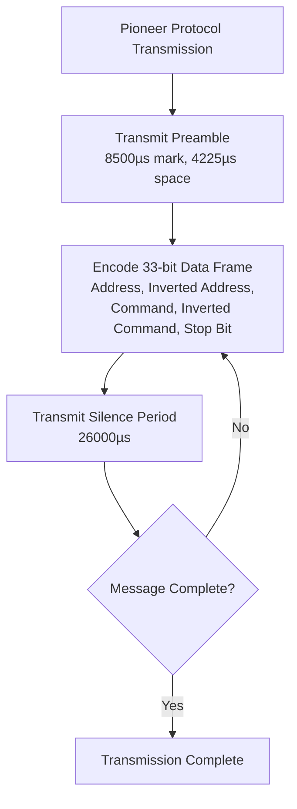
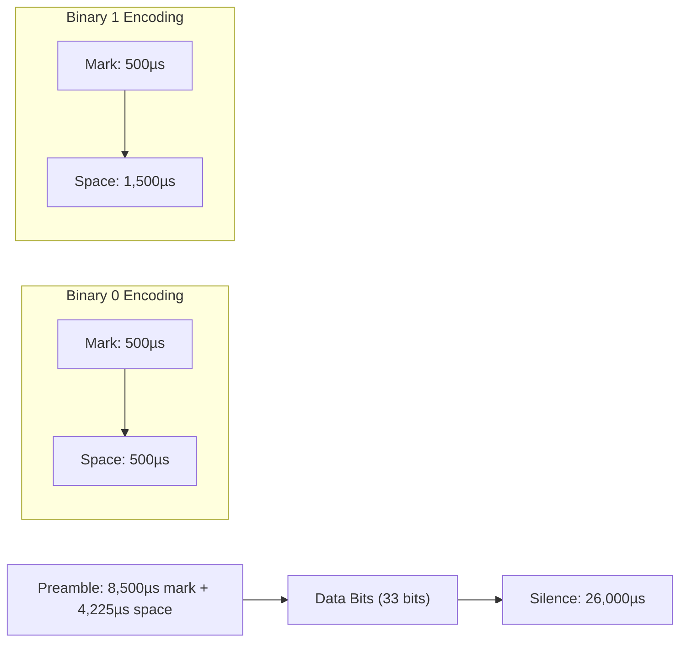
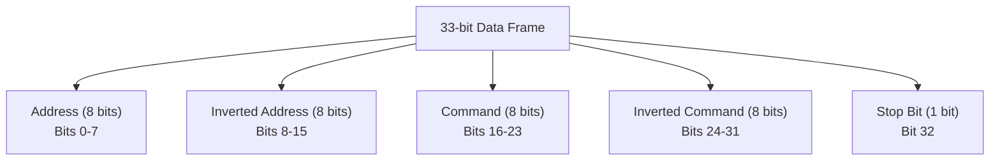
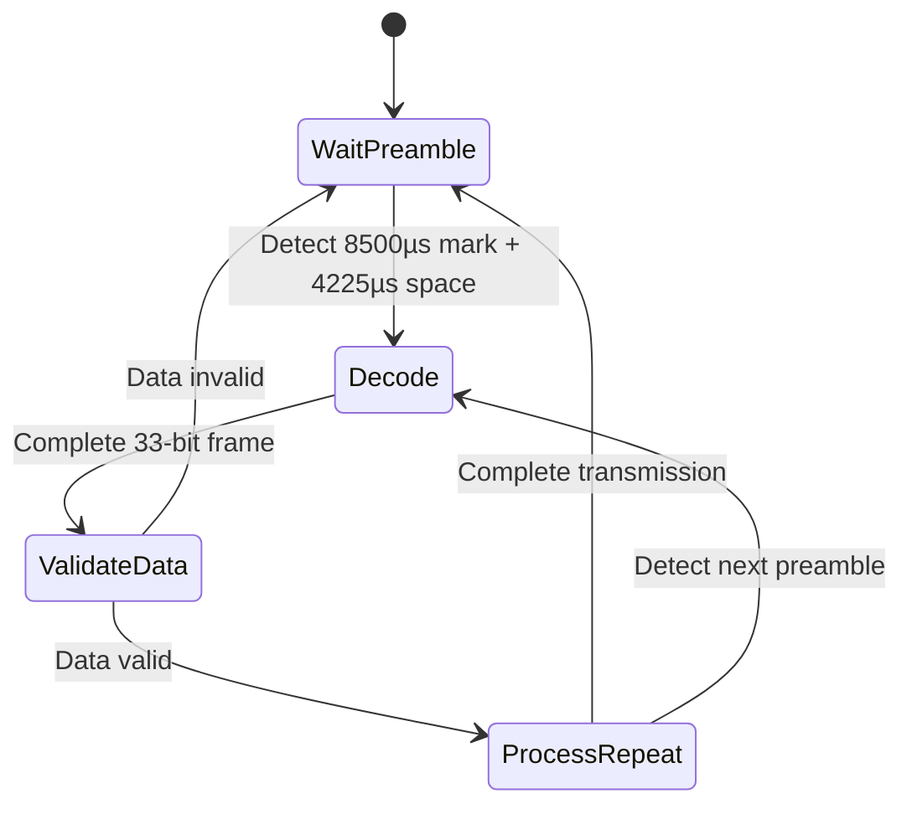
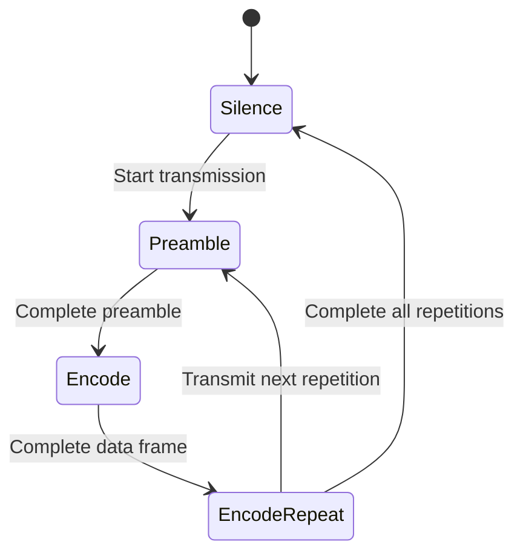
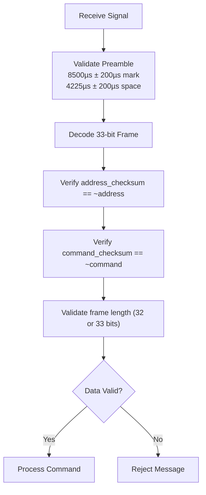
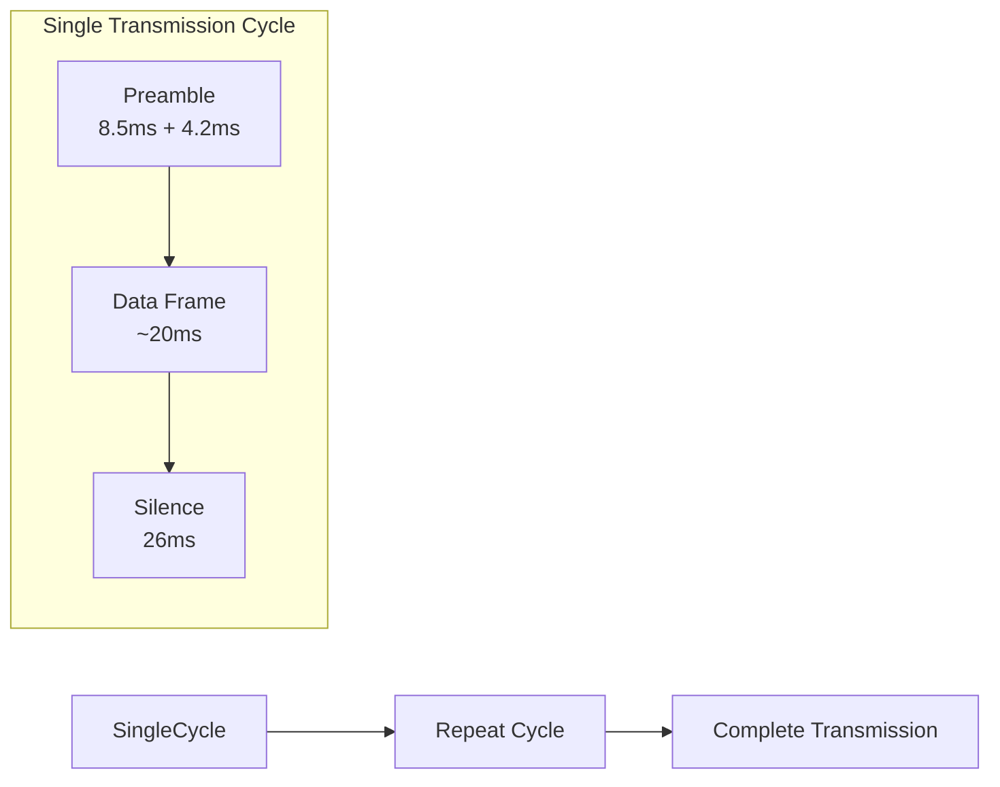
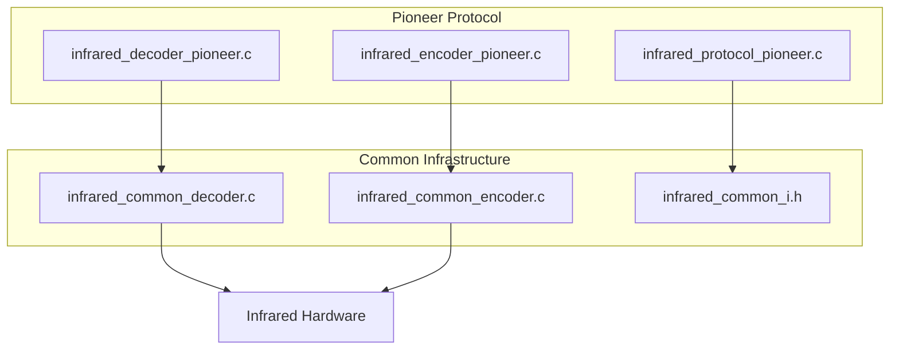

# Pioneer Protocol

<cite>
**Referenced Files in This Document**   
- [infrared_protocol_pioneer.h](file://lib/infrared/encoder_decoder/pioneer/infrared_protocol_pioneer.h)
- [infrared_protocol_pioneer.c](file://lib/infrared/encoder_decoder/pioneer/infrared_protocol_pioneer.c)
- [infrared_decoder_pioneer.c](file://lib/infrared/encoder_decoder/pioneer/infrared_decoder_pioneer.c)
- [infrared_encoder_pioneer.c](file://lib/infrared/encoder_decoder/pioneer/infrared_encoder_pioneer.c)
- [infrared_protocol_pioneer_i.h](file://lib/infrared/encoder_decoder/pioneer/infrared_protocol_pioneer_i.h)
- [infrared_common_i.h](file://lib/infrared/encoder_decoder/common/infrared_common_i.h)
</cite>

## Table of Contents
1. [Introduction](#introduction)
2. [Protocol Overview](#protocol-overview)
3. [Timing Specifications](#timing-specifications)
4. [Frame Structure](#frame-structure)
5. [Decoder Implementation](#decoder-implementation)
6. [Encoder Implementation](#encoder-implementation)
7. [Error Detection and Reliability](#error-detection-and-reliability)
8. [Signal Transmission Characteristics](#signal-transmission-characteristics)
9. [Implementation Architecture](#implementation-architecture)
10. [Performance Considerations](#performance-considerations)

## Introduction
The Pioneer infrared protocol is a pulse distance modulation scheme used for remote control communication with audio equipment. This document provides a comprehensive analysis of the Pioneer protocol implementation in the Flipper Zero firmware, detailing its technical specifications, encoding/decoding mechanisms, and reliability features. The implementation follows a modular architecture that shares common components with other infrared protocols while maintaining protocol-specific characteristics.

**Section sources**
- [infrared_protocol_pioneer.h](file://lib/infrared/encoder_decoder/pioneer/infrared_protocol_pioneer.h#L1-L36)

## Protocol Overview
The Pioneer SR protocol is a pulse distance modulation scheme designed for reliable infrared communication with audio equipment. It operates at a carrier frequency of 40kHz with a 33% duty cycle, using a specific timing structure to encode data. The protocol employs a preamble followed by data bits and includes mechanisms for error detection and message repetition to ensure reliable transmission.

The protocol implementation in the Flipper Zero firmware follows a consistent architectural pattern with other infrared protocols, utilizing shared common functions for encoding and decoding while maintaining protocol-specific timing parameters and data structures. This modular approach allows for efficient code reuse and consistent behavior across different infrared protocols.

**Diagram sources**
- [infrared_protocol_pioneer.h](file://lib/infrared/encoder_decoder/pioneer/infrared_protocol_pioneer.h#L5-L25)
- [infrared_protocol_pioneer_i.h](file://lib/infrared/encoder_decoder/pioneer/infrared_protocol_pioneer_i.h#L5-L15)

## Timing Specifications
The Pioneer protocol uses precise timing parameters to encode binary data through pulse distance modulation. These timing values are defined as constants in the implementation and are critical to the protocol's operation.

**Pioneer Protocol Timing Parameters**
- **Carrier Frequency**: 40,000 Hz (40kHz)
- **Duty Cycle**: 33%
- **Preamble Mark**: 8,500 µs
- **Preamble Space**: 4,225 µs
- **Bit 1 Mark**: 500 µs
- **Bit 1 Space**: 1,500 µs
- **Bit 0 Mark**: 500 µs
- **Bit 0 Space**: 500 µs
- **Silence Period**: 26,000 µs
- **Preamble Tolerance**: ±200 µs
- **Bit Tolerance**: ±120 µs

The protocol uses pulse distance modulation where the mark (pulse) duration is constant at 500µs for both binary 0 and 1, while the space (gap) duration varies to represent different bit values. A space of 500µs represents binary 0, while a space of 1,500µs represents binary 1.

**Diagram sources**
- [infrared_protocol_pioneer_i.h](file://lib/infrared/encoder_decoder/pioneer/infrared_protocol_pioneer_i.h#L7-L16)

## Frame Structure
The Pioneer protocol transmits data in a 33-bit frame structure that includes address, command, and error detection information. The frame is structured as follows:

**Pioneer Protocol Frame Structure**
- **Address**: 8 bits
- **Inverted Address**: 8 bits (bitwise complement of address)
- **Command**: 8 bits
- **Inverted Command**: 8 bits (bitwise complement of command)
- **Stop Bit**: 1 bit

The data is organized in memory with the address in the least significant byte, followed by the inverted address, command, inverted command, and stop bit. This structure provides built-in error detection through the use of inverted values, allowing the receiver to verify data integrity by checking that each value matches its complement.

The protocol specification defines two possible data lengths: 33 bits (including the stop bit) and 32 bits (excluding the stop bit). This flexibility accommodates variations in implementations while maintaining compatibility.

**Section sources**
- [infrared_protocol_pioneer.h](file://lib/infrared/encoder_decoder/pioneer/infrared_protocol_pioneer.h#L20-L25)

## Decoder Implementation
The Pioneer protocol decoder is implemented as a state machine that processes incoming infrared signals and extracts the encoded data. The implementation leverages the common infrared decoding infrastructure while providing protocol-specific interpretation logic.

The decoder state machine follows these states:
1. **Wait Preamble**: Detect the initial 8,500µs mark followed by 4,225µs space
2. **Decode**: Process the 33-bit data frame using pulse distance modulation
3. **Process Repeat**: Handle message repetition and silence periods

The core decoding function `infrared_decoder_pioneer_decode` delegates to the common decoding infrastructure, which handles the pulse distance modulation decoding. The protocol-specific interpretation is performed by the `infrared_decoder_pioneer_interpret` function, which validates the data integrity by checking the inverted address and command values.

**Section sources**
- [infrared_decoder_pioneer.c](file://lib/infrared/encoder_decoder/pioneer/infrared_decoder_pioneer.c#L1-L57)
- [infrared_protocol_pioneer.c](file://lib/infrared/encoder_decoder/pioneer/infrared_protocol_pioneer.c#L1-L40)

## Encoder Implementation
The Pioneer protocol encoder generates the infrared signal according to the protocol specifications. The implementation follows a modular design that uses the common infrared encoding infrastructure while providing protocol-specific initialization and repetition handling.

The encoder state machine includes the following states:
1. **Silence**: Initial state with no signal output
2. **Preamble**: Transmit the 8,500µs mark and 4,225µs space
3. **Encode**: Transmit the 33-bit data frame using pulse distance modulation
4. **Encode Repeat**: Handle message repetition with silence periods

The encoder initialization function `infrared_encoder_pioneer_reset` prepares the data buffer by storing the address, inverted address, command, and inverted command values. The encoding process uses the common pulse distance modulation encoding function, with the protocol-specific timing parameters defined in the protocol specification.

**Section sources**
- [infrared_encoder_pioneer.c](file://lib/infrared/encoder_decoder/pioneer/infrared_encoder_pioneer.c#L1-L61)
- [infrared_protocol_pioneer.c](file://lib/infrared/encoder_decoder/pioneer/infrared_protocol_pioneer.c#L1-L40)

## Error Detection and Reliability
The Pioneer protocol incorporates multiple mechanisms for error detection and transmission reliability. These features ensure robust communication between remote controls and audio equipment.

### Error Detection
The protocol uses complementary bit patterns for error detection:
- The 8-bit address is followed by its bitwise complement (inverted address)
- The 8-bit command is followed by its bitwise complement (inverted command)

During decoding, the receiver verifies that:
- `address_checksum == ~address`
- `command_checksum == ~command`

If either check fails, the message is rejected as corrupted. This simple yet effective mechanism detects single-bit errors and many multi-bit error patterns.

### Transmission Reliability
The protocol enhances reliability through:
- **Quadruple Transmission**: Each message is transmitted multiple times (minimum of 2 times as defined by `INFRARED_PIONEER_REPEAT_COUNT_MIN`)
- **Silence Periods**: 26,000µs silence periods between repetitions allow the receiver to synchronize and process each transmission
- **Tolerance Parameters**: Timing tolerances (±200µs for preamble, ±120µs for bits) accommodate minor timing variations

The implementation ensures reliability by validating the frame length (33 or 32 bits) before processing the data, preventing malformed packets from being accepted.

**Section sources**
- [infrared_decoder_pioneer.c](file://lib/infrared/encoder_decoder/pioneer/infrared_decoder_pioneer.c#L10-L40)
- [infrared_protocol_pioneer_i.h](file://lib/infrared/encoder_decoder/pioneer/infrared_protocol_pioneer_i.h#L13-L14)

## Signal Transmission Characteristics
The Pioneer protocol's signal transmission characteristics are optimized for reliable infrared communication in typical home audio environments. The design balances power consumption, range, and interference resistance.

### Carrier Signal
- **Frequency**: 40kHz (not 38kHz as commonly mistaken)
- **Duty Cycle**: 33% (1/3 on, 2/3 off)
- **Modulation**: Pulse distance modulation (PDM)

The 40kHz carrier frequency is chosen to avoid interference from ambient light sources and other electronic devices. The 33% duty cycle optimizes power consumption while maintaining sufficient signal strength.

### Transmission Pattern
Each complete transmission consists of:
1. Preamble (8,500µs mark + 4,225µs space)
2. 33-bit data frame (encoded with PDM)
3. Silence period (26,000µs)
4. Repeat steps 1-3 for additional transmissions

The minimum repetition count is 2, ensuring that even if one transmission is corrupted by interference, a clean copy is likely to be received.

### Power Consumption
Due to the repeated transmission pattern, the Pioneer protocol has higher power consumption compared to single-transmission protocols. The total transmission time for a minimum message is approximately:
- Preamble: 12,725µs
- Data: ~20,000µs (estimated)
- Silence: 26,000µs
- Total per repetition: ~58,725µs
- Total for 2 repetitions: ~117,450µs

This extended transmission time increases battery drain on remote controls but significantly improves reliability.

**Section sources**
- [infrared_protocol_pioneer_i.h](file://lib/infrared/encoder_decoder/pioneer/infrared_protocol_pioneer_i.h#L5-L17)
- [infrared_protocol_pioneer.c](file://lib/infrared/encoder_decoder/pioneer/infrared_protocol_pioneer.c#L1-L40)

## Implementation Architecture
The Pioneer protocol implementation follows a modular architecture that integrates with the Flipper Zero's infrared subsystem. The design promotes code reuse and maintainability through a layered approach.

### Component Structure
The implementation consists of five key files:
1. **infrared_protocol_pioneer.h**: Public interface and documentation
2. **infrared_protocol_pioneer.c**: Protocol specification and variant definition
3. **infrared_decoder_pioneer.c**: Protocol-specific decoding logic
4. **infrared_encoder_pioneer.c**: Protocol-specific encoding logic
5. **infrared_protocol_pioneer_i.h**: Internal constants and function declarations

### Integration with Common Infrastructure
The Pioneer implementation leverages the common infrared encoding and decoding infrastructure:
- **infrared_common_decode_pdwm**: Pulse distance modulation decoding
- **infrared_common_encode_pdwm**: Pulse distance modulation encoding
- **InfraredCommonDecoder/Encoder**: Base data structures
- **infrared_common_decoder/encoder_alloc**: Memory management

This shared infrastructure handles the low-level timing and state management, allowing protocol-specific implementations to focus on data interpretation and validation.

**Diagram sources**
- [infrared_protocol_pioneer.h](file://lib/infrared/encoder_decoder/pioneer/infrared_protocol_pioneer.h#L1-L36)
- [infrared_protocol_pioneer.c](file://lib/infrared/encoder_decoder/pioneer/infrared_protocol_pioneer.c#L1-L40)
- [infrared_common_i.h](file://lib/infrared/encoder_decoder/common/infrared_common_i.h#L1-L88)

## Performance Considerations
The Pioneer protocol implementation balances reliability, power consumption, and processing efficiency. Several factors influence its performance characteristics:

### Processing Efficiency
The use of common encoding/decoding functions reduces code size and improves cache efficiency. The state machine design minimizes memory usage with compact data structures:
- **Decoder**: Uses `InfraredCommonDecoder` structure with variable-length data array
- **Encoder**: Uses `InfraredCommonEncoder` structure with variable-length data array

### Memory Usage
The implementation efficiently manages memory through:
- **Dynamic allocation**: Encoders and decoders are allocated only when needed
- **Shared infrastructure**: Common functions reduce code duplication
- **Compact data representation**: 33-bit frames stored in 5 bytes with padding

### Signal Reliability vs. Power Consumption
The protocol prioritizes reliability over power efficiency:
- **Advantages**: High resistance to interference, reliable operation in noisy environments
- **Disadvantages**: Higher power consumption due to repeated transmissions

For battery-powered devices, this trade-off is generally acceptable as the total transmission time is still relatively short (under 120ms for minimum repetitions).

### Optimization Opportunities
Potential optimizations include:
- **Adaptive repetition**: Reduce repetitions when signal quality is good
- **Carrier duty cycle adjustment**: Optimize for specific hardware characteristics
- **Timing tolerance calibration**: Adjust tolerances based on environmental conditions

These optimizations could improve power efficiency while maintaining acceptable reliability levels.

**Section sources**
- [infrared_protocol_pioneer_i.h](file://lib/infrared/encoder_decoder/pioneer/infrared_protocol_pioneer_i.h#L5-L25)
- [infrared_common_i.h](file://lib/infrared/encoder_decoder/common/infrared_common_i.h#L1-L88)
- [infrared_decoder_pioneer.c](file://lib/infrared/encoder_decoder/pioneer/infrared_decoder_pioneer.c#L1-L57)