# RC5 Protocol

<cite>
**Referenced Files in This Document**   
- [infrared_protocol_rc5.h](file://lib/infrared/encoder_decoder/rc5/infrared_protocol_rc5.h)
- [infrared_protocol_rc5.c](file://lib/infrared/encoder_decoder/rc5/infrared_protocol_rc5.c)
- [infrared_protocol_rc5_i.h](file://lib/infrared/encoder_decoder/rc5/infrared_protocol_rc5_i.h)
- [infrared_decoder_rc5.c](file://lib/infrared/encoder_decoder/rc5/infrared_decoder_rc5.c)
- [infrared_encoder_rc5.c](file://lib/infrared/encoder_decoder/rc5/infrared_encoder_rc5.c)
- [infrared_common_i.h](file://lib/infrared/encoder_decoder/common/infrared_common_i.h)
- [infrared_common_decoder.c](file://lib/infrared/encoder_decoder/common/infrared_common_decoder.c)
- [infrared_common_encoder.c](file://lib/infrared/encoder_decoder/common/infrared_common_encoder.c)
</cite>

## Table of Contents
1. [Introduction](#introduction)
2. [Protocol Overview](#protocol-overview)
3. [Frame Structure](#frame-structure)
4. [Timing Specifications](#timing-specifications)
5. [Manchester Modulation](#manchester-modulation)
6. [Toggle Bit Mechanism](#toggle-bit-mechanism)
7. [Addressing Scheme](#addressing-scheme)
8. [Decoder Implementation](#decoder-implementation)
9. [Encoder Implementation](#encoder-implementation)
10. [RC5 vs RC5X Variants](#rc5-vs-rc5x-variants)
11. [Code Architecture](#code-architecture)
12. [Implementation Challenges](#implementation-challenges)

## Introduction
The RC5 protocol is a widely used infrared remote control communication standard developed by Philips. This document provides a comprehensive technical analysis of the RC5 protocol implementation in the Flipper Zero firmware, covering its physical layer characteristics, data encoding scheme, frame structure, and software implementation details. The analysis is based on the actual source code from the repository, providing accurate and detailed information about how the protocol is implemented for both transmission and reception of infrared signals.

**Section sources**
- [infrared_protocol_rc5.h](file://lib/infrared/encoder_decoder/rc5/infrared_protocol_rc5.h#L1-L38)
- [infrared_protocol_rc5.c](file://lib/infrared/encoder_decoder/rc5/infrared_protocol_rc5.c#L1-L50)

## Protocol Overview
The RC5 protocol is a bi-phase (Manchester) encoded infrared communication protocol operating at a 36kHz carrier frequency. It uses a 14-bit frame structure consisting of two start bits, one toggle bit, a 5-bit address field, and a 6-bit command field. The protocol is designed for reliable bidirectional communication between remote controls and consumer electronics devices.

The RC5 protocol implementation in the Flipper Zero firmware supports both the standard RC5 protocol and the extended RC5X variant, which provides additional command space. The implementation is modular, with separate components for encoding and decoding, built on a common infrared framework that handles the low-level signal processing.

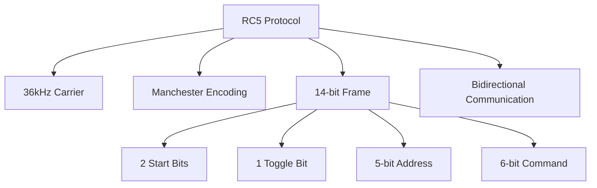

**Diagram sources**
- [infrared_protocol_rc5.h](file://lib/infrared/encoder_decoder/rc5/infrared_protocol_rc5.h#L1-L38)
- [infrared_protocol_rc5.c](file://lib/infrared/encoder_decoder/rc5/infrared_protocol_rc5.c#L1-L50)

**Section sources**
- [infrared_protocol_rc5.h](file://lib/infrared/encoder_decoder/rc5/infrared_protocol_rc5.h#L1-L38)
- [infrared_protocol_rc5.c](file://lib/infrared/encoder_decoder/rc5/infrared_protocol_rc5.c#L1-L50)

## Frame Structure
The RC5 protocol uses a 14-bit frame structure that contains several key fields:

- **Start bits (2 bits)**: Always set to 1, used for synchronization
- **Toggle bit (1 bit)**: Toggles state with each button press
- **Address field (5 bits)**: Identifies the target device
- **Command field (6 bits)**: Specifies the command to execute

The frame structure is defined in the code with the following parameters:

```c
.databit_len[0] = 1 + 1 + 1 + 5 + 6, // start_bit + start_bit/command_bit + toggle_bit + 5 address + 6 command
```

This structure allows for 32 unique addresses (2^5) and 64 unique commands (2^6) in the standard RC5 protocol. The RC5X variant extends the command field to 7 bits, providing 128 possible commands.

The start bits serve as a synchronization mechanism, ensuring that the receiver can properly align with the incoming data stream. The first start bit is always 1, while the second start bit distinguishes between RC5 and RC5X protocols.

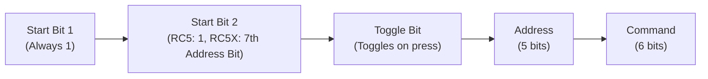

**Diagram sources**
- [infrared_protocol_rc5.c](file://lib/infrared/encoder_decoder/rc5/infrared_protocol_rc5.c#L1-L50)
- [infrared_protocol_rc5.h](file://lib/infrared/encoder_decoder/rc5/infrared_protocol_rc5.h#L1-L38)

**Section sources**
- [infrared_protocol_rc5.c](file://lib/infrared/encoder_decoder/rc5/infrared_protocol_rc5.c#L1-L50)
- [infrared_protocol_rc5.h](file://lib/infrared/encoder_decoder/rc5/infrared_protocol_rc5.h#L1-L38)

## Timing Specifications
The RC5 protocol uses precise timing specifications to ensure reliable communication. The fundamental timing unit is the half-bit period, which is 888µs, resulting in a full bit period of 1776µs.

Key timing parameters defined in the implementation:

- **Bit period**: 888µs (half-bit time)
- **Tolerance**: ±120µs
- **Silence time**: 27,000µs (10 times the nominal silence time)
- **Minimum split time**: 2700µs

These values are defined in the header file as:

```c
#define INFRARED_RC5_BIT                888 // half of time-quant for 1 bit
#define INFRARED_RC5_BIT_TOLERANCE      120 // us
#define INFRARED_RC5_SILENCE            (2700 * 10)
#define INFRARED_RC5_MIN_SPLIT_TIME     2700
```

The timing tolerance of ±120µs allows for some variation in transmission and reception while maintaining reliable decoding. The silence time defines the minimum gap between transmissions, while the minimum split time helps distinguish between separate transmissions.

The carrier frequency is set to 36kHz with a duty cycle of 33%:

```c
#define INFRARED_RC5_CARRIER_FREQUENCY 36000
#define INFRARED_RC5_DUTY_CYCLE        0.33
```

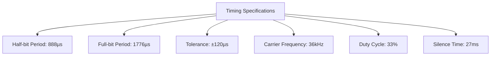

**Diagram sources**
- [infrared_protocol_rc5_i.h](file://lib/infrared/encoder_decoder/rc5/infrared_protocol_rc5_i.h#L1-L20)
- [infrared_protocol_rc5.c](file://lib/infrared/encoder_decoder/rc5/infrared_protocol_rc5.c#L1-L50)

**Section sources**
- [infrared_protocol_rc5_i.h](file://lib/infrared/encoder_decoder/rc5/infrared_protocol_rc5_i.h#L1-L20)
- [infrared_protocol_rc5.c](file://lib/infrared/encoder_decoder/rc5/infrared_protocol_rc5.c#L1-L50)

## Manchester Modulation
The RC5 protocol uses Manchester (bi-phase) modulation for data encoding. In this scheme, each bit period is divided into two halves, with a transition in the middle. The direction of the transition determines the bit value:

- **Binary 1**: Transition from low to high (space to mark)
- **Binary 0**: Transition from high to low (mark to space)

The implementation handles Manchester encoding with the following characteristics:

- The encoding starts from a space timing
- Each bit is represented by a transition in the middle of the bit period
- The transition direction encodes the data

The code uses a common Manchester encoding function:

```c
.decode = infrared_common_decode_manchester,
.encode = infrared_common_encode_manchester,
```

For decoding, the implementation detects transitions and interprets them according to the Manchester scheme. The decoder tracks whether a level switch is expected in the middle of the time quantum, which helps distinguish between valid transitions and noise.

The Manchester encoding ensures that there is always a transition in the middle of each bit period, which provides self-clocking and makes the signal less susceptible to errors caused by DC bias or signal drift.

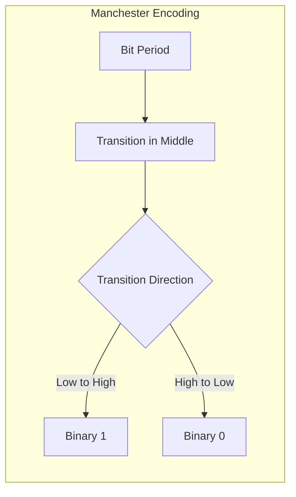

**Diagram sources**
- [infrared_protocol_rc5.h](file://lib/infrared/encoder_decoder/rc5/infrared_protocol_rc5.h#L1-L38)
- [infrared_common_decoder.c](file://lib/infrared/encoder_decoder/common/infrared_common_decoder.c#L1-L317)

**Section sources**
- [infrared_protocol_rc5.h](file://lib/infrared/encoder_decoder/rc5/infrared_protocol_rc5.h#L1-L38)
- [infrared_common_decoder.c](file://lib/infrared/encoder_decoder/common/infrared_common_decoder.c#L1-L317)

## Toggle Bit Mechanism
The toggle bit is a key feature of the RC5 protocol that enables reliable button press detection. The toggle bit changes its state (0 to 1 or 1 to 0) with each button press, allowing the receiver to distinguish between a new button press and a repeated transmission of the same command.

In the implementation, the toggle bit is handled as follows:

```c
bool toggle = !!(*data & 0x04);
```

The toggle bit mechanism works by:

1. Storing the previous toggle state in the decoder context
2. Comparing the current toggle bit with the stored state
3. Setting the repeat flag if the toggle bit hasn't changed
4. Updating the stored state with the current toggle bit

The decoder implementation includes logic to detect repeat transmissions:

```c
message->repeat = (toggle == *prev_toggle);
*prev_toggle = toggle;
```

This mechanism is crucial for proper user interface behavior, as it allows devices to differentiate between a user holding down a button (which generates repeated transmissions with the same toggle bit) and pressing the button multiple times (which generates transmissions with alternating toggle bits).

The toggle bit is particularly important for functions like volume control, where holding down the button should produce continuous adjustment, while tapping the button should produce single-step changes.

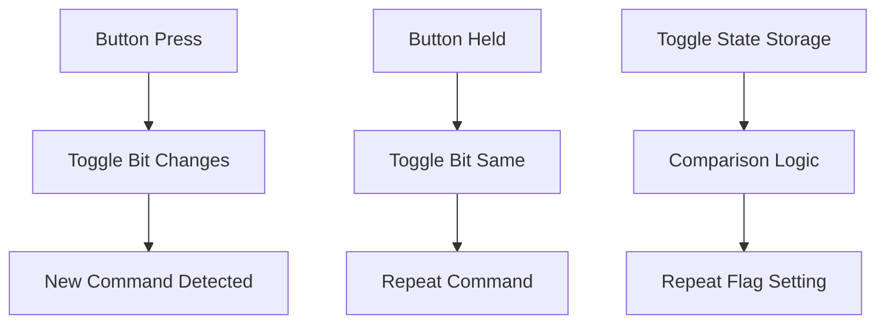

**Diagram sources**
- [infrared_decoder_rc5.c](file://lib/infrared/encoder_decoder/rc5/infrared_decoder_rc5.c#L1-L80)
- [infrared_encoder_rc5.c](file://lib/infrared/encoder_decoder/rc5/infrared_encoder_rc5.c#L1-L54)

**Section sources**
- [infrared_decoder_rc5.c](file://lib/infrared/encoder_decoder/rc5/infrared_decoder_rc5.c#L1-L80)
- [infrared_encoder_rc5.c](file://lib/infrared/encoder_decoder/rc5/infrared_encoder_rc5.c#L1-L54)

## Addressing Scheme
The RC5 protocol uses a 5-bit address field, allowing for 32 unique device addresses (2^5 = 32). This addressing scheme enables multiple devices to coexist in the same environment without interference.

The address field is processed as follows in the implementation:

```c
uint8_t address = reverse((uint8_t)decoder->data[0]) & 0x1F;
```

Key aspects of the addressing scheme:

- **5-bit address space**: Supports 32 unique devices
- **Address masking**: Uses 0x1F mask to extract 5 bits
- **Bit reversal**: Addresses are stored in reverse bit order
- **Device identification**: Each device type has a unique address

The addressing scheme is designed to prevent conflicts between different types of devices. For example, a television, DVD player, and audio receiver can all be controlled by the same remote without interfering with each other.

The implementation supports both the standard RC5 protocol and the RC5X variant, which extends the command field but maintains the same 5-bit address space. This ensures backward compatibility while providing additional command capabilities.

The address field is combined with the command field to create a unique instruction for the target device, enabling precise control of specific functions on specific devices.

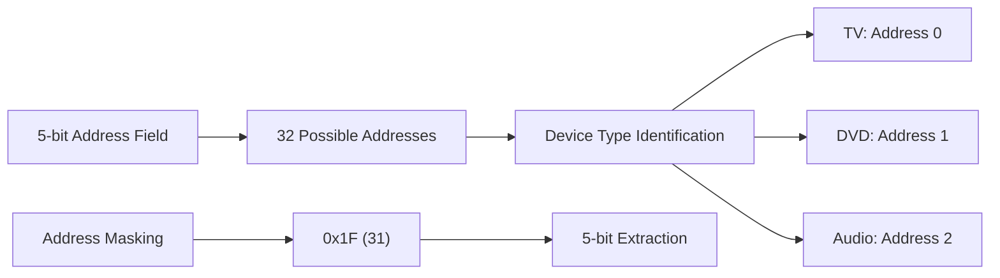

**Diagram sources**
- [infrared_decoder_rc5.c](file://lib/infrared/encoder_decoder/rc5/infrared_decoder_rc5.c#L1-L80)
- [infrared_protocol_rc5.c](file://lib/infrared/encoder_decoder/rc5/infrared_protocol_rc5.c#L1-L50)

**Section sources**
- [infrared_decoder_rc5.c](file://lib/infrared/encoder_decoder/rc5/infrared_decoder_rc5.c#L1-L80)
- [infrared_protocol_rc5.c](file://lib/infrared/encoder_decoder/rc5/infrared_protocol_rc5.c#L1-L50)

## Decoder Implementation
The RC5 decoder implementation is built on a modular architecture that separates the protocol-specific logic from the common decoding framework. The decoder is implemented as a state machine that processes incoming infrared signals and extracts the encoded data.

Key components of the decoder implementation:

- **State machine**: Manages the decoding process
- **Timing analysis**: Measures pulse durations
- **Manchester decoding**: Interprets bi-phase encoded data
- **Data interpretation**: Extracts address, command, and toggle information
- **Repeat detection**: Identifies repeated transmissions

The decoder structure is defined as:

```c
typedef struct {
    InfraredCommonDecoder* common_decoder;
    bool toggle;
} InfraredRc5Decoder;
```

The decoding process follows these steps:

1. Allocate decoder context with `infrared_decoder_rc5_alloc()`
2. Process incoming signal edges with `infrared_decoder_rc5_decode()`
3. Check if a complete message is ready with `infrared_decoder_rc5_check_ready()`
4. Interpret the decoded data with `infrared_decoder_rc5_interpret()`
5. Reset the decoder with `infrared_decoder_rc5_reset()` when needed

The decoder uses the common infrared framework to handle low-level signal processing, focusing on the RC5-specific aspects of the protocol.

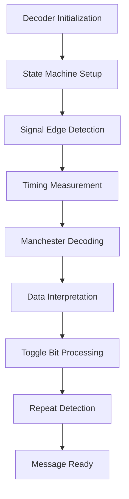

**Diagram sources**
- [infrared_decoder_rc5.c](file://lib/infrared/encoder_decoder/rc5/infrared_decoder_rc5.c#L1-L80)
- [infrared_common_decoder.c](file://lib/infrared/encoder_decoder/common/infrared_common_decoder.c#L1-L317)

**Section sources**
- [infrared_decoder_rc5.c](file://lib/infrared/encoder_decoder/rc5/infrared_decoder_rc5.c#L1-L80)
- [infrared_common_decoder.c](file://lib/infrared/encoder_decoder/common/infrared_common_decoder.c#L1-L317)

## Encoder Implementation
The RC5 encoder implementation is responsible for generating the infrared signal that represents a specific command. It converts a high-level command message into a precisely timed sequence of infrared pulses that can be transmitted by the device's infrared LED.

Key components of the encoder implementation:

- **State management**: Tracks the encoding process
- **Manchester encoding**: Converts data bits to bi-phase signals
- **Toggle bit handling**: Manages the toggle state
- **Signal generation**: Produces timing values for transmission

The encoder structure is defined as:

```c
typedef struct InfraredEncoderRC5 {
    InfraredCommonEncoder* common_encoder;
    bool toggle_bit;
} InfraredEncoderRC5;
```

The encoding process follows these steps:

1. Allocate encoder context with `infrared_encoder_rc5_alloc()`
2. Reset encoder with `infrared_encoder_rc5_reset()` when sending a new message
3. Generate timing values with `infrared_encoder_rc5_encode()`
4. Free encoder resources with `infrared_encoder_rc5_free()` when done

During the reset process, the encoder constructs the data frame:

```c
*data |= 0x01; // start bit
*data |= 0x02; // start bit (for RC5)
*data |= encoder->toggle_bit ? 0x04 : 0; // toggle bit
*data |= (reverse(message->address) >> 3) << 3; // address
*data |= (reverse(message->command) >> 2) << 8; // command
```

The encoder then inverts the data (due to Manchester encoding requirements) and prepares it for transmission.

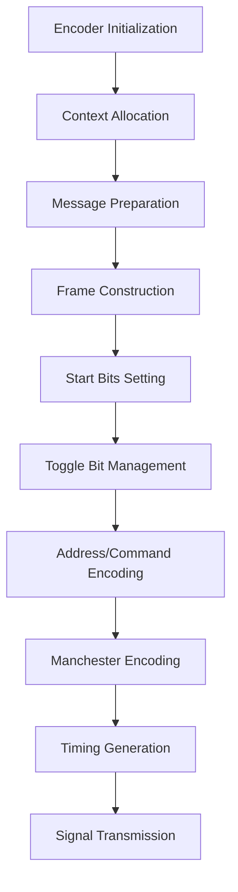

**Diagram sources**
- [infrared_encoder_rc5.c](file://lib/infrared/encoder_decoder/rc5/infrared_encoder_rc5.c#L1-L54)
- [infrared_common_encoder.c](file://lib/infrared/encoder_decoder/common/infrared_common_encoder.c#L1-L317)

**Section sources**
- [infrared_encoder_rc5.c](file://lib/infrared/encoder_decoder/rc5/infrared_encoder_rc5.c#L1-L54)
- [infrared_common_encoder.c](file://lib/infrared/encoder_decoder/common/infrared_common_encoder.c#L1-L317)

## RC5 vs RC5X Variants
The implementation supports both the standard RC5 protocol and the extended RC5X variant. These protocols share the same basic structure but differ in specific details.

**RC5 Protocol:**
- Command field: 6 bits (64 possible commands)
- Second start bit: Always 1
- Address range: 5 bits (32 devices)

**RC5X Protocol:**
- Command field: 7 bits (128 possible commands)
- Second start bit: 7th bit of address (in this implementation, always 0)
- Address range: 5 bits (32 devices)

The variant selection is handled by the `infrared_protocol_rc5_get_variant()` function:

```c
const InfraredProtocolVariant* infrared_protocol_rc5_get_variant(InfraredProtocol protocol) {
    if(protocol == InfraredProtocolRC5)
        return &infrared_protocol_variant_rc5;
    else if(protocol == InfraredProtocolRC5X)
        return &infrared_protocol_variant_rc5x;
    else
        return NULL;
}
```

The key difference is in the command field length, which allows RC5X to support twice as many commands as the standard RC5 protocol. This is particularly useful for devices with more complex functionality that requires a larger command set.

The implementation maintains backward compatibility by using the same addressing scheme and basic frame structure, ensuring that devices can work with both standard RC5 remotes and extended RC5X remotes.

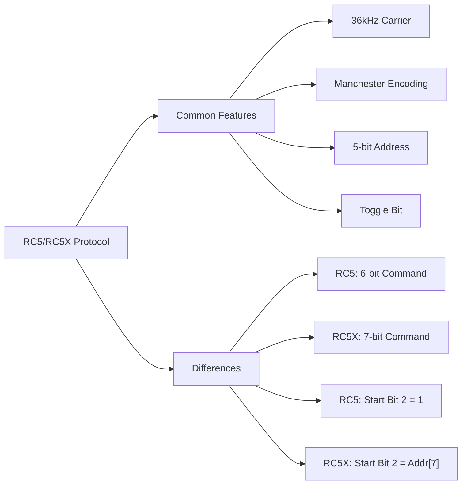

**Diagram sources**
- [infrared_protocol_rc5.c](file://lib/infrared/encoder_decoder/rc5/infrared_protocol_rc5.c#L1-L50)
- [infrared_protocol_rc5.h](file://lib/infrared/encoder_decoder/rc5/infrared_protocol_rc5.h#L1-L38)

**Section sources**
- [infrared_protocol_rc5.c](file://lib/infrared/encoder_decoder/rc5/infrared_protocol_rc5.c#L1-L50)
- [infrared_protocol_rc5.h](file://lib/infrared/encoder_decoder/rc5/infrared_protocol_rc5.h#L1-L38)

## Code Architecture
The RC5 protocol implementation follows a modular architecture that separates concerns and promotes code reuse. The architecture is built on a common infrared framework that provides shared functionality for multiple infrared protocols.

**Architecture Layers:**
1. **Protocol-specific layer**: RC5/RC5X specific logic
2. **Common infrared layer**: Shared encoding/decoding functions
3. **Hardware abstraction layer**: Signal generation and detection

The implementation uses object-oriented design patterns with function pointers to implement polymorphic behavior:

```c
const InfraredCommonProtocolSpec infrared_protocol_rc5 = {
    .timings = { /* timing parameters */ },
    .databit_len[0] = 14, // total bits
    .manchester_start_from_space = true,
    .decode = infrared_common_decode_manchester,
    .encode = infrared_common_encode_manchester,
    .interpret = infrared_decoder_rc5_interpret,
    .decode_repeat = NULL,
    .encode_repeat = NULL,
};
```

This design allows the common framework to handle generic infrared operations while delegating protocol-specific details to the RC5 implementation.

The memory layout uses variable-length structures to efficiently store the decoded data:

```c
struct InfraredCommonDecoder {
    // ... other fields
    uint8_t data[]; // flexible array member
};
```

This approach minimizes memory usage while providing the necessary storage for the decoded bits.

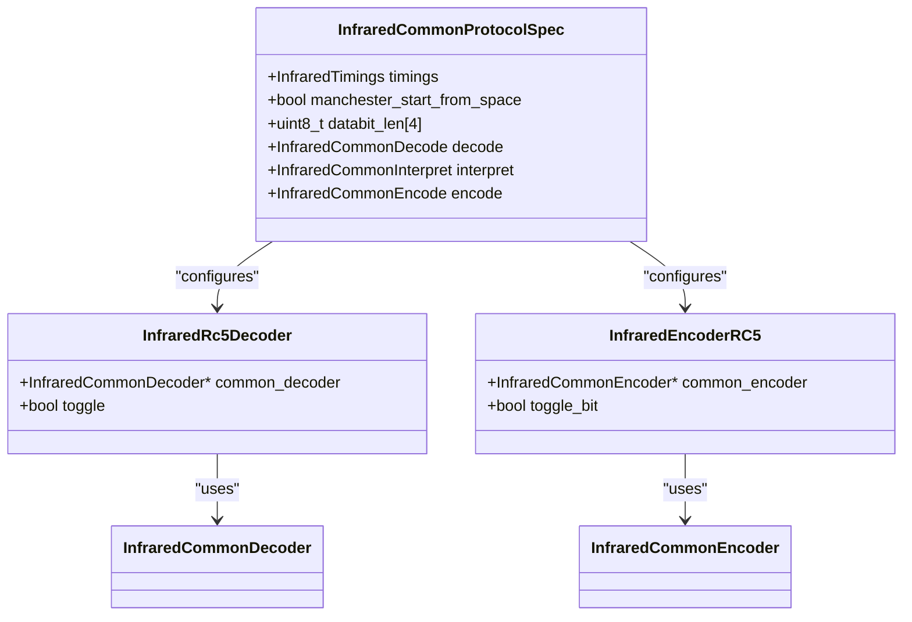

**Diagram sources**
- [infrared_protocol_rc5.c](file://lib/infrared/encoder_decoder/rc5/infrared_protocol_rc5.c#L1-L50)
- [infrared_decoder_rc5.c](file://lib/infrared/encoder_decoder/rc5/infrared_decoder_rc5.c#L1-L80)
- [infrared_encoder_rc5.c](file://lib/infrared/encoder_decoder/rc5/infrared_encoder_rc5.c#L1-L54)

**Section sources**
- [infrared_protocol_rc5.c](file://lib/infrared/encoder_decoder/rc5/infrared_protocol_rc5.c#L1-L50)
- [infrared_decoder_rc5.c](file://lib/infrared/encoder_decoder/rc5/infrared_decoder_rc5.c#L1-L80)
- [infrared_encoder_rc5.c](file://lib/infrared/encoder_decoder/rc5/infrared_encoder_rc5.c#L1-L54)

## Implementation Challenges
The RC5 protocol implementation faces several technical challenges that require careful consideration and precise implementation.

**Timing Precision Requirements:**
The protocol requires precise timing with a half-bit period of 888µs and a tolerance of only ±120µs. This narrow tolerance window demands accurate timing measurements and careful handling of system interrupts and processing delays.

**Toggle Bit Synchronization:**
Maintaining proper toggle bit state across power cycles and multiple devices can be challenging. The implementation must ensure that the toggle bit logic works correctly even when the receiver misses transmissions or when multiple remotes are used.

**Manchester Decoding Complexity:**
The Manchester encoding scheme requires detecting transitions in the middle of bit periods, which can be challenging in the presence of noise or signal distortion. The implementation must reliably distinguish between valid transitions and spurious signals.

**Memory Management:**
The variable-length structure design requires careful memory management to prevent buffer overflows and ensure efficient memory usage.

**Hardware Limitations:**
The infrared LED and receiver have physical limitations that affect signal quality, including limited modulation bandwidth and sensitivity to ambient light.

**Interference Mitigation:**
The 36kHz carrier frequency must be generated accurately to avoid interference with other devices and to ensure reliable reception.

These challenges are addressed through careful algorithm design, robust error handling, and thorough testing of the implementation under various conditions.

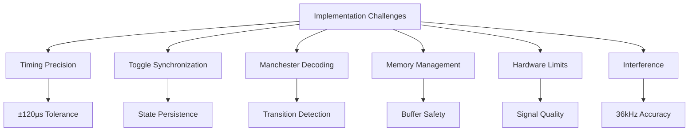

**Diagram sources**
- [infrared_protocol_rc5_i.h](file://lib/infrared/encoder_decoder/rc5/infrared_protocol_rc5_i.h#L1-L20)
- [infrared_decoder_rc5.c](file://lib/infrared/encoder_decoder/rc5/infrared_decoder_rc5.c#L1-L80)
- [infrared_common_decoder.c](file://lib/infrared/encoder_decoder/common/infrared_common_decoder.c#L1-L317)

**Section sources**
- [infrared_protocol_rc5_i.h](file://lib/infrared/encoder_decoder/rc5/infrared_protocol_rc5_i.h#L1-L20)
- [infrared_decoder_rc5.c](file://lib/infrared/encoder_decoder/rc5/infrared_decoder_rc5.c#L1-L80)
- [infrared_common_decoder.c](file://lib/infrared/encoder_decoder/common/infrared_common_decoder.c#L1-L317)