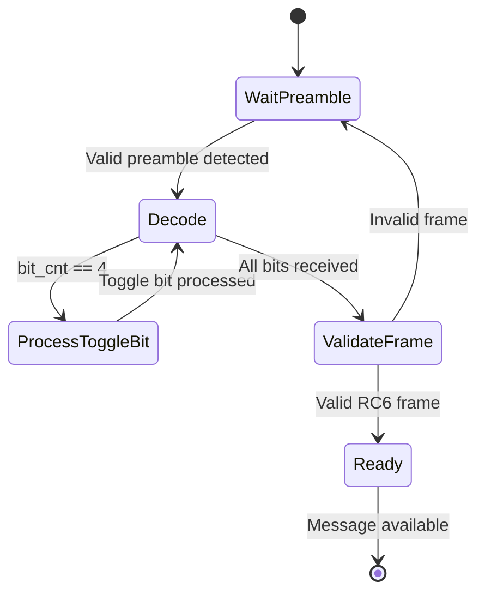
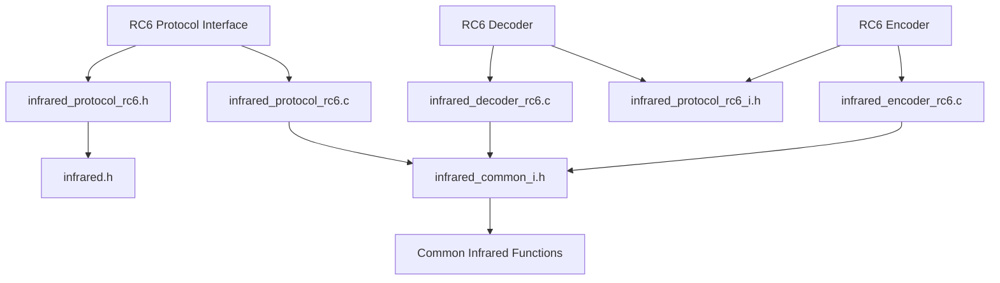
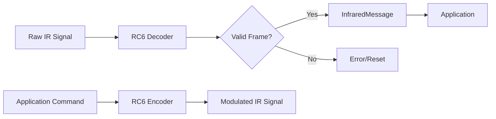

# RC6 Protocol

<cite>
**Referenced Files in This Document**   
- [infrared_protocol_rc6.h](file://lib/infrared/encoder_decoder/rc6/infrared_protocol_rc6.h)
- [infrared_protocol_rc6.c](file://lib/infrared/encoder_decoder/rc6/infrared_protocol_rc6.c)
- [infrared_decoder_rc6.c](file://lib/infrared/encoder_decoder/rc6/infrared_decoder_rc6.c)
- [infrared_encoder_rc6.c](file://lib/infrared/encoder_decoder/rc6/infrared_encoder_rc6.c)
- [infrared_protocol_rc6_i.h](file://lib/infrared/encoder_decoder/rc6/infrared_protocol_rc6_i.h)
- [infrared_i.h](file://lib/infrared/encoder_decoder/infrared_i.h)
- [infrared.h](file://lib/infrared/encoder_decoder/infrared.h)
- [infrared_common_i.h](file://lib/infrared/encoder_decoder/common/infrared_common_i.h)
</cite>

## Table of Contents
1. [Introduction](#introduction)
2. [RC6 Protocol Specifications](#rc6-protocol-specifications)
3. [Frame Structure and Data Encoding](#frame-structure-and-data-encoding)
4. [Timing Specifications](#timing-specifications)
5. [Decoder Implementation](#decoder-implementation)
6. [Encoder Implementation](#encoder-implementation)
7. [State Machine Architecture](#state-machine-architecture)
8. [Control Bit and Toggle Functionality](#control-bit-and-toggle-functionality)
9. [Manchester Modulation Handling](#manchester-modulation-handling)
10. [Code Structure and Data Flow](#code-structure-and-data-flow)

## Introduction
The RC6 protocol is an infrared remote control communication standard developed by Philips for use in consumer electronics. This document provides a comprehensive technical analysis of the RC6 protocol implementation within the Flipper Zero firmware, detailing its architecture, timing specifications, encoding/decoding mechanisms, and integration with the infrared subsystem. The implementation supports the standard RC6 mode (mode 0) with a 20-bit frame structure, 36kHz carrier frequency, and modified Manchester (bi-phase) modulation.

**Section sources**
- [infrared_protocol_rc6.h](file://lib/infrared/encoder_decoder/rc6/infrared_protocol_rc6.h)
- [infrared.h](file://lib/infrared/encoder_decoder/infrared.h)

## RC6 Protocol Specifications
The RC6 protocol implementation in the Flipper Zero firmware adheres to the standard specifications with precise timing and structural requirements.

### Protocol Parameters
- **Carrier Frequency**: 36kHz
- **Duty Cycle**: 33%
- **Modulation Scheme**: Modified Manchester (bi-phase)
- **Frame Length**: 20 bits total
- **Preamble Duration**: 2666µs mark, 889µs space
- **Bit Period**: 888µs (444µs unit period)
- **Silence Period**: 27,000µs (2700µs × 10)

### Protocol Variants
The implementation specifically supports RC6 mode 0, which is the most common variant used in consumer electronics. The protocol variant structure defines the specific parameters for this mode:

```c
static const InfraredProtocolVariant infrared_protocol_variant_rc6 = {
    .name = "RC6",
    .address_length = 8,
    .command_length = 8,
    .frequency = INFRARED_RC6_CARRIER_FREQUENCY,
    .duty_cycle = INFRARED_RC6_DUTY_CYCLE,
    .repeat_count = INFRARED_RC6_REPEAT_COUNT_MIN,
};
```

**Section sources**
- [infrared_protocol_rc6.c](file://lib/infrared/encoder_decoder/rc6/infrared_protocol_rc6.c#L15-L25)
- [infrared_protocol_rc6_i.h](file://lib/infrared/encoder_decoder/rc6/infrared_protocol_rc6_i.h#L4-L15)

## Frame Structure and Data Encoding
The RC6 protocol uses a 20-bit frame structure with specific bit organization and data encoding requirements.

### Frame Composition
The 20-bit RC6 frame consists of the following components in sequence:
- **Start Bit**: 1 bit (always 1)
- **Mode Bits**: 3 bits (000 for RC6 mode 0)
- **Toggle Bit**: 1 bit (twice the normal bit duration)
- **Address Field**: 8 bits (device address)
- **Command Field**: 8 bits (command code)

### Bit Ordering
All data fields use MSB (Most Significant Bit) first transmission order. The implementation includes bit reversal functions to handle the endianness conversion between the internal representation and the transmitted signal:

```c
uint8_t reverse(uint8_t value) {
    uint8_t reverse_value = 0;
    for(int i = 0; i < 8; ++i) {
        reverse_value |= (value & (0x01 << i)) ? 1 << (7 - i) : 0;
    }
    return reverse_value;
}
```

### Data Field Interpretation
During decoding, the raw data is properly interpreted by extracting and reversing the individual fields:

```c
uint8_t address = reverse((uint8_t)(*data >> 5));
uint8_t command = reverse((uint8_t)(*data >> 13));
bool start_bit = *data & 0x01;
bool toggle = !!(*data & 0x10);
uint8_t mode = (*data >> 1) & 0x7;
```

**Section sources**
- [infrared_decoder_rc6.c](file://lib/infrared/encoder_decoder/rc6/infrared_decoder_rc6.c#L25-L45)
- [infrared_encoder_rc6.c](file://lib/infrared/encoder_decoder/rc6/infrared_encoder_rc6.c#L20-L30)
- [infrared_i.h](file://lib/infrared/encoder_decoder/infrared_i.h#L45-L55)

## Timing Specifications
The RC6 protocol implementation uses precise timing parameters to ensure compatibility with standard RC6 devices.

### Timing Constants
The following timing constants are defined for the RC6 protocol:

| **Parameter** | **Value (µs)** | **Description** |
|---------------|----------------|-----------------|
| INFRARED_RC6_PREAMBLE_MARK | 2666 | Preamble mark duration |
| INFRARED_RC6_PREAMBLE_SPACE | 889 | Preamble space duration |
| INFRARED_RC6_BIT | 444 | Half bit period (unit period) |
| INFRARED_RC6_PREAMBLE_TOLERANCE | 200 | Preamble timing tolerance |
| INFRARED_RC6_BIT_TOLERANCE | 120 | Bit timing tolerance |
| INFRARED_RC6_SILENCE | 27000 | Inter-frame silence period |
| INFRARED_RC6_MIN_SPLIT_TIME | 2700 | Minimum split time |

### Timing Validation
The implementation uses a tolerance-based matching system to validate timing values:

```c
#define MATCH_TIMING(x, v, delta) (((x) < ((v) + (delta))) && ((x) > ((v) - (delta))))
```

This macro checks if a measured timing value falls within an acceptable range around the expected value, accounting for signal variations and measurement inaccuracies.

**Section sources**
- [infrared_protocol_rc6_i.h](file://lib/infrared/encoder_decoder/rc6/infrared_protocol_rc6_i.h#L4-L15)
- [infrared_common_i.h](file://lib/infrared/encoder_decoder/common/infrared_common_i.h#L4)

## Decoder Implementation
The RC6 decoder implementation uses a stateful approach with specialized handling for the unique toggle bit timing.

### Decoder Structure
The decoder is implemented as a structured state machine with the following components:

```c
typedef struct {
    InfraredCommonDecoder* common_decoder;
    bool toggle;
} InfraredRc6Decoder;
```

The structure contains a pointer to the common decoder functionality and maintains the toggle bit state across transmissions.

### Decoding Process
The decoding process follows these steps:
1. Allocate and initialize the decoder context
2. Process incoming signal levels and durations
3. Validate preamble timing
4. Handle the special toggle bit timing
5. Decode remaining bits using Manchester decoding
6. Validate and interpret the complete frame
7. Return the decoded message

### Toggle Bit Special Handling
The fourth bit (toggle bit) has twice the normal duration, requiring special handling in the decoding process:

```c
if(decoder->databit_cnt == 4) {
    if(single_timing ^ triple_timing) {
        ++decoder->databit_cnt;
        decoder->data[0] |= (single_timing ? !level : level) << 4;
        status = InfraredStatusOk;
    }
}
```

This special case ensures proper decoding of the extended toggle bit before resuming normal Manchester decoding.

**Section sources**
- [infrared_decoder_rc6.c](file://lib/infrared/encoder_decoder/rc6/infrared_decoder_rc6.c)
- [infrared_common_i.h](file://lib/infrared/encoder_decoder/common/infrared_common_i.h)

## Encoder Implementation
The RC6 encoder implementation generates properly formatted infrared signals with precise timing control.

### Encoder Structure
The encoder maintains state for generating RC6 signals:

```c
typedef struct InfraredEncoderRC6 {
    InfraredCommonEncoder* common_encoder;
    bool toggle_bit;
} InfraredEncoderRC6;
```

The structure includes a pointer to common encoding functionality and tracks the toggle bit state for repeat transmissions.

### Encoding Process
The encoding process follows these steps:
1. Initialize the encoder with the message to transmit
2. Set up the preamble timing
3. Generate the start bit and mode bits
4. Handle the special toggle bit timing
5. Encode address and command fields using Manchester encoding
6. Add the inter-frame silence period
7. Generate repeat transmissions when needed

### Toggle Bit Management
The encoder automatically toggles the toggle bit state after each transmission:

```c
void infrared_encoder_rc6_reset(void* encoder_ptr, const InfraredMessage* message) {
    // ... setup code ...
    *data |= encoder->toggle_bit ? 0x10 : 0;
    // ... more setup ...
    encoder->toggle_bit ^= 1;
}
```

This ensures proper toggle behavior for consecutive button presses.

**Section sources**
- [infrared_encoder_rc6.c](file://lib/infrared/encoder_decoder/rc6/infrared_encoder_rc6.c)
- [infrared_common_i.h](file://lib/infrared/encoder_decoder/common/infrared_common_i.h)

## State Machine Architecture
The RC6 implementation uses a hierarchical state machine architecture that leverages common infrared functionality.

### Common Decoder State Machine
The underlying common decoder uses a three-state machine:

```c
typedef enum {
    InfraredCommonDecoderStateWaitPreamble,
    InfraredCommonDecoderStateDecode,
    InfraredCommonDecoderStateProcessRepeat,
} InfraredCommonStateDecoder;
```

### Protocol-Specific State Handling
The RC6 protocol extends the common state machine with specialized handling for its unique requirements:



**Diagram sources**
- [infrared_decoder_rc6.c](file://lib/infrared/encoder_decoder/rc6/infrared_decoder_rc6.c#L50-L100)
- [infrared_common_i.h](file://lib/infrared/encoder_decoder/common/infrared_common_i.h#L70-L75)

## Control Bit and Toggle Functionality
The RC6 protocol includes specialized control bits with specific functions.

### Mode Bits
The three mode bits (m0-m2) identify the RC6 variant being used:
- **000**: RC6 mode 0 (standard 20-bit)
- **001**: RC6 mode 1 (extended 24-bit)
- **010**: RC6 mode 2 (extended 28-bit)
- **011**: RC6 mode 3 (extended 32-bit)

The current implementation only supports mode 0 (000), as verified by the decoding logic:

```c
if((start_bit == 1) && (mode == 0)) {
    // Valid RC6 mode 0 frame
    // ... processing code ...
}
```

### Toggle Bit Functionality
The toggle bit serves as a press detection mechanism:
- Toggles state with each button press
- Allows devices to distinguish between a single press and a held button
- Prevents unintended repeat actions when a button is held down

The implementation tracks the toggle state across transmissions:

```c
InfraredRc6Decoder* rc6_decoder = decoder->context;
bool* prev_toggle = &rc6_decoder->toggle;
// ... comparison logic ...
*prev_toggle = toggle;
```

**Section sources**
- [infrared_decoder_rc6.c](file://lib/infrared/encoder_decoder/rc6/infrared_decoder_rc6.c#L30-L45)
- [infrared_encoder_rc6.c](file://lib/infrared/encoder_decoder/rc6/infrared_encoder_rc6.c#L25-L30)

## Manchester Modulation Handling
The RC6 protocol uses modified Manchester (bi-phase) modulation with special handling for the toggle bit.

### Manchester Encoding Principles
In Manchester encoding:
- A '0' bit is represented by a high-to-low transition in the middle of the bit period
- A '1' bit is represented by a low-to-high transition in the middle of the bit period
- Each bit period is divided into two equal halves (444µs each)

### Special Toggle Bit Handling
The toggle bit (4th bit) has twice the normal duration (1776µs instead of 888µs), requiring specialized decoding:

```c
InfraredStatus infrared_decoder_rc6_decode_manchester(
    InfraredCommonDecoder* decoder,
    bool level,
    uint32_t timing) {
    
    if(decoder->databit_cnt == 4) {
        // Special handling for toggle bit
        if(single_timing ^ triple_timing) {
            // Process toggle bit
            status = InfraredStatusOk;
        }
    } else {
        // Normal Manchester decoding
        status = infrared_common_decode_manchester(decoder, level, timing);
    }
    return status;
}
```

### Encoding Modification
Similarly, the encoder modifies the timing for the toggle bit:

```c
InfraredStatus infrared_encoder_rc6_encode_manchester(
    InfraredCommonEncoder* common_encoder,
    uint32_t* duration,
    bool* polarity) {
    
    InfraredStatus status = infrared_common_encode_manchester(common_encoder, duration, polarity);
    if(common_encoder->bits_encoded == 4) *duration *= 2;
    return status;
}
```

**Section sources**
- [infrared_decoder_rc6.c](file://lib/infrared/encoder_decoder/rc6/infrared_decoder_rc6.c#L50-L90)
- [infrared_encoder_rc6.c](file://lib/infrared/encoder_decoder/rc6/infrared_encoder_rc6.c#L50-L55)

## Code Structure and Data Flow
The RC6 implementation follows a modular architecture that integrates with the broader infrared subsystem.

### Component Architecture
The RC6 protocol is implemented as a collection of specialized files that work together:



**Diagram sources**
- [infrared_protocol_rc6.h](file://lib/infrared/encoder_decoder/rc6/infrared_protocol_rc6.h)
- [infrared_decoder_rc6.c](file://lib/infrared/encoder_decoder/rc6/infrared_decoder_rc6.c)
- [infrared_encoder_rc6.c](file://lib/infrared/encoder_decoder/rc6/infrared_encoder_rc6.c)

### Data Flow
The data flow for RC6 communication follows this pattern:



### Integration with Infrared Subsystem
The RC6 implementation integrates with the common infrared framework through well-defined interfaces:

```c
const InfraredCommonProtocolSpec infrared_protocol_rc6 = {
    .timings = { /* timing parameters */ },
    .databit_len[0] = 20,
    .manchester_start_from_space = false,
    .decode = infrared_decoder_rc6_decode_manchester,
    .encode = infrared_encoder_rc6_encode_manchester,
    .interpret = infrared_decoder_rc6_interpret,
    .decode_repeat = NULL,
    .encode_repeat = NULL,
};
```

This structure allows the RC6 protocol to be registered and used within the broader infrared system.

**Section sources**
- [infrared_protocol_rc6.c](file://lib/infrared/encoder_decoder/rc6/infrared_protocol_rc6.c)
- [infrared_common_i.h](file://lib/infrared/encoder_decoder/common/infrared_common_i.h)
- [infrared.h](file://lib/infrared/encoder_decoder/infrared.h)