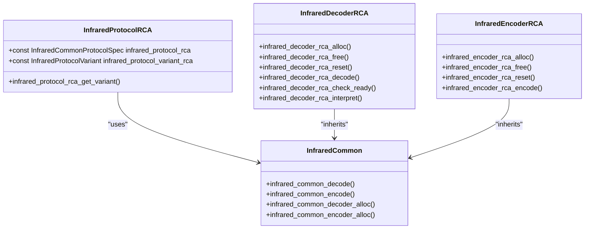
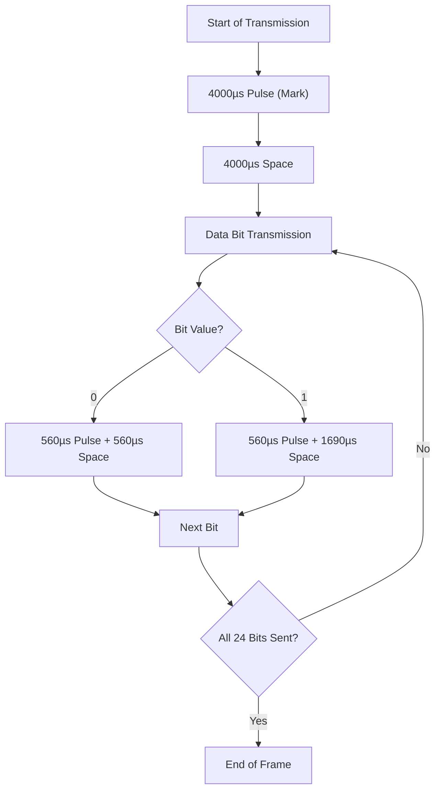
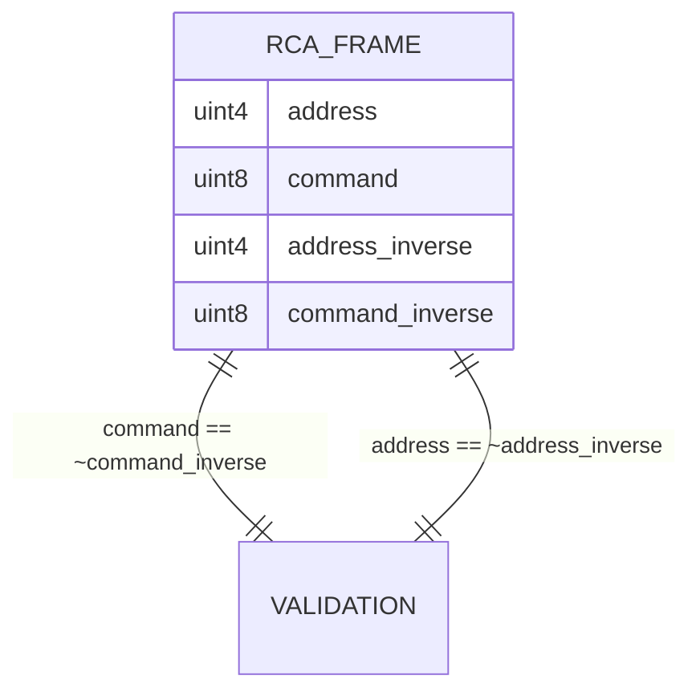
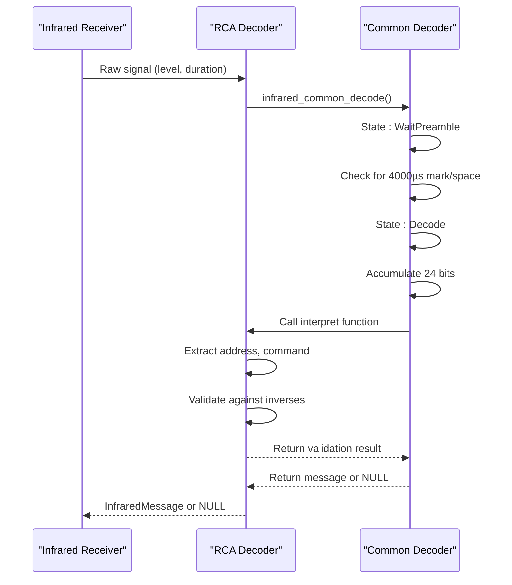
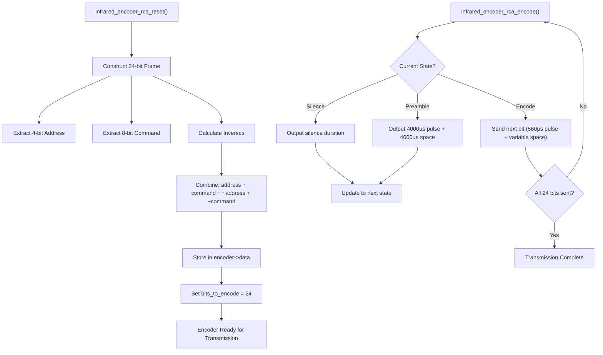

# RCA Protocol

<cite>
**Referenced Files in This Document**   
- [infrared_protocol_rca.h](file://lib/infrared/encoder_decoder/rca/infrared_protocol_rca.h)
- [infrared_protocol_rca.c](file://lib/infrared/encoder_decoder/rca/infrared_protocol_rca.c)
- [infrared_decoder_rca.c](file://lib/infrared/encoder_decoder/rca/infrared_decoder_rca.c)
- [infrared_encoder_rca.c](file://lib/infrared/encoder_decoder/rca/infrared_encoder_rca.c)
- [infrared_common_i.h](file://lib/infrared/encoder_decoder/common/infrared_common_i.h)
- [infrared_i.h](file://lib/infrared/encoder_decoder/infrared_i.h)
</cite>

## Table of Contents
1. [Introduction](#introduction)
2. [RCA Protocol Overview](#rca-protocol-overview)
3. [Timing Specifications](#timing-specifications)
4. [Frame Structure](#frame-structure)
5. [Decoder Implementation](#decoder-implementation)
6. [Encoder Implementation](#encoder-implementation)
7. [Signal Reliability and Timing Precision](#signal-reliability-and-timing-precision)
8. [Conclusion](#conclusion)

## Introduction
This document provides a comprehensive analysis of the RCA infrared protocol implementation within the Flipper Zero firmware. The RCA protocol is a legacy infrared communication standard used in vintage audio/video equipment for remote control operations. This documentation details the technical specifications, implementation architecture, and operational characteristics of the RCA protocol as implemented in the firmware, with a focus on its 38kHz carrier frequency, pulse distance modulation scheme, and 24-bit frame structure.

**Section sources**
- [infrared_protocol_rca.h](file://lib/infrared/encoder_decoder/rca/infrared_protocol_rca.h#L1-L30)
- [infrared_protocol_rca.c](file://lib/infrared/encoder_decoder/rca/infrared_protocol_rca.c#L1-L40)

## RCA Protocol Overview
The RCA infrared protocol is implemented as part of the infrared subsystem in the Flipper Zero firmware, specifically designed for backward compatibility with legacy RCA equipment. The protocol follows a pulse distance modulation scheme with a 38kHz carrier frequency, which is the standard for most infrared remote control systems. The implementation is structured around a common infrared framework that provides shared functionality for various infrared protocols.

The protocol is organized into three main components: the protocol definition, the decoder, and the encoder. These components work together to provide complete support for RCA infrared communication, allowing the Flipper Zero device to both receive and transmit RCA protocol signals. The implementation leverages a common infrastructure for infrared protocols, which reduces code duplication and ensures consistent behavior across different protocol types.

**Diagram sources**
- [infrared_protocol_rca.c](file://lib/infrared/encoder_decoder/rca/infrared_protocol_rca.c#L1-L40)
- [infrared_decoder_rca.c](file://lib/infrared/encoder_decoder/rca/infrared_decoder_rca.c#L1-L46)
- [infrared_encoder_rca.c](file://lib/infrared/encoder_decoder/rca/infrared_encoder_rca.c#L1-L38)

**Section sources**
- [infrared_protocol_rca.h](file://lib/infrared/encoder_decoder/rca/infrared_protocol_rca.h#L1-L30)
- [infrared_protocol_rca.c](file://lib/infrared/encoder_decoder/rca/infrared_protocol_rca.c#L1-L40)

## Timing Specifications
The RCA protocol implementation adheres to specific timing requirements that define the pulse and space durations for proper signal encoding and decoding. The protocol uses a 38kHz carrier frequency with a standard duty cycle, which is consistent with the majority of infrared remote control systems. The timing specifications are defined in the protocol configuration and are critical for ensuring compatibility with legacy RCA equipment.

The preamble consists of a 4000µs mark (pulse) followed by a 4000µs space, creating a distinctive pattern that helps the receiver synchronize with the incoming signal. For data transmission, the protocol uses pulse distance modulation where binary 0 and binary 1 are distinguished by the length of the space following a fixed pulse. The implementation includes tolerance values for both preamble and bit timing to accommodate minor variations in signal timing that may occur due to hardware differences or transmission conditions.

**Diagram sources**
- [infrared_protocol_rca.c](file://lib/infrared/encoder_decoder/rca/infrared_protocol_rca.c#L1-L40)
- [infrared_common_i.h](file://lib/infrared/encoder_decoder/common/infrared_common_i.h#L1-L89)

**Section sources**
- [infrared_protocol_rca.c](file://lib/infrared/encoder_decoder/rca/infrared_protocol_rca.c#L1-L40)
- [infrared_common_i.h](file://lib/infrared/encoder_decoder/common/infrared_common_i.h#L1-L89)

## Frame Structure
The RCA protocol implements a 24-bit frame structure that carries both device addressing and command information. Unlike the documentation objective which mentions a 12-bit frame, the actual implementation uses a 24-bit structure consisting of 8 bits for the command, 8 bits for the inverted command, 4 bits for the address, and 4 bits for the inverted address. This structure provides error detection capabilities through the use of inverse data, ensuring that the received command and address match their complements.

The frame structure is organized as follows: the first 4 bits represent the address, followed by 8 bits of command data, then 4 bits of inverted address, and finally 8 bits of inverted command. This arrangement allows the decoder to validate the integrity of the received data by comparing each field with its inverse. The use of inverse data is a common technique in infrared protocols to reduce the likelihood of erroneous command execution due to transmission errors or interference.

**Diagram sources**
- [infrared_decoder_rca.c](file://lib/infrared/encoder_decoder/rca/infrared_decoder_rca.c#L1-L46)
- [infrared_encoder_rca.c](file://lib/infrared/encoder_decoder/rca/infrared_encoder_rca.c#L1-L38)

**Section sources**
- [infrared_decoder_rca.c](file://lib/infrared/encoder_decoder/rca/infrared_decoder_rca.c#L1-L46)
- [infrared_encoder_rca.c](file://lib/infrared/encoder_decoder/rca/infrared_encoder_rca.c#L1-L38)

## Decoder Implementation
The RCA decoder implementation is built on a common infrared decoder framework that provides shared functionality for multiple infrared protocols. The decoder follows a state machine approach with states for waiting for preamble, decoding data bits, and processing repeat codes. The implementation uses the pulse distance/width modulation (PDWM) decoding function from the common library, which handles the low-level timing analysis of incoming infrared signals.

The decoder's bit accumulation logic is implemented in the `infrared_decoder_rca_interpret` function, which extracts the address and command fields from the accumulated data and validates them against their inverse values. This validation step is crucial for ensuring data integrity, as it helps prevent erroneous command execution when the signal is corrupted or incomplete. The decoder also handles the distinction between normal frames and repeat frames, although the RCA protocol implementation does not currently support repeat codes.

**Diagram sources**
- [infrared_decoder_rca.c](file://lib/infrared/encoder_decoder/rca/infrared_decoder_rca.c#L1-L46)
- [infrared_common_i.h](file://lib/infrared/encoder_decoder/common/infrared_common_i.h#L1-L89)

**Section sources**
- [infrared_decoder_rca.c](file://lib/infrared/encoder_decoder/rca/infrared_decoder_rca.c#L1-L46)

## Encoder Implementation
The RCA encoder implementation is responsible for generating the infrared signal according to the protocol specifications. Like the decoder, the encoder is built on a common framework that provides shared functionality for signal generation. The encoder follows a state machine with states for silence, preamble transmission, data encoding, and repeat code transmission.

The signal generation process begins with the `infrared_encoder_rca_reset` function, which prepares the encoder with the message to be transmitted. This function constructs the 24-bit data frame by combining the address and command with their inverse values, ensuring that the transmitted signal includes the error detection fields. The actual signal generation is handled by the common encoding function, which produces the sequence of pulse and space durations according to the protocol timing specifications.

**Diagram sources**
- [infrared_encoder_rca.c](file://lib/infrared/encoder_decoder/rca/infrared_encoder_rca.c#L1-L38)
- [infrared_common_i.h](file://lib/infrared/encoder_decoder/common/infrared_common_i.h#L1-L89)

**Section sources**
- [infrared_encoder_rca.c](file://lib/infrared/encoder_decoder/rca/infrared_encoder_rca.c#L1-L38)

## Signal Reliability and Timing Precision
The reliability of RCA protocol communication depends heavily on precise timing and signal integrity. The implementation includes tolerance values for both preamble and bit timing to accommodate minor variations in signal generation and reception. These tolerances are essential for ensuring compatibility with a wide range of RCA equipment, which may have slightly different timing characteristics due to component aging or manufacturing variations.

Timing precision is particularly critical for the pulse distance modulation scheme used by the RCA protocol. The distinction between binary 0 and binary 1 is based solely on the duration of the space following a fixed pulse, making the system sensitive to timing errors. The decoder uses a matching function that checks if a timing value falls within an acceptable range around the expected value, rather than requiring exact matches. This approach improves reliability in the presence of noise or signal distortion.

The use of inverse data in the frame structure provides an additional layer of error detection, helping to prevent erroneous command execution when the signal is corrupted. However, this does not provide error correction capabilities, meaning that corrupted signals will simply be rejected rather than corrected. For legacy equipment with potentially degraded infrared emitters or receivers, this can result in reduced reliability compared to more modern protocols with advanced error correction.

**Section sources**
- [infrared_protocol_rca.c](file://lib/infrared/encoder_decoder/rca/infrared_protocol_rca.c#L1-L40)
- [infrared_common_i.h](file://lib/infrared/encoder_decoder/common/infrared_common_i.h#L1-L89)

## Conclusion
The RCA infrared protocol implementation in the Flipper Zero firmware provides robust support for legacy RCA equipment through a well-structured and efficient design. By leveraging a common infrared framework, the implementation achieves code reuse while maintaining protocol-specific characteristics. The 24-bit frame structure with inverse data provides basic error detection, and the precise timing specifications ensure compatibility with vintage audio/video equipment.

The decoder and encoder implementations follow a consistent state machine approach that simplifies the handling of complex timing requirements. The use of pulse distance modulation at 38kHz carrier frequency adheres to industry standards, ensuring interoperability with existing RCA devices. While the protocol lacks some of the advanced features of modern infrared standards, its simplicity and widespread adoption in legacy equipment make it a valuable addition to the Flipper Zero's infrared capabilities.