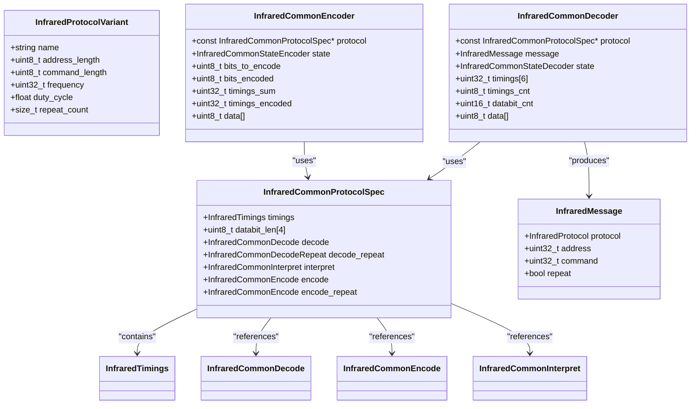
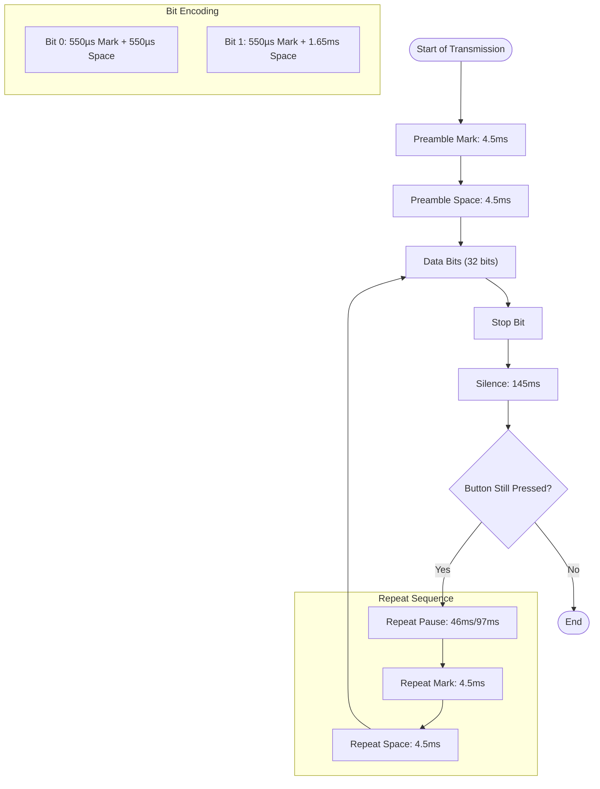
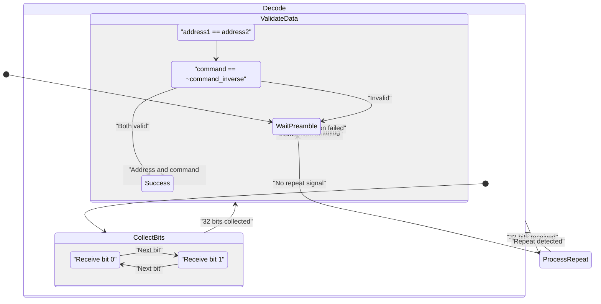
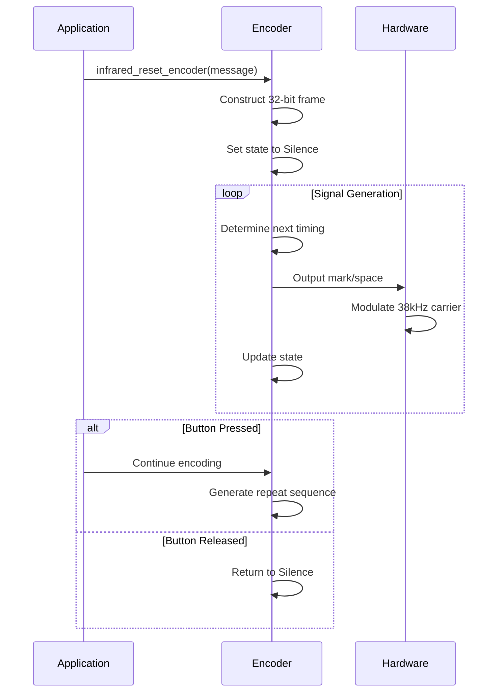
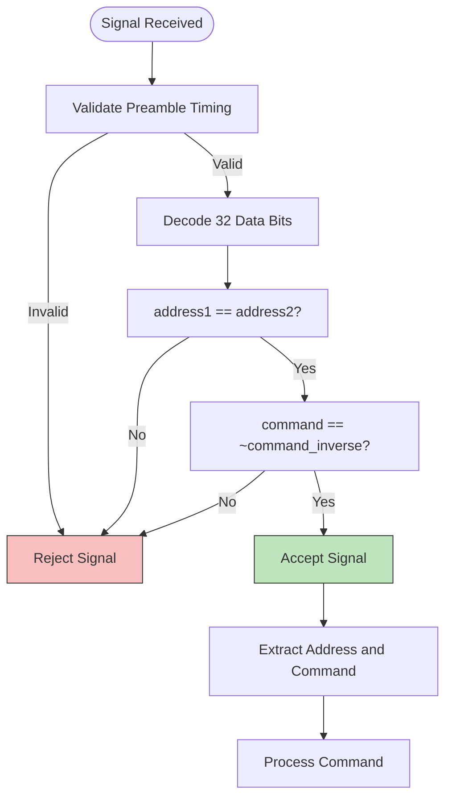
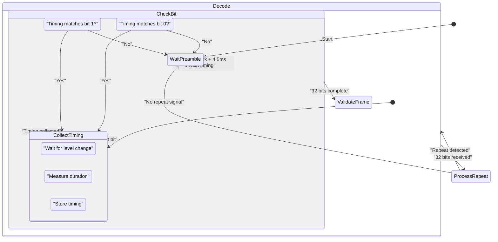
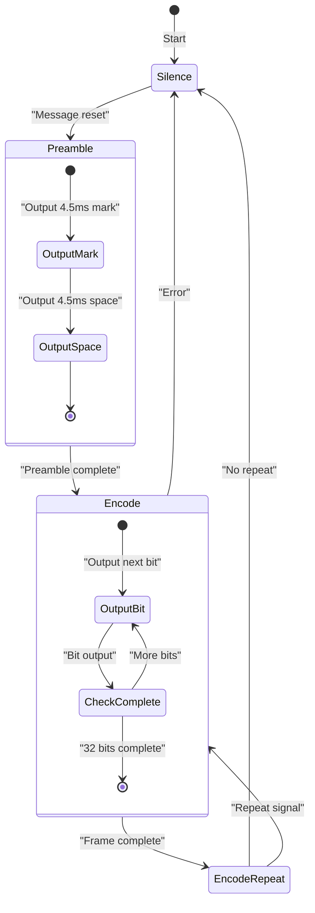

# Samsung Protocol

<cite>
**Referenced Files in This Document**   
- [infrared_protocol_samsung.h](file://lib/infrared/encoder_decoder/samsung/infrared_protocol_samsung.h)
- [infrared_protocol_samsung.c](file://lib/infrared/encoder_decoder/samsung/infrared_protocol_samsung.c)
- [infrared_decoder_samsung.c](file://lib/infrared/encoder_decoder/samsung/infrared_decoder_samsung.c)
- [infrared_encoder_samsung.c](file://lib/infrared/encoder_decoder/samsung/infrared_encoder_samsung.c)
- [infrared_protocol_samsung_i.h](file://lib/infrared/encoder_decoder/samsung/infrared_protocol_samsung_i.h)
- [infrared_common_i.h](file://lib/infrared/encoder_decoder/common/infrared_common_i.h)
- [infrared.h](file://lib/infrared/encoder_decoder/infrared.h)
- [infrared_i.h](file://lib/infrared/encoder_decoder/infrared_i.h)
</cite>

## Table of Contents
1. [Introduction](#introduction)
2. [Protocol Overview](#protocol-overview)
3. [Timing Specifications](#timing-specifications)
4. [Frame Structure](#frame-structure)
5. [Decoder Implementation](#decoder-implementation)
6. [Encoder Implementation](#encoder-implementation)
7. [Error Detection and Validation](#error-detection-and-validation)
8. [State Machine Analysis](#state-machine-analysis)
9. [Device Compatibility](#device-compatibility)
10. [Implementation Examples](#implementation-examples)

## Introduction

The Samsung infrared protocol implementation in the Flipper Zero firmware provides a complete solution for transmitting and receiving infrared signals using the Samsung32 protocol. This document details the technical specifications, implementation architecture, and operational characteristics of the Samsung protocol as implemented in the firmware. The protocol is designed to interface with Samsung consumer electronics including televisions, audio equipment, and other devices that utilize infrared remote controls.

**Section sources**
- [infrared_protocol_samsung.h](file://lib/infrared/encoder_decoder/samsung/infrared_protocol_samsung.h#L1-L32)
- [infrared.h](file://lib/infrared/encoder_decoder/infrared.h#L1-L220)

## Protocol Overview

The Samsung32 protocol is a pulse distance modulation scheme operating at a 38kHz carrier frequency, which is standard for infrared remote control systems. The protocol uses a 32-bit frame structure consisting of 16-bit address, 8-bit command, and 8-bit inverted command fields. This implementation follows the standard Samsung infrared communication format used across various Samsung product lines.

The protocol implementation is structured as a modular component within the infrared subsystem, following a consistent design pattern shared with other infrared protocols like NEC, RC5, and SIRC. The implementation separates the protocol definition from the encoding and decoding logic, allowing for efficient code reuse through common functions for pulse distance modulation.



**Diagram sources**
- [infrared_protocol_samsung.h](file://lib/infrared/encoder_decoder/samsung/infrared_protocol_samsung.h#L1-L32)
- [infrared_i.h](file://lib/infrared/encoder_decoder/infrared_i.h#L1-L48)
- [infrared_common_i.h](file://lib/infrared/encoder_decoder/common/infrared_common_i.h#L1-L89)

**Section sources**
- [infrared_protocol_samsung.h](file://lib/infrared/encoder_decoder/samsung/infrared_protocol_samsung.h#L1-L32)
- [infrared.h](file://lib/infrared/encoder_decoder/infrared.h#L1-L220)

## Timing Specifications

The Samsung32 protocol employs precise timing parameters for reliable signal transmission and reception. The timing specifications are defined with specific tolerance values to accommodate variations in hardware and environmental conditions.

### Preamble and Initial Burst
The protocol begins with a preamble consisting of a 4.5ms pulse burst followed by a 4.5ms space. This initial sequence serves to synchronize the receiver and distinguish the Samsung protocol from other infrared protocols.

### Bit Encoding Timings
The protocol uses pulse distance modulation (PDM) for data encoding, where the mark (pulse) duration is constant, and the space (pause) duration varies to represent binary values:

- **Binary 0**: 550µs pulse burst followed by 550µs space
- **Binary 1**: 550µs pulse burst followed by 1.65ms space

### Repeat Sequence
For repeat commands (when a button is held down), the protocol uses a specific timing sequence:
- Pause: 46ms to 97ms (depending on position in sequence)
- Mark: 4.5ms pulse burst
- Space: 4.5ms pause

### Timing Tolerances
The implementation includes tolerance values to handle timing variations:
- Preamble tolerance: ±200µs
- Bit tolerance: ±120µs



**Diagram sources**
- [infrared_protocol_samsung_i.h](file://lib/infrared/encoder_decoder/samsung/infrared_protocol_samsung_i.h#L4-L25)
- [infrared_protocol_samsung.c](file://lib/infrared/encoder_decoder/samsung/infrared_protocol_samsung.c#L1-L40)

**Section sources**
- [infrared_protocol_samsung_i.h](file://lib/infrared/encoder_decoder/samsung/infrared_protocol_samsung_i.h#L4-L25)
- [infrared_protocol_samsung.c](file://lib/infrared/encoder_decoder/samsung/infrared_protocol_samsung.c#L1-L40)

## Frame Structure

The Samsung32 protocol uses a 32-bit frame structure that is transmitted in a specific sequence. The frame is organized into four 8-bit segments, each serving a distinct purpose in the communication protocol.

### Frame Composition
The 32-bit frame consists of:
- **Address Byte 1**: First 8-bit address field
- **Address Byte 2**: Second 8-bit address field (duplicate of Address Byte 1)
- **Command Byte**: 8-bit command code
- **Command Inverse Byte**: Bitwise inverse of the Command Byte

### Address Structure
The address field is 16 bits in total, but implemented as two identical 8-bit values. This redundancy enhances reliability by allowing the receiver to verify address integrity. The address identifies the target device or device type within the Samsung ecosystem.

### Command Structure
The command field is 8 bits, allowing for 256 possible commands. This includes basic functions like power, volume control, channel selection, and input switching. The command inverse field provides error detection capability.

```mermaid
erDiagram
FRAME ||--o{ ADDRESS_BYTE_1 : "contains"
FRAME ||--o{ ADDRESS_BYTE_2 : "contains"
FRAME ||--o{ COMMAND_BYTE : "contains"
FRAME ||--o{ COMMAND_INVERSE_BYTE : "contains"
ADDRESS_BYTE_1 {
uint8_t value
}
ADDRESS_BYTE_2 {
uint8_t value
}
COMMAND_BYTE {
uint8_t value
}
COMMAND_INVERSE_BYTE {
uint8_t value
}
FRAME {
uint32_t total_bits 32
uint32_t frequency 38000
string modulation "Pulse Distance"
}
COMMAND_BYTE ||--|| COMMAND_INVERSE_BYTE : "bitwise inverse"
ADDRESS_BYTE_1 ||--|| ADDRESS_BYTE_2 : "identical values"
```

**Diagram sources**
- [infrared_decoder_samsung.c](file://lib/infrared/encoder_decoder/samsung/infrared_decoder_samsung.c#L1-L70)
- [infrared_encoder_samsung.c](file://lib/infrared/encoder_decoder/samsung/infrared_encoder_samsung.c#L1-L70)

**Section sources**
- [infrared_decoder_samsung.c](file://lib/infrared/encoder_decoder/samsung/infrared_decoder_samsung.c#L1-L70)
- [infrared_encoder_samsung.c](file://lib/infrared/encoder_decoder/samsung/infrared_encoder_samsung.c#L1-L70)

## Decoder Implementation

The Samsung decoder implementation follows a state machine pattern that processes incoming infrared signal timings and reconstructs the original data frame. The decoder is built on a common infrastructure shared with other pulse distance modulation protocols.

### State Machine Architecture
The decoder operates through three primary states:
1. **Wait Preamble**: Awaiting the initial 4.5ms pulse to synchronize with the transmission
2. **Decode**: Processing the 32 data bits using pulse distance modulation
3. **Process Repeat**: Handling repeat sequences when a button is held down

### Decoding Process
The decoding process begins when the infrared receiver detects a signal transition. The decoder collects timing information for each high (mark) and low (space) period, then analyzes these timings against the expected values for the Samsung protocol.

### Data Interpretation
After collecting all 32 bits, the decoder performs validation by checking:
- Address Byte 1 equals Address Byte 2
- Command Byte equals the bitwise inverse of Command Inverse Byte



**Diagram sources**
- [infrared_decoder_samsung.c](file://lib/infrared/encoder_decoder/samsung/infrared_decoder_samsung.c#L1-L70)
- [infrared_common_i.h](file://lib/infrared/encoder_decoder/common/infrared_common_i.h#L1-L89)

**Section sources**
- [infrared_decoder_samsung.c](file://lib/infrared/encoder_decoder/samsung/infrared_decoder_samsung.c#L1-L70)

## Encoder Implementation

The Samsung encoder implementation generates the appropriate infrared signal sequence based on a specified command and address. The encoder follows a state machine approach to produce the correct timing sequence for transmission.

### State Machine Architecture
The encoder operates through four primary states:
1. **Silence**: Initial state with no output
2. **Preamble**: Generating the initial 4.5ms pulse and 4.5ms space
3. **Encode**: Transmitting the 32 data bits using pulse distance modulation
4. **Encode Repeat**: Generating repeat sequences when needed

### Encoding Process
The encoding process begins when a message is reset with specific address and command values. The encoder constructs the 32-bit frame by:
1. Setting the address field (8 bits, duplicated)
2. Setting the command field (8 bits)
3. Setting the command inverse field (8 bits, bitwise inverse of command)

### Signal Generation
The encoder produces alternating mark (pulse) and space (pause) durations according to the Samsung protocol specifications. The 38kHz carrier frequency is modulated during the mark periods to create the infrared signal.



**Diagram sources**
- [infrared_encoder_samsung.c](file://lib/infrared/encoder_decoder/samsung/infrared_encoder_samsung.c#L1-L70)
- [infrared_common_i.h](file://lib/infrared/encoder_decoder/common/infrared_common_i.h#L1-L89)

**Section sources**
- [infrared_encoder_samsung.c](file://lib/infrared/encoder_decoder/samsung/infrared_encoder_samsung.c#L1-L70)

## Error Detection and Validation

The Samsung protocol implements multiple layers of error detection to ensure reliable communication between the remote control and the target device.

### Command Inversion Validation
The primary error detection mechanism is the use of command inversion. The protocol transmits the command byte followed by its bitwise inverse. The receiver validates the transmission by checking that:
```
command == ~command_inverse
```
This simple yet effective mechanism detects single-bit errors in the command field with high probability.

### Address Redundancy
The address field is transmitted twice (as two identical 8-bit values). The receiver validates that both address bytes are identical, providing error detection for the address field.

### Timing Validation
The implementation includes tolerance-based timing validation to handle variations in signal transmission:
- Preamble timing tolerance: ±200µs
- Bit timing tolerance: ±120µs

These tolerances accommodate minor timing variations while rejecting signals with significant timing errors.



**Diagram sources**
- [infrared_decoder_samsung.c](file://lib/infrared/encoder_decoder/samsung/infrared_decoder_samsung.c#L1-L70)
- [infrared_protocol_samsung_i.h](file://lib/infrared/encoder_decoder/samsung/infrared_protocol_samsung_i.h#L4-L25)

**Section sources**
- [infrared_decoder_samsung.c](file://lib/infrared/encoder_decoder/samsung/infrared_decoder_samsung.c#L1-L70)

## State Machine Analysis

The Samsung protocol implementation utilizes state machines for both encoding and decoding operations. These state machines provide a structured approach to handling the sequential nature of infrared signal processing.

### Decoder State Machine
The decoder state machine transitions through states based on incoming signal timings:



### Encoder State Machine
The encoder state machine generates the appropriate signal sequence:



**Diagram sources**
- [infrared_decoder_samsung.c](file://lib/infrared/encoder_decoder/samsung/infrared_decoder_samsung.c#L1-L70)
- [infrared_encoder_samsung.c](file://lib/infrared/encoder_decoder/samsung/infrared_encoder_samsung.c#L1-L70)

**Section sources**
- [infrared_decoder_samsung.c](file://lib/infrared/encoder_decoder/samsung/infrared_decoder_samsung.c#L1-L70)
- [infrared_encoder_samsung.c](file://lib/infrared/encoder_decoder/samsung/infrared_encoder_samsung.c#L1-L70)

## Device Compatibility

The Samsung protocol implementation is designed to be compatible with a wide range of Samsung consumer electronics devices. The implementation follows the standard Samsung32 protocol specification used across various product lines.

### Supported Devices
The protocol is compatible with:
- Samsung televisions
- Samsung soundbars and audio systems
- Samsung Blu-ray players
- Samsung set-top boxes

### Sub-protocol Variations
While the implementation focuses on the Samsung32 protocol, Samsung has used various infrared protocols throughout its product history. The Samsung32 protocol represents the most common variant used in modern Samsung devices.

### Timing Calibration
The implementation includes configurable timing tolerances to accommodate variations between different Samsung device models and manufacturing batches. The tolerance values (±200µs for preamble, ±120µs for bits) are selected to provide reliable operation across the Samsung product ecosystem.

**Section sources**
- [infrared_protocol_samsung.c](file://lib/infrared/encoder_decoder/samsung/infrared_protocol_samsung.c#L1-L40)
- [infrared_protocol_samsung_i.h](file://lib/infrared/encoder_decoder/samsung/infrared_protocol_samsung_i.h#L4-L25)

## Implementation Examples

The following examples demonstrate the practical application of the Samsung protocol implementation for common device control scenarios.

### TV Power Control
Example of sending a power command to a Samsung television:

```c
InfraredMessage power_message = {
    .protocol = InfraredProtocolSamsung32,
    .address = 0x00,  // TV address
    .command = 0x10,  // Power command
    .repeat = false
};

// Reset encoder with the message
infrared_reset_encoder(encoder_handler, &power_message);

// Generate the signal
InfraredStatus status;
uint32_t duration;
bool level;

do {
    status = infrared_encode(encoder_handler, &duration, &level);
    // Output the signal with duration and level
} while(status != InfraredStatusDone);
```

### Audio Volume Control
Example of sending volume up command to a Samsung soundbar:

```c
InfraredMessage volume_up_message = {
    .protocol = InfraredProtocolSamsung32,
    .address = 0x01,  // Audio device address
    .command = 0x11,  // Volume up command
    .repeat = false
};

// Reset encoder with the message
infrared_reset_encoder(encoder_handler, &volume_up_message);

// Generate the signal
InfraredStatus status;
uint32_t duration;
bool level;

do {
    status = infrared_encode(encoder_handler, &duration, &level);
    // Output the signal with duration and level
} while(status != InfraredStatusDone);
```

### Command Mapping
The following table shows example command mappings for common Samsung devices:

| Device Type | Command | Hex Code | Function |
|------------|--------|----------|----------|
| Television | 0x10 | Power | Power toggle |
| Television | 0x11 | Volume Up | Increase volume |
| Television | 0x12 | Volume Down | Decrease volume |
| Television | 0x13 | Channel Up | Next channel |
| Television | 0x14 | Channel Down | Previous channel |
| Audio System | 0x20 | Input Select | Cycle inputs |
| Audio System | 0x21 | Mute | Toggle mute |

**Section sources**
- [infrared.h](file://lib/infrared/encoder_decoder/infrared.h#L1-L220)
- [infrared_encoder_samsung.c](file://lib/infrared/encoder_decoder/samsung/infrared_encoder_samsung.c#L1-L70)
- [infrared_decoder_samsung.c](file://lib/infrared/encoder_decoder/samsung/infrared_decoder_samsung.c#L1-L70)