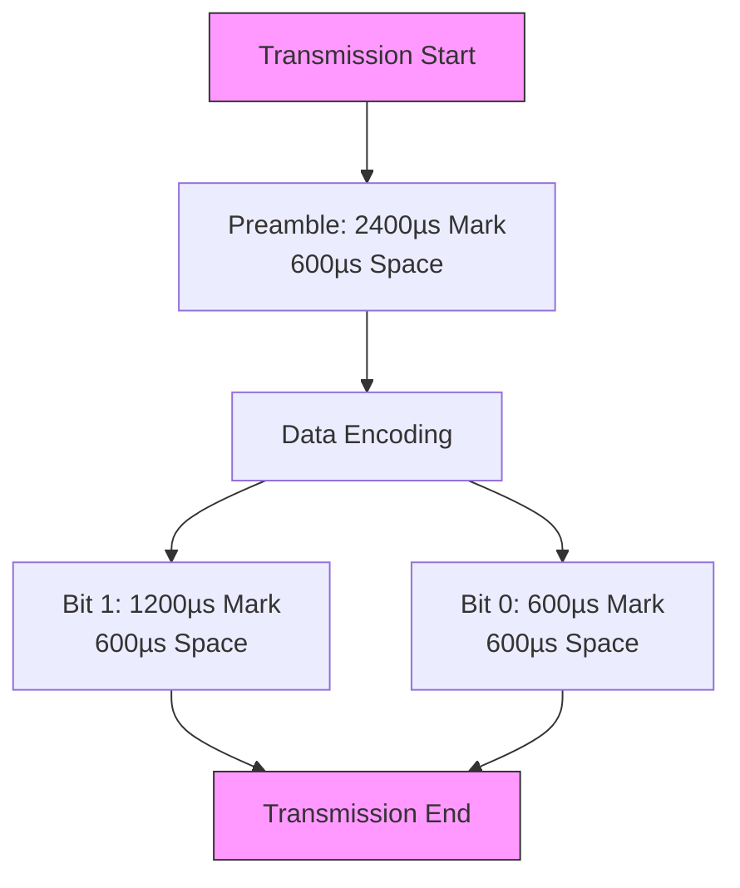
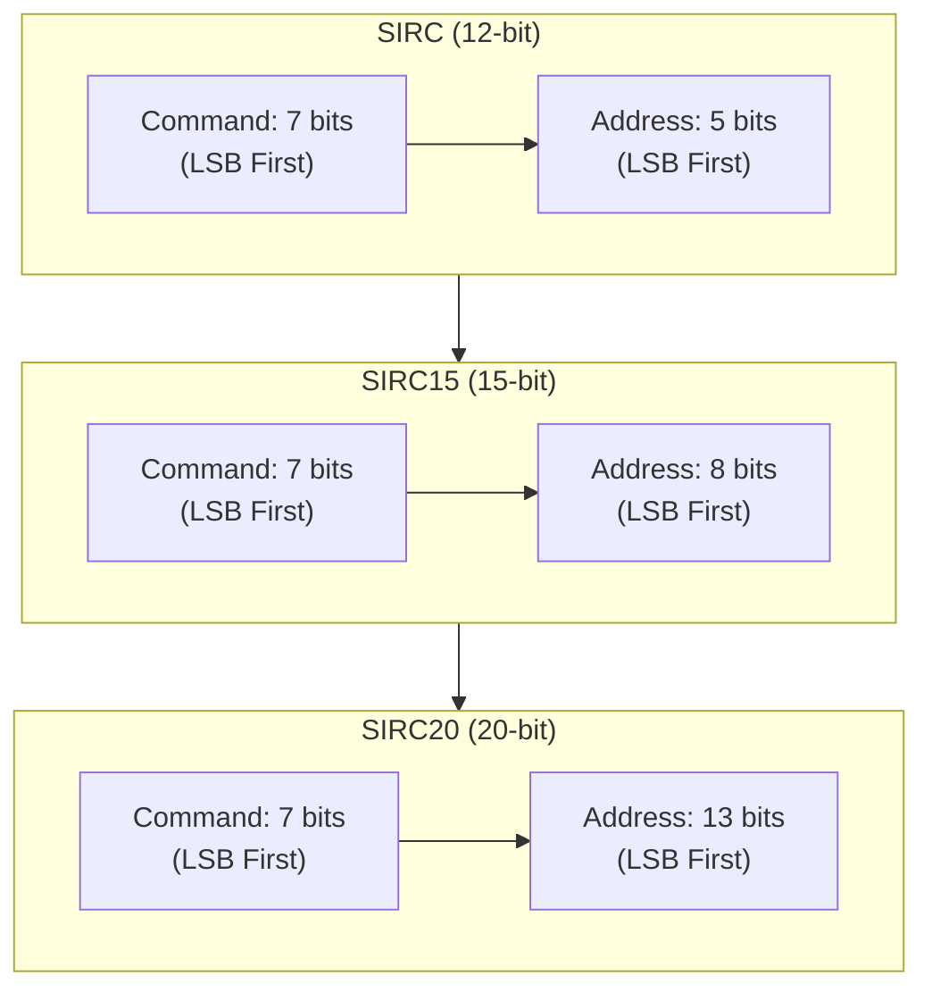
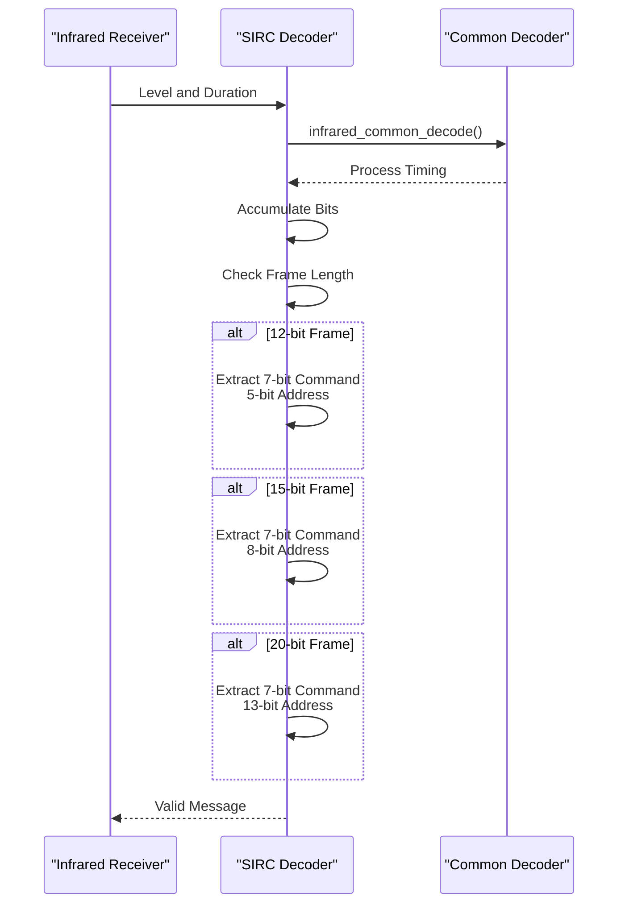
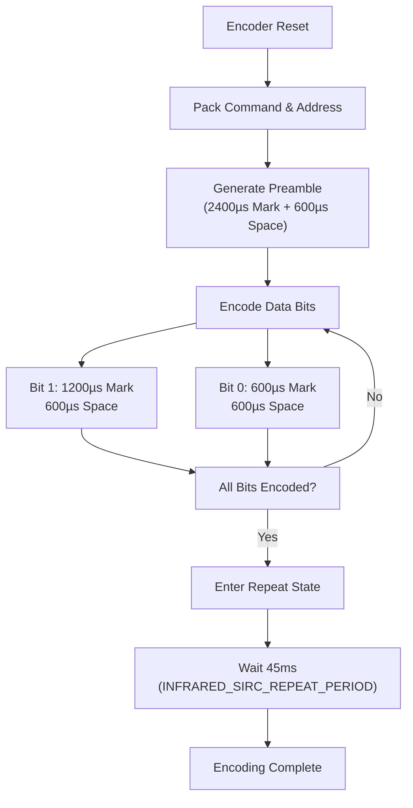

# Sony SIRC Protocol

<cite>
**Referenced Files in This Document**   
- [infrared_protocol_sirc.h](file://lib/infrared/encoder_decoder/sirc/infrared_protocol_sirc.h)
- [infrared_protocol_sirc.c](file://lib/infrared/encoder_decoder/sirc/infrared_protocol_sirc.c)
- [infrared_decoder_sirc.c](file://lib/infrared/encoder_decoder/sirc/infrared_decoder_sirc.c)
- [infrared_encoder_sirc.c](file://lib/infrared/encoder_decoder/sirc/infrared_encoder_sirc.c)
- [infrared_protocol_sirc_i.h](file://lib/infrared/encoder_decoder/sirc/infrared_protocol_sirc_i.h)
- [infrared_common_i.h](file://lib/infrared/encoder_decoder/common/infrared_common_i.h)
</cite>

## Table of Contents
1. [Introduction](#introduction)
2. [Protocol Overview](#protocol-overview)
3. [Timing Specifications](#timing-specifications)
4. [Frame Structure and Variants](#frame-structure-and-variants)
5. [Decoder Implementation](#decoder-implementation)
6. [Encoder Implementation](#encoder-implementation)
7. [Bi-Phase Encoding Characteristics](#bi-phase-encoding-characteristics)
8. [Repeat Code Handling](#repeat-code-handling)
9. [Implementation Examples](#implementation-examples)
10. [Compatibility and Calibration](#compatibility-and-calibration)

## Introduction
The Sony SIRC (Sony Infrared Remote Control) protocol is a pulse width modulation (PWM) based infrared communication standard used extensively in Sony audio/video equipment. This document provides a comprehensive analysis of the SIRC protocol implementation within the Flipper Zero firmware, detailing the technical specifications, encoding/decoding mechanisms, and practical applications for emulating Sony devices. The implementation supports three frame length variants (12, 15, and 20 bits) with a 40kHz carrier frequency, enabling compatibility with a wide range of Sony products from televisions to audio systems.

**Section sources**
- [infrared_protocol_sirc.h](file://lib/infrared/encoder_decoder/sirc/infrared_protocol_sirc.h#L1-L37)

## Protocol Overview
The Sony SIRC protocol employs pulse width modulation for data transmission over infrared light at a 40kHz carrier frequency. The protocol features variable frame lengths of 12, 15, or 20 bits, allowing for different addressing capabilities while maintaining a consistent command field of 7 bits. Each transmission begins with a preamble consisting of a 2.4ms pulse burst followed by a 600µs space, which serves to synchronize the receiver. The data portion uses bi-phase encoding where binary 1 is represented by a 1.2ms pulse followed by a 600µs space, and binary 0 by a 600µs pulse followed by a 600µs space. The protocol does not include dedicated repeat codes, relying instead on the transmission of complete messages for repeated commands.

**Diagram sources**
- [infrared_protocol_sirc.h](file://lib/infrared/encoder_decoder/sirc/infrared_protocol_sirc.h#L1-L37)
- [infrared_protocol_sirc_i.h](file://lib/infrared/encoder_decoder/sirc/infrared_protocol_sirc_i.h#L1-L26)

**Section sources**
- [infrared_protocol_sirc.h](file://lib/infrared/encoder_decoder/sirc/infrared_protocol_sirc.h#L1-L37)

## Timing Specifications
The SIRC protocol implementation in the Flipper Zero firmware adheres to precise timing specifications to ensure compatibility with Sony devices. The carrier frequency is set at 40kHz with a duty cycle of 33%, generating the infrared signal that modulates the data transmission. The preamble consists of a 2.4ms pulse burst (mark) followed by a 600µs space, providing receiver synchronization. For data encoding, binary 1 is transmitted as a 1.2ms pulse followed by a 600µs space, while binary 0 uses a 600µs pulse followed by a 600µs space. The implementation includes tolerance values of ±200µs for the preamble and ±120µs for bit timing to accommodate minor timing variations. After each transmission, a silence period of 10ms is maintained, with a repeat period of 45ms for consecutive messages.

**Section sources**
- [infrared_protocol_sirc_i.h](file://lib/infrared/encoder_decoder/sirc/infrared_protocol_sirc_i.h#L5-L20)

## Frame Structure and Variants
The SIRC protocol supports three distinct frame length variants: SIRC (12-bit), SIRC15 (15-bit), and SIRC20 (20-bit). All variants share a common structure with a 7-bit command field transmitted in LSB (Least Significant Bit) order, followed by an address field of variable length. In the 12-bit variant, the address field is 5 bits, providing 32 possible device addresses. The 15-bit variant extends the address field to 8 bits, allowing 256 addresses, while the 20-bit variant uses a 13-bit address field for 8,192 possible addresses. The data is organized with the command bits in the least significant positions and address bits in the more significant positions. The implementation automatically detects the frame length based on the number of bits received, enabling transparent handling of all three variants.

**Diagram sources**
- [infrared_protocol_sirc.c](file://lib/infrared/encoder_decoder/sirc/infrared_protocol_sirc.c#L1-L63)
- [infrared_decoder_sirc.c](file://lib/infrared/encoder_decoder/sirc/infrared_decoder_sirc.c#L1-L55)

**Section sources**
- [infrared_protocol_sirc.c](file://lib/infrared/encoder_decoder/sirc/infrared_protocol_sirc.c#L1-L63)

## Decoder Implementation
The SIRC decoder implementation is built on a common infrared decoding framework that handles pulse distance width modulation (PDWM). The decoder allocates memory for the protocol-specific data structure and initializes the state machine for receiving infrared signals. During operation, the decoder accumulates bits by analyzing the timing between pulse transitions, using the infrared_common_decode function to process incoming level and duration information. The interpretation function (infrared_decoder_sirc_interpret) validates the received frame by checking the bit count against the three supported lengths (12, 15, or 20 bits) and extracts the command and address fields accordingly. For 12-bit frames, the command is obtained from the lower 7 bits of the data word, while the address is extracted from bits 7-11. The implementation sets the repeat flag to false since the SIRC protocol does not provide a mechanism to distinguish repeat messages from initial transmissions.

**Diagram sources**
- [infrared_decoder_sirc.c](file://lib/infrared/encoder_decoder/sirc/infrared_decoder_sirc.c#L1-L55)
- [infrared_protocol_sirc_i.h](file://lib/infrared/encoder_decoder/sirc/infrared_protocol_sirc_i.h#L1-L26)

**Section sources**
- [infrared_decoder_sirc.c](file://lib/infrared/encoder_decoder/sirc/infrared_decoder_sirc.c#L1-L55)

## Encoder Implementation
The SIRC encoder implementation provides precise timing control for generating compliant infrared signals. The encoder allocates memory for the protocol-specific data structure and initializes the encoding state machine. When resetting the encoder with a message, the implementation packs the command and address fields into a data word based on the specified protocol variant (SIRC, SIRC15, or SIRC20). The command is stored in the lower 7 bits, while the address is shifted to the appropriate position (bits 7-11 for SIRC, bits 7-14 for SIRC15, or bits 7-19 for SIRC20). The encoding process generates the preamble (2.4ms mark, 600µs space) followed by the data bits using pulse distance modulation. After completing a transmission, the encoder enters a repeat state where it generates a 45ms period between consecutive messages, ensuring compatibility with Sony remote control timing requirements.

**Diagram sources**
- [infrared_encoder_sirc.c](file://lib/infrared/encoder_decoder/sirc/infrared_encoder_sirc.c#L1-L68)
- [infrared_protocol_sirc.c](file://lib/infrared/encoder_decoder/sirc/infrared_protocol_sirc.c#L1-L63)

**Section sources**
- [infrared_encoder_sirc.c](file://lib/infrared/encoder_decoder/sirc/infrared_encoder_sirc.c#L1-L68)

## Bi-Phase Encoding Characteristics
The SIRC protocol employs a pulse distance modulation scheme that can be characterized as a form of bi-phase encoding. Unlike traditional bi-phase codes that use transitions within a bit period, SIRC uses different pulse widths to represent binary values. Binary 1 is encoded as a long pulse (1.2ms) followed by a short space (600µs), while binary 0 uses a short pulse (600µs) followed by a short space (600µs). This encoding scheme ensures that each bit period ends with a space of 600µs, providing a consistent timing reference for the receiver. The implementation in the Flipper Zero firmware uses the infrared_common_encode_pdwm and infrared_common_decode_pdwm functions to handle this pulse distance modulation, which compares incoming pulse durations against the defined thresholds to determine the transmitted bit value. The tolerance settings (±120µs for bit timing) accommodate minor variations in timing that may occur due to hardware differences or signal propagation delays.

**Section sources**
- [infrared_protocol_sirc.c](file://lib/infrared/encoder_decoder/sirc/infrared_protocol_sirc.c#L1-L63)
- [infrared_common_i.h](file://lib/infrared/encoder_decoder/common/infrared_common_i.h#L1-L88)

## Repeat Code Handling
The SIRC protocol implementation handles repeat codes differently from many other infrared protocols. According to the specification, there is no dedicated repeat code; instead, Sony remotes transmit the complete message multiple times for repeated commands. The Flipper Zero implementation reflects this design by setting the repeat flag to false in all received messages, as there is no way to distinguish a repeat transmission from an initial one based on the protocol data alone. The encoder implementation, however, provides a repeat mechanism by generating a 45ms period between consecutive transmissions of the same message. This period is defined by the INFRARED_SIRC_REPEAT_PERIOD constant and ensures that repeated commands are spaced appropriately. The minimum repeat count is set to 3, reflecting the typical behavior of Sony remotes which send at least three messages when a button is held down.

**Section sources**
- [infrared_decoder_sirc.c](file://lib/infrared/encoder_decoder/sirc/infrared_decoder_sirc.c#L1-L55)
- [infrared_encoder_sirc.c](file://lib/infrared/encoder_decoder/sirc/infrared_encoder_sirc.c#L1-L68)

## Implementation Examples
The SIRC protocol implementation in the Flipper Zero firmware can be used to emulate various Sony audio/video devices. For example, to control a Sony television, the user would specify the appropriate protocol variant (typically SIRC15 with 8-bit addressing), set the command code for the desired function (such as power, volume, or channel control), and configure the address to match the target device. The Flipper Zero's infrared transmitter generates the 40kHz carrier signal modulated with the SIRC-encoded data, replicating the behavior of an original Sony remote control. When receiving signals, the Flipper Zero can capture and decode SIRC transmissions from existing Sony remotes, allowing users to learn and store commands for later use. The implementation's support for all three frame length variants ensures compatibility with legacy Sony equipment as well as newer models.

**Section sources**
- [infrared_protocol_sirc.h](file://lib/infrared/encoder_decoder/sirc/infrared_protocol_sirc.h#L1-L37)
- [infrared_protocol_sirc.c](file://lib/infrared/encoder_decoder/sirc/infrared_protocol_sirc.c#L1-L63)

## Compatibility and Calibration
The SIRC protocol implementation includes several features to ensure compatibility with various Sony devices and account for timing variations. The tolerance settings for preamble (±200µs) and bit timing (±120µs) allow the decoder to accept signals with minor timing deviations that may occur due to battery levels, temperature changes, or manufacturing differences in remote controls. The implementation automatically detects the frame length based on the number of bits received, providing seamless support for SIRC, SIRC15, and SIRC20 variants without requiring user configuration. For optimal performance, users may need to calibrate the infrared receiver sensitivity and transmitter power based on their specific use case and environmental conditions. The absence of repeat codes in the standard SIRC protocol means that applications requiring repeat functionality must implement their own timing logic, typically by retransmitting the complete message at 45ms intervals as specified by the INFRARED_SIRC_REPEAT_PERIOD constant.

**Section sources**
- [infrared_protocol_sirc_i.h](file://lib/infrared/encoder_decoder/sirc/infrared_protocol_sirc_i.h#L1-L26)
- [infrared_protocol_sirc.c](file://lib/infrared/encoder_decoder/sirc/infrared_protocol_sirc.c#L1-L63)