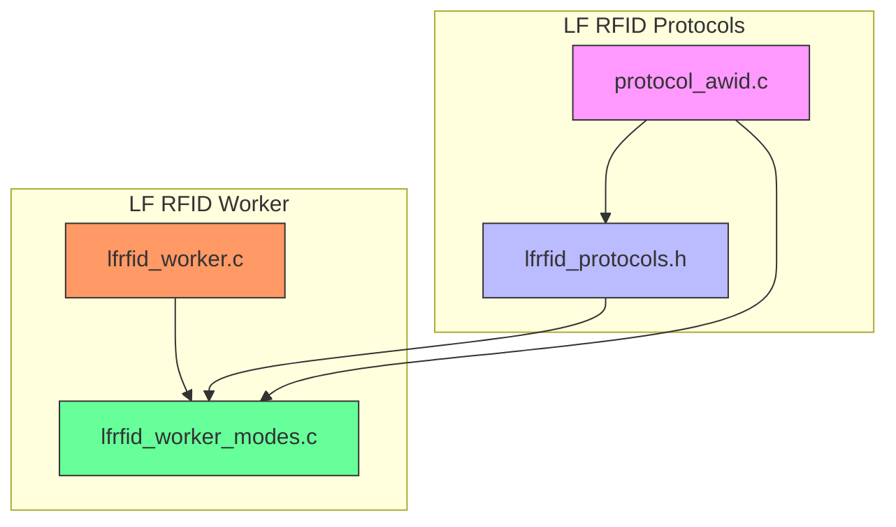
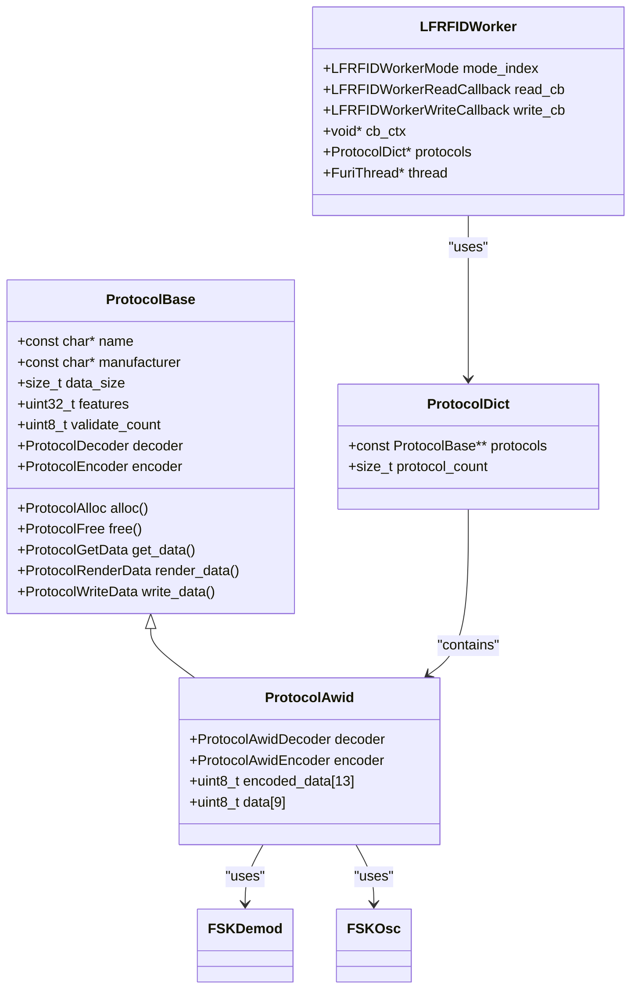
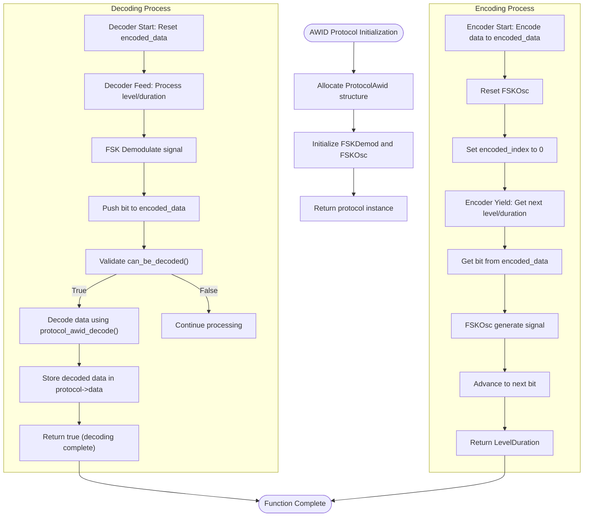
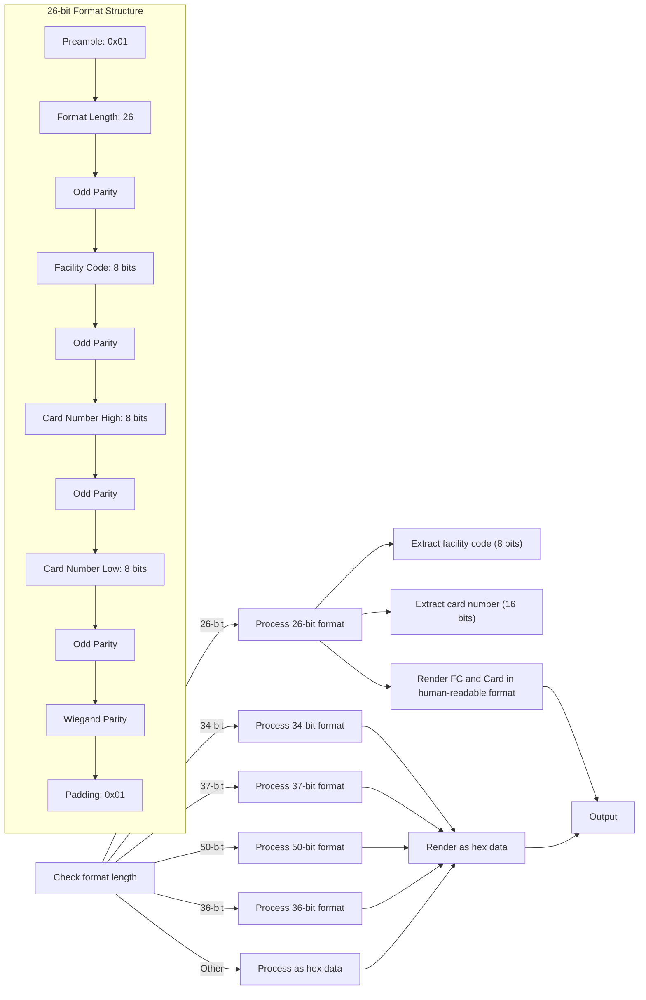
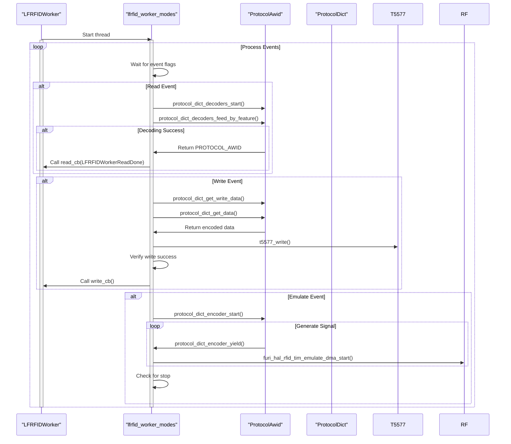
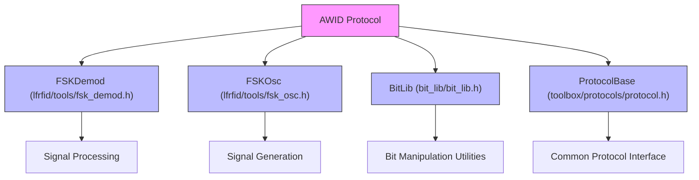

# AWID Protocol

<cite>
**Referenced Files in This Document**   
- [protocol_awid.h](file://lib/lfrfid/protocols/protocol_awid.h)
- [protocol_awid.c](file://lib/lfrfid/protocols/protocol_awid.c)
- [lfrfid_protocols.h](file://lib/lfrfid/protocols/lfrfid_protocols.h)
- [lfrfid_worker.c](file://lib/lfrfid/lfrfid_worker.c)
- [lfrfid_worker_modes.c](file://lib/lfrfid/lfrfid_worker_modes.c)
</cite>

## Table of Contents
1. [Introduction](#introduction)
2. [Project Structure](#project-structure)
3. [Core Components](#core-components)
4. [Architecture Overview](#architecture-overview)
5. [Detailed Component Analysis](#detailed-component-analysis)
6. [Dependency Analysis](#dependency-analysis)
7. [Performance Considerations](#performance-considerations)
8. [Troubleshooting Guide](#troubleshooting-guide)
9. [Conclusion](#conclusion)

## Introduction
The AWID (American Wide Identification) protocol is a proprietary low-frequency RFID protocol used in access control systems. This document provides a comprehensive analysis of the AWID protocol implementation in the Flipper Zero firmware, covering its data structure, encoding scheme, and integration with the device's RFID subsystem. The implementation supports multiple AWID format types including 26-bit, 34-bit, 37-bit, and others, using FSK modulation for data transmission.

## Project Structure
The AWID protocol implementation is organized within the Flipper Zero firmware's low-frequency RFID (LF RFID) subsystem. The code is structured in a modular fashion with clear separation between protocol-specific logic and the general RFID worker framework.

**Diagram sources**
- [protocol_awid.c](file://lib/lfrfid/protocols/protocol_awid.c)
- [lfrfid_protocols.h](file://lib/lfrfid/protocols/lfrfid_protocols.h)
- [lfrfid_worker.c](file://lib/lfrfid/lfrfid_worker.c)
- [lfrfid_worker_modes.c](file://lib/lfrfid/lfrfid_worker_modes.c)

**Section sources**
- [protocol_awid.c](file://lib/lfrfid/protocols/protocol_awid.c)
- [lfrfid_protocols.h](file://lib/lfrfid/protocols/lfrfid_protocols.h)

## Core Components
The AWID protocol implementation consists of several key components that work together to handle reading, decoding, encoding, and emulation of AWID RFID tags. The core functionality is implemented in the `protocol_awid.c` file, which defines the protocol structure, decoder, and encoder logic.

The implementation uses FSK (Frequency Shift Keying) modulation with specific timing parameters for data transmission. The protocol supports multiple format types with different bit lengths, including 26-bit, 34-bit, 37-bit, and others. Each format type has specific data structure characteristics for facility code and card number representation.

**Section sources**
- [protocol_awid.c](file://lib/lfrfid/protocols/protocol_awid.c)
- [protocol_awid.h](file://lib/lfrfid/protocols/protocol_awid.h)

## Architecture Overview
The AWID protocol is integrated into the Flipper Zero's LF RFID subsystem through a well-defined architecture that separates protocol-specific logic from the general RFID worker framework. The architecture follows a modular design pattern where each RFID protocol is implemented as a self-contained module that conforms to a common protocol interface.

**Diagram sources**
- [protocol_awid.c](file://lib/lfrfid/protocols/protocol_awid.c)
- [lfrfid_worker.c](file://lib/lfrfid/lfrfid_worker.c)
- [lfrfid_protocols.h](file://lib/lfrfid/protocols/lfrfid_protocols.h)

## Detailed Component Analysis

### AWID Protocol Implementation
The AWID protocol implementation provides comprehensive support for reading, decoding, and emulating AWID RFID tags. The implementation handles the proprietary encoding scheme used by AWID access control systems, including data structure, bit encoding, and transmission format.

#### Data Structure and Encoding
The AWID protocol uses a 96-bit encoded format with specific structure and error checking mechanisms. The data structure includes preamble, format length, facility code, card number, and parity bits. The implementation supports multiple format types with different bit lengths.

**Diagram sources**
- [protocol_awid.c](file://lib/lfrfid/protocols/protocol_awid.c#L50-L266)

**Section sources**
- [protocol_awid.c](file://lib/lfrfid/protocols/protocol_awid.c#L50-L266)

#### Protocol Features and Constants
The AWID protocol implementation defines several constants and features that characterize its behavior:

- **JITTER_TIME**: 20 - Tolerance for timing variations
- **MIN_TIME**: 64 - Minimum time unit for FSK demodulation
- **MAX_TIME**: 80 - Maximum time unit for FSK demodulation
- **AWID_DECODED_DATA_SIZE**: 9 bytes - Size of decoded data
- **AWID_ENCODED_BIT_SIZE**: 96 bits - Size of encoded data
- **AWID_ENCODED_DATA_SIZE**: 13 bytes - Size of encoded data buffer

The protocol uses FSK modulation with specific timing parameters to ensure reliable data transmission and reception. The implementation includes error checking through odd parity bits and preamble validation.

### AWID Format Types
The AWID protocol implementation supports multiple format types with different bit lengths:

- **26-bit format**: Standard format with 8-bit facility code and 16-bit card number
- **34-bit format**: Extended format with additional data bits
- **37-bit format**: Extended format with additional data bits
- **50-bit format**: Extended format with additional data bits
- **36-bit format**: Extended format with additional data bits

Each format type shares the same basic structure but differs in the number of data bits and their organization. The implementation validates the format length and processes the data accordingly.

**Diagram sources**
- [protocol_awid.c](file://lib/lfrfid/protocols/protocol_awid.c#L100-L150)

**Section sources**
- [protocol_awid.c](file://lib/lfrfid/protocols/protocol_awid.c#L100-L150)

### Integration with LF RFID Worker
The AWID protocol is integrated into the Flipper Zero's LF RFID worker system, which manages the reading, writing, and emulation of RFID tags. The integration follows a plugin architecture where each protocol is registered with the worker system.

**Diagram sources**
- [lfrfid_worker.c](file://lib/lfrfid/lfrfid_worker.c)
- [lfrfid_worker_modes.c](file://lib/lfrfid/lfrfid_worker_modes.c)
- [protocol_awid.c](file://lib/lfrfid/protocols/protocol_awid.c)

**Section sources**
- [lfrfid_worker.c](file://lib/lfrfid/lfrfid_worker.c)
- [lfrfid_worker_modes.c](file://lib/lfrfid/lfrfid_worker_modes.c)

## Dependency Analysis
The AWID protocol implementation has several dependencies on other components within the Flipper Zero firmware. These dependencies enable the protocol to function within the broader RFID subsystem.

**Diagram sources**
- [protocol_awid.c](file://lib/lfrfid/protocols/protocol_awid.c#L1-L10)
- [protocol_awid.h](file://lib/lfrfid/protocols/protocol_awid.h)

**Section sources**
- [protocol_awid.c](file://lib/lfrfid/protocols/protocol_awid.c#L1-L10)

## Performance Considerations
The AWID protocol implementation is designed with performance in mind, particularly for real-time signal processing. The use of efficient bit manipulation functions and optimized FSK demodulation/oscillation algorithms ensures reliable operation within the constraints of the Flipper Zero's hardware.

Key performance considerations include:
- Efficient bit manipulation using the BitLib library
- Optimized FSK demodulation with jitter tolerance
- Minimal memory allocation during signal processing
- Efficient data encoding and decoding algorithms
- Proper timing for signal generation and reception

The implementation uses a streaming approach to process RFID signals, allowing it to handle continuous data without excessive memory usage. The use of DMA (Direct Memory Access) for signal generation further improves performance by offloading work from the CPU.

## Troubleshooting Guide
When working with the AWID protocol implementation, several common issues may arise. This section provides guidance on troubleshooting these issues.

**Section sources**
- [protocol_awid.c](file://lib/lfrfid/protocols/protocol_awid.c)
- [lfrfid_worker_modes.c](file://lib/lfrfid/lfrfid_worker_modes.c)

### Common Issues and Solutions
1. **Signal Not Detected**
   - Ensure proper coil alignment with the reader
   - Check that the signal strength is sufficient
   - Verify that the correct protocol type is selected
   - Confirm that the timing parameters are appropriate for the specific AWID format

2. **Decoding Failures**
   - Check for interference from other electronic devices
   - Verify that the preamble and spacing are correct
   - Ensure that the odd parity bits are properly validated
   - Confirm that the format length is supported

3. **Emulation Issues**
   - Verify that the FSK modulation parameters are correct
   - Check that the DMA buffer is properly configured
   - Ensure that the signal timing is within acceptable tolerances
   - Confirm that the encoded data matches the expected format

4. **Writing Failures**
   - Verify that the target tag (T5577) is present and functional
   - Check that the write mask and block configuration are correct
   - Ensure that the password protection is properly handled
   - Confirm that the verification read succeeds after writing

## Conclusion
The AWID protocol implementation in the Flipper Zero firmware provides comprehensive support for reading, decoding, and emulating AWID RFID tags. The implementation follows a modular architecture that integrates seamlessly with the device's LF RFID subsystem. By supporting multiple format types and providing robust error checking, the implementation enables reliable interaction with AWID-based access control systems. The use of efficient algorithms and proper hardware integration ensures optimal performance for both reading and emulation tasks.