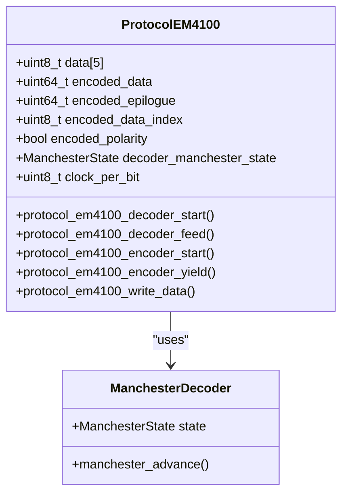
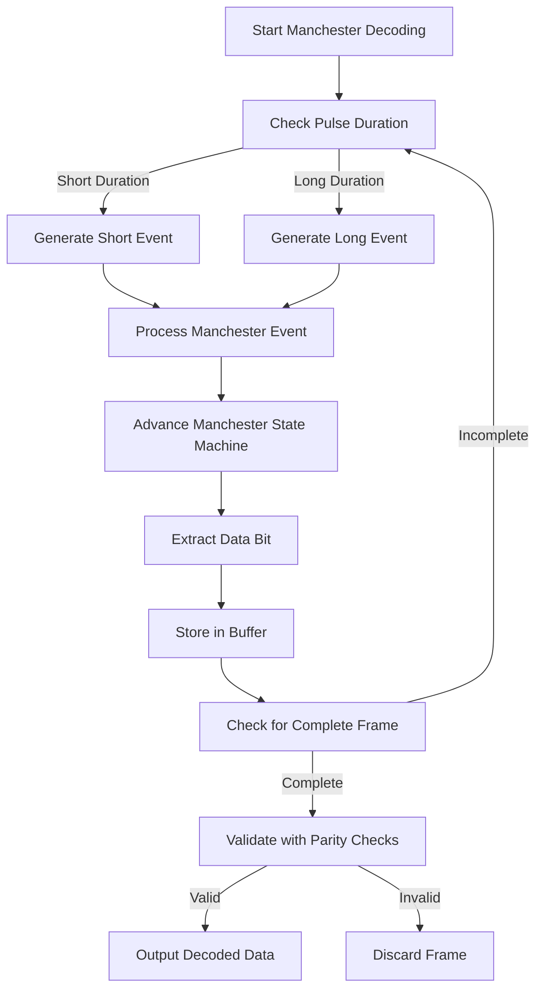
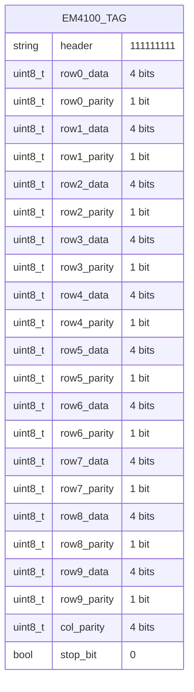
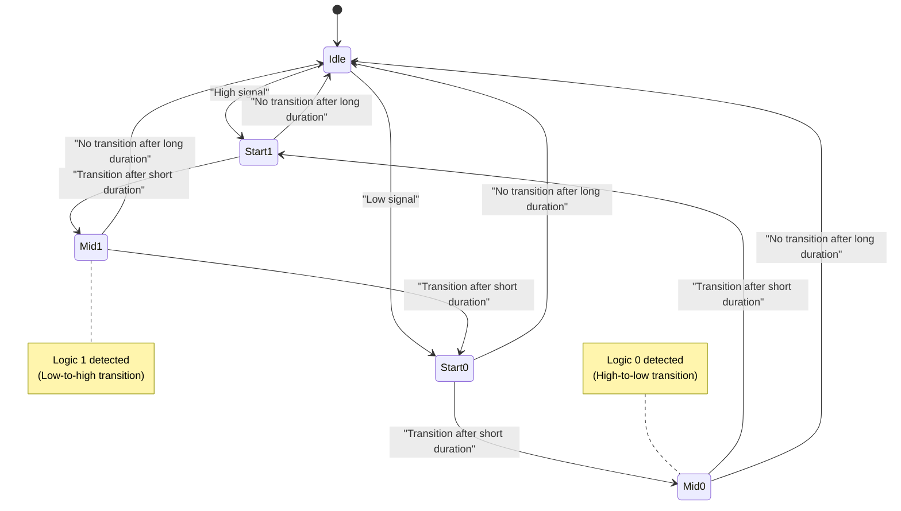
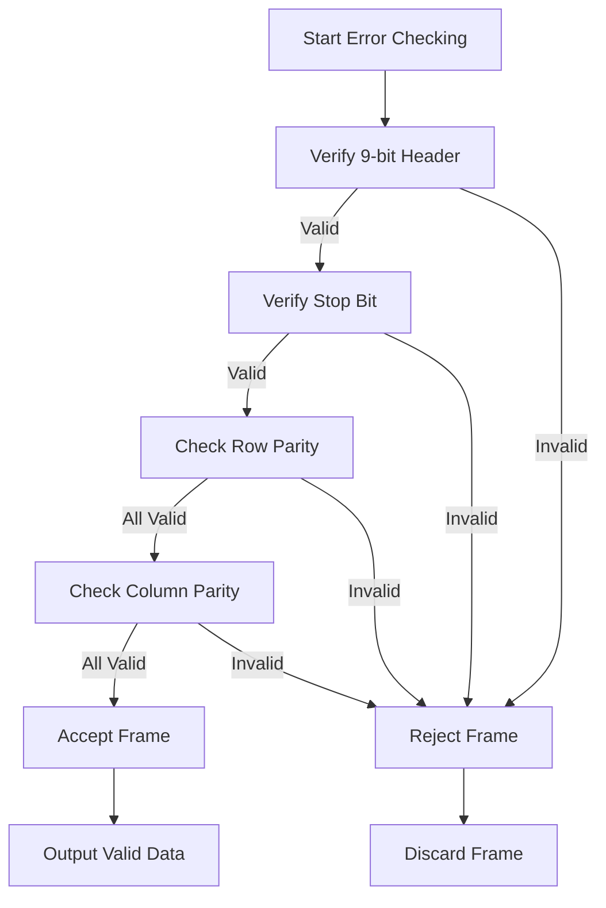
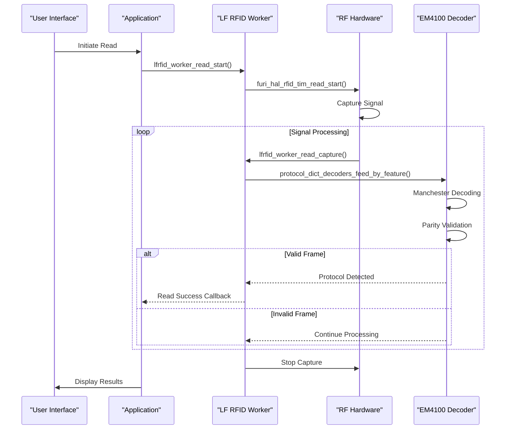
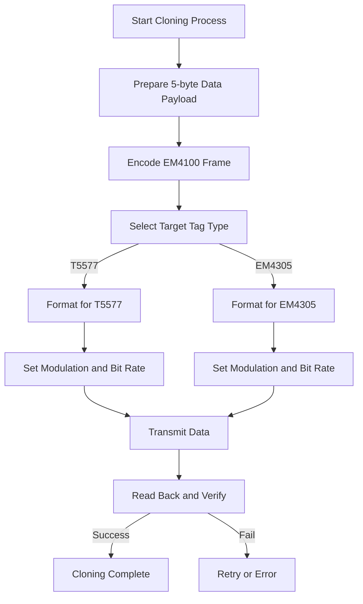
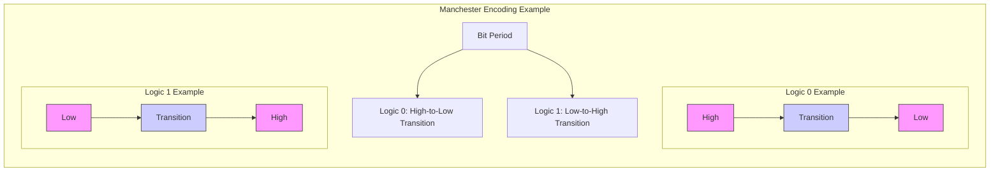
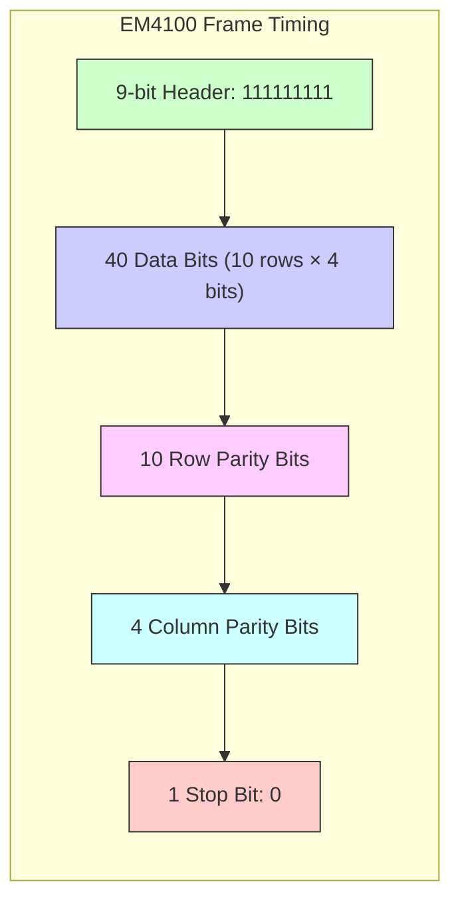

# EM4100 Protocol

<cite>
**Referenced Files in This Document**   
- [protocol_em4100.c](file://lib/lfrfid/protocols/protocol_em4100.c)
- [manchester_decoder.h](file://lib/toolbox/manchester_decoder.h)
- [lfrfid_worker.h](file://lib/lfrfid/lfrfid_worker.h)
- [lfrfid_worker.c](file://lib/lfrfid/lfrfid_worker.c)
- [lfrfid_worker_modes.c](file://lib/lfrfid/lfrfid_worker_modes.c)
- [lfrfid_protocols.h](file://lib/lfrfid/lfrfid_protocols.h)
</cite>

## Table of Contents
1. [Introduction](#introduction)
2. [EM4100 Protocol Overview](#em4100-protocol-overview)
3. [Manchester Encoding Scheme](#manchester-encoding-scheme)
4. [64-Bit Data Structure](#64-bit-data-structure)
5. [Signal Demodulation and Decoding](#signal-demodulation-and-decoding)
6. [Error Checking Mechanisms](#error-checking-mechanisms)
7. [Tag Reading Process](#tag-reading-process)
8. [Tag Cloning Process](#tag-cloning-process)
9. [Flipper Zero Emulation](#flipper-zero-emulation)
10. [Practical Examples](#practical-examples)
11. [Timing Diagrams](#timing-diagrams)

## Introduction
The EM4100 protocol is a widely used low-frequency (LF) RFID standard operating at 125 kHz, commonly found in access control systems. This document provides a comprehensive analysis of the EM4100 implementation in the Flipper Zero firmware, detailing the Manchester encoding scheme, 64-bit data structure, signal processing, and emulation capabilities. The documentation covers both theoretical aspects of the protocol and practical implementation details from the codebase, enabling users to understand and work with EM4100-based access cards effectively.

## EM4100 Protocol Overview

The EM4100 protocol implementation in the Flipper Zero firmware provides complete functionality for reading, writing, and emulating EM4100 RFID tags. The protocol operates at a 125 kHz carrier frequency and uses Manchester encoding for data transmission. The implementation supports multiple clock rates (64, 32, and 16) to accommodate variations in tag timing.

The protocol is defined in the `protocol_em4100.c` file and implements the standard EM4100 data format with a 64-bit structure consisting of a 9-bit header, 40 data bits, 4 column parity bits, and 1 stop bit. The implementation includes robust error checking through row and column parity verification to ensure data integrity during reading operations.



**Diagram sources**
- [protocol_em4100.c](file://lib/lfrfid/protocols/protocol_em4100.c#L20-L199)

**Section sources**
- [protocol_em4100.c](file://lib/lfrfid/protocols/protocol_em4100.c#L0-L456)

## Manchester Encoding Scheme

The EM4100 protocol uses Manchester encoding, a synchronous clock encoding technique that combines clock and data on a single channel. In Manchester encoding, each bit period is divided into two halves, with a transition at the midpoint. A logic 0 is represented by a high-to-low transition, while a logic 1 is represented by a low-to-high transition.

The Flipper Zero implementation handles Manchester decoding through the `manchester_decoder.h` library, which processes the incoming signal transitions. The decoder distinguishes between short and long time periods to accurately reconstruct the original data stream. The implementation supports three different clock rates (64, 32, and 16) which affect the timing thresholds for short and long pulses.



**Diagram sources**
- [manchester_decoder.h](file://lib/toolbox/manchester_decoder.h#L0-L31)
- [protocol_em4100.c](file://lib/lfrfid/protocols/protocol_em4100.c#L100-L150)

**Section sources**
- [manchester_decoder.h](file://lib/toolbox/manchester_decoder.h#L0-L31)
- [protocol_em4100.c](file://lib/lfrfid/protocols/protocol_em4100.c#L100-L150)

## 64-Bit Data Structure

The EM4100 tag uses a 64-bit data structure organized in a 10-row by 5-column matrix. The structure consists of several key components:

- **9-bit Header (111111111)**: Located at the beginning of the transmission, this fixed pattern identifies the tag as an EM4100 protocol device.
- **40 Data Bits**: Organized as 10 rows of 4 data bits each, containing the actual card information including facility code and card number.
- **4 Column Parity Bits**: One parity bit for each of the 4 data columns, calculated across all 10 rows.
- **10 Row Parity Bits**: One parity bit for each row, calculated across the 4 data bits in that row.
- **1 Stop Bit (0)**: Marks the end of the transmission.

The data is typically interpreted as 5 bytes (40 bits), with common formats including:
- **Facility Code**: 8-12 bits identifying the organization or system
- **Card Number**: 16-24 bits uniquely identifying the card
- **Version/Type**: Additional bits for card type or version information



**Diagram sources**
- [protocol_em4100.c](file://lib/lfrfid/protocols/protocol_em4100.c#L25-L50)

**Section sources**
- [protocol_em4100.c](file://lib/lfrfid/protocols/protocol_em4100.c#L25-L50)

## Signal Demodulation and Decoding

The signal demodulation process in the Flipper Zero firmware involves several stages to convert the analog RF signal into digital data. The process begins with the RF front-end circuitry detecting the 125 kHz carrier signal and converting it to a digital pulse train that represents the Manchester-encoded data.

The decoding process is implemented in the `protocol_em4100_decoder_feed` function, which analyzes the duration of high and low signal levels to determine Manchester events. The implementation uses timing thresholds to distinguish between short and long pulses, with configurable jitter tolerance to handle signal variations.

Key parameters for signal demodulation:
- **Short Time Base**: 256 units (adjustable based on clock rate)
- **Long Time Base**: 512 units (adjustable based on clock rate)
- **Jitter Time Base**: 100 units (tolerance for timing variations)
- **Clock Per Bit**: Configurable (64, 32, or 16) affecting timing sensitivity

The decoder uses a state machine approach to process the incoming signal, advancing through Manchester states (Start1, Mid1, Mid0, Start0) as it encounters signal transitions. When a complete data bit is detected, it is shifted into the accumulating data buffer.



**Diagram sources**
- [manchester_decoder.h](file://lib/toolbox/manchester_decoder.h#L10-L25)
- [protocol_em4100.c](file://lib/lfrfid/protocols/protocol_em4100.c#L150-L200)

**Section sources**
- [manchester_decoder.h](file://lib/toolbox/manchester_decoder.h#L10-L25)
- [protocol_em4100.c](file://lib/lfrfid/protocols/protocol_em4100.c#L150-L200)

## Error Checking Mechanisms

The EM4100 protocol implements robust error checking through a dual-parity system that verifies data integrity at both row and column levels. The Flipper Zero firmware performs comprehensive validation of received data to ensure accuracy and prevent false readings.

**Row Parity Checking**: Each of the 10 data rows includes a parity bit that ensures an even number of 1s in the 5-bit row (4 data bits + 1 parity bit). The implementation verifies this by counting the number of set bits in each row and confirming the sum is even.

**Column Parity Checking**: The 4 column parity bits are calculated across all 10 rows for each data column. Each column parity bit ensures an even number of 1s in its respective column across all rows.

The validation process in the `em4100_can_be_decoded` function performs the following checks:
1. Verifies the 9-bit header pattern (111111111)
2. Confirms the stop bit is 0
3. Validates all 10 row parity bits
4. Validates all 4 column parity bits

Additionally, the implementation includes protection against false positives by checking the epilogue header to prevent conflicts with other protocols like Electra.



**Diagram sources**
- [protocol_em4100.c](file://lib/lfrfid/protocols/protocol_em4100.c#L200-L250)

**Section sources**
- [protocol_em4100.c](file://lib/lfrfid/protocols/protocol_em4100.c#L200-L250)

## Tag Reading Process

The tag reading process in the Flipper Zero firmware is managed by the LF RFID worker thread, which coordinates the hardware interface and protocol processing. The process begins when the user initiates a read operation through the application interface.

The reading workflow involves:
1. **Hardware Initialization**: Configuring the RF front-end for 125 kHz operation with appropriate modulation settings (ASK for EM4100)
2. **Signal Capture**: Using timer-based capture to record the duration of high and low signal levels
3. **Data Processing**: Feeding the captured pulse durations to the Manchester decoder
4. **Protocol Detection**: Attempting to decode the signal using the EM4100 protocol handler
5. **Validation**: Performing parity checks and frame validation
6. **Result Reporting**: Notifying the application of successful reads or errors

The implementation supports multiple read modes (ASK, PSK, RTF) and automatically switches between them in auto-detect mode. For EM4100, ASK (Amplitude Shift Keying) modulation is used, where the presence or absence of the carrier wave represents data bits.



**Diagram sources**
- [lfrfid_worker.c](file://lib/lfrfid/lfrfid_worker.c#L100-L150)
- [lfrfid_worker_modes.c](file://lib/lfrfid/lfrfid_worker_modes.c#L200-L300)

**Section sources**
- [lfrfid_worker.c](file://lib/lfrfid/lfrfid_worker.c#L100-L150)
- [lfrfid_worker_modes.c](file://lib/lfrfid/lfrfid_worker_modes.c#L200-L300)

## Tag Cloning Process

The tag cloning process allows the Flipper Zero to write EM4100 data to compatible writable tags such as T5577 or EM4305 chips. The process involves encoding the desired data in the EM4100 format and transmitting it to the target tag.

The cloning workflow consists of:
1. **Data Preparation**: Formatting the 5-byte data payload according to the EM4100 structure
2. **Encoding**: Generating the complete 64-bit frame with header, data, parity bits, and stop bit
3. **Transmission**: Using the RF transmitter to send the encoded data to the target tag
4. **Verification**: Reading back the tag to confirm successful writing

The implementation in `protocol_em4100_write_data` handles the conversion of EM4100 data to the appropriate format for different writable tags. For T5577 tags, the data is written across multiple blocks with appropriate configuration settings. For EM4305 tags, the data is formatted according to the EM4x05 protocol specifications.

Key configuration parameters for cloning:
- **Modulation**: Manchester encoding
- **Bit Rate**: Configurable (RF/64, RF/32, or RF/16)
- **Data Blocks**: 3 blocks for T5577, 3 words for EM4305
- **Password Protection**: Optional for T5577 with pass mode



**Diagram sources**
- [protocol_em4100.c](file://lib/lfrfid/protocols/protocol_em4100.c#L350-L400)
- [lfrfid_worker_modes.c](file://lib/lfrfid/lfrfid_worker_modes.c#L600-L650)

**Section sources**
- [protocol_em4100.c](file://lib/lfrfid/protocols/protocol_em4100.c#L350-L400)
- [lfrfid_worker_modes.c](file://lib/lfrfid/lfrfid_worker_modes.c#L600-L650)

## Flipper Zero Emulation

The Flipper Zero can emulate EM4100 tags using its RF transmitter circuitry, allowing it to function as a virtual access card. The emulation process generates the same signal pattern that a genuine EM4100 tag would produce when energized by a reader.

The emulation implementation uses DMA (Direct Memory Access) to precisely control the timing of the RF signal, ensuring accurate Manchester encoding. The process involves:
1. **Buffer Preparation**: Pre-generating the pulse and duration arrays for the EM4100 data pattern
2. **DMA Configuration**: Setting up the timer and DMA controller to output the signal
3. **Continuous Transmission**: Repeating the data pattern in a loop while emulation is active
4. **Real-time Updates**: Dynamically updating the buffer during transmission using double-buffering

The `lfrfid_worker_emulate_ttf` function implements the tag-talks-first (TTF) emulation mode, where the Flipper Zero transmits its data when powered by the reader's electromagnetic field. The implementation uses a circular buffer approach with interrupt-driven updates to maintain continuous transmission without gaps.

```mermaid
sequenceDiagram
participant User as "User Interface"
participant App as "Application"
participant Worker as "LF RFID Worker"
participant Emulator as "EM4100 Emulator"
participant Hardware as "RF Hardware"
User->>App : Start Emulation
App->>Worker : lfrfid_worker_emulate_start()
Worker->>Emulator : lfrfid_worker_emulate_ttf()
Emulator->>Emulator : Initialize PulseGlue
Emulator->>Emulator : Generate Initial Buffer
Emulator->>Hardware : furi_hal_rfid_tim_emulate_dma_start()
Hardware->>Hardware : Begin DMA Transmission
loop Continuous Emulation
Hardware->>Emulator : DMA Half/Complete Interrupt
Emulator->>Emulator : Update Buffer with New Data
Emulator->>Hardware : Continue Transmission
alt Stop Requested
User->>App : Stop Emulation
App->>Worker : lfrfid_worker_stop()
Worker->>Hardware : Stop DMA
break
end
end
```

**Diagram sources**
- [lfrfid_worker.c](file://lib/lfrfid/lfrfid_worker.c#L200-L250)
- [lfrfid_worker_modes.c](file://lib/lfrfid/lfrfid_worker_modes.c#L400-L450)

**Section sources**
- [lfrfid_worker.c](file://lib/lfrfid/lfrfid_worker.c#L200-L250)
- [lfrfid_worker_modes.c](file://lib/lfrfid/lfrfid_worker_modes.c#L400-L450)

## Practical Examples

### Reading an EM4100 Access Card
To read an EM4100-based access card using the Flipper Zero:

1. Navigate to the LF RFID application
2. Select "Read" mode
3. Hold the access card near the Flipper Zero's antenna
4. The device will automatically detect the EM4100 protocol and display the decoded data

The decoded information typically includes:
- **Facility Code (FC)**: Organization identifier (e.g., FC: 123)
- **Card Number**: Unique card identifier (e.g., Card: 00456)
- **Decimal Representations**: Alternative formats for compatibility

```c
// Example of reading callback implementation
void read_callback(LFRFIDWorkerReadResult result, ProtocolId protocol, void* context) {
    if(result == LFRFIDWorkerReadDone && protocol == LFRFIDProtocolEM4100) {
        // Extract and display data
        uint8_t* data = protocol_em4100_get_data(protocol_instance);
        uint16_t card_number = (data[3] << 8) | data[4];
        uint8_t facility_code = data[2];
        
        printf("EM4100 Card Read\n");
        printf("FC: %03u Card: %05u\n", facility_code, card_number);
    }
}
```

### Cloning to a T5577 Tag
To clone an EM4100 card to a T5577 writable tag:

1. First read the original EM4100 card to capture its data
2. Select "Write" mode in the LF RFID application
3. Choose "T5577" as the target tag type
4. The Flipper Zero will automatically format the EM4100 data for the T5577 chip and transmit it
5. Verification reading confirms successful cloning

The process uses the `protocol_em4100_write_data` function to convert EM4100 data to T5577 format:
```c
// Configuration for T5577 writing
request->t5577.block[0] = (LFRFID_T5577_MODULATION_MANCHESTER | 
                          LFRFID_T5577_BITRATE_RF_64 | 
                          (2 << LFRFID_T5577_MAXBLOCK_SHIFT));
request->t5577.block[1] = em4100_data >> 32;
request->t5577.block[2] = em4100_data;
request->t5577.blocks_to_write = 3;
```

### EM4100 Emulation Configuration
To configure EM4100 emulation with custom data:

1. Enter the LF RFID application
2. Select "Emulate" mode
3. Choose "EM4100" protocol
4. Input the 5-byte data payload (facility code and card number)
5. Start emulation

The emulation uses precise timing to replicate the Manchester-encoded signal:
```c
// Key timing parameters
#define EM_READ_SHORT_TIME_BASE  (256)
#define EM_READ_LONG_TIME_BASE   (512)
#define EM_READ_JITTER_TIME_BASE (100)

// Clock rate configuration
protocol->clock_per_bit = 64; // RF/64, RF/32, or RF/16
```

**Section sources**
- [protocol_em4100.c](file://lib/lfrfid/protocols/protocol_em4100.c#L300-L350)
- [lfrfid_worker_modes.c](file://lib/lfrfid/lfrfid_worker_modes.c#L650-L700)

## Timing Diagrams

### Manchester Encoding Waveform
The following diagram illustrates the Manchester encoding pattern for an EM4100 data sequence:



### EM4100 Data Frame Structure
The complete EM4100 data frame timing:



### Signal Demodulation Timing
Timing thresholds for signal demodulation:

```mermaid
flowchart LR
subgraph "Timing Thresholds"
direction TB
ShortLow["Short Low: 156-356 units"] --> ShortHigh["Short High: 156-356 units"]
LongLow["Long Low: 412-612 units"] --> LongHigh["Long High: 412-612 units"]
style ShortLow fill:#cfc,stroke:#333
style ShortHigh fill:#cfc,stroke:#333
style LongLow fill:#fcc,stroke:#333
style LongHigh fill:#fcc,stroke:#333
note right of ShortLow
Clock/2 ± Jitter
(RF/64: 128±100)
end note
note right of LongLow
Clock ± Jitter
(RF/64: 256±100)
end note
end
```

**Diagram sources**
- [protocol_em4100.c](file://lib/lfrfid/protocols/protocol_em4100.c#L75-L100)
- [manchester_decoder.h](file://lib/toolbox/manchester_decoder.h#L0-L31)

**Section sources**
- [protocol_em4100.c](file://lib/lfrfid/protocols/protocol_em4100.c#L75-L100)
- [manchester_decoder.h](file://lib/toolbox/manchester_decoder.h#L0-L31)