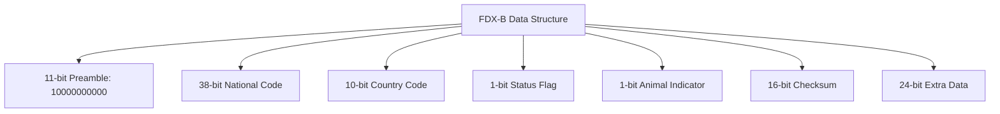
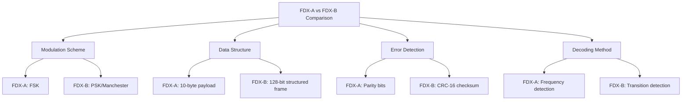
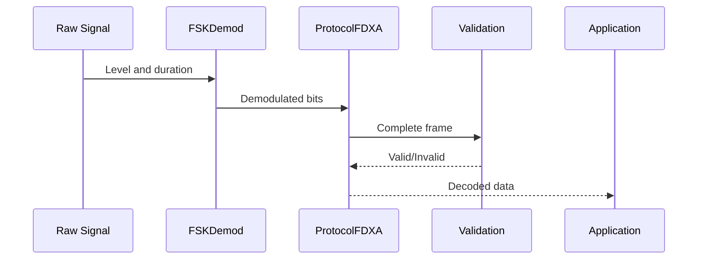
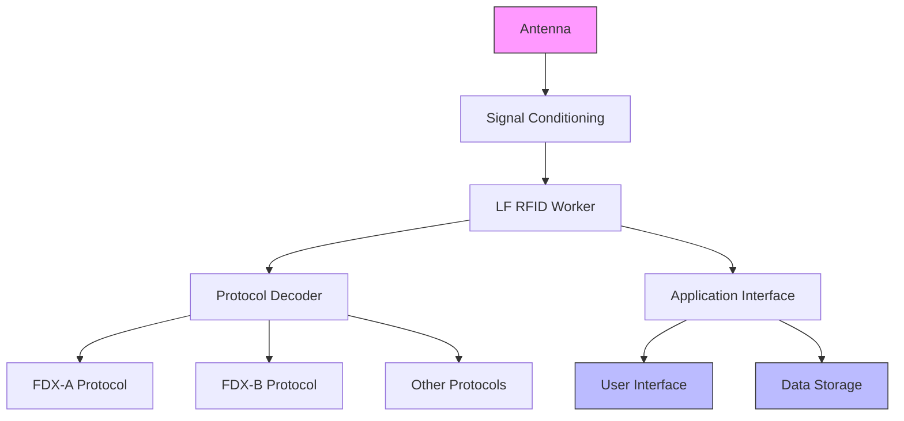
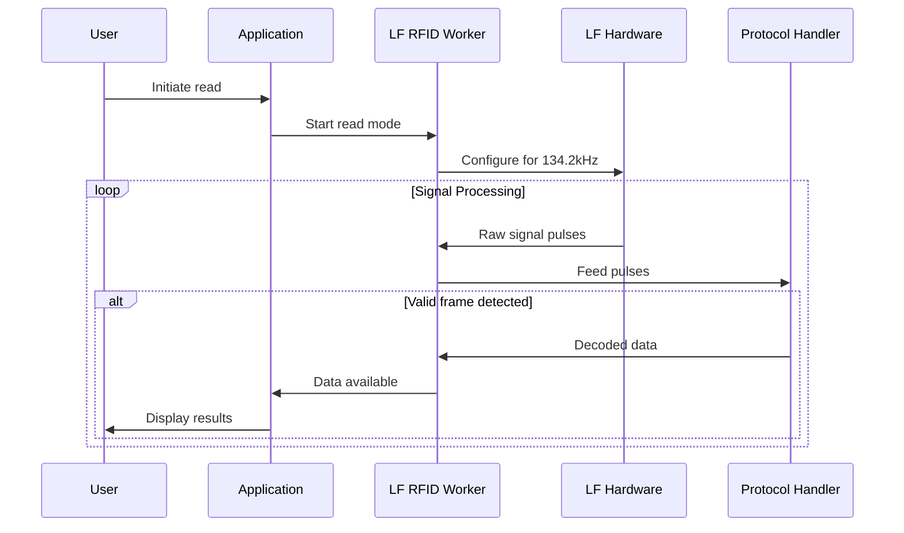

# FDX-A/B Protocols

<cite>
**Referenced Files in This Document**   
- [protocol_fdx_a.c](file://lib/lfrfid/protocols/protocol_fdx_a.c)
- [protocol_fdx_a.h](file://lib/lfrfid/protocols/protocol_fdx_a.h)
- [protocol_fdx_b.c](file://lib/lfrfid/protocols/protocol_fdx_b.c)
- [protocol_fdx_b.h](file://lib/lfrfid/protocols/protocol_fdx_b.h)
- [lfrfid_worker.c](file://lib/lfrfid/lfrfid_worker.c)
- [lfrfid_worker_modes.c](file://lib/lfrfid/lfrfid_worker_modes.c)
- [lfrfid_protocols.h](file://lib/lfrfid/protocols/lfrfid_protocols.h)
- [lfrfid_protocols.c](file://lib/lfrfid/protocols/lfrfid_protocols.c)
- [bit_lib.h](file://lib/bit_lib/bit_lib.h)
- [fsk_demod.h](file://lib/lfrfid/tools/fsk_demod.h)
- [fsk_demod.c](file://lib/lfrfid/tools/fsk_demod.c)
- [manchester_decoder.h](file://lib/toolbox/manchester_decoder.h)
- [protocol.h](file://lib/toolbox/protocols/protocol.h)
- [LFRFIDRaw.md](file://documentation/file_formats/LFRFIDRaw.md)
</cite>

## Table of Contents
1. [Introduction](#introduction)
2. [FDX-A Protocol](#fdx-a-protocol)
3. [FDX-B Protocol](#fdx-b-protocol)
4. [Protocol Comparison](#protocol-comparison)
5. [Signal Demodulation and Decoding](#signal-demodulation-and-decoding)
6. [Flipper Zero LF RFID Architecture](#flipper-zero-lf-rfid-architecture)
7. [Tag Reading Process](#tag-reading-process)
8. [Data Format and Structure](#data-format-and-structure)
9. [Error Detection and Validation](#error-detection-and-validation)
10. [Practical Examples](#practical-examples)
11. [Conclusion](#conclusion)

## Introduction
The FDX-A and FDX-B protocols are standardized LF RFID (Low Frequency Radio Frequency Identification) systems used for animal identification in livestock and pet applications. Both protocols operate at the 134.2 kHz carrier frequency and are designed to meet ISO 11784/11785 standards for animal identification. The Flipper Zero device implements both protocols to read and decode FDX tags, providing users with the ability to interact with animal identification systems.

This document provides a comprehensive technical analysis of the FDX-A and FDX-B protocol implementations in the Flipper Zero firmware, detailing their differences in data structure, encoding schemes, communication protocols, and implementation specifics. The analysis is based on direct examination of the source code in the firmware repository, focusing on the protocol handlers, signal processing components, and integration within the LF RFID subsystem.

**Section sources**
- [protocol_fdx_a.c](file://lib/lfrfid/protocols/protocol_fdx_a.c#L0-L249)
- [protocol_fdx_b.c](file://lib/lfrfid/protocols/protocol_fdx_b.c#L0-L414)
- [lfrfid_protocols.h](file://lib/lfrfid/protocols/lfrfid_protocols.h#L0-L59)

## FDX-A Protocol

### Data Structure and Encoding
The FDX-A protocol implementation in the Flipper Zero firmware uses Frequency Shift Keying (FSK) modulation for data transmission. The protocol structure consists of a preamble, data payload, and error detection mechanisms. The data structure is defined with specific constants in the source code:

- **FDXA_DATA_SIZE**: 10 bytes of encoded data
- **FDXA_PREAMBLE_SIZE**: 2 bytes (0x55, 0x1D)
- **FDXA_DECODED_DATA_SIZE**: 5 bytes after decoding
- **Carrier Frequency**: 134.2 kHz

The encoding scheme uses a specific preamble pattern (0x55 followed by 0x1D) at both the beginning and end of the transmission. The data is encoded using FSK with two different frequencies representing binary 0 and 1. The implementation uses the `FSKDemod` component to demodulate the signal, with timing parameters defined to handle jitter and ensure reliable detection.

```c
#define FDXA_PREAMBLE_0 0x55
#define FDXA_PREAMBLE_1 0x1D
```

The decoding process involves extracting bit pairs from the received signal and converting them to binary data. Each pair of bits is interpreted as follows:
- 0b01 represents binary 0
- 0b10 represents binary 1
- Other combinations are considered invalid

**Section sources**
- [protocol_fdx_a.c](file://lib/lfrfid/protocols/protocol_fdx_a.c#L15-L30)
- [protocol_fdx_a.c](file://lib/lfrfid/protocols/protocol_fdx_a.c#L100-L120)

### Protocol Implementation
The FDX-A protocol is implemented as a stateful decoder with dedicated structures for both encoding and decoding operations. The main data structure `ProtocolFDXA` contains separate components for the decoder and encoder:

```c
typedef struct {
    ProtocolFDXADecoder decoder;
    ProtocolFDXAEncoder encoder;
    uint8_t encoded_data[FDXA_ENCODED_DATA_SIZE];
    uint8_t data[FDXA_DECODED_DATA_SIZE];
    size_t protocol_size;
} ProtocolFDXA;
```

The decoder uses an `FSKDemod` instance to process the incoming signal, while the encoder uses an `FSKOsc` (FSK Oscillator) to generate the output signal. The protocol follows the standard interface defined in `protocol.h`, implementing the required functions for allocation, deallocation, data access, and encoding/decoding operations.

The decoding process begins with `protocol_fdx_a_decoder_start()`, which initializes the encoded data buffer. The main decoding function `protocol_fdx_a_decoder_feed()` processes incoming signal pulses and feeds them to the FSK demodulator. When a complete and valid transmission is detected, the decoded data is made available through `protocol_fdx_a_get_data()`.

**Section sources**
- [protocol_fdx_a.c](file://lib/lfrfid/protocols/protocol_fdx_a.c#L40-L60)
- [protocol_fdx_a.c](file://lib/lfrfid/protocols/protocol_fdx_a.c#L130-L150)

## FDX-B Protocol

### Data Structure and Encoding
The FDX-B protocol implementation uses Phase Shift Keying (PSK) modulation, specifically Bi-Phase Manchester encoding, which differs significantly from the FSK approach used in FDX-A. The protocol structure is more complex, with a 128-bit encoded data frame that includes multiple fields for identification and error detection.

Key parameters of the FDX-B protocol:
- **FDX_B_ENCODED_BIT_SIZE**: 128 bits total
- **FDX_B_PREAMBLE_BIT_SIZE**: 11 bits (10000000000 pattern)
- **FDXB_DECODED_DATA_SIZE**: 11 bytes after decoding
- **Timing**: Short time = 128μs, Long time = 256μs
- **Carrier Frequency**: 134.2 kHz

The data structure follows the ISO 11784 standard format:
- 11-bit header pattern (10000000000)
- 38-bit national code (12 digits)
- 10-bit country code (3 digits)
- 1-bit data block status flag
- 1-bit animal application indicator
- 16-bit checksum
- 24-bit extra data (optional)



**Diagram sources**
- [protocol_fdx_b.c](file://lib/lfrfid/protocols/protocol_fdx_b.c#L20-L50)
- [protocol_fdx_b.c](file://lib/lfrfid/protocols/protocol_fdx_b.c#L100-L120)

### Protocol Implementation
The FDX-B protocol implementation uses a different approach compared to FDX-A, reflecting its PSK modulation scheme. The main data structure `ProtocolFDXB` includes fields for tracking the decoding state:

```c
typedef struct {
    bool last_short;
    bool last_level;
    size_t encoded_index;
    uint8_t encoded_data[FDX_B_ENCODED_BYTE_FULL_SIZE];
    uint8_t data[FDXB_DECODED_DATA_SIZE];
} ProtocolFDXB;
```

The decoding process uses Manchester encoding principles, where bit values are determined by transitions in the signal rather than absolute levels. The implementation checks for pulse durations to distinguish between short (128μs) and long (256μs) pulses, with jitter tolerance of ±60μs.

The validation process is more sophisticated than FDX-A, involving multiple checks:
1. Verification of the 11-bit preamble pattern
2. Parity checking on control bits
3. CRC-16 checksum validation using polynomial 0x1021

```c
static bool protocol_fdx_b_can_be_decoded(ProtocolFDXB* protocol) {
    // check 11 bits preamble
    if(bit_lib_get_bits_16(protocol->encoded_data, 0, 11) != 0b10000000000) break;
    // check control bits
    if(!bit_lib_test_parity(protocol->encoded_data, 3, 13 * 9, BitLibParityAlways1, 9)) break;
    // compute and verify checksum
    uint16_t crc_res = bit_lib_crc16(crc_data, 8, 0x1021, 0x0000, false, false, 0x0000);
    if(crc_res != crc_ex) break;
}
```

**Section sources**
- [protocol_fdx_b.c](file://lib/lfrfid/protocols/protocol_fdx_b.c#L60-L90)
- [protocol_fdx_b.c](file://lib/lfrfid/protocols/protocol_fdx_b.c#L120-L150)

## Protocol Comparison

### Key Differences
The FDX-A and FDX-B protocols represent two different approaches to animal identification RFID systems, with distinct technical characteristics:



**Diagram sources**
- [protocol_fdx_a.c](file://lib/lfrfid/protocols/protocol_fdx_a.c#L15-L30)
- [protocol_fdx_b.c](file://lib/lfrfid/protocols/protocol_fdx_b.c#L20-L50)

The primary differences between the protocols are:

1. **Modulation Scheme**: FDX-A uses Frequency Shift Keying (FSK), while FDX-B uses Phase Shift Keying (PSK) with Bi-Phase Manchester encoding. This fundamental difference affects how the signals are generated and detected.

2. **Data Structure**: FDX-A has a simpler structure with a fixed preamble and data payload, while FDX-B has a more complex, standardized structure with specific fields for national code, country code, and application indicators.

3. **Error Detection**: FDX-A relies on parity bits for error detection, whereas FDX-B uses a more robust CRC-16 checksum algorithm, providing better error detection capabilities.

4. **Decoding Method**: FDX-A decoding is based on frequency detection using the `FSKDemod` component, while FDX-B decoding relies on transition detection and Manchester decoding principles.

5. **Data Capacity**: FDX-B supports a larger data payload (11 bytes) compared to FDX-A (5 bytes), allowing for more comprehensive identification information.

**Section sources**
- [protocol_fdx_a.c](file://lib/lfrfid/protocols/protocol_fdx_a.c#L15-L30)
- [protocol_fdx_b.c](file://lib/lfrfid/protocols/protocol_fdx_b.c#L20-L50)

## Signal Demodulation and Decoding

### FDX-A Signal Processing
The FDX-A signal processing pipeline in the Flipper Zero firmware follows a structured approach to demodulate and decode the FSK-modulated signal:



**Diagram sources**
- [fsk_demod.c](file://lib/lfrfid/tools/fsk_demod.c#L0-L94)
- [protocol_fdx_a.c](file://lib/lfrfid/protocols/protocol_fdx_a.c#L130-L150)

The `FSKDemod` component is responsible for converting the raw signal pulses into binary data. It works by:
1. Accumulating pulse durations from the comparator output
2. Classifying pulses as "short" or "long" based on timing thresholds
3. Converting pulse sequences into binary values

The demodulation process handles signal jitter by defining minimum and maximum time thresholds:
```c
#define JITTER_TIME (20)
#define MIN_TIME    (64 - JITTER_TIME)
#define MAX_TIME    (80 + JITTER_TIME)
```

When a valid bit is detected, the demodulator outputs the bit value and count through the `fsk_demod_feed()` function, which is then processed by the FDX-A protocol decoder.

**Section sources**
- [fsk_demod.c](file://lib/lfrfid/tools/fsk_demod.c#L0-L94)
- [protocol_fdx_a.c](file://lib/lfrfid/protocols/protocol_fdx_a.c#L130-L150)

### FDX-B Signal Processing
The FDX-B signal processing uses Manchester decoding principles to interpret the PSK-modulated signal:

```mermaid
flowchart TD
A[Raw Signal] --> B[Manchester Decoding]
B --> C{Pulse Duration}
C --> |Short (128μs)| D[Bit Transition]
C --> |Long (256μs)| E[Bit Value]
D --> F[Extract Bit Stream]
E --> F
F --> G[Frame Validation]
G --> H[Data Extraction]
```

**Diagram sources**
- [manchester_decoder.h](file://lib/toolbox/manchester_decoder.h#L0-L32)
- [protocol_fdx_b.c](file://lib/lfrfid/protocols/protocol_fdx_b.c#L100-L150)

The decoding process checks for pulse durations within specific ranges:
- Short time: 128μs ± 60μs (68-188μs)
- Long time: 256μs ± 60μs (196-316μs)

The implementation uses a state machine approach to track the decoding process, with the `last_short` flag indicating whether the previous pulse was short. This allows the decoder to distinguish between valid Manchester-encoded data and noise or invalid signals.

**Section sources**
- [manchester_decoder.h](file://lib/toolbox/manchester_decoder.h#L0-L32)
- [protocol_fdx_b.c](file://lib/lfrfid/protocols/protocol_fdx_b.c#L100-L150)

## Flipper Zero LF RFID Architecture

### System Architecture
The Flipper Zero's LF RFID system is designed as a modular architecture with clear separation of concerns between protocol handling, signal processing, and application logic:



**Diagram sources**
- [lfrfid_worker.c](file://lib/lfrfid/lfrfid_worker.c#L0-L196)
- [lfrfid_worker_modes.c](file://lib/lfrfid/lfrfid_worker_modes.c#L0-L862)

The architecture follows a worker thread model where the LF RFID subsystem runs in a dedicated thread, processing events and executing different modes (read, write, emulate). This design ensures responsive operation while handling the timing-sensitive nature of RFID signal processing.

**Section sources**
- [lfrfid_worker.c](file://lib/lfrfid/lfrfid_worker.c#L0-L196)
- [lfrfid_worker_modes.c](file://lib/lfrfid/lfrfid_worker_modes.c#L0-L862)

### Protocol Registration and Management
The LF RFID protocols are managed through a centralized registration system that allows dynamic selection and processing of different RFID standards:

```c
const ProtocolBase* lfrfid_protocols[] = {
    [LFRFIDProtocolEM4100] = &protocol_em4100,
    [LFRFIDProtocolFDXA] = &protocol_fdx_a,
    [LFRFIDProtocolFDXB] = &protocol_fdx_b,
    // ... other protocols
};
```

This array-based registration system allows the Flipper Zero to support multiple RFID protocols while maintaining a consistent interface. Each protocol implements the `ProtocolBase` interface, which defines standard functions for allocation, deallocation, data access, and encoding/decoding operations.

The protocol dictionary system enables the worker to dynamically select and use the appropriate protocol handler based on user selection or automatic detection.

**Section sources**
- [lfrfid_protocols.c](file://lib/lfrfid/protocols/lfrfid_protocols.c#L0-L55)
- [lfrfid_protocols.h](file://lib/lfrfid/protocols/lfrfid_protocols.h#L0-L59)

## Tag Reading Process

### Reading Workflow
The process of reading an FDX tag with the Flipper Zero follows a well-defined sequence of operations:



**Diagram sources**
- [lfrfid_worker.c](file://lib/lfrfid/lfrfid_worker.c#L100-L150)
- [lfrfid_worker_modes.c](file://lib/lfrfid/lfrfid_worker_modes.c#L200-L300)

The reading process begins when the user initiates a read operation through the application interface. The LF RFID worker thread is started and configured for the appropriate frequency (134.2 kHz). The hardware captures signal pulses from the antenna and passes them to the worker, which in turn feeds them to the appropriate protocol decoder.

For FDX-A tags, the FSK demodulator processes the signal to extract binary data. For FDX-B tags, the Manchester decoder interprets the phase transitions to reconstruct the data stream. When a complete and valid frame is detected, the decoded data is passed back to the application for display and storage.

**Section sources**
- [lfrfid_worker.c](file://lib/lfrfid/lfrfid_worker.c#L100-L150)
- [lfrfid_worker_modes.c](file://lib/lfrfid/lfrfid_worker_modes.c#L200-L300)

### Signal Capture and Processing
The signal capture process involves several stages of filtering and processing to extract meaningful data from the raw RF signal:

1. **Noise Filtering**: Short pulses (≤16μs) are filtered out as noise
2. **Pulse Integration**: Consecutive pulses are combined to form complete signal elements
3. **Demodulation**: The appropriate demodulator (FSK or Manchester) converts pulses to bits
4. **Frame Assembly**: Bits are assembled into complete data frames
5. **Validation**: Frames are checked for valid preamble and error detection codes
6. **Data Extraction**: Valid data is extracted and made available to the application

The implementation includes safeguards against buffer overruns and provides recovery mechanisms when signal issues occur. The worker thread processes incoming data in chunks, allowing for efficient memory usage and responsive operation.

**Section sources**
- [lfrfid_worker_modes.c](file://lib/lfrfid/lfrfid_worker_modes.c#L200-L300)
- [protocol_fdx_a.c](file://lib/lfrfid/protocols/protocol_fdx_a.c#L130-L150)
- [protocol_fdx_b.c](file://lib/lfrfid/protocols/protocol_fdx_b.c#L100-L150)

## Data Format and Structure

### FDX-A Data Format
The FDX-A data format consists of a simple structure with minimal overhead:

- **Preamble**: 2 bytes (0x55, 0x1D) at start and end
- **Data Payload**: 10 bytes of FSK-encoded data
- **Decoded Data**: 5 bytes after demodulation
- **Encoding**: Each data bit is represented by a bit pair (01=0, 10=1)

The data is stored in the Flipper Zero's file system using the LF RFID file format, which includes metadata about the protocol type, frequency, and other parameters. The actual tag data is stored in a binary format that preserves the raw signal characteristics for later analysis or emulation.

**Section sources**
- [protocol_fdx_a.c](file://lib/lfrfid/protocols/protocol_fdx_a.c#L15-L30)
- [LFRFIDRaw.md](file://documentation/file_formats/LFRFIDRaw.md)

### FDX-B Data Format
The FDX-B data format follows the ISO 11784 standard structure:

- **Header**: 11 bits (10000000000)
- **National Code**: 38 bits (12 digits)
- **Country Code**: 10 bits (3 digits)
- **Status Flag**: 1 bit
- **Animal Indicator**: 1 bit
- **Checksum**: 16 bits (CRC-16)
- **Extra Data**: 24 bits (optional)

The data is organized in a bit-addressable format, with specific bit positions assigned to each field. The implementation uses bit manipulation functions from the `bit_lib` library to extract and manipulate individual fields within the data structure.

```c
// Extract national code (38 bits)
bit_lib_copy_bits(protocol->data, 0, 38, protocol->encoded_data, 0);
// Extract country code (10 bits)
bit_lib_copy_bits(protocol->data, 38, 10, protocol->encoded_data, 40);
```

**Section sources**
- [protocol_fdx_b.c](file://lib/lfrfid/protocols/protocol_fdx_b.c#L20-L50)
- [bit_lib.h](file://lib/bit_lib/bit_lib.h#L0-L330)

## Error Detection and Validation

### FDX-A Error Detection
The FDX-A protocol uses parity bits for error detection. The implementation includes a function to fix parity issues in the received data:

```c
static void protocol_fdx_a_fix_parity(ProtocolFDXA* protocol) {
    for(size_t i = 0; i < FDXA_DECODED_DATA_SIZE; i++) {
        if(bit_lib_test_parity_32(protocol->data[i], BitLibParityOdd)) {
            protocol->data[i] ^= (1 << 7);
        }
    }
}
```

The validation process checks for:
1. Correct preamble pattern at start and end
2. Valid Manchester encoding (only 01 and 10 bit pairs)
3. Consistent parity across data bytes

The parity checking ensures that each data byte has odd parity, which helps detect single-bit errors in transmission.

**Section sources**
- [protocol_fdx_a.c](file://lib/lfrfid/protocols/protocol_fdx_a.c#L80-L90)
- [bit_lib.h](file://lib/bit_lib/bit_lib.h#L150-L170)

### FDX-B Error Detection
The FDX-B protocol implements a more robust error detection system using CRC-16:

```c
uint16_t crc_res = bit_lib_crc16(crc_data, 8, 0x1021, 0x0000, false, false, 0x0000);
if(crc_res != crc_ex) break;
```

The error detection process includes:
1. Preamble pattern verification (10000000000)
2. Control bit parity checking (every 9th bit is 1)
3. CRC-16 checksum validation with polynomial 0x1021

The CRC-16 algorithm provides strong error detection capabilities, able to detect all single-bit errors, all double-bit errors, and most burst errors up to 16 bits in length. This makes FDX-B more reliable for critical animal identification applications.

**Section sources**
- [protocol_fdx_b.c](file://lib/lfrfid/protocols/protocol_fdx_b.c#L120-L130)
- [bit_lib.h](file://lib/bit_lib/bit_lib.h#L250-L270)

## Practical Examples

### Reading an FDX-A Tag
To read an FDX-A tag with the Flipper Zero:

1. Navigate to the LF RFID application
2. Select "Read" mode
3. Choose "FDX-A" protocol
4. Hold the Flipper Zero near the animal tag
5. Wait for successful read confirmation

The device will display the decoded ID number and other relevant information. The raw signal data is saved to a file for later analysis or emulation.

### Reading an FDX-B Tag
To read an FDX-B tag with the Flipper Zero:

1. Navigate to the LF RFID application
2. Select "Read" mode
3. Choose "FDX-B" protocol
4. Hold the Flipper Zero near the animal tag
5. Wait for successful read confirmation

The device will display the national code, country code, and other structured data fields. The CRC checksum is automatically verified to ensure data integrity.

### Configuration Parameters
Key configuration parameters for optimal tag reading:

- **Carrier Frequency**: 134.2 kHz (fixed for both protocols)
- **Read Distance**: 5-10 cm (depends on tag and antenna quality)
- **Signal Threshold**: Automatically adjusted by the hardware
- **Decoding Timeout**: 5 seconds of no valid signal

**Section sources**
- [protocol_fdx_a.c](file://lib/lfrfid/protocols/protocol_fdx_a.c#L15-L30)
- [protocol_fdx_b.c](file://lib/lfrfid/protocols/protocol_fdx_b.c#L20-L50)

## Conclusion
The FDX-A and FDX-B protocol implementations in the Flipper Zero firmware provide comprehensive support for animal identification RFID systems. The two protocols represent different technical approaches to LF RFID communication, with FDX-A using simpler FSK modulation and FDX-B employing more sophisticated PSK with structured data formatting and robust error detection.

The Flipper Zero's modular architecture allows for efficient implementation of both protocols within a shared framework, using specialized components for signal demodulation and data processing. The system provides reliable tag reading capabilities with appropriate error detection and validation mechanisms for both protocol types.

Understanding the differences between FDX-A and FDX-B is essential for proper use of the Flipper Zero in animal identification applications. The choice of protocol depends on the specific tag type and regional standards, with FDX-B being more widely adopted due to its standardized data structure and superior error detection capabilities.