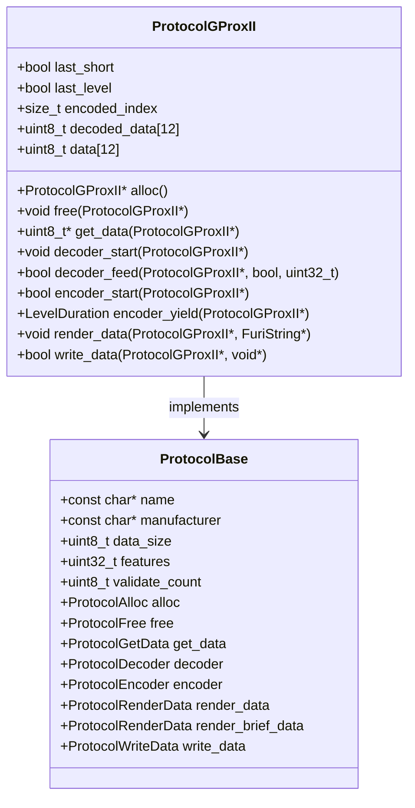
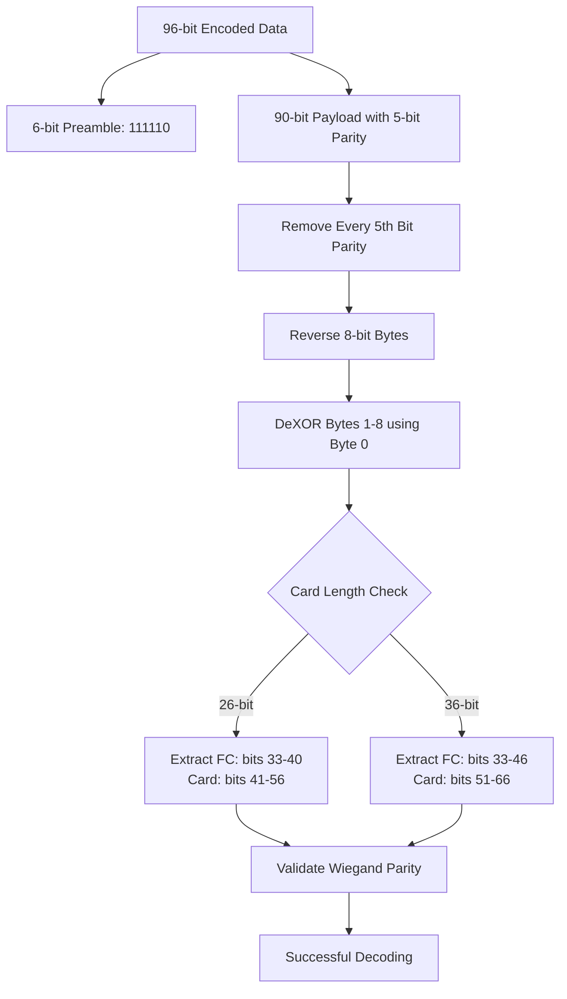
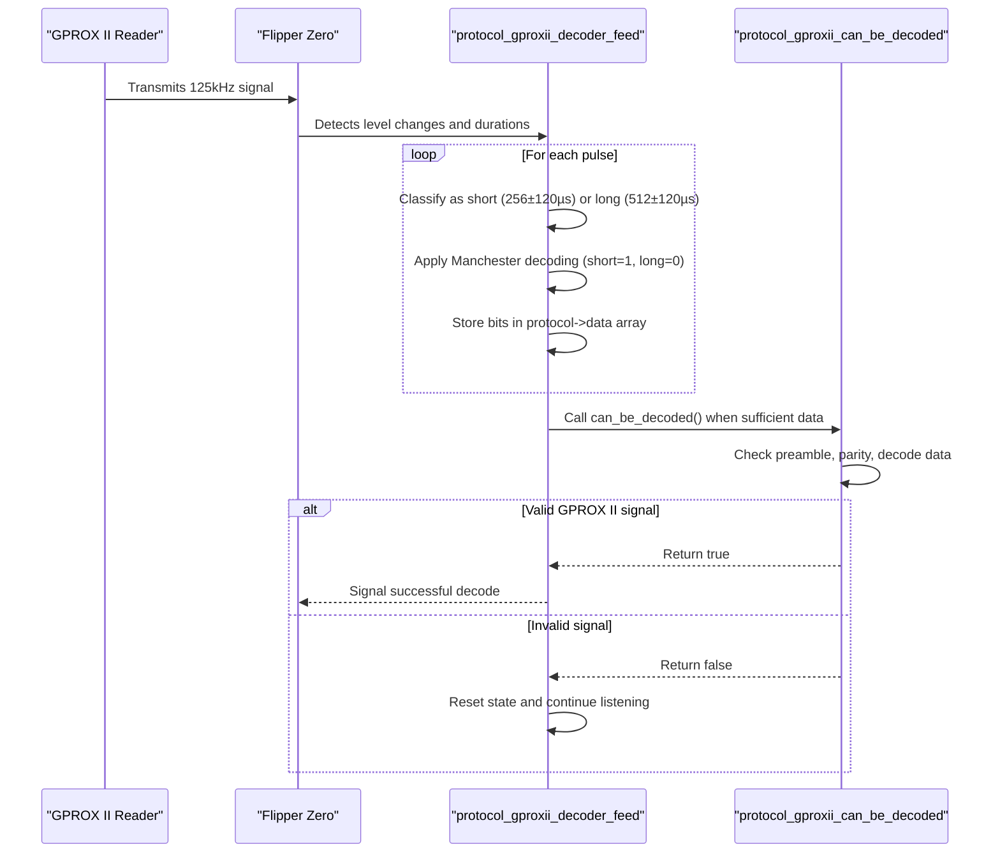
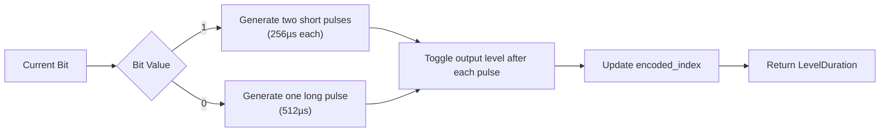
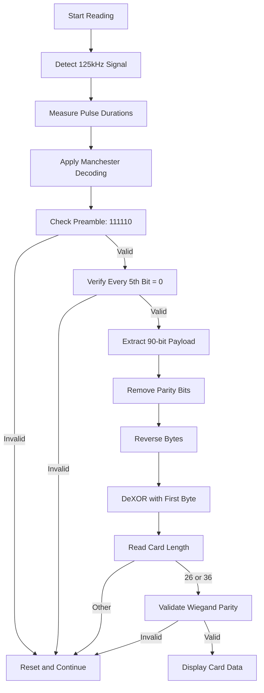
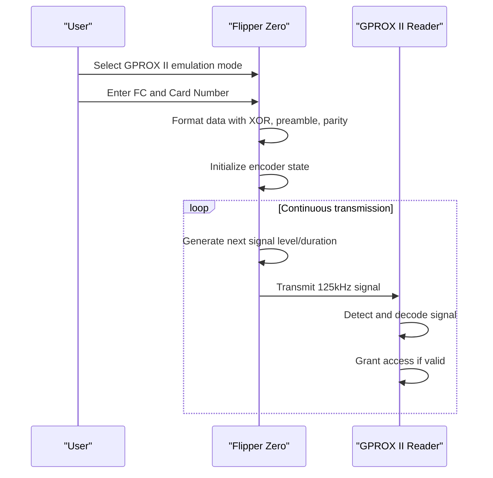
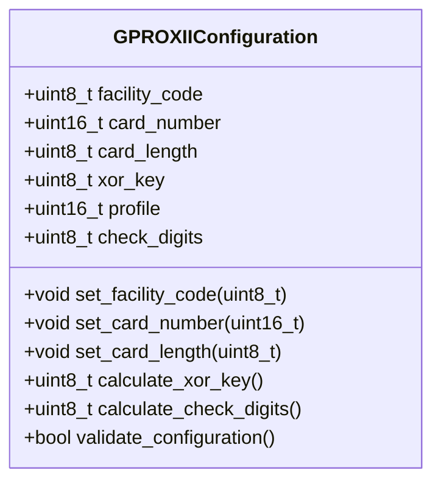
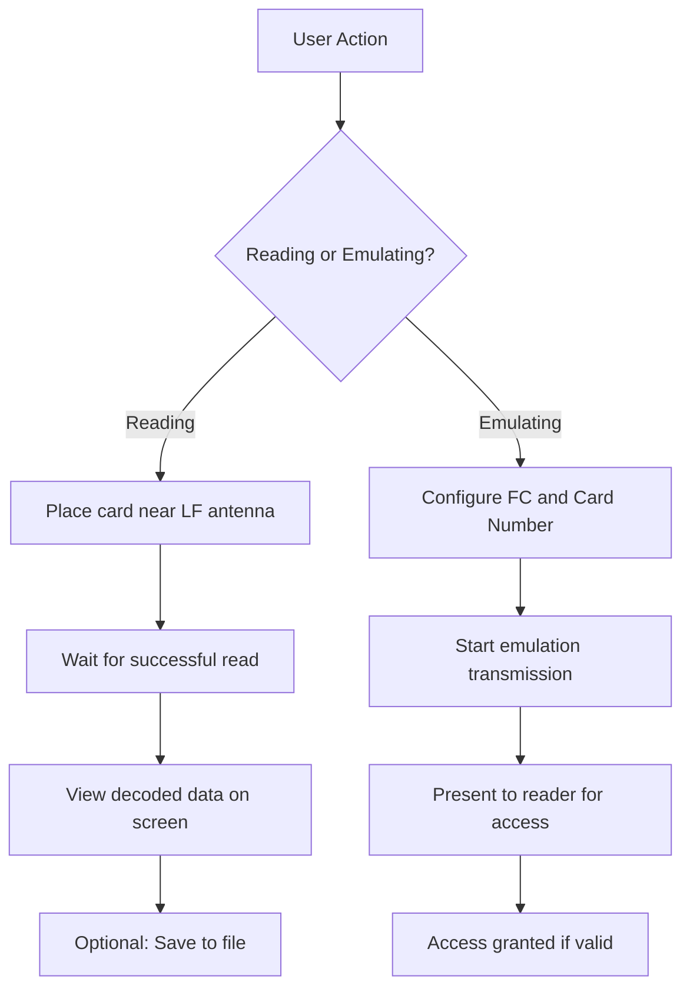
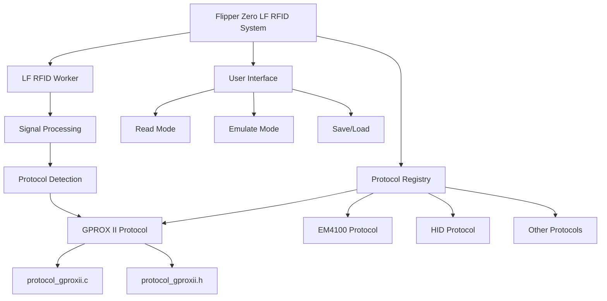

# GPROX II Protocol

<cite>
**Referenced Files in This Document**   
- [protocol_gproxii.c](file://lib/lfrfid/protocols/protocol_gproxii.c#L0-L330)
- [protocol_gproxii.h](file://lib/lfrfid/protocols/protocol_gproxii.h#L0-L4)
- [lfrfid_protocols.h](file://lib/lfrfid/protocols/lfrfid_protocols.h#L0-L58)
- [manchester_decoder.h](file://lib/toolbox/manchester_decoder.h#L0-L31)
- [bit_lib.h](file://lib/bit_lib/bit_lib.h#L0-L199)
</cite>

## Table of Contents
1. [Introduction](#introduction)
2. [GPROX II Protocol Overview](#gprox-ii-protocol-overview)
3. [Data Structure and Encoding](#data-structure-and-encoding)
4. [Signal Demodulation and Decoding](#signal-demodulation-and-decoding)
5. [Manchester Encoding Characteristics](#manchester-encoding-characteristics)
6. [Card Reading and Validation Process](#card-reading-and-validation-process)
7. [Flipper Zero Emulation Capabilities](#flipper-zero-emulation-capabilities)
8. [Configuration Parameters for Emulation](#configuration-parameters-for-emulation)
9. [Practical Examples and Usage](#practical-examples-and-usage)
10. [Protocol Integration in Flipper Zero System](#protocol-integration-in-flipper-zero-system)

## Introduction
The GPROX II protocol is a proprietary RFID access control system developed by Guardall, used in various security applications. This document provides a comprehensive technical analysis of the GPROX II implementation within the Flipper Zero firmware, detailing its encoding scheme, data structure, and integration with the device's low-frequency RFID subsystem. The analysis is based on the actual source code implementation found in the repository, providing accurate and detailed information about how the Flipper Zero can read, decode, and emulate GPROX II RFID cards.

**Section sources**
- [protocol_gproxii.c](file://lib/lfrfid/protocols/protocol_gproxii.c#L0-L330)
- [protocol_gproxii.h](file://lib/lfrfid/protocols/protocol_gproxii.h#L0-L4)

## GPROX II Protocol Overview
The GPROX II protocol implementation in the Flipper Zero firmware supports reading and emulating Guardall/Verex/Chubb GProx II RFID cards. The protocol is designed for low-frequency (LF) RFID systems and uses a proprietary encoding scheme that combines Manchester encoding with additional security features like XOR obfuscation and parity checking.

The protocol supports two card formats: 26-bit and 36-bit configurations, both of which include facility code and card number fields. The implementation is optimized for the Flipper Zero's hardware capabilities, allowing it to both read existing GPROX II cards and emulate them for access control testing and security research purposes.



**Diagram sources**
- [protocol_gproxii.c](file://lib/lfrfid/protocols/protocol_gproxii.c#L20-L330)
- [protocol_gproxii.h](file://lib/lfrfid/protocols/protocol_gproxii.h#L0-L4)

**Section sources**
- [protocol_gproxii.c](file://lib/lfrfid/protocols/protocol_gproxii.c#L20-L330)
- [protocol_gproxii.h](file://lib/lfrfid/protocols/protocol_gproxii.h#L0-L4)

## Data Structure and Encoding
The GPROX II protocol uses a 96-bit encoded data structure with a specific format that includes preamble, data, and parity information. The data structure is defined with precise bit-level specifications to ensure compatibility with Guardall readers.

### Data Structure Specifications
- **Preamble**: 6 bits with pattern `111110`
- **Encoded Bit Size**: 90 bits
- **Total Encoded Size**: 96 bits (12 bytes)
- **Timing Parameters**:
  - Short Time: 256 microseconds
  - Long Time: 512 microseconds
  - Jitter Tolerance: ±120 microseconds

The data structure follows a specific layout after decoding:
- **XOR Value**: 8 bits used for data obfuscation
- **Message Length**: 6 bits indicating card format (26 or 36 bits)
- **Check Digits**: 2 bits for integrity verification
- **Profile**: 16 bits for system configuration
- **Wiegand Parity**: Leading even and trailing odd parity bits
- **Facility Code**: Variable length (8 or 14 bits)
- **Card Number**: Variable length (16 bits)



**Diagram sources**
- [protocol_gproxii.c](file://lib/lfrfid/protocols/protocol_gproxii.c#L45-L130)

**Section sources**
- [protocol_gproxii.c](file://lib/lfrfid/protocols/protocol_gproxii.c#L45-L130)

## Signal Demodulation and Decoding
The GPROX II protocol implementation includes a sophisticated demodulation and decoding process that converts raw signal durations into meaningful data. The process involves Manchester decoding with inverted logic, where short pulses represent binary 1 and long pulses represent binary 0.

### Decoding Process Steps
1. **Preamble Detection**: Verify the 6-bit preamble `111110` at the beginning of the signal
2. **Parity Validation**: Check for always-0 parity on every 5th bit after the preamble
3. **Data Extraction**: Copy the 90-bit payload data starting from bit 6
4. **Parity Removal**: Remove every 5th bit to eliminate parity information
5. **Byte Reversal**: Reverse the bit order within each 8-bit byte
6. **DeXOR Operation**: XOR bytes 1-8 with byte 0 to decode obfuscated data
7. **Card Length Verification**: Extract and validate the 6-bit message length field
8. **Wiegand Parity Check**: Validate even and odd parity for 26-bit or 36-bit formats

The decoding process is implemented in the `protocol_gproxii_can_be_decoded` function, which performs all validation steps and returns true only when a valid GPROX II signal is detected.



**Diagram sources**
- [protocol_gproxii.c](file://lib/lfrfid/protocols/protocol_gproxii.c#L131-L200)

**Section sources**
- [protocol_gproxii.c](file://lib/lfrfid/protocols/protocol_gproxii.c#L131-L200)

## Manchester Encoding Characteristics
The GPROX II protocol uses a modified Manchester encoding scheme with inverted logic compared to standard Manchester encoding. This implementation is specifically designed to be compatible with the Flipper Zero's signal processing capabilities.

### Encoding Parameters
- **Short Pulse Duration**: 256 microseconds (±120µs tolerance)
- **Long Pulse Duration**: 512 microseconds (±120µs tolerance)
- **Encoding Logic**: Inverted Manchester (short=1, long=0)
- **Bit Representation**:
  - Binary 1: Two consecutive short pulses
  - Binary 0: One long pulse

The encoding process is implemented in the `protocol_gproxii_encoder_yield` function, which generates the appropriate signal levels and durations based on the current bit being transmitted. The encoder maintains state information including the current bit index and the last pulse type to ensure proper Manchester encoding.



**Diagram sources**
- [protocol_gproxii.c](file://lib/lfrfid/protocols/protocol_gproxii.c#L201-L250)
- [manchester_decoder.h](file://lib/toolbox/manchester_decoder.h#L0-L31)

**Section sources**
- [protocol_gproxii.c](file://lib/lfrfid/protocols/protocol_gproxii.c#L201-L250)

## Card Reading and Validation Process
The GPROX II card reading and validation process involves multiple stages of signal processing, data extraction, and integrity verification. The implementation ensures that only valid cards are recognized and displayed to the user.

### Reading Process
1. **Signal Acquisition**: The Flipper Zero's LF RFID reader detects the 125kHz carrier signal from the GPROX II card
2. **Pulse Detection**: The system measures the duration of each pulse in the signal
3. **Manchester Decoding**: Convert pulse durations to binary data using the inverted Manchester scheme
4. **Preamble Verification**: Check for the required 6-bit preamble `111110`
5. **Parity Checking**: Validate the always-0 parity on every 5th bit
6. **Data Decoding**: Apply the deobfuscation process (byte reversal and XOR)
7. **Format Validation**: Verify the card length is either 26 or 36 bits
8. **Wiegand Parity Check**: Validate the even and odd parity bits for the specific format

The validation process is critical for ensuring that only genuine GPROX II cards are accepted, preventing false positives from noise or incompatible RFID formats.



**Diagram sources**
- [protocol_gproxii.c](file://lib/lfrfid/protocols/protocol_gproxii.c#L100-L130)

**Section sources**
- [protocol_gproxii.c](file://lib/lfrfid/protocols/protocol_gproxii.c#L100-L130)

## Flipper Zero Emulation Capabilities
The Flipper Zero can emulate GPROX II cards using its built-in LF RFID transmitter. This capability allows users to replicate existing GPROX II cards for testing, backup, or security research purposes.

### Emulation Process
The emulation is implemented through the protocol's encoder functions:
- **Encoder Start**: Initializes the encoding process and resets state variables
- **Encoder Yield**: Generates the next signal level and duration for transmission
- **Data Preparation**: Formats the card data into the proper 96-bit structure with preamble and parity

The emulation process follows these steps:
1. Configure the desired facility code and card number
2. Apply the XOR obfuscation using a calculated XOR key
3. Add the 6-bit preamble `111110`
4. Insert always-0 parity bits every 5th position
5. Generate the Manchester-encoded signal with inverted logic
6. Transmit the signal at 125kHz using the LF antenna

The emulation is highly accurate, with timing precision within the ±120µs tolerance required by GPROX II readers.



**Diagram sources**
- [protocol_gproxii.c](file://lib/lfrfid/protocols/protocol_gproxii.c#L251-L300)

**Section sources**
- [protocol_gproxii.c](file://lib/lfrfid/protocols/protocol_gproxii.c#L251-L300)

## Configuration Parameters for Emulation
To successfully emulate GPROX II cards, several configuration parameters must be properly set. These parameters control the encoding process and ensure compatibility with the target reader system.

### Key Configuration Parameters
- **Facility Code (FC)**: 8-bit or 14-bit value identifying the organization or site
- **Card Number**: 16-bit value uniquely identifying the cardholder
- **Card Length**: 26-bit or 36-bit format selection
- **XOR Key**: 8-bit value used for data obfuscation (automatically calculated)
- **Profile**: 16-bit system configuration value
- **Check Digits**: 2-bit integrity verification (automatically calculated)

The Flipper Zero automatically calculates the necessary XOR key and check digits based on the provided facility code and card number, ensuring that the emulated card will be accepted by the reader.



**Diagram sources**
- [protocol_gproxii.c](file://lib/lfrfid/protocols/protocol_gproxii.c#L280-L300)

**Section sources**
- [protocol_gproxii.c](file://lib/lfrfid/protocols/protocol_gproxii.c#L280-L300)

## Practical Examples and Usage
The GPROX II protocol implementation supports practical use cases for both reading existing cards and creating emulated ones.

### Example 1: Reading a 26-bit GPROX II Card
When reading a 26-bit GPROX II card with facility code 100 and card number 5000, the Flipper Zero displays:
```
FC: 100 Card: 5000 LEN: 26
XOR: 144 CRC: 2 P: 00FF
```

### Example 2: Emulating a 36-bit GPROX II Card
To emulate a 36-bit card with facility code 200 and card number 15000:
1. Navigate to LF RFID menu
2. Select "GPROX II" protocol
3. Choose "Emulate" mode
4. Enter facility code: 200
5. Enter card number: 15000
6. Select card length: 36-bit
7. Start emulation

The Flipper Zero automatically calculates the XOR key and other parameters, then begins transmitting the encoded signal.

### Troubleshooting Common Issues
- **No Card Detected**: Ensure the card is within 1-2 inches of the Flipper Zero's LF antenna
- **Invalid Format**: Verify the card is actually a GPROX II format (some similar cards may not be compatible)
- **Emulation Failure**: Check that the target reader is within range and that the Flipper Zero battery is sufficiently charged



**Diagram sources**
- [protocol_gproxii.c](file://lib/lfrfid/protocols/protocol_gproxii.c#L301-L330)

**Section sources**
- [protocol_gproxii.c](file://lib/lfrfid/protocols/protocol_gproxii.c#L301-L330)

## Protocol Integration in Flipper Zero System
The GPROX II protocol is integrated into the Flipper Zero's LF RFID subsystem as one of many supported protocols. It follows the standard protocol interface defined in the firmware, allowing seamless integration with the user interface and hardware drivers.

### Integration Points
- **Protocol Registry**: Registered in `lfrfid_protocols.h` with enum value `LFRFIDProtocolGProxII`
- **Protocol Base**: Implements the `ProtocolBase` interface with all required function pointers
- **LF RFID Worker**: Integrated with the main LF RFID processing loop
- **User Interface**: Accessible through the LF RFID application menu
- **Data Storage**: Supports saving and loading GPROX II card data to files

The protocol is designed to coexist with other RFID protocols, allowing the Flipper Zero to automatically detect and decode various card formats.



**Diagram sources**
- [lfrfid_protocols.h](file://lib/lfrfid/protocols/lfrfid_protocols.h#L0-L58)
- [protocol_gproxii.c](file://lib/lfrfid/protocols/protocol_gproxii.c#L0-L330)

**Section sources**
- [lfrfid_protocols.h](file://lib/lfrfid/protocols/lfrfid_protocols.h#L0-L58)
- [protocol_gproxii.c](file://lib/lfrfid/protocols/protocol_gproxii.c#L0-L330)