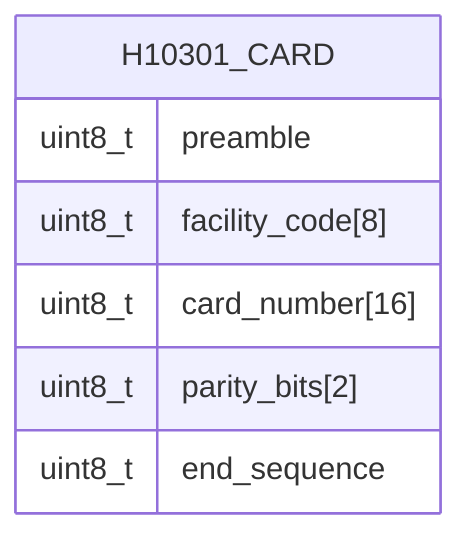
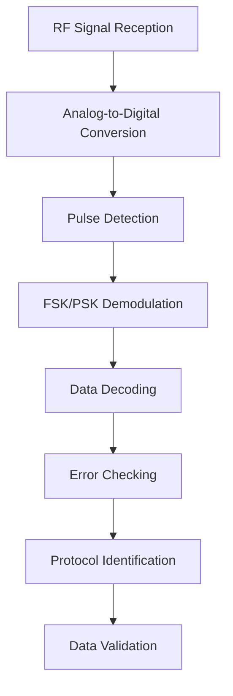
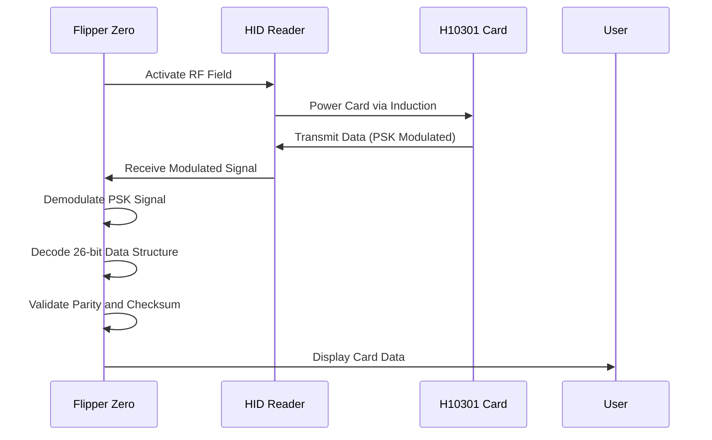
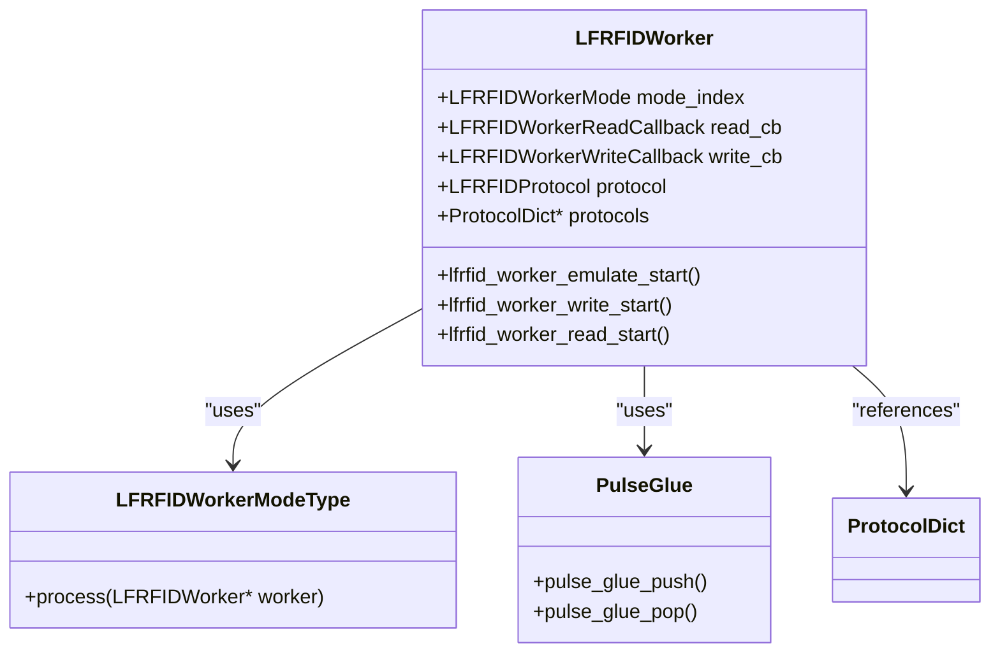
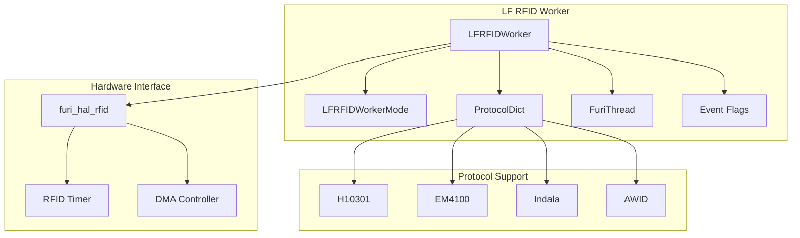

# H10301 Protocol

<cite>
**Referenced Files in This Document**   
- [lfrfid_worker.c](file://lib/lfrfid/lfrfid_worker.c)
- [lfrfid_worker_modes.c](file://lib/lfrfid/lfrfid_worker_modes.c)
- [lfrfid_worker_i.h](file://lib/lfrfid/lfrfid_worker_i.h)
- [lfrfid_worker.h](file://lib/lfrfid/lfrfid_worker.h)
- [lfrfid_protocols.h](file://lib/lfrfid/protocols/lfrfid_protocols.h)
- [lfrfid_protocols.c](file://lib/lfrfid/protocols/lfrfid_protocols.c)
- [protocol_h10301.h](file://lib/lfrfid/protocols/protocol_h10301.h)
- [fsk_demod.h](file://lib/lfrfid/tools/fsk_demod.h)
- [fsk_demod.c](file://lib/lfrfid/tools/fsk_demod.c)
</cite>

## Table of Contents
1. [Introduction](#introduction)
2. [H10301 Protocol Overview](#h10301-protocol-overview)
3. [Data Structure and Encoding](#data-structure-and-encoding)
4. [Signal Analysis and Demodulation](#signal-analysis-and-demodulation)
5. [Tag Reading Process](#tag-reading-process)
6. [Emulation and Cloning](#emulation-and-cloning)
7. [Flipper Zero Implementation](#flipper-zero-implementation)
8. [Practical Applications](#practical-applications)

## Introduction
The H10301 protocol is a proprietary LF RFID standard developed by HID Global for proximity access control systems. This document provides a comprehensive technical analysis of the H10301 implementation within the Flipper Zero firmware, detailing the encoding scheme, data structure, signal processing, and emulation capabilities. The analysis is based on the firmware's low-frequency RFID (LF-RFID) subsystem, which supports reading, writing, and emulating various RFID protocols including H10301.

**Section sources**
- [lfrfid_worker.c](file://lib/lfrfid/lfrfid_worker.c#L1-L195)
- [lfrfid_worker_modes.c](file://lib/lfrfid/lfrfid_worker_modes.c#L1-L799)

## H10301 Protocol Overview
The H10301 protocol is a 26-bit format used in HID proximity cards that employs Phase Shift Keying (PSK) modulation for data transmission. As identified in the firmware source code, H10301 is one of multiple supported LF RFID protocols, specifically designed for access control applications where reliability and security are paramount.

The protocol operates at a carrier frequency of 125 kHz and uses PSK modulation to encode data. Unlike simpler protocols that use Amplitude Shift Keying (ASK), PSK provides better noise immunity and signal integrity, making it suitable for environments with electromagnetic interference. The H10301 implementation in the Flipper Zero firmware is part of a comprehensive LF RFID subsystem that supports multiple protocols through a unified worker architecture.

The protocol is registered in the firmware's protocol dictionary alongside other standards like EM4100, Indala, and AWID, indicating its importance in access control systems. The firmware treats H10301 as a distinct protocol with its own encoding and decoding routines, ensuring accurate handling of its specific data format and modulation characteristics.

**Section sources**
- [lfrfid_protocols.h](file://lib/lfrfid/protocols/lfrfid_protocols.h#L1-L58)
- [lfrfid_protocols.c](file://lib/lfrfid/protocols/lfrfid_protocols.c#L1-L54)

## Data Structure and Encoding
The H10301 protocol implements a 26-bit data structure that includes facility code and card number fields, following the standard HID format. The data structure is organized as follows:

The 26-bit format consists of:
- **Preamble**: Initial synchronization bits for reader detection
- **Facility Code**: 8-bit field identifying the organization or site
- **Card Number**: 16-bit field uniquely identifying the cardholder
- **Parity Bits**: 2-bit error checking mechanism
- **End Sequence**: Termination bits signaling the end of transmission

The encoding scheme uses PSK modulation where data is represented by phase transitions rather than amplitude changes. A binary '0' is represented by no phase transition, while a binary '1' is represented by a phase transition at the bit boundary. This differential encoding provides inherent error detection capabilities and improves signal reliability in noisy environments.

The firmware handles the H10301 protocol through the `protocol_h10301` structure registered in the protocol dictionary, which contains the specific encoding and decoding functions required for this format. The protocol's PSK feature is explicitly defined in the `LFRFIDFeature` enumeration, allowing the worker to configure the appropriate demodulation parameters.

**Diagram sources**
- [lfrfid_protocols.h](file://lib/lfrfid/protocols/lfrfid_protocols.h#L1-L58)

**Section sources**
- [lfrfid_protocols.h](file://lib/lfrfid/protocols/lfrfid_protocols.h#L1-L58)
- [protocol_h10301.h](file://lib/lfrfid/protocols/protocol_h10301.h#L1-L4)

## Signal Analysis and Demodulation
The Flipper Zero firmware implements a sophisticated signal analysis system for H10301 protocol demodulation, utilizing a dedicated FSK/PSK demodulator module. The signal processing pipeline consists of several stages designed to accurately extract data from the analog RFID signal.

The demodulation process begins with the `fsk_demod` module, which is specifically designed to handle frequency and phase shift encoded signals. The `FSKDemod` structure contains parameters for both low and high time intervals, allowing it to distinguish between the phase transitions that represent binary data in PSK modulation.

Key parameters for H10301 demodulation include:
- **Carrier Frequency**: 125 kHz
- **Modulation Type**: PSK (Phase Shift Keying)
- **Bit Rate**: Determined by the reader's clock signal
- **Pulse Width**: Variable based on phase transitions

The demodulation algorithm works by measuring the time between signal edges and comparing them to expected values for '0' and '1' bits. When a phase transition is detected (indicating a '1' bit), the demodulator outputs the corresponding bit value. The algorithm includes noise filtering to ignore short-duration spikes that could be misinterpreted as valid transitions.

The firmware's `lfrfid_worker_read_ttf` function implements the tag-talks-first (TTF) reading process, which is appropriate for H10301 cards. This function configures the RFID timer for PSK demodulation at 62.5 kHz with a 0.25 duty cycle, then captures the incoming signal through an interrupt-driven capture mechanism.

**Diagram sources**
- [fsk_demod.h](file://lib/lfrfid/tools/fsk_demod.h#L1-L44)
- [fsk_demod.c](file://lib/lfrfid/tools/fsk_demod.c#L1-L93)

**Section sources**
- [lfrfid_worker_modes.c](file://lib/lfrfid/lfrfid_worker_modes.c#L1-L799)
- [fsk_demod.c](file://lib/lfrfid/tools/fsk_demod.c#L1-L93)

## Tag Reading Process
The tag reading process for H10301 cards is implemented in the `lfrfid_worker_read_ttf` function, which handles the tag-talks-first communication paradigm used by passive RFID cards. The reading process follows a systematic approach to ensure reliable data acquisition.

The reading process begins with the Flipper Zero activating its RF field at 125 kHz, which powers the passive H10301 card through electromagnetic induction. Once powered, the card begins transmitting its 26-bit data structure using PSK modulation. The Flipper Zero's receiver captures the signal through its analog front-end and converts it to digital pulse data.

The captured data is processed through a multi-stage validation system:
1. **Signal Stabilization**: A 450ms stabilization period ensures the RF field is stable
2. **Pulse Capture**: Raw pulse data is captured and filtered to remove noise
3. **Protocol Detection**: The system tests for H10301 signature patterns
4. **Data Validation**: Multiple consecutive reads must match to confirm validity
5. **Error Checking**: Parity bits are verified to ensure data integrity

The firmware implements a robust error handling system that includes overrun detection, timeout management, and signal quality assessment. If the buffer stream experiences an overrun, the system automatically recovers by resetting the stream and continuing the capture process.

**Diagram sources**
- [lfrfid_worker_modes.c](file://lib/lfrfid/lfrfid_worker_modes.c#L1-L799)

**Section sources**
- [lfrfid_worker_modes.c](file://lib/lfrfid/lfrfid_worker_modes.c#L1-L799)

## Emulation and Cloning
The Flipper Zero firmware provides comprehensive emulation and cloning capabilities for H10301 cards through its LF RFID worker architecture. The emulation process allows the device to mimic the behavior of a genuine H10301 proximity card, enabling it to interact with standard HID readers.

The emulation process is initiated through the `lfrfid_worker_emulate_start` function, which configures the worker for emulation mode. For H10301 cards, this involves setting up the DMA (Direct Memory Access) controller to generate the precise timing signals required for PSK modulation.

Key aspects of the emulation process include:
- **Timing Precision**: The system uses hardware timers to ensure accurate bit timing
- **Buffer Management**: A double-buffered DMA system ensures continuous signal generation
- **Protocol Encoding**: The `pulse_glue` module converts logical bit values to precise timing pulses
- **Power Management**: The system monitors power consumption during emulation

The cloning process involves reading a genuine H10301 card and storing its data in the Flipper Zero's memory. This data can then be used for emulation or written to blank T5577 or EM4305 chips. The write process includes verification steps to ensure the cloned data matches the original, with multiple read attempts to confirm successful programming.

**Diagram sources**
- [lfrfid_worker.c](file://lib/lfrfid/lfrfid_worker.c#L1-L195)
- [lfrfid_worker_modes.c](file://lib/lfrfid/lfrfid_worker_modes.c#L1-L799)

**Section sources**
- [lfrfid_worker.c](file://lib/lfrfid/lfrfid_worker.c#L1-L195)
- [lfrfid_worker_modes.c](file://lib/lfrfid/lfrfid_worker_modes.c#L1-L799)

## Flipper Zero Implementation
The H10301 protocol implementation in the Flipper Zero firmware is built on a modular worker architecture that provides a consistent interface for multiple RFID protocols. The core component is the `LFRFIDWorker` structure, which manages the state and operation of the LF RFID subsystem.

The worker architecture follows an event-driven design pattern, where operations are triggered by setting specific event flags. The main worker thread processes these events in a loop, switching between different modes (read, write, emulate) based on the active flags. This design ensures responsive operation while maintaining power efficiency.

The implementation includes several key components:
- **Worker Management**: The `lfrfid_worker_alloc` and `lfrfid_worker_free` functions handle resource allocation
- **Mode Switching**: The worker can transition between read, write, and emulate modes
- **Protocol Dictionary**: A centralized registry of supported protocols and their parameters
- **Hardware Abstraction**: The `furi_hal_rfid` layer provides low-level access to the RFID hardware

The system is designed for extensibility, allowing new protocols to be added by implementing the appropriate encoding and decoding functions and registering them in the protocol dictionary. This modular approach simplifies maintenance and enables the addition of new RFID standards without modifying the core worker logic.

**Diagram sources**
- [lfrfid_worker.c](file://lib/lfrfid/lfrfid_worker.c#L1-L195)
- [lfrfid_worker_i.h](file://lib/lfrfid/lfrfid_worker_i.h#L1-L66)

**Section sources**
- [lfrfid_worker.c](file://lib/lfrfid/lfrfid_worker.c#L1-L195)
- [lfrfid_worker_i.h](file://lib/lfrfid/lfrfid_worker_i.h#L1-L66)

## Practical Applications
The H10301 protocol implementation in the Flipper Zero has several practical applications in access control systems analysis and security assessment. These applications leverage the device's ability to read, emulate, and clone H10301 proximity cards.

### Access System Analysis
The Flipper Zero can be used to analyze existing H10301-based access systems by:
- Reading card data to understand facility code and numbering schemes
- Testing reader response times and sensitivity
- Identifying potential security weaknesses in implementation
- Documenting system configuration for audit purposes

### Security Testing
Security professionals can use the device to test the resilience of H10301 systems by:
- Verifying that proper authentication procedures are followed
- Testing for replay attack vulnerabilities
- Assessing the effectiveness of anti-cloning measures
- Evaluating physical security controls around readers

### System Integration
The Flipper Zero can serve as a temporary access solution during:
- System migration or upgrade projects
- Emergency access situations
- Testing new reader installations
- Training personnel on access control procedures

The configuration parameters for accurate H10301 emulation include:
- **Facility Code**: Must match the target system's site code
- **Card Number**: Should follow the system's numbering convention
- **Timing Parameters**: Must be precisely configured for reliable communication
- **Power Settings**: Should be optimized for the specific reader model

These applications demonstrate the versatility of the Flipper Zero as a tool for both security assessment and practical access control management, while emphasizing the importance of responsible use in accordance with applicable laws and regulations.

**Section sources**
- [lfrfid_worker_modes.c](file://lib/lfrfid/lfrfid_worker_modes.c#L1-L799)
- [lfrfid_worker.c](file://lib/lfrfid/lfrfid_worker.c#L1-L195)