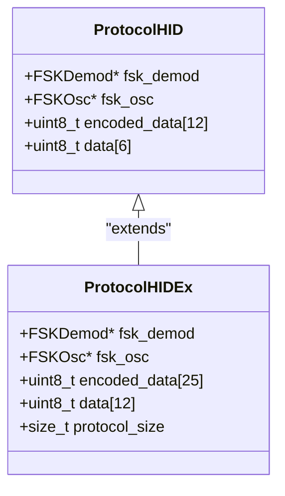
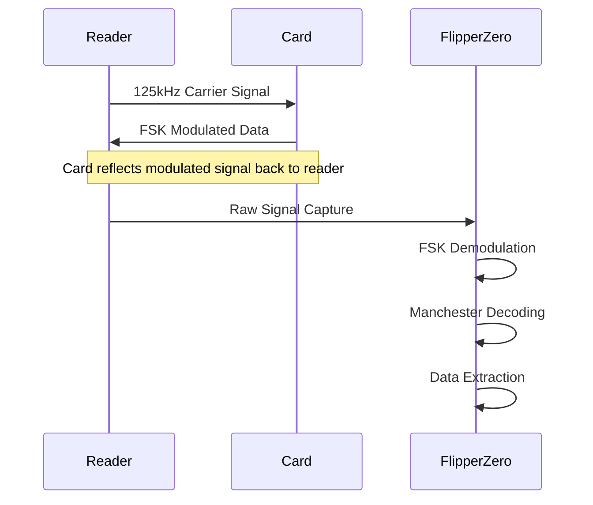
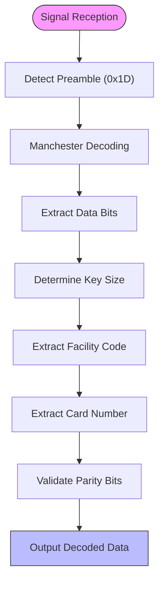
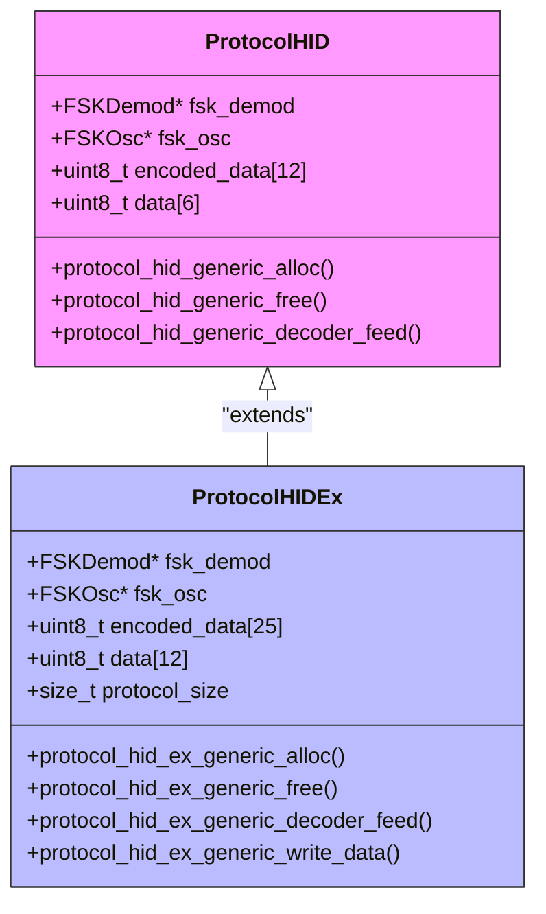
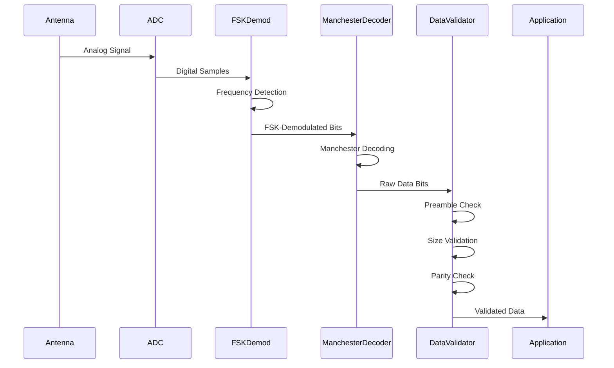
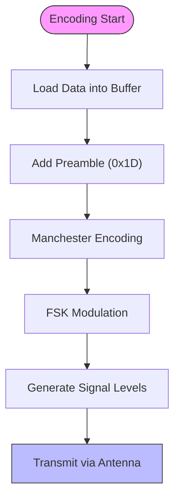
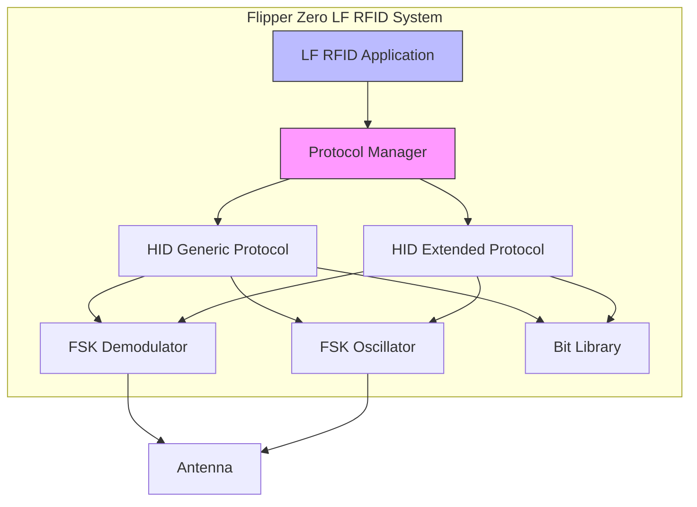
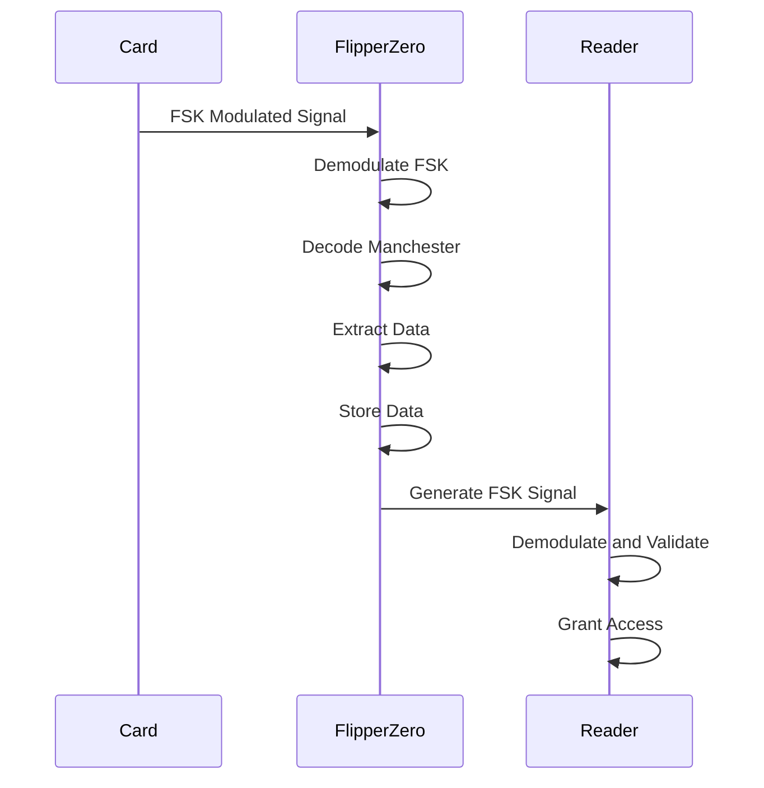

# HID Prox Protocol

<cite>
**Referenced Files in This Document**   
- [protocol_hid_generic.c](file://lib/lfrfid/protocols/protocol_hid_generic.c)
- [protocol_hid_ex_generic.c](file://lib/lfrfid/protocols/protocol_hid_ex_generic.c)
- [lfrfid_protocols.h](file://lib/lfrfid/protocols/lfrfid_protocols.h)
- [lfrfid_protocols.c](file://lib/lfrfid/protocols/lfrfid_protocols.c)
- [fsk_demod.h](file://lib/lfrfid/tools/fsk_demod.h)
- [fsk_osc.h](file://lib/lfrfid/tools/fsk_osc.h)
- [bit_lib.h](file://lib/bit_lib/bit_lib.h)
- [lfrfid.c](file://applications/main/lfrfid/lfrfid.c)
- [lfrfid_i.h](file://applications/main/lfrfid/lfrfid_i.h)
</cite>

## Table of Contents
1. [Introduction](#introduction)
2. [HID Prox Protocol Overview](#hid-prox-protocol-overview)
3. [PSK Modulation Scheme](#psk-modulation-scheme)
4. [Data Format Structure](#data-format-structure)
5. [Standard vs Extended HID Formats](#standard-vs-extended-hid-formats)
6. [Signal Processing and Demodulation](#signal-processing-and-demodulation)
7. [Encoding and Transmission](#encoding-and-transmission)
8. [Flipper Zero Implementation](#flipper-zero-implementation)
9. [Practical Examples](#practical-examples)
10. [Conclusion](#conclusion)

## Introduction

The HID Prox LF RFID protocol is a widely used access control system operating at 125 kHz. This document provides a comprehensive technical analysis of the protocol implementation within the Flipper Zero firmware, covering the modulation scheme, data structure, encoding methods, and practical applications. The analysis is based on the actual source code implementation in the repository, providing accurate and detailed information about how the Flipper Zero can read, clone, and emulate various HID Prox cards.

**Section sources**
- [protocol_hid_generic.c](file://lib/lfrfid/protocols/protocol_hid_generic.c#L0-L289)
- [protocol_hid_ex_generic.c](file://lib/lfrfid/protocols/protocol_hid_ex_generic.c#L0-L228)

## HID Prox Protocol Overview

The HID Prox protocol is a low-frequency RFID system used primarily for physical access control. It operates at 125 kHz and uses FSK (Frequency Shift Keying) modulation to transmit data from the card to the reader. The protocol supports various bit lengths from 26 to 37 bits, with the ability to extend beyond this range for specialized applications.

The protocol implementation in the Flipper Zero firmware is divided into two main components: the standard HID generic protocol and the extended HID generic protocol. These implementations handle the decoding and encoding of HID Prox signals, allowing the device to function as both a reader and emulator.

The core data structure for the HID protocol is defined in the `ProtocolHID` and `ProtocolHIDEx` structures, which contain both decoder and encoder components along with buffers for encoded and decoded data.



**Diagram sources**
- [protocol_hid_generic.c](file://lib/lfrfid/protocols/protocol_hid_generic.c#L25-L39)
- [protocol_hid_ex_generic.c](file://lib/lfrfid/protocols/protocol_hid_ex_generic.c#L25-L40)

**Section sources**
- [protocol_hid_generic.c](file://lib/lfrfid/protocols/protocol_hid_generic.c#L0-L289)
- [protocol_hid_ex_generic.c](file://lib/lfrfid/protocols/protocol_hid_ex_generic.c#L0-L228)

## PSK Modulation Scheme

The HID Prox protocol uses FSK (Frequency Shift Keying) modulation, which is often referred to as PSK (Phase Shift Keying) in the context of RFID systems. The modulation scheme encodes data by varying the frequency of the carrier signal.

In the Flipper Zero implementation, the FSK modulation parameters are defined with specific timing values:
- **Low frequency (0 bit)**: 64 time units
- **High frequency (1 bit)**: 80 time units
- **Jitter tolerance**: ±20 time units

These values are configured in the FSK demodulator and oscillator components, which handle the signal processing for both reading and writing operations.

The FSK demodulator is initialized with these parameters to detect the frequency shifts in the incoming signal:
```c
protocol->decoder.fsk_demod = fsk_demod_alloc(MIN_TIME, 6, MAX_TIME, 5);
```

The FSK oscillator is similarly configured for signal generation:
```c
protocol->encoder.fsk_osc = fsk_osc_alloc(8, 10, 50);
```

The modulation scheme uses Manchester encoding at the bit level, where each data bit is represented by a transition in the middle of the bit period. A '0' bit is represented by a low-to-high transition, while a '1' bit is represented by a high-to-low transition.



**Diagram sources**
- [fsk_demod.h](file://lib/lfrfid/tools/fsk_demod.h#L0-L45)
- [fsk_osc.h](file://lib/lfrfid/tools/fsk_osc.h#L0-L61)
- [protocol_hid_generic.c](file://lib/lfrfid/protocols/protocol_hid_generic.c#L15-L18)

**Section sources**
- [fsk_demod.h](file://lib/lfrfid/tools/fsk_demod.h#L0-L45)
- [fsk_osc.h](file://lib/lfrfid/tools/fsk_osc.h#L0-L61)
- [protocol_hid_generic.c](file://lib/lfrfid/protocols/protocol_hid_generic.c#L15-L18)

## Data Format Structure

The HID Prox protocol uses a structured data format with specific components for synchronization, data, and error detection. The data structure varies between standard and extended formats, but both follow a similar pattern.

### Standard HID Format (26-37 bits)

The standard HID format begins with a preamble byte (0x1D) followed by the encoded data and ends with another preamble byte. The data is Manchester encoded, with each bit represented by two sub-bits.

The protocol header contains information about the key size:
- If any of the first six bits is 1, the key size is determined by the position of the first 1 bit
- If the first six bits are 0 and the seventh bit is 0, the key is 37 bits
- If the first six bits are 0 and the seventh bit is 1, the size continues until the next 1 bit

The facility code and card number are encoded within the data field, with the exact position depending on the total bit length. Parity bits are used for error detection, typically calculated using even or odd parity across specific bit groups.

### Extended HID Format

The extended format supports longer data lengths and additional features. It uses a similar structure but with a larger data field (23 bytes encoded) and corresponding larger decoded data (12 bytes).

The data format includes:
- **Preamble**: 0x1D (synchronization)
- **Encoded data**: Manchester encoded bit stream
- **Postamble**: 0x1D (termination)

The decoding process involves extracting the Manchester encoded bits and reconstructing the original data stream. The bit library functions are used to manipulate individual bits within the data arrays.



**Diagram sources**
- [protocol_hid_generic.c](file://lib/lfrfid/protocols/protocol_hid_generic.c#L100-L115)
- [bit_lib.h](file://lib/bit_lib/bit_lib.h#L0-L330)

**Section sources**
- [protocol_hid_generic.c](file://lib/lfrfid/protocols/protocol_hid_generic.c#L100-L115)
- [bit_lib.h](file://lib/bit_lib/bit_lib.h#L0-L330)

## Standard vs Extended HID Formats

The Flipper Zero firmware implements two distinct HID protocol variants to handle different card types and data lengths.

### Standard HID Generic Protocol

The standard protocol is designed for typical HID Prox cards with 26-37 bit formats. Key characteristics:

- **Data size**: 11 bytes encoded (88 bits)
- **Decoded data**: 6 bytes (48 bits)
- **Preamble**: 1 byte (0x1D)
- **Total encoded size**: 12 bytes (including pre- and post-amble)

The protocol uses the following constants:
```c
#define HID_DATA_SIZE             11
#define HID_PREAMBLE_SIZE         1
#define HID_ENCODED_DATA_SIZE     12
#define HID_DECODED_DATA_SIZE     6
```

### Extended HID Generic Protocol

The extended protocol supports longer data formats and additional features:

- **Data size**: 23 bytes encoded (184 bits)
- **Decoded data**: 12 bytes (96 bits)
- **Preamble**: 1 byte (0x1D)
- **Total encoded size**: 25 bytes (including pre- and post-amble)

The protocol uses the following constants:
```c
#define HID_DATA_SIZE     23
#define HID_PREAMBLE_SIZE 1
#define HID_ENCODED_DATA_SIZE 25
#define HID_DECODED_DATA_SIZE 12
```

### Key Differences

| Feature | Standard HID | Extended HID |
|--------|-------------|--------------|
| **Maximum bit length** | 37 bits | Variable, typically longer |
| **Data capacity** | Smaller | Larger |
| **Use cases** | Standard access cards | Specialized applications |
| **Memory usage** | Lower | Higher |
| **Processing time** | Faster | Slower |

The extended protocol also includes additional functionality for writing data to T5577 chips:
```c
bool protocol_hid_ex_generic_write_data(ProtocolHIDEx* protocol, void* data) {
    // Configure T5577 block parameters
    request->t5577.block[0] = LFRFID_T5577_MODULATION_FSK2a | 
                              LFRFID_T5577_BITRATE_RF_50 |
                              (6 << LFRFID_T5577_MAXBLOCK_SHIFT);
    // Copy encoded data to T5577 blocks
    request->t5577.block[1] = bit_lib_get_bits_32(protocol->encoded_data, 0, 32);
    // ... additional blocks
}
```



**Diagram sources**
- [protocol_hid_generic.c](file://lib/lfrfid/protocols/protocol_hid_generic.c#L25-L39)
- [protocol_hid_ex_generic.c](file://lib/lfrfid/protocols/protocol_hid_ex_generic.c#L25-L40)

**Section sources**
- [protocol_hid_generic.c](file://lib/lfrfid/protocols/protocol_hid_generic.c#L0-L289)
- [protocol_hid_ex_generic.c](file://lib/lfrfid/protocols/protocol_hid_ex_generic.c#L0-L228)

## Signal Processing and Demodulation

The signal processing pipeline for HID Prox protocol involves several stages of demodulation and decoding to extract the original data from the received RF signal.

### Demodulation Process

The FSK demodulator analyzes the incoming signal to detect frequency shifts that represent binary data. The process involves:

1. **Signal sampling**: The raw signal is sampled to measure the time between rising edges
2. **Frequency detection**: The measured times are compared against the expected low and high frequencies
3. **Bit determination**: Based on the frequency, each bit is determined as 0 or 1
4. **Manchester decoding**: The FSK-demodulated bits are further decoded from Manchester encoding

The demodulation is implemented in the `protocol_hid_generic_decoder_feed` function:

```c
bool protocol_hid_generic_decoder_feed(ProtocolHID* protocol, bool level, uint32_t duration) {
    bool value;
    uint32_t count;
    bool result = false;

    fsk_demod_feed(protocol->decoder.fsk_demod, level, duration, &value, &count);
    if(count > 0) {
        for(size_t i = 0; i < count; i++) {
            bit_lib_push_bit(protocol->encoded_data, HID_ENCODED_DATA_SIZE, value);
            if(protocol_hid_generic_can_be_decoded(protocol->encoded_data)) {
                protocol_hid_generic_decode(protocol->encoded_data, protocol->data);
                result = true;
            }
        }
    }

    return result;
}
```

### Synchronization and Clock Recovery

The protocol uses the preamble byte (0x1D) for synchronization. This byte serves as a known pattern that allows the receiver to:
- Establish timing reference
- Recover the clock signal
- Verify signal integrity

The preamble detection is implemented in the `protocol_hid_generic_can_be_decoded` function:

```c
static bool protocol_hid_generic_can_be_decoded(const uint8_t* data) {
    // check preamble
    if(data[0] != HID_PREAMBLE || data[HID_PREAMBLE_SIZE + HID_DATA_SIZE] != HID_PREAMBLE) {
        return false;
    }
    // ... additional checks
}
```

### Data Validation

After decoding, the data is validated to ensure integrity:
- Preamble verification
- Manchester encoding validation (no 00 or 11 bit pairs)
- Size validation (minimum 26 bits)
- Parity checking

The validation process ensures that only properly formatted data is accepted, reducing false positives from noise or interference.



**Diagram sources**
- [protocol_hid_generic.c](file://lib/lfrfid/protocols/protocol_hid_generic.c#L130-L150)
- [fsk_demod.h](file://lib/lfrfid/tools/fsk_demod.h#L0-L45)

**Section sources**
- [protocol_hid_generic.c](file://lib/lfrfid/protocols/protocol_hid_generic.c#L130-L150)
- [fsk_demod.h](file://lib/lfrfid/tools/fsk_demod.h#L0-L45)

## Encoding and Transmission

The encoding process converts the original data into a modulated signal that can be transmitted by the Flipper Zero to emulate an HID Prox card.

### Encoding Process

The encoding pipeline involves several stages:

1. **Data preparation**: The original data is loaded into the protocol structure
2. **Manchester encoding**: Each data bit is converted to Manchester format
3. **FSK modulation**: The Manchester-encoded bits are modulated using FSK
4. **Signal generation**: The modulated signal is output through the antenna

The encoding is implemented in the `protocol_hid_generic_encode` function:

```c
static void protocol_hid_generic_encode(ProtocolHID* protocol) {
    protocol->encoded_data[0] = HID_PREAMBLE;

    size_t bit_index = 0;
    for(size_t i = 0; i < HID_DECODED_BIT_SIZE; i++) {
        bool bit = bit_lib_get_bit(protocol->data, i);
        if(bit) {
            bit_lib_set_bit(protocol->encoded_data, 8 + bit_index, 1);
            bit_lib_set_bit(protocol->encoded_data, 8 + bit_index + 1, 0);
        } else {
            bit_lib_set_bit(protocol->encoded_data, 8 + bit_index, 0);
            bit_lib_set_bit(protocol->encoded_data, 8 + bit_index + 1, 1);
        }
        bit_index += 2;
    }
}
```

### Signal Generation

The `protocol_hid_generic_encoder_yield` function generates the actual signal levels and durations:

```c
LevelDuration protocol_hid_generic_encoder_yield(ProtocolHID* protocol) {
    bool level = 0;
    uint32_t duration = 0;

    if(protocol->encoder.pulse == 0) {
        uint8_t bit = bit_lib_get_bit(protocol->encoded_data, protocol->encoder.encoded_index);
        bool advance = fsk_osc_next(protocol->encoder.fsk_osc, bit, &duration);
        
        if(advance) {
            bit_lib_increment_index(protocol->encoder.encoded_index, HID_ENCODED_BIT_SIZE);
        }

        duration = duration / 2;
        protocol->encoder.pulse = duration;
        level = true;
    } else {
        duration = protocol->encoder.pulse;
        protocol->encoder.pulse = 0;
        level = false;
    }

    return level_duration_make(level, duration);
}
```

This function alternates between high and low levels, with durations determined by the FSK oscillator based on whether the current bit is 0 or 1.



**Diagram sources**
- [protocol_hid_generic.c](file://lib/lfrfid/protocols/protocol_hid_generic.c#L170-L200)
- [fsk_osc.h](file://lib/lfrfid/tools/fsk_osc.h#L0-L61)

**Section sources**
- [protocol_hid_generic.c](file://lib/lfrfid/protocols/protocol_hid_generic.c#L170-L200)
- [fsk_osc.h](file://lib/lfrfid/tools/fsk_osc.h#L0-L61)

## Flipper Zero Implementation

The Flipper Zero implements the HID Prox protocol through a well-structured software architecture that integrates with the overall LF RFID system.

### Protocol Registration

The HID protocols are registered in the global protocol array, making them available to the LF RFID application:

```c
const ProtocolBase* lfrfid_protocols[] = {
    [LFRFIDProtocolHidGeneric] = &protocol_hid_generic,
    [LFRFIDProtocolHidExGeneric] = &protocol_hid_ex_generic,
    // ... other protocols
};
```

This registration allows the main application to dynamically select and use the appropriate protocol based on the detected card type.

### Memory Management

The protocol implementations use dynamic memory allocation for their structures:

```c
ProtocolHID* protocol_hid_generic_alloc(void) {
    ProtocolHID* protocol = malloc(sizeof(ProtocolHID));
    protocol->decoder.fsk_demod = fsk_demod_alloc(MIN_TIME, 6, MAX_TIME, 5);
    protocol->encoder.fsk_osc = fsk_osc_alloc(8, 10, 50);
    return protocol;
}
```

Proper memory management is ensured with corresponding free functions:

```c
void protocol_hid_generic_free(ProtocolHID* protocol) {
    fsk_demod_free(protocol->decoder.fsk_demod);
    fsk_osc_free(protocol->encoder.fsk_osc);
    free(protocol);
}
```

### Integration with LF RFID System

The HID protocols are integrated into the main LF RFID application through the protocol dictionary:

```c
lfrfid->dict = protocol_dict_alloc(lfrfid_protocols, LFRFIDProtocolMax);
```

This allows the application to handle multiple protocol types seamlessly, switching between them as needed.



**Diagram sources**
- [lfrfid_protocols.c](file://lib/lfrfid/protocols/lfrfid_protocols.c#L0-L55)
- [lfrfid.c](file://applications/main/lfrfid/lfrfid.c#L150-L170)
- [lfrfid_protocols.h](file://lib/lfrfid/protocols/lfrfid_protocols.h#L0-L59)

**Section sources**
- [lfrfid_protocols.c](file://lib/lfrfid/protocols/lfrfid_protocols.c#L0-L55)
- [lfrfid.c](file://applications/main/lfrfid/lfrfid.c#L150-L170)
- [lfrfid_protocols.h](file://lib/lfrfid/protocols/lfrfid_protocols.h#L0-L59)

## Practical Examples

### Capturing an HID Prox Signal

To capture an HID Prox signal using the Flipper Zero:

1. Place the HID card near the Flipper Zero antenna
2. The device automatically detects the 125 kHz carrier signal
3. The FSK demodulator analyzes the frequency shifts
4. The Manchester decoder extracts the data bits
5. The protocol validates the preamble and data structure
6. The decoded data is stored in the device

The captured data includes:
- **Facility code**: Organization identifier
- **Card number**: Unique user identifier
- **Bit length**: 26-37 bits (standard) or longer (extended)
- **Parity information**: Error detection bits

### Cloning an HID Prox Card

To clone an HID Prox card:

1. Read the original card to extract the data
2. Configure the Flipper Zero to use the appropriate HID protocol
3. Write the data to a T5577 chip or emulate directly
4. Test the cloned card with a reader

For T5577 programming:
```c
request->t5577.block[0] = LFRFID_T5577_MODULATION_FSK2a | 
                          LFRFID_T5577_BITRATE_RF_50 |
                          (6 << LFRFID_T5577_MAXBLOCK_SHIFT);
```

### Configuration Parameters

Key configuration parameters for HID Prox emulation:

- **Modulation**: FSK2a
- **Bit rate**: RF/50 (25 kHz)
- **Max block**: 6
- **Preamble**: 0x1D
- **Data encoding**: Manchester

### Example Data Flow



**Diagram sources**
- [protocol_hid_generic.c](file://lib/lfrfid/protocols/protocol_hid_generic.c#L130-L200)
- [protocol_hid_ex_generic.c](file://lib/lfrfid/protocols/protocol_hid_ex_generic.c#L130-L200)

**Section sources**
- [protocol_hid_generic.c](file://lib/lfrfid/protocols/protocol_hid_generic.c#L130-L200)
- [protocol_hid_ex_generic.c](file://lib/lfrfid/protocols/protocol_hid_ex_generic.c#L130-L200)

## Conclusion

The HID Prox protocol implementation in the Flipper Zero firmware provides a comprehensive solution for reading, cloning, and emulating HID Prox RFID cards. The system uses FSK modulation with Manchester encoding to handle the 125 kHz signals, supporting both standard (26-37 bit) and extended formats.

The implementation is well-structured, with separate components for demodulation, decoding, encoding, and transmission. The use of a modular protocol architecture allows for easy integration with the overall LF RFID system, while the bit manipulation library provides reliable low-level operations.

Key features of the implementation include:
- Support for multiple HID Prox formats
- Accurate signal demodulation and clock recovery
- Robust data validation and error checking
- Efficient memory management
- Seamless integration with T5577 programming

This comprehensive implementation enables the Flipper Zero to function as a versatile tool for HID Prox RFID analysis and emulation, with applications in security research, access control testing, and educational purposes.

**Section sources**
- [protocol_hid_generic.c](file://lib/lfrfid/protocols/protocol_hid_generic.c#L0-L289)
- [protocol_hid_ex_generic.c](file://lib/lfrfid/protocols/protocol_hid_ex_generic.c#L0-L228)
- [lfrfid_protocols.c](file://lib/lfrfid/protocols/lfrfid_protocols.c#L0-L55)