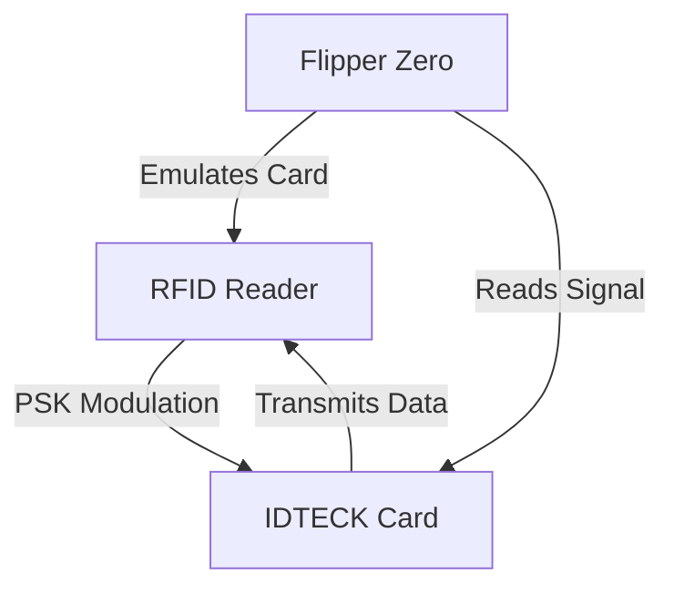
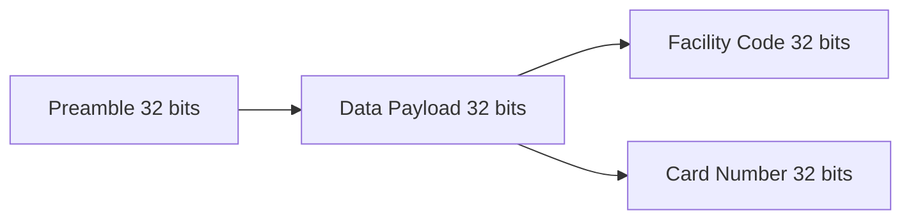
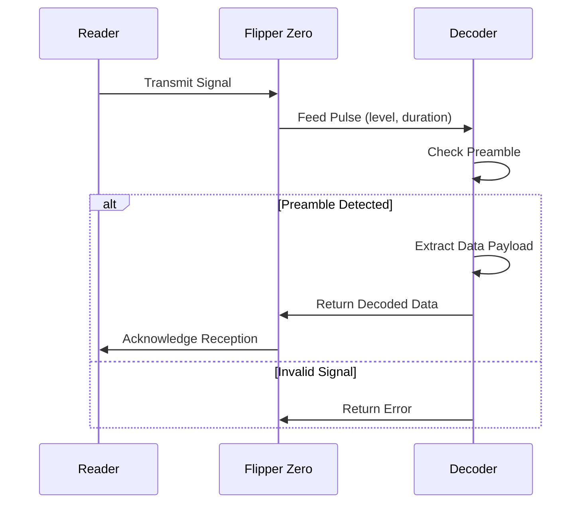
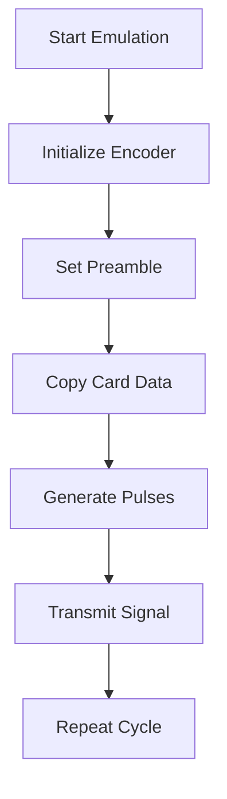

# IDTECK Protocol

<cite>
**Referenced Files in This Document**   
- [protocol_idteck.c](file://lib/lfrfid/protocols/protocol_idteck.c#L1-L260)
- [protocol_idteck.h](file://lib/lfrfid/protocols/protocol_idteck.h#L1-L5)
- [lfrfid_protocols.c](file://lib/lfrfid/protocols/lfrfid_protocols.c#L1-L55)
- [lfrfid_protocols.h](file://lib/lfrfid/protocols/lfrfid_protocols.h#L1-L59)
- [bit_lib.h](file://lib/bit_lib/bit_lib.h#L1-L330)
- [level_duration.h](file://lib/toolbox/level_duration.h#L1-L83)
- [lfrfid_worker.h](file://lib/lfrfid/lfrfid_worker.h#L1-L166)
</cite>

## Table of Contents
1. [Introduction](#introduction)
2. [IDTECK Protocol Overview](#idteck-protocol-overview)
3. [Data Structure and Encoding](#data-structure-and-encoding)
4. [Signal Demodulation and Decoding](#signal-demodulation-and-decoding)
5. [Tag Reading and Validation](#tag-reading-and-validation)
6. [Card Cloning and Writing](#card-cloning-and-writing)
7. [Flipper Zero Emulation](#flipper-zero-emulation)
8. [Protocol Implementation Details](#protocol-implementation-details)
9. [Practical Examples](#practical-examples)
10. [Conclusion](#conclusion)

## Introduction
The IDTECK LF RFID protocol is a proprietary access control system used in various security applications. This document provides a comprehensive analysis of the IDTECK protocol implementation within the Flipper Zero firmware, detailing its encoding scheme, data structure, transmission characteristics, and emulation capabilities. The analysis is based on the source code from the flipperzero-firmware-wPlugins repository, focusing on the specific implementation of the IDTECK protocol for low-frequency RFID systems.

**Section sources**
- [protocol_idteck.c](file://lib/lfrfid/protocols/protocol_idteck.c#L1-L260)
- [protocol_idteck.h](file://lib/lfrfid/protocols/protocol_idteck.h#L1-L5)

## IDTECK Protocol Overview
The IDTECK protocol is implemented as a PSK (Phase Shift Keying) modulated RFID system operating at low frequency. The protocol is designed for access control systems and features a unique preamble and data structure that distinguishes it from other RFID formats. The implementation in the Flipper Zero firmware supports both reading and emulating IDTECK cards, allowing users to interact with IDTECK-based access systems.

The protocol is registered in the LF RFID protocol registry with the identifier `LFRFIDProtocolIdteck` and is associated with the manufacturer "IDTECK". It has a data size of 8 bytes (64 bits) and requires 6 validation cycles, indicating a robust validation process to ensure data integrity during reading operations.



**Diagram sources**
- [protocol_idteck.c](file://lib/lfrfid/protocols/protocol_idteck.c#L1-L260)
- [lfrfid_protocols.h](file://lib/lfrfid/protocols/lfrfid_protocols.h#L1-L59)

**Section sources**
- [protocol_idteck.c](file://lib/lfrfid/protocols/protocol_idteck.c#L1-L260)
- [lfrfid_protocols.h](file://lib/lfrfid/protocols/lfrfid_protocols.h#L1-L59)

## Data Structure and Encoding
The IDTECK protocol uses a 64-bit data structure divided into two main components: a 32-bit facility code (FC) and a 32-bit card number. The data is encoded with a specific preamble that serves as a synchronization pattern for the receiver. The preamble is a fixed 32-bit sequence: `01001001 01000100 01010100 01001011`, which corresponds to the hexadecimal value `0x4944544B`.

The complete encoded data structure consists of 64 bits, with the first 32 bits reserved for the preamble and the remaining 32 bits containing the actual data payload. The data payload includes both the facility code and card number, each occupying 32 bits. This structure allows for a large number of unique card combinations, making it suitable for enterprise-level access control systems.

```c
#define IDTECK_ENCODED_BIT_SIZE  (64)
#define IDTECK_DECODED_BIT_SIZE  (64)
#define IDTECK_DECODED_DATA_SIZE (8)
```

The encoding process involves copying the preamble to the beginning of the data buffer and then copying the actual data (facility code and card number) to the remaining portion of the buffer. The bit manipulation operations are handled by the `bit_lib` library, which provides functions for setting, getting, and copying bits within byte arrays.



**Diagram sources**
- [protocol_idteck.c](file://lib/lfrfid/protocols/protocol_idteck.c#L10-L18)
- [bit_lib.h](file://lib/bit_lib/bit_lib.h#L1-L330)

**Section sources**
- [protocol_idteck.c](file://lib/lfrfid/protocols/protocol_idteck.c#L10-L18)
- [bit_lib.h](file://lib/bit_lib/bit_lib.h#L1-L330)

## Signal Demodulation and Decoding
The IDTECK protocol uses PSK modulation for data transmission, which requires specific demodulation techniques to extract the original data. The decoding process in the Flipper Zero firmware is implemented in the `protocol_idteck_decoder_feed` function, which processes incoming signal pulses and reconstructs the original data stream.

The demodulation process begins with checking for the preamble sequence in the received data. If the preamble is detected, the decoder proceeds to extract the data payload. The timing parameters for the IDTECK protocol are defined as follows:
- Bit duration: 255 microseconds per bit
- Encoder pulses per bit: 16

The decoder handles both positive and negative polarity signals, as well as potentially corrupted data that may result from phase synchronization issues. This robust decoding approach ensures reliable data extraction even in suboptimal signal conditions.

```c
#define IDTECK_US_PER_BIT             (255)
#define IDTECK_ENCODER_PULSES_PER_BIT (16)
```

The decoding algorithm processes incoming pulses by measuring their duration and determining the corresponding bit value based on the timing. The `protocol_idteck_decoder_feed_internal` function handles the core decoding logic, pushing bits into the data buffer and checking for valid preamble sequences.



**Diagram sources**
- [protocol_idteck.c](file://lib/lfrfid/protocols/protocol_idteck.c#L72-L147)
- [level_duration.h](file://lib/toolbox/level_duration.h#L1-L83)

**Section sources**
- [protocol_idteck.c](file://lib/lfrfid/protocols/protocol_idteck.c#L72-L147)
- [level_duration.h](file://lib/toolbox/level_duration.h#L1-L83)

## Tag Reading and Validation
The tag reading process for IDTECK cards involves several stages of signal processing and data validation. When a user attempts to read an IDTECK card, the Flipper Zero initiates the reading process through the LF RFID worker, which manages the low-level communication with the RFID coil.

The reading process begins with the worker starting in PSK mode, as specified by the protocol's feature set. The worker continuously monitors the signal from the RFID coil, feeding pulse data to the IDTECK decoder. The decoder processes each pulse, attempting to reconstruct the original data stream by detecting the preamble and extracting the data payload.

Once a complete data packet is received, the system performs validation to ensure data integrity. The validation process involves checking the preamble sequence and verifying that the data structure conforms to the expected format. The protocol requires 6 validation cycles, which helps to reduce false positives and ensures reliable reading of IDTECK cards.

```c
const ProtocolBase protocol_idteck = {
    .name = "Idteck",
    .manufacturer = "IDTECK",
    .data_size = IDTECK_DECODED_DATA_SIZE,
    .features = LFRFIDFeaturePSK,
    .validate_count = 6,
    // ... other fields
};
```

The validation process is critical for ensuring that only legitimate IDTECK cards are recognized by the system. The multiple validation cycles help to filter out noise and transient signals that might otherwise be misinterpreted as valid card data.

**Section sources**
- [protocol_idteck.c](file://lib/lfrfid/protocols/protocol_idteck.c#L260-L260)
- [lfrfid_worker.h](file://lib/lfrfid/lfrfid_worker.h#L1-L166)

## Card Cloning and Writing
The IDTECK protocol implementation in the Flipper Zero firmware supports cloning IDTECK cards to writable RFID tags, such as T5577 chips. The cloning process involves reading the data from an original IDTECK card and then writing that data to a blank or reprogrammable RFID tag.

The writing process is handled by the `protocol_idteck_write_data` function, which prepares the data for writing to a T5577 tag. The function configures the T5577 chip with the appropriate settings for IDTECK protocol emulation, including the bitrate and modulation scheme.

```c
bool protocol_idteck_write_data(ProtocolIdteck* protocol, void* data) {
    LFRFIDWriteRequest* request = (LFRFIDWriteRequest*)data;
    bool result = false;

    protocol_idteck_encoder_start(protocol);

    if(request->write_type == LFRFIDWriteTypeT5577) {
        request->t5577.block[0] = LFRFID_T5577_BITRATE_RF_32 | LFRFID_T5577_MODULATION_PSK1 |
                                  (2 << LFRFID_T5577_MAXBLOCK_SHIFT);
        request->t5577.block[1] = bit_lib_get_bits_32(protocol->encoded_data, 0, 32);
        request->t5577.block[2] = bit_lib_get_bits_32(protocol->encoded_data, 32, 32);
        request->t5577.blocks_to_write = 3;
        result = true;
    }
    return result;
}
```

The T5577 configuration includes:
- Bitrate: RF/32
- Modulation: PSK1
- Maximum block address: 2
- Data blocks: 3 (configuration block and two data blocks)

This configuration ensures that the T5577 tag can properly emulate an IDTECK card when presented to an IDTECK reader. The data is split across two blocks, with the first 32 bits in block 1 and the second 32 bits in block 2.

**Section sources**
- [protocol_idteck.c](file://lib/lfrfid/protocols/protocol_idteck.c#L219-L247)

## Flipper Zero Emulation
The Flipper Zero can emulate IDTECK cards using its built-in LF RFID capabilities. The emulation process involves generating a PSK-modulated signal that mimics the transmission of a genuine IDTECK card. This allows the Flipper Zero to function as a digital key for IDTECK-based access control systems.

The emulation is implemented through the `protocol_idteck_encoder_start` and `protocol_idteck_encoder_yield` functions, which generate the appropriate signal pulses for transmission. The encoder initializes the data buffer with the preamble and the user's card data, then produces a sequence of pulses that represent the encoded data.

```c
bool protocol_idteck_encoder_start(ProtocolIdteck* protocol) {
    memset(protocol->encoded_data, 0, IDTECK_ENCODED_DATA_SIZE);
    *(uint32_t*)&protocol->encoded_data[0] = 0b01001011010101000100010001001001;
    bit_lib_copy_bits(protocol->encoded_data, 32, 32, protocol->data, 32);
    // ... initialization code
    return true;
}
```

The `protocol_idteck_encoder_yield` function generates the individual pulse-level durations that make up the PSK-modulated signal. Each pulse is represented by a `LevelDuration` structure, which specifies the signal level (high or low) and the duration of the pulse.



The timing requirements for successful emulation are critical, with each bit lasting 255 microseconds and consisting of 16 individual pulses. The phase of the signal changes based on the data being transmitted, implementing the PSK modulation scheme.

**Diagram sources**
- [protocol_idteck.c](file://lib/lfrfid/protocols/protocol_idteck.c#L148-L163)
- [level_duration.h](file://lib/toolbox/level_duration.h#L1-L83)

**Section sources**
- [protocol_idteck.c](file://lib/lfrfid/protocols/protocol_idteck.c#L148-L163)
- [level_duration.h](file://lib/toolbox/level_duration.h#L1-L83)

## Protocol Implementation Details
The IDTECK protocol implementation in the Flipper Zero firmware is structured as a state machine with separate components for encoding and decoding. The protocol is defined as a `ProtocolBase` structure, which provides a standardized interface for all LF RFID protocols in the system.

```c
const ProtocolBase protocol_idteck = {
    .name = "Idteck",
    .manufacturer = "IDTECK",
    .data_size = IDTECK_DECODED_DATA_SIZE,
    .features = LFRFIDFeaturePSK,
    .validate_count = 6,
    .alloc = (ProtocolAlloc)protocol_idteck_alloc,
    .free = (ProtocolFree)protocol_idteck_free,
    .get_data = (ProtocolGetData)protocol_idteck_get_data,
    .decoder =
        {
            .start = (ProtocolDecoderStart)protocol_idteck_decoder_start,
            .feed = (ProtocolDecoderFeed)protocol_idteck_decoder_feed,
        },
    .encoder =
        {
            .start = (ProtocolEncoderStart)protocol_idteck_encoder_start,
            .yield = (ProtocolEncoderYield)protocol_idteck_encoder_yield,
        },
    .render_data = (ProtocolRenderData)protocol_idteck_render_data,
    .render_brief_data = (ProtocolRenderData)protocol_idteck_render_data,
    .write_data = (ProtocolWriteData)protocol_idteck_write_data,
};
```

The implementation uses several key data structures:
- `ProtocolIdteck`: The main protocol context structure containing data buffers and encoder state
- `ProtocolIdteckEncoder`: A sub-structure that maintains the encoder state during signal generation
- `LevelDuration`: A structure that represents individual signal pulses with level and duration

The bit manipulation operations are handled by the `bit_lib` library, which provides efficient functions for working with individual bits in byte arrays. This library is essential for implementing the low-level encoding and decoding operations required by the IDTECK protocol.

**Section sources**
- [protocol_idteck.c](file://lib/lfrfid/protocols/protocol_idteck.c#L249-L260)
- [bit_lib.h](file://lib/bit_lib/bit_lib.h#L1-L330)

## Practical Examples
### Reading an IDTECK Card
To read an IDTECK card using the Flipper Zero:
1. Navigate to the LF RFID application
2. Select "Read" mode
3. Place the IDTECK card near the Flipper Zero's RFID coil
4. Wait for the reading process to complete
5. View the decoded data, which will display the facility code and card number

The decoded data will be displayed in the format:
```
FC: 4944544B
Card: 351FBE4B
```

### Cloning to a T5577 Tag
To clone an IDTECK card to a T5577 tag:
1. Read the original IDTECK card as described above
2. Select "Write" mode in the LF RFID application
3. Choose "T5577" as the target tag type
4. Confirm the write operation
5. The Flipper Zero will program the T5577 tag with the IDTECK data

### Emulating an IDTECK Card
To emulate an IDTECK card:
1. Load the IDTECK card data into the Flipper Zero (either by reading or manually entering)
2. Navigate to the LF RFID application
3. Select "Emulate" mode
4. Choose the IDTECK protocol
5. Present the Flipper Zero to the IDTECK reader

The Flipper Zero will generate a PSK-modulated signal that mimics the transmission of a genuine IDTECK card, allowing access to IDTECK-based systems.

**Section sources**
- [protocol_idteck.c](file://lib/lfrfid/protocols/protocol_idteck.c#L207-L217)
- [lfrfid_worker.h](file://lib/lfrfid/lfrfid_worker.h#L1-L166)

## Conclusion
The IDTECK LF RFID protocol implementation in the Flipper Zero firmware provides comprehensive support for reading, cloning, and emulating IDTECK access cards. The protocol uses PSK modulation with a 64-bit data structure consisting of a 32-bit facility code and a 32-bit card number, preceded by a fixed 32-bit preamble. The implementation includes robust decoding algorithms that can handle various signal conditions, as well as precise encoding for reliable emulation.

The Flipper Zero's ability to interact with IDTECK systems makes it a valuable tool for security professionals and researchers working with access control systems. The detailed implementation in the firmware demonstrates the flexibility of the Flipper Zero platform in supporting proprietary RFID protocols through careful analysis of signal characteristics and data structures.