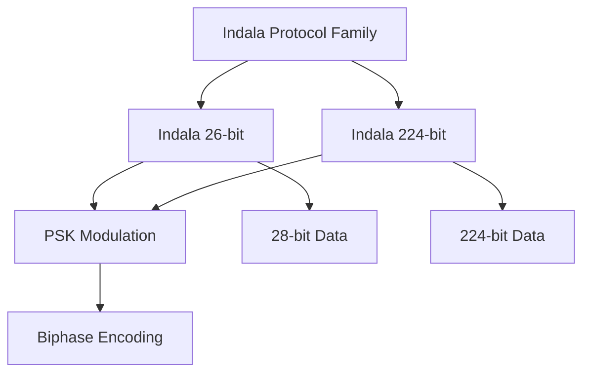
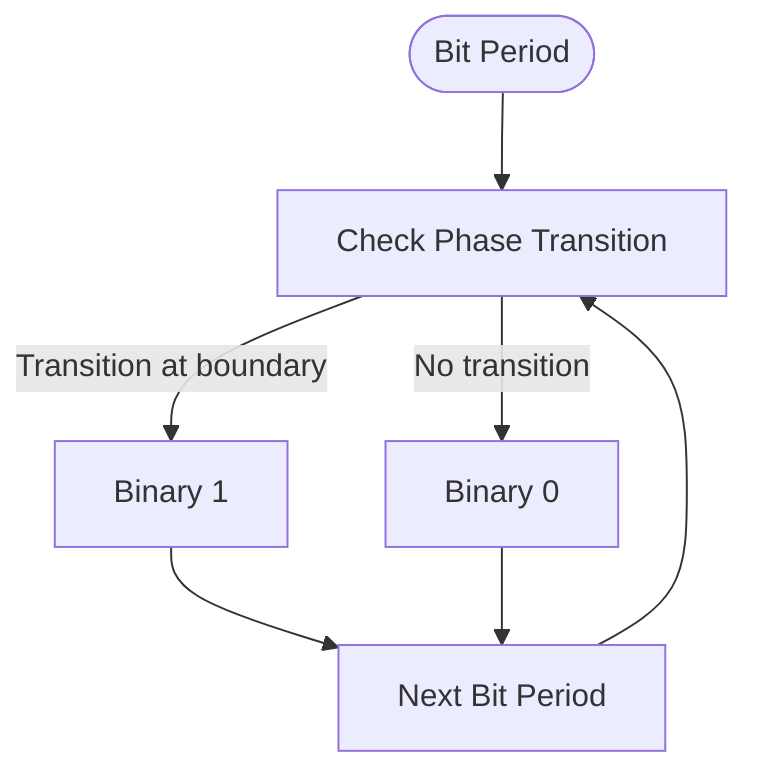
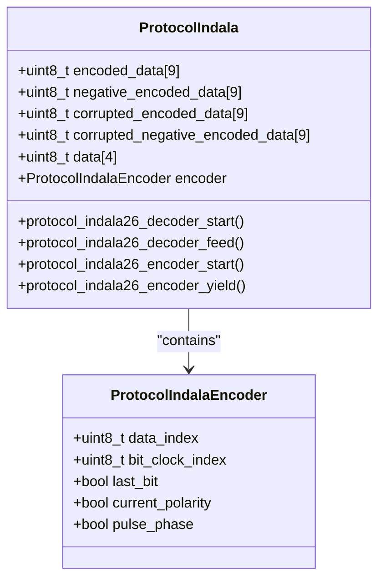
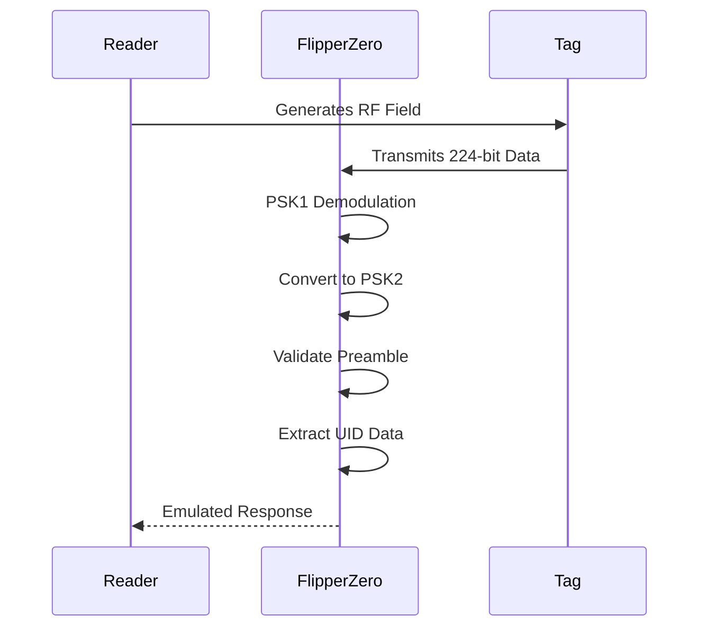
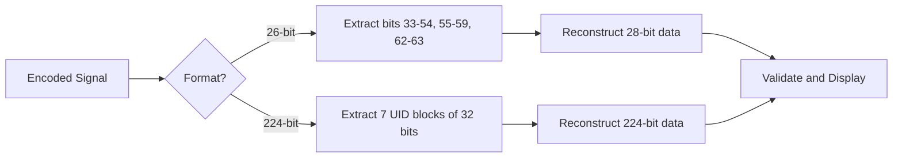
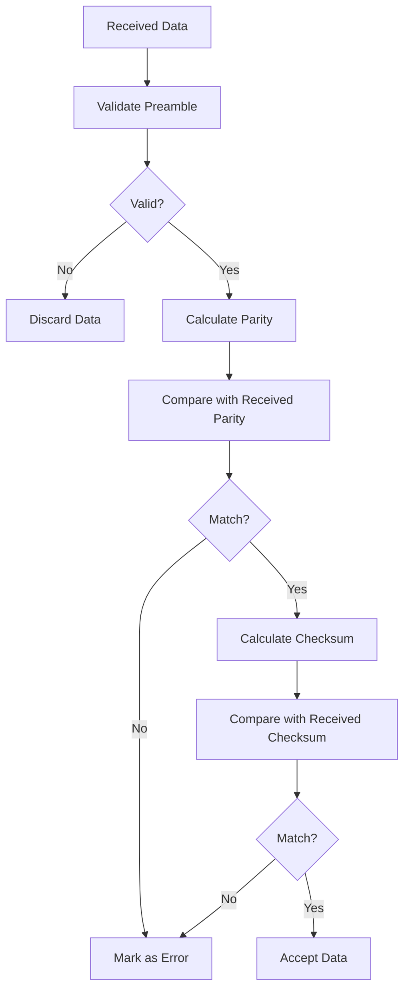
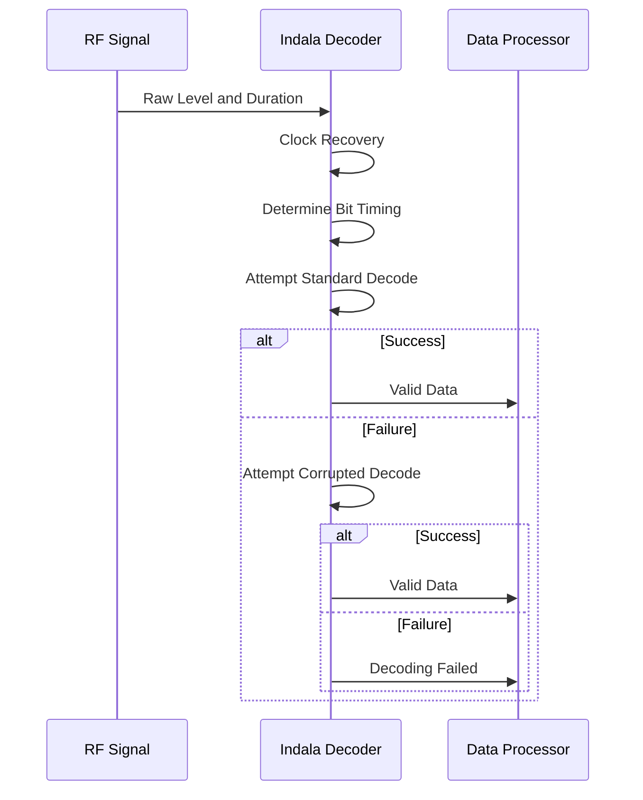
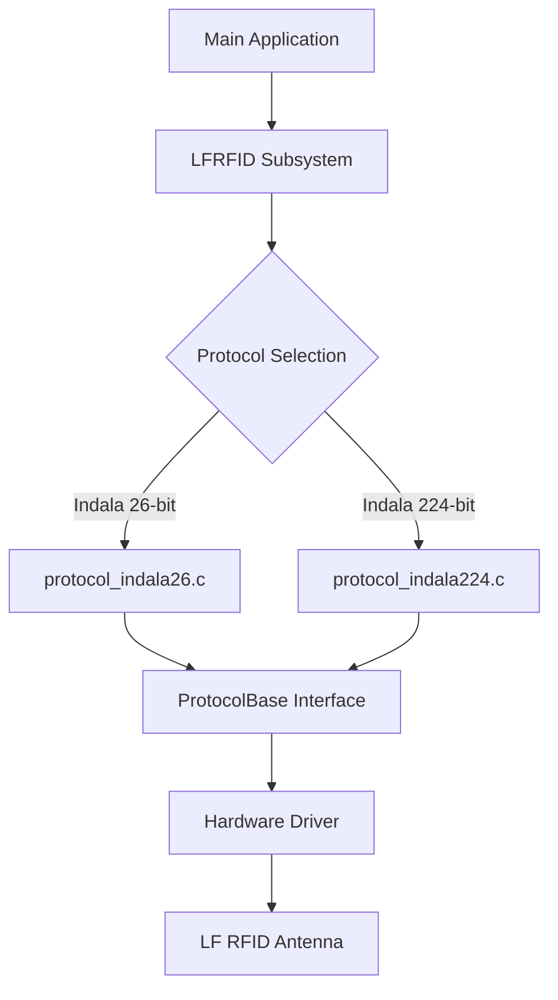
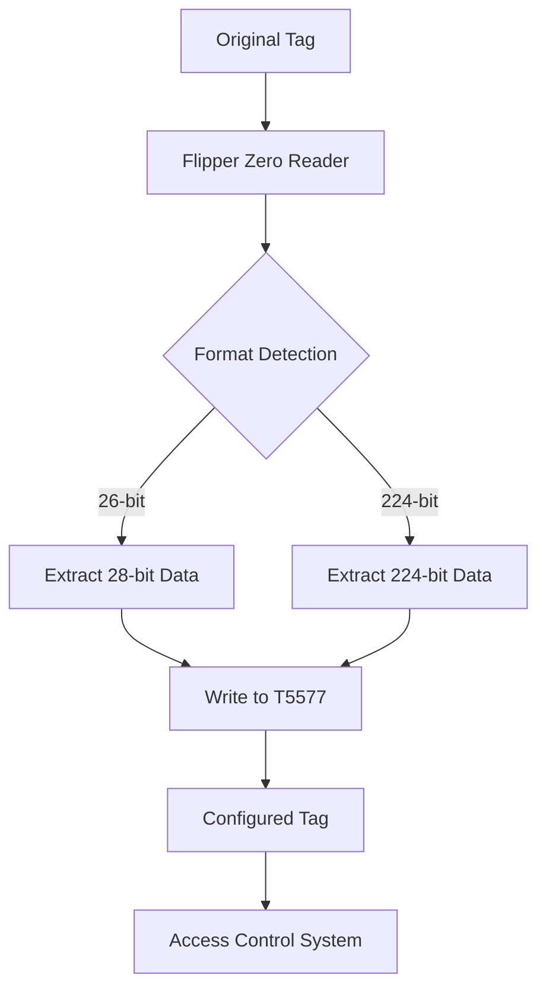

# Indala 26/224 Protocol

<cite>
**Referenced Files in This Document**   
- [protocol_indala26.c](file://lib/lfrfid/protocols/protocol_indala26.c)
- [protocol_indala224.c](file://lib/lfrfid/protocols/protocol_indala224.c)
- [lfrfid_protocols.h](file://lib/lfrfid/protocols/lfrfid_protocols.h)
- [lfrfid_protocols.c](file://lib/lfrfid/protocols/lfrfid_protocols.c)
</cite>

## Table of Contents
1. [Introduction](#introduction)
2. [Indala Protocol Overview](#indala-protocol-overview)
3. [Biphase Encoding Scheme](#biphase-encoding-scheme)
4. [Indala 26-bit Format](#indala-26-bit-format)
5. [Indala 224-bit Format](#indala-224-bit-format)
6. [Data Structure and Bit Mapping](#data-structure-and-bit-mapping)
7. [Error Detection Mechanisms](#error-detection-mechanisms)
8. [Tag Reading Process](#tag-reading-process)
9. [Flipper Zero Implementation](#flipper-zero-implementation)
10. [Cloning and Emulation](#cloning-and-emulation)
11. [Configuration Parameters](#configuration-parameters)
12. [Practical Examples](#practical-examples)

## Introduction
The Indala 26-bit and 224-bit LF RFID protocols are proprietary access control systems developed by Motorola. These protocols utilize a unique biphase encoding scheme and operate at low frequency (LF) for proximity card applications. This document provides a comprehensive analysis of both Indala formats, their implementation in the Flipper Zero firmware, and practical guidance for working with Indala-based access systems.

**Section sources**
- [protocol_indala26.c](file://lib/lfrfid/protocols/protocol_indala26.c)
- [protocol_indala224.c](file://lib/lfrfid/protocols/protocol_indala224.c)

## Indala Protocol Overview
The Indala protocol family consists of two primary formats: 26-bit and 224-bit, both using phase-shift keying (PSK) modulation. These protocols are designed for access control systems and are characterized by their proprietary biphase encoding scheme. The Flipper Zero firmware implements both formats through dedicated protocol handlers that manage encoding, decoding, and emulation.

The protocols are registered in the system through the `lfrfid_protocols` array, which maps protocol identifiers to their respective implementation structures. Both Indala formats are identified by their unique names and manufacturer (Motorola) in the protocol base structure.



**Diagram sources**
- [lfrfid_protocols.h](file://lib/lfrfid/protocols/lfrfid_protocols.h)
- [lfrfid_protocols.c](file://lib/lfrfid/protocols/lfrfid_protocols.c)

**Section sources**
- [lfrfid_protocols.h](file://lib/lfrfid/protocols/lfrfid_protocols.h)
- [lfrfid_protocols.c](file://lib/lfrfid/protocols/lfrfid_protocols.c)

## Biphase Encoding Scheme
Indala protocols use a proprietary biphase encoding scheme based on phase-shift keying (PSK) modulation. This encoding method represents data bits through phase transitions in the carrier signal rather than amplitude changes. The implementation in Flipper Zero uses PSK1 demodulation internally, which is then converted to PSK2 for the 224-bit format.

The encoding process divides each bit period into two halves, with phase transitions occurring at bit boundaries to represent binary values. For Indala protocols, a phase transition at the beginning of a bit period represents a binary 1, while no transition represents a binary 0. This biphase approach provides inherent clock recovery capabilities and improved noise immunity.

The timing parameters for both Indala formats are identical:
- **Bit duration**: 255 microseconds per bit
- **Pulses per bit**: 16 encoder pulses
- **Modulation**: PSK (Phase-Shift Keying)



**Diagram sources**
- [protocol_indala26.c](file://lib/lfrfid/protocols/protocol_indala26.c#L25-L26)
- [protocol_indala224.c](file://lib/lfrfid/protocols/protocol_indala224.c#L27-L28)

**Section sources**
- [protocol_indala26.c](file://lib/lfrfid/protocols/protocol_indala26.c)
- [protocol_indala224.c](file://lib/lfrfid/protocols/protocol_indala224.c)

## Indala 26-bit Format
The Indala 26-bit format is a compact access control protocol that encodes 28 bits of data in a 64-bit transmission frame. Despite its name, the format actually uses 28 data bits, with the remaining bits dedicated to preamble, error detection, and formatting.

The transmission structure consists of:
- **Preamble**: 33 bits (10100000 00000000 00000000 00000000 1)
- **Encoded data**: 64 bits total
- **Decoded data**: 28 bits (4 bytes)

The protocol implementation includes robust error handling through multiple validation mechanisms. The decoder attempts to decode signals with different phase alignments to accommodate timing variations in real-world reading scenarios.



**Diagram sources**
- [protocol_indala26.c](file://lib/lfrfid/protocols/protocol_indala26.c#L29-L47)

**Section sources**
- [protocol_indala26.c](file://lib/lfrfid/protocols/protocol_indala26.c)

## Indala 224-bit Format
The Indala 224-bit format is a more comprehensive access control protocol that encodes 224 bits of data in a correspondingly larger transmission frame. This format is designed for applications requiring longer unique identifiers and enhanced security features.

The transmission structure consists of:
- **Preamble**: 32 bits (10000000 00000000 00000000 00000001)
- **Encoded data**: 224 bits total
- **Decoded data**: 224 bits (28 bytes)

Unlike the 26-bit format, the 224-bit implementation includes a data conversion step between PSK1 and PSK2 demodulation formats. This conversion is necessary to maintain compatibility with the proprietary Indala encoding scheme while working within the Flipper Zero's signal processing framework.



**Diagram sources**
- [protocol_indala224.c](file://lib/lfrfid/protocols/protocol_indala224.c#L29-L48)

**Section sources**
- [protocol_indala224.c](file://lib/lfrfid/protocols/protocol_indala224.c)

## Data Structure and Bit Mapping
The data structure for both Indala formats follows a specific bit mapping pattern that differs from standard encoding schemes. The implementation in Flipper Zero carefully reconstructs the original data from the received signal by copying bits from specific positions in the encoded data to the decoded data structure.

For the **Indala 26-bit format**, the data mapping is as follows:
- **Bits 33-54**: 22 bits copied to decoded data bits 0-21
- **Bits 55-59**: 5 bits copied to decoded data bits 22-26
- **Bits 62-63**: 2 bits copied to decoded data bits 27-28

For the **Indala 224-bit format**, the data mapping is more straightforward:
- **Bits 0-31**: UID 1 (32 bits)
- **Bits 32-63**: UID 2 (32 bits)
- **Bits 64-95**: UID 3 (32 bits)
- **Bits 96-127**: UID 4 (32 bits)
- **Bits 128-159**: UID 5 (32 bits)
- **Bits 160-191**: UID 6 (32 bits)
- **Bits 192-223**: UID 7 (32 bits)



**Diagram sources**
- [protocol_indala26.c](file://lib/lfrfid/protocols/protocol_indala26.c#L108-L111)
- [protocol_indala224.c](file://lib/lfrfid/protocols/protocol_indala224.c#L138-L145)

**Section sources**
- [protocol_indala26.c](file://lib/lfrfid/protocols/protocol_indala26.c)
- [protocol_indala224.c](file://lib/lfrfid/protocols/protocol_indala224.c)

## Error Detection Mechanisms
Indala protocols implement multiple error detection mechanisms to ensure data integrity during transmission and reception. The 26-bit format includes both Wiegand-style parity checking and a proprietary checksum mechanism, while the 224-bit format relies primarily on preamble validation and phase consistency.

For the **Indala 26-bit format**, the error detection includes:
- **Even parity**: Calculated over bits 12-23 of the facility code and card number
- **Odd parity**: Calculated over bits 0-11 of the facility code and card number
- **Checksum**: An 8-bit checksum calculated from specific bit positions

The implementation validates these error detection mechanisms in the `protocol_indala26_render_data_internal` function, which calculates the expected parity and checksum values and compares them with the received data.



**Diagram sources**
- [protocol_indala26.c](file://lib/lfrfid/protocols/protocol_indala26.c#L230-L280)

**Section sources**
- [protocol_indala26.c](file://lib/lfrfid/protocols/protocol_indala26.c)

## Tag Reading Process
The tag reading process for Indala protocols involves several stages: clock recovery, data decoding, and validation. The Flipper Zero implementation handles these stages through a stateful decoder that processes incoming signal levels and durations.

The process begins with **clock recovery**, where the system determines the bit timing from the incoming signal. This is achieved by measuring the duration of signal levels and aligning them with the expected bit period of 255 microseconds. The decoder then proceeds to **data decoding**, where it reconstructs the bit stream from the phase transitions.

The implementation includes multiple decoding attempts to handle phase misalignment:
1. Standard decoding with positive polarity
2. Standard decoding with negative polarity
3. Corrupted data decoding with adjusted timing
4. Corrupted data decoding with inverted polarity

This multi-attempt approach increases the success rate of reading tags with weak or distorted signals.



**Diagram sources**
- [protocol_indala26.c](file://lib/lfrfid/protocols/protocol_indala26.c#L120-L190)
- [protocol_indala224.c](file://lib/lfrfid/protocols/protocol_indala224.c#L160-L230)

**Section sources**
- [protocol_indala26.c](file://lib/lfrfid/protocols/protocol_indala26.c)
- [protocol_indala224.c](file://lib/lfrfid/protocols/protocol_indala224.c)

## Flipper Zero Implementation
The Flipper Zero firmware implements both Indala protocols through dedicated C modules that follow a consistent design pattern. Each protocol has its own source file (`protocol_indala26.c` and `protocol_indala224.c`) that defines the protocol-specific functions and data structures.

The implementation follows the ProtocolBase structure defined in `lfrfid_protocols.h`, which provides a standardized interface for all LF RFID protocols. This structure includes function pointers for allocation, deallocation, data retrieval, decoding, encoding, and rendering.

Key components of the implementation:
- **Protocol allocation**: Memory management for protocol instances
- **Decoder functions**: Signal processing and data extraction
- **Encoder functions**: Signal generation for emulation
- **Data rendering**: Formatting data for display
- **Write functions**: Writing data to compatible tags

The protocols are registered in the global `lfrfid_protocols` array, making them accessible to the main application through the protocol enumeration.



**Diagram sources**
- [lfrfid_protocols.h](file://lib/lfrfid/protocols/lfrfid_protocols.h)
- [lfrfid_protocols.c](file://lib/lfrfid/protocols/lfrfid_protocols.c)
- [protocol_indala26.c](file://lib/lfrfid/protocols/protocol_indala26.c)
- [protocol_indala224.c](file://lib/lfrfid/protocols/protocol_indala224.c)

**Section sources**
- [lfrfid_protocols.h](file://lib/lfrfid/protocols/lfrfid_protocols.h)
- [lfrfid_protocols.c](file://lib/lfrfid/protocols/lfrfid_protocols.c)
- [protocol_indala26.c](file://lib/lfrfid/protocols/protocol_indala26.c)
- [protocol_indala224.c](file://lib/lfrfid/protocols/protocol_indala224.c)

## Cloning and Emulation
The Flipper Zero can clone and emulate both Indala 26-bit and 224-bit cards using its LF RFID capabilities. The emulation process involves generating the appropriate PSK-modulated signal that mimics the behavior of a genuine Indala tag.

For **cloning**, the process is:
1. Read the original tag using the LF RFID reader
2. Extract and validate the data
3. Write the data to a compatible tag (T5577)

For **emulation**, the process is:
1. Load the tag data into memory
2. Configure the LF RFID hardware for PSK modulation
3. Generate the signal when triggered by a reader

The write functionality is implemented in the `write_data` functions of both protocols, which configure the T5577 tag with the appropriate settings:
- **Bit rate**: RF/32
- **Modulation**: PSK1 for 26-bit, PSK2 for 224-bit
- **Max block**: 2 for 26-bit, 7 for 224-bit



**Diagram sources**
- [protocol_indala26.c](file://lib/lfrfid/protocols/protocol_indala26.c#L300-L315)
- [protocol_indala224.c](file://lib/lfrfid/protocols/protocol_indala224.c#L300-L315)

**Section sources**
- [protocol_indala26.c](file://lib/lfrfid/protocols/protocol_indala26.c)
- [protocol_indala224.c](file://lib/lfrfid/protocols/protocol_indala224.c)

## Configuration Parameters
The Indala protocol implementations include several configuration parameters that define their behavior and compatibility with different variants of the protocol. These parameters are defined as preprocessor macros at the beginning of each source file.

For both formats, the key configuration parameters are:
- **US_PER_BIT**: 255 microseconds (signal timing)
- **ENCODER_PULSES_PER_BIT**: 16 (signal resolution)
- **FEATURES**: LFRFIDFeaturePSK (modulation type)

The 26-bit format specific parameters:
- **PREAMBLE_BIT_SIZE**: 33 bits
- **ENCODED_BIT_SIZE**: 64 bits
- **DECODED_BIT_SIZE**: 28 bits
- **DECODED_DATA_SIZE**: 4 bytes

The 224-bit format specific parameters:
- **PREAMBLE_BIT_SIZE**: 32 bits
- **ENCODED_BIT_SIZE**: 224 bits
- **DECODED_BIT_SIZE**: 224 bits
- **DECODED_DATA_SIZE**: 28 bytes

These parameters ensure that the Flipper Zero can accurately read and emulate Indala tags by matching the timing and data structure requirements of each format.

**Section sources**
- [protocol_indala26.c](file://lib/lfrfid/protocols/protocol_indala26.c#L10-L26)
- [protocol_indala224.c](file://lib/lfrfid/protocols/protocol_indala224.c#L10-L28)

## Practical Examples
Working with Indala-based access systems using the Flipper Zero involves several practical steps. Here are common scenarios and their implementation:

**Reading an Indala 26-bit card:**
1. Navigate to LF RFID menu
2. Select "Read" option
3. Place the card near the Flipper Zero
4. The device will automatically detect the Indala 26-bit format
5. Display facility code and card number with parity and checksum status

**Cloning to a T5577 tag:**
```c
// Example configuration for T5577 write operation
request->t5577.block[0] = LFRFID_T5577_BITRATE_RF_32 | 
                         LFRFID_T5577_MODULATION_PSK1 |
                         (2 << LFRFID_T5577_MAXBLOCK_SHIFT);
request->t5577.block[1] = first_32_bits_of_encoded_data;
request->t5577.block[2] = second_32_bits_of_encoded_data;
request->t5577.blocks_to_write = 3;
```

**Emulating an Indala 224-bit card:**
1. Load the saved tag data
2. Select "Emulate" option
3. The Flipper Zero will generate the PSK-modulated signal
4. Present the device to the reader
5. The access control system will read the emulated tag

These practical examples demonstrate the versatility of the Flipper Zero in working with Indala-based access systems, from simple reading to advanced cloning and emulation scenarios.

**Section sources**
- [protocol_indala26.c](file://lib/lfrfid/protocols/protocol_indala26.c)
- [protocol_indala224.c](file://lib/lfrfid/protocols/protocol_indala224.c)