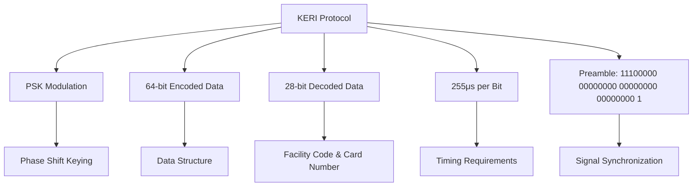
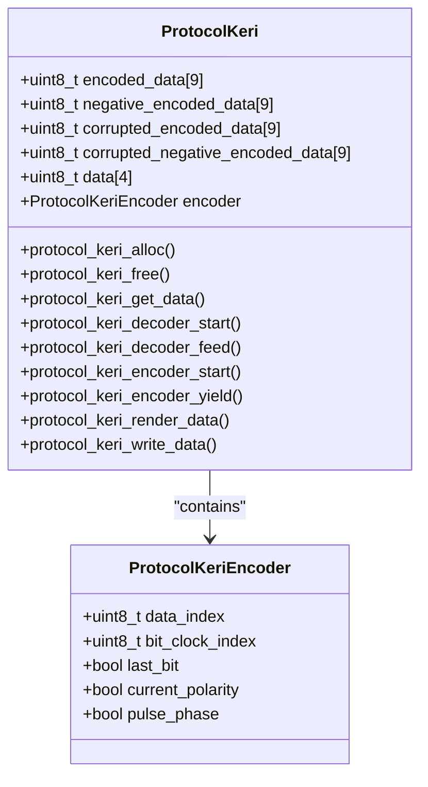
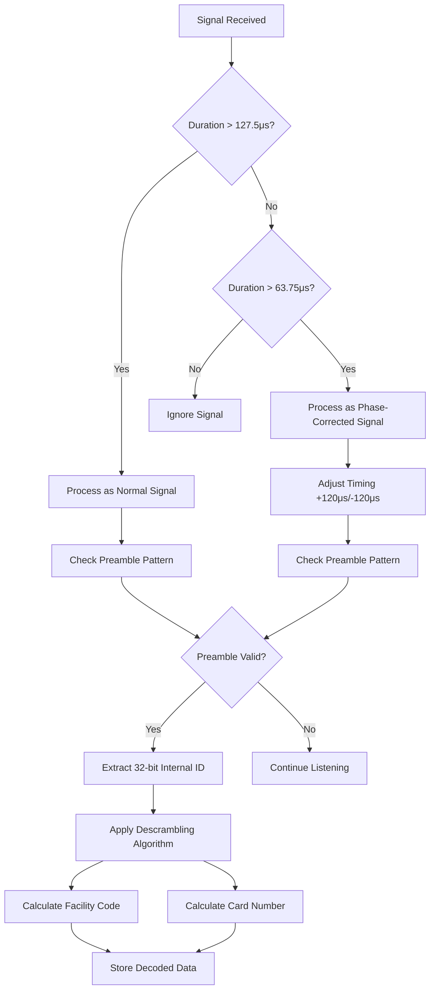
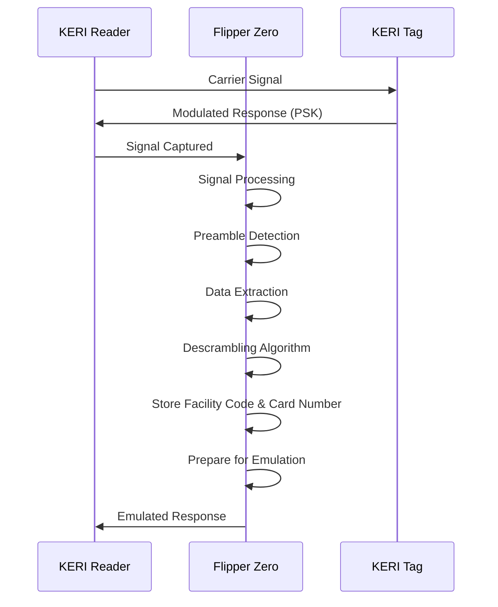
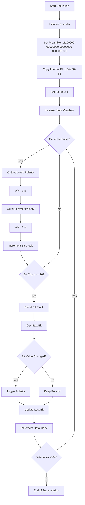

# KERI Protocol

<cite>
**Referenced Files in This Document**   
- [protocol_keri.c](file://lib/lfrfid/protocols/protocol_keri.c)
- [protocol_keri.h](file://lib/lfrfid/protocols/protocol_keri.h)
- [lfrfid_protocols.h](file://lib/lfrfid/protocols/lfrfid_protocols.h)
- [lfrfid_protocols.c](file://lib/lfrfid/protocols/lfrfid_protocols.c)
- [lfrfid.c](file://applications/main/lfrfid/lfrfid.c)
- [lfrfid_worker.h](file://lib/lfrfid/lfrfid_worker.h)
</cite>

## Table of Contents
1. [Introduction](#introduction)
2. [KERI Protocol Overview](#keri-protocol-overview)
3. [Data Structure and Encoding](#data-structure-and-encoding)
4. [Signal Analysis and Decoding](#signal-analysis-and-decoding)
5. [Tag Reading and Cloning Process](#tag-reading-and-cloning-process)
6. [Flipper Zero Emulation](#flipper-zero-emulation)
7. [Configuration Parameters](#configuration-parameters)
8. [Practical Examples](#practical-examples)
9. [Error Checking and Validation](#error-checking-and-validation)
10. [Conclusion](#conclusion)

## Introduction
The KERI protocol is a proprietary RFID access control system that utilizes a unique encoding scheme for secure authentication. This document provides a comprehensive analysis of the KERI LF RFID protocol implementation within the Flipper Zero firmware, detailing its data structure, bit encoding, transmission format, and emulation capabilities. The analysis is based on the source code from the repository, focusing on the specific implementation details that enable the Flipper Zero to interact with KERI-based access systems.

**Section sources**
- [protocol_keri.c](file://lib/lfrfid/protocols/protocol_keri.c#L1-L295)
- [lfrfid_protocols.h](file://lib/lfrfid/protocols/lfrfid_protocols.h#L1-L59)

## KERI Protocol Overview
The KERI protocol is implemented as part of the LF RFID subsystem in the Flipper Zero firmware. It is designed to work with low-frequency RFID systems that use PSK (Phase Shift Keying) modulation. The protocol is registered within the LF RFID protocol registry and is identified by the enum value `LFRFIDProtocolKeri`. The implementation supports both reading and emulating KERI cards, allowing the Flipper Zero to function as a universal access device for KERI-based systems.

The protocol is characterized by specific timing parameters and a unique data scrambling algorithm that converts internal card identifiers into facility codes and card numbers. The implementation includes both encoder and decoder functionality, enabling the device to both interpret signals from KERI readers and generate responses that mimic authentic KERI cards.

**Diagram sources**
- [protocol_keri.c](file://lib/lfrfid/protocols/protocol_keri.c#L5-L16)
- [lfrfid_protocols.h](file://lib/lfrfid/protocols/lfrfid_protocols.h#L38)

**Section sources**
- [protocol_keri.c](file://lib/lfrfid/protocols/protocol_keri.c#L1-L295)
- [lfrfid_protocols.c](file://lib/lfrfid/protocols/lfrfid_protocols.c#L1-L55)

## Data Structure and Encoding
The KERI protocol uses a specific data structure with defined bit sizes for encoded and decoded data. The encoded data consists of 64 bits, while the decoded data contains 28 bits of information. The protocol employs a preamble of 33 bits (11100000 00000000 00000000 00000000 1) that appears twice in the transmission for synchronization purposes.

The data structure is defined by several key constants in the implementation:
- `KERI_ENCODED_BIT_SIZE`: 64 bits of encoded data
- `KERI_DECODED_BIT_SIZE`: 28 bits of decoded data
- `KERI_US_PER_BIT`: 255 microseconds per bit
- `KERI_ENCODER_PULSES_PER_BIT`: 16 pulses per bit

The encoding process converts a 28-bit internal identifier into a 64-bit encoded format that includes the preamble and scrambled data. The scrambling algorithm uses two lookup tables (`card_to_id` and `card_to_fc`) to map bits from the internal identifier to the final facility code and card number values.

**Diagram sources**
- [protocol_keri.c](file://lib/lfrfid/protocols/protocol_keri.c#L27-L35)
- [protocol_keri.c](file://lib/lfrfid/protocols/protocol_keri.c#L168-L184)

**Section sources**
- [protocol_keri.c](file://lib/lfrfid/protocols/protocol_keri.c#L5-L35)

## Signal Analysis and Decoding
The KERI protocol decoding process involves analyzing the signal timing and phase to extract the encoded data. The implementation uses a sophisticated decoder that can handle signals with different polarities and phase alignments. The decoder processes the signal in chunks, checking for the preamble pattern at the beginning of the transmission.

The decoding algorithm works as follows:
1. Check for the 33-bit preamble pattern (11100000 00000000 00000000 00000000 1)
2. Process the signal duration to determine the number of bits
3. Handle both positive and negative polarity signals
4. Correct for phase synchronization errors
5. Extract the 32-bit internal identifier from bits 32-63
6. Apply the descrambling algorithm to convert to facility code and card number

The decoder is designed to be robust against signal variations, with special handling for "corrupted" data that may have timing issues. It attempts to decode the signal with adjusted timing parameters if the initial decode attempt fails.

**Diagram sources**
- [protocol_keri.c](file://lib/lfrfid/protocols/protocol_keri.c#L71-L121)
- [protocol_keri.c](file://lib/lfrfid/protocols/protocol_keri.c#L122-L167)

**Section sources**
- [protocol_keri.c](file://lib/lfrfid/protocols/protocol_keri.c#L56-L167)

## Tag Reading and Cloning Process
The process of reading and cloning KERI tags involves several steps that leverage the Flipper Zero's LF RFID capabilities. When a KERI tag is presented to the reader, the device captures the signal and processes it through the KERI decoder. The decoded data is then stored in the device's memory for later use.

The reading process begins with the LF RFID worker detecting the presence of a signal and determining its modulation type. For KERI tags, this is PSK modulation. The worker then passes the raw signal data to the KERI protocol decoder, which extracts the facility code and card number from the internal identifier using the descrambling algorithm.

Cloning a KERI tag involves writing the decoded data to a writable RFID chip, such as a T5577. The Flipper Zero supports this operation through its write functionality, which configures the target chip with the appropriate settings to emulate a KERI card. The write process includes setting the modulation type to PSK1, configuring the data rate, and programming the encoded data pattern.

**Diagram sources**
- [protocol_keri.c](file://lib/lfrfid/protocols/protocol_keri.c#L168-L184)
- [lfrfid_worker.h](file://lib/lfrfid/lfrfid_worker.h#L1-L166)

**Section sources**
- [protocol_keri.c](file://lib/lfrfid/protocols/protocol_keri.c#L168-L295)
- [lfrfid_worker.h](file://lib/lfrfid/lfrfid_worker.h#L1-L166)

## Flipper Zero Emulation
The Flipper Zero can emulate KERI cards using its LF RFID emulation capabilities. The emulation process begins with the `protocol_keri_encoder_start` function, which initializes the encoder with the preamble and the encoded data. The encoder then generates a sequence of level and duration pairs that represent the PSK-modulated signal.

The emulation timing is critical for successful communication with KERI readers. Each bit is represented by 16 pulses (defined by `KERI_ENCODER_PULSES_PER_BIT`) with a duration of 255μs per bit (defined by `KERI_US_PER_BIT`). The encoder maintains state information including the current data index, bit clock index, polarity, and pulse phase to ensure accurate signal generation.

When emulating a KERI card, the Flipper Zero must be positioned correctly relative to the reader to ensure proper coupling. The device's antenna design and the orientation of the device can affect the strength and quality of the transmitted signal. Successful emulation requires that the generated signal matches the timing and modulation characteristics expected by the KERI reader.

**Diagram sources**
- [protocol_keri.c](file://lib/lfrfid/protocols/protocol_keri.c#L168-L184)
- [protocol_keri.c](file://lib/lfrfid/protocols/protocol_keri.c#L184-L205)

**Section sources**
- [protocol_keri.c](file://lib/lfrfid/protocols/protocol_keri.c#L168-L205)

## Configuration Parameters
The KERI protocol implementation includes several configuration parameters that affect its operation. These parameters are defined as constants in the source code and control various aspects of the encoding and decoding process.

Key configuration parameters include:
- `KERI_US_PER_BIT`: Set to 255 microseconds, this defines the duration of each bit in the transmission
- `KERI_ENCODER_PULSES_PER_BIT`: Set to 16, this determines how many pulses are used to represent each bit
- `KERI_ENCODED_BIT_SIZE`: Set to 64, this defines the total number of bits in the encoded data
- `KERI_DECODED_BIT_SIZE`: Set to 28, this defines the number of bits in the decoded data

The protocol also includes configuration for the scrambling algorithm, which uses two lookup tables to map the internal identifier bits to facility code and card number bits. These tables are hardcoded in the implementation and cannot be modified without recompiling the firmware.

When configuring the Flipper Zero for KERI emulation, users must ensure that the device is set to the correct protocol type and that the facility code and card number are properly entered. The device's user interface provides options for entering these values and selecting the appropriate emulation mode.

**Section sources**
- [protocol_keri.c](file://lib/lfrfid/protocols/protocol_keri.c#L5-L16)

## Practical Examples
Practical use of the KERI protocol implementation involves several common scenarios:

1. **Reading a KERI Card**: Place the KERI card near the Flipper Zero and use the LF RFID read function. The device will detect the PSK modulation, decode the signal, and display the facility code and card number.

2. **Cloning to T5577**: After reading a KERI card, select the "Write to T5577" option. The device will configure the T5577 chip with PSK1 modulation, set the appropriate data rate, and program the encoded data pattern.

3. **Emulating a KERI Card**: Select a stored KERI card from the device's database and choose the "Emulate" option. The Flipper Zero will generate a PSK-modulated signal that mimics the original card.

4. **Manual Entry**: For known facility codes and card numbers, users can manually enter these values through the device's interface and create a new KERI card entry.

These operations are accessible through the Flipper Zero's user interface, which provides a menu-driven system for managing RFID cards. The device stores card data in its internal storage, allowing users to maintain a collection of access credentials.

**Section sources**
- [lfrfid.c](file://applications/main/lfrfid/lfrfid.c#L1-L386)
- [protocol_keri.c](file://lib/lfrfid/protocols/protocol_keri.c#L244-L295)

## Error Checking and Validation
The KERI protocol implementation includes several error checking and validation mechanisms to ensure reliable operation. The decoder performs multiple checks on the received signal to verify its integrity:

1. **Preamble Validation**: The decoder checks for the presence of the 33-bit preamble pattern at the beginning of the transmission. This pattern must appear twice (at bit positions 0 and 64) for the signal to be considered valid.

2. **Timing Validation**: The decoder verifies that signal durations are consistent with the expected bit timing. Signals with durations significantly shorter than 127.5μs (half of KERI_US_PER_BIT) are ignored.

3. **Phase Correction**: The implementation includes logic to handle signals with incorrect phase alignment by adjusting the timing parameters and attempting to decode the signal again.

4. **Data Integrity**: The decoder uses multiple buffers to store different interpretations of the signal (normal, negative, corrupted) and selects the one that produces a valid preamble.

The validation process is designed to be robust against noise and signal degradation, allowing the device to successfully read cards even in suboptimal conditions. However, extremely weak signals or severe interference may still result in failed reads.

**Section sources**
- [protocol_keri.c](file://lib/lfrfid/protocols/protocol_keri.c#L56-L121)

## Conclusion
The KERI protocol implementation in the Flipper Zero firmware provides a comprehensive solution for interacting with KERI-based access control systems. The implementation accurately models the proprietary encoding scheme used by KERI cards, allowing the device to both read and emulate these cards with high reliability.

Key aspects of the implementation include the precise timing parameters, the unique scrambling algorithm for converting internal identifiers to facility codes and card numbers, and the robust error handling that ensures reliable operation in various conditions. The integration with the Flipper Zero's LF RFID subsystem enables seamless reading, cloning, and emulation of KERI cards.

This documentation provides a detailed understanding of the KERI protocol's inner workings, which can be valuable for security researchers, access control professionals, and enthusiasts interested in RFID technology. The information presented here can be used to troubleshoot issues, optimize emulation performance, and understand the security characteristics of KERI-based systems.