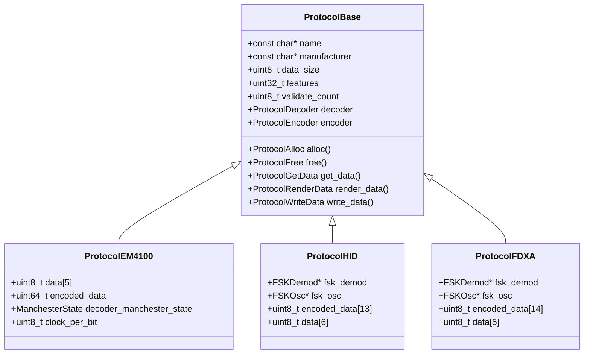
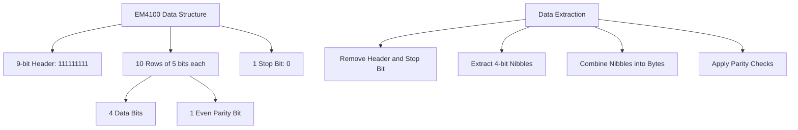
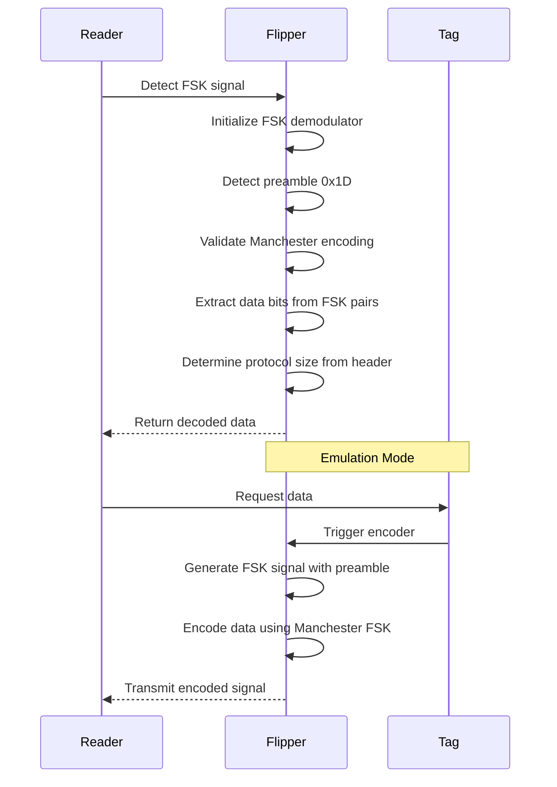
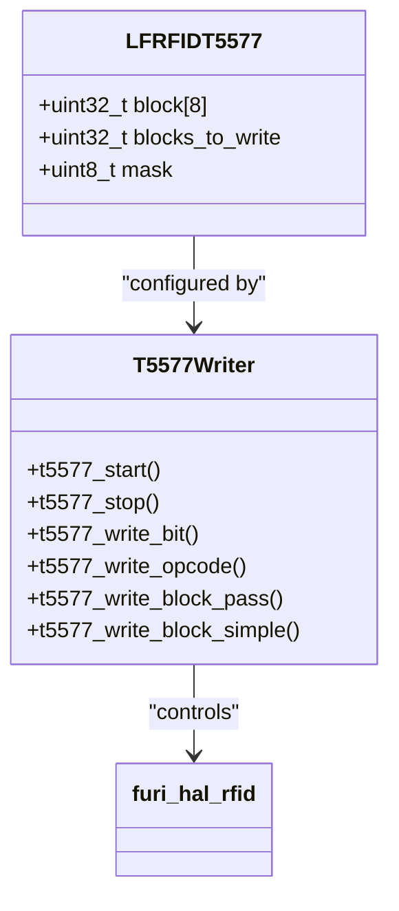
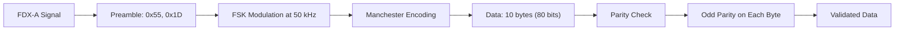
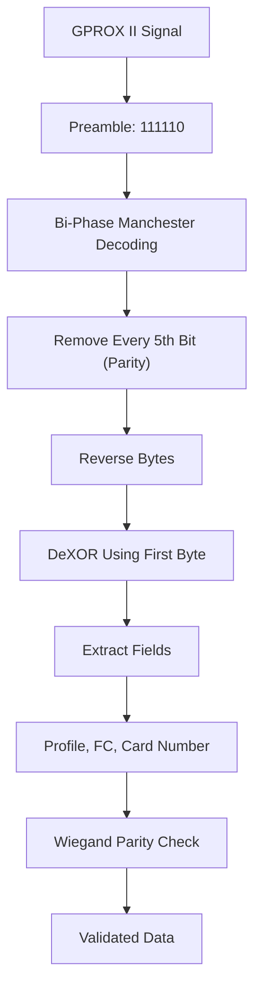
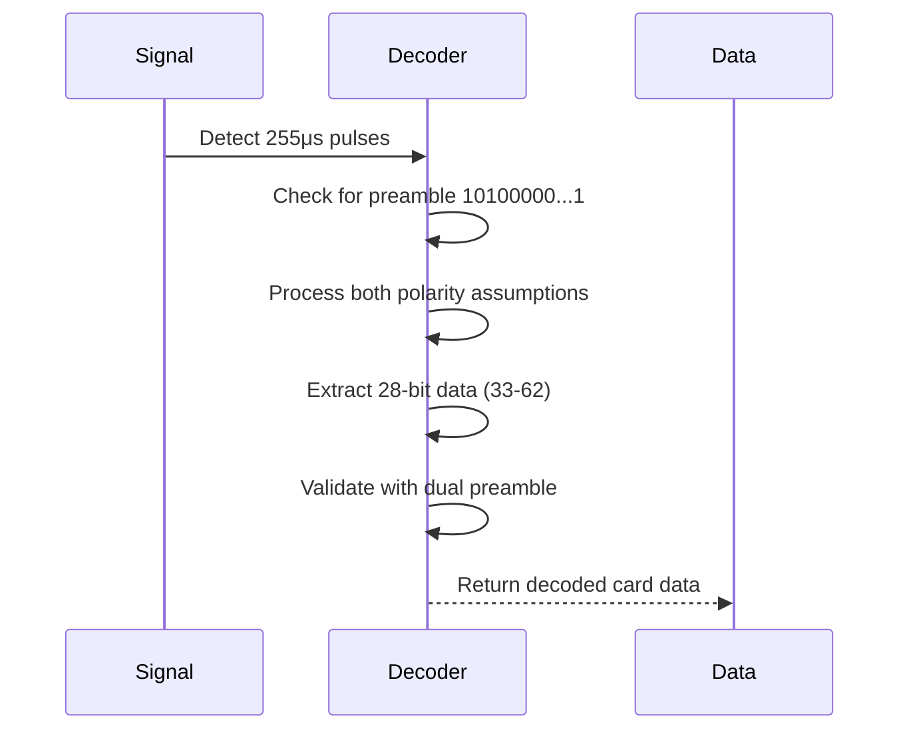
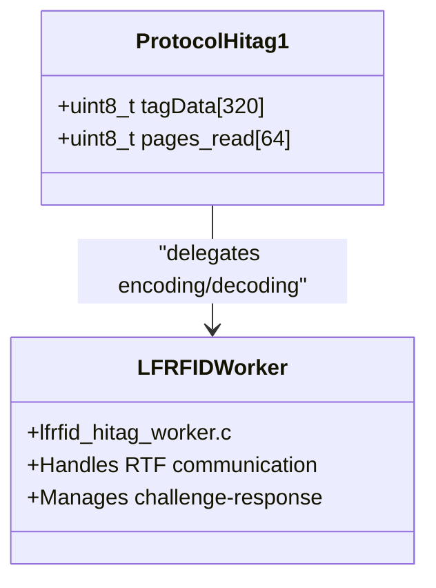

# LF RFID Protocols

<cite>
**Referenced Files in This Document**   
- [lfrfid_protocols.h](file://lib/lfrfid/protocols/lfrfid_protocols.h)
- [lfrfid_protocols.c](file://lib/lfrfid/protocols/lfrfid_protocols.c)
- [protocol_em4100.c](file://lib/lfrfid/protocols/protocol_em4100.c)
- [protocol_hid_generic.c](file://lib/lfrfid/protocols/protocol_hid_generic.c)
- [t5577.h](file://lib/lfrfid/tools/t5577.h)
- [t5577.c](file://lib/lfrfid/tools/t5577.c)
- [protocol_fdx_a.c](file://lib/lfrfid/protocols/protocol_fdx_a.c)
- [protocol_gproxii.c](file://lib/lfrfid/protocols/protocol_gproxii.c)
- [protocol_indala26.c](file://lib/lfrfid/protocols/protocol_indala26.c)
- [protocol_hitag1.c](file://lib/lfrfid/protocols/protocol_hitag1.c)
- [lfrfid_worker.h](file://lib/lfrfid/lfrfid_worker.h)
</cite>

## Table of Contents
1. [Introduction](#introduction)
2. [Protocol Registry System](#protocol-registry-system)
3. [EM4100 Protocol](#em4100-protocol)
4. [HID Prox Protocol](#hid-prox-protocol)
5. [T5577 Protocol](#t5577-protocol)
6. [FDX-A/B Protocol](#fdx-ab-protocol)
7. [GPROX II Protocol](#gprox-ii-protocol)
8. [Indala 26/224 Protocol](#indala-26224-protocol)
9. [HITAG1 Protocol](#hitag1-protocol)
10. [Tag Reading, Writing, and Emulation](#tag-reading-writing-and-emulation)

## Introduction
The Flipper Zero supports a comprehensive range of Low Frequency (LF) RFID protocols used in access control, animal identification, and security systems. This document details the technical specifications, implementation details, and operational characteristics of the supported LF RFID protocols. The system is designed to read, write, clone, and emulate various RFID tags through a modular architecture that separates protocol-specific logic from the core RFID hardware interface. The protocols vary in modulation schemes, data encoding methods, clock frequencies, and data representation, requiring specialized decoding and encoding algorithms for each type.

**Section sources**
- [lfrfid_protocols.h](file://lib/lfrfid/protocols/lfrfid_protocols.h#L1-L59)
- [lfrfid_protocols.c](file://lib/lfrfid/protocols/lfrfid_protocols.c#L1-L55)

## Protocol Registry System
The LF RFID protocol system in Flipper Zero employs a centralized registry pattern that allows for extensible support of multiple RFID protocols. The registry is implemented as a global array of protocol descriptors, enabling dynamic protocol selection and management.



**Diagram sources**
- [lfrfid_protocols.h](file://lib/lfrfid/protocols/lfrfid_protocols.h#L1-L59)
- [protocol_em4100.c](file://lib/lfrfid/protocols/protocol_em4100.c#L1-L457)
- [protocol_hid_generic.c](file://lib/lfrfid/protocols/protocol_hid_generic.c#L1-L289)
- [protocol_fdx_a.c](file://lib/lfrfid/protocols/protocol_fdx_a.c#L1-L249)

The protocol registry is defined in `lfrfid_protocols.h` and implemented in `lfrfid_protocols.c`. Each protocol is represented by a `ProtocolBase` structure that contains metadata and function pointers for protocol-specific operations. The registry uses an enumeration (`LFRFIDProtocol`) to index protocols, with the actual protocol instances stored in the `lfrfid_protocols[]` array. This design allows for runtime protocol selection and extensibility, as new protocols can be added by implementing the required interface and registering them in the array.

```c
extern const ProtocolBase* lfrfid_protocols[];

const ProtocolBase* lfrfid_protocols[] = {
    [LFRFIDProtocolEM4100] = &protocol_em4100,
    [LFRFIDProtocolHidGeneric] = &protocol_hid_generic,
    [LFRFIDProtocolFDXA] = &protocol_fdx_a,
    // ... other protocols
};
```

The `LFRFIDFeature` enum defines the modulation capabilities of each protocol, including ASK (Amplitude Shift Keying), PSK (Phase Shift Keying), and RTF (Reader Talks First) for bidirectional communication.

**Section sources**
- [lfrfid_protocols.h](file://lib/lfrfid/protocols/lfrfid_protocols.h#L1-L59)
- [lfrfid_protocols.c](file://lib/lfrfid/protocols/lfrfid_protocols.c#L1-L55)

## EM4100 Protocol
The EM4100 protocol is one of the most common LF RFID formats, operating at 125 kHz with ASK modulation and Manchester encoding. It features a 64-bit data structure with built-in error detection through row and column parity checking.



**Diagram sources**
- [protocol_em4100.c](file://lib/lfrfid/protocols/protocol_em4100.c#L1-L457)

The EM4100 implementation uses a dedicated `ProtocolEM4100` structure that manages the decoding state, including Manchester decoding and clock synchronization. The protocol supports three clock rates (64, 32, and 16), which affect the timing of the ASK modulation:

- **Short time**: 256 microseconds (adjusted by clock divisor)
- **Long time**: 512 microseconds (adjusted by clock divisor)
- **Jitter tolerance**: 100 microseconds

The decoding process involves:
1. Validating the 9-bit header (0xFF80000000000000)
2. Checking the stop bit
3. Verifying row parity (even parity for each 5-bit row)
4. Verifying column parity (even parity across all rows for each data column)

The data is organized in 10 rows of 5 bits each (4 data bits + 1 parity bit), followed by a stop bit. The decoded data is 5 bytes (40 bits) extracted from the 40 data bits in the 10 rows.

```c
#define EM_HEADER_POS  (55)
#define EM_HEADER_MASK (0x1FFLLU << EM_HEADER_POS)
#define EM_ROW_COUNT          (10)
#define EM_COLUMN_COUNT       (4)
#define EM_BITS_PER_ROW_COUNT (EM_COLUMN_COUNT + 1)
```

**Section sources**
- [protocol_em4100.c](file://lib/lfrfid/protocols/protocol_em4100.c#L1-L457)

## HID Prox Protocol
The HID Prox protocol uses FSK (Frequency Shift Keying) modulation with Manchester encoding at 50 kHz. It operates with a preamble-based structure and supports variable data lengths determined by the header bits.



**Diagram sources**
- [protocol_hid_generic.c](file://lib/lfrfid/protocols/protocol_hid_generic.c#L1-L289)

The HID Prox implementation uses FSK demodulation with the following timing parameters:
- **Minimum time**: 64 ± 20 microseconds
- **Maximum time**: 80 ± 20 microseconds

The protocol structure includes:
- **Preamble**: 0x1D (repeated at start and end)
- **Data size**: 11 bytes (88 bits encoded)
- **Encoded bit size**: 88 bits (44 Manchester pairs)
- **Decoded data size**: 6 bytes (44 bits)

The decoding process begins with preamble detection, followed by Manchester decoding where:
- FSK pair "01" represents binary 0
- FSK pair "10" represents binary 1

The protocol size is determined by analyzing the header bits:
1. If any of the first six bits is 1, the key size is determined by the position of the first 1
2. If the first six bits are 0:
   - If the seventh bit is 0, the key is 37 bits
   - If the seventh bit is 1, the size continues until the next 1 bit

```c
#define HID_PREAMBLE 0x1D
#define HID_ENCODED_DATA_SIZE (HID_PREAMBLE_SIZE + HID_DATA_SIZE + HID_PREAMBLE_SIZE)
#define HID_DECODED_BIT_SIZE  ((HID_ENCODED_BIT_SIZE - HID_PREAMBLE_SIZE * 8) / 2)
```

**Section sources**
- [protocol_hid_generic.c](file://lib/lfrfid/protocols/protocol_hid_generic.c#L1-L289)

## T5577 Protocol
The T5577 protocol represents a rewritable LF RFID chip that can be programmed to emulate various other protocols. Unlike read-only tags, the T5577 chip can be written to and reconfigured with different modulation schemes and data formats.



**Diagram sources**
- [t5577.h](file://lib/lfrfid/tools/t5577.h#L1-L86)
- [t5577.c](file://lib/lfrfid/tools/t5577.c#L1-L219)

The T5577 chip features 8 blocks of memory (32 bits each) that can be configured for different protocols. Block 0 contains configuration data that determines the modulation scheme, data rate, and other operational parameters:

- **Modulation types**:
  - Direct
  - PSK1/PSK2/PSK3
  - FSK1/FSK2/FSK1a/FSK2a
  - Manchester
  - Biphase
  - Diphase

- **Data rates**:
  - RF/8, RF/16, RF/32, RF/40, RF/50, RF/64, RF/100, RF/128

The writing process uses a specific timing sequence:
- **Start gap**: 30 microseconds
- **Data 0**: 24 microseconds
- **Data 1**: 56 microseconds
- **Write gap**: 18 microseconds
- **Program pulse**: 700 microseconds

```c
#define LFRFID_T5577_MODULATION_FSK2a      0x00007000
#define LFRFID_T5577_BITRATE_RF_50         0x00100000
#define LFRFID_T5577_BITRATE_RF_64         0x00140000
```

The T5577 can be written using password protection or simple write commands, with functions provided for writing individual blocks or multiple blocks with masking.

**Section sources**
- [t5577.h](file://lib/lfrfid/tools/t5577.h#L1-L86)
- [t5577.c](file://lib/lfrfid/tools/t5577.c#L1-L219)

## FDX-A/B Protocol
The FDX-A and FDX-B protocols are used primarily in animal identification systems, operating at 134.2 kHz with FSK modulation. FDX-A uses full-duplex communication, while FDX-B uses half-duplex.



**Diagram sources**
- [protocol_fdx_a.c](file://lib/lfrfid/protocols/protocol_fdx_a.c#L1-L249)

The FDX-A implementation shares similarities with HID Prox but with different preamble and timing parameters:
- **Preamble**: 0x55 followed by 0x1D (at start and end)
- **Data size**: 10 bytes (80 bits encoded)
- **Encoded bit size**: 80 bits (40 Manchester pairs)
- **Decoded data size**: 5 bytes (40 bits)

The decoding process includes:
1. Preamble validation (0x55, 0x1D at start and end)
2. Manchester decoding (same as HID Prox)
3. Parity checking (odd parity for each byte)

The FDX-A protocol also supports writing to T5577 chips by configuring them with FSK2a modulation and RF/50 data rate to emulate the FDX-A signal characteristics.

```c
#define FDXA_PREAMBLE_0 0x55
#define FDXA_PREAMBLE_1 0x1D
#define FDXA_ENCODED_DATA_SIZE (FDXA_PREAMBLE_SIZE + FDXA_DATA_SIZE + FDXA_PREAMBLE_SIZE)
```

**Section sources**
- [protocol_fdx_a.c](file://lib/lfrfid/protocols/protocol_fdx_a.c#L1-L249)

## GPROX II Protocol
The GPROX II protocol is a proprietary format used in security systems, featuring a complex encoding scheme with XOR-based obfuscation and Wiegand parity checking.



**Diagram sources**
- [protocol_gproxii.c](file://lib/lfrfid/protocols/protocol_gproxii.c#L1-L331)

The GPROX II protocol uses Bi-Phase Manchester decoding with inverse logic:
- Short pulse (256μs): binary 1
- Long pulse (512μs): binary 0

The data structure is 90 bits total, with:
- **6-bit preamble**: 111110
- **84 data bits**: with every 5th bit being a 0 parity bit
- **Effective data**: 68 bits after removing parity

After decoding, the data undergoes several transformations:
1. Remove every 5th bit (parity bits)
2. Reverse each byte
3. DeXOR bytes 1-8 using byte 0 as the key
4. Extract message length, profile, facility code, and card number
5. Validate Wiegand parity (even leading, odd trailing)

The protocol supports both 26-bit and 36-bit card formats, with different bit allocations for facility code and card number.

```c
#define GPROXII_PREAMBLE_BIT_SIZE (6)
#define GPROXII_ENCODED_BIT_SIZE  (90)
#define GPROXII_SHORT_TIME  (256)
#define GPROXII_LONG_TIME   (512)
```

**Section sources**
- [protocol_gproxii.c](file://lib/lfrfid/protocols/protocol_gproxii.c#L1-L331)

## Indala 26/224 Protocol
The Indala protocols use a unique encoding scheme with a fixed preamble and phase-based decoding to handle signal polarity variations.



**Diagram sources**
- [protocol_indala26.c](file://lib/lfrfid/protocols/protocol_indala26.c#L1-L356)

The Indala 26 protocol features:
- **Bit time**: 255 microseconds
- **Preamble**: 33 bits (10100000 00000000 00000000 00000000 1)
- **Data size**: 28 bits (22 data + 5 facility code + 2 format)
- **Dual preamble**: Preamble appears at both start and end

The decoding process is unique in that it attempts to decode the signal under both polarity assumptions (positive and negative) to handle cases where the signal phase is inverted. It also attempts to decode with phase-corrupted timing to handle synchronization issues.

The encoder uses a pulse-per-bit approach with 16 pulses per bit period, alternating polarity based on bit transitions (similar to PSK modulation).

```c
#define INDALA26_US_PER_BIT             (255)
#define INDALA26_ENCODER_PULSES_PER_BIT (16)
```

**Section sources**
- [protocol_indala26.c](file://lib/lfrfid/protocols/protocol_indala26.c#L1-L356)

## HITAG1 Protocol
The HITAG1 protocol is unique among the supported LF RFID protocols as it requires bidirectional communication (Reader Talks First) and has its encoding/decoding handled separately from the standard protocol framework.



**Diagram sources**
- [protocol_hitag1.c](file://lib/lfrfid/protocols/protocol_hitag1.c#L1-L105)

The HITAG1 implementation is minimal in the protocol file, as the actual encoding and decoding logic is handled in `lfrfid_hitag_worker.c`. The protocol structure simply stores the tag data (320 bytes for 64 pages of 5 bytes each) and provides rendering functions.

Key characteristics:
- **Pages**: 64 (each 5 bytes: 4 data + 1 page marker)
- **Total data size**: 320 bytes
- **Features**: LFRFIDFeatureRTF (bidirectional communication)
- **Manufacturer**: Philips

The protocol cannot be directly written to cards through the standard write interface, as it requires complex challenge-response authentication that is managed by the dedicated hitag worker.

```c
#define HITAG1_PAGES     64
#define HITAG1_DATA_SIZE HITAG1_PAGES * 4 + HITAG1_PAGES
```

**Section sources**
- [protocol_hitag1.c](file://lib/lfrfid/protocols/protocol_hitag1.c#L1-L105)