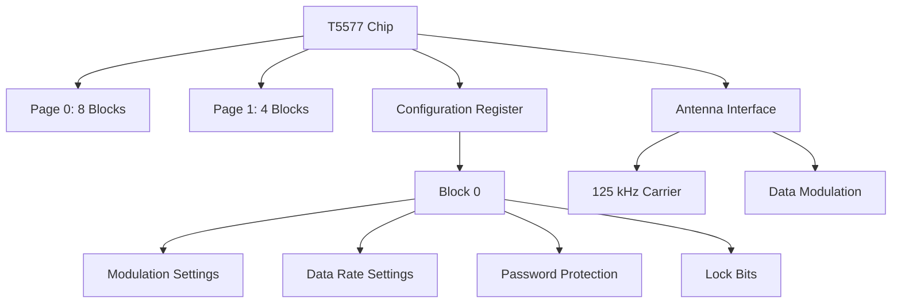
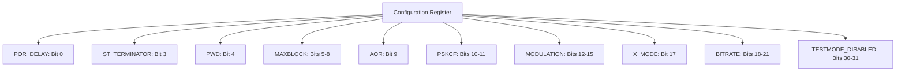
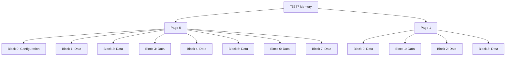
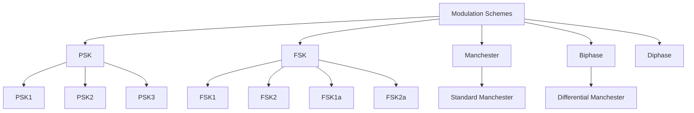
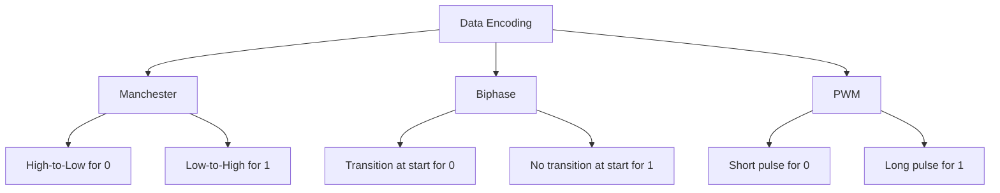
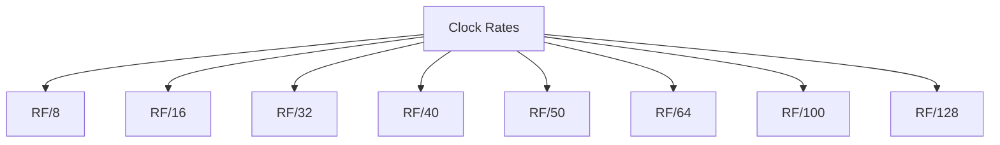
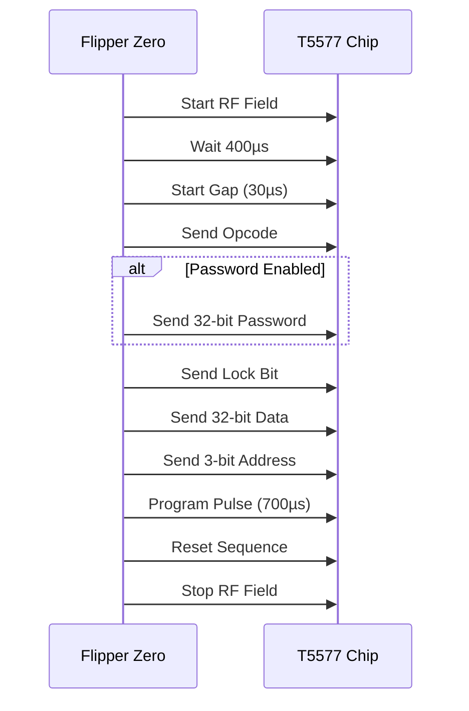
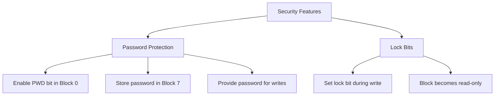
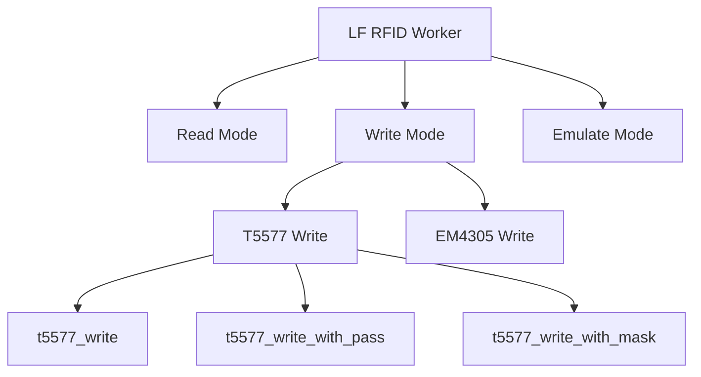
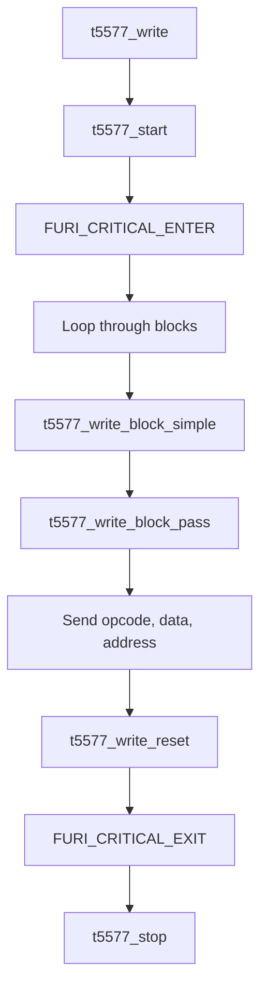

# T5577 Protocol

<cite>
**Referenced Files in This Document**   
- [t5577.h](file://lib/lfrfid/tools/t5577.h)
- [t5577.c](file://lib/lfrfid/tools/t5577.c)
- [lfrfid_worker.h](file://lib/lfrfid/lfrfid_worker.h)
- [lfrfid_worker.c](file://lib/lfrfid/lfrfid_worker.c)
- [lfrfid_worker_modes.c](file://lib/lfrfid/lfrfid_worker_modes.c)
- [lfrfid_protocols.h](file://lib/lfrfid/protocols/lfrfid_protocols.h)
</cite>

## Table of Contents
1. [Introduction](#introduction)
2. [T5577 Chip Architecture](#t5577-chip-architecture)
3. [Configuration Register Structure](#configuration-register-structure)
4. [Data Storage Blocks](#data-storage-blocks)
5. [Modulation Schemes](#modulation-schemes)
6. [Data Encoding Formats](#data-encoding-formats)
7. [Clock Rate Configurations](#clock-rate-configurations)
8. [Write Operations](#write-operations)
9. [Security Features](#security-features)
10. [Flipper Zero Integration](#flipper-zero-integration)
11. [Command Sequences](#command-sequences)
12. [Practical Examples](#practical-examples)

## Introduction
The T5577 is a programmable Low Frequency (LF) RFID chip that can be configured to emulate various access control cards and systems. This document details the implementation of the T5577 protocol within the Flipper Zero firmware, covering its programmable nature, configuration registers, data storage blocks, modulation schemes, and integration with the Flipper Zero platform. The T5577 chip offers extensive flexibility through its configurable parameters, allowing it to interface with a wide range of access control systems.

**Section sources**
- [t5577.h](file://lib/lfrfid/tools/t5577.h#L0-L85)
- [t5577.c](file://lib/lfrfid/tools/t5577.c#L0-L218)

## T5577 Chip Architecture
The T5577 chip architecture consists of multiple configurable components that work together to enable communication with RFID readers. The chip operates at 125 kHz and features a command-based interface for configuration and data manipulation. The architecture is divided into two main pages: Page 0 with 8 blocks and Page 1 with 4 blocks, providing a total of 12 addressable memory locations.

The chip's operation is controlled through a series of timing-critical operations that involve specific gap times, data transmission, and programming pulses. The Flipper Zero implementation handles these timing requirements through precise microsecond delays and hardware abstraction layer calls.



**Diagram sources**
- [t5577.h](file://lib/lfrfid/tools/t5577.h#L0-L85)
- [t5577.c](file://lib/lfrfid/tools/t5577.c#L0-L218)

**Section sources**
- [t5577.h](file://lib/lfrfid/tools/t5577.h#L0-L85)
- [t5577.c](file://lib/lfrfid/tools/t5577.c#L0-L218)

## Configuration Register Structure
The T5577 configuration register, located in Block 0, contains various bit fields that control the chip's operation. These fields determine the modulation scheme, data rate, password protection, and other operational parameters.

### Configuration Register Bit Fields
The configuration register uses specific bit positions to control different aspects of the chip's behavior:

- **POR_DELAY**: Bit 0 - Controls power-on reset delay
- **ST_TERMINATOR**: Bit 3 - Enables sticky terminator
- **PWD**: Bit 4 - Enables password protection
- **MAXBLOCK**: Bits 5-8 - Specifies the maximum block address
- **AOR**: Bit 9 - Address-only read mode
- **PSKCF**: Bits 10-11 - PSK clock frequency selection
- **MODULATION**: Bits 12-15 - Modulation type selection
- **X_MODE**: Bit 17 - Extended mode
- **BITRATE**: Bits 18-21 - Data rate selection
- **TESTMODE_DISABLED**: Bits 30-31 - Test mode control



**Diagram sources**
- [t5577.h](file://lib/lfrfid/tools/t5577.h#L0-L85)

**Section sources**
- [t5577.h](file://lib/lfrfid/tools/t5577.h#L0-L85)

## Data Storage Blocks
The T5577 chip provides 12 data storage blocks organized into two pages. Page 0 contains 8 blocks (0-7), while Page 1 contains 4 blocks (0-3). Each block stores 32 bits of data, allowing for a total storage capacity of 384 bits.

### Block Organization
- **Page 0**: Blocks 0-7 (Blocks 0 is configuration, 1-7 are data)
- **Page 1**: Blocks 0-3 (Additional data storage)

Block 0 serves as the configuration register, while the remaining blocks store user data that can be read by RFID readers. The organization allows for flexible data storage and retrieval patterns.



**Diagram sources**
- [t5577.h](file://lib/lfrfid/tools/t5577.h#L0-L85)

**Section sources**
- [t5577.h](file://lib/lfrfid/tools/t5577.h#L0-L85)

## Modulation Schemes
The T5577 chip supports multiple modulation schemes that determine how data is encoded on the carrier signal. These schemes allow the chip to be compatible with various RFID reader types.

### Supported Modulation Types
- **Direct**: No modulation (rarely used)
- **PSK (Phase Shift Keying)**: Three variants (PSK1, PSK2, PSK3)
- **FSK (Frequency Shift Keying)**: Four variants (FSK1, FSK2, FSK1a, FSK2a)
- **Manchester**: Standard Manchester encoding
- **Biphase**: Also known as Differential Manchester
- **Diphase**: Alternative biphase encoding

The modulation scheme is selected through the MODULATION field in the configuration register (bits 12-15 of Block 0).



**Diagram sources**
- [t5577.h](file://lib/lfrfid/tools/t5577.h#L0-L85)

**Section sources**
- [t5577.h](file://lib/lfrfid/tools/t5577.h#L0-L85)

## Data Encoding Formats
The T5577 chip supports various data encoding formats that determine how binary data is represented in the transmitted signal. These formats are closely related to the modulation schemes but focus on the bit-level representation.

### Encoding Format Details
- **Manchester Encoding**: Each bit period is divided into two halves. A '0' is represented by a high-to-low transition, while a '1' is represented by a low-to-high transition.
- **Biphase Encoding**: Similar to Manchester but with different transition rules.
- **PWM (Pulse Width Modulation)**: Not explicitly listed in the code but can be implemented through custom timing.

The encoding format is typically determined by the modulation scheme selected, as different modulation types use specific encoding methods.



**Diagram sources**
- [t5577.h](file://lib/lfrfid/tools/t5577.h#L0-L85)

**Section sources**
- [t5577.h](file://lib/lfrfid/tools/t5577.h#L0-L85)

## Clock Rate Configurations
The T5577 chip supports various clock rates that determine the data transmission speed. The clock rate is configured through the BITRATE field in the configuration register.

### Supported Clock Rates
- **RF/8**: Slowest rate
- **RF/16**: 
- **RF/32**: 
- **RF/40**: 
- **RF/50**: 
- **RF/64**: 
- **RF/100**: 
- **RF/128**: Fastest rate

The clock rate selection affects the timing of data transmission and must be compatible with the reader's expectations. The RF value refers to the carrier frequency (125 kHz), so RF/8 equals approximately 15.625 kHz.



**Diagram sources**
- [t5577.h](file://lib/lfrfid/tools/t5577.h#L0-L85)

**Section sources**
- [t5577.h](file://lib/lfrfid/tools/t5577.h#L0-L85)

## Write Operations
The T5577 implementation in the Flipper Zero firmware provides several functions for writing data to the chip. These operations follow a specific timing protocol to ensure reliable programming.

### Write Operation Sequence
1. **Start Sequence**: Begin RF field and release antenna pull
2. **Wait Time**: 400 microseconds delay
3. **Start Gap**: 30 microseconds gap
4. **Opcode Transmission**: Send page-specific opcode (10 for Page 0, 11 for Page 1)
5. **Password Transmission**: If password protection is enabled, send 32-bit password
6. **Lock Bit**: Send lock bit (1 to lock, 0 to allow future writes)
7. **Data Transmission**: Send 32-bit data block
8. **Block Address**: Send 3-bit block address
9. **Program Pulse**: 700 microseconds programming pulse
10. **Reset Sequence**: Send reset command (10)



**Diagram sources**
- [t5577.c](file://lib/lfrfid/tools/t5577.c#L0-L218)

**Section sources**
- [t5577.c](file://lib/lfrfid/tools/t5577.c#L0-L218)

## Security Features
The T5577 chip includes several security features to protect data and prevent unauthorized access or modification.

### Password Protection
Password protection can be enabled by setting the PWD bit (bit 4) in the configuration register. When enabled, a 32-bit password must be provided for write operations. The password is stored in Block 7 of Page 0.

### Lock Bits
Each block can be individually locked by setting the lock bit during a write operation. Once locked, a block cannot be rewritten. This provides permanent data storage for critical information.

### Implementation in Flipper Zero
The Flipper Zero implementation provides functions to write with password protection and handle the security features:

- **t5577_write_with_pass**: Writes data with password authentication
- **t5577_write_with_mask**: Writes multiple blocks with optional password
- **t5577_write_page_block_pass**: Writes a specific page and block with password



**Diagram sources**
- [t5577.h](file://lib/lfrfid/tools/t5577.h#L0-L85)
- [t5577.c](file://lib/lfrfid/tools/t5577.c#L0-L218)

**Section sources**
- [t5577.h](file://lib/lfrfid/tools/t5577.h#L0-L85)
- [t5577.c](file://lib/lfrfid/tools/t5577.c#L0-L218)

## Flipper Zero Integration
The T5577 protocol is integrated into the Flipper Zero firmware through a worker-based architecture that handles RFID operations in a separate thread.

### Worker Architecture
The LF RFID worker system manages all RFID operations, including reading, writing, and emulation. The T5577 implementation is integrated as one of several supported protocols.



### Write Request Structure
The LFRFIDWriteRequest structure is used to pass write operations to the worker system:

```c
typedef struct {
    LFRFIDWriteType write_type;
    union {
        LFRFIDT5577 t5577;
        LFRFIDEM4305 em4305;
    };
} LFRFIDWriteRequest;
```

When writing to a T5577 chip, the write_type is set to LFRFIDWriteTypeT5577, and the t5577 field contains the data to be written.

**Section sources**
- [lfrfid_worker.h](file://lib/lfrfid/lfrfid_worker.h#L0-L165)
- [lfrfid_worker.c](file://lib/lfrfid/lfrfid_worker.c#L0-L195)
- [lfrfid_worker_modes.c](file://lib/lfrfid/lfrfid_worker_modes.c#L600-L799)
- [lfrfid_protocols.h](file://lib/lfrfid/protocols/lfrfid_protocols.h#L51-L57)

## Command Sequences
The T5577 protocol uses specific command sequences for different operations. These sequences follow the timing requirements specified in the chip's datasheet.

### Basic Write Sequence
1. Start RF field
2. Wait 400µs
3. Send start gap (30µs)
4. Send opcode (10 for Page 0, 11 for Page 1)
5. If password enabled, send 32-bit password
6. Send lock bit (1 for lock, 0 for no lock)
7. Send 32-bit data
8. Send 3-bit block address
9. Apply programming pulse (700µs)
10. Wait 400µs
11. Send reset sequence (10)
12. Stop RF field

### Function Call Hierarchy
The Flipper Zero implementation provides multiple functions for writing to T5577 chips:

- **t5577_write**: Writes multiple blocks without password
- **t5577_write_with_pass**: Writes multiple blocks with password
- **t5577_write_with_mask**: Writes specific blocks with optional password
- **t5577_write_page_block_pass**: Writes a single block with password



**Diagram sources**
- [t5577.c](file://lib/lfrfid/tools/t5577.c#L0-L218)

**Section sources**
- [t5577.c](file://lib/lfrfid/tools/t5577.c#L0-L218)

## Practical Examples
This section provides practical examples of configuring T5577 chips for different access control systems.

### Example 1: HID Prox Card Emulation
To emulate an HID Prox card, configure the T5577 with the appropriate facility code and card number:

```c
LFRFIDT5577 t5577;
// Clear all blocks
memset(&t5577, 0, sizeof(LFRFIDT5577));

// Configure Block 0
t5577.block[0] = LFRFID_T5577_MODULATION_MANCHESTER | 
                 LFRFID_T5577_BITRATE_RF_64 |
                 LFRFID_T5577_ST_TERMINATOR;

// Set data in Block 1 (example values)
t5577.block[1] = 0x00081B2A; // Facility code 123, Card number 45678

// Write 2 blocks
t5577.blocks_to_write = 2;

// Perform write
t5577_write(&t5577);
```

### Example 2: EM4100 Emulation
For EM4100 emulation, configure the T5577 to use ASK modulation with appropriate data encoding:

```c
LFRFIDT5577 t5577;
memset(&t5577, 0, sizeof(LFRFIDT5577));

// Configure Block 0 for EM4100 compatibility
t5577.block[0] = LFRFID_T5577_MODULATION_MANCHESTER |
                 LFRFID_T5577_BITRATE_RF_64;

// Set data (example 10-digit ID)
t5577.block[1] = 0x00001234;
t5577.block[2] = 0x56789000;

t5577.blocks_to_write = 3;
t5577_write(&t5577);
```

### Example 3: Password-Protected Write
To write to a password-protected T5577 chip:

```c
LFRFIDT5577 t5577;
memset(&t5577, 0, sizeof(LFRFIDT5577));

// Configure Block 0 with password enabled
t5577.block[0] = LFRFID_T5577_MODULATION_MANCHESTER |
                 LFRFID_T5577_BITRATE_RF_64 |
                 LFRFID_T5577_PWD;

// Set password in Block 7
uint32_t password = 0x12345678;
t5577.block[7] = password;

// Set data
t5577.block[1] = 0xABCDEF00;
t5577.blocks_to_write = 2;

// Write with password
t5577_write_with_pass(&t5577, password);
```

**Section sources**
- [t5577.h](file://lib/lfrfid/tools/t5577.h#L0-L85)
- [t5577.c](file://lib/lfrfid/tools/t5577.c#L0-L218)