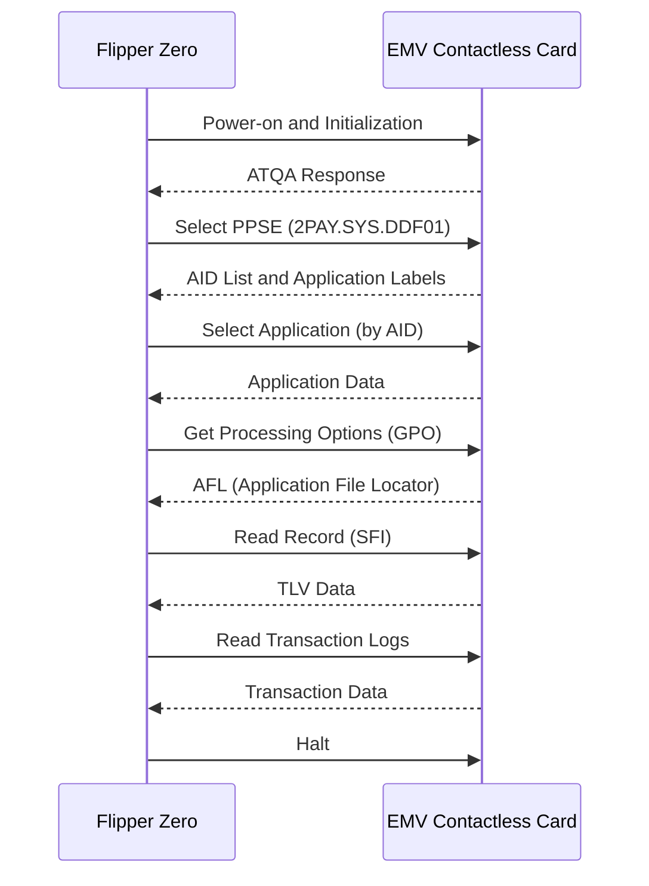
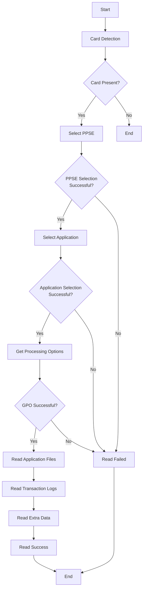
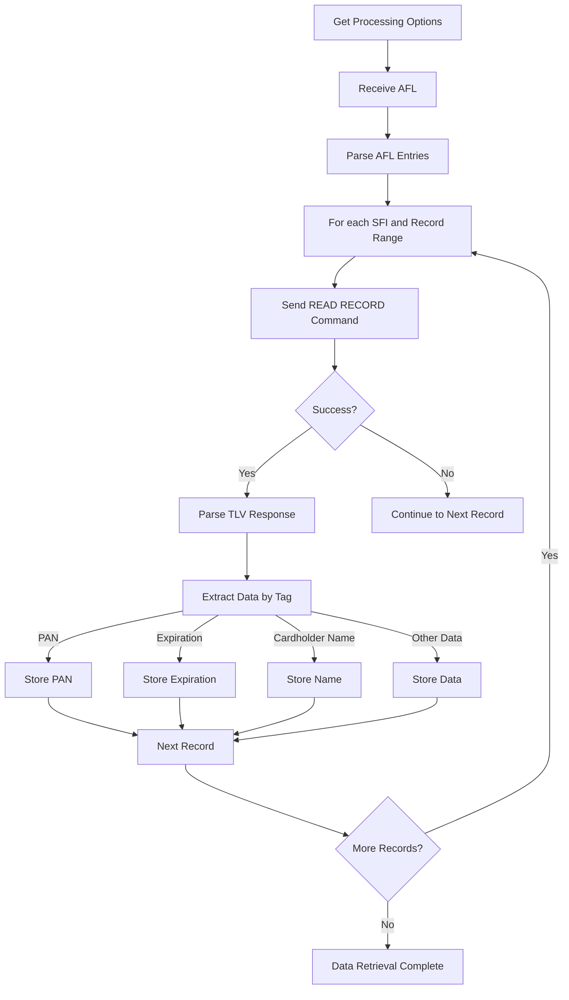
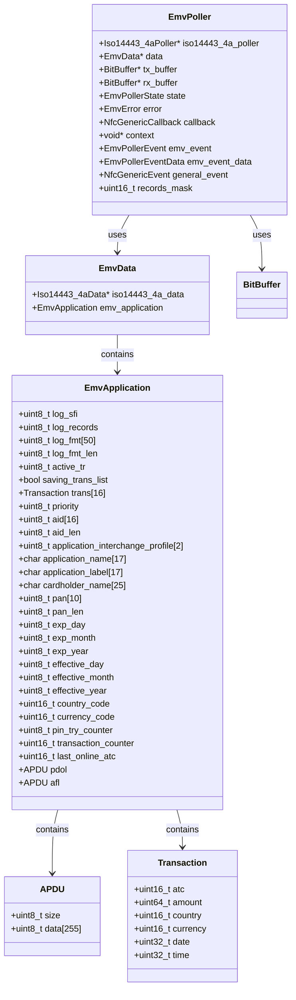

# EMV

<cite>
**Referenced Files in This Document**   
- [emv.h](file://lib/nfc/protocols/emv/emv.h)
- [emv.c](file://lib/nfc/protocols/emv/emv.c)
- [emv_poller.h](file://lib/nfc/protocols/emv/emv_poller.h)
- [emv_poller.c](file://lib/nfc/protocols/emv/emv_poller.c)
- [emv_poller_i.c](file://lib/nfc/protocols/emv/emv_poller_i.c)
- [nfc_emv_parser.c](file://applications/main/nfc/helpers/nfc_emv_parser.c)
- [nfc_scene_emv_transactions.c](file://applications/main/nfc/scenes/nfc_scene_emv_transactions.c)
</cite>

## Table of Contents
1. [Introduction](#introduction)
2. [EMV Protocol Overview](#emv-protocol-overview)
3. [Core Data Structures](#core-data-structures)
4. [Communication Flow](#communication-flow)
5. [Application Discovery and Selection](#application-discovery-and-selection)
6. [Data Retrieval and Parsing](#data-retrieval-and-parsing)
7. [Security Features](#security-features)
8. [Flipper Zero Implementation](#flipper-zero-implementation)
9. [Limitations and Security Considerations](#limitations-and-security-considerations)
10. [Conclusion](#conclusion)

## Introduction

The Flipper Zero is a versatile multi-tool device capable of interacting with various wireless protocols, including contactless payment systems based on the EMV (Europay, Mastercard, Visa) standard. This document provides a comprehensive analysis of the EMV protocol implementation within the Flipper Zero firmware, focusing on the communication flow between the device and contactless payment cards. The implementation enables the Flipper Zero to read card information such as the Primary Account Number (PAN), expiration date, cardholder name, and transaction history by following the standardized EMV contactless payment protocol.

The EMV implementation in Flipper Zero is built upon the ISO/IEC 14443-4A standard for contactless communication and follows the EMV Contactless Integrated Circuit Card Specification. The system is designed to discover payment applications, select the appropriate application, retrieve processing options, and parse EMV tags to extract card data. This documentation details the technical architecture, data structures, communication sequences, and security considerations involved in reading EMV contactless cards with the Flipper Zero.

**Section sources**
- [emv.h](file://lib/nfc/protocols/emv/emv.h#L0-L152)

## EMV Protocol Overview

The EMV protocol for contactless payments is a standardized framework that enables secure communication between contactless payment cards and terminals. The protocol follows a structured sequence of operations that begins with card detection and ends with data retrieval. The Flipper Zero implements this protocol to read information from EMV-compliant contactless cards, adhering to the same communication patterns used by legitimate payment terminals.

The communication flow follows a state machine pattern, progressing through several key stages: initialization, application discovery via PPSE (Proximity Payment System Environment), application selection, retrieval of processing options via GPO (Get Processing Options), and data reading from application files. Each stage involves specific APDU (Application Protocol Data Unit) commands and responses that conform to the EMV specification.

The protocol operates over NFC (Near Field Communication) using the ISO/IEC 14443-4A standard for the physical and data link layers. The Flipper Zero acts as a reader/terminal, sending commands to the card and processing the responses. The communication is designed to be fast and efficient, typically completing within a few seconds, which aligns with the user experience expectations for contactless payments.



**Diagram sources**
- [emv_poller.c](file://lib/nfc/protocols/emv/emv_poller.c#L7-L206)
- [emv_poller_i.c](file://lib/nfc/protocols/emv/emv_poller_i.c#L0-L793)

**Section sources**
- [emv_poller.c](file://lib/nfc/protocols/emv/emv_poller.c#L7-L206)
- [emv_poller_i.c](file://lib/nfc/protocols/emv/emv_poller_i.c#L0-L793)

## Core Data Structures

The EMV implementation in Flipper Zero relies on several key data structures that define the card data model and communication parameters. These structures are designed to efficiently store and process the hierarchical TLV (Tag-Length-Value) encoded data that characterizes EMV cards.

The primary data structure is `EmvApplication`, which contains all the relevant information extracted from a contactless payment card. This structure includes fields for the card's PAN (Primary Account Number), expiration date, cardholder name, application identifiers, and transaction data. The structure also contains buffers for APDUs (Application Protocol Data Units) used in communication with the card.

Another important structure is `APDU`, which represents an Application Protocol Data Unit used for communication between the reader and card. The APDU structure contains a data buffer and size field to handle the command and response data exchanged during the EMV protocol flow.

The `EmvData` structure serves as a container for the EMV protocol data, combining the ISO14443-4A base data with the specific EMV application data. This structure is used throughout the implementation to maintain the state of the communication session.

```c
typedef struct {
    uint8_t size;
    uint8_t data[MAX_APDU_LEN];
} APDU;

typedef struct {
    uint16_t atc;
    uint64_t amount;
    uint16_t country;
    uint16_t currency;
    uint32_t date;
    uint32_t time;
} Transaction;

typedef struct {
    uint8_t log_sfi;
    uint8_t log_records;
    uint8_t log_fmt[50];
    uint8_t log_fmt_len;
    uint8_t active_tr;
    bool saving_trans_list;
    Transaction trans[16];
    uint8_t priority;
    uint8_t aid[16];
    uint8_t aid_len;
    uint8_t application_interchange_profile[2];
    char application_name[16 + 1];
    char application_label[16 + 1];
    char cardholder_name[24 + 1];
    uint8_t pan[10]; // card_number
    uint8_t pan_len;
    uint8_t exp_day;
    uint8_t exp_month;
    uint8_t exp_year;
    uint8_t effective_day;
    uint8_t effective_month;
    uint8_t effective_year;
    uint16_t country_code;
    uint16_t currency_code;
    uint8_t pin_try_counter;
    uint16_t transaction_counter;
    uint16_t last_online_atc;
    APDU pdol;
    APDU afl;
} EmvApplication;

typedef struct {
    Iso14443_4aData* iso14443_4a_data;
    EmvApplication emv_application;
} EmvData;
```

**Section sources**
- [emv.h](file://lib/nfc/protocols/emv/emv.h#L0-L152)

## Communication Flow

The communication flow between the Flipper Zero and an EMV contactless card follows a well-defined sequence of operations that adheres to the EMV Contactless Integrated Circuit Card Specification. The process begins with card detection and initialization, followed by application discovery, selection, and data retrieval.

The flow is implemented as a state machine in the `emv_poller.c` file, with states representing each stage of the communication process. The state machine transitions from `EmvPollerStateIdle` to `EmvPollerStateSelectPPSE`, then to `EmvPollerStateSelectApplication`, `EmvPollerStateGetProcessingOptions`, `EmvPollerStateReadFiles`, and finally to either `EmvPollerStateReadSuccess` or `EmvPollerStateReadFailed` based on the outcome.

Each state corresponds to a specific operation and is handled by a dedicated handler function. The handlers use the ISO14443-4A poller to send APDUs to the card and process the responses. The communication is asynchronous, with the poller running in a loop until the operation completes or fails.

The timing requirements for EMV communication are critical, as contactless cards expect responses within specific time windows. The Flipper Zero implementation handles these timing requirements through the underlying NFC driver and poller infrastructure, ensuring that commands are sent and responses are processed within the required time frames.



**Diagram sources**
- [emv_poller.c](file://lib/nfc/protocols/emv/emv_poller.c#L7-L206)

**Section sources**
- [emv_poller.c](file://lib/nfc/protocols/emv/emv_poller.c#L7-L206)

## Application Discovery and Selection

The application discovery and selection process is a critical phase in the EMV protocol, enabling the reader to identify and select the appropriate payment application on a contactless card. The Flipper Zero implements this process according to the EMV Contactless specification, using the PPSE (Proximity Payment System Environment) mechanism for application discovery.

Application discovery begins with the selection of the PPSE directory, identified by the AID (Application Identifier) "2PAY.SYS.DDF01". This is accomplished by sending a SELECT command with the PPSE AID to the card. If the card supports contactless payments, it will respond with a list of available payment applications, each identified by its own AID and associated data such as application label and priority.

The SELECT PPSE command is structured as follows:
- CLA: 0x00 (Class byte)
- INS: 0xA4 (SELECT command)
- P1: 0x04 (Select by name)
- P2: 0x00 (First or only occurrence)
- Lc: 0x0E (Length of data)
- Data: "2PAY.SYS.DDF01" (PPSE AID)
- Le: 0x00 (Expected length)

Once the list of applications is retrieved, the Flipper Zero selects the most appropriate application based on priority or other criteria. This is done by sending another SELECT command, this time with the AID of the specific payment application to be used. The application selection command follows the same structure but uses the specific application's AID instead of the PPSE AID.

The implementation in `emv_poller_i.c` includes error handling for cases where the PPSE selection fails or no applications are found. In such cases, the process may still attempt to proceed with GPO (Get Processing Options) using default parameters, allowing for some data retrieval even when the standard discovery process fails.

```c
const uint8_t emv_select_ppse_cmd[] = {
    0x00, 0xA4, // SELECT ppse
    0x04, 0x00, // P1:By name, P2: empty
    0x0e, // Lc: Data length
    0x32, 0x50, 0x41, 0x59, 0x2e, 0x53, 0x59, // Data string:
    0x53, 0x2e, 0x44, 0x44, 0x46, 0x30, 0x31, // 2PAY.SYS.DDF01 (PPSE)
    0x00 // Le
};
```

**Section sources**
- [emv_poller_i.c](file://lib/nfc/protocols/emv/emv_poller_i.c#L0-L793)

## Data Retrieval and Parsing

Data retrieval and parsing is the final phase of the EMV communication process, where the Flipper Zero extracts specific information from the contactless card after application selection and processing options have been established. This phase involves reading data from the card's application files using the SFI (Short File Identifier) and record numbers provided in the AFL (Application File Locator).

The Get Processing Options (GPO) command retrieves the AFL, which contains information about which files and records contain the card's data. The AFL specifies the SFI, starting record, ending record, and offline authentication indicator for each file that should be read. The Flipper Zero uses this information to systematically read each specified record using the READ RECORD command.

The data returned from the card is encoded in TLV (Tag-Length-Value) format, a hierarchical data structure where each piece of information is identified by a tag, followed by its length and value. The Flipper Zero implementation includes a comprehensive TLV parser that can decode the various EMV tags to extract card information.

Key data elements that are parsed include:
- **PAN (Primary Account Number)**: Tag 0x5A or derived from Track 2 equivalent data
- **Expiration Date**: Tag 0x5F24 or derived from Track 2 equivalent data
- **Cardholder Name**: Tag 0x5F20
- **Application Name**: Tag 0x9F12
- **Application Label**: Tag 0x50
- **Transaction Counter (ATC)**: Tag 0x9F36
- **Country Code**: Tag 0x5F28
- **Currency Code**: Tag 0x9F42

The parsing logic handles both direct tag extraction and indirect derivation from track data. For example, the PAN and expiration date can be extracted from the Track 2 equivalent data (tag 0x57) by parsing the 4-bit encoded data and identifying the delimiter (0xD0) between the PAN and expiration information.



**Diagram sources**
- [emv_poller_i.c](file://lib/nfc/protocols/emv/emv_poller_i.c#L0-L793)

**Section sources**
- [emv_poller_i.c](file://lib/nfc/protocols/emv/emv_poller_i.c#L0-L793)

## Security Features

The EMV protocol incorporates several security features to protect against fraud and unauthorized access, many of which are reflected in the data that can be read by the Flipper Zero. While the Flipper Zero implementation focuses on reading publicly accessible data, understanding these security features is crucial for comprehending the limitations and capabilities of the system.

One key security feature is the Transaction Counter (ATC), which is a monotonically increasing value that increments with each transaction. This counter helps prevent replay attacks by ensuring that each transaction has a unique identifier. The Flipper Zero can read both the current ATC (tag 0x9F36) and the last online ATC (tag 0x9F13), which indicates when the card last communicated with an online system.

Another security feature is the PIN Try Counter (tag 0x9F17), which tracks the number of remaining PIN entry attempts before the card becomes locked. This counter helps prevent brute force attacks on the card's PIN. The Flipper Zero can read this value to determine how many PIN attempts remain.

The Application Interchange Profile (AIP, tag 0x82) contains information about the security capabilities of the application, including support for various authentication methods. This data helps the terminal determine which security protocols to use during a transaction.

It's important to note that the Flipper Zero implementation does not support dynamic CVV (Card Verification Value) generation or transaction cryptogram verification, as these require secure cryptographic operations that are not performed by the reader. The data read by the Flipper Zero is limited to what is publicly accessible through the standard EMV protocol, without engaging in actual transaction processing or cryptographic authentication.

The implementation includes protections against anti-sniffing measures that some cards may employ. For example, the cardholder name is read as one of the last operations because attempting to read it may terminate the communication session on some cards. This sequencing helps maximize the amount of data that can be retrieved before the card potentially disconnects.

**Section sources**
- [emv.h](file://lib/nfc/protocols/emv/emv.h#L0-L152)
- [emv_poller_i.c](file://lib/nfc/protocols/emv/emv_poller_i.c#L0-L793)

## Flipper Zero Implementation

The Flipper Zero's EMV implementation is a sophisticated system that integrates with the device's NFC hardware and software architecture to provide contactless card reading capabilities. The implementation is structured as a protocol module within the NFC subsystem, following the same design patterns as other NFC protocols supported by the device.

The core of the implementation resides in the `lib/nfc/protocols/emv/` directory, which contains the protocol definition, poller, and internal implementation files. The protocol is registered with the NFC system through the `nfc_device_emv` structure, which provides function pointers for allocation, freeing, resetting, copying, and other operations.

The poller implementation (`emv_poller.c` and `emv_poller_i.c`) handles the communication state machine and APDU exchange with the card. It uses the ISO14443-4A poller as a base, building EMV-specific functionality on top of the lower-level NFC communication.

The application layer in `applications/main/nfc/` provides the user interface and higher-level functionality for interacting with EMV cards. This includes scene management for the NFC application, data parsing helpers, and display functions. The `nfc_emv_parser.c` file contains functions for formatting and displaying the parsed EMV data to the user.

When a user initiates an EMV read operation, the following sequence occurs:
1. The NFC application creates an EMV poller instance
2. The poller begins the state machine, starting with PPSE selection
3. As each state completes, the poller transitions to the next state
4. Data is extracted from responses and stored in the `EmvApplication` structure
5. Upon completion, the data is passed back to the application for display
6. The poller is freed and resources are released

The implementation includes error handling for various failure modes, including card not present, timeout, and protocol errors. It also includes logging and tracing capabilities that can be enabled for debugging purposes, allowing developers to see the APDUs being sent and received.



**Diagram sources**
- [emv.h](file://lib/nfc/protocols/emv/emv.h#L0-L152)
- [emv.c](file://lib/nfc/protocols/emv/emv.c#L0-L216)
- [emv_poller.c](file://lib/nfc/protocols/emv/emv_poller.c#L7-L206)

**Section sources**
- [emv.h](file://lib/nfc/protocols/emv/emv.h#L0-L152)
- [emv.c](file://lib/nfc/protocols/emv/emv.c#L0-L216)
- [emv_poller.c](file://lib/nfc/protocols/emv/emv_poller.c#L7-L206)
- [emv_poller_i.c](file://lib/nfc/protocols/emv/emv_poller_i.c#L0-L793)

## Limitations and Security Considerations

While the Flipper Zero's EMV implementation provides valuable functionality for reading contactless card data, it has several important limitations and security considerations that users should understand.

One key limitation is that the implementation can only read data that is publicly accessible through the standard EMV protocol. It cannot perform actual transactions, generate dynamic CVV values, or verify transaction cryptograms, as these require secure cryptographic operations that are not supported by the device. The data retrieved is for informational purposes only and cannot be used to conduct financial transactions.

Security considerations include the potential for misuse of the device to read card information without authorization. While the Flipper Zero requires physical proximity to a card to read it, users should be aware that this capability could be used inappropriately. The device includes no authentication or access control mechanisms for the EMV reading functionality.

Technical limitations include compatibility issues with some cards that implement anti-sniffing protections. Some cards may limit the amount of data that can be read or terminate the communication session prematurely when certain operations are attempted. The implementation attempts to mitigate this by carefully sequencing operations, but some cards may still be difficult to read completely.

The data storage and handling on the Flipper Zero also present security considerations. Card data is stored in files on the device's storage, which may be accessible if the device is lost or stolen. Users should be aware that sensitive card information could potentially be extracted from the device if proper precautions are not taken.

Additionally, the implementation does not support all possible EMV features and card variants. Some specialized cards or those with non-standard implementations may not be readable or may provide incomplete data. The system is optimized for common payment cards but may not work reliably with all EMV-compliant cards.

Users should also be aware of legal and ethical considerations when using the device to read card information. Unauthorized reading of card data may violate privacy laws or terms of service agreements, even if no fraudulent transactions are conducted.

**Section sources**
- [emv_poller_i.c](file://lib/nfc/protocols/emv/emv_poller_i.c#L0-L793)
- [nfc_emv_parser.c](file://applications/main/nfc/helpers/nfc_emv_parser.c#L0-L100)

## Conclusion

The EMV implementation in the Flipper Zero represents a sophisticated integration of NFC technology and payment protocol standards, enabling the device to read information from contactless payment cards. The system follows the EMV Contactless Integrated Circuit Card Specification, implementing the full communication flow from card detection to data retrieval.

The implementation is well-structured, with clear separation between the protocol definition, poller logic, and application interface. It effectively handles the complex state machine required for EMV communication, including application discovery via PPSE, application selection, and data retrieval through GPO and READ RECORD commands.

The data parsing capabilities are comprehensive, supporting the extraction of key card information such as PAN, expiration date, cardholder name, and transaction data from the TLV-encoded responses. The system includes appropriate error handling and sequencing to maximize data retrieval while respecting the limitations of different card implementations.

However, users should understand the limitations of the implementation, particularly that it can only read publicly accessible data and cannot perform actual transactions or cryptographic operations. The security considerations around data privacy and potential misuse should also be carefully considered.

Overall, the EMV implementation demonstrates the Flipper Zero's capability as a versatile tool for NFC protocol analysis and provides valuable functionality for educational and research purposes, while adhering to the technical constraints and security boundaries of the EMV standard.