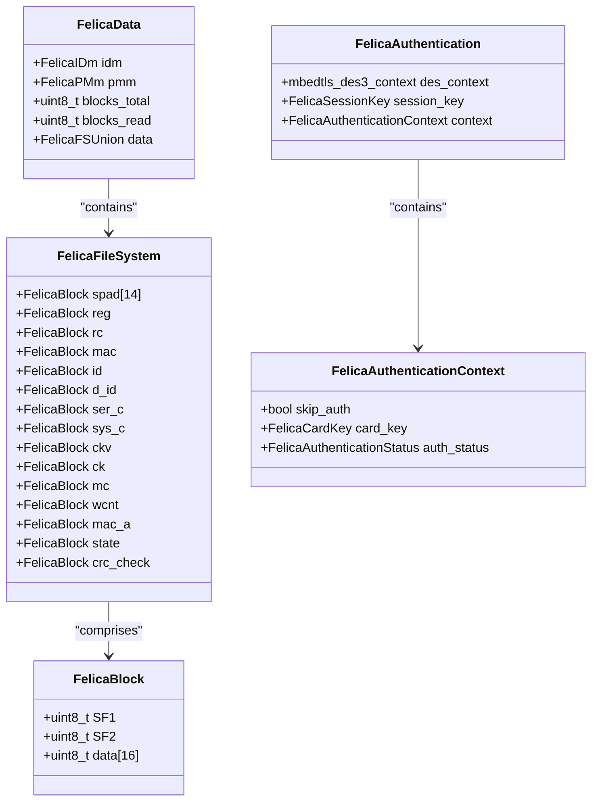
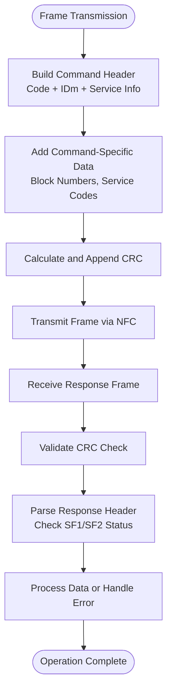
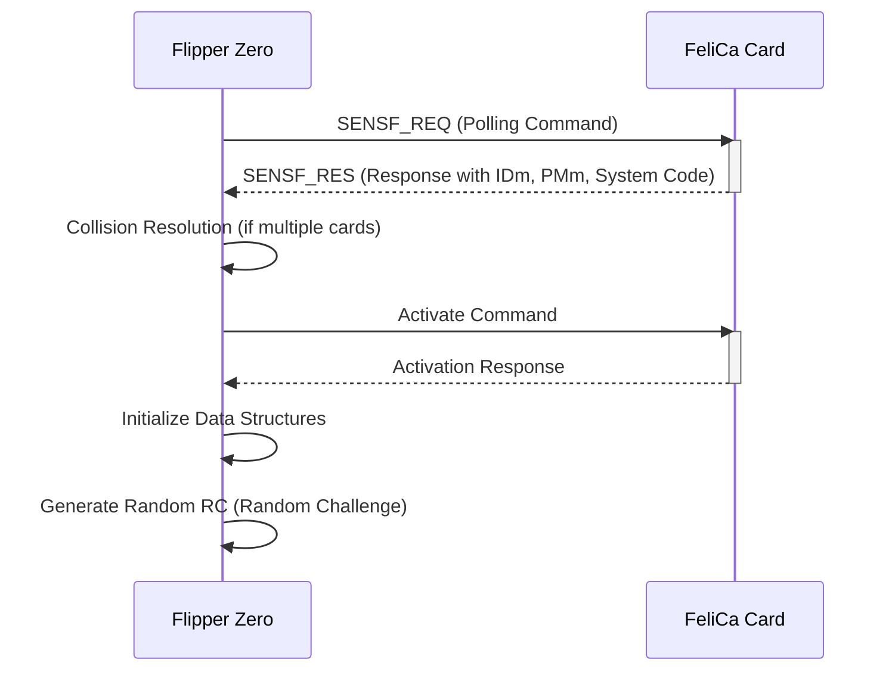
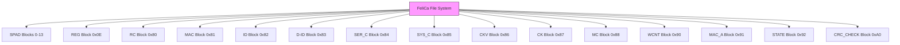
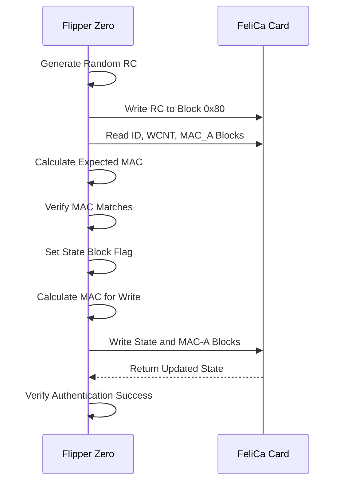
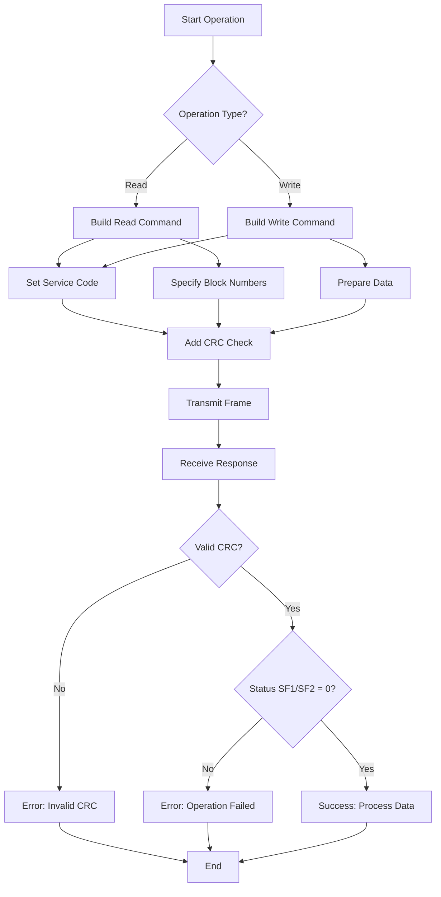

# FeliCa

<cite>
**Referenced Files in This Document**   
- [felica.h](file://lib/nfc/protocols/felica/felica.h)
- [felica.c](file://lib/nfc/protocols/felica/felica.c)
- [felica_poller.h](file://lib/nfc/protocols/felica/felica_poller.h)
- [felica_poller.c](file://lib/nfc/protocols/felica/felica_poller.c)
- [felica_listener.h](file://lib/nfc/protocols/felica/felica_listener.h)
- [felica_listener.c](file://lib/nfc/protocols/felica/felica_listener.c)
- [felica_auth.h](file://applications/main/nfc/helpers/felica_auth.h)
- [felica_auth.c](file://applications/main/nfc/helpers/felica_auth.c)
- [felica_crc.h](file://lib/nfc/helpers/felica_crc.h)
- [felica_crc.c](file://lib/nfc/helpers/felica_crc.c)
</cite>

## Table of Contents
1. [Introduction](#introduction)
2. [FeliCa Protocol Overview](#felica-protocol-overview)
3. [Data Rates and Modulation](#data-rates-and-modulation)
4. [Frame Format and Command Structure](#frame-format-and-command-structure)
5. [Polling and Activation Procedure](#polling-and-activation-procedure)
6. [Service and Data Block Structure](#service-and-data-block-structure)
7. [Authentication Process](#authentication-process)
8. [Read and Write Operations](#read-and-write-operations)
9. [Implementation in Flipper Zero Firmware](#implementation-in-flipper-zero-firmware)
10. [Supported FeliCa Cards](#supported-felica-cards)

## Introduction

FeliCa is a contactless smart card technology developed by Sony that operates at 13.56 MHz using NFC (Near Field Communication) standards. The Flipper Zero implements FeliCa protocol support to read and emulate various transit and payment cards including Suica, PASMO, and other FeliCa-based systems. This documentation details the implementation of FeliCa protocol in the Flipper Zero firmware, covering data rates, frame formats, polling commands, authentication procedures, and data access methods.

**Section sources**
- [felica.h](file://lib/nfc/protocols/felica/felica.h#L0-L261)
- [felica.c](file://lib/nfc/protocols/felica/felica.c#L0-L357)

## FeliCa Protocol Overview

The FeliCa protocol is designed for high-speed contactless transactions, primarily used in transportation systems and electronic money applications in Japan and other regions. The protocol supports two data rates: 212 kbps and 424 kbps, with the Flipper Zero implementation supporting both rates for compatibility with various FeliCa card types.

FeliCa cards contain a unique IDm (Identification Manager) of 8 bytes and a PMm (Product Manager) of 8 bytes, which serve as identifiers for the card. The card's memory is organized into blocks of 16 bytes each, with a total of 28 blocks in the standard configuration. Each block can be accessed through service codes that define the type of access (read/write with or without encryption).

The protocol uses a challenge-response authentication mechanism with 48-bit keys for secure access to protected data blocks. The authentication process involves calculating session keys and message authentication codes (MAC) using triple DES encryption.



**Diagram sources**
- [felica.h](file://lib/nfc/protocols/felica/felica.h#L100-L150)

**Section sources**
- [felica.h](file://lib/nfc/protocols/felica/felica.h#L0-L261)
- [felica.c](file://lib/nfc/protocols/felica/felica.c#L0-L357)

## Data Rates and Modulation

The FeliCa protocol supports two communication speeds: 212 kbps and 424 kbps. The Flipper Zero firmware implements both data rates to ensure compatibility with different FeliCa card variants and reader systems.

At 212 kbps, the protocol uses a subcarrier modulation scheme where data is transmitted using a 212 kHz subcarrier modulated onto the 13.56 MHz carrier wave. This modulation method provides robust communication in noisy environments and allows for reliable data transfer at short ranges.

The 424 kbps mode doubles the data rate by using a higher frequency subcarrier, enabling faster transaction times which is particularly important for transit gate applications where quick processing is essential. The choice between these data rates is typically determined during the initial polling phase based on the capabilities of the card and reader.

The communication parameters are defined in the header file with specific timing values:
- **FELICA_GUARD_TIME_US**: 20,000 microseconds guard time between frames
- **FELICA_FDT_POLL_FC**: 10,000 frame delay time for polling
- **FELICA_POLL_POLL_MIN_US**: 1,280 microseconds minimum polling interval
- **FELICA_FDT_LISTEN_FC**: 1,172 frame delay time for listening

These timing parameters ensure proper synchronization between the Flipper Zero and FeliCa cards during communication.

**Section sources**
- [felica.h](file://lib/nfc/protocols/felica/felica.h#L50-L70)

## Frame Format and Command Structure

The FeliCa protocol uses a structured frame format for communication between the reader (Flipper Zero) and the card. Each frame consists of a header, command-specific data, and a CRC (Cyclic Redundancy Check) for error detection.

### Command Header Structure

The command header is defined by the `FelicaCommandHeader` structure:

```c
typedef struct {
    uint8_t code;
    FelicaIDm idm;
    uint8_t service_num;
    uint16_t service_code;
    uint8_t block_count;
} FelicaCommandHeader;
```

Key components of the frame format:
- **code**: Command code (e.g., 0x06 for read without encryption, 0x08 for write without encryption)
- **idm**: 8-byte card identifier
- **service_num**: Number of service codes in the command
- **service_code**: 16-bit service code defining access permissions
- **block_count**: Number of data blocks involved in the operation

### Response Structure

The response frame includes status information and data:

```c
typedef struct {
    uint8_t length;
    uint8_t response_code;
    FelicaIDm idm;
    uint8_t SF1;
    uint8_t SF2;
    uint8_t block_count;
    uint8_t data[];
} FelicaPollerReadCommandResponse;
```

Status flags SF1 and SF2 indicate the success or failure of the operation, with both set to 0 for successful operations.

The protocol also defines specific constants for system identification:
- **FELICA_SYSTEM_CODE_CODE**: 0xFFFF (default system code)
- **FELICA_TIME_SLOT_1**: 0x00 (1 time slot)
- **FELICA_TIME_SLOT_2**: 0x01 (2 time slots)
- **FELICA_TIME_SLOT_4**: 0x03 (4 time slots)
- **FELICA_TIME_SLOT_8**: 0x07 (8 time slots)
- **FELICA_TIME_SLOT_16**: 0x0F (16 time slots)

Time slots are used during the polling phase to resolve collisions when multiple cards are present in the reader's field.



**Diagram sources**
- [felica.h](file://lib/nfc/protocols/felica/felica.h#L150-L200)

**Section sources**
- [felica.h](file://lib/nfc/protocols/felica/felica.h#L0-L261)
- [felica_crc.c](file://lib/nfc/helpers/felica_crc.c#L0-L58)

## Polling and Activation Procedure

The polling process is the initial step in communicating with a FeliCa card, where the Flipper Zero detects and activates the card for further operations. This process follows the standard FeliCa collision resolution procedure as defined in the specifications.

### Polling Command Structure

The polling command includes:
- **System Code**: 16-bit value (typically 0xFFFF for any system)
- **Request Code**: Specifies the type of request (e.g., request for system code, request for response)
- **Time Slot**: Number of time slots for collision resolution (1, 2, 4, 8, or 16)

The Flipper Zero's poller implementation handles the complete activation sequence through a state machine defined in `felica_poller_state_handler_activate`:



### State Machine Implementation

The polling process is implemented as a state machine with the following states:
1. **Idle**: Initial state, waiting for activation
2. **Activated**: Card detected and activated
3. **AuthenticateInternal**: Internal authentication phase
4. **AuthenticateExternal**: External authentication phase
5. **ReadBlocks**: Sequential block reading
6. **ReadSuccess/ReadFailed**: Final states

The state transitions are managed by the `felica_poller_run` function, which processes events from the NFC subsystem and advances through the states accordingly.

**Section sources**
- [felica_poller.c](file://lib/nfc/protocols/felica/felica_poller.c#L0-L317)
- [felica.h](file://lib/nfc/protocols/felica/felica.h#L0-L261)

## Service and Data Block Structure

FeliCa cards organize their data into blocks of 16 bytes each, with a total of 28 blocks in the standard configuration. Each block serves a specific purpose in the card's operation and security system.

### Block Index Definitions

The implementation defines specific block indices for different functions:

```c
#define FELICA_BLOCK_INDEX_REG       (0x0E)
#define FELICA_BLOCK_INDEX_RC        (0x80)
#define FELICA_BLOCK_INDEX_MAC       (0x81)
#define FELICA_BLOCK_INDEX_ID        (0x82)
#define FELICA_BLOCK_INDEX_D_ID      (0x83)
#define FELICA_BLOCK_INDEX_SER_C     (0x84)
#define FELICA_BLOCK_INDEX_SYS_C     (0x85)
#define FELICA_BLOCK_INDEX_CKV       (0x86)
#define FELICA_BLOCK_INDEX_CK        (0x87)
#define FELICA_BLOCK_INDEX_MC        (0x88)
#define FELICA_BLOCK_INDEX_WCNT      (0x90)
#define FELICA_BLOCK_INDEX_MAC_A     (0x91)
#define FELICA_BLOCK_INDEX_STATE     (0x92)
#define FELICA_BLOCK_INDEX_CRC_CHECK (0xA0)
```

### Service Codes

Service codes define the type of access to blocks:
- **FELICA_SERVICE_RW_ACCESS**: 0x0009 (Read/Write access)
- **FELICA_SERVICE_RO_ACCESS**: 0x000B (Read-Only access)

### File System Structure

The `FelicaFileSystem` structure organizes the blocks into a coherent system:

```c
typedef struct {
    FelicaBlock spad[14];     // Service pad blocks
    FelicaBlock reg;          // Register block
    FelicaBlock rc;           // Random challenge block
    FelicaBlock mac;          // MAC block
    FelicaBlock id;           // ID block
    FelicaBlock d_id;         // D-ID block
    FelicaBlock ser_c;        // Service code block
    FelicaBlock sys_c;        // System code block
    FelicaBlock ckv;          // CKV block
    FelicaBlock ck;           // Card key block
    FelicaBlock mc;           // Mode control block
    FelicaBlock wcnt;         // Write counter block
    FelicaBlock mac_a;        // MAC-A block
    FelicaBlock state;        // State block
    FelicaBlock crc_check;    // CRC check block
} FelicaFileSystem;
```

This structure allows the Flipper Zero to interpret the card's data in a meaningful way, mapping raw blocks to their functional purposes.



**Diagram sources**
- [felica.h](file://lib/nfc/protocols/felica/felica.h#L120-L150)

**Section sources**
- [felica.h](file://lib/nfc/protocols/felica/felica.h#L0-L261)

## Authentication Process

The FeliCa authentication process in the Flipper Zero firmware implements a two-stage authentication mechanism using 48-bit keys and triple DES encryption for secure access to protected data blocks.

### Authentication Context

The authentication process is managed through the `FelicaAuthenticationContext` structure:

```c
typedef struct {
    bool skip_auth;           // Whether to skip authentication
    FelicaCardKey card_key;   // 48-bit card key for authentication
    FelicaAuthenticationStatus auth_status; // Internal/external auth status
} FelicaAuthenticationContext;
```

### Two-Stage Authentication

The authentication process consists of two stages:

1. **Internal Authentication**: 
   - The reader generates a random challenge (RC)
   - A session key is calculated using the card key and RC
   - The reader writes the RC to the card
   - The reader reads protected blocks and verifies the MAC

2. **External Authentication**:
   - The reader updates the state block with authentication flag
   - A MAC is calculated for the write operation
   - The state and MAC-A blocks are written to the card
   - The card's response confirms successful authentication

### Key Management

The implementation uses mbedtls's triple DES functions for cryptographic operations:

```c
typedef struct {
    mbedtls_des3_context des_context;
    FelicaSessionKey session_key;
    FelicaAuthenticationContext context;
} FelicaAuthentication;
```

The session key is calculated from the card's random challenge (RC) and the card key (CK) using triple DES encryption. The MAC (Message Authentication Code) is generated using the session key and relevant data blocks to ensure data integrity and authenticity.

The authentication process is initiated when the user provides a card key and sets `skip_auth` to false in the authentication context. The Flipper Zero then automatically performs both internal and external authentication steps before accessing protected data.



**Diagram sources**
- [felica_poller.c](file://lib/nfc/protocols/felica/felica_poller.c#L100-L200)
- [felica_auth.c](file://applications/main/nfc/helpers/felica_auth.c#L0-L22)

**Section sources**
- [felica_poller.c](file://lib/nfc/protocols/felica/felica_poller.c#L0-L317)
- [felica_auth.h](file://applications/main/nfc/helpers/felica_auth.h#L0-L18)
- [felica_auth.c](file://applications/main/nfc/helpers/felica_auth.c#L0-L22)

## Read and Write Operations

The Flipper Zero implements FeliCa read and write operations through dedicated functions that handle both encrypted and unencrypted access to card data blocks.

### Read Operations

Read operations are performed using the `felica_poller_read_blocks` function:

```c
FelicaError felica_poller_read_blocks(
    FelicaPoller* instance,
    const uint8_t block_count,
    const uint8_t* const block_numbers,
    uint16_t service_code,
    FelicaPollerReadCommandResponse** const response_ptr);
```

The process involves:
1. Constructing a read command with specified block numbers
2. Setting the appropriate service code (RO or RW access)
3. Transmitting the command to the card
4. Receiving and validating the response
5. Extracting data from successfully read blocks

The implementation handles both single-block and multi-block reads, with error checking through status flags SF1 and SF2 in the response.

### Write Operations

Write operations follow a similar pattern using the `felica_poller_write_blocks` function:

```c
FelicaError felica_poller_write_blocks(
    FelicaPoller* instance,
    const uint8_t block_count,
    const uint8_t* const block_numbers,
    const uint8_t* const data,
    FelicaPollerWriteCommandResponse** const response_ptr);
```

For write operations without encryption, the process is straightforward:
1. Prepare the write command with block numbers and data
2. Transmit to the card
3. Verify success through response status

For encrypted writes, the authentication process must be completed first, and MAC values must be calculated and included in the write data.

### Block Access Commands

The implementation supports two main command types:
- **FELICA_CMD_READ_WITHOUT_ENCRYPTION (0x06)**: Read blocks without encryption
- **FELICA_CMD_WRITE_WITHOUT_ENCRYPTION (0x08)**: Write blocks without encryption

The listener component handles incoming read and write requests from external readers when the Flipper Zero is emulating a FeliCa card.



**Diagram sources**
- [felica_poller.c](file://lib/nfc/protocols/felica/felica_poller.c#L200-L300)
- [felica_listener.c](file://lib/nfc/protocols/felica/felica_listener.c#L0-L212)

**Section sources**
- [felica_poller.c](file://lib/nfc/protocols/felica/felica_poller.c#L0-L317)
- [felica_listener.c](file://lib/nfc/protocols/felica/felica_listener.c#L0-L212)

## Implementation in Flipper Zero Firmware

The FeliCa protocol implementation in the Flipper Zero firmware is structured as a modular system with separate components for polling (reader mode) and listening (card emulation mode).

### Poller Component

The poller component (`felica_poller.c`) implements the reader functionality:

```c
const NfcPollerBase nfc_poller_felica = {
    .alloc = (NfcPollerAlloc)felica_poller_alloc,
    .free = (NfcPollerFree)felica_poller_free,
    .set_callback = (NfcPollerSetCallback)felica_poller_set_callback,
    .run = (NfcPollerRun)felica_poller_run,
    .detect = (NfcPollerDetect)felica_poller_detect,
    .get_data = (NfcPollerGetData)felica_poller_get_data,
};
```

Key functions:
- `felica_poller_activate`: Performs collision resolution and card activation
- `felica_poller_read_blocks`: Reads data blocks from the card
- `felica_poller_write_blocks`: Writes data blocks to the card
- State handlers for the authentication and reading process

### Listener Component

The listener component (`felica_listener.c`) implements card emulation:

```c
const NfcListenerBase nfc_listener_felica = {
    .alloc = (NfcListenerAlloc)felica_listener_alloc,
    .free = (NfcListenerFree)felica_listener_free,
    .set_callback = (NfcListenerSetCallback)felica_listener_set_callback,
    .get_data = (NfcListenerGetData)felica_listener_get_data,
    .run = (NfcListenerRun)felica_listener_run,
};
```

Key functions:
- `felica_listener_command_handler_read`: Handles incoming read requests
- `felica_listener_command_handler_write`: Handles incoming write requests
- `felica_listener_process_request`: Dispatches commands based on type
- CRC validation and frame exchange functions

### Data Management

The implementation uses a unified data structure (`FelicaData`) to store card information:

```c
typedef struct {
    FelicaIDm idm;
    FelicaPMm pmm;
    uint8_t blocks_total;
    uint8_t blocks_read;
    FelicaFSUnion data;
} FelicaData;
```

This structure is used for both reading real cards and emulating cards, providing a consistent interface for FeliCa operations.

```mermaid
graph TD
A[FeliCa Implementation] --> B[Poller Component]
A --> C[Listener Component]
A --> D[Data Management]
B --> B1[felica_poller_alloc]
B --> B2[felica_poller_activate]
B --> B3[felica_poller_read_blocks]
B --> B4[felica_poller_write_blocks]
C --> C1[felica_listener_alloc]
C --> C2[felica_listener_command_handler_read]
C --> C3[felica_listener_command_handler_write]
C --> C4[felica_listener_process_request]
D --> D1[FelicaData Structure]
D --> D2[felica_load/felica_save]
D --> D3[felica_is_equal]
B < --> D
C < --> D
style A fill:#f9f,stroke:#333
style B fill:#bbf,stroke:#333
style C fill:#bbf,stroke:#333
style D fill:#bbf,stroke:#333
```

**Diagram sources**
- [felica_poller.c](file://lib/nfc/protocols/felica/felica_poller.c#L250-L317)
- [felica_listener.c](file://lib/nfc/protocols/felica/felica_listener.c#L200-L212)
- [felica.c](file://lib/nfc/protocols/felica/felica.c#L0-L357)

**Section sources**
- [felica_poller.c](file://lib/nfc/protocols/felica/felica_poller.c#L0-L317)
- [felica_listener.c](file://lib/nfc/protocols/felica/felica_listener.c#L0-L212)
- [felica.c](file://lib/nfc/protocols/felica/felica.c#L0-L357)

## Supported FeliCa Cards

The Flipper Zero's FeliCa implementation supports various FeliCa-based cards commonly used in Japan and other regions, including:

### Suica
- **Type**: Transportation and electronic money card
- **Features**: Can be read and emulated
- **Blocks**: Standard 28-block structure
- **Authentication**: Requires 48-bit key for full access

### PASMO
- **Type**: Transportation card
- **Features**: Interoperable with Suica
- **Compatibility**: Same technical specifications as Suica
- **Usage**: Train and bus systems in Tokyo

### Other FeliCa Cards
- **nimoca**: Transportation card used in Fukuoka
- **Hayakaken**: Transportation card used in Fukuoka
- **manaca**: Transportation card used in Nagoya
- **TOICA**: Transportation card used in Central Japan
- **Kitaca**: Transportation card used in Hokkaido
- **SUGOCA**: Transportation card used in Kyushu

The implementation can read these cards when they are not password-protected, and can emulate them when the necessary authentication keys are provided. The Flipper Zero stores card data in its file system using the Flipper Format, allowing users to save and load FeliCa card dumps for later use.

The firmware provides a user interface for:
- Scanning FeliCa cards
- Viewing card information (IDm, balance, etc.)
- Saving card data to files
- Emulating stored cards
- Managing authentication keys

This comprehensive support makes the Flipper Zero a versatile tool for working with FeliCa-based transit and payment systems.

**Section sources**
- [felica.h](file://lib/nfc/protocols/felica/felica.h#L0-L261)
- [felica.c](file://lib/nfc/protocols/felica/felica.c#L0-L357)
- [felica_render.c](file://applications/main/nfc/helpers/protocol_support/felica/felica_render.c#L0-L100)