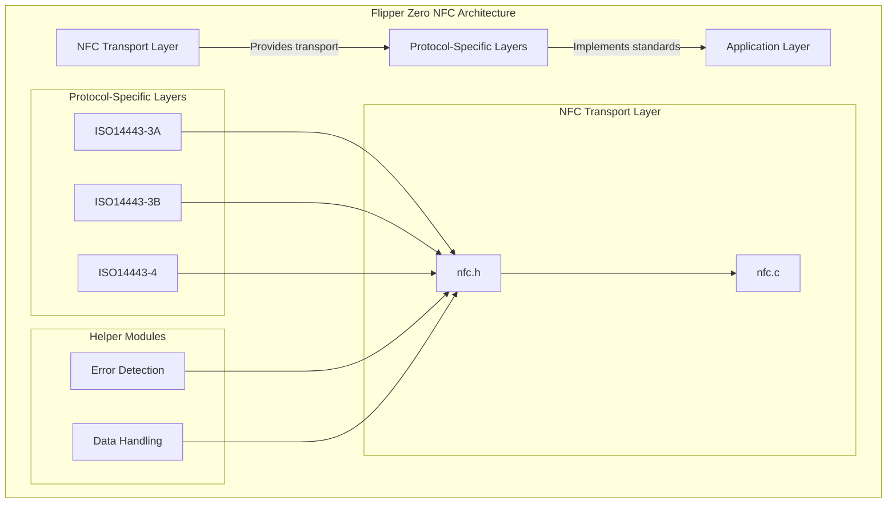
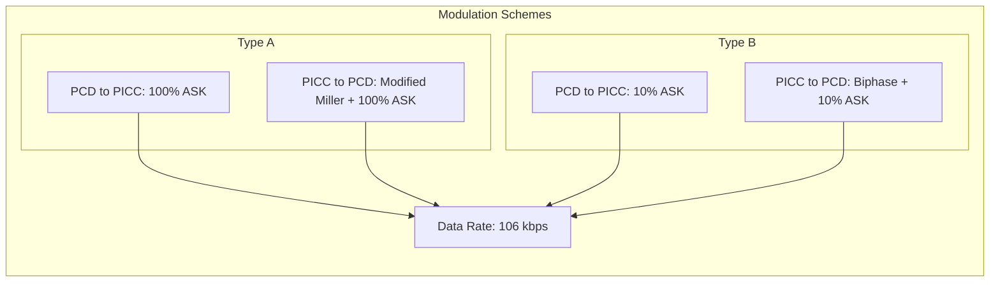
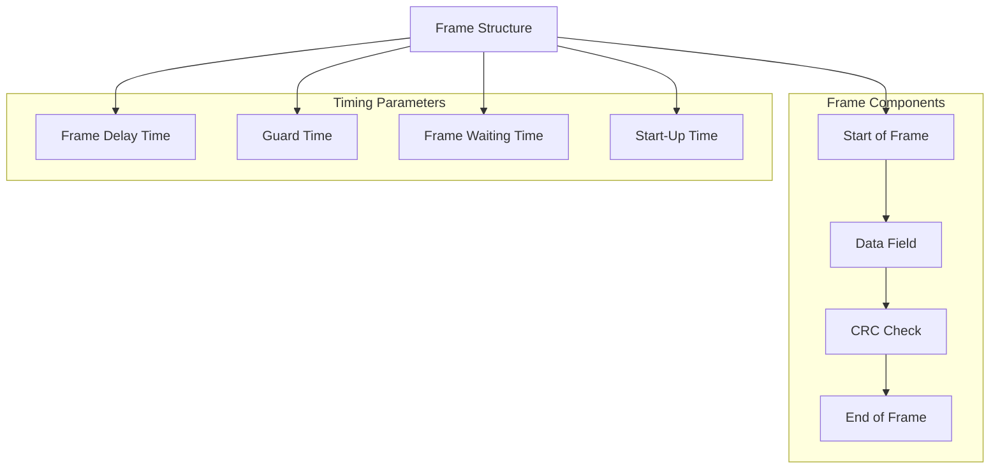
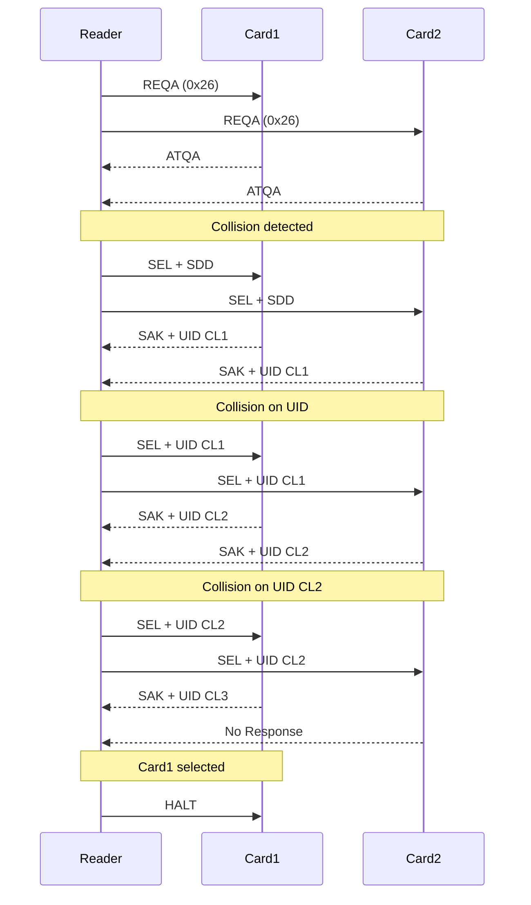
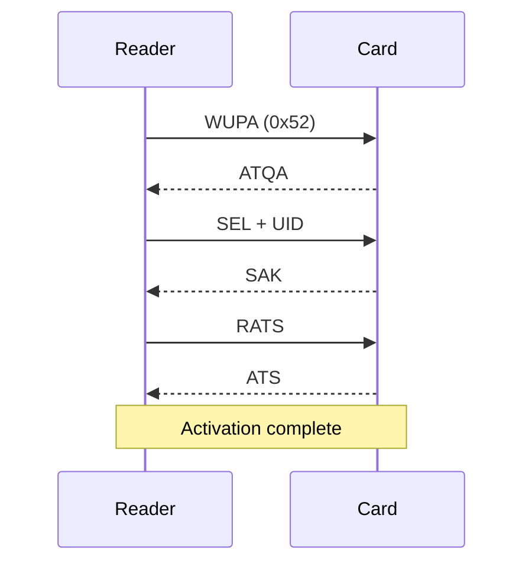
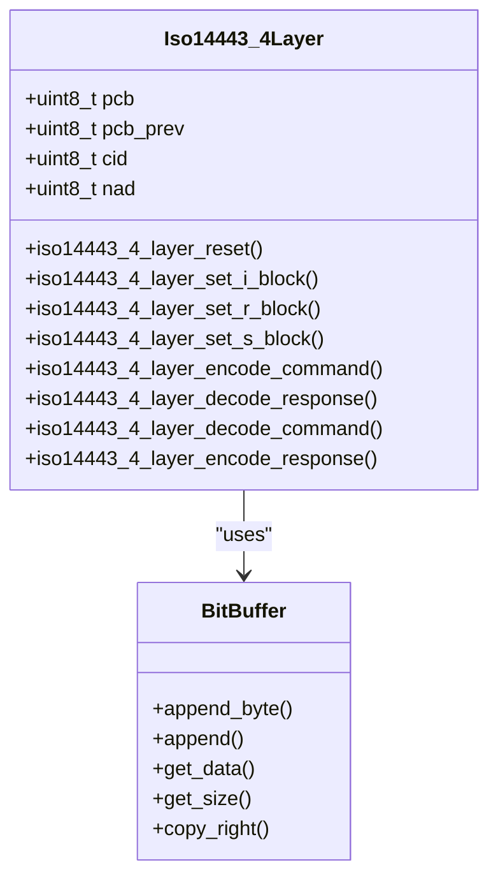
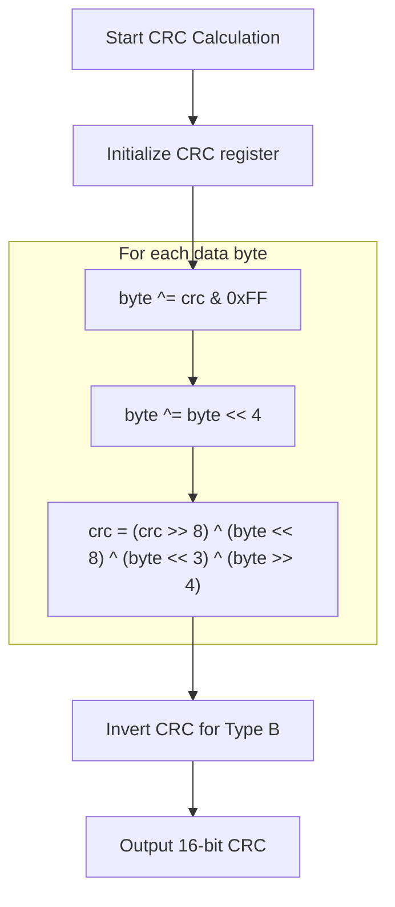
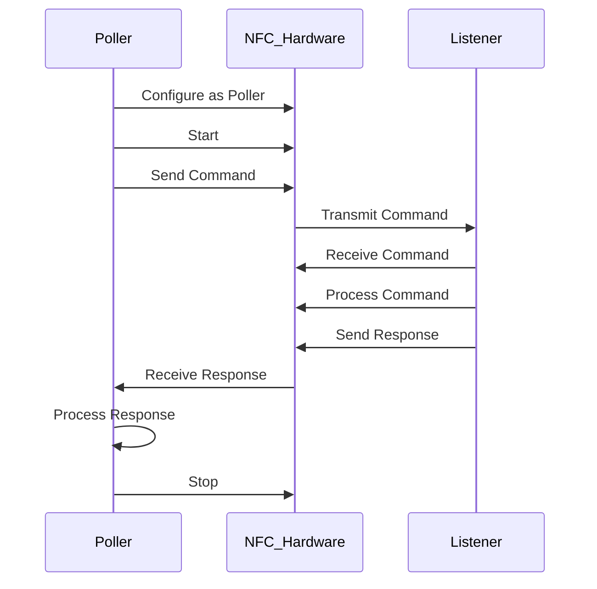

# ISO14443 A/B Protocols

<cite>
**Referenced Files in This Document**   
- [nfc.h](file://lib/nfc/nfc.h)
- [nfc.c](file://lib/nfc/nfc.c)
- [iso14443_4_layer.h](file://lib/nfc/helpers/iso14443_4_layer.h)
- [iso14443_4_layer.c](file://lib/nfc/helpers/iso14443_4_layer.c)
- [iso14443_crc.h](file://lib/nfc/helpers/iso14443_crc.h)
- [iso14443_crc.c](file://lib/nfc/helpers/iso14443_crc.c)
- [iso14443_3a_poller.h](file://lib/nfc/protocols/iso14443_3a/iso14443_3a_poller.h)
- [iso14443_3a_poller.c](file://lib/nfc/protocols/iso14443_3a/iso14443_3a_poller.c)
- [iso14443_3a_poller_i.h](file://lib/nfc/protocols/iso14443_3a/iso14443_3a_poller_i.h)
- [iso14443_3b_poller.h](file://lib/nfc/protocols/iso14443_3b/iso14443_3b_poller.h)
- [iso14443_3b_poller.c](file://lib/nfc/protocols/iso14443_3b/iso14443_3b_poller.c)
- [iso14443_3b_poller_i.h](file://lib/nfc/protocols/iso14443_3b/iso14443_3b_poller_i.h)
- [nfc_poller.h](file://lib/nfc/nfc_poller.h)
- [nfc_listener.h](file://lib/nfc/nfc_listener.h)
</cite>

## Table of Contents
1. [Introduction](#introduction)
2. [ISO14443 Protocol Overview](#iso14443-protocol-overview)
3. [Modulation Schemes and Data Rates](#modulation-schemes-and-data-rates)
4. [Frame Structure and Timing Requirements](#frame-structure-and-timing-requirements)
5. [Anti-Collision Procedures](#anti-collision-procedures)
6. [Protocol Activation Sequences](#protocol-activation-sequences)
7. [ISO/IEC 14443-4 T=CL Protocol Implementation](#isoiec-14443-4-tcl-protocol-implementation)
8. [Error Detection and CRC Implementation](#error-detection-and-crc-implementation)
9. [NFC Poller and Listener Architecture](#nfc-poller-and-listener-architecture)
10. [Code Examples and Implementation Details](#code-examples-and-implementation-details)

## Introduction
This document provides comprehensive documentation for the ISO14443 A/B protocols implementation in Flipper Zero. The ISO/IEC 14443 standard defines the identification cards - contactless integrated circuit cards - proximity cards, which is fundamental to the Flipper Zero's NFC capabilities. This documentation covers the technical details of both Type A and Type B implementations, including modulation schemes, data rates, frame structures, anti-collision procedures, and protocol activation sequences. The document also details the implementation of ISO/IEC 14443-4 for T=CL protocol including RATS, PPS, and data block exchange, along with error detection mechanisms using CRC_A and CRC_B.

**Section sources**
- [nfc.h](file://lib/nfc/nfc.h#L0-L199)
- [nfc.c](file://lib/nfc/nfc.c#L0-L199)

## ISO14443 Protocol Overview
The ISO/IEC 14443 standard specifies the identification cards - contactless integrated circuit cards - proximity cards, operating at 13.56 MHz. The standard is divided into four parts, with parts 1-3 defining the physical characteristics, radio frequency power and signal interface, and initialization and anticollision, while part 4 defines the transmission protocol. Flipper Zero implements both Type A and Type B variants of this standard, providing comprehensive support for proximity card communication.

The implementation in Flipper Zero follows a layered architecture, with the NFC transport layer handling the physical communication and timing, while higher-level protocols manage the specific command sequences and data exchange. The core NFC functionality is implemented in the `lib/nfc` directory, with separate modules for different protocol types and helper functions.



**Diagram sources**
- [nfc.h](file://lib/nfc/nfc.h#L0-L199)
- [nfc.c](file://lib/nfc/nfc.c#L0-L199)

**Section sources**
- [nfc.h](file://lib/nfc/nfc.h#L0-L199)
- [nfc.c](file://lib/nfc/nfc.c#L0-L199)

## Modulation Schemes and Data Rates
The ISO14443 standard defines two main modulation schemes for Type A and Type B communication, both operating at a carrier frequency of 13.56 MHz with a data rate of 106 kbps.

### Type A Modulation
ISO/IEC 14443 Type A uses a 100% amplitude shift keying (ASK) modulation scheme for the reader to tag (PCD to PICC) communication. In this scheme, the carrier wave is completely turned off to represent a logical '0' (gap) and maintained for a logical '1'. The modulation index is 100%, meaning the carrier is fully suppressed during the gap. For the tag to reader (PICC to PCD) communication, Type A uses a modified Miller coding with 100% ASK modulation.

The implementation in Flipper Zero handles Type A modulation through the `furi_hal_nfc` hardware abstraction layer, with the transport layer managing the timing and data encoding. The `nfc_iso14443a_poller_trx_short_frame` function in `nfc.c` specifically handles the transmission of short frames used in the REQA command.

### Type B Modulation
ISO/IEC 14443 Type B uses a 10% amplitude shift keying (ASK) modulation scheme for the reader to tag communication. Unlike Type A, the carrier is not completely turned off; instead, it is reduced by 10% to represent a logical '0'. This lower modulation depth provides better noise immunity but requires more sophisticated detection circuitry. For the tag to reader communication, Type B uses a biphase coding (also known as Manchester coding) with 10% ASK modulation.

The Flipper Zero implementation supports Type B modulation through the same NFC transport layer, with protocol-specific functions handling the different modulation requirements. The `nfc_config` function in `nfc.c` sets up the appropriate technology configuration based on whether Type A or Type B is selected.



**Diagram sources**
- [nfc.h](file://lib/nfc/nfc.h#L0-L199)
- [nfc.c](file://lib/nfc/nfc.c#L0-L199)

**Section sources**
- [nfc.h](file://lib/nfc/nfc.h#L0-L199)
- [nfc.c](file://lib/nfc/nfc.c#L0-L199)

## Frame Structure and Timing Requirements
The ISO14443 standard defines specific frame structures and timing requirements for communication between the proximity coupling device (PCD) and proximity integrated circuit card (PICC).

### Frame Structure
Both Type A and Type B frames follow a similar structure consisting of:
- **Start of Frame (SOF)**: A synchronization pattern that indicates the beginning of a frame
- **Data Field**: The actual data being transmitted
- **Cyclic Redundancy Check (CRC)**: Error detection code
- **End of Frame (EOF)**: A pattern indicating the end of the frame

For Type A, the SOF consists of a 7-bit pause followed by a 1-bit start bit. The EOF consists of a 2-bit pause. Type B uses a different SOF pattern with a synchronization sequence and a start of frame delimiter.

### Timing Requirements
The timing requirements are critical for proper communication and are strictly defined in the ISO14443 standard. The key timing parameters include:

- **Frame Delay Time (FDT)**: The minimum time between two consecutive frames
- **Guard Time**: A time interval used to separate consecutive frames
- **Frame Waiting Time (FWT)**: The maximum time a device should wait for a response
- **Start-Up Time**: The time required for a PICC to become active after entering the PCD's field

In the Flipper Zero implementation, these timing parameters are managed by the NFC transport layer. The `nfc_set_fdt_poll_fc`, `nfc_set_guard_time_us`, and `nfc_set_fdt_poll_poll_us` functions in `nfc.c` allow configuration of these timing parameters. The state machine in the poller worker handles the timing of frame transmission and reception.



**Diagram sources**
- [nfc.h](file://lib/nfc/nfc.h#L0-L199)
- [nfc.c](file://lib/nfc/nfc.c#L0-L199)

**Section sources**
- [nfc.h](file://lib/nfc/nfc.h#L0-L199)
- [nfc.c](file://lib/nfc/nfc.c#L0-L199)

## Anti-Collision Procedures
The anti-collision procedures in ISO14443 are designed to allow a reader to identify and communicate with a single card when multiple cards are present in the field.

### Type A Anti-Collision (REQA/WUPA)
The Type A anti-collision procedure follows a cascade protocol with three levels. The process begins with the reader sending a REQA (Request Type A) command (0x26) to detect any Type A cards in the field. Cards that receive this command respond with their ATQA (Answer to Request) data, which includes information about their capabilities.

If multiple cards respond, causing a collision, the reader initiates the selection process using the SEL (Select) command. The selection process occurs in cascades, with each cascade level handling a portion of the card's UID (Unique Identifier). The cascade levels are:
- Cascade Level 1: Bytes 0-3 of UID
- Cascade Level 2: Bytes 4-7 of UID  
- Cascade Level 3: Bytes 8-10 of UID

The selection process involves sending a SEL command followed by a SDD (Select All) command with a specific bit pattern. Cards compare this pattern with their UID and respond accordingly. The process continues until a single card is selected.

In the Flipper Zero implementation, the `iso14443_3a_poller_activate` function in `iso14443_3a_poller.c` handles the complete anti-collision and activation procedure. The function manages the cascade levels and selection process to identify and select a single card.

### Type B Anti-Collision (REQB/WUPB)
The Type B anti-collision procedure uses a different approach called "slotted ALOHA". The reader sends a REQB (Request Type B) command with a parameter indicating the number of time slots to use. Each card in the field randomly selects a slot and responds during that slot. If multiple cards select the same slot, a collision occurs, and those cards must try again in subsequent rounds.

The REQB command includes:
- **Command Code**: 0x05 for REQB
- **AFC (Application Family Code)**: Indicates the application type
- **NUM_SLOTS**: Number of slots (0-7, representing 1, 2, 4, 8, 16 slots)

Cards respond with an ATQB (Answer to Request Type B) that includes their PUPI (Pseudo-Unique PICC Identifier), protocol information, and application data. The reader can then select a specific card using its PUPI.

The Flipper Zero implementation handles Type B anti-collision through the `iso14443_3b_poller_activate` function, which manages the slotted ALOHA protocol and card selection.



**Diagram sources**
- [iso14443_3a_poller.c](file://lib/nfc/protocols/iso14443_3a/iso14443_3a_poller.c#L0-L128)
- [iso14443_3a_poller.h](file://lib/nfc/protocols/iso14443_3a/iso14443_3a_poller.h#L0-L145)

**Section sources**
- [iso14443_3a_poller.c](file://lib/nfc/protocols/iso14443_3a/iso14443_3a_poller.c#L0-L128)
- [iso14443_3a_poller.h](file://lib/nfc/protocols/iso14443_3a/iso14443_3a_poller.h#L0-L145)

## Protocol Activation Sequences
The protocol activation sequences in ISO14443 establish communication between the reader and card after the anti-collision procedure has selected a specific card.

### Type A Activation Sequence
After successful anti-collision and selection, the Type A activation sequence proceeds as follows:

1. **WUPA (Wake-Up Type A)**: The reader sends a WUPA command (0x52) to wake up all Type A cards, including those in HALT state
2. **ATQA Response**: Cards respond with their ATQA data
3. **SEL (Select)**: The reader sends a SEL command to select a specific card by its UID
4. **SAK (Select Acknowledge)**: The selected card responds with SAK, indicating successful selection
5. **RATS (Request for Answer to Select)**: The reader sends a RATS command to negotiate communication parameters
6. **ATS (Answer to Select)**: The card responds with ATS, providing information about its communication capabilities

The Flipper Zero implementation handles this sequence through the `iso14443_3a_poller_activate` function, which coordinates the various steps of the activation process. The function uses the `iso14443_3a_poller_txrx` function to send commands and receive responses.

### Type B Activation Sequence
The Type B activation sequence follows a different pattern:

1. **REQB (Request Type B)**: The reader sends a REQB command to detect Type B cards
2. **ATQB (Answer to Request Type B)**: Cards respond with ATQB, containing their PUPI and protocol information
3. **ATTRIB**: The reader sends an ATTRIB command to select a specific card and configure communication parameters
4. **Response**: The selected card responds, confirming the configuration

The `iso14443_3b_poller_activate` function in the Flipper Zero implementation manages this sequence, handling the REQB/ATQB exchange and ATTRIB command.



**Diagram sources**
- [iso14443_3a_poller.c](file://lib/nfc/protocols/iso14443_3a/iso14443_3a_poller.c#L0-L128)
- [iso14443_3a_poller.h](file://lib/nfc/protocols/iso14443_3a/iso14443_3a_poller.h#L0-L145)

**Section sources**
- [iso14443_3a_poller.c](file://lib/nfc/protocols/iso14443_3a/iso14443_3a_poller.c#L0-L128)
- [iso14443_3a_poller.h](file://lib/nfc/protocols/iso14443_3a/iso14443_3a_poller.h#L0-L145)

## ISO/IEC 14443-4 T=CL Protocol Implementation
The ISO/IEC 14443-4 standard defines the transmission protocol for proximity cards, specifically the T=CL protocol. This protocol enables block-oriented data exchange between the reader and card.

### RATS (Request for Answer to Select)
The RATS command is sent by the reader to request information about the card's communication capabilities. The command structure includes:
- **Command Code**: 0xE0
- **TA**: Optional parameter indicating the maximum frame size
- **TB**: Optional parameter indicating support for higher bit rates
- **TC**: Optional parameter indicating CID (Card Identifier) and NAD (Node Address) support

The card responds with ATS (Answer to Select), which contains detailed information about its capabilities, including:
- **TL**: Length of ATS
- **T0**: Format byte indicating presence of TA, TB, TC
- **TA(1)**: Bit rate capability
- **TB(1)**: Maximum frame size and waiting time
- **TC(1)**: Duration of frame guard time
- **Historical Bytes**: Card manufacturer and application information

In the Flipper Zero implementation, the RATS command is handled by the ISO14443-4 layer, which constructs the appropriate command frame and processes the ATS response.

### PPS (Protocol and Parameter Selection)
The PPS command allows the reader and card to negotiate communication parameters such as bit rate. The PPS command structure includes:
- **PPS0**: Command identifier (0xD0)
- **PPS1**: Bit rate capability
- **PPS2**: Optional parameter
- **PPS3**: Optional parameter
- **CRC**: Error detection code

The card responds with a PPS response confirming the selected parameters or rejecting the request.

### Data Block Exchange
The T=CL protocol defines three types of data blocks for communication:

1. **I-blocks (Information blocks)**: Carry application data and can be chained
2. **R-blocks (Receive blocks)**: Used for flow control and acknowledgments
3. **S-blocks (Supervisory blocks)**: Used for protocol control functions

The Flipper Zero implementation handles these block types through the `Iso14443_4Layer` structure defined in `iso14443_4_layer.h`. The layer manages block sequencing, chaining, and error recovery.



**Diagram sources**
- [iso14443_4_layer.h](file://lib/nfc/helpers/iso14443_4_layer.h#L0-L65)
- [iso14443_4_layer.c](file://lib/nfc/helpers/iso14443_4_layer.c#L0-L318)

**Section sources**
- [iso14443_4_layer.h](file://lib/nfc/helpers/iso14443_4_layer.h#L0-L65)
- [iso14443_4_layer.c](file://lib/nfc/helpers/iso14443_4_layer.c#L0-L318)

## Error Detection and CRC Implementation
Error detection in ISO14443 is implemented using cyclic redundancy check (CRC) codes, with different polynomials for Type A and Type B.

### CRC_A and CRC_B
- **CRC_A**: Uses the polynomial x^16 + x^12 + x^5 + 1 (0x6363)
- **CRC_B**: Uses the polynomial x^16 + x^12 + x^5 + 1 (0xFFFF) with final inversion

The CRC is calculated over all bytes of the frame except the CRC itself and is transmitted in little-endian order (least significant byte first).

### Implementation in Flipper Zero
The CRC implementation is located in `lib/nfc/helpers/iso14443_crc.c` and `iso14443_crc.h`. The `iso14443_crc_calculate` function implements the CRC algorithm for both types:

```c
static uint16_t iso14443_crc_calculate(Iso14443CrcType type, const uint8_t* data, size_t data_size) {
    uint16_t crc;
    
    if(type == Iso14443CrcTypeA) {
        crc = ISO14443_3A_CRC_INIT; // 0x6363
    } else if(type == Iso14443CrcTypeB) {
        crc = ISO14443_3B_CRC_INIT; // 0xFFFF
    } else {
        furi_crash("Wrong ISO14443 CRC type");
    }
    
    for(size_t i = 0; i < data_size; i++) {
        uint8_t byte = data[i];
        byte ^= (uint8_t)(crc & 0xff);
        byte ^= byte << 4;
        crc = (crc >> 8) ^ (((uint16_t)byte) << 8) ^ (((uint16_t)byte) << 3) ^ (byte >> 4);
    }
    
    return type == Iso14443CrcTypeA ? crc : ~crc;
}
```

The implementation provides three main functions:
- `iso14443_crc_append`: Calculates CRC and appends it to the data
- `iso14443_crc_check`: Verifies the CRC of received data
- `iso14443_crc_trim`: Removes the CRC from received data after verification

These functions are used throughout the NFC stack to ensure data integrity during communication.



**Diagram sources**
- [iso14443_crc.h](file://lib/nfc/helpers/iso14443_crc.h#L0-L27)
- [iso14443_crc.c](file://lib/nfc/helpers/iso14443_crc.c#L0-L62)

**Section sources**
- [iso14443_crc.h](file://lib/nfc/helpers/iso14443_crc.h#L0-L27)
- [iso14443_crc.c](file://lib/nfc/helpers/iso14443_crc.c#L0-L62)

## NFC Poller and Listener Architecture
The NFC communication flow in Flipper Zero is managed by two main components: the poller and the listener, which represent the two roles in NFC communication.

### Poller Architecture
The poller represents the reader device (PCD) that initiates communication. In Flipper Zero, the poller is implemented as a state machine with the following states:

- **Idle**: Initial state, waiting for activation
- **Start**: Beginning the polling sequence
- **Ready**: Ready to communicate with a card
- **Reset**: Resetting the communication state
- **Stop**: Stopping the polling operation

The poller state machine is implemented in `nfc.c` with the `nfc_worker_poller_state_handlers` array defining the state handlers:

```c
static const NfcWorkerPollerStateHandler nfc_worker_poller_state_handlers[NfcPollerStateNum] = {
    [NfcPollerStateStart] = nfc_worker_poller_start_handler,
    [NfcPollerStateReady] = nfc_worker_poller_ready_handler,
    [NfcPollerStateReset] = nfc_worker_poller_reset_handler,
    [NfcPollerStateStop] = nfc_worker_poller_stop_handler,
};
```

### Listener Architecture
The listener represents the card (PICC) that responds to the reader's commands. The listener implementation handles incoming commands and generates appropriate responses. The main states include:

- **Idle**: Waiting for incoming field
- **FieldOn**: Reader's field detected
- **RxEnd**: Data reception completed
- **ListenerActivated**: Listener has been activated by the reader

The listener runs in a separate thread and processes events from the NFC hardware. When a command is received, it is passed to the appropriate protocol handler to generate a response.

### Communication Flow
The communication flow between poller and listener follows the ISO14443 standard:

1. The poller sends a command frame
2. The listener receives the frame and processes it
3. The listener sends a response frame
4. The poller receives the response and processes it

This exchange is managed by the NFC transport layer, which handles the timing, error detection, and data framing.



**Diagram sources**
- [nfc.h](file://lib/nfc/nfc.h#L0-L199)
- [nfc.c](file://lib/nfc/nfc.c#L0-L199)
- [nfc_poller.h](file://lib/nfc/nfc_poller.h)
- [nfc_listener.h](file://lib/nfc/nfc_listener.h)

**Section sources**
- [nfc.h](file://lib/nfc/nfc.h#L0-L199)
- [nfc.c](file://lib/nfc/nfc.c#L0-L199)

## Code Examples and Implementation Details
This section provides concrete code examples from the Flipper Zero implementation showing how the device handles inventory, selection, and activation of ISO14443 tags.

### Anti-Collision and Selection Example
The following code demonstrates how the Flipper Zero performs anti-collision and selection for Type A cards:

```c
Iso14443_3aError iso14443_3a_poller_activate(Iso14443_3aPoller* instance, Iso14443_3aData* iso14443_3a_data) {
    Iso14443_3aError error = Iso14443_3aErrorNone;
    
    // Send REQA to detect cards
    bit_buffer_reset(instance->tx_buffer);
    bit_buffer_append_byte(instance->tx_buffer, ISO14443_3A_CMD_REQA);
    
    error = iso14443_3a_poller_txrx(
        instance, 
        instance->tx_buffer, 
        instance->rx_buffer, 
        ISO14443_3A_FWT_ATQA
    );
    
    if(error != Iso14443_3aErrorNone) {
        return error;
    }
    
    // Process ATQA response
    if(bit_buffer_get_size_bytes(instance->rx_buffer) != ISO14443_3A_ATQA_SIZE) {
        return Iso14443_3aErrorWrongAnswer;
    }
    
    // Perform selection cascade
    for(uint8_t cascade_level = 0; cascade_level < 3; cascade_level++) {
        // Build SEL command for current cascade level
        iso14443_3a_poller_build_sel_cmd(instance, cascade_level);
        
        error = iso14443_3a_poller_txrx(
            instance,
            instance->tx_buffer,
            instance->rx_buffer,
            ISO14443_3A_FWT_SAK
        );
        
        if(error != Iso14443_3aErrorNone) {
            return error;
        }
        
        // Process SAK response and extract UID portion
        iso14443_3a_poller_process_sak_response(instance, iso14443_3a_data, cascade_level);
    }
    
    return Iso14443_3aErrorNone;
}
```

### T=CL Protocol Implementation Example
The following example shows how the ISO14443-4 layer handles I-block encoding:

```c
void iso14443_4_layer_encode_command(
    Iso14443_4Layer* instance,
    const BitBuffer* input_data,
    BitBuffer* block_data) {
    furi_assert(instance);

    // Append PCB byte with appropriate flags
    bit_buffer_append_byte(block_data, instance->pcb);
    
    // Append the actual data
    bit_buffer_append(block_data, input_data);

    // Toggle the sequence bit for next transmission
    iso14443_4_layer_update_pcb(instance, true);
}
```

### NFC Poller Initialization Example
The following code shows how the NFC poller is initialized and configured:

```c
static Iso14443_3aPoller* iso14443_3a_poller_alloc(Nfc* nfc) {
    furi_assert(nfc);

    Iso14443_3aPoller* instance = malloc(sizeof(Iso14443_3aPoller));
    instance->nfc = nfc;
    instance->tx_buffer = bit_buffer_alloc(ISO14443_3A_POLLER_MAX_BUFFER_SIZE);
    instance->rx_buffer = bit_buffer_alloc(ISO14443_3A_POLLER_MAX_BUFFER_SIZE);

    // Configure NFC for Type A polling
    nfc_config(instance->nfc, NfcModePoller, NfcTechIso14443a);
    
    // Set timing parameters
    nfc_set_guard_time_us(instance->nfc, ISO14443_3A_GUARD_TIME_US);
    nfc_set_fdt_poll_fc(instance->nfc, ISO14443_3A_FDT_POLL_FC);
    nfc_set_fdt_poll_poll_us(instance->nfc, ISO14443_3A_POLL_POLL_MIN_US);
    
    instance->data = iso14443_3a_alloc();
    
    return instance;
}
```

These code examples demonstrate the comprehensive implementation of ISO14443 A/B protocols in Flipper Zero, showing how the device handles the various aspects of NFC communication from low-level timing to high-level protocol handling.

**Section sources**
- [iso14443_3a_poller.c](file://lib/nfc/protocols/iso14443_3a/iso14443_3a_poller.c#L0-L128)
- [iso14443_4_layer.c](file://lib/nfc/helpers/iso14443_4_layer.c#L0-L318)
- [nfc.c](file://lib/nfc/nfc.c#L0-L199)