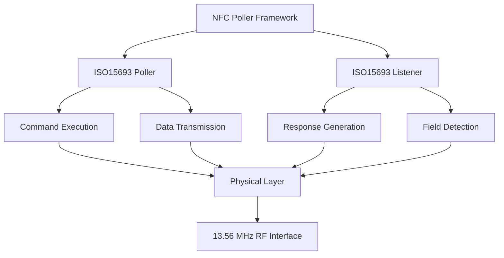
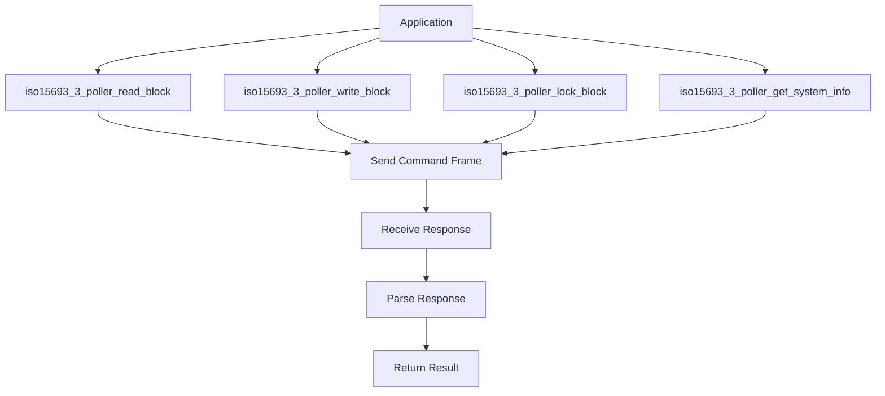
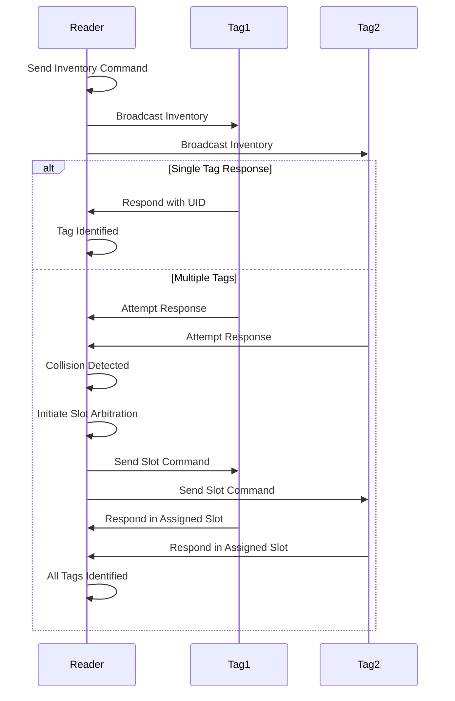
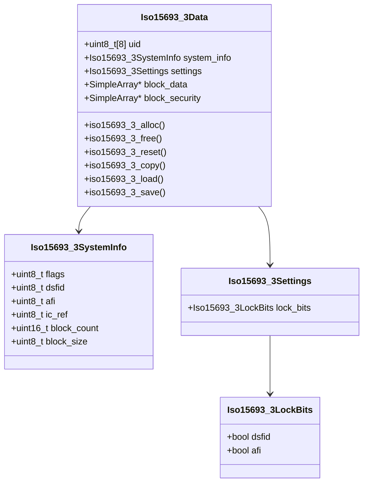
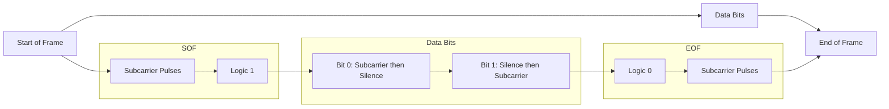
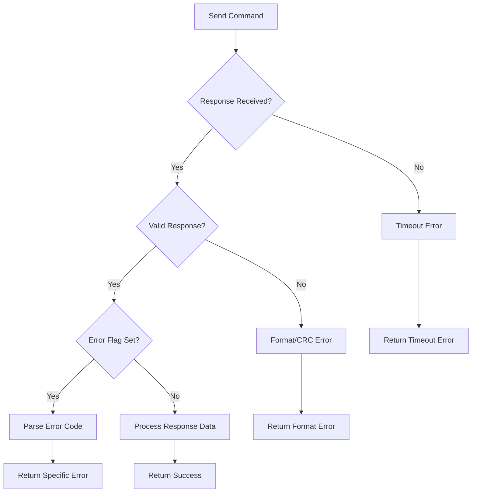

# ISO15693 Protocol

<cite>
**Referenced Files in This Document**   
- [iso15693_3.h](file://lib/nfc/protocols/iso15693_3/iso15693_3.h)
- [iso15693_3.c](file://lib/nfc/protocols/iso15693_3/iso15693_3.c)
- [iso15693_3_poller.h](file://lib/nfc/protocols/iso15693_3/iso15693_3_poller.h)
- [iso15693_3_poller.c](file://lib/nfc/protocols/iso15693_3/iso15693_3_poller.c)
- [iso15693_signal.h](file://lib/digital_signal/presets/nfc/iso15693_signal.h)
- [iso15693_signal.c](file://lib/digital_signal/presets/nfc/iso15693_signal.c)
- [iso15693_3_device_defs.h](file://lib/nfc/protocols/iso15693_3/iso15693_3_device_defs.h)
- [iso15693_3_listener.h](file://lib/nfc/protocols/iso15693_3/iso15693_3_listener.h)
- [iso15693_3_listener.c](file://lib/nfc/protocols/iso15693_3/iso15693_3_listener.c)
</cite>

## Table of Contents
1. [Introduction](#introduction)
2. [Physical Layer Specifications](#physical-layer-specifications)
3. [Protocol Architecture](#protocol-architecture)
4. [Command Set Implementation](#command-set-implementation)
5. [Memory Organization](#memory-organization)
6. [Anti-Collision Mechanism](#anti-collision-mechanism)
7. [Data Structures](#data-structures)
8. [Signal Modulation and Frame Structure](#signal-modulation-and-frame-structure)
9. [Practical Examples](#practical-examples)
10. [Error Handling](#error-handling)

## Introduction

The ISO15693 protocol implementation in Flipper Zero provides comprehensive support for ISO/IEC 15693-3 compliant RFID tags. This documentation details the technical specifications, architecture, and functionality of the implementation, focusing on the 13.56 MHz operating frequency, data communication parameters, command set, and memory organization. The implementation enables reading, writing, and emulation of ISO15693 tags, supporting various applications from access control to inventory management.

**Section sources**
- [iso15693_3.h](file://lib/nfc/protocols/iso15693_3/iso15693_3.h#L1-L163)

## Physical Layer Specifications

The ISO15693 protocol operates at the standard 13.56 MHz frequency, which is the carrier frequency for high-frequency RFID systems. The physical layer implementation in Flipper Zero uses subcarrier modulation for communication between the reader and tag.

The signal generation is handled by the `Iso15693Signal` structure, which manages the digital signal sequence for transmission. The carrier frequency is defined as 13.56 MHz in the implementation:

```c
#define ISO15693_SIGNAL_FC     (13.56e6)
#define ISO15693_SIGNAL_FC_16  (16.0e11 / ISO15693_SIGNAL_FC)
#define ISO15693_SIGNAL_FC_256 (256.0e11 / ISO15693_SIGNAL_FC)
#define ISO15693_SIGNAL_FC_768 (768.0e11 / ISO15693_SIGNAL_FC)
```

The data rate is configurable between high and low rates, with the high data rate corresponding to approximately 26.48 kbps. The implementation supports both data rates through the `Iso15693SignalDataRate` enumeration:

```c
typedef enum {
    Iso15693SignalDataRateHi, /**< High data rate. */
    Iso15693SignalDataRateLo, /**< Low data rate. */
    Iso15693SignalDataRateNum, /**< Data rate mode count. Internal use. */
} Iso15693SignalDataRate;
```

The modulation scheme used is a form of amplitude shift keying with subcarrier modulation, where data is encoded by the presence or absence of subcarrier pulses within specific time slots.

**Section sources**
- [iso15693_signal.h](file://lib/digital_signal/presets/nfc/iso15693_signal.h#L1-L73)
- [iso15693_signal.c](file://lib/digital_signal/presets/nfc/iso15693_signal.c#L1-L205)

## Protocol Architecture

The ISO15693 implementation in Flipper Zero follows a modular architecture with distinct components for polling (reader mode) and listening (tag emulation mode). The architecture is designed around the NFC poller framework, providing a consistent interface for RFID protocol implementations.



**Diagram sources**
- [iso15693_3_poller.h](file://lib/nfc/protocols/iso15693_3/iso15693_3_poller.h#L1-L149)
- [iso15693_3_listener.h](file://lib/nfc/protocols/iso15693_3/iso15693_3_listener.h#L1-L30)

The poller component handles communication with ISO15693 tags, while the listener component manages tag emulation. Both components interface with the physical layer through the digital signal subsystem.

**Section sources**
- [iso15693_3_poller.h](file://lib/nfc/protocols/iso15693_3/iso15693_3_poller.h#L1-L149)
- [iso15693_3_listener.h](file://lib/nfc/protocols/iso15693_3/iso15693_3_listener.h#L1-L30)

## Command Set Implementation

The ISO15693 protocol implementation supports the full set of mandatory and optional commands defined in the ISO/IEC 15693-3 standard. The command set is defined in the header file with specific opcodes for each command.

### Mandatory Commands
The mandatory command set includes basic inventory and control functions:

```c
#define ISO15693_3_CMD_INVENTORY           (0x01U)
#define ISO15693_3_CMD_STAY_QUIET          (0x02U)
```

### Optional Commands
The optional command set provides extended functionality for memory access and configuration:

```c
#define ISO15693_3_CMD_READ_BLOCK          (0x20U)
#define ISO15693_3_CMD_WRITE_BLOCK         (0x21U)
#define ISO15693_3_CMD_LOCK_BLOCK          (0x22U)
#define ISO15693_3_CMD_READ_MULTI_BLOCKS   (0x23U)
#define ISO15693_3_CMD_WRITE_MULTI_BLOCKS  (0x24U)
#define ISO15693_3_CMD_SELECT              (0x25U)
#define ISO15693_3_CMD_RESET_TO_READY      (0x26U)
#define ISO15693_3_CMD_WRITE_AFI           (0x27U)
#define ISO15693_3_CMD_LOCK_AFI            (0x28U)
#define ISO15693_3_CMD_WRITE_DSFID         (0x29U)
#define ISO15693_3_CMD_LOCK_DSFID          (0x2AU)
#define ISO15693_3_CMD_GET_SYS_INFO        (0x2BU)
#define ISO15693_3_CMD_GET_BLOCKS_SECURITY (0x2CU)
```

The implementation provides specific functions for each command, accessible through the poller interface:



**Diagram sources**
- [iso15693_3.h](file://lib/nfc/protocols/iso15693_3/iso15693_3.h#L1-L163)
- [iso15693_3_poller.h](file://lib/nfc/protocols/iso15693_3/iso15693_3_poller.h#L1-L149)

**Section sources**
- [iso15693_3.h](file://lib/nfc/protocols/iso15693_3/iso15693_3.h#L1-L163)
- [iso15693_3_poller.h](file://lib/nfc/protocols/iso15693_3/iso15693_3_poller.h#L1-L149)

## Memory Organization

ISO15693 tags organize their memory in blocks, with each block having a specific size and address. The memory organization is represented in the `Iso15693_3Data` structure, which contains information about the tag's memory layout and contents.

```c
typedef struct {
    uint8_t uid[ISO15693_3_UID_SIZE];
    Iso15693_3SystemInfo system_info;
    Iso15693_3Settings settings;
    SimpleArray* block_data;
    SimpleArray* block_security;
} Iso15693_3Data;
```

The system information structure provides details about the memory configuration:

```c
typedef struct {
    uint8_t flags;
    uint8_t dsfid;
    uint8_t afi;
    uint8_t ic_ref;
    uint16_t block_count;
    uint8_t block_size;
} Iso15693_3SystemInfo;
```

Key memory parameters:
- **Block Count**: Number of blocks available in the tag's memory
- **Block Size**: Size of each block in bytes
- **DSFID**: Data Storage Format Identifier
- **AFI**: Application Family Identifier

The implementation supports both single and multiple block operations:
- **Single Block Reading/Writing**: Using `iso15693_3_poller_read_block` and `iso15693_3_poller_write_block`
- **Multiple Block Reading/Writing**: Using `iso15693_3_poller_read_blocks` and `iso15693_3_poller_read_blocks`

Addressing modes include:
- Direct addressing by block number
- Sequential addressing for multiple block operations

**Section sources**
- [iso15693_3.h](file://lib/nfc/protocols/iso15693_3/iso15693_3.h#L1-L163)

## Anti-Collision Mechanism

The ISO15693 anti-collision mechanism is implemented through the inventory procedure, which allows the reader to identify individual tags in a field containing multiple tags. The mechanism is based on the UID (Unique Identifier) of each tag.

The inventory procedure uses the Inventory command (opcode 0x01) with slot-based arbitration to identify tags without collisions. The implementation supports both single-slot and 16-slot inventory procedures, controlled by the inventory flag:

```c
#define ISO15693_3_REQ_FLAG_INVENTORY_T4 (0U << 2)
#define ISO15693_3_REQ_FLAG_INVENTORY_T5 (1U << 2)
#define ISO15693_3_REQ_FLAG_T5_N_SLOTS_16  (0U << 5)
#define ISO15693_3_REQ_FLAG_T5_N_SLOTS_1   (1U << 5)
```

The anti-collision process works as follows:



**Diagram sources**
- [iso15693_3.h](file://lib/nfc/protocols/iso15693_3/iso15693_3.h#L1-L163)
- [iso15693_3_poller.c](file://lib/nfc/protocols/iso15693_3/iso15693_3_poller.c#L1-L123)

The Stay Quiet command (opcode 0x02) is used to temporarily deactivate a tag after it has been identified, preventing it from responding to subsequent inventory commands:

```c
Iso15693_3Error iso15693_3_poller_inventory(Iso15693_3Poller* instance, uint8_t* uid);
```

This command is essential for the anti-collision procedure, allowing the reader to isolate and communicate with individual tags in a multi-tag environment.

**Section sources**
- [iso15693_3.h](file://lib/nfc/protocols/iso15693_3/iso15693_3.h#L1-L163)
- [iso15693_3_poller.h](file://lib/nfc/protocols/iso15693_3/iso15693_3_poller.h#L1-L149)

## Data Structures

The ISO15693 implementation uses several key data structures to represent tag information and protocol state.

### Iso15693_3Data Structure
The main data structure that represents an ISO15693 tag:

```c
typedef struct {
    uint8_t uid[ISO15693_3_UID_SIZE];           // 8-byte Unique Identifier
    Iso15693_3SystemInfo system_info;           // System information
    Iso15693_3Settings settings;                // Tag settings
    SimpleArray* block_data;                    // Block data storage
    SimpleArray* block_security;                // Block security status
} Iso15693_3Data;
```

### Iso15693_3SystemInfo Structure
Contains system-level information about the tag:

```c
typedef struct {
    uint8_t flags;                              // Feature flags
    uint8_t dsfid;                              // Data Storage Format Identifier
    uint8_t afi;                                // Application Family Identifier
    uint8_t ic_ref;                             // IC Reference
    uint16_t block_count;                       // Number of memory blocks
    uint8_t block_size;                         // Size of each block in bytes
} Iso15693_3SystemInfo;
```

### Iso15693_3Settings Structure
Contains security and configuration settings:

```c
typedef struct {
    Iso15693_3LockBits lock_bits;               // Lock bits for DSFID and AFI
} Iso15693_3Settings;
```

The implementation provides a complete set of functions for managing these data structures:



**Diagram sources**
- [iso15693_3.h](file://lib/nfc/protocols/iso15693_3/iso15693_3.h#L1-L163)

**Section sources**
- [iso15693_3.h](file://lib/nfc/protocols/iso15693_3/iso15693_3.h#L1-L163)

## Signal Modulation and Frame Structure

The ISO15693 protocol uses a specific modulation scheme and frame structure for communication between the reader and tag. The implementation in Flipper Zero accurately reproduces these physical layer characteristics.

### Modulation Scheme
The implementation uses a form of 1-of-4 modulation through subcarrier encoding. Data is transmitted using a 13.56 MHz carrier with a 423.75 kHz subcarrier (1/32 of the carrier frequency). The modulation is implemented in the `iso15693_signal.c` file:

```c
static void iso15693_add_subcarrier(DigitalSignal* signal, Iso15693SignalDataRate data_rate) {
    const uint32_t k = data_rate == Iso15693SignalDataRateHi ? ISO15693_SIGNAL_COEFF_HI :
                                                               ISO15693_SIGNAL_COEFF_LO;
    for(uint32_t i = 0; i < ISO15693_SIGNAL_ZERO_EDGES * k; ++i) {
        digital_signal_add_period_with_level(signal, ISO15693_SIGNAL_FC_16, !(i % 2));
    }
}
```

### Frame Structure
The frame structure consists of:
- Start of Frame (SOF)
- Data bits
- End of Frame (EOF)

The SOF and EOF are implemented as specific signal patterns:

```c
static inline void iso15693_add_sof(DigitalSignal* signal, Iso15693SignalDataRate data_rate) {
    for(uint32_t i = 0; i < ISO15693_SIGNAL_FC_768 / ISO15693_SIGNAL_FC_256; ++i) {
        iso15693_add_subcarrier(signal, data_rate);
    }
    iso15693_add_bit(signal, data_rate, true);
}

static inline void iso15693_add_eof(DigitalSignal* signal, Iso15693SignalDataRate data_rate) {
    iso15693_add_bit(signal, data_rate, false);
    for(uint32_t i = 0; i < ISO15693_SIGNAL_FC_768 / ISO15693_SIGNAL_FC_256; ++i) {
        iso15693_add_subcarrier(signal, data_rate);
    }
}
```

### Timing Diagram
The following timing diagram illustrates the signal structure for a typical ISO15693 communication:



**Diagram sources**
- [iso15693_signal.c](file://lib/digital_signal/presets/nfc/iso15693_signal.c#L1-L205)

**Section sources**
- [iso15693_signal.h](file://lib/digital_signal/presets/nfc/iso15693_signal.h#L1-L73)
- [iso15693_signal.c](file://lib/digital_signal/presets/nfc/iso15693_signal.c#L1-L205)

## Practical Examples

### Reading an ISO15693 Tag
The following example demonstrates how to read data from an ISO15693 tag:

```c
// Initialize poller
Iso15693_3Poller* poller = iso15693_3_poller_alloc(nfc);

// Allocate data structure
Iso15693_3Data* data = iso15693_3_alloc();

// Perform activation and inventory
Iso15693_3Error error = iso15693_3_poller_activate(poller, data);
if(error == Iso15693_3ErrorNone) {
    // Get system information
    Iso15693_3SystemInfo sys_info;
    error = iso15693_3_poller_get_system_info(poller, &sys_info);
    
    if(error == Iso15693_3ErrorNone) {
        // Read all blocks
        uint8_t* block_data = malloc(sys_info.block_count * sys_info.block_size);
        error = iso15693_3_poller_read_blocks(
            poller,
            block_data,
            sys_info.block_count,
            sys_info.block_size);
            
        if(error == Iso15693_3ErrorNone) {
            // Process read data
            // ...
        }
        
        free(block_data);
    }
}

// Cleanup
iso15693_3_free(data);
iso15693_3_poller_free(poller);
```

### Writing to an ISO15693 Tag
The following example demonstrates how to write data to an ISO15693 tag:

```c
// Initialize poller and data
Iso15693_3Poller* poller = iso15693_3_poller_alloc(nfc);
Iso15693_3Data* data = iso15693_3_alloc();

// Activate tag
Iso15693_3Error error = iso15693_3_poller_activate(poller, data);
if(error == Iso15693_3ErrorNone) {
    // Prepare data to write
    uint8_t write_data[4] = {0x01, 0x02, 0x03, 0x04};
    
    // Write to block 0
    error = iso15693_3_poller_write_block(
        poller,
        write_data,
        0,  // block number
        4); // block size
        
    if(error == Iso15693_3ErrorNone) {
        // Data successfully written
        // Verify by reading back
        uint8_t read_data[4];
        error = iso15693_3_poller_read_block(
            poller,
            read_data,
            0,
            4);
    }
}

// Cleanup
iso15693_3_free(data);
iso15693_3_poller_free(poller);
```

**Section sources**
- [iso15693_3_poller.h](file://lib/nfc/protocols/iso15693_3/iso15693_3_poller.h#L1-L149)
- [iso15693_3.h](file://lib/nfc/protocols/iso15693_3/iso15693_3.h#L1-L163)

## Error Handling

The ISO15693 implementation includes comprehensive error handling to manage various failure conditions during communication with tags. The error system is defined by the `Iso15693_3Error` enumeration:

```c
typedef enum {
    Iso15693_3ErrorNone,
    Iso15693_3ErrorNotPresent,
    Iso15693_3ErrorBufferEmpty,
    Iso15693_3ErrorBufferOverflow,
    Iso15693_3ErrorFieldOff,
    Iso15693_3ErrorWrongCrc,
    Iso15693_3ErrorTimeout,
    Iso15693_3ErrorFormat,
    Iso15693_3ErrorIgnore,
    Iso15693_3ErrorNotSupported,
    Iso15693_3ErrorUidMismatch,
    Iso15693_3ErrorFullyHandled,
    Iso15693_3ErrorUnexpectedResponse,
    Iso15693_3ErrorInternal,
    Iso15693_3ErrorCustom,
    Iso15693_3ErrorUnknown,
} Iso15693_3Error;
```

Additionally, the protocol defines specific error codes that can be returned by tags:

```c
#define ISO15693_3_RESP_ERROR_NOT_SUPPORTED        (0x01U)
#define ISO15693_3_RESP_ERROR_FORMAT               (0x02U)
#define ISO15693_3_RESP_ERROR_OPTION               (0x03U)
#define ISO15693_3_RESP_ERROR_UNKNOWN              (0x0FU)
#define ISO15693_3_RESP_ERROR_BLOCK_UNAVAILABLE    (0x10U)
#define ISO15693_3_RESP_ERROR_BLOCK_ALREADY_LOCKED (0x11U)
#define ISO15693_3_RESP_ERROR_BLOCK_LOCKED         (0x12U)
#define ISO15693_3_RESP_ERROR_BLOCK_WRITE          (0x13U)
#define ISO15693_3_RESP_ERROR_BLOCK_LOCK           (0x14U)
```

The error handling flow follows this pattern:



**Diagram sources**
- [iso15693_3.h](file://lib/nfc/protocols/iso15693_3/iso15693_3.h#L1-L163)

**Section sources**
- [iso15693_3.h](file://lib/nfc/protocols/iso15693_3/iso15693_3.h#L1-L163)