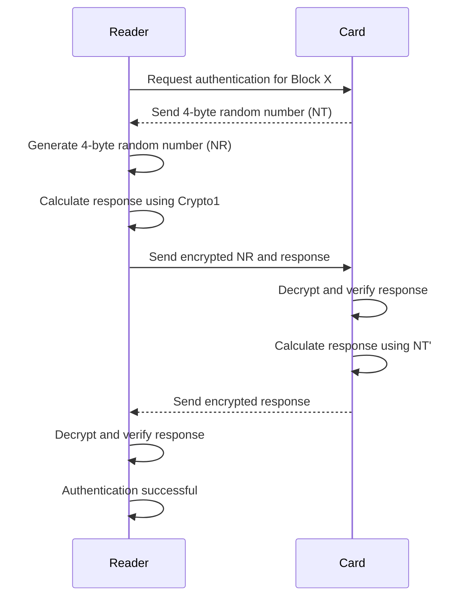
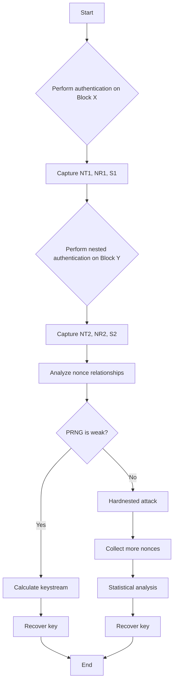
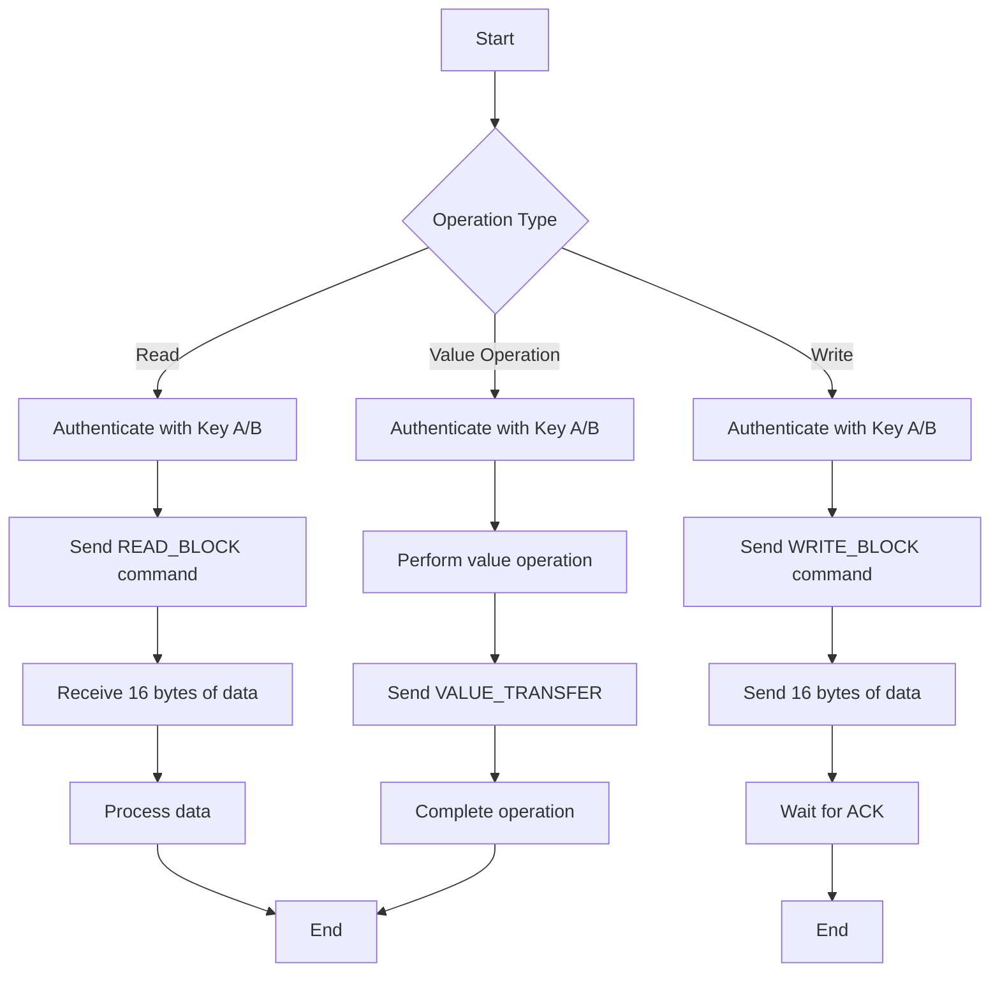
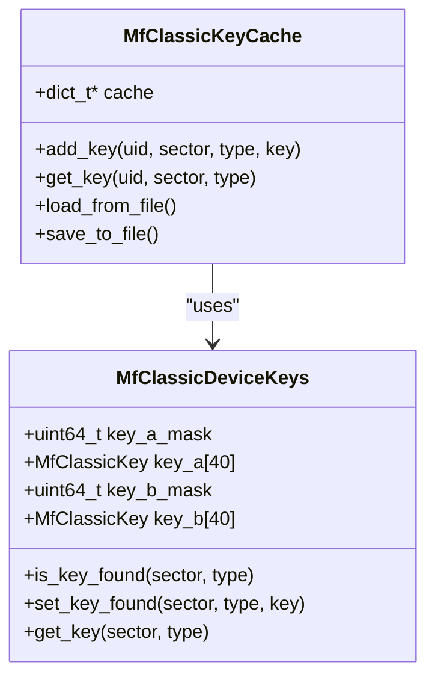

# MIFARE Classic

<cite>
**Referenced Files in This Document**   
- [mf_classic.h](file://lib/nfc/protocols/mf_classic/mf_classic.h)
- [mf_classic.c](file://lib/nfc/protocols/mf_classic/mf_classic.c)
- [mf_classic_poller.h](file://lib/nfc/protocols/mf_classic/mf_classic_poller.h)
- [mf_classic_poller.c](file://lib/nfc/protocols/mf_classic/mf_classic_poller.c)
- [mf_classic_key_cache.c](file://applications/main/nfc/helpers/mf_classic_key_cache.c)
- [NfcFileFormats.md](file://documentation/file_formats/NfcFileFormats.md)
</cite>

## Table of Contents
1. [Introduction](#introduction)
2. [Memory Organization](#memory-organization)
3. [Authentication Process](#authentication-process)
4. [Key Recovery Attacks](#key-recovery-attacks)
5. [Data Operations](#data-operations)
6. [Implementation Details](#implementation-details)
7. [Key Cache System](#key-cache-system)
8. [File Format](#file-format)

## Introduction
The MIFARE Classic protocol implementation in Flipper Zero provides comprehensive functionality for interacting with MIFARE Classic 1K and 4K cards. This documentation details the memory organization, authentication process, attack methods for key recovery, data operations, and implementation specifics. The Flipper Zero device can read, write, emulate, and analyze MIFARE Classic cards, making it a powerful tool for security research and access control system analysis.

**Section sources**
- [mf_classic.h](file://lib/nfc/protocols/mf_classic/mf_classic.h#L0-L249)

## Memory Organization

### Card Types and Structure
MIFARE Classic cards are organized into sectors and blocks, with different memory capacities:

**MIFARE Classic Types:**
- **Mini**: 5 sectors, 20 blocks total (0.3K)
- **1K**: 16 sectors, 64 blocks total
- **4K**: 40 sectors, 256 blocks total

Each block contains 16 bytes of data. The card structure is hierarchical, with sectors containing multiple blocks. The last block in each sector is the Sector Trailer, which contains two 6-byte keys (Key A and Key B) and 4 bytes of access conditions.

```mermaid
graph TD
A[MIFARE Classic Card] --> B[Sector 0]
A --> C[Sector 1]
A --> D[Sector N]
A --> E[Sector 39]
B --> F[Block 0]
B --> G[Block 1]
B --> H[Block 2]
B --> I[Block 3 - Sector Trailer]
C --> J[Block 4]
C --> K[Block 5]
C --> L[Block 6]
C --> M[Block 7 - Sector Trailer]
I --> N[Key A (6 bytes)]
I --> O[Access Bits (4 bytes)]
I --> P[Key B (6 bytes)]
```

**Diagram sources**
- [mf_classic.c](file://lib/nfc/protocols/mf_classic/mf_classic.c#L20-L50)

### Block and Sector Organization
The memory organization follows a specific pattern where each sector has a variable number of blocks:

- **Sectors 0-31**: Each contains 4 blocks (total 128 blocks)
- **Sectors 32-39**: Each contains 16 blocks (total 128 blocks)

This creates the 256-block structure of the MIFARE Classic 4K card. The first block (Block 0) contains the card's UID and manufacturer data, which cannot be modified.

**Section sources**
- [mf_classic.c](file://lib/nfc/protocols/mf_classic/mf_classic.c#L20-L50)

## Authentication Process

### Crypto1 Algorithm
The authentication process uses the proprietary Crypto1 stream cipher algorithm, which is a linear feedback shift register (LFSR) based cipher. The authentication is a three-pass mutual authentication sequence between the reader and the card.



**Diagram sources**
- [mf_classic_poller.c](file://lib/nfc/protocols/mf_classic/mf_classic_poller.c#L600-L800)

### Three-Pass Mutual Authentication
The authentication sequence follows these steps:

1. **First Pass**: The reader requests authentication for a specific block using either Key A (0x60) or Key B (0x61)
2. **Second Pass**: The card responds with a 4-byte random nonce (NT), and the reader generates its own 4-byte random nonce (NR)
3. **Third Pass**: The reader encrypts NR with the key and sends it along with a response encrypted with a derived key; the card verifies and responds with an encrypted response

The process ensures mutual authentication, where both the reader and card prove knowledge of the shared key without transmitting it directly.

**Section sources**
- [mf_classic_poller.c](file://lib/nfc/protocols/mf_classic/mf_classic_poller.c#L600-L800)

## Key Recovery Attacks

### Nested Authentication Attack
The Nested Authentication attack exploits the fact that nonces generated by the card during authentication follow predictable patterns in weak implementations. By performing authentication on one block and then immediately authenticating on another block in the same sector, the attacker can collect related nonces.



**Diagram sources**
- [mf_classic_poller.c](file://lib/nfc/protocols/mf_classic/mf_classic_poller.c#L1500-L1800)

### Darkside Attack
The Darkside attack exploits cards with weak random number generators that produce nonces with insufficient entropy. By collecting multiple authentication attempts, the attacker can identify patterns in the nonces and recover the keystream.

The attack works by:
1. Performing multiple authentication attempts
2. Collecting nonces with specific properties (e.g., low entropy)
3. Using the known plaintext attack to recover the keystream
4. Deriving the secret key from the keystream

### Hardnested Attack
The Hardnested attack is an advanced version that works against cards with stronger random number generators. It uses statistical analysis of large numbers of nonces to identify subtle patterns and recover keys.

The process involves:
1. Collecting thousands of nonces from the target card
2. Performing statistical analysis to identify correlations
3. Using optimized algorithms to reduce the key search space
4. Verifying candidate keys through authentication attempts

**Section sources**
- [mf_classic_poller.h](file://lib/nfc/protocols/mf_classic/mf_classic_poller.h#L50-L150)

## Data Operations

### Reading and Writing Procedures
The Flipper Zero implements standard MIFARE Classic commands for data operations:

**Available Commands:**
- **READ_BLOCK (0x30)**: Read 16 bytes from a block
- **WRITE_BLOCK (0xA0)**: Write 16 bytes to a block
- **VALUE_INCREMENT (0xC1)**: Increment value block
- **VALUE_DECREMENT (0xC0)**: Decrement value block
- **VALUE_RESTORE (0xC2)**: Restore value block
- **VALUE_TRANSFER (0xB0)**: Transfer value from internal register



**Diagram sources**
- [mf_classic_poller.c](file://lib/nfc/protocols/mf_classic/mf_classic_poller.c#L200-L400)

### Value Block Operations
Value blocks store integer values with built-in security features to prevent unauthorized modification. The operations include:

**Value Block Structure:**
- 32-bit value (4 bytes)
- 32-bit value inverse (4 bytes)
- 8-bit address (1 byte)
- 8-bit address inverse (1 byte)
- 6 bytes padding

**Operations:**
- **Increment**: Increases the value by a specified amount
- **Decrement**: Decreases the value by a specified amount
- **Restore**: Copies the value to an internal register
- **Transfer**: Copies the value from the internal register to the block

The value and its inverse must always be complementary, providing a simple checksum mechanism to detect corruption.

**Section sources**
- [mf_classic.c](file://lib/nfc/protocols/mf_classic/mf_classic.c#L700-L750)

## Implementation Details

### Sector Dumping Process
The sector dumping process in Flipper Zero follows a systematic approach:

1. Detect card type (Mini, 1K, or 4K)
2. Iterate through each sector
3. Attempt authentication with default keys or known keys
4. Read all blocks in the authenticated sector
5. Store the data and key information

```c
// Example code for sector dumping
MfClassicPoller* poller = mf_classic_poller_alloc(iso14443_3a_poller);
poller->callback = dump_callback;
poller->context = &dump_context;

// Set poller to read mode
poller->mfc_event_data.poller_mode.mode = MfClassicPollerModeRead;
poller->mfc_event_data.poller_mode.data = mf_classic_data;

// Start polling
nfc_poller_start(poller);
```

### Key Cracking Implementation
The key cracking implementation uses a combination of dictionary attacks and advanced cryptographic attacks:

```c
// Example code for key cracking
MfClassicPoller* poller = mf_classic_poller_alloc(iso14443_3a_poller);
poller->callback = crack_callback;
poller->context = &crack_context;

// Set poller to dictionary attack mode
poller->mfc_event_data.poller_mode.mode = MfClassicPollerModeDictAttackEnhanced;
poller->mfc_event_data.poller_mode.data = mf_classic_data;

// Start cracking process
nfc_poller_start(poller);
```

The implementation supports both standard and enhanced dictionary attacks, with the enhanced version including backdoor key testing and PRNG analysis.

**Section sources**
- [mf_classic_poller.c](file://lib/nfc/protocols/mf_classic/mf_classic_poller.c#L100-L300)

## Key Cache System

### Cache Implementation
The key cache system optimizes subsequent authentication attempts by storing previously discovered keys. This significantly reduces the time required for repeated operations on the same card.



**Diagram sources**
- [mf_classic.h](file://lib/nfc/protocols/mf_classic/mf_classic.h#L150-L180)
- [mf_classic_key_cache.c](file://applications/main/nfc/helpers/mf_classic_key_cache.c#L10-L50)

### Cache Operations
The key cache system provides the following functionality:

**Key Storage:**
- Stores keys indexed by card UID, sector number, and key type (A/B)
- Uses a bitmask to track which keys are known for each sector
- Persists keys to storage for future use

**Cache Benefits:**
- Eliminates the need to rediscover keys for previously analyzed cards
- Speeds up authentication for frequently accessed cards
- Reduces wear on the target card by minimizing authentication attempts

The cache is automatically consulted before attempting any authentication, and newly discovered keys are added to the cache for future use.

**Section sources**
- [mf_classic_key_cache.c](file://applications/main/nfc/helpers/mf_classic_key_cache.c#L10-L100)

## File Format

### NFC File Structure
The Flipper Zero stores MIFARE Classic data in a human-readable text format:

```
Filetype: Flipper NFC device
Version: 4
Device type: Mifare Classic
UID: BA E2 7C 9D
ATQA: 00 02
SAK: 18
Mifare Classic type: 4K
Data format version: 2
Block 0: BA E2 7C 9D B9 18 02 00 46 44 53 37 30 56 30 31
Block 1: 00 00 00 00 00 00 00 00 00 00 00 00 00 00 00 00
Block 2: 00 00 00 00 00 00 00 00 00 00 00 00 00 00 00 00
Block 3: FF FF FF FF FF FF FF 07 80 69 FF FF FF FF FF FF
```

The format includes the card's UID, ATQA, SAK, type, and all block data. Unknown data is represented by '??', while known data is stored as hexadecimal values.

**Section sources**
- [NfcFileFormats.md](file://documentation/file_formats/NfcFileFormats.md#L146-L210)