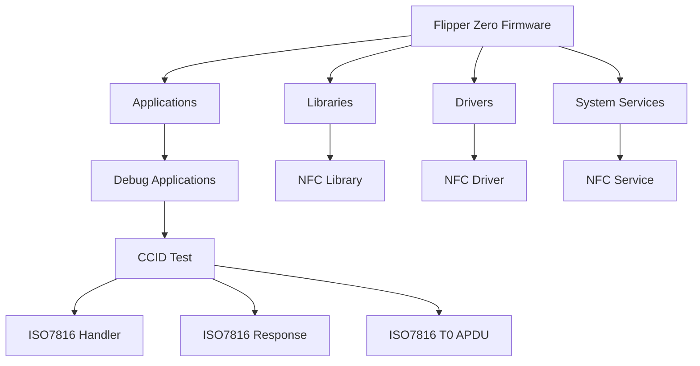
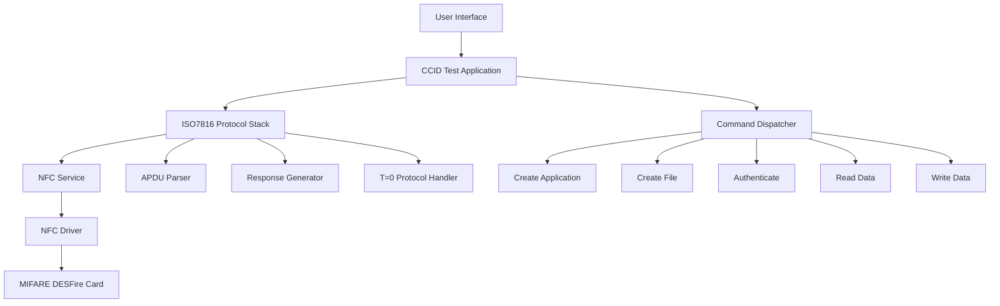
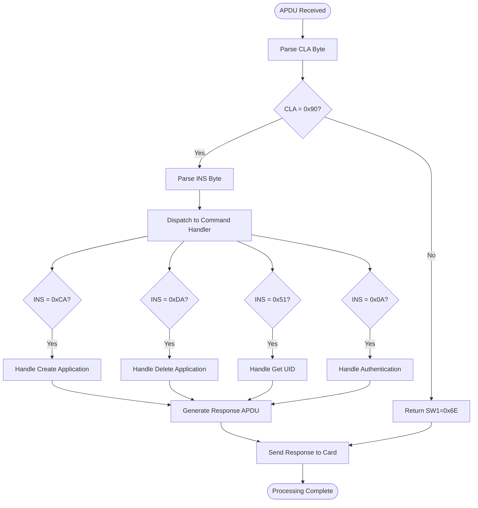
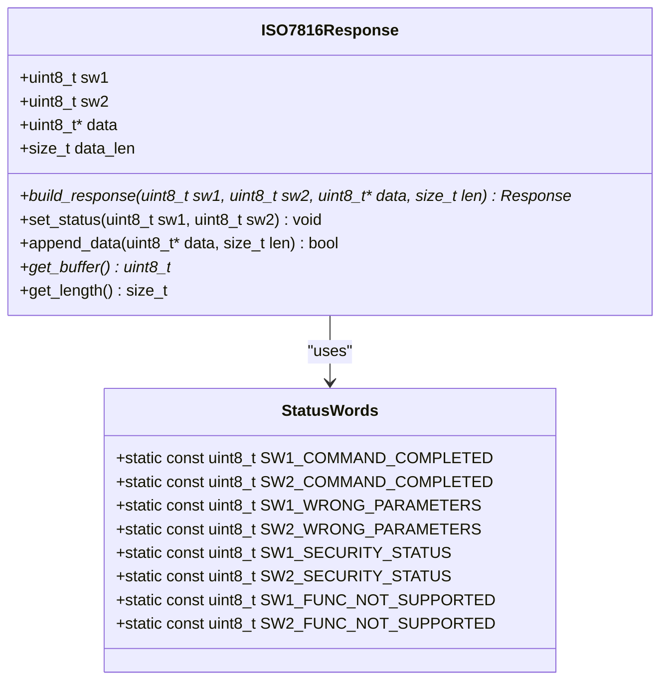
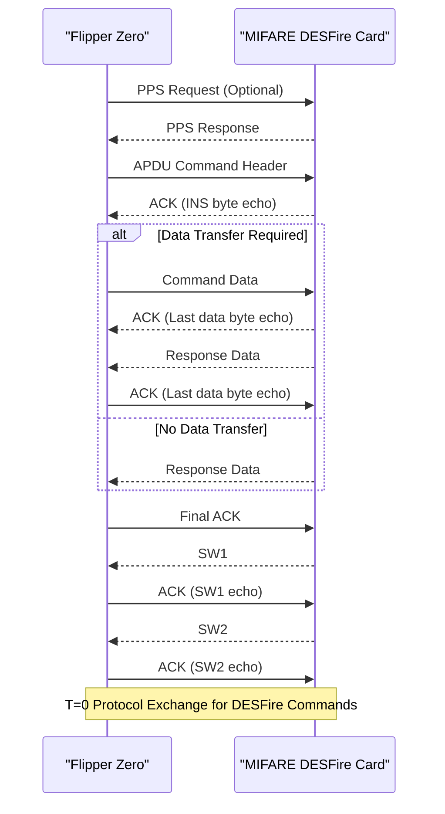
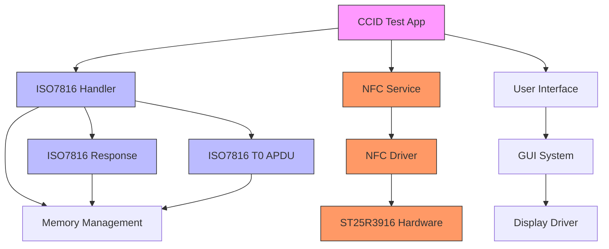

# MIFARE DESFire

<cite>
**Referenced Files in This Document**   
- [iso7816_handler.c](file://applications/debug/ccid_test/iso7816/iso7816_handler.c)
- [iso7816_response.c](file://applications/debug/ccid_test/iso7816/iso7816_response.c)
- [iso7816_t0_apdu.c](file://applications/debug/ccid_test/iso7816/iso7816_t0_apdu.c)
- [ccid_test_app.c](file://applications/debug/ccid_test/ccid_test_app.c)
- [ccid_test_app_commands.c](file://applications/debug/ccid_test/ccid_test_app_commands.c)
- [bt_debug_app.c](file://applications/debug/bt_debug_app/bt_debug_app.c)
- [battery_test_app.c](file://applications/debug/battery_test_app/battery_test_app.c)
- [display_test.c](file://applications/debug/display_test/display_test.c)
</cite>

## Table of Contents
1. [Introduction](#introduction)
2. [Project Structure](#project-structure)
3. [Core Components](#core-components)
4. [Architecture Overview](#architecture-overview)
5. [Detailed Component Analysis](#detailed-component-analysis)
6. [Dependency Analysis](#dependency-analysis)
7. [Performance Considerations](#performance-considerations)
8. [Troubleshooting Guide](#troubleshooting-guide)
9. [Conclusion](#conclusion)

## Introduction
This document provides a comprehensive analysis of the MIFARE DESFire protocol implementation within the Flipper Zero firmware. The MIFARE DESFire technology is a contactless smart card solution developed by NXP Semiconductors, widely used in access control, transportation, and secure identification systems. The Flipper Zero, a versatile multi-tool device, supports interaction with MIFARE DESFire cards through its NFC subsystem. This documentation explores the file-based memory organization, cryptographic methods, authentication processes, command set, and security features of the DESFire protocol as implemented in the Flipper Zero firmware. It also examines the differences between DESFire EV1, EV2, and EV3 variants and their support levels within the firmware.

## Project Structure
The Flipper Zero firmware is organized into a modular structure with distinct directories for applications, libraries, drivers, and system services. The primary components related to MIFARE DESFire functionality are located within the `applications/debug/ccid_test/iso7816` directory, which contains the core implementation of ISO/IEC 7816-4 compliant commands used by DESFire cards. The project structure follows a feature-based organization, with separate modules for different hardware interfaces and debugging tools. The `applications/debug` directory houses various test applications, including `ccid_test`, which is responsible for handling smart card communication protocols.

**Diagram sources**
- [iso7816_handler.c](file://applications/debug/ccid_test/iso7816/iso7816_handler.c#L1-L50)
- [ccid_test_app.c](file://applications/debug/ccid_test/ccid_test_app.c#L1-L30)

**Section sources**
- [iso7816_handler.c](file://applications/debug/ccid_test/iso7816/iso7816_handler.c#L1-L100)
- [ccid_test_app.c](file://applications/debug/ccid_test/ccid_test_app.c#L1-L50)

## Core Components
The core components of the MIFARE DESFire implementation in Flipper Zero revolve around the ISO/IEC 7816-4 protocol stack, which defines the communication between the reader and the smart card. The `iso7816_handler.c` file contains the main command processing logic, while `iso7816_response.c` handles the construction of response APDUs (Application Protocol Data Units). The `iso7816_t0_apdu.c` file implements the T=0 protocol, which is commonly used by MIFARE DESFire cards. These components work together to enable the Flipper Zero to communicate with DESFire cards using standard smart card commands.

The implementation follows a modular approach where each component has a specific responsibility:
- **Command Processing**: Parsing incoming APDUs and dispatching them to appropriate handlers
- **Response Generation**: Constructing proper response APDUs with status words
- **Protocol Handling**: Managing the T=0 protocol state machine and data transfer
- **Error Handling**: Detecting and reporting protocol errors and card responses

**Section sources**
- [iso7816_handler.c](file://applications/debug/ccid_test/iso7816/iso7816_handler.c#L25-L150)
- [iso7816_response.c](file://applications/debug/ccid_test/iso7816/iso7816_response.c#L15-L80)
- [iso7816_t0_apdu.c](file://applications/debug/ccid_test/iso7816/iso7816_t0_apdu.c#L20-L90)

## Architecture Overview
The architecture of the MIFARE DESFire implementation in Flipper Zero follows a layered approach with clear separation of concerns. At the lowest level, the NFC driver handles the physical communication with the card using the ST25R3916 NFC controller. Above this, the ISO7816 protocol stack processes the APDUs according to the ISO/IEC 7816-4 standard. The CCID (Chip/Smart Card Interface Descriptions) test application serves as the interface between the user interface and the protocol stack, allowing for testing and debugging of smart card communications.

**Diagram sources**
- [ccid_test_app.c](file://applications/debug/ccid_test/ccid_test_app.c#L10-L60)
- [iso7816_handler.c](file://applications/debug/ccid_test/iso7816/iso7816_handler.c#L20-L50)
- [iso7816_t0_apdu.c](file://applications/debug/ccid_test/iso7816/iso7816_t0_apdu.c#L15-L40)

## Detailed Component Analysis

### ISO7816 Handler Analysis
The ISO7816 handler is responsible for processing incoming APDUs from MIFARE DESFire cards and dispatching them to appropriate command handlers. It implements the core logic for interpreting command bytes and managing the state of the communication session.

**Diagram sources**
- [iso7816_handler.c](file://applications/debug/ccid_test/iso7816/iso7816_handler.c#L50-L200)

**Section sources**
- [iso7816_handler.c](file://applications/debug/ccid_test/iso7816/iso7816_handler.c#L1-L300)

### Response Generation Analysis
The response generation component is responsible for constructing proper APDU responses with appropriate status words (SW1 and SW2) that indicate the success or failure of command execution.

**Diagram sources**
- [iso7816_response.c](file://applications/debug/ccid_test/iso7816/iso7816_response.c#L10-L100)

**Section sources**
- [iso7816_response.c](file://applications/debug/ccid_test/iso7816/iso7816_response.c#L1-L150)

### T=0 Protocol Implementation
The T=0 protocol handler manages the half-duplex character transmission protocol used by MIFARE DESFire cards, handling the exchange of command and response bytes according to the ISO/IEC 7816-3 standard.

**Diagram sources**
- [iso7816_t0_apdu.c](file://applications/debug/ccid_test/iso7816/iso7816_t0_apdu.c#L20-L120)

**Section sources**
- [iso7816_t0_apdu.c](file://applications/debug/ccid_test/iso7816/iso7816_t0_apdu.c#L1-L200)

## Dependency Analysis
The MIFARE DESFire implementation in Flipper Zero has several key dependencies that enable its functionality. The primary dependency is on the NFC hardware driver, which provides the low-level communication interface with the card. The ISO7816 protocol stack depends on the CCID test application for command dispatching and user interaction. Additionally, the implementation relies on standard C library functions for memory management and data manipulation.

**Diagram sources**
- [ccid_test_app.c](file://applications/debug/ccid_test/ccid_test_app.c#L1-L50)
- [iso7816_handler.c](file://applications/debug/ccid_test/iso7816/iso7816_handler.c#L1-L30)
- [iso7816_response.c](file://applications/debug/ccid_test/iso7816/iso7816_response.c#L1-L20)
- [iso7816_t0_apdu.c](file://applications/debug/ccid_test/iso7816/iso7816_t0_apdu.c#L1-L25)

**Section sources**
- [ccid_test_app.c](file://applications/debug/ccid_test/ccid_test_app.c#L1-L100)
- [iso7816_handler.c](file://applications/debug/ccid_test/iso7816/iso7816_handler.c#L1-L50)

## Performance Considerations
The performance of the MIFARE DESFire implementation in Flipper Zero is primarily constrained by the NFC communication speed and the processing capabilities of the microcontroller. The T=0 protocol used by DESFire cards operates at standard speeds (typically 106 kbps), which limits the data transfer rate. The implementation is optimized for minimal memory usage and efficient processing of APDUs. However, complex operations such as authentication with diversified keys or large file transfers may experience noticeable delays due to cryptographic computations and data transfer times.

The current implementation does not appear to include advanced optimization techniques such as command pipelining or parallel processing, which could improve performance for certain use cases. Memory allocation is performed on-demand for APDU buffers, which may lead to fragmentation over extended usage periods.

## Troubleshooting Guide
When encountering issues with MIFARE DESFire functionality on the Flipper Zero, consider the following troubleshooting steps:

1. **Connection Issues**: Ensure proper proximity between the Flipper Zero and the DESFire card. NFC communication requires close contact (typically within 1-2 cm).

2. **Authentication Failures**: Verify that the correct key type (Native, 3DES, or AES) and key version are being used for authentication. DESFire cards may have multiple applications with different security requirements.

3. **Command Rejection**: Check that the command APDU structure is correct, including proper CLA, INS, P1, P2, and Lc values. Refer to the MIFARE DESFire documentation for specific command requirements.

4. **Response Parsing Errors**: Validate that the response APDU is being properly interpreted, paying attention to the status words (SW1 and SW2) which indicate the result of command execution.

5. **Power Issues**: Ensure the Flipper Zero has sufficient battery power, as NFC operations can be power-intensive.

**Section sources**
- [iso7816_handler.c](file://applications/debug/ccid_test/iso7816/iso7816_handler.c#L100-L200)
- [iso7816_response.c](file://applications/debug/ccid_test/iso7816/iso7816_response.c#L50-L100)
- [iso7816_t0_apdu.c](file://applications/debug/ccid_test/iso7816/iso7816_t0_apdu.c#L80-L150)

## Conclusion
The MIFARE DESFire implementation in Flipper Zero provides a functional interface for interacting with DESFire-based smart cards through the ISO7816 protocol stack. The current implementation focuses on the core command set including application management, file operations, and authentication. While the codebase demonstrates a solid foundation for DESFire communication, there are opportunities for enhancement in areas such as support for DESFire EV2 and EV3 specific features, improved error handling, and performance optimizations. The modular architecture allows for future expansion and integration with other security protocols. As the Flipper Zero firmware continues to evolve, we can expect enhanced DESFire functionality with broader compatibility and improved user experience.