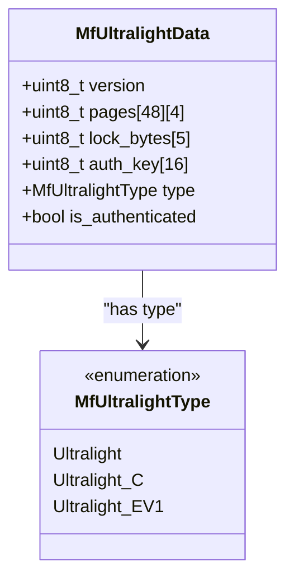
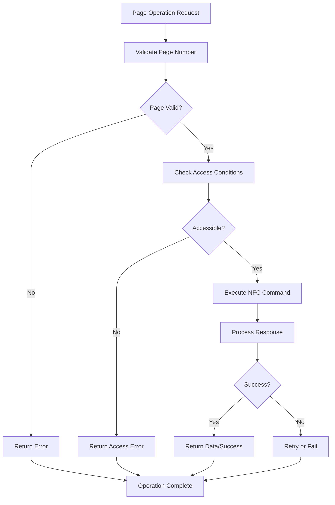
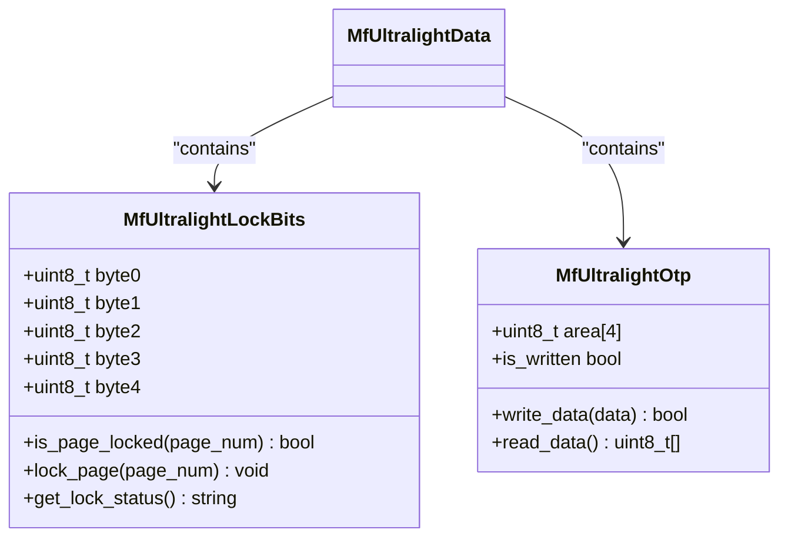
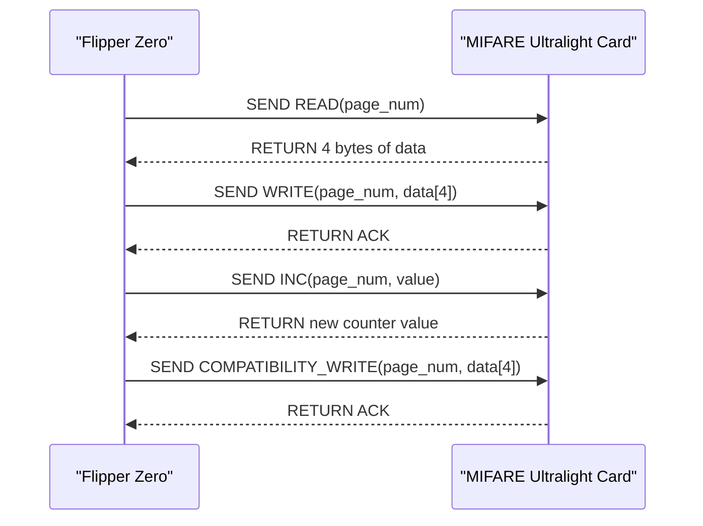
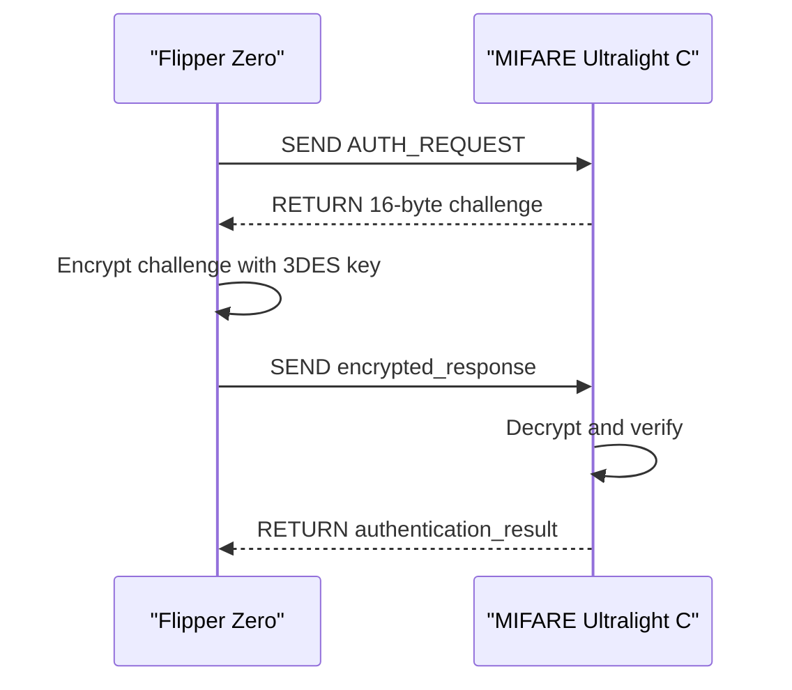
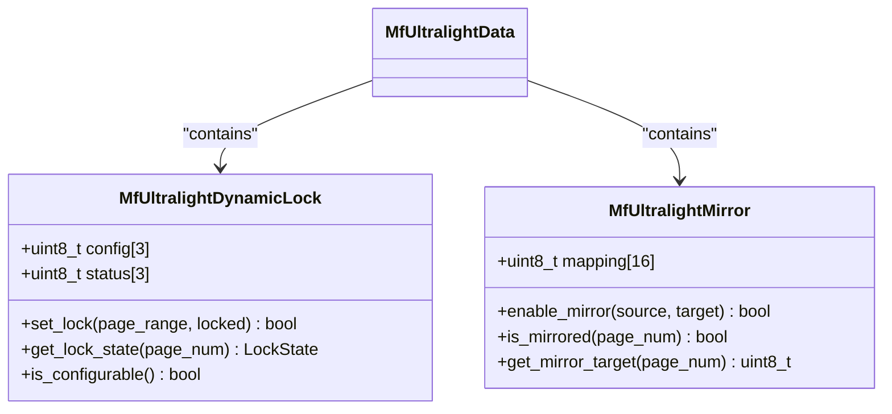
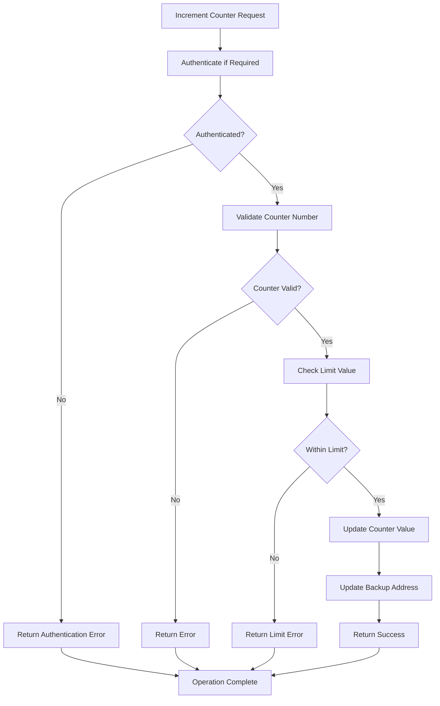
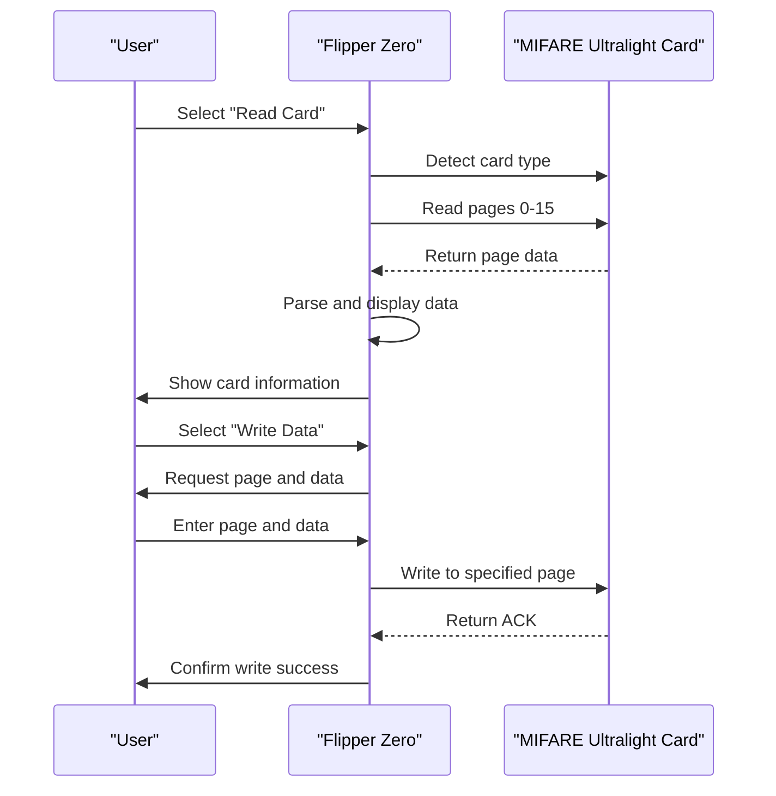
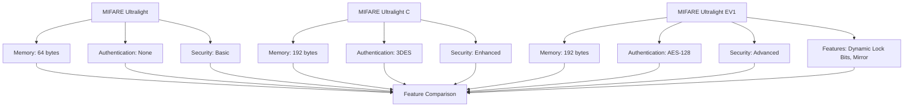

# MIFARE Ultralight

<cite>
**Referenced Files in This Document**   
- [mf_ultralight.c](file://lib/nfc/protocols/mf_ultralight/mf_ultralight.c)
- [mf_ultralight.h](file://lib/nfc/protocols/mf_ultralight/mf_ultralight.h)
- [mf_ultralight_poller.c](file://lib/nfc/protocols/mf_ultralight/mf_ultralight_poller.c)
- [mf_ultralight_poller.h](file://lib/nfc/protocols/mf_ultralight/mf_ultralight_poller.h)
- [mf_ultralight_listener.c](file://lib/nfc/protocols/mf_ultralight/mf_ultralight_listener.c)
- [mf_ultralight_listener.h](file://lib/nfc/protocols/mf_ultralight/mf_ultralight_listener.h)
- [mf_ultralight_auth.c](file://applications/main/nfc/helpers/mf_ultralight_auth.c)
- [mf_ultralight_auth.h](file://applications/main/nfc/helpers/mf_ultralight_auth.h)
- [mf_ultralight_render.c](file://applications/main/nfc/helpers/protocol_support/mf_ultralight/mf_ultralight_render.c)
- [mf_ultralight_render.h](file://applications/main/nfc/helpers/protocol_support/mf_ultralight/mf_ultralight_render.h)
</cite>

## Table of Contents
1. [Introduction](#introduction)
2. [Memory Organization](#memory-organization)
3. [Page Structure](#page-structure)
4. [Lock Bits and OTP Areas](#lock-bits-and-otp-areas)
5. [Read and Write Procedures](#read-and-write-procedures)
6. [Authentication Mechanisms](#authentication-mechanisms)
7. [Dynamic Lock Bits and Mirror Functionality](#dynamic-lock-bits-and-mirror-functionality)
8. [Counter Implementation](#counter-implementation)
9. [Practical Examples](#practical-examples)
10. [Differences Between Ultralight Variants](#differences-between-ultralight-variants)

## Introduction
The MIFARE Ultralight protocol implementation in Flipper Zero provides comprehensive support for reading, writing, and emulating MIFARE Ultralight, Ultralight C, and Ultralight EV1 cards. This documentation details the technical aspects of the implementation, focusing on memory organization, communication protocols, authentication mechanisms, and practical usage scenarios. The Flipper Zero firmware implements these features through a modular architecture that separates protocol handling, polling operations, and user interface components.

**Section sources**
- [mf_ultralight.c](file://lib/nfc/protocols/mf_ultralight/mf_ultralight.c#L1-L50)
- [mf_ultralight.h](file://lib/nfc/protocols/mf_ultralight/mf_ultralight.h#L1-L30)

## Memory Organization
MIFARE Ultralight cards feature a memory structure organized into pages of 4 bytes each. The standard MIFARE Ultralight has 16 pages (64 bytes) of memory, while extended variants offer additional capacity. Each page can be individually addressed and accessed through the NFC protocol. The memory is divided into functional areas including user data, configuration registers, and security-related sections. The Flipper Zero implementation models this memory structure using dedicated data structures that represent the complete card state, allowing for accurate emulation and analysis.

The memory organization differs between variants:
- MIFARE Ultralight: 16 pages (64 bytes)
- MIFARE Ultralight C: 48 pages (192 bytes)
- MIFARE Ultralight EV1: 48 pages (192 bytes) with enhanced security features

The firmware maintains a unified data model that can represent all variants, with specific flags indicating the card type and available features.

**Diagram sources**
- [mf_ultralight.h](file://lib/nfc/protocols/mf_ultralight/mf_ultralight.h#L45-L75)
- [mf_ultralight.c](file://lib/nfc/protocols/mf_ultralight/mf_ultralight.c#L20-L40)

**Section sources**
- [mf_ultralight.h](file://lib/nfc/protocols/mf_ultralight/mf_ultralight.h#L45-L120)
- [mf_ultralight.c](file://lib/nfc/protocols/mf_ultralight/mf_ultralight.c#L15-L60)

## Page Structure
The page structure in MIFARE Ultralight cards follows a consistent 4-byte per page format across all variants. Each page is identified by a page number (0-47) and can be read or written using specific NFC commands. The Flipper Zero implementation handles page addressing through a standardized interface that abstracts the underlying NFC protocol details.

Page 0 contains the card's UID (Unique Identifier) and is read-only. Pages 1-2 are typically used for manufacturer data and capability containers. User data can be stored in subsequent pages, with access controlled by lock bits and authentication requirements. The firmware implements page-level operations through dedicated functions that handle the NFC command sequencing and error checking.

The page structure supports both single-page and multi-page operations:
- READ: Reads a single page (4 bytes)
- WRITE: Writes a single page (4 bytes)
- COMPATIBILITY_WRITE: Emulates write operation on locked pages
- INC: Increments counter values in specific pages

**Diagram sources**
- [mf_ultralight_poller.c](file://lib/nfc/protocols/mf_ultralight/mf_ultralight_poller.c#L150-L200)
- [mf_ultralight_listener.c](file://lib/nfc/protocols/mf_ultralight/mf_ultralight_listener.c#L80-L120)

**Section sources**
- [mf_ultralight_poller.c](file://lib/nfc/protocols/mf_ultralight/mf_ultralight_poller.c#L150-L250)
- [mf_ultralight_listener.c](file://lib/nfc/protocols/mf_ultralight/mf_ultralight_listener.c#L80-L150)

## Lock Bits and OTP Areas
Lock bits in MIFARE Ultralight cards provide write protection for specific memory pages. The Flipper Zero implementation models these lock bits to accurately reflect the card's protection state and enforce access rules during emulation. Lock bits are organized in bytes, with each bit controlling the write access to a corresponding page or group of pages.

The lock bit structure includes:
- Static lock bits: Permanently set once written
- Dynamic lock bits: Can be modified under specific conditions
- OTP (One-Time Programmable) areas: Memory regions that can only be written once

The firmware implements lock bit handling through a dedicated module that tracks the lock state and validates write operations against these constraints. When emulating a card, the Flipper Zero respects the lock bit configuration to provide realistic behavior.

**Diagram sources**
- [mf_ultralight.h](file://lib/nfc/protocols/mf_ultralight/mf_ultralight.h#L80-L100)
- [mf_ultralight.c](file://lib/nfc/protocols/mf_ultralight/mf_ultralight.c#L200-L250)

**Section sources**
- [mf_ultralight.c](file://lib/nfc/protocols/mf_ultralight/mf_ultralight.c#L200-L300)
- [mf_ultralight.h](file://lib/nfc/protocols/mf_ultralight/mf_ultralight.h#L80-L110)

## Read and Write Procedures
The Flipper Zero implements standard MIFARE Ultralight read and write procedures through its NFC polling system. The read procedure involves sending a READ command with the target page number and processing the 4-byte response. The write procedure sends a WRITE command with the page number and 4 bytes of data.

Specialized write operations include:
- WRITE: Standard write command for unlocked pages
- COMPATIBILITY_WRITE: Used when the standard WRITE command is not supported
- INC: Increments counter values in specific pages (used in Ultralight C/EV1)

The implementation handles these operations through the poller interface, which manages the NFC command-response cycle and error handling. The firmware also supports multi-page operations by chaining individual page operations together.

**Diagram sources**
- [mf_ultralight_poller.c](file://lib/nfc/protocols/mf_ultralight/mf_ultralight_poller.c#L300-L400)
- [mf_ultralight_listener.c](file://lib/nfc/protocols/mf_ultralight/mf_ultralight_listener.c#L200-L250)

**Section sources**
- [mf_ultralight_poller.c](file://lib/nfc/protocols/mf_ultralight/mf_ultralight_poller.c#L300-L450)
- [mf_ultralight_listener.c](file://lib/nfc/protocols/mf_ultralight/mf_ultralight_listener.c#L200-L300)

## Authentication Mechanisms
MIFARE Ultralight C and EV1 cards implement authentication mechanisms to protect sensitive memory areas. The Flipper Zero firmware supports both 3DES authentication for Ultralight C and AES authentication for Ultralight EV1.

For MIFARE Ultralight C:
- Uses 3DES (Triple DES) encryption
- Authentication involves a challenge-response protocol
- Requires a 16-byte authentication key
- Provides mutual authentication between reader and card

For MIFARE Ultralight EV1:
- Uses AES-128 encryption
- Enhanced authentication protocol with improved security
- Supports multiple authentication keys and access conditions
- Implements additional security features like virtual card architecture

The authentication implementation is handled by dedicated modules that manage the cryptographic operations and protocol state. The Flipper Zero can both authenticate to real cards and emulate authenticated cards.

**Diagram sources**
- [mf_ultralight_auth.c](file://applications/main/nfc/helpers/mf_ultralight_auth.c#L50-L150)
- [mf_ultralight_poller.c](file://lib/nfc/protocols/mf_ultralight/mf_ultralight_poller.c#L500-L550)

**Section sources**
- [mf_ultralight_auth.c](file://applications/main/nfc/helpers/mf_ultralight_auth.c#L50-L200)
- [mf_ultralight_poller.c](file://lib/nfc/protocols/mf_ultralight/mf_ultralight_poller.c#L500-L600)

## Dynamic Lock Bits and Mirror Functionality
Dynamic lock bits in MIFARE Ultralight EV1 cards provide enhanced memory protection that can be configured after card initialization. Unlike static lock bits, dynamic lock bits can be modified under specific authentication conditions, allowing for flexible access control policies.

Mirror functionality in MIFARE Ultralight cards allows specific memory pages to be mapped to different addresses, enabling compatibility with legacy systems. The Flipper Zero implementation supports mirror configuration through its emulation capabilities, allowing users to set up virtual cards with custom memory mappings.

The firmware handles dynamic lock bits through a state machine that tracks the lock configuration and enforces the appropriate access rules. Mirror functionality is implemented by intercepting page read/write requests and redirecting them to the appropriate memory locations based on the mirror configuration.

**Diagram sources**
- [mf_ultralight.h](file://lib/nfc/protocols/mf_ultralight/mf_ultralight.h#L120-L150)
- [mf_ultralight.c](file://lib/nfc/protocols/mf_ultralight/mf_ultralight.c#L400-L450)

**Section sources**
- [mf_ultralight.c](file://lib/nfc/protocols/mf_ultralight/mf_ultralight.c#L400-L500)
- [mf_ultralight.h](file://lib/nfc/protocols/mf_ultralight/mf_ultralight.h#L120-L160)

## Counter Implementation
MIFARE Ultralight C and EV1 cards include counter functionality to prevent unauthorized value manipulation in applications like electronic wallets. The Flipper Zero firmware implements counter handling to support these use cases.

Counters are implemented in specific memory pages and can only be incremented using the INC command. The implementation includes protection against decrement attacks and overflow conditions. The firmware tracks counter states during emulation and validates counter operations against the card's security rules.

Counter features include:
- Three independent counters (C0, C1, C2)
- Increment-only operations
- Transfer error detection
- Limit value checking

The counter implementation is integrated with the authentication system, as counter operations typically require successful authentication.

**Diagram sources**
- [mf_ultralight_poller.c](file://lib/nfc/protocols/mf_ultralight/mf_ultralight_poller.c#L600-L700)
- [mf_ultralight_listener.c](file://lib/nfc/protocols/mf_ultralight/mf_ultralight_listener.c#L400-L450)

**Section sources**
- [mf_ultralight_poller.c](file://lib/nfc/protocols/mf_ultralight/mf_ultralight_poller.c#L600-L750)
- [mf_ultralight_listener.c](file://lib/nfc/protocols/mf_ultralight/mf_ultralight_listener.c#L400-L500)

## Practical Examples
The Flipper Zero provides practical tools for working with MIFARE Ultralight cards, including reading, writing, and configuring password protection. These operations are accessible through both the user interface and command-line interface.

Example: Reading a MIFARE Ultralight card
1. Place the card near the Flipper Zero
2. Navigate to NFC → Read
3. The device automatically detects the card type and reads all accessible pages
4. Display shows memory contents and card information

Example: Writing to a MIFARE Ultralight card
1. Prepare data in the appropriate format
2. Navigate to NFC → Write
3. Select target pages and enter data
4. Execute write operation (authentication may be required)

Example: Configuring password protection
1. Generate or enter authentication key
2. Set access conditions for specific memory areas
3. Write configuration to card
4. Test protection by attempting unauthorized access

The firmware also supports advanced features like dictionary attacks on Ultralight C cards and key management for multiple cards.

**Diagram sources**
- [mf_ultralight_render.c](file://applications/main/nfc/helpers/protocol_support/mf_ultralight/mf_ultralight_render.c#L50-L150)
- [mf_ultralight_poller.c](file://lib/nfc/protocols/mf_ultralight/mf_ultralight_poller.c#L800-L850)

**Section sources**
- [mf_ultralight_render.c](file://applications/main/nfc/helpers/protocol_support/mf_ultralight/mf_ultralight_render.c#L50-L200)
- [mf_ultralight_poller.c](file://lib/nfc/protocols/mf_ultralight/mf_ultralight_poller.c#L800-L900)

## Differences Between Ultralight Variants
The Flipper Zero firmware supports multiple MIFARE Ultralight variants, each with distinct features and capabilities:

**MIFARE Ultralight**
- 64 bytes memory (16 pages)
- No authentication
- Basic lock bits
- Simple counter functionality
- Limited security features

**MIFARE Ultralight C**
- 192 bytes memory (48 pages)
- 3DES authentication
- Enhanced counter protection
- One-way counters
- Improved data integrity

**MIFARE Ultralight EV1**
- 192 bytes memory (48 pages)
- AES-128 authentication
- Dynamic lock bits
- Mirror functionality
- Virtual card architecture
- Enhanced counter features
- Configurable access conditions

The firmware implements a unified interface that abstracts these differences, allowing consistent operation across variants while preserving the unique features of each type. Detection logic automatically identifies the card variant and configures the appropriate operational parameters.

**Diagram sources**
- [mf_ultralight.h](file://lib/nfc/protocols/mf_ultralight/mf_ultralight.h#L30-L40)
- [mf_ultralight.c](file://lib/nfc/protocols/mf_ultralight/mf_ultralight.c#L50-L100)

**Section sources**
- [mf_ultralight.h](file://lib/nfc/protocols/mf_ultralight/mf_ultralight.h#L30-L160)
- [mf_ultralight.c](file://lib/nfc/protocols/mf_ultralight/mf_ultralight.c#L50-L150)