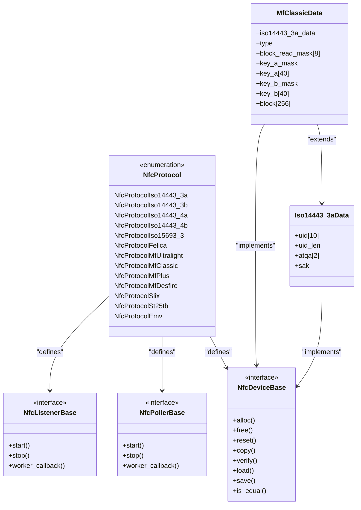
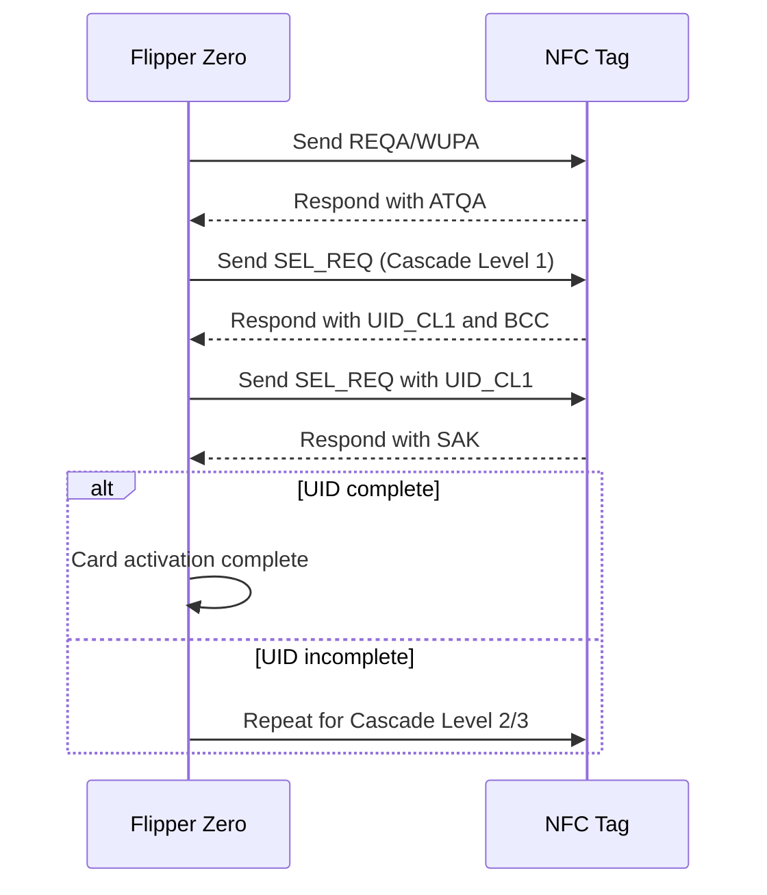
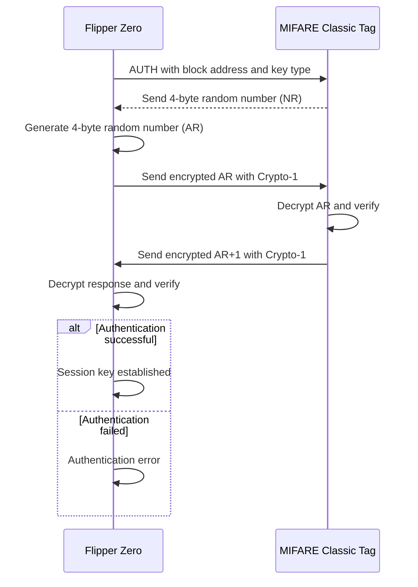
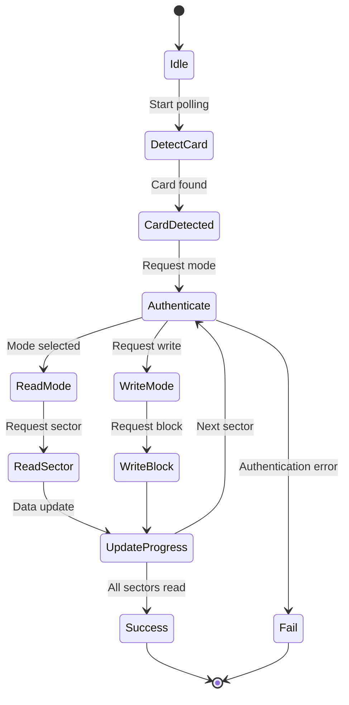
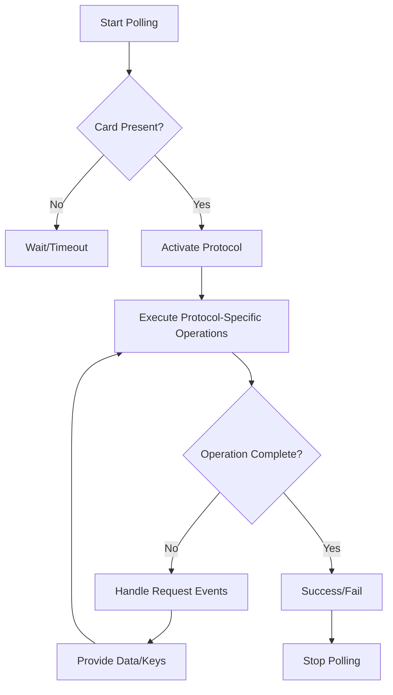

# NFC Protocols

<cite>
**Referenced Files in This Document**   
- [nfc_protocol.h](file://lib\nfc\protocols\nfc_protocol.h)
- [nfc.h](file://lib\nfc\nfc.h)
- [nfc_common.h](file://lib\nfc\nfc_common.h)
- [iso14443_3a.h](file://lib\nfc\protocols\iso14443_3a\iso14443_3a.h)
- [iso14443_3a_poller.h](file://lib\nfc\protocols\iso14443_3a\iso14443_3a_poller.h)
- [iso14443_3a_listener.h](file://lib\nfc\protocols\iso14443_3a\iso14443_3a_listener.h)
- [mf_classic.h](file://lib\nfc\protocols\mf_classic\mf_classic.h)
- [mf_classic_poller.h](file://lib\nfc\protocols\mf_classic\mf_classic_poller.h)
</cite>

## Table of Contents
1. [Introduction](#introduction)
2. [NFC Protocol Architecture](#nfc-protocol-architecture)
3. [ISO14443A/B Protocols](#iso14443ab-protocols)
4. [MIFARE Classic Protocol](#mifare-classic-protocol)
5. [Protocol Registry System](#protocol-registry-system)
6. [NFC Device and Poller Framework](#nfc-device-and-poller-framework)
7. [Implementation Details](#implementation-details)
8. [Conclusion](#conclusion)

## Introduction

The Flipper Zero NFC system supports a comprehensive range of NFC protocols including ISO14443A/B, ISO15693, MIFARE Classic, MIFARE Ultralight, MIFARE DESFire, FeliCa, and EMV. This documentation provides a detailed technical analysis of these protocols, their implementation in the Flipper Zero firmware, and the underlying architecture that enables reading, writing, and emulation of NFC tags. The system is designed with a modular architecture that allows for easy addition of new protocols while maintaining a consistent interface across all supported technologies.

**Section sources**
- [nfc_protocol.h](file://lib\nfc\protocols\nfc_protocol.h#L0-L222)

## NFC Protocol Architecture

The NFC protocol system in Flipper Zero follows a hierarchical, modular architecture designed for extensibility and code reuse. Each protocol is implemented as a self-contained module with standardized interfaces for device data, polling (reading), and listening (emulation). The architecture supports both base protocols and child protocols that build upon existing implementations.



**Diagram sources**
- [nfc_protocol.h](file://lib\nfc\protocols\nfc_protocol.h#L0-L222)
- [iso14443_3a.h](file://lib\nfc\protocols\iso14443_3a\iso14443_3a.h#L0-L108)
- [mf_classic.h](file://lib\nfc\protocols\mf_classic\mf_classic.h#L0-L249)

**Section sources**
- [nfc_protocol.h](file://lib\nfc\protocols\nfc_protocol.h#L0-L222)

## ISO14443A/B Protocols

The ISO14443A/B protocols form the foundation for many NFC applications, including contactless payment systems and access control. The Flipper Zero implements ISO14443-3A as a base protocol with specific technical parameters and procedures for communication.

### Technical Specifications

ISO14443-3A defines the initialization and anti-collision procedures for proximity cards. The Flipper Zero implementation includes:

- **Guard Time**: 5000 microseconds
- **Frame Delay Time (Poll)**: 1620 carrier cycles
- **Frame Delay Time (Listen)**: 1172 carrier cycles
- **Poll to Poll Minimum**: 1100 microseconds
- **Modulation**: 100% ASK (Amplitude Shift Keying) with subcarrier
- **Data Rates**: 106 kbps
- **Error Detection**: CRC-16 for data frames

The protocol supports three UID lengths: 4 bytes, 7 bytes, and 10 bytes, with a maximum size of 10 bytes. The anti-collision procedure follows the standard cascade levels defined in ISO14443-3.

### Data Structures

The `Iso14443_3aData` structure contains all information that can be read from an ISO14443-3A compliant card:

```c
typedef struct {
    uint8_t uid[ISO14443_3A_MAX_UID_SIZE];
    uint8_t uid_len;
    uint8_t atqa[2];
    uint8_t sak;
} Iso14443_3aData;
```

This structure includes the Unique Identifier (UID), Answer To Request (ATQA), and Select Acknowledge (SAK) bytes that are essential for card identification and protocol determination.

### Polling Implementation

The ISO14443-3A poller implements the complete activation procedure including presence detection, collision resolution, and card activation:



**Diagram sources**
- [iso14443_3a.h](file://lib\nfc\protocols\iso14443_3a\iso14443_3a.h#L0-L108)
- [iso14443_3a_poller.h](file://lib\nfc\protocols\iso14443_3a\iso14443_3a_poller.h#L0-L146)

**Section sources**
- [iso14443_3a.h](file://lib\nfc\protocols\iso14443_3a\iso14443_3a.h#L0-L108)
- [iso14443_3a_poller.h](file://lib\nfc\protocols\iso14443_3a\iso14443_3a_poller.h#L0-L146)

## MIFARE Classic Protocol

MIFARE Classic is a widely used contactless smart card technology that builds upon the ISO14443-3A protocol. The Flipper Zero provides comprehensive support for MIFARE Classic tags including reading, writing, authentication, and various attack methods for security research.

### Memory Organization

MIFARE Classic tags come in different capacities with distinct memory layouts:

- **MIFARE Classic Mini**: 320 bytes, 5 sectors, 5 blocks per sector
- **MIFARE Classic 1K**: 1024 bytes, 16 sectors, 4 blocks per sector
- **MIFARE Classic 4K**: 4096 bytes, 40 sectors with varying block counts

Each sector ends with a sector trailer containing two 48-bit keys (Key A and Key B) and access control bits that determine read/write permissions for the blocks in that sector.

### Authentication and Cryptography

MIFARE Classic uses the proprietary Crypto-1 stream cipher for authentication and data encryption. The authentication process involves a three-pass challenge-response protocol using random numbers (nonces):



The Flipper Zero implements various methods to recover MIFARE Classic keys, including:
- **Standard Dictionary Attack**: Testing common default keys
- **Nested Authentication Attack**: Exploiting the relationship between nonces in consecutive authentications
- **Hardnested Attack**: Advanced attack method for tags with "hard" PRNG
- **Darkside Attack**: Exploiting predictable random number generators

### Data Structure

The `MfClassicData` structure extends the ISO14443-3A data to include MIFARE Classic specific information:

```c
typedef struct {
    Iso14443_3aData* iso14443_3a_data;
    MfClassicType type;
    uint32_t block_read_mask[MF_CLASSIC_READ_MASK_SIZE];
    uint64_t key_a_mask;
    uint64_t key_b_mask;
    MfClassicBlock block[MF_CLASSIC_TOTAL_BLOCKS_MAX];
} MfClassicData;
```

This structure includes:
- **iso14443_3a_data**: Base ISO14443-3A data (UID, ATQA, SAK)
- **type**: MIFARE Classic type (Mini, 1K, or 4K)
- **block_read_mask**: Bitmask indicating which blocks have been successfully read
- **key_a_mask** and **key_b_mask**: Bitmasks indicating which sector keys have been discovered
- **block**: Array containing the data from all blocks on the tag

### Poller Implementation

The MIFARE Classic poller supports multiple operational modes and provides detailed event feedback during operations:



The poller events include detailed information for each operation, allowing the application to respond appropriately to requests for keys, sector trailers, or block data.

**Diagram sources**
- [mf_classic.h](file://lib\nfc\protocols\mf_classic\mf_classic.h#L0-L249)
- [mf_classic_poller.h](file://lib\nfc\protocols\mf_classic\mf_classic_poller.h#L0-L457)

**Section sources**
- [mf_classic.h](file://lib\nfc\protocols\mf_classic\mf_classic.h#L0-L249)
- [mf_classic_poller.h](file://lib\nfc\protocols\mf_classic\mf_classic_poller.h#L0-L457)

## Protocol Registry System

The Flipper Zero NFC system uses a centralized registry to manage all supported protocols, enabling dynamic protocol selection and hierarchical relationships between protocols.

### Protocol Registration

New protocols are registered through a multi-step process that integrates them into the system:

1. Add a new entry to the `NfcProtocol` enum in `nfc_protocol.h`
2. Add a corresponding entry in the `nfc_protocol_nodes[]` array in `nfc_protocol.c`
3. Register device definitions in `nfc_device_defs.c`
4. Register poller definitions in `nfc_poller_defs.c`
5. Optionally register listener definitions for emulation support
6. Add header files to the `SDK_HEADERS` list in the SConscript file

### Protocol Hierarchy

The system supports parent-child relationships between protocols, allowing child protocols to leverage the implementation of their parent protocols. For example, MIFARE Classic is a child protocol of ISO14443-3A, inheriting its initialization and anti-collision procedures while adding its own authentication and data access methods.

The registry provides functions to navigate the protocol hierarchy:
- `nfc_protocol_get_parent()`: Returns the immediate parent of a protocol
- `nfc_protocol_has_parent()`: Determines if a protocol has a specific parent at any level in the hierarchy

This hierarchical approach enables code reuse and simplifies the implementation of new protocols that are based on existing standards.

**Section sources**
- [nfc_protocol.h](file://lib\nfc\protocols\nfc_protocol.h#L0-L222)

## NFC Device and Poller Framework

The Flipper Zero NFC system is built on a modular framework that separates the concerns of device data representation, polling (reading), and listening (emulation).

### Device Interface

The `NfcDeviceBase` interface defines the standard methods that all NFC protocols must implement:

```c
typedef struct {
    void* (*alloc)(void);
    void (*free)(void* data);
    void (*reset)(void* data);
    void (*copy)(void* data, const void* other);
    bool (*verify)(void* data, const FuriString* device_type);
    bool (*load)(void* data, FlipperFormat* ff, uint32_t version);
    bool (*save)(const void* data, FlipperFormat* ff);
    bool (*is_equal)(const void* data, const void* other);
} NfcDeviceBase;
```

This interface ensures consistent handling of device data across all protocols, including allocation, deallocation, copying, verification, and serialization to/from file format.

### Poller Framework

The poller framework provides a state machine for reading NFC tags with event-driven callbacks:



The poller operates through a callback mechanism where it requests specific actions (such as providing a key or sector trailer) and the application responds with the required data.

### Listener Framework

The listener framework enables NFC tag emulation by configuring the Flipper Zero to respond like a real NFC tag. The system supports automatic collision resolution by configuring the NFC hardware with the tag's UID, ATQA, and SAK values.

**Section sources**
- [nfc.h](file://lib\nfc\nfc.h#L0-L386)
- [nfc_protocol.h](file://lib\nfc\protocols\nfc_protocol.h#L0-L222)

## Implementation Details

### File Format Versioning

The NFC system uses versioned file formats to ensure backward compatibility:

```c
#define NFC_LSB_ATQA_FORMAT_VERSION          (2)
#define NFC_MINIMUM_SUPPORTED_FORMAT_VERSION NFC_LSB_ATQA_FORMAT_VERSION
#define NFC_UNIFIED_FORMAT_VERSION           (4)
#define NFC_CURRENT_FORMAT_VERSION           NFC_UNIFIED_FORMAT_VERSION
```

This versioning allows the system to read older file formats while using the latest format for new saves.

### Error Handling

The system implements comprehensive error handling across all protocol layers:

- **NfcError**: Low-level NFC hardware errors (timeout, incomplete frame, etc.)
- **Protocol-specific errors**: Higher-level protocol errors (authentication failure, communication errors, etc.)

Errors are propagated through the system, allowing applications to handle them appropriately based on the context.

### Memory Management

The implementation uses opaque data structures and specialized allocation/deallocation functions to manage memory efficiently and prevent memory leaks. Data structures are designed to minimize memory usage while providing all necessary functionality.

## Conclusion

The Flipper Zero NFC system provides a comprehensive, modular implementation of multiple NFC protocols with a focus on extensibility and code reuse. The architecture separates concerns through well-defined interfaces for device data, polling, and listening, enabling consistent handling of diverse NFC technologies. The system supports both standard operations like reading and writing tags, as well as advanced security research features like various attack methods for MIFARE Classic tags. The protocol registry system allows for easy addition of new protocols while maintaining backward compatibility through versioned file formats and hierarchical protocol relationships.