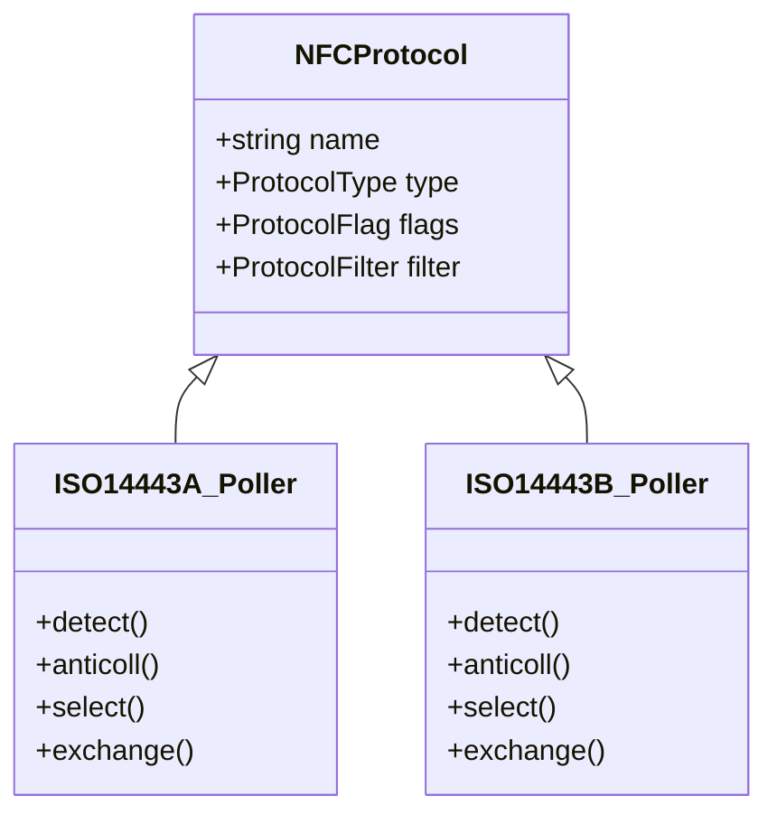
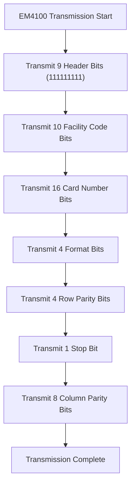
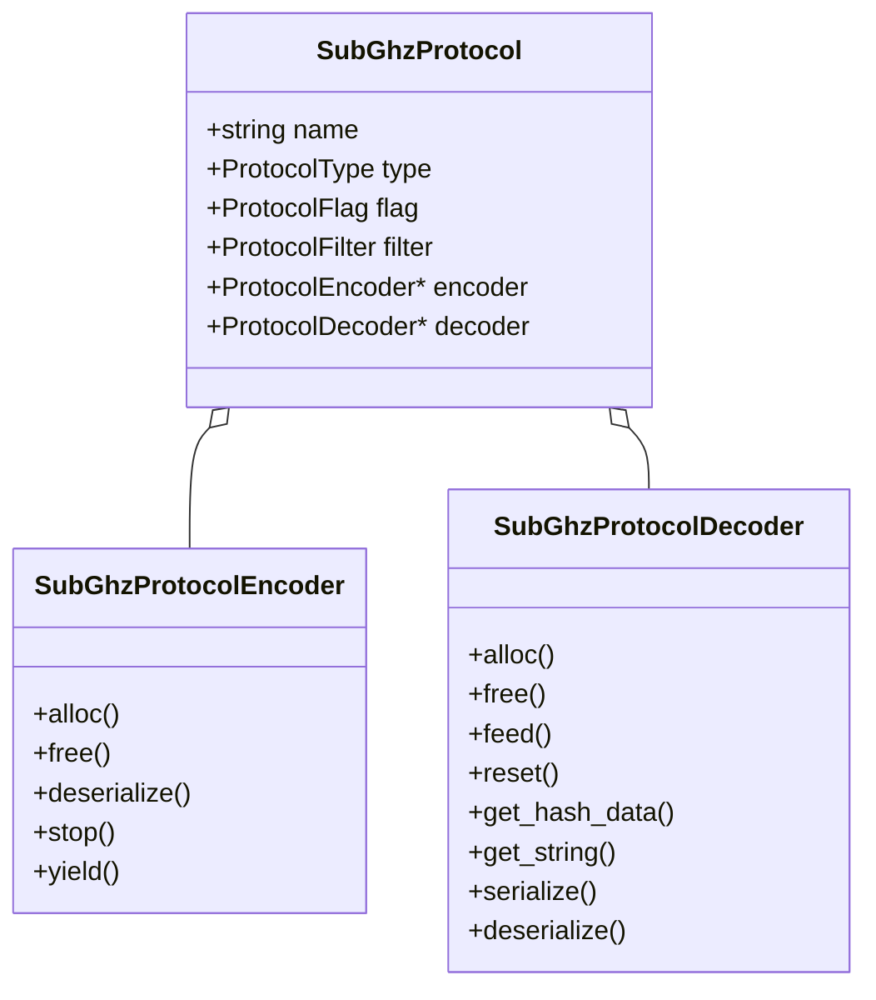
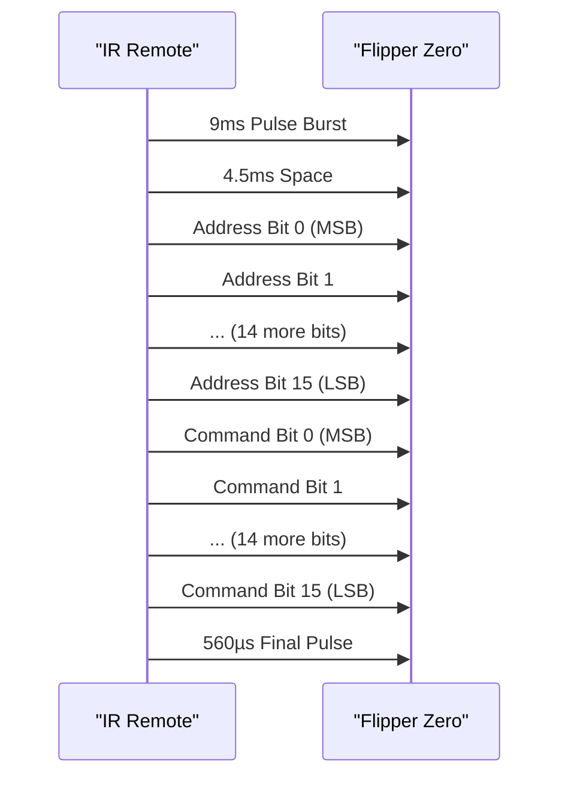
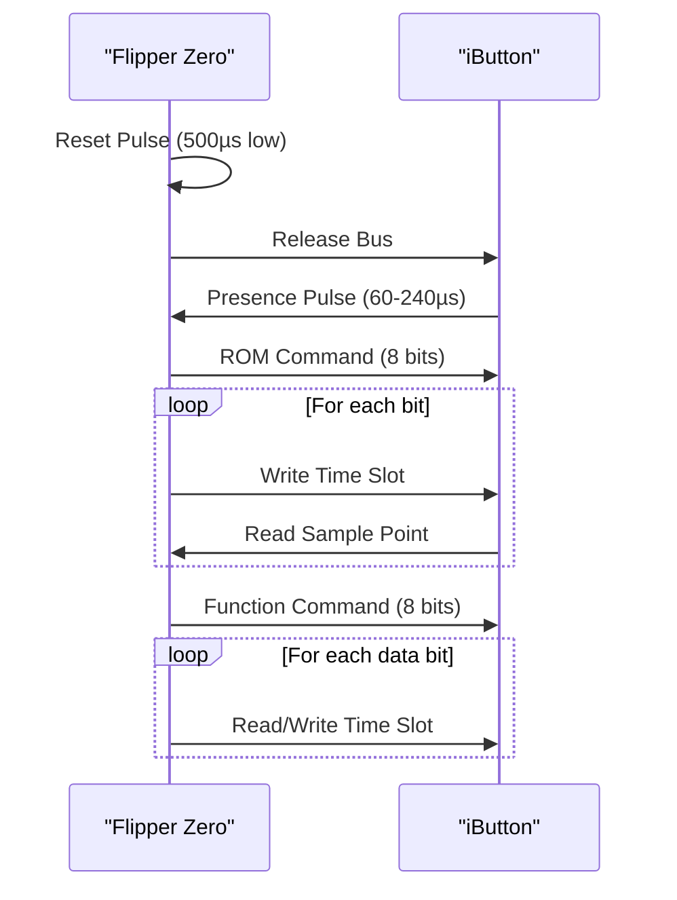
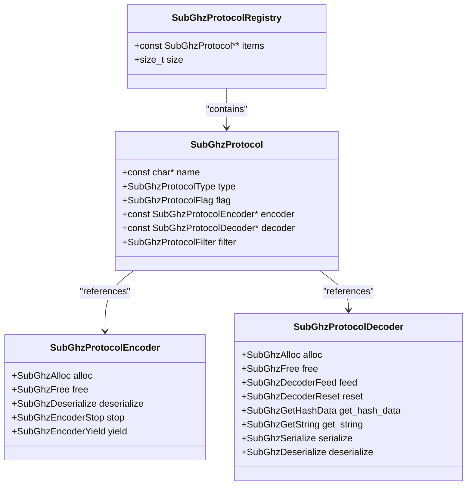

# Protocol Details

<cite>
**Referenced Files in This Document**   
- [subghz_protocol_registry.h](file://lib/subghz/subghz_protocol_registry.h)
- [registry.h](file://lib/subghz/registry.h)
- [types.h](file://lib/subghz/types.h)
- [registry.c](file://lib/subghz/registry.c)
- [iso14443_3a.c](file://lib/nfc/protocols/iso14443_3a.c)
- [iso14443_3b.c](file://lib/nfc/protocols/iso14443_3b.c)
- [iso15693_3.c](file://lib/nfc/protocols/iso15693_3.c)
- [protocol_em4100.c](file://lib/lfrfid/protocols/protocol_em4100.c)
- [protocol_hid_generic.c](file://lib/lfrfid/protocols/protocol_hid_generic.c)
- [infrared_protocol_nec.c](file://lib/infrared/encoder_decoder/nec/infrared_protocol_nec.c)
- [infrared_protocol_rc5.c](file://lib/infrared/encoder_decoder/rc5/infrared_protocol_rc5.c)
- [infrared_protocol_rc6.c](file://lib/infrared/encoder_decoder/rc6/infrared_protocol_rc6.c)
- [infrared_protocol_sirc.c](file://lib/infrared/encoder_decoder/sirc/infrared_protocol_sirc.c)
- [protocol_ds1990.c](file://lib/ibutton/protocols/dallas/protocol_ds1990.c)
- [protocol_ds_generic.c](file://lib/ibutton/protocols/dallas/protocol_ds_generic.c)
- [protocol_group_dallas.c](file://lib/ibutton/protocols/dallas/protocol_group_dallas.c)
</cite>

## Table of Contents
1. [Introduction](#introduction)
2. [NFC Protocols](#nfc-protocols)
3. [LF RFID Protocols](#lf-rfid-protocols)
4. [Sub-GHz Protocols](#sub-ghz-protocols)
5. [Infrared Protocols](#infrared-protocols)
6. [iButton Protocols](#ibutton-protocols)
7. [Protocol Registry System](#protocol-registry-system)
8. [Signal Analysis Techniques](#signal-analysis-techniques)

## Introduction
The Flipper Zero is a versatile multi-tool device capable of interacting with various wireless communication standards. This document provides comprehensive technical documentation for all wireless communication protocols supported by the Flipper Zero, including NFC, LF RFID, Sub-GHz, Infrared, and iButton protocols. The documentation covers technical specifications, encoding schemes, modulation techniques, packet structures, implementation details, and the protocol registry system that manages these protocols.

**Section sources**
- [subghz_protocol_registry.h](file://lib/subghz/subghz_protocol_registry.h)
- [registry.h](file://lib/subghz/registry.h)
- [types.h](file://lib/subghz/types.h)

## NFC Protocols

### ISO14443A/B Standards
The Flipper Zero supports both ISO14443A and ISO14443B standards, which are widely used in contactless smart cards and proximity cards. These protocols operate at 13.56 MHz and use amplitude shift keying (ASK) modulation with a subcarrier for data transmission.

**ISO14443A** uses modified Miller encoding for data transmission from reader to card (downlink) and Manchester encoding for data transmission from card to reader (uplink). The data rate is typically 106 kbps. The protocol supports three levels of communication:
- Level 1: Initialization and anti-collision
- Level 2: Activation and protocol selection
- Level 3: Data exchange

**ISO14443B** uses NRZ-L (Non-Return to Zero Level) encoding for both directions with a data rate of 106 kbps. It differs from ISO14443A in its modulation scheme and frame structure, providing better noise immunity in certain environments.

**Diagram sources**
- [iso14443_3a.c](file://lib/nfc/protocols/iso14443_3a.c)
- [iso14443_3b.c](file://lib/nfc/protocols/iso14443_3b.c)

**Section sources**
- [iso14443_3a.c](file://lib/nfc/protocols/iso14443_3a.c)
- [iso14443_3b.c](file://lib/nfc/protocols/iso14443_3b.c)

### ISO15693 Standard
ISO15693 is a vicinity card standard that operates at 13.56 MHz but can communicate at distances up to 1.5 meters, unlike the proximity range of ISO14443. It uses ASK modulation with a subcarrier frequency of 423.75 kHz or 484.28 kHz.

The protocol supports two data rates:
- Low data rate: 6.62 kbps (longer range)
- High data rate: 26.48 kbps (shorter range)

Data encoding uses Manchester coding for both directions. The command structure includes:
- Flags byte (indicating options like address, 16-bit CRC, etc.)
- Command code
- Optional parameters (UID, block number, etc.)

ISO15693 supports both single and multiple card reading modes, with anti-collision mechanisms to handle multiple tags in the field.

**Section sources**
- [iso15693_3.c](file://lib/nfc/protocols/iso15693_3.c)

## LF RFID Protocols

### EM4100 Protocol
The EM4100 is a widely used LF RFID protocol operating at 125 kHz. It uses Manchester encoding for data transmission with a data rate of 2 kHz to 16 kHz depending on the reader. The data structure consists of:

- 9 header bits (111111111)
- 10 facility code bits (organization identifier)
- 16 card number bits (unique identifier)
- 4 format bits (version/variant)
- 4 row parity bits
- 1 stop bit
- 8 column parity bits

The total data length is 64 bits. The protocol uses a 64-bit structure with error detection through row and column parity bits, providing robust data integrity.

**Diagram sources**
- [protocol_em4100.c](file://lib/lfrfid/protocols/protocol_em4100.c)

**Section sources**
- [protocol_em4100.c](file://lib/lfrfid/protocols/protocol_em4100.c)

### HID Prox Protocol
HID Prox is another common LF RFID protocol operating at 125 kHz. It uses FSK (Frequency Shift Keying) modulation with two frequencies to represent binary data. The data format follows the Wiegand protocol standard with:

- 1 start bit (0)
- 12-bit facility code
- 16-bit card number
- Even parity bit
- Odd parity bit
- 1 stop bit (1)

The total data length is typically 26 bits, though extended formats support 34 or 37 bits. The protocol is widely used in access control systems due to its reliability and simplicity.

**Section sources**
- [protocol_hid_generic.c](file://lib/lfrfid/protocols/protocol_hid_generic.c)

## Sub-GHz Protocols

### Proprietary Protocol Overview
The Flipper Zero supports numerous proprietary Sub-GHz protocols used in garage door openers, car key fobs, and other wireless devices. These protocols typically operate in the 315 MHz, 433.92 MHz, and 868 MHz ISM bands and use either AM (Amplitude Modulation) or FM (Frequency Modulation) with various encoding schemes.

Common encoding methods include:
- **Fixed/Static**: Simple repeating codes with no rolling mechanism
- **Rolling Code**: Dynamic codes that change with each transmission (e.g., KeeLoq)
- **Bi-Phase/Manchester**: Self-clocking encoding schemes
- **PWM (Pulse Width Modulation)**: Varying pulse widths to represent data

### Protocol Implementation Structure
Each Sub-GHz protocol is implemented as a separate module with encoder and decoder components. The core data structure is defined in `types.h` as `SubGhzProtocol`, which contains:

- **name**: Human-readable protocol name
- **type**: Protocol type (static, dynamic, RAW, etc.)
- **flag**: Bitmask indicating protocol characteristics (frequency band, modulation type, capabilities)
- **encoder**: Pointer to encoder implementation
- **decoder**: Pointer to decoder implementation
- **filter**: Category filter for UI organization

**Diagram sources**
- [types.h](file://lib/subghz/types.h)

**Section sources**
- [types.h](file://lib/subghz/types.h)

## Infrared Protocols

### NEC Protocol
The NEC infrared protocol is one of the most common IR standards, using 38 kHz carrier frequency with pulse distance encoding. The data frame structure consists of:

- 9 ms leading pulse burst
- 4.5 ms space (for repeat code: 2.25 ms)
- 16-bit address (8-bit device address + 8-bit inverted device address)
- 16-bit command (8-bit command + 8-bit inverted command)
- 560 µs final pulse burst

The protocol uses pulse distance encoding where:
- Logic 0: 560 µs pulse + 560 µs space (1.125 ms total)
- Logic 1: 560 µs pulse + 1.685 ms space (2.25 ms total)

Transmission is MSB-first, and the address allows for device differentiation while the command represents the specific function.

**Diagram sources**
- [infrared_protocol_nec.c](file://lib/infrared/encoder_decoder/nec/infrared_protocol_nec.c)

**Section sources**
- [infrared_protocol_nec.c](file://lib/infrared/encoder_decoder/nec/infrared_protocol_nec.c)

### RC5 and RC6 Protocols
Philips RC5 and RC6 protocols use Manchester encoding with a 36 kHz carrier frequency. Both protocols feature:

- **RC5**: 14-bit frame with 2 start bits, 1 toggle bit, 5-bit address, and 6-bit command
- **RC6**: Enhanced version with 20-bit frame, including mode bits and extended command space

Key characteristics:
- Bi-phase modulation (Manchester encoding)
- Constant bit period of 1.778 ms
- Transition in middle of bit period indicates logic value
- No carrier burst at start (continuous modulation)

RC6 adds a mode bit to support different device types and extends the command space for more complex devices.

### Sony SIRC Protocol
Sony SIRC (Sony Infrared Remote Control) protocol uses pulse width encoding with a 40 kHz carrier frequency. The protocol supports three versions with 12, 15, or 20-bit data frames.

Frame structure:
- 2.4 ms leading pulse
- 600 µs space
- Command bits (LSB first)
- Device address bits
- 600 µs final space

The encoding uses:
- Logic 0: 600 µs pulse + 600 µs space
- Logic 1: 600 µs pulse + 1.2 ms space

SIRC is notable for transmitting data LSB-first, unlike most other IR protocols.

**Section sources**
- [infrared_protocol_rc5.c](file://lib/infrared/encoder_decoder/rc5/infrared_protocol_rc5.c)
- [infrared_protocol_rc6.c](file://lib/infrared/encoder_decoder/rc6/infrared_protocol_rc6.c)
- [infrared_protocol_sirc.c](file://lib/infrared/encoder_decoder/sirc/infrared_protocol_sirc.c)

## iButton Protocols

### Dallas 1-Wire Protocol
The iButton implementation is based on the Dallas Semiconductor 1-Wire protocol, which uses a single data line plus ground for communication. The protocol operates at relatively low speeds (up to 16.3 kbps) and features:

- **Presence Detection**: Master initiates by pulling line low, slave responds with presence pulse
- **Read/Write Time Slots**: Each bit transmission occurs in a 60-120 µs time slot
- **ROM Commands**: 8-bit commands for device addressing and operations

The data frame structure for communication includes:
- **ROM Command** (8 bits): Specifies operation type
- **ROM Data** (64 bits): 8-bit family code + 48-bit serial number + 8-bit CRC
- **Function Command** (8 bits): Device-specific operation
- **Data**: Variable length payload

**Diagram sources**
- [protocol_ds1990.c](file://lib/ibutton/protocols/dallas/protocol_ds1990.c)
- [protocol_ds_generic.c](file://lib/ibutton/protocols/dallas/protocol_ds_generic.c)

**Section sources**
- [protocol_ds1990.c](file://lib/ibutton/protocols/dallas/protocol_ds1990.c)
- [protocol_ds_generic.c](file://lib/ibutton/protocols/dallas/protocol_ds_generic.c)
- [protocol_group_dallas.c](file://lib/ibutton/protocols/dallas/protocol_group_dallas.c)

## Protocol Registry System

### Registry Architecture
The Flipper Zero employs a centralized protocol registry system that manages all supported wireless protocols. The registry is implemented as a read-only array of protocol descriptors, providing efficient lookup and enumeration capabilities.

The core components of the registry system are:

- **SubGhzProtocolRegistry**: Main registry structure containing an array of protocol pointers and size
- **SubGhzProtocol**: Individual protocol descriptor with name, type, flags, and function pointers
- **Registry Functions**: API for accessing protocols by name or index

**Diagram sources**
- [registry.h](file://lib/subghz/registry.h)
- [types.h](file://lib/subghz/types.h)

**Section sources**
- [subghz_protocol_registry.h](file://lib/subghz/subghz_protocol_registry.h)
- [registry.h](file://lib/subghz/registry.h)
- [types.h](file://lib/subghz/types.h)
- [registry.c](file://lib/subghz/registry.c)

### Registry Implementation
The protocol registry is implemented as a static, compile-time initialized structure. The `subghz_protocol_registry` is declared as an external constant in `subghz_protocol_registry.h` and defined in a separate compilation unit (not visible in the provided files).

Key registry functions:
- **subghz_protocol_registry_get_by_name()**: Searches for a protocol by its string name using linear search
- **subghz_protocol_registry_get_by_index()**: Retrieves a protocol by its array index
- **subghz_protocol_registry_count()**: Returns the total number of registered protocols

The registry uses compile-time initialization to create a read-only array of protocol pointers, ensuring memory efficiency and thread safety. Each protocol module implements its own encoder and decoder structures, which are referenced in the registry.

To add a new protocol, developers must:
1. Implement the protocol encoder and decoder functions
2. Define a `SubGhzProtocol` structure with appropriate function pointers
3. Add the protocol to the registry array in the registry implementation file
4. Ensure the protocol name is unique within the registry

The registry system provides O(1) access by index and O(n) access by name, with n being the number of protocols. The linear search by name is acceptable due to the relatively small number of protocols and infrequent lookup operations.

## Signal Analysis Techniques

### Modulation Parameters
The Flipper Zero supports analysis of various modulation schemes across different frequency bands:

**Sub-GHz Modulation:**
- **AM (Amplitude Modulation)**: Varying signal amplitude to represent data
- **FM (Frequency Modulation)**: Varying carrier frequency to represent data
- **OOK (On-Off Keying)**: Carrier present/absent to represent binary states
- **FSK (Frequency Shift Keying)**: Two distinct frequencies for binary representation

**Timing Requirements:**
- **Pulse Width**: Critical for PWM and pulse distance encoding
- **Duty Cycle**: Ratio of pulse duration to total period
- **Carrier Frequency**: Base frequency for modulated signals
- **Bit Period**: Time duration of a single data bit

### Error Detection Mechanisms
Different protocols employ various error detection methods:

- **Parity Bits**: EM4100 uses row and column parity for error detection
- **CRC (Cyclic Redundancy Check)**: Used in many modern protocols for robust error detection
- **Checksums**: Simple sum-based verification in some proprietary protocols
- **Data Inversion**: NEC protocol transmits both data and inverted data for verification

### Data Representation
Protocols use different data representation formats:

- **Binary**: Raw binary data transmission
- **Hexadecimal**: Common for display and storage
- **Decimal**: For human-readable representations
- **Custom Formats**: Protocol-specific encoding schemes

The Flipper Zero firmware provides tools for signal analysis, including raw signal capture, demodulation, and protocol identification. The device can analyze signal characteristics such as frequency, duty cycle, and timing parameters to assist in protocol reverse engineering and debugging.

**Section sources**
- [types.h](file://lib/subghz/types.h)
- [registry.h](file://lib/subghz/registry.h)
- [subghz_protocol_registry.h](file://lib/subghz/subghz_protocol_registry.h)