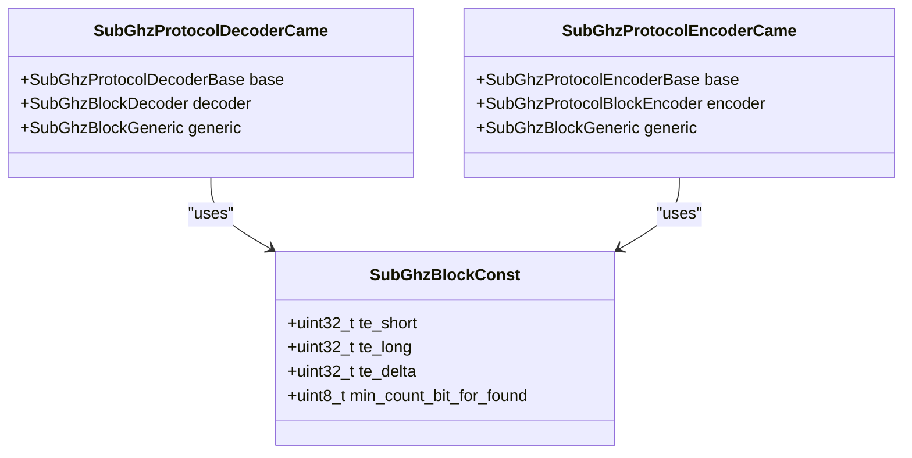
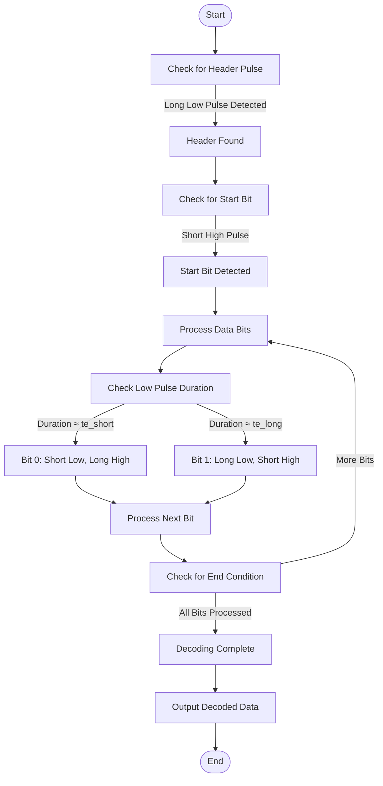
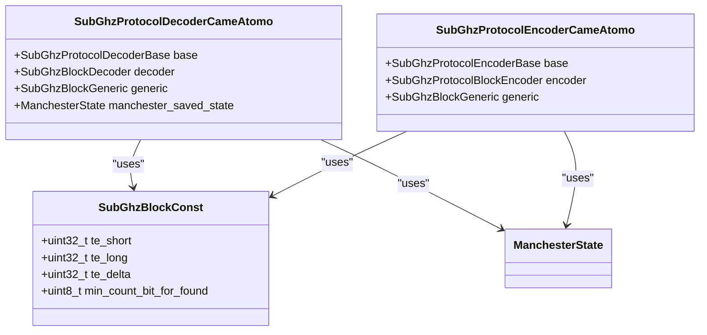
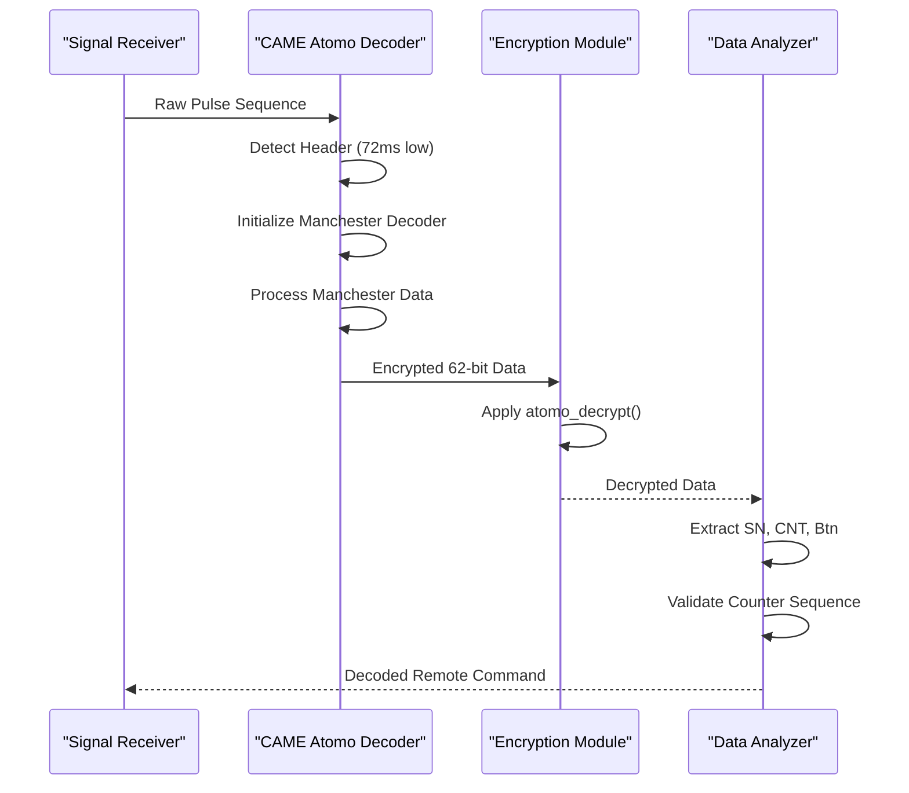
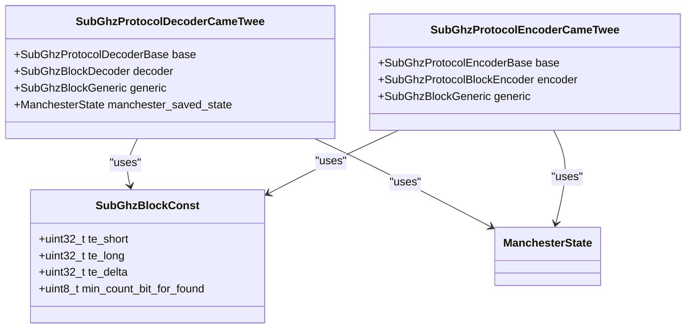
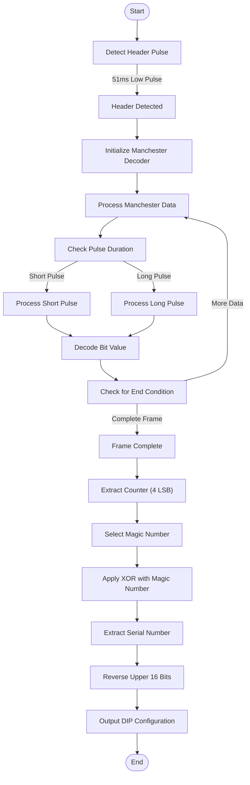
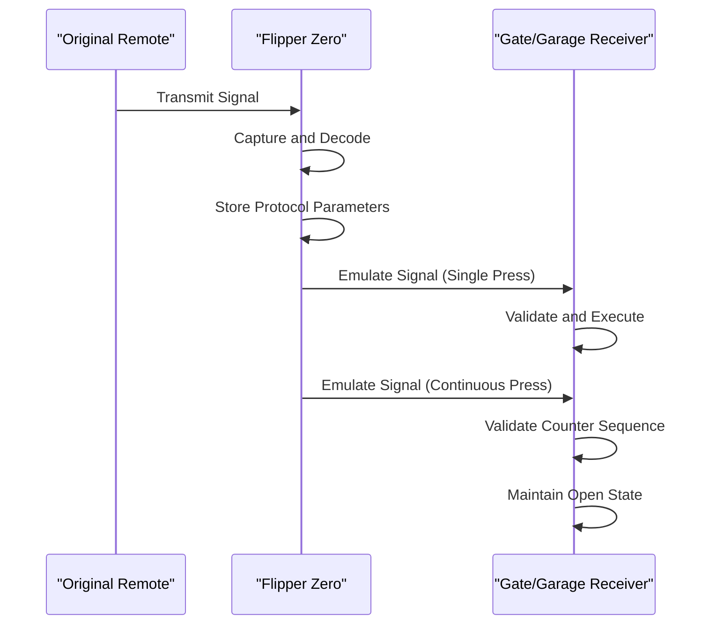

# Came Protocols

<cite>
**Referenced Files in This Document**   
- [came.h](file://lib/subghz/protocols/came.h)
- [came.c](file://lib/subghz/protocols/came.c)
- [came_atomo.h](file://lib/subghz/protocols/came_atomo.h)
- [came_atomo.c](file://lib/subghz/protocols/came_atomo.c)
- [came_twee.h](file://lib/subghz/protocols/came_twee.h)
- [came_twee.c](file://lib/subghz/protocols/came_twee.c)
</cite>

## Table of Contents
1. [Introduction](#introduction)
2. [CAME Protocol Overview](#came-protocol-overview)
3. [CAME Atomo Protocol](#came-atomo-protocol)
4. [CAME Twee Protocol](#came-twee-protocol)
5. [Rolling Code Mechanisms](#rolling-code-mechanisms)
6. [Signal Analysis and Emulation](#signal-analysis-and-emulation)
7. [Practical Usage with Flipper Zero](#practical-usage-with-flipper-zero)
8. [Conclusion](#conclusion)

## Introduction
The CAME protocols are a family of wireless communication standards used primarily in garage door openers, gate systems, and other access control devices. This document provides a comprehensive analysis of the CAME, CAME Atomo, and CAME Twee protocols as implemented in the Flipper Zero firmware. The analysis covers the technical details of each protocol variant, including their rolling code mechanisms, data frame structures, synchronization words, and modulation schemes. The document also explains how these protocols are used in practical applications and provides guidance on using the Flipper Zero to capture, analyze, and emulate CAME protocol signals.

## CAME Protocol Overview

The CAME protocol is a static protocol implementation used for basic remote control operations. It operates at 433 MHz or 315 MHz using amplitude shift keying (ASK) or on-off keying (OOK) modulation. The protocol supports multiple bit lengths including 12-bit, 24-bit, and extended variants for Prastel and Airforce systems.

The implementation is defined in the `came.h` and `came.c` files, which contain the decoder and encoder structures for processing CAME signals. The protocol uses a variable-length data frame with Manchester encoding principles, where the timing parameters are defined by the `subghz_protocol_came_const` structure.



**Diagram sources**
- [came.h](file://lib/subghz/protocols/came.h#L10-L110)
- [came.c](file://lib/subghz/protocols/came.c#L0-L389)

**Section sources**
- [came.h](file://lib/subghz/protocols/came.h#L10-L110)
- [came.c](file://lib/subghz/protocols/came.c#L0-L389)

### Data Frame Structure
The CAME protocol data frame consists of several components:
- **Header**: A long preamble that varies in duration based on the bit length (24320 μs for 24-bit, 15040 μs for 12-bit)
- **Start Bit**: A single timing unit that marks the beginning of data transmission
- **Data Bits**: The actual payload data encoded using Manchester-like timing

The timing parameters are defined as:
- **Short pulse (te_short)**: 320 μs
- **Long pulse (te_long)**: 640 μs
- **Timing delta (te_delta)**: 150 μs (tolerance for timing variations)

Data encoding follows these rules:
- **Bit 1**: Long low pulse (640 μs) followed by short high pulse (320 μs)
- **Bit 0**: Short low pulse (320 μs) followed by long high pulse (640 μs)

### Decoding Process
The CAME protocol decoder uses a state machine with four states to process incoming signals:
1. **Reset**: Initial state waiting for the header
2. **Found Start Bit**: Header detected, waiting for the start bit
3. **Save Duration**: Collecting timing information for bit analysis
4. **Check Duration**: Validating timing to determine bit value

The decoding process begins when a long low pulse (approximately 17,920 μs) is detected, which serves as the header. After the header, the system looks for a start bit with a short high pulse. Subsequent bit values are determined by analyzing the duration of low and high pulses, comparing them against the defined timing parameters.



**Diagram sources**
- [came.c](file://lib/subghz/protocols/came.c#L189-L388)

**Section sources**
- [came.c](file://lib/subghz/protocols/came.c#L0-L389)

## CAME Atomo Protocol

The CAME Atomo protocol is a dynamic protocol that implements a rolling code mechanism for enhanced security. Unlike the static CAME protocol, Atomo uses encryption and a counter-based system to prevent replay attacks. The protocol operates at 433 MHz using ASK/OOK modulation with Manchester encoding.

The implementation is defined in `came_atomo.h` and `came_atomo.c`, which contain specialized encoder and decoder structures for handling the encrypted rolling code system. The protocol uses a 62-bit data frame transmitted in multiple parcels with incremental counters.



**Diagram sources**
- [came_atomo.h](file://lib/subghz/protocols/came_atomo.h#L10-L113)
- [came_atomo.c](file://lib/subghz/protocols/came_atomo.c#L0-L771)

**Section sources**
- [came_atomo.h](file://lib/subghz/protocols/came_atomo.h#L10-L113)
- [came_atomo.c](file://lib/subghz/protocols/came_atomo.c#L0-L771)

### Data Frame and Encryption
The CAME Atomo protocol uses a complex data structure with the following components:
- **Header**: Long high pulse (9,000 μs) followed by long low pulse (72,000 μs)
- **Manchester Encoded Data**: 62-bit payload using Manchester encoding
- **Encryption**: Custom XOR-based encryption algorithm

The timing parameters are:
- **Short pulse (te_short)**: 600 μs
- **Long pulse (te_long)**: 1,200 μs
- **Timing delta (te_delta)**: 250 μs

The data frame contains several important fields:
- **Serial Number (SN)**: 32-bit unique identifier for the device
- **Counter (CNT)**: 16-bit rolling counter that increments with each transmission
- **Button Code**: 4-bit value indicating which button was pressed
- **Button Counter (Btn_Cnt)**: 8-bit counter that cycles from 0 to 127

### Encryption Algorithm
The CAME Atomo protocol implements a custom encryption algorithm in the `atomo_encrypt` and `atomo_decrypt` functions. The algorithm works as follows:

1. **Initialization**: The first byte of the data packet is XORed with 5 and masked with 0x7F
2. **Feedback Shift Register**: A 7-bit feedback shift register processes each bit of the data
3. **XOR Operations**: Specific bit patterns trigger XOR operations on subsequent data bytes

The encryption process can be summarized as:
```c
void atomo_encrypt(uint8_t* buff) {
    uint8_t tmpB = (~buff[0] + 1) & 0x7F;
    
    for(int bitCnt = 8; bitCnt < 59; bitCnt++) {
        // Feedback logic
        if((tmpB & 0x18) && (((tmpB / 8) & 3) != 3)) {
            tmpB = ((tmpB << 1) & 0xFF) | 1;
        } else {
            tmpB = (tmpB << 1) & 0xFF;
        }
        
        // XOR operation if MSB is set
        if(tmpB & 0x80) {
            buff[bitCnt / 8] ^= (0x80 >> (bitCnt & 7));
        }
    }
    
    buff[0] = (buff[0] ^ 5) & 0x7F;
}
```

This encryption scheme provides a basic level of security by ensuring that identical button presses produce different transmitted signals, preventing simple replay attacks.

### Decoding Process
The CAME Atomo decoder uses a state machine with two main states:
1. **Reset**: Waiting for the header pulse
2. **Decoder Data**: Processing Manchester-encoded data bits

The decoding process begins when a long low pulse (approximately 72,000 μs) is detected. After the header, the system processes Manchester-encoded data by analyzing the duration of high and low pulses. The Manchester decoder reconstructs the original bit stream by detecting transitions and applying the appropriate decoding logic.

After receiving a complete data frame, the system performs decryption and data analysis to extract the serial number, counter values, and button information. The counter values are used to validate the rolling code sequence and prevent replay attacks.



**Diagram sources**
- [came_atomo.c](file://lib/subghz/protocols/came_atomo.c#L400-L770)

**Section sources**
- [came_atomo.c](file://lib/subghz/protocols/came_atomo.c#L0-L771)

## CAME Twee Protocol

The CAME Twee protocol is another variant that implements a rolling code mechanism with a unique approach to counter management. It operates at 433 MHz using ASK/OOK modulation with Manchester encoding, similar to the Atomo protocol but with different timing parameters and counter behavior.

The implementation is defined in `came_twee.h` and `came_twee.c`, which contain the encoder and decoder structures specific to the Twee protocol. The protocol uses a 54-bit data frame transmitted in 15 separate parcels with a decreasing counter.



**Diagram sources**
- [came_twee.h](file://lib/subghz/protocols/came_twee.h#L10-L110)
- [came_twee.c](file://lib/subghz/protocols/came_twee.c#L0-L460)

**Section sources**
- [came_twee.h](file://lib/subghz/protocols/came_twee.h#L10-L110)
- [came_twee.c](file://lib/subghz/protocols/came_twee.c#L0-L460)

### Data Frame Structure
The CAME Twee protocol uses a 54-bit data frame with the following characteristics:
- **Header**: Long low pulse (51,000 μs) that serves as synchronization
- **Manchester Encoding**: Standard Manchester encoding for data transmission
- **Multiple Parcels**: Transmission consists of 15 separate parcels

The timing parameters are:
- **Short pulse (te_short)**: 500 μs
- **Long pulse (te_long)**: 1,000 μs
- **Timing delta (te_delta)**: 250 μs

Each transmission consists of 15 parcels with a decreasing counter from 0xE to 0x0. This counter is used as an index into a rainbow table of magic numbers for decryption.

### Rolling Code Mechanism
The CAME Twee protocol implements a rolling code system using a predefined set of magic numbers stored in the `came_twee_magic_numbers_xor` array:

```c
static const uint32_t came_twee_magic_numbers_xor[15] = {
    0x0E0E0E00, 0x1D1D1D11, 0x2C2C2C22, 0x3B3B3B33,
    0x4A4A4A44, 0x59595955, 0x68686866, 0x77777777,
    0x86868688, 0x95959599, 0xA4A4A4AA, 0xB3B3B3BB,
    0xC2C2C2CC, 0xD1D1D1DD, 0xE0E0E0EE
};
```

The decryption process involves the following steps:
1. Extract the counter value (last 4 bits of the data)
2. Use the counter as an index to select the appropriate magic number
3. XOR the received data with the selected magic number
4. Divide the result by 4 to extract the serial number
5. Reverse the bit order of the upper 16 bits to obtain the DIP switch configuration

This rolling code mechanism ensures that each transmission is unique and prevents replay attacks by requiring the receiver to validate the counter sequence.

### Decoding Process
The CAME Twee decoder uses a state machine with two states:
1. **Reset**: Waiting for the header pulse
2. **Decoder Data**: Processing Manchester-encoded data bits

The decoding process begins when a long low pulse (approximately 51,000 μs) is detected. After the header, the system processes Manchester-encoded data by analyzing the duration of high and low pulses. The Manchester decoder reconstructs the original bit stream by detecting transitions and applying the appropriate decoding logic.

After receiving a complete data frame, the system performs the rolling code analysis to extract the serial number, button information, and DIP switch configuration. The DIP switch configuration is particularly important as it represents the physical switch settings on the remote control that must match the receiver.



**Diagram sources**
- [came_twee.c](file://lib/subghz/protocols/came_twee.c#L200-L459)

**Section sources**
- [came_twee.c](file://lib/subghz/protocols/came_twee.c#L0-L460)

## Rolling Code Mechanisms

Rolling code mechanisms are essential for modern remote control systems to prevent replay attacks. Both CAME Atomo and CAME Twee protocols implement sophisticated rolling code systems, but they use different approaches to achieve security.

### CAME Atomo Rolling Code
The CAME Atomo protocol uses a dual-counter system:
- **Parcel Counter (CNT)**: 16-bit counter that increments with each button press
- **Button Counter (Btn_Cnt)**: 8-bit counter that cycles from 0 to 127 during continuous button press

The rolling code mechanism works as follows:
1. When a button is pressed, the parcel counter increments by a configurable multiplier
2. During continuous button press, the system transmits multiple parcels with incrementing button counters
3. The receiver validates that the received counter values are within an acceptable range of the expected values
4. If the counter is too far ahead, the system may require re-synchronization

This approach allows for both security against replay attacks and support for continuous operation (e.g., holding a button to keep a gate open).

### CAME Twee Rolling Code
The CAME Twee protocol uses a decrementing counter system:
- **Counter**: 4-bit value that decreases from 0xE to 0x0 across 15 transmissions
- **Magic Numbers**: Predefined XOR values indexed by the counter

The rolling code mechanism works as follows:
1. The transmitter sends 15 consecutive parcels with decreasing counter values
2. Each parcel uses a different magic number from the rainbow table for XOR encryption
3. The receiver validates that the counter sequence is decreasing correctly
4. The receiver uses the counter value to select the appropriate magic number for decryption

This approach creates a predictable but secure sequence that prevents simple replay attacks while allowing the receiver to synchronize with the transmitter.

### Comparison of Rolling Code Systems
| Feature | CAME Atomo | CAME Twee |
|--------|----------|---------|
| **Counter Direction** | Incrementing | Decrementing |
| **Counter Size** | 16-bit + 8-bit | 4-bit |
| **Transmission Pattern** | Variable parcels | Fixed 15 parcels |
| **Encryption Method** | Feedback shift register | Rainbow table XOR |
| **Synchronization** | Window-based validation | Sequence-based validation |

Both systems provide effective protection against replay attacks, but they represent different design philosophies in balancing security, complexity, and power consumption.

**Section sources**
- [came_atomo.c](file://lib/subghz/protocols/came_atomo.c#L400-L770)
- [came_twee.c](file://lib/subghz/protocols/came_twee.c#L200-L459)

## Signal Analysis and Emulation

Analyzing and emulating CAME protocol signals requires understanding both the physical layer characteristics and the protocol-specific encoding schemes. The Flipper Zero provides tools for capturing, analyzing, and transmitting signals for all three CAME protocol variants.

### Signal Capture
To capture CAME signals using the Flipper Zero:
1. Navigate to the Sub-GHz application
2. Select "Sniffer" mode
3. Configure the frequency to 433.92 MHz (or 315 MHz for some variants)
4. Set modulation to AM/OOK
5. Start recording and press the remote control button

The captured signal will display the pulse sequence, allowing analysis of the timing parameters and data structure.

### Protocol Identification
Identifying which CAME variant is in use requires analyzing the signal characteristics:
- **CAME (Static)**: Look for consistent timing without rolling code patterns
- **CAME Atomo**: Identify the long header (72ms) and Manchester encoding
- **CAME Twee**: Recognize the 51ms header and 15-parcel transmission pattern

The Flipper Zero automatically attempts to decode signals using all available protocol decoders, displaying the results with the appropriate protocol name.

### Emulation Process
Emulating CAME signals involves several steps:
1. **Capture**: Record the original signal from the remote control
2. **Decode**: Extract the protocol type, serial number, and other parameters
3. **Store**: Save the decoded information in a file
4. **Transmit**: Send the stored signal using the Flipper Zero's transmitter

For rolling code protocols like Atomo and Twee, additional considerations are necessary:
- **Counter Management**: The emulator must track and increment counters appropriately
- **Synchronization**: After battery changes or extended periods, re-synchronization may be required
- **Transmission Pattern**: Multiple parcels may need to be sent in sequence

The Flipper Zero handles these complexities through its protocol-specific encoder implementations, which automatically manage counter values and transmission patterns.



**Diagram sources**
- [came_atomo.c](file://lib/subghz/protocols/came_atomo.c#L200-L399)
- [came_twee.c](file://lib/subghz/protocols/came_twee.c#L0-L199)

**Section sources**
- [came_atomo.c](file://lib/subghz/protocols/came_atomo.c#L0-L771)
- [came_twee.c](file://lib/subghz/protocols/came_twee.c#L0-L460)

## Practical Usage with Flipper Zero

Using the Flipper Zero to work with CAME protocols involves several practical steps for capturing, analyzing, and emulating signals. The process varies slightly depending on whether the protocol uses static codes or rolling codes.

### Capturing CAME Signals
To capture a CAME signal:
1. Open the Sub-GHz application on the Flipper Zero
2. Select "Sniffer" from the menu
3. Ensure the frequency is set to 433.92 MHz (default for most CAME systems)
4. Press the "Start" button to begin listening
5. Press and hold the button on the original remote control
6. The Flipper Zero will automatically detect and decode the signal
7. Save the captured signal with a descriptive name

For rolling code systems, it may be necessary to capture multiple transmissions to observe the counter progression and ensure proper emulation.

### Learning New Remotes
The learning procedure for new remotes depends on the protocol type:

**For Static CAME:**
1. Capture the signal as described above
2. The Flipper Zero will automatically save the fixed code
3. No further synchronization is needed

**For CAME Atomo:**
1. Capture multiple transmissions to observe the counter increment
2. The Flipper Zero will store the current counter value
3. When emulating, the counter will automatically increment
4. If the gate doesn't respond, try capturing a new signal as the counter may have advanced

**For CAME Twee:**
1. Capture a complete sequence of 15 parcels
2. The Flipper Zero will identify the counter pattern
3. When emulating, the device will transmit all 15 parcels in the correct sequence
4. The magic number table is built into the firmware

### Troubleshooting Common Issues
Several issues may arise when working with CAME protocols:

**Signal Not Detected:**
- Check that the frequency is correct (433.92 MHz or 315 MHz)
- Ensure the remote battery is not low
- Move closer to the Flipper Zero during capture
- Verify the remote is functioning with the original receiver

**Emulation Not Working:**
- For rolling code systems, the counter may be out of sync
- Try capturing a new signal from the original remote
- Ensure the Flipper Zero is positioned correctly relative to the receiver
- Check that the transmitter power is sufficient

**Intermittent Operation:**
- Battery level in the Flipper Zero may be low
- Interference from other RF devices
- Distance between Flipper Zero and receiver is too great
- Obstructions between devices

### Advanced Features
The Flipper Zero offers several advanced features for working with CAME protocols:
- **Batch Transmission**: Send multiple signals in sequence for systems requiring multiple codes
- **Custom Button Mapping**: Assign CAME signals to the Flipper Zero's physical buttons
- **Scheduled Operations**: Set up automatic transmissions at specific times
- **Signal Analysis Tools**: View detailed timing information and pulse sequences

These features make the Flipper Zero a powerful tool for both everyday use and security analysis of CAME protocol systems.

**Section sources**
- [came.c](file://lib/subghz/protocols/came.c#L0-L389)
- [came_atomo.c](file://lib/subghz/protocols/came_atomo.c#L0-L771)
- [came_twee.c](file://lib/subghz/protocols/came_twee.c#L0-L460)

## Conclusion
The CAME, CAME Atomo, and CAME Twee protocols represent a range of security approaches for wireless access control systems. The basic CAME protocol uses static codes suitable for simple applications, while Atomo and Twee implement rolling code mechanisms to prevent replay attacks.

The Flipper Zero provides comprehensive support for all three protocol variants, enabling users to capture, analyze, and emulate signals for garage doors, gates, and other access control systems. Understanding the differences between these protocols—particularly their rolling code mechanisms, data frame structures, and encryption methods—is essential for successful implementation and troubleshooting.

When working with these systems, it's important to consider the legal and ethical implications of signal emulation. These tools should only be used with systems that the user owns or has explicit permission to access. The knowledge gained from analyzing these protocols can also inform better security practices for wireless systems in general.

As wireless security continues to evolve, understanding both the technical implementation and practical usage of protocols like CAME is valuable for both security professionals and enthusiasts interested in the inner workings of everyday wireless devices.