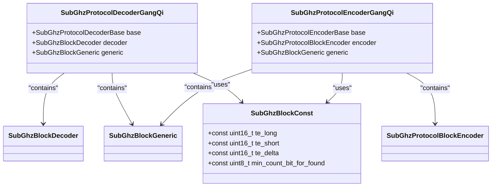
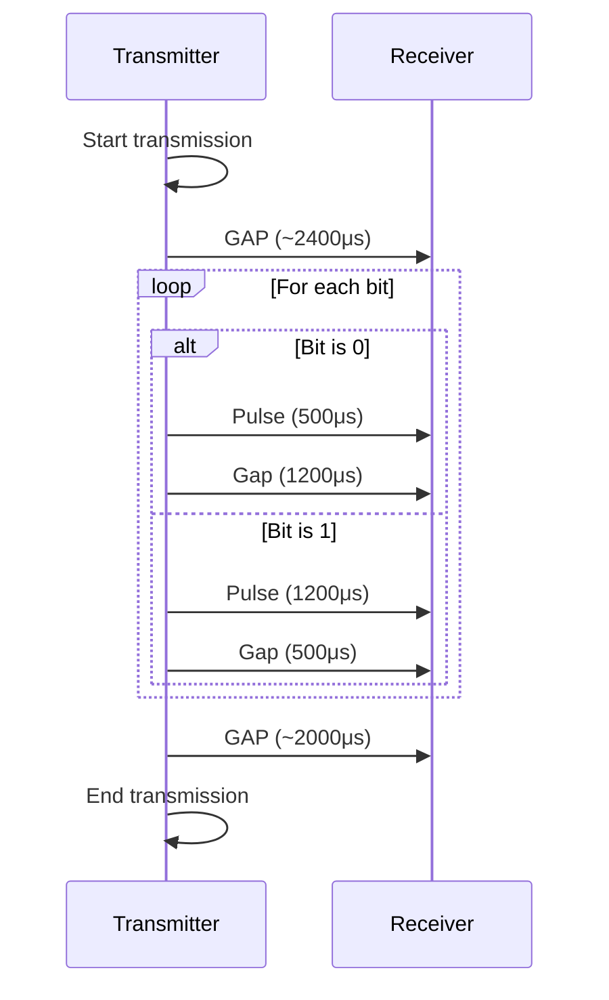
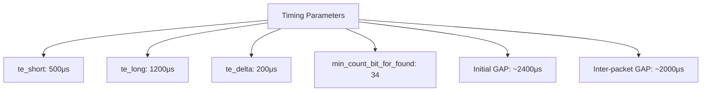
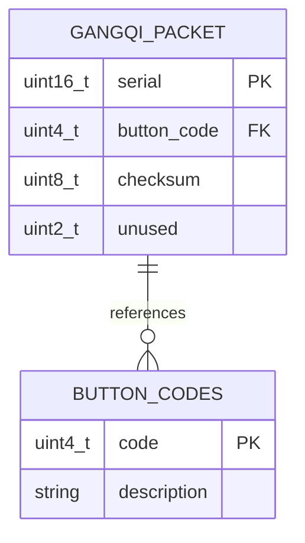
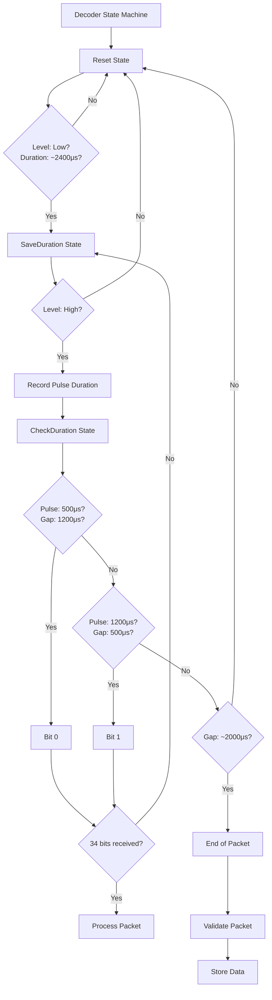
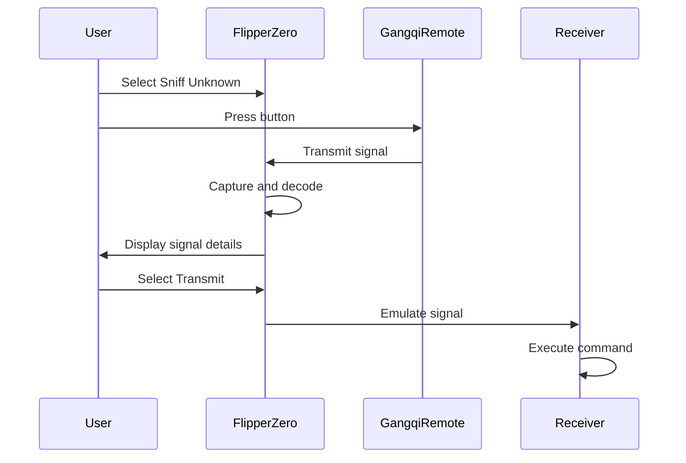

# Gangqi Protocol

<cite>
**Referenced Files in This Document**   
- [gangqi.h](file://lib/subghz/protocols/gangqi.h)
- [gangqi.c](file://lib/subghz/protocols/gangqi.c)
- [const.h](file://lib/subghz/blocks/const.h)
- [decoder.h](file://lib/subghz/blocks/decoder.h)
- [generic.h](file://lib/subghz/blocks/generic.h)
- [gangqi_raw.sub](file://applications/debug/unit_tests/resources/unit_tests/subghz/gangqi_raw.sub)
</cite>

## Table of Contents
1. [Introduction](#introduction)
2. [Protocol Overview](#protocol-overview)
3. [Data Frame Structure](#data-frame-structure)
4. [Modulation and Encoding](#modulation-and-encoding)
5. [Signal Timing Parameters](#signal-timing-parameters)
6. [Address and Command Structure](#address-and-command-structure)
7. [Implementation Details](#implementation-details)
8. [Usage in Garage Door Openers and Access Control](#usage-in-garage-door-openers-and-access-control)
9. [Common Issues](#common-issues)
10. [Flipper Zero Signal Analysis and Emulation](#flipper-zero-signal-analysis-and-emulation)
11. [Conclusion](#conclusion)

## Introduction
The Gangqi protocol is a sub-GHz wireless communication protocol commonly used in garage door openers and access control systems. This document provides a comprehensive analysis of the Gangqi protocol implementation within the Flipper Zero firmware, detailing its data structure, modulation scheme, encoding method, and practical applications. The analysis is based on the source code found in the Flipper Zero firmware repository, specifically the `gangqi.c` and `gangqi.h` files, along with supporting structures from the sub-GHz protocol library.

## Protocol Overview
The Gangqi protocol is designed for reliable short-range wireless communication in security and access control applications. It operates in the 433 MHz frequency band and uses Amplitude Shift Keying (ASK) modulation with On-Off Keying (OOK) encoding. The protocol is characterized by its specific timing parameters and data structure, which ensure robust signal transmission and reception.

The protocol implementation in the Flipper Zero firmware is structured around two main components: the decoder and the encoder. These components handle the reception and transmission of Gangqi protocol signals, respectively. The protocol is registered with the Flipper Zero's sub-GHz system and can be used for capturing, analyzing, and emulating signals from Gangqi-compatible devices.

**Diagram sources**
- [gangqi.c](file://lib/subghz/protocols/gangqi.c#L20-L45)
- [const.h](file://lib/subghz/blocks/const.h#L7-L14)
- [decoder.h](file://lib/subghz/blocks/decoder.h#L15-L23)
- [generic.h](file://lib/subghz/blocks/generic.h#L20-L30)

**Section sources**
- [gangqi.h](file://lib/subghz/protocols/gangqi.h#L1-L109)
- [gangqi.c](file://lib/subghz/protocols/gangqi.c#L0-L488)

## Data Frame Structure
The Gangqi protocol data frame consists of a 34-bit data packet that includes the serial number, button code, and checksum. The data structure is defined in the `SubGhzBlockGeneric` structure, which contains fields for the protocol name, data, serial number, button code, and other metadata.

The 34-bit data frame is structured as follows:
- Bits 33-16: Serial number (18 bits)
- Bits 15-12: Constant value (0xD0) combined with button code
- Bits 11-2: Checksum (8 bits)
- Bits 1-0: Unused (always 0)

The data frame is transmitted as a sequence of level and duration pairs, where each bit is represented by a specific timing pattern. The transmission ends with a gap of approximately 2000 microseconds to separate consecutive packets.

**Diagram sources**
- [gangqi.c](file://lib/subghz/protocols/gangqi.c#L210-L278)
- [gangqi.c](file://lib/subghz/protocols/gangqi.c#L340-L390)

**Section sources**
- [gangqi.c](file://lib/subghz/protocols/gangqi.c#L200-L400)
- [generic.h](file://lib/subghz/blocks/generic.h#L20-L30)

## Modulation and Encoding
The Gangqi protocol uses Amplitude Shift Keying (ASK) modulation with On-Off Keying (OOK) encoding. In this scheme, the presence of a carrier wave represents a logic high (1), while the absence of the carrier wave represents a logic low (0).

The encoding scheme uses two different timing patterns to represent binary data:
- **Bit 0**: Short pulse (500μs) followed by a long gap (1200μs)
- **Bit 1**: Long pulse (1200μs) followed by a short gap (500μs)

This encoding method is a form of pulse-position modulation where the position of the long pulse indicates the bit value. The timing parameters are defined in the `SubGhzBlockConst` structure with `te_short` set to 500μs, `te_long` set to 1200μs, and `te_delta` set to 200μs for timing tolerance.

The encoding process begins with a gap of approximately 2400μs to synchronize the receiver. Each bit is then transmitted using the appropriate timing pattern based on its value. The transmission ends with a longer gap of approximately 2000μs to separate consecutive packets.

**Diagram sources**
- [gangqi.c](file://lib/subghz/protocols/gangqi.c#L210-L278)
- [gangqi.c](file://lib/subghz/protocols/gangqi.c#L340-L390)

**Section sources**
- [gangqi.c](file://lib/subghz/protocols/gangqi.c#L200-L400)
- [const.h](file://lib/subghz/blocks/const.h#L7-L14)

## Signal Timing Parameters
The Gangqi protocol uses specific timing parameters to ensure reliable signal transmission and reception. These parameters are defined in the `SubGhzBlockConst` structure and include:

- **te_short**: 500 microseconds - duration of short pulses and gaps
- **te_long**: 1200 microseconds - duration of long pulses and gaps
- **te_delta**: 200 microseconds - timing tolerance for signal variations
- **min_count_bit_for_found**: 34 bits - minimum number of bits required to recognize a valid packet

The timing parameters are critical for the proper functioning of the protocol. The transmitter must generate pulses and gaps with durations close to the specified values, while the receiver must be able to tolerate variations within the `te_delta` range.

The initial synchronization gap is approximately 2400μs (twice the `te_long` duration), which helps the receiver detect the start of a transmission. The inter-packet gap is approximately 2000μs (four times the `te_short` duration plus `te_delta`), which separates consecutive packets and prevents false triggering.

These timing parameters are optimized for the 433 MHz frequency band and the specific hardware characteristics of the devices using the Gangqi protocol. The relatively long pulse durations provide good noise immunity and reliable reception, while the specific timing patterns help distinguish the Gangqi protocol from other similar protocols operating in the same frequency band.

**Diagram sources**
- [gangqi.c](file://lib/subghz/protocols/gangqi.c#L15-L20)
- [const.h](file://lib/subghz/blocks/const.h#L7-L14)

**Section sources**
- [gangqi.c](file://lib/subghz/protocols/gangqi.c#L15-L20)
- [const.h](file://lib/subghz/blocks/const.h#L7-L14)

## Address and Command Structure
The Gangqi protocol uses a 34-bit data structure that combines addressing and command information in a single packet. The structure is designed to provide both device identification and control functionality.

The address portion of the packet consists of a 16-bit serial number that uniquely identifies the target device. This serial number is extracted from bits 18-33 of the data packet and is used to ensure that commands are only executed by the intended receiver.

The command portion of the packet includes:
- **Button code**: 4 bits (bits 12-15) that specify the action to be performed
- **Checksum**: 8 bits (bits 2-9) used for error detection

The button code can represent up to 16 different commands, although not all values may be used in practice. The implementation includes a lookup table that maps button codes to human-readable names:

- 0x0: Unknown
- 0x1: Exit settings
- 0x2: Volume setting
- 0x3: Reserved
- 0x4: Vibro sens. setting
- 0x5: Settings mode
- 0x6: Ringtone setting
- 0x7: Ring
- 0x8: Reserved
- 0x9: Reserved
- 0xA: Reserved
- 0xB: Alarm
- 0xC: Reserved
- 0xD: Arm
- 0xE: Disarm
- 0xF: Reserved

The checksum is calculated using two different methods, both of which are accepted by the receiver:
- **Type 1**: `0xC8 - serial_high - serial_low - const_and_button`
- **Type 2**: `0x02 + serial_high + serial_low + const_and_button`

This dual-checksum approach provides backward compatibility and may serve as a security feature to prevent unauthorized devices from generating valid packets.

**Diagram sources**
- [gangqi.c](file://lib/subghz/protocols/gangqi.c#L430-L460)
- [gangqi.c](file://lib/subghz/protocols/gangqi.c#L470-L490)

**Section sources**
- [gangqi.c](file://lib/subghz/protocols/gangqi.c#L430-L490)
- [generic.h](file://lib/subghz/blocks/generic.h#L20-L30)

## Implementation Details
The Gangqi protocol implementation in the Flipper Zero firmware is structured as a state machine with separate components for encoding and decoding. The implementation follows the standard pattern used for other sub-GHz protocols in the firmware.

The decoder component uses a three-step state machine to parse incoming signals:
1. **Reset**: Wait for the initial synchronization gap
2. **SaveDuration**: Record the duration of the current pulse
3. **CheckDuration**: Compare pulse and gap durations to determine the bit value

The decoder processes incoming level and duration pairs, using the timing parameters to distinguish between bit 0 and bit 1. When a complete 34-bit packet is received, the data is stored in the `SubGhzBlockGeneric` structure and made available for further processing.

The encoder component generates the appropriate level and duration sequence based on the data to be transmitted. It uses the `subghz_protocol_encoder_gangqi_get_upload` function to create the transmission buffer, which is then fed to the radio hardware through the `subghz_protocol_encoder_gangqi_yield` function.

Key implementation features include:
- Dynamic button code handling through the `subghz_protocol_gangqi_get_btn_code` function
- Checksum calculation using both Type 1 and Type 2 methods
- Support for custom button mapping to enhance usability
- Integration with the Flipper Zero's sub-GHz system for seamless operation

The implementation also includes error handling and validation to ensure reliable operation. The `subghz_protocol_decoder_gangqi_reset` function clears the decoder state when an invalid signal is detected, preventing corrupted data from being processed.

**Diagram sources**
- [gangqi.c](file://lib/subghz/protocols/gangqi.c#L340-L390)
- [gangqi.c](file://lib/subghz/protocols/gangqi.c#L210-L278)

**Section sources**
- [gangqi.c](file://lib/subghz/protocols/gangqi.c#L200-L400)
- [gangqi.h](file://lib/subghz/protocols/gangqi.h#L1-L109)

## Usage in Garage Door Openers and Access Control
The Gangqi protocol is commonly used in garage door openers and access control systems due to its reliability and security features. These applications require a robust wireless communication protocol that can operate reliably in various environmental conditions while providing adequate security against unauthorized access.

In garage door opener systems, the Gangqi protocol is used to transmit commands from a handheld remote to the garage door controller. The serial number in the data packet ensures that only authorized remotes can operate the specific garage door, while the button code specifies the action (open, close, or stop). The checksum provides error detection to prevent misoperation due to signal corruption.

Access control systems use the Gangqi protocol similarly, with the serial number identifying the specific access point and the button code representing different access levels or functions. The protocol's 433 MHz frequency provides good range and penetration through walls and other obstacles, making it suitable for both indoor and outdoor applications.

The implementation in the Flipper Zero firmware allows users to capture and analyze signals from existing Gangqi-compatible devices, enabling them to understand the communication patterns and potentially create backup remotes or test system security. This capability is particularly useful for security assessment and troubleshooting existing installations.

The protocol's design balances simplicity with functionality, providing a straightforward communication method while including features like device addressing and error detection to ensure reliable operation in real-world conditions.

**Section sources**
- [gangqi.c](file://lib/subghz/protocols/gangqi.c#L430-L490)
- [gangqi_raw.sub](file://applications/debug/unit_tests/resources/unit_tests/subghz/gangqi_raw.sub#L1-L13)

## Common Issues
When working with Gangqi protocol devices, several common issues may arise that affect signal reliability and device operation:

1. **Signal Interference**: Other devices operating in the 433 MHz band can cause interference, leading to corrupted transmissions. This is particularly common in urban environments with many wireless devices.

2. **Timing Drift**: Temperature variations and component aging can cause timing drift in both transmitters and receivers, potentially leading to failed communication when the signal falls outside the `te_delta` tolerance range.

3. **Battery Issues**: Low battery power in remote controls can result in weaker signals that may not be reliably received, especially at longer distances.

4. **Antenna Problems**: Damaged or poorly positioned antennas can significantly reduce transmission range and reliability.

5. **Rolling Code Confusion**: While the Gangqi protocol uses a static code rather than a rolling code system, users may confuse it with more advanced security systems that use rolling codes.

6. **Signal Capture Difficulties**: When using the Flipper Zero to capture Gangqi signals, users may experience difficulties due to timing sensitivity or interference from other sources.

7. **Checksum Validation**: The dual-checksum system can sometimes cause confusion when analyzing captured signals, as both checksum types may appear valid.

To mitigate these issues, users should ensure proper battery levels, check antenna connections, and perform signal captures in environments with minimal RF interference. When using the Flipper Zero for signal analysis, it's recommended to capture multiple samples to verify consistency and account for potential transmission errors.

**Section sources**
- [gangqi.c](file://lib/subghz/protocols/gangqi.c#L340-L390)
- [gangqi.c](file://lib/subghz/protocols/gangqi.c#L210-L278)

## Flipper Zero Signal Analysis and Emulation
The Flipper Zero provides comprehensive tools for capturing, analyzing, and emulating Gangqi protocol signals, making it an ideal platform for testing and security assessment of Gangqi-compatible devices.

To capture a Gangqi signal using the Flipper Zero:
1. Navigate to the Sub-GHz application
2. Select "Sniff Unknown" mode
3. Press the button on the Gangqi remote while holding the Flipper Zero near the remote
4. The Flipper Zero will automatically detect and capture the signal

Once captured, the signal can be analyzed using the Flipper Zero's protocol analyzer, which displays detailed information about the signal structure, including:
- Protocol name: GangQi
- Bit count: 34 bits
- Data: Full hexadecimal representation
- Serial number: Extracted device identifier
- Button code: Command being transmitted
- Checksum: Both Type 1 and Type 2 values

The captured signal can be saved to a file for later use or immediately transmitted to test the receiving device. The Flipper Zero can also generate new Gangqi signals with custom parameters, allowing users to test device responses to different commands or serial numbers.

For security assessment, the Flipper Zero can be used to:
- Test the range and reliability of existing installations
- Verify that only authorized devices can operate the system
- Check for potential vulnerabilities in the protocol implementation
- Create backup remotes for emergency access

The ability to both capture and generate Gangqi signals makes the Flipper Zero a powerful tool for understanding and working with these systems, whether for legitimate maintenance purposes or security testing.

**Diagram sources**
- [gangqi.c](file://lib/subghz/protocols/gangqi.c#L200-L400)
- [gangqi_raw.sub](file://applications/debug/unit_tests/resources/unit_tests/subghz/gangqi_raw.sub#L1-L13)

**Section sources**
- [gangqi.c](file://lib/subghz/protocols/gangqi.c#L200-L400)
- [gangqi_raw.sub](file://applications/debug/unit_tests/resources/unit_tests/subghz/gangqi_raw.sub#L1-L13)

## Conclusion
The Gangqi protocol is a robust and widely-used wireless communication standard for garage door openers and access control systems. Its implementation in the Flipper Zero firmware provides a comprehensive set of tools for capturing, analyzing, and emulating these signals, enabling both legitimate maintenance and security assessment.

The protocol's design, with its specific timing parameters, 34-bit data structure, and dual-checksum system, balances simplicity with functionality to provide reliable operation in various environments. The use of ASK/OOK modulation at 433 MHz ensures good range and penetration while remaining compatible with common sub-GHz radio hardware.

Understanding the Gangqi protocol's implementation details, including its data frame structure, encoding method, and timing parameters, is essential for effectively working with these systems. The Flipper Zero's capabilities in this area make it an invaluable tool for security professionals, system integrators, and enthusiasts alike.

As with any wireless security system, proper installation, maintenance, and security practices are crucial to ensure reliable and secure operation. Regular testing and verification of system components can help identify and address potential issues before they lead to operational failures or security vulnerabilities.

**Section sources**
- [gangqi.h](file://lib/subghz/protocols/gangqi.h#L1-L109)
- [gangqi.c](file://lib/subghz/protocols/gangqi.c#L0-L488)
- [gangqi_raw.sub](file://applications/debug/unit_tests/resources/unit_tests/subghz/gangqi_raw.sub#L1-L13)