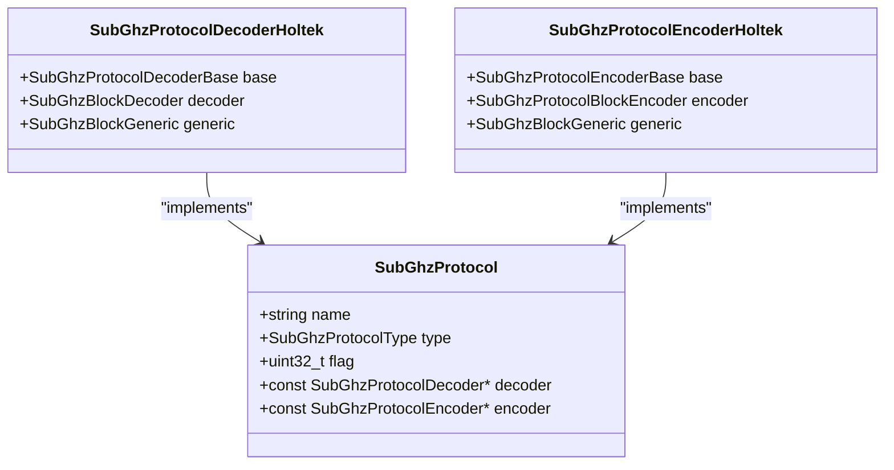
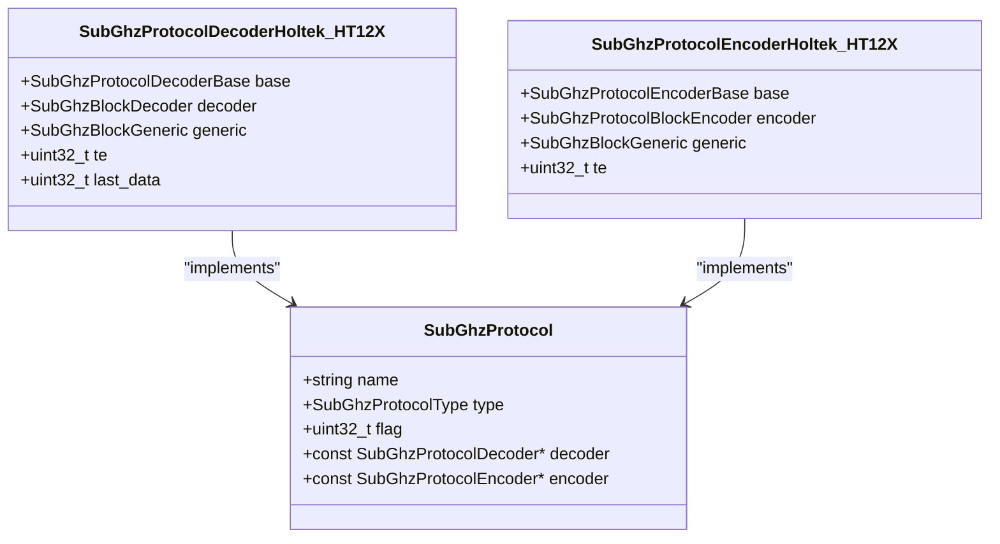
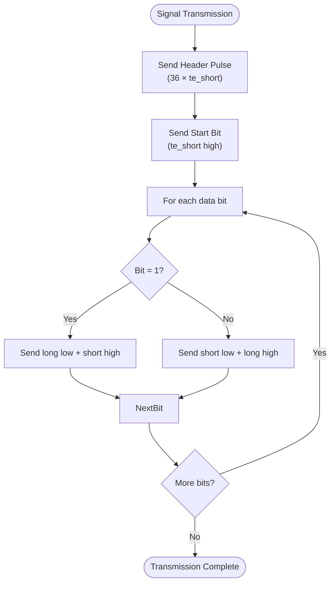
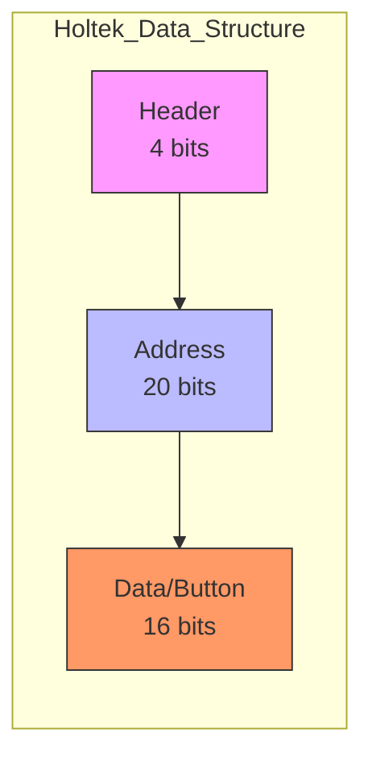
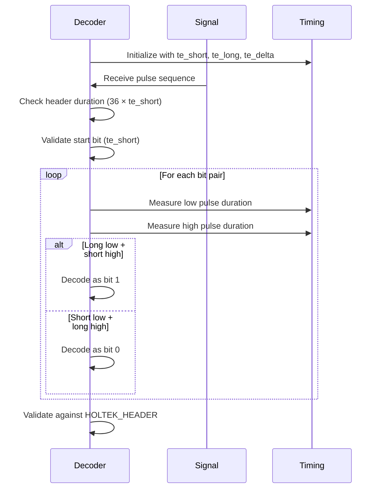
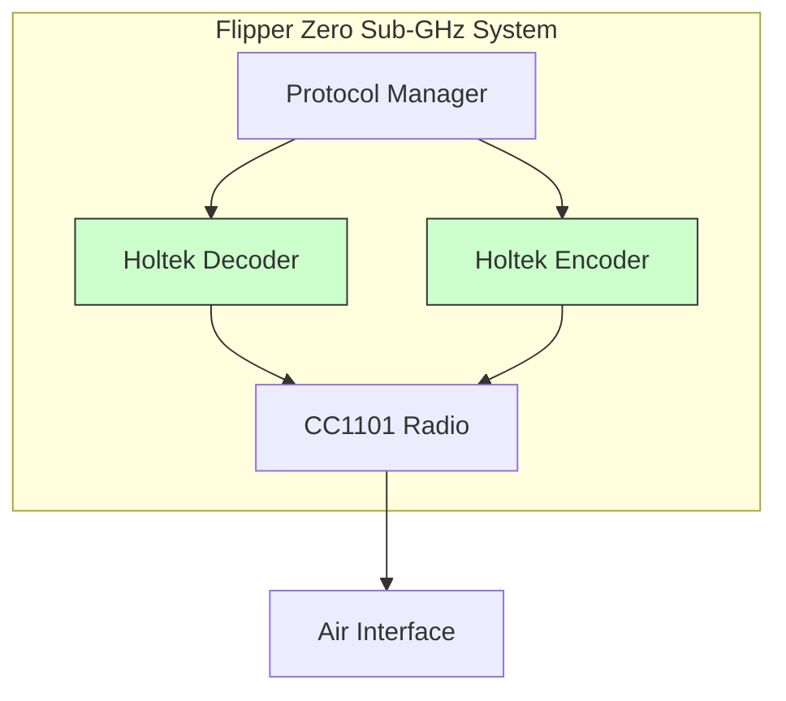

# Holtek Protocols

<cite>
**Referenced Files in This Document**   
- [holtek.c](file://lib/subghz/protocols/holtek.c#L1-L367)
- [holtek.h](file://lib/subghz/protocols/holtek.h#L1-L110)
- [holtek_ht12x.c](file://lib/subghz/protocols/holtek_ht12x.c#L1-L410)
- [holtek_ht12x.h](file://lib/subghz/protocols/holtek_ht12x.h#L1-L110)
</cite>

## Table of Contents
1. [Introduction](#introduction)
2. [Holtek Protocol Overview](#holtek-protocol-overview)
3. [Holtek HT12X Protocol Variant](#holtek-ht12x-protocol-variant)
4. [Signal Encoding and Modulation](#signal-encoding-and-modulation)
5. [Address and Data Structure](#address-and-data-structure)
6. [Timing Parameters](#timing-parameters)
7. [Implementation in Flipper Zero](#implementation-in-flipper-zero)
8. [Common Applications](#common-applications)
9. [Practical Usage with Flipper Zero](#practical-usage-with-flipper-zero)
10. [Conclusion](#conclusion)

## Introduction
The Holtek protocols represent a family of wireless communication standards commonly used in consumer electronics and access control systems. These protocols are implemented in various integrated circuits produced by Holtek Semiconductor and are widely adopted in remote controls, garage door openers, and security systems. This document provides a comprehensive analysis of the Holtek and Holtek HT12X protocol implementations within the Flipper Zero firmware, detailing their structure, encoding schemes, and practical applications.

**Section sources**
- [holtek.c](file://lib/subghz/protocols/holtek.c#L1-L367)
- [holtek.h](file://lib/subghz/protocols/holtek.h#L1-L110)

## Holtek Protocol Overview
The Holtek protocol implementation in the Flipper Zero firmware provides both encoding and decoding capabilities for signals using the Holtek standard. The protocol is designed for sub-GHz wireless communication and supports multiple frequency bands including 315MHz, 433MHz, and 868MHz.

The implementation follows a structured approach with dedicated decoder and encoder components that handle the parsing and generation of Holtek protocol signals. The protocol uses amplitude modulation (AM) and is classified as a static protocol type, indicating that it transmits fixed data patterns rather than rolling codes.

**Diagram sources**
- [holtek.c](file://lib/subghz/protocols/holtek.c#L30-L35)
- [holtek.h](file://lib/subghz/protocols/holtek.h#L15-L17)

**Section sources**
- [holtek.c](file://lib/subghz/protocols/holtek.c#L1-L367)
- [holtek.h](file://lib/subghz/protocols/holtek.h#L1-L110)

## Holtek HT12X Protocol Variant
The Holtek HT12X protocol represents a specific variant within the Holtek family, designed for remote control applications. Unlike the base Holtek protocol, HT12X supports both amplitude modulation (AM) and frequency modulation (FM), providing greater flexibility in transmission methods.

The HT12X implementation includes additional timing parameters that can be configured during deserialization, allowing the protocol to adapt to variations in signal timing across different hardware implementations. This flexibility is particularly important when dealing with legacy devices that may have slight timing deviations.

**Diagram sources**
- [holtek_ht12x.c](file://lib/subghz/protocols/holtek_ht12x.c#L30-L35)
- [holtek_ht12x.h](file://lib/subghz/protocols/holtek_ht12x.h#L15-L17)

**Section sources**
- [holtek_ht12x.c](file://lib/subghz/protocols/holtek_ht12x.c#L1-L410)
- [holtek_ht12x.h](file://lib/subghz/protocols/holtek_ht12x.h#L1-L110)

## Signal Encoding and Modulation
The Holtek protocols use a Manchester-like encoding scheme with distinct short and long pulse durations to represent binary data. Both protocols employ On-Off Keying (OOK), a form of Amplitude Shift Keying (ASK), where the presence or absence of a carrier wave represents binary states.

For the base Holtek protocol, a short pulse duration of 430μs and a long pulse duration of 870μs are used, with a timing tolerance (delta) of 100μs. The HT12X variant uses shorter timings with a short pulse of 320μs and a long pulse of 640μs, reflecting the different design specifications of the HT12X series chips.

The encoding process begins with a header pulse that is 36 times the short pulse duration, followed by a start bit and then the data bits. Each data bit is encoded using two pulses: for a binary 1, a long low pulse followed by a short high pulse; for a binary 0, a short low pulse followed by a long high pulse.

**Diagram sources**
- [holtek.c](file://lib/subghz/protocols/holtek.c#L123-L140)
- [holtek_ht12x.c](file://lib/subghz/protocols/holtek_ht12x.c#L123-L140)

**Section sources**
- [holtek.c](file://lib/subghz/protocols/holtek.c#L21-L23)
- [holtek_ht12x.c](file://lib/subghz/protocols/holtek_ht12x.c#L23-L24)

## Address and Data Structure
The Holtek protocol implements a structured data format with a specific header pattern and data organization. The protocol uses a 40-bit data structure with a defined header and address/data fields.

The header is defined by two constants:
- **HOLTEK_HEADER_MASK**: 0xF000000000 (used to mask the header bits)
- **HOLTEK_HEADER**: 0x5000000000 (expected header value)

When a valid signal is detected, the implementation extracts the serial number and button information from the data payload. The serial number is derived from bits 16-35 (20 bits) of the data field, while button information is encoded in the lower 16 bits. The button decoding logic identifies which button was pressed by checking for non-0xA values in each 4-bit nibble of the button field.

For the HT12X variant, the data structure typically consists of 12 bits total, with 8 bits for address (DIP switch settings) and 4 bits for data. The address bits are used to prevent interference between similar devices in proximity, while the data bits indicate the specific command being transmitted.

**Diagram sources**
- [holtek.c](file://lib/subghz/protocols/holtek.c#L17-L18)
- [holtek.c](file://lib/subghz/protocols/holtek.c#L320-L340)

**Section sources**
- [holtek.c](file://lib/subghz/protocols/holtek.c#L17-L18)
- [holtek.c](file://lib/subghz/protocols/holtek.c#L320-L340)

## Timing Parameters
The timing parameters for the Holtek protocols are critical to successful signal transmission and reception. These parameters define the pulse durations used to encode binary data and are implemented as constants in the protocol definitions.

For the base Holtek protocol:
- **te_short**: 430μs (short pulse duration)
- **te_long**: 870μs (long pulse duration)
- **te_delta**: 100μs (timing tolerance)
- **min_count_bit_for_found**: 40 bits (minimum bits to validate a signal)

For the HT12X variant:
- **te_short**: 320μs (short pulse duration)
- **te_long**: 640μs (long pulse duration)
- **te_delta**: 200μs (timing tolerance)
- **min_count_bit_for_found**: 12 bits (minimum bits to validate a signal)

The decoder uses these timing parameters to distinguish between valid signals and noise. When processing incoming signals, the implementation checks the duration of each pulse against the expected values, allowing for a delta tolerance to account for timing variations in transmission and reception.

**Diagram sources**
- [holtek.c](file://lib/subghz/protocols/holtek.c#L21-L23)
- [holtek_ht12x.c](file://lib/subghz/protocols/holtek_ht12x.c#L23-L24)

**Section sources**
- [holtek.c](file://lib/subghz/protocols/holtek.c#L21-L23)
- [holtek_ht12x.c](file://lib/subghz/protocols/holtek_ht12x.c#L23-L24)

## Implementation in Flipper Zero
The Holtek protocol implementation in Flipper Zero follows a modular design pattern with separate decoder and encoder components that interface with the core sub-GHz subsystem. The implementation is located in the `lib/subghz/protocols/` directory and consists of four main files: `holtek.c`, `holtek.h`, `holtek_ht12x.c`, and `holtek_ht12x.h`.

The decoder component processes incoming signal data by analyzing pulse durations and reconstructing the original data packet. It uses a state machine approach with four states:
- **Reset**: Initial state, waiting for preamble
- **FoundStartBit**: Preamble detected, waiting for start bit
- **SaveDuration**: Collecting pulse duration data
- **CheckDuration**: Validating pulse durations against expected values

The encoder component generates the appropriate pulse sequences for transmission based on the configured data payload. It creates an upload buffer containing level and duration pairs that are sent to the radio hardware for transmission. Both encoder and decoder support serialization to Flipper Format files, allowing signals to be saved and loaded for later use.

**Diagram sources**
- [holtek.c](file://lib/subghz/protocols/holtek.c#L1-L367)
- [holtek_ht12x.c](file://lib/subghz/protocols/holtek_ht12x.c#L1-L410)

**Section sources**
- [holtek.c](file://lib/subghz/protocols/holtek.c#L1-L367)
- [holtek_ht12x.c](file://lib/subghz/protocols/holtek_ht12x.c#L1-L410)

## Common Applications
Holtek protocols are widely used in various consumer electronics and access control systems due to their simplicity and reliability. Common applications include:

- **Garage door openers**: Many garage door remote controls use Holtek HT12X series chips for wireless communication with the receiver unit.
- **Gate controllers**: Property access gates often employ Holtek-based remotes for secure wireless operation.
- **Lighting controls**: Wireless light switches and dimmers frequently use Holtek protocols for communication.
- **Appliance remotes**: Various home appliances like fans, heaters, and air conditioners use Holtek-based remote controls.
- **Security systems**: Some alarm systems and security sensors use Holtek protocols for wireless communication.

The HT12X variant is particularly common in devices with DIP switches for address configuration, allowing users to set unique codes to prevent interference between similar devices. This makes it ideal for residential applications where multiple similar devices might be in close proximity.

**Section sources**
- [holtek.c](file://lib/subghz/protocols/holtek.c#L1-L367)
- [holtek_ht12x.c](file://lib/subghz/protocols/holtek_ht12x.c#L1-L410)

## Practical Usage with Flipper Zero
The Flipper Zero provides comprehensive tools for working with Holtek protocol signals, enabling users to capture, analyze, and emulate these signals for testing and reverse engineering purposes.

To capture a Holtek signal:
1. Navigate to the Sub-GHz application
2. Select "Sniff Unknown" mode
3. Press the remote control button near the Flipper Zero
4. The device will automatically detect and decode the signal if it matches the Holtek protocol pattern

To emulate a captured Holtek signal:
1. Save the captured signal to a file
2. Load the signal in the Sub-GHz application
3. Select "Transmit" mode
4. Press the transmit button to send the signal to the target device

For manual configuration of Holtek HT12X signals, users can specify the timing parameter (TE) and data values directly. This is useful when working with devices that have non-standard timing characteristics. The Flipper Zero can also generate signals with custom repeat counts, allowing for testing of devices that require multiple signal transmissions.

The device's ability to analyze and display the protocol details, including the serial number and button information, makes it a powerful tool for understanding and interacting with Holtek-based systems.

**Section sources**
- [holtek.c](file://lib/subghz/protocols/holtek.c#L1-L367)
- [holtek_ht12x.c](file://lib/subghz/protocols/holtek_ht12x.c#L1-L410)

## Conclusion
The Holtek and Holtek HT12X protocols represent important standards in the realm of sub-GHz wireless communication for consumer devices. The Flipper Zero's implementation provides robust support for both protocols, enabling users to work with a wide range of remote control systems and access devices.

Understanding the specific timing parameters, data structure, and encoding schemes of these protocols is essential for successful signal capture and emulation. The modular design of the Flipper Zero firmware allows for easy extension and modification of these protocols, making it a versatile tool for security research and device testing.

As these protocols continue to be used in various applications, the ability to analyze and interact with them remains a valuable skill for electronics enthusiasts, security professionals, and IoT developers.

**Section sources**
- [holtek.c](file://lib/subghz/protocols/holtek.c#L1-L367)
- [holtek_ht12x.c](file://lib/subghz/protocols/holtek_ht12x.c#L1-L410)