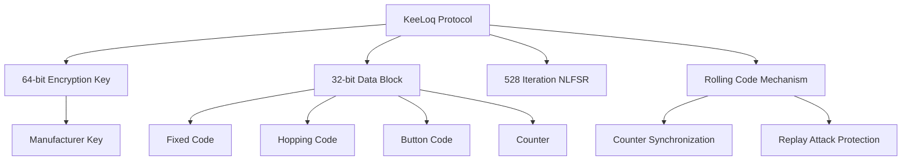
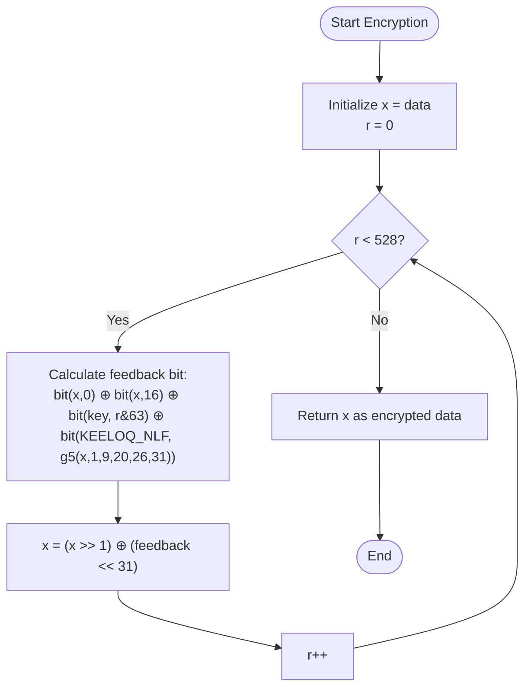
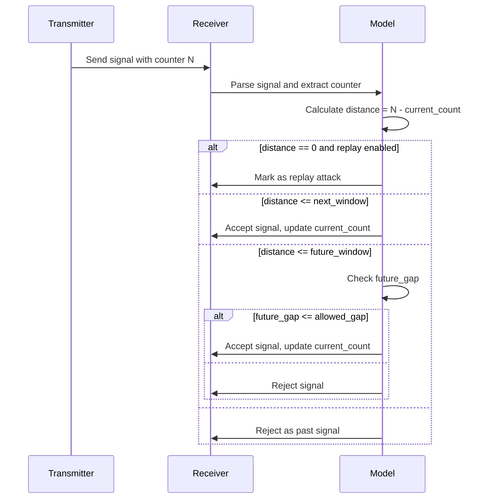
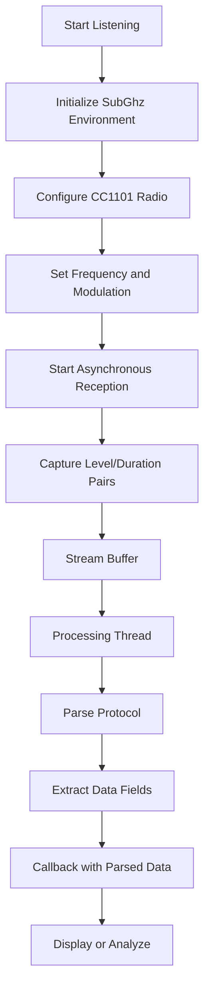
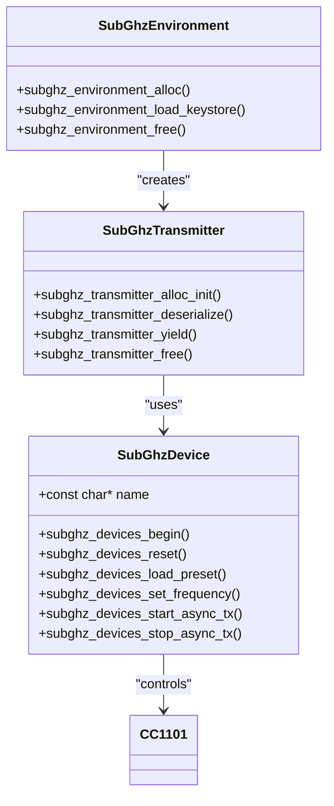

# KeeLoq Protocol

<cite>
**Referenced Files in This Document**   
- [rolling_flaws_keeloq.c](file://applications/external/rolling_flaws/rolling_flaws_keeloq.c)
- [rolling_flaws_keeloq.h](file://applications/external/rolling_flaws/rolling_flaws_keeloq.h)
- [keeloq.c](file://lib/subghz/protocols/keeloq.c)
- [keeloq.h](file://lib/subghz/protocols/keeloq.h)
- [keeloq_common.c](file://lib/subghz/protocols/keeloq_common.c)
- [keeloq_common.h](file://lib/subghz/protocols/keeloq_common.h)
- [rolling_flaws_send_keeloq.c](file://applications/external/rolling_flaws/rolling_flaws_send_keeloq.c)
- [rolling_flaws_send_keeloq.h](file://applications/external/rolling_flaws/rolling_flaws_send_keeloq.h)
- [rolling_flaws_subghz_receive.c](file://applications/external/rolling_flaws/rolling_flaws_subghz_receive.c)
- [rolling_flaws_subghz_receive.h](file://applications/external/rolling_flaws/rolling_flaws_subghz_receive.h)
- [rolling_flaws_utils.c](file://applications/external/rolling_flaws/rolling_flaws_utils.c)
- [rolling_flaws_utils.h](file://applications/external/rolling_flaws/rolling_flaws_utils.h)
- [rolling_flaws_settings.c](file://applications/external/rolling_flaws/rolling_flaws_settings.c)
</cite>

## Table of Contents
1. [Introduction](#introduction)
2. [KeeLoq Protocol Overview](#keeloq-protocol-overview)
3. [Core Implementation Components](#core-implementation-components)
4. [64-bit Encryption Algorithm](#64-bit-encryption-algorithm)
5. [Rolling Code Mechanism](#rolling-code-mechanism)
6. [Data Frame Structure](#data-frame-structure)
7. [Signal Processing and Analysis](#signal-processing-and-analysis)
8. [Learning Process for New Remotes](#learning-process-for-new-remotes)
9. [Brute Force Methods](#brute-force-methods)
10. [Flipper Zero Implementation](#flipper-zero-implementation)
11. [Practical Usage Examples](#practical-usage-examples)
12. [Security Considerations](#security-considerations)

## Introduction
The KeeLoq protocol is a widely used rolling code system for securing wireless access control devices such as garage door openers, gate systems, and vehicle immobilizers. This document provides a comprehensive analysis of the KeeLoq protocol implementation within the Flipper Zero firmware, focusing on the cryptographic algorithms, data structures, and practical applications. The analysis is based on the source code from the repository, particularly the implementation in the rolling_flaws and subghz protocol modules.

**Section sources**
- [rolling_flaws_keeloq.c](file://applications/external/rolling_flaws/rolling_flaws_keeloq.c#L0-L227)
- [keeloq.c](file://lib/subghz/protocols/keeloq.c#L0-L1388)

## KeeLoq Protocol Overview
The KeeLoq protocol is a proprietary block cipher developed by Microchip Technology that uses a 64-bit key to encrypt a 32-bit data block. It employs a nonlinear feedback shift register (NLFSR) with 528 iterations to provide security for wireless access control systems. The protocol is commonly used in various security applications due to its balance between security and computational efficiency.

The implementation in the Flipper Zero firmware supports multiple KeeLoq variants and learning methods, allowing for both legitimate use and security analysis of KeeLoq-based systems. The protocol operates in the sub-GHz frequency bands (315MHz, 433MHz, 868MHz) using amplitude modulation (AM) with on-off keying (OOK).



**Diagram sources**
- [keeloq.h](file://lib/subghz/protocols/keeloq.h#L0-L111)
- [keeloq_common.h](file://lib/subghz/protocols/keeloq_common.h#L0-L101)

## Core Implementation Components
The KeeLoq protocol implementation consists of several key components that work together to provide encoding, decoding, and analysis capabilities. These components are organized in a modular architecture that separates the protocol logic from the hardware interface.

### Protocol Decoder and Encoder
The core of the KeeLoq implementation consists of two main structures: `SubGhzProtocolDecoderKeeloq` and `SubGhzProtocolEncoderKeeloq`. These structures handle the reception and transmission of KeeLoq signals respectively.

```c
struct SubGhzProtocolDecoderKeeloq {
    SubGhzProtocolDecoderBase base;
    SubGhzBlockDecoder decoder;
    SubGhzBlockGeneric generic;
    uint16_t header_count;
    SubGhzKeystore* keystore;
    const char* manufacture_name;
    FuriString* manufacture_from_file;
};
```

The decoder processes incoming signals by analyzing pulse durations and reconstructing the original data frame. The encoder performs the reverse operation, converting data into the appropriate pulse sequence for transmission.

### Keeloq Data Structure
The `KeeLoqData` structure is used in the rolling_flaws module to store parsed KeeLoq signal information:

```c
typedef struct {
    uint32_t fix;
    uint32_t hop;
    uint32_t sn;
    uint32_t btn;
    uint32_t cnt;
    uint32_t enc;
    FuriString* mf;
} KeeLoqData;
```

This structure captures all essential components of a KeeLoq signal, including the fixed code, hopping code, serial number, button code, counter, encrypted payload, and manufacturer information.

**Section sources**
- [keeloq.c](file://lib/subghz/protocols/keeloq.c#L20-L50)
- [rolling_flaws_keeloq.c](file://applications/external/rolling_flaws/rolling_flaws_keeloq.c#L5-L20)

## 64-bit Encryption Algorithm
The KeeLoq encryption algorithm is implemented in the `keeloq_common.c` file and forms the cryptographic foundation of the protocol. The algorithm uses a 64-bit key to encrypt a 32-bit data block through 528 iterations of a nonlinear feedback shift register.

### Encryption Process
The encryption function `subghz_protocol_keeloq_common_encrypt` implements the core KeeLoq algorithm:



**Diagram sources**
- [keeloq_common.c](file://lib/subghz/protocols/keeloq_common.c#L15-L25)

The algorithm uses a nonlinear function (NLF) defined by the constant `KEELOQ_NLF = 0x3A5C742E`, which determines the feedback bit based on five specific bits of the current state. The `g5` macro extracts these bits and maps them to an index in the NLF table.

### Decryption Process
The decryption function `subghz_protocol_keeloq_common_decrypt` reverses the encryption process:

```c
inline uint32_t subghz_protocol_keeloq_common_decrypt(const uint32_t data, const uint64_t key) {
    uint32_t x = data, r;
    for(r = 0; r < 528; r++)
        x = (x << 1) ^ bit(x, 31) ^ bit(x, 15) ^ (uint32_t)bit(key, (15 - r) & 63) ^
            bit(KEELOQ_NLF, g5(x, 0, 8, 19, 25, 30));
    return x;
}
```

The decryption process shifts left instead of right and uses a different combination of bits for the feedback calculation. This allows the original data to be recovered from the encrypted payload.

**Section sources**
- [keeloq_common.c](file://lib/subghz/protocols/keeloq_common.c#L27-L40)

## Rolling Code Mechanism
The rolling code mechanism is a critical security feature of the KeeLoq protocol that prevents replay attacks by ensuring each transmitted code is unique. The implementation includes several components that work together to maintain synchronization between the transmitter and receiver.

### Counter Management
The rolling code mechanism uses a 16-bit counter that increments with each button press. The counter is included in the encrypted portion of the data frame and is validated by the receiver to ensure it falls within an acceptable window.

```c
static bool subghz_protocol_keeloq_gen_data(
    SubGhzProtocolEncoderKeeloq* instance,
    uint8_t btn,
    bool counter_up) {
    // Counter increment conditions
    if(counter_up && prog_mode == PROG_MODE_OFF) {
        if(instance->generic.cnt < 0xFFFF) {
            instance->generic.cnt += furi_hal_subghz_get_rolling_counter_mult();
        } else if((instance->generic.cnt >= 0xFFFF) &&
                  (furi_hal_subghz_get_rolling_counter_mult() != 0)) {
            instance->generic.cnt = 0;
        }
    }
}
```

The counter can be incremented by a configurable multiplier, allowing for different counter increment strategies depending on the specific implementation.

### Synchronization Windows
The receiver implements synchronization windows to handle cases where the transmitter and receiver become out of sync, such as when buttons are pressed while out of range.



**Diagram sources**
- [rolling_flaws_keeloq.c](file://applications/external/rolling_flaws/rolling_flaws_keeloq.c#L100-L200)

The implementation supports three types of windows:
- **Next window**: Accepts signals with counters slightly ahead of the current value
- **Future window**: Accepts signals with counters further ahead, with gap validation
- **Replay window**: Optionally accepts signals with the same counter as the last received signal

**Section sources**
- [rolling_flaws_keeloq.c](file://applications/external/rolling_flaws/rolling_flaws_keeloq.c#L50-L150)

## Data Frame Structure
The KeeLoq data frame structure consists of both fixed and variable components that are transmitted wirelessly. The structure is designed to provide both identification and security features.

### Frame Components
The KeeLoq data frame includes the following components:

| Component | Size | Description |
|---------|------|-------------|
| Fixed Code | 32 bits | Contains button code and serial number |
| Hopping Code | 32 bits | Encrypted payload containing counter and other data |
| Button Code | 4 bits | Identifies which button was pressed |
| Serial Number | 28 bits | Unique identifier for the remote |
| Counter | 16 bits | Rolling code counter to prevent replay attacks |

The fixed code is typically derived from the serial number and button code, while the hopping code is the encrypted result of the KeeLoq algorithm.

### Signal Encoding
The signal is encoded using Manchester encoding with specific timing parameters:

```c
static const SubGhzBlockConst subghz_protocol_keeloq_const = {
    .te_short = 400,
    .te_long = 800,
    .te_delta = 140,
    .min_count_bit_for_found = 64,
};
```

- **Short pulse**: 400 microseconds
- **Long pulse**: 800 microseconds
- **Timing delta**: 140 microseconds (tolerance)
- **Minimum bits for detection**: 64 bits

This encoding scheme allows for reliable transmission and reception of the data frame while providing some resistance to noise and interference.

**Section sources**
- [keeloq.c](file://lib/subghz/protocols/keeloq.c#L15-L25)

## Signal Processing and Analysis
The signal processing pipeline handles the reception, decoding, and analysis of KeeLoq signals. This process involves several stages from raw signal capture to protocol-specific decoding.

### Reception Pipeline
The reception pipeline is implemented in the `rolling_flaws_subghz_receive.c` file and follows this sequence:



**Diagram sources**
- [rolling_flaws_subghz_receive.c](file://applications/external/rolling_flaws/rolling_flaws_subghz_receive.c#L100-L130)

The pipeline uses a stream buffer to transfer captured signal data from the interrupt context to a processing thread, preventing data loss during high-speed reception.

### Signal Decoding
The decoding process extracts relevant information from the received signal:

```c
void decode_keeloq(RollingFlawsModel* model, FuriString* buffer, bool sync) {
    KeeLoqData* data = keeloq_data_alloc();
    __furi_string_extract_string_until(buffer, 0, "MF:", '\r', data->mf);
    __furi_string_extract_string(buffer, 0, "Key:", '\r', model->key);
    data->fix = __furi_string_extract_int(buffer, "Fix:0x", ' ', FAILED_TO_PARSE);
    data->hop = __furi_string_extract_int(buffer, "Hop:0x", ' ', FAILED_TO_PARSE);
    data->sn = __furi_string_extract_int(buffer, "Sn:0x", ' ', FAILED_TO_PARSE);
    data->btn = __furi_string_extract_int(buffer, "Btn:", '\r', FAILED_TO_PARSE);
    data->cnt = __furi_string_extract_int(buffer, "Cnt:", '\r', FAILED_TO_PARSE);
    data->enc = __furi_string_extract_int(buffer, "Enc:", '\r', FAILED_TO_PARSE);
}
```

This function parses the human-readable representation of the signal to extract all relevant data fields for analysis and validation.

**Section sources**
- [rolling_flaws_subghz_receive.c](file://applications/external/rolling_flaws/rolling_flaws_subghz_receive.c#L50-L80)
- [rolling_flaws_keeloq.c](file://applications/external/rolling_flaws/rolling_flaws_keeloq.c#L200-L227)

## Learning Process for New Remotes
The learning process allows the Flipper Zero to capture and analyze KeeLoq signals from existing remotes, enabling emulation and security testing.

### Learning Methods
The implementation supports multiple learning methods for different KeeLoq variants:

```c
#define KEELOQ_LEARNING_UNKNOWN             0u
#define KEELOQ_LEARNING_SIMPLE              1u
#define KEELOQ_LEARNING_NORMAL              2u
#define KEELOQ_LEARNING_SECURE              3u
#define KEELOQ_LEARNING_MAGIC_XOR_TYPE_1    4u
#define KEELOQ_LEARNING_FAAC                5u
#define KEELOQ_LEARNING_MAGIC_SERIAL_TYPE_1 6u
#define KEELOQ_LEARNING_MAGIC_SERIAL_TYPE_2 7u
#define KEELOQ_LEARNING_MAGIC_SERIAL_TYPE_3 8u
```

Each learning method corresponds to a different algorithm for deriving the manufacturer key from the serial number and other parameters.

### Secure Learning Implementation
The secure learning method combines the serial number and seed to generate the manufacturer key:

```c
inline uint64_t subghz_protocol_keeloq_common_secure_learning(
    uint32_t data,
    uint32_t seed,
    const uint64_t key) {
    uint32_t k1, k2;
    data &= 0x0FFFFFFF;
    k1 = subghz_protocol_keeloq_common_decrypt(data, key);
    k2 = subghz_protocol_keeloq_common_decrypt(seed, key);
    return ((uint64_t)k1 << 32) | k2;
}
```

This method is used in systems where both a serial number and seed value are required to generate the unique manufacturer key for a specific remote.

**Section sources**
- [keeloq_common.c](file://lib/subghz/protocols/keeloq_common.c#L70-L85)
- [keeloq_common.h](file://lib/subghz/protocols/keeloq_common.h#L50-L65)

## Brute Force Methods
The implementation includes capabilities for brute force attacks on compromised KeeLoq systems, allowing security researchers to test the resilience of specific installations.

### Brute Force Strategy
The brute force approach systematically tests possible counter values within defined windows:

```c
static bool is_open(RollingFlawsModel* model, KeeLoqData* data) {
    uint32_t distance = get_forward_distance(model->count, data->cnt);
    
    if(distance == 0 && rolling_flaws_setting_replay_get(model)) {
        // Replay attack detected
        return true;
    }
    
    if(distance <= rolling_flaws_setting_window_next_get(model)) {
        // Within next window
        return true;
    }
    
    if(distance <= rolling_flaws_setting_window_future_get(model)) {
        // Within future window
        return true;
    }
    
    return false;
}
```

The algorithm checks if the received counter falls within any of the acceptable windows, allowing for out-of-sequence signals that might occur due to missed transmissions.

### Attack Parameters
The brute force attack parameters are configurable through the rolling_flaws settings:

```c
uint32_t setting_window_next_values[] = {4, 8, 16, 256, 16384, 32768, 65536};
uint32_t setting_window_future_values[] = {1, 8, 16, 256, 16384, 32768, 65536};
uint32_t setting_window_future_gap_values[] = {1, 2, 3, 4};
```

These parameters control the size of the acceptance windows for next, future, and gap attacks, allowing for fine-tuned brute force strategies.

**Section sources**
- [rolling_flaws_keeloq.c](file://applications/external/rolling_flaws/rolling_flaws_keeloq.c#L50-L150)
- [rolling_flaws_settings.c](file://applications/external/rolling_flaws/rolling_flaws_settings.c#L100-L150)

## Flipper Zero Implementation
The Flipper Zero implementation provides a comprehensive toolkit for working with KeeLoq protocol devices, integrating hardware control with protocol-specific logic.

### Hardware Integration
The implementation interfaces with the CC1101 radio transceiver through a well-defined API:



**Diagram sources**
- [rolling_flaws_send_keeloq.c](file://applications/external/rolling_flaws/rolling_flaws_send_keeloq.c#L50-L100)
- [rolling_flaws_subghz_receive.c](file://applications/external/rolling_flaws/rolling_flaws_subghz_receive.c#L50-L100)

### Transmission Process
The signal transmission process follows a structured sequence:

```c
static void send_keeloq(
    uint32_t frequency,
    uint32_t serial,
    uint8_t btn,
    uint16_t cnt,
    const char* name_sysmem) {
    
    // Initialize environment and transmitter
    SubGhzEnvironment* environment = load_environment();
    SubGhzTransmitter* transmitter = subghz_transmitter_alloc_init(environment, SUBGHZ_PROTOCOL_KEELOQ_NAME);
    
    // Prepare payload
    FlipperFormat* flipper_format = flipper_format_string_alloc();
    SubGhzRadioPreset* preset = malloc(sizeof(SubGhzRadioPreset));
    preset->frequency = frequency;
    furi_string_set(preset->name, "AM650");
    
    // Create data and deserialize
    SubGhzProtocolEncoderBase* encoder = subghz_transmitter_get_protocol_instance(transmitter);
    subghz_protocol_keeloq_create_data(encoder, flipper_format, serial, btn, cnt, name_sysmem, preset);
    SubGhzProtocolStatus status = subghz_transmitter_deserialize(transmitter, flipper_format);
    
    // Configure and start transmission
    subghz_devices_begin(device);
    subghz_devices_reset(device);
    subghz_devices_load_preset(device, FuriHalSubGhzPresetOok650Async, NULL);
    subghz_devices_set_frequency(device, frequency);
    furi_hal_power_suppress_charge_enter();
    subghz_devices_start_async_tx(device, subghz_transmitter_yield, transmitter);
    
    // Clean up
    subghz_devices_stop_async_tx(device);
    subghz_devices_sleep(device);
    subghz_devices_end(device);
    subghz_devices_deinit();
    furi_hal_power_suppress_charge_exit();
}
```

This process ensures reliable transmission while managing power consumption and hardware state.

**Section sources**
- [rolling_flaws_send_keeloq.c](file://applications/external/rolling_flaws/rolling_flaws_send_keeloq.c#L20-L120)

## Practical Usage Examples
The following examples demonstrate practical applications of the KeeLoq implementation on the Flipper Zero.

### Capturing a KeeLoq Signal
To capture a KeeLoq signal from a remote control:

1. Navigate to the Rolling Flaws application
2. Select "KeeLoq" protocol
3. Set the appropriate frequency (typically 433.92 MHz)
4. Press "Start Listening"
5. Press a button on the remote control
6. The signal will be captured and displayed with all data fields

The captured signal includes:
- **MF**: Manufacturer name
- **Fix**: Fixed code (button + serial number)
- **Hop**: Hopping code (encrypted payload)
- **Sn**: Serial number
- **Btn**: Button code
- **Cnt**: Counter value
- **Enc**: Encrypted payload

### Emulating a Remote
To emulate a captured remote:

```c
void send_keeloq_count(uint32_t fix, uint32_t count, const char* name, uint32_t frequency) {
    uint32_t serial = fix & 0x0FFFFFFF;
    uint8_t btn = fix >> 28;
    send_keeloq(frequency, serial, btn, count, name);
}
```

This function allows sending a KeeLoq signal with a specific counter value, useful for testing synchronization or recovering from desynchronization.

### Analyzing Rolling Code Behavior
The rolling_flaws application provides tools for analyzing the rolling code behavior of a system:

1. Capture multiple signals from the same remote
2. Observe the counter increment pattern
3. Test the synchronization window by sending signals with different counter values
4. Analyze the manufacturer's implementation of the rolling code algorithm

This analysis can reveal vulnerabilities in the implementation, such as small synchronization windows or predictable counter increments.

**Section sources**
- [rolling_flaws_send_keeloq.c](file://applications/external/rolling_flaws/rolling_flaws_send_keeloq.c#L100-L120)
- [rolling_flaws_keeloq.c](file://applications/external/rolling_flaws/rolling_flaws_keeloq.c#L150-L200)

## Security Considerations
The KeeLoq protocol, while widely used, has known security vulnerabilities that should be considered when implementing or using systems based on this technology.

### Known Vulnerabilities
The 64-bit key size and specific algorithm structure of KeeLoq make it vulnerable to various attacks:

1. **Cryptographic attacks**: The algorithm can be broken with sufficient computational resources
2. **Cloning attacks**: Remotes can be cloned if the manufacturer key is obtained
3. **Rolling code prediction**: Poorly implemented rolling code systems may be predictable
4. **Replay attacks**: Systems without proper replay protection are vulnerable

### Mitigation Strategies
To improve security when using KeeLoq-based systems:

1. **Use secure learning methods**: Prefer implementations that use secure learning with seeds
2. **Implement large synchronization windows**: Allow for missed signals without compromising security
3. **Monitor for replay attacks**: Detect and respond to repeated counter values
4. **Regular key rotation**: Change manufacturer keys periodically when possible

The Flipper Zero implementation provides tools for testing these security aspects, allowing system owners to verify the resilience of their installations.

**Section sources**
- [rolling_flaws_keeloq.c](file://applications/external/rolling_flaws/rolling_flaws_keeloq.c#L50-L150)
- [keeloq_common.c](file://lib/subghz/protocols/keeloq_common.c#L10-L40)