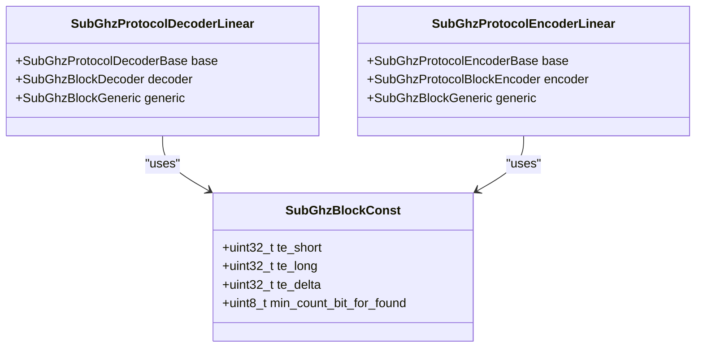
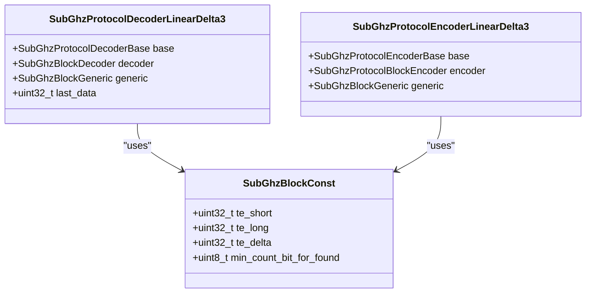
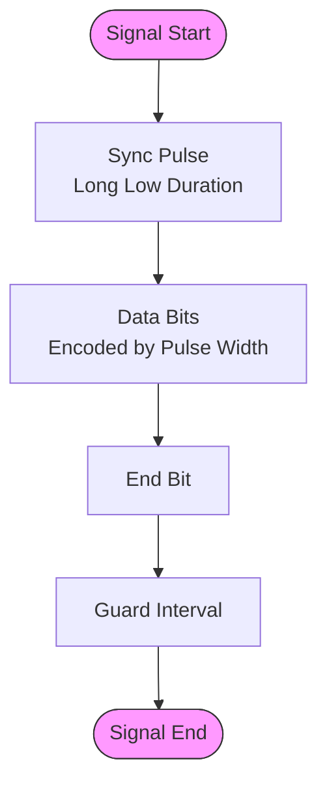
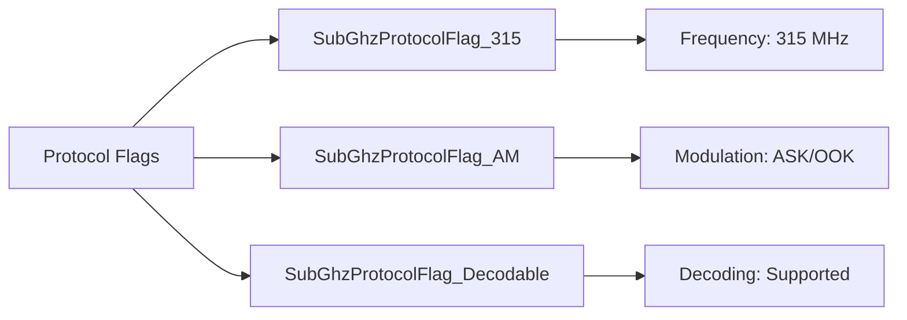
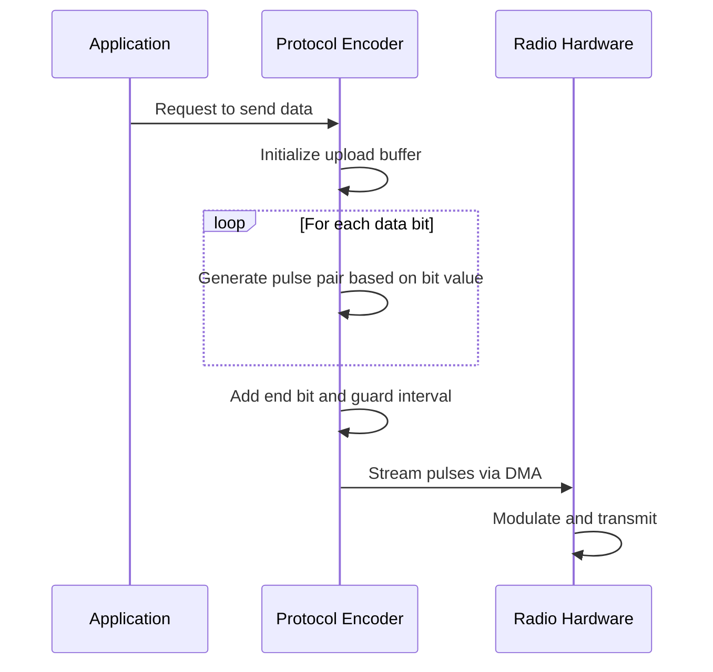
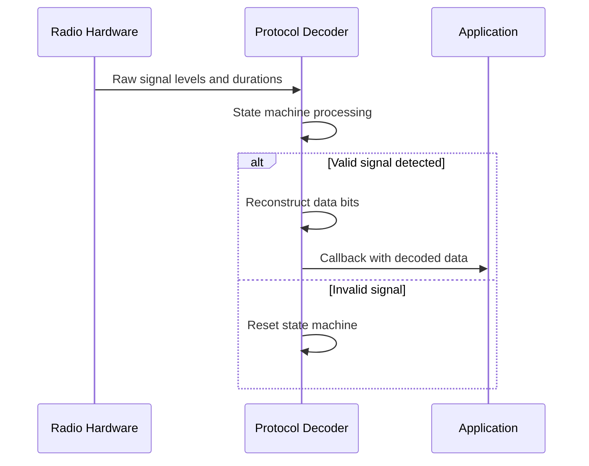
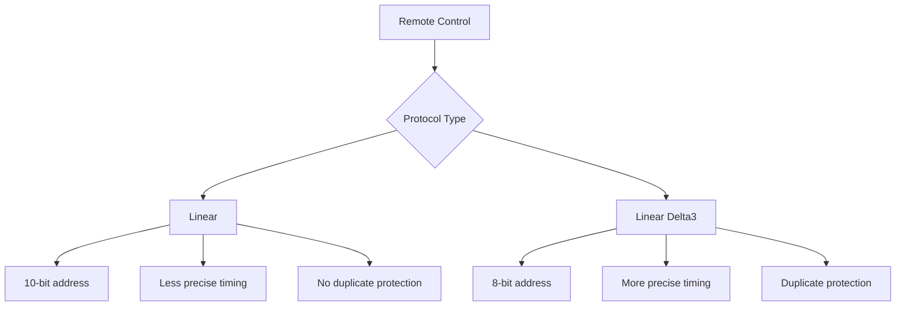

# Linear Protocols

<cite>
**Referenced Files in This Document**   
- [linear.h](file://lib/subghz/protocols/linear.h)
- [linear.c](file://lib/subghz/protocols/linear.c)
- [linear_delta3.h](file://lib/subghz/protocols/linear_delta3.h)
- [linear_delta3.c](file://lib/subghz/protocols/linear_delta3.c)
- [types.h](file://lib/subghz/types.h)
</cite>

## Table of Contents
1. [Introduction](#introduction)
2. [Linear Protocol Implementation](#linear-protocol-implementation)
3. [Linear Delta3 Protocol Implementation](#linear-delta3-protocol-implementation)
4. [Data Frame Structure](#data-frame-structure)
5. [Modulation Scheme](#modulation-scheme)
6. [Signal Encoding and Decoding](#signal-encoding-and-decoding)
7. [Practical Usage with Flipper Zero](#practical-usage-with-flipper-zero)
8. [Comparison of Linear and Linear Delta3](#comparison-of-linear-and-linear-delta3)
9. [Conclusion](#conclusion)

## Introduction
The Linear and Linear Delta3 protocols are used in various wireless devices, particularly garage door openers and security systems. These protocols operate in the sub-GHz frequency range and utilize amplitude-shift keying (ASK) modulation. This document provides a comprehensive analysis of the implementation of these protocols in the Flipper Zero firmware, detailing the data frame structure, encoding and decoding mechanisms, and practical usage scenarios.

**Section sources**
- [linear.h](file://lib/subghz/protocols/linear.h#L1-L110)
- [linear_delta3.h](file://lib/subghz/protocols/linear_delta3.h#L1-L110)

## Linear Protocol Implementation

### Protocol Structure
The Linear protocol implementation in the Flipper Zero firmware is defined in `linear.h` and `linear.c`. The protocol is designed to handle static data transmission, typically used in remote control applications.

**Diagram sources**
- [linear.h](file://lib/subghz/protocols/linear.h#L1-L110)
- [linear.c](file://lib/subghz/protocols/linear.c#L1-L345)

**Section sources**
- [linear.h](file://lib/subghz/protocols/linear.h#L1-L110)
- [linear.c](file://lib/subghz/protocols/linear.c#L1-L345)

### Key Parameters
The Linear protocol uses the following timing parameters:
- **Short pulse duration (te_short)**: 500 microseconds
- **Long pulse duration (te_long)**: 1500 microseconds
- **Timing delta (te_delta)**: 350 microseconds
- **Minimum bits for detection**: 10 bits

These parameters are defined in the `subghz_protocol_linear_const` structure and are used for both encoding and decoding operations.

### Encoding Process
The encoding process converts binary data into a sequence of level and duration pairs suitable for transmission. The `subghz_protocol_encoder_linear_get_upload` function implements this process:

1. For each bit in the data:
   - If the bit is 1: transmit a short high pulse followed by a long low pulse
   - If the bit is 0: transmit a long high pulse followed by a short low pulse
2. After all data bits, transmit an end bit followed by a guard interval

The guard interval duration depends on the value of the last bit (44 times te_short for bit 1, 42 times te_short for bit 0).

**Section sources**
- [linear.c](file://lib/subghz/protocols/linear.c#L100-L145)

### Decoding Process
The decoding process analyzes incoming signal levels and durations to reconstruct the transmitted data. The state machine in `subghz_protocol_decoder_linear_feed` handles this process:

1. **Reset state**: Wait for a header pulse (low pulse of approximately 21,000 microseconds)
2. **Save duration state**: Capture the duration of the next high pulse
3. **Check duration state**: Compare the high pulse duration with te_short and te_long to determine the bit value

When 10 bits have been decoded, the data is considered valid and passed to the callback function.

**Section sources**
- [linear.c](file://lib/subghz/protocols/linear.c#L200-L344)

## Linear Delta3 Protocol Implementation

### Protocol Structure
The Linear Delta3 protocol implementation is defined in `linear_delta3.h` and `linear_delta3.c`. This variant uses different timing parameters and a slightly modified decoding algorithm compared to the standard Linear protocol.

**Diagram sources**
- [linear_delta3.h](file://lib/subghz/protocols/linear_delta3.h#L1-L110)
- [linear_delta3.c](file://lib/subghz/protocols/linear_delta3.c#L1-L352)

**Section sources**
- [linear_delta3.h](file://lib/subghz/protocols/linear_delta3.h#L1-L110)
- [linear_delta3.c](file://lib/subghz/protocols/linear_delta3.c#L1-L352)

### Key Parameters
The Linear Delta3 protocol uses the following timing parameters:
- **Short pulse duration (te_short)**: 500 microseconds
- **Long pulse duration (te_long)**: 2000 microseconds
- **Timing delta (te_delta)**: 150 microseconds
- **Minimum bits for detection**: 8 bits

These parameters are defined in the `subghz_protocol_linear_delta3_const` structure.

### Encoding Process
The encoding process for Linear Delta3 is similar to the standard Linear protocol but with different timing values:

1. For each bit in the data:
   - If the bit is 1: transmit a short high pulse followed by 7 times te_short low pulse
   - If the bit is 0: transmit a long high pulse followed by a long low pulse
2. After all data bits, transmit an end bit followed by a guard interval

The guard interval is 73 times te_short for bit 1 and 70 times te_short for bit 0.

**Section sources**
- [linear_delta3.c](file://lib/subghz/protocols/linear_delta3.c#L100-L152)

### Decoding Process
The decoding process for Linear Delta3 includes an additional validation step to prevent duplicate receptions:

1. **Reset state**: Wait for a header pulse (low pulse of approximately 35,000 microseconds)
2. **Save duration state**: Capture the duration of the next high pulse
3. **Check duration state**: Compare the high pulse duration with te_short and te_long to determine the bit value

When 8 bits have been decoded, the decoder checks if the data matches the previously received data. Only if it matches and is non-zero, the data is considered valid and passed to the callback function. This prevents the same signal from being processed multiple times.

**Section sources**
- [linear_delta3.c](file://lib/subghz/protocols/linear_delta3.c#L200-L351)

## Data Frame Structure

### Linear Protocol Frame
The data frame structure for the Linear protocol consists of:
- **Sync/Header**: Long low pulse (approximately 21,000 microseconds)
- **Data bits**: 10 bits encoded using Manchester-like encoding
- **End bit**: Final data bit followed by guard interval
- **Guard interval**: 22,000 microseconds (bit 1) or 21,000 microseconds (bit 0)

The data is transmitted most significant bit first.

### Linear Delta3 Protocol Frame
The data frame structure for the Linear Delta3 protocol consists of:
- **Sync/Header**: Long low pulse (approximately 35,000 microseconds)
- **Data bits**: 8 bits encoded with specific timing
- **End bit**: Final data bit followed by guard interval
- **Guard interval**: 36,500 microseconds (bit 1) or 35,000 microseconds (bit 0)

The data is also transmitted most significant bit first.

**Diagram sources**
- [linear.c](file://lib/subghz/protocols/linear.c#L1-L345)
- [linear_delta3.c](file://lib/subghz/protocols/linear_delta3.c#L1-L352)

**Section sources**
- [linear.c](file://lib/subghz/protocols/linear.c#L1-L345)
- [linear_delta3.c](file://lib/subghz/protocols/linear_delta3.c#L1-L352)

## Modulation Scheme

### ASK/OOK Modulation
Both Linear and Linear Delta3 protocols use Amplitude-Shift Keying (ASK), specifically On-Off Keying (OOK), as indicated by the `SubGhzProtocolFlag_AM` flag in their protocol definitions. This modulation scheme represents binary data by the presence or absence of a carrier wave.

The presence of the `SubGhzProtocolFlag_AM` flag (bit 5) in the protocol flags confirms the use of AM/ASK modulation. The protocols do not use frequency modulation (FM), as indicated by the absence of the `SubGhzProtocolFlag_FM` flag.

### Frequency Band
The protocols are designed to operate at 315 MHz, as indicated by the `SubGhzProtocolFlag_315` flag in their protocol definitions. This frequency is commonly used for garage door openers and security systems in North America.

**Diagram sources**
- [types.h](file://lib/subghz/types.h#L120-L140)
- [linear.c](file://lib/subghz/protocols/linear.c#L70-L80)
- [linear_delta3.c](file://lib/subghz/protocols/linear_delta3.c#L70-L80)

**Section sources**
- [types.h](file://lib/subghz/types.h#L120-L140)
- [linear.c](file://lib/subghz/protocols/linear.c#L70-L80)
- [linear_delta3.c](file://lib/subghz/protocols/linear_delta3.c#L70-L80)

## Signal Encoding and Decoding

### Encoding Workflow
The encoding workflow for both protocols follows a similar pattern:

**Diagram sources**
- [linear.c](file://lib/subghz/protocols/linear.c#L100-L145)
- [linear_delta3.c](file://lib/subghz/protocols/linear_delta3.c#L100-L152)

**Section sources**
- [linear.c](file://lib/subghz/protocols/linear.c#L100-L145)
- [linear_delta3.c](file://lib/subghz/protocols/linear_delta3.c#L100-L152)

### Decoding Workflow
The decoding workflow processes incoming signals in real-time:

**Diagram sources**
- [linear.c](file://lib/subghz/protocols/linear.c#L200-L344)
- [linear_delta3.c](file://lib/subghz/protocols/linear_delta3.c#L200-L351)

**Section sources**
- [linear.c](file://lib/subghz/protocols/linear.c#L200-L344)
- [linear_delta3.c](file://lib/subghz/protocols/linear_delta3.c#L200-L351)

## Practical Usage with Flipper Zero

### Capturing Linear Signals
To capture a Linear protocol signal using Flipper Zero:

1. Navigate to the Sub-GHz application
2. Select "Read" mode
3. Press the remote control button near the Flipper Zero
4. The device will automatically detect and decode the signal
5. Save the captured signal with a descriptive name

The captured signal includes the protocol name, frequency, data bits, and timing parameters.

### Analyzing Captured Signals
The Flipper Zero provides detailed information about captured signals:

- **Protocol**: Linear or Linear Delta3
- **Frequency**: 315 MHz
- **Pulse width**: Short and long pulse durations
- **Data**: Hexadecimal representation of the transmitted data
- **DIP switches**: Binary representation of the address bits

This information can be viewed in the signal details screen.

### Emulating Remote Controls
To emulate a captured Linear signal:

1. Load the saved signal file
2. Select "Emulate" mode
3. Press the OK button to transmit the signal
4. The Flipper Zero will repeat the transmission according to the protocol's repeat count

The emulation process uses the same encoding algorithm as the original remote, ensuring compatibility with the receiving device.

**Section sources**
- [linear.c](file://lib/subghz/protocols/linear.c#L1-L345)
- [linear_delta3.c](file://lib/subghz/protocols/linear_delta3.c#L1-L352)

## Comparison of Linear and Linear Delta3

### Feature Comparison
| Feature | Linear Protocol | Linear Delta3 Protocol |
|--------|----------------|-----------------------|
| **Data bits** | 10 | 8 |
| **te_short** | 500 μs | 500 μs |
| **te_long** | 1,500 μs | 2,000 μs |
| **te_delta** | 350 μs | 150 μs |
| **Sync pulse** | ~21,000 μs | ~35,000 μs |
| **Guard interval** | 21,000-22,000 μs | 35,000-36,500 μs |
| **Duplicate protection** | No | Yes (checks last_data) |
| **DIP switch representation** | 10 positions | 8 positions |

### Use Cases
The Linear protocol is typically used in older garage door opener systems, while Linear Delta3 appears in more recent implementations. The enhanced timing precision (smaller te_delta) in Linear Delta3 suggests improved noise immunity and more reliable reception.

The duplicate protection mechanism in Linear Delta3 prevents multiple executions of the same command, which is particularly useful for garage door operations where repeated opening/closing could be problematic.

**Diagram sources**
- [linear.c](file://lib/subghz/protocols/linear.c#L1-L345)
- [linear_delta3.c](file://lib/subghz/protocols/linear_delta3.c#L1-L352)

**Section sources**
- [linear.c](file://lib/subghz/protocols/linear.c#L1-L345)
- [linear_delta3.c](file://lib/subghz/protocols/linear_delta3.c#L1-L352)

## Conclusion
The Linear and Linear Delta3 protocols represent two variants of wireless communication used in garage door openers and security systems. Both protocols use ASK/OOK modulation at 315 MHz but differ in their timing parameters, data length, and error prevention mechanisms.

The Flipper Zero firmware provides complete support for both protocols, enabling users to capture, analyze, and emulate signals from compatible devices. The implementation follows a consistent pattern across both protocols, with shared infrastructure for encoding, decoding, and data handling.

Understanding these protocols allows security researchers and enthusiasts to interact with wireless devices safely and ethically, while also providing insights into the design principles of simple wireless communication systems.

**Section sources**
- [linear.h](file://lib/subghz/protocols/linear.h#L1-L110)
- [linear.c](file://lib/subghz/protocols/linear.c#L1-L345)
- [linear_delta3.h](file://lib/subghz/protocols/linear_delta3.h#L1-L110)
- [linear_delta3.c](file://lib/subghz/protocols/linear_delta3.c#L1-L352)