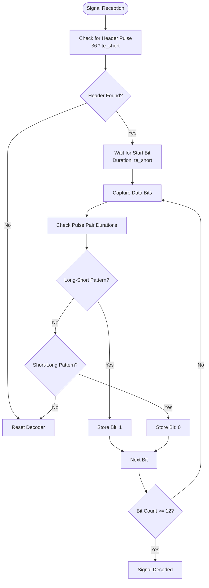
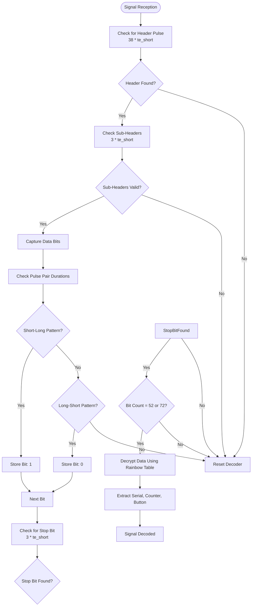
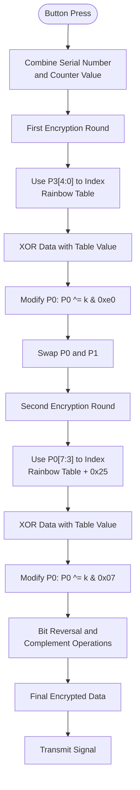
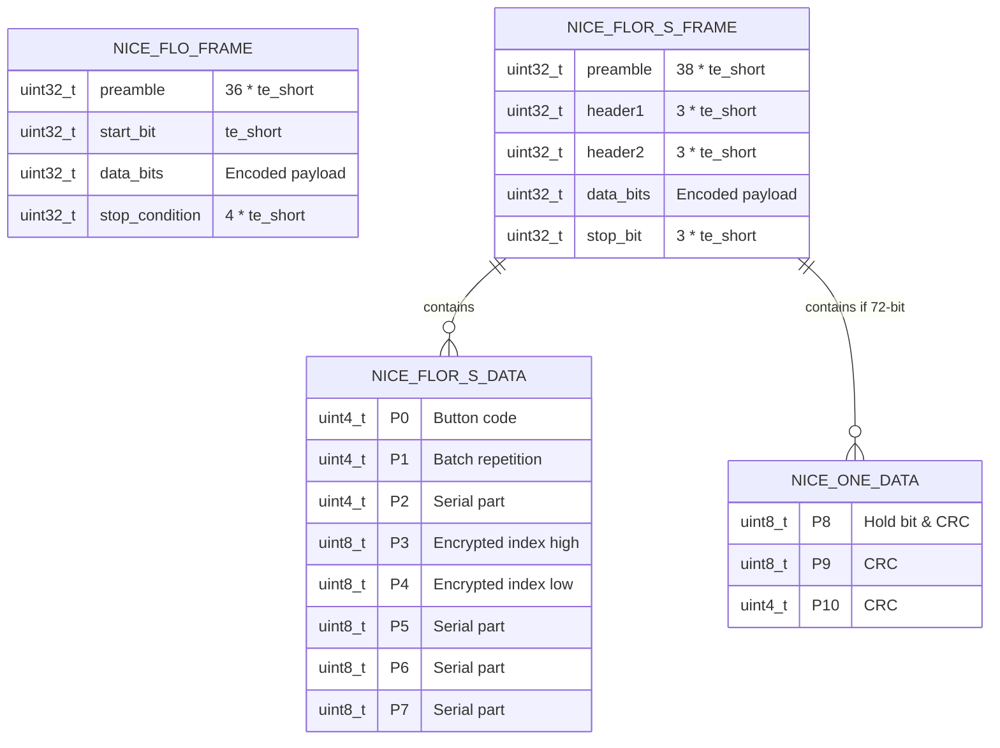
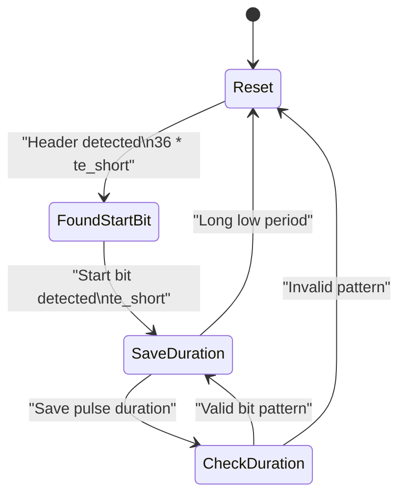
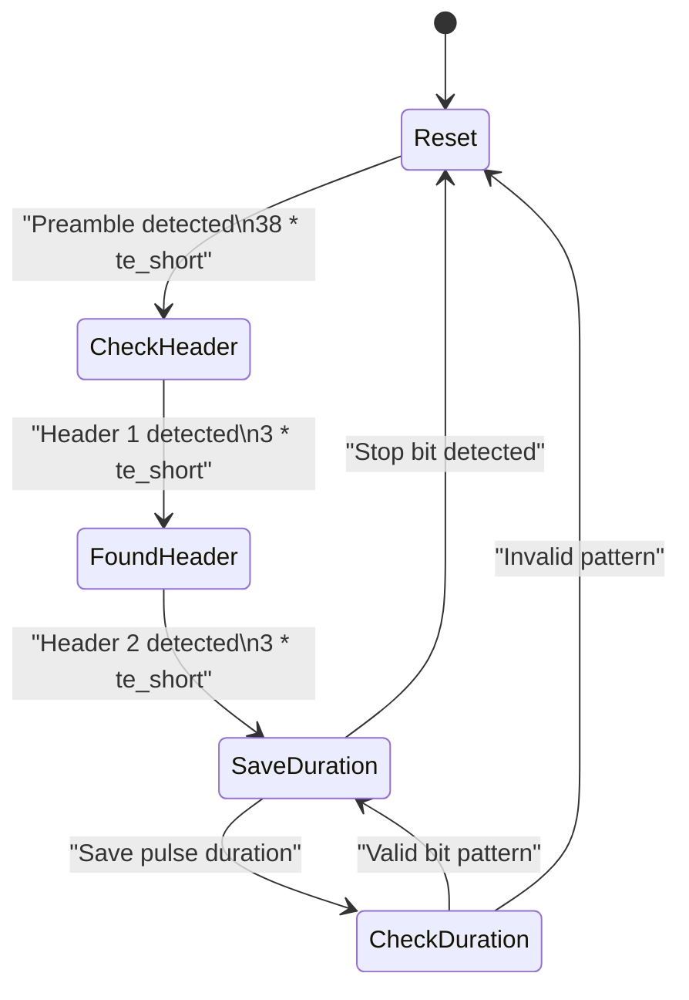
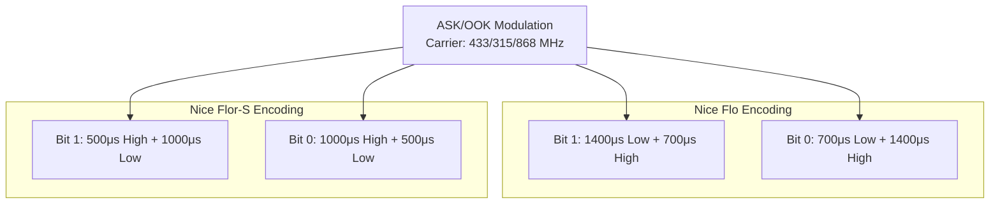
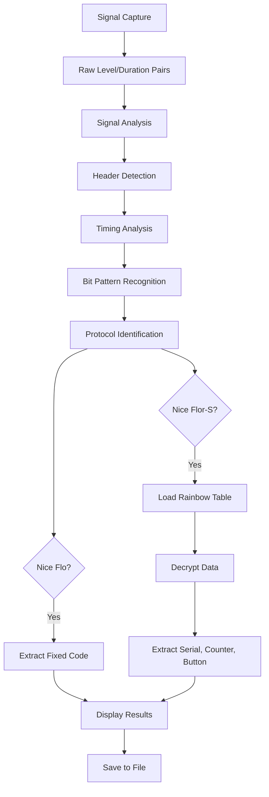
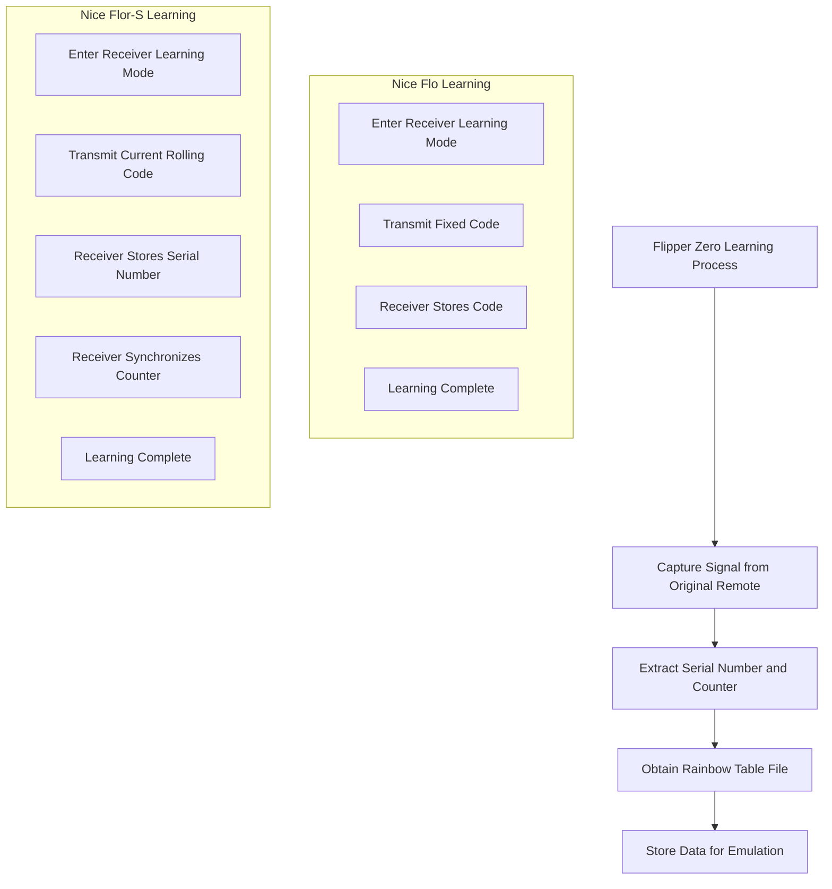
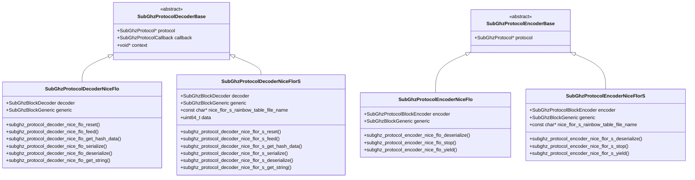

# Nice Protocols

<cite>
**Referenced Files in This Document**   
- [nice_flo.h](file://lib/subghz/protocols/nice_flo.h)
- [nice_flo.c](file://lib/subghz/protocols/nice_flo.c)
- [nice_flor_s.h](file://lib/subghz/protocols/nice_flor_s.h)
- [nice_flor_s.c](file://lib/subghz/protocols/nice_flor_s.c)
</cite>

## Table of Contents
1. [Introduction](#introduction)
2. [Nice Flo Protocol](#nice-flo-protocol)
3. [Nice Flor-S Protocol](#nice-flor-s-protocol)
4. [Rolling Code Algorithm](#rolling-code-algorithm)
5. [Data Frame Structure](#data-frame-structure)
6. [Synchronization Mechanism](#synchronization-mechanism)
7. [Modulation Scheme](#modulation-scheme)
8. [Signal Analysis Techniques](#signal-analysis-techniques)
9. [Learning Procedures](#learning-procedures)
10. [Flipper Zero Implementation](#flipper-zero-implementation)
11. [Practical Examples](#practical-examples)

## Introduction
The Nice protocols are widely used in garage door openers and gate systems for secure wireless communication. These protocols include Nice Flo and Nice Flor-S, which implement different security mechanisms for remote control systems. This document provides a comprehensive analysis of both protocols, focusing on their implementation within the Flipper Zero firmware. The analysis covers the rolling code algorithm, data frame structure, synchronization mechanism, and modulation scheme (ASK/OOK). The documentation also includes practical examples of how to use the Flipper Zero to capture, analyze, and emulate Nice protocol signals.

**Section sources**
- [nice_flo.h](file://lib/subghz/protocols/nice_flo.h#L1-L110)
- [nice_flor_s.h](file://lib/subghz/protocols/nice_flor_s.h#L1-L112)

## Nice Flo Protocol

The Nice Flo protocol is a static protocol implementation used in various garage door and gate systems. It operates at frequencies of 433 MHz and 315 MHz using amplitude modulation (AM). The protocol uses a fixed timing structure for encoding data, with specific short and long pulse durations that define the bit encoding scheme.

The protocol implementation in the Flipper Zero firmware defines key timing parameters:
- **te_short**: 700 microseconds
- **te_long**: 1400 microseconds
- **te_delta**: 200 microseconds (timing tolerance)

The data frame begins with a header pulse that is 36 times the short pulse duration, followed by a start bit and the encoded data bits. Each bit is encoded using a pair of pulses, where a logical '1' is represented by a long pulse followed by a short pulse, and a logical '0' is represented by a short pulse followed by a long pulse.

The protocol supports data frames with a bit count between 12 and 24 bits, as defined by the `min_count_bit_for_found` constant. The implementation includes functions for both encoding and decoding signals, allowing the Flipper Zero to capture, store, and replay Nice Flo signals.

**Diagram sources**
- [nice_flo.c](file://lib/subghz/protocols/nice_flo.c#L13-L337)
- [nice_flo.h](file://lib/subghz/protocols/nice_flo.h#L1-L110)

**Section sources**
- [nice_flo.c](file://lib/subghz/protocols/nice_flo.c#L13-L337)
- [nice_flo.h](file://lib/subghz/protocols/nice_flo.h#L1-L110)

## Nice Flor-S Protocol

The Nice Flor-S protocol is a dynamic protocol that implements a rolling code system for enhanced security in garage door and gate systems. Unlike the static Nice Flo protocol, Nice Flor-S uses cryptographic techniques to prevent replay attacks. The protocol operates at frequencies of 433 MHz and 868 MHz using amplitude modulation (AM).

The key features of the Nice Flor-S protocol include:
- **Dynamic rolling codes**: Each transmission uses a different code
- **Rainbow table-based encryption**: Uses a lookup table for code generation
- **Button mapping**: Supports multiple buttons with different functions
- **Counter-based synchronization**: Uses a rolling counter to maintain sync

The protocol implementation defines different timing parameters compared to Nice Flo:
- **te_short**: 500 microseconds
- **te_long**: 1000 microseconds
- **te_delta**: 300 microseconds (timing tolerance)

The protocol supports two data frame lengths:
- **Standard Nice Flor-S**: 52 bits
- **Nice One variant**: 72 bits (extended format)

The encryption mechanism uses a rainbow table file to perform cryptographic operations on the serial number and counter values. The `subghz_protocol_nice_flor_s_encrypt` function implements a multi-round encryption algorithm that XORs data with values from the rainbow table based on the current byte values.

**Diagram sources**
- [nice_flor_s.c](file://lib/subghz/protocols/nice_flor_s.c#L13-L896)
- [nice_flor_s.h](file://lib/subghz/protocols/nice_flor_s.h#L1-L112)

**Section sources**
- [nice_flor_s.c](file://lib/subghz/protocols/nice_flor_s.c#L13-L896)
- [nice_flor_s.h](file://lib/subghz/protocols/nice_flor_s.h#L1-L112)

## Rolling Code Algorithm

The rolling code algorithm is a security mechanism used in the Nice Flor-S protocol to prevent replay attacks. Each time a remote control button is pressed, a new unique code is generated, making previously captured signals useless for unauthorized access.

The rolling code implementation in Nice Flor-S uses a combination of a serial number and a counter value. The counter increments with each button press, and this value is encrypted along with the serial number to generate the transmission data.

The encryption process involves:
1. Combining the 28-bit serial number and 16-bit counter into a 44-bit value
2. Using a rainbow table for cryptographic operations
3. Applying multiple rounds of XOR operations with table-derived values
4. Reversing and complementing bits as part of the encryption process

The `subghz_protocol_nice_flor_s_encrypt` function implements a two-round encryption algorithm:
- First round: Uses the lower 5 bits of the first byte to index the rainbow table
- Second round: Uses the upper 3 bits of the first byte (after modification) to index the table
- After each round, the first two bytes are swapped for additional complexity

The counter synchronization mechanism allows the receiver to accept codes within a window of expected values, accommodating cases where the remote is pressed when out of range. The Flipper Zero implementation uses `furi_hal_subghz_get_rolling_counter_mult()` to determine the increment value for the counter.

**Diagram sources**
- [nice_flor_s.c](file://lib/subghz/protocols/nice_flor_s.c#L400-L450)
- [nice_flor_s.h](file://lib/subghz/protocols/nice_flor_s.h#L1-L112)

**Section sources**
- [nice_flor_s.c](file://lib/subghz/protocols/nice_flor_s.c#L400-L450)
- [nice_flor_s.h](file://lib/subghz/protocols/nice_flor_s.h#L1-L112)

## Data Frame Structure

The data frame structure differs between the Nice Flo and Nice Flor-S protocols, reflecting their different security approaches.

### Nice Flo Data Frame
The Nice Flo protocol uses a simple Manchester-like encoding scheme with the following structure:
- **Preamble**: 36 × te_short (low)
- **Start bit**: te_short (high)
- **Data bits**: Encoded as pulse pairs
  - Bit '1': te_long (low) + te_short (high)
  - Bit '0': te_short (low) + te_long (high)
- **Stop condition**: Long low period (4 × te_short)

The data payload contains a fixed code that identifies the remote, with no rolling code mechanism. The bit count ranges from 12 to 24 bits.

### Nice Flor-S Data Frame
The Nice Flor-S protocol uses a more complex structure with the following format:
- **Preamble**: 38 × te_short (low)
- **Header 1**: 3 × te_short (high)
- **Header 2**: 3 × te_short (low)
- **Data bits**: Encoded as pulse pairs
  - Bit '1': te_short (high) + te_long (low)
  - Bit '0': te_long (high) + te_short (low)
- **Stop bit**: 3 × te_short (high)

The data payload structure for Nice Flor-S:
- **P0 (4 bits)**: Button code (1: 0x1, 2: 0x2, 3: 0x4, 4: 0x8)
- **P1 (4 bits)**: Batch repetition number (P1 = 0xF ^ P0 ^ n)
- **P2 (4 bits)**: Part of serial number (P2 = (K ^ S3) & 0xF)
- **P3 (8 bits)**: Major part of encrypted index
- **P4 (8 bits)**: Low-order part of encrypted index
- **P5 (8 bits)**: Part of serial number (P5 = K ^ S2)
- **P6 (8 bits)**: Part of serial number (P6 = K ^ S1)
- **P7 (8 bits)**: Part of serial number (P7 = K ^ S0)
- **K (8 bits)**: Derived from P3 and P4 using rainbow table

For the Nice One variant (72-bit), additional fields include:
- **P7**: Batch number dependent value
- **P8**: Button hold bit and CRC high bits
- **P9-P10**: CRC information

**Diagram sources**
- [nice_flo.c](file://lib/subghz/protocols/nice_flo.c#L13-L337)
- [nice_flor_s.c](file://lib/subghz/protocols/nice_flor_s.c#L13-L896)

**Section sources**
- [nice_flo.c](file://lib/subghz/protocols/nice_flo.c#L13-L337)
- [nice_flor_s.c](file://lib/subghz/protocols/nice_flor_s.c#L13-L896)

## Synchronization Mechanism

The synchronization mechanism differs significantly between the Nice Flo and Nice Flor-S protocols due to their different security models.

### Nice Flo Synchronization
The Nice Flo protocol uses a simple synchronization mechanism based on timing patterns:
- **Header detection**: Looks for a low pulse of 36 × te_short duration
- **Start bit detection**: After the header, looks for a high pulse of te_short duration
- **Bit synchronization**: Uses the Manchester-like encoding to maintain bit timing
- **Stop condition**: A long low period (4 × te_short) indicates the end of transmission

The decoder state machine has four states:
1. **Reset**: Initial state, waiting for header
2. **FoundStartBit**: Header detected, waiting for start bit
3. **SaveDuration**: Start bit found, saving pulse durations
4. **CheckDuration**: Analyzing pulse pairs to determine bit values

### Nice Flor-S Synchronization
The Nice Flor-S protocol uses a more complex synchronization mechanism to handle rolling codes:
- **Multi-stage header detection**: Requires three specific pulse sequences
- **Counter-based synchronization**: Maintains a rolling counter that increments with each transmission
- **Rainbow table synchronization**: Requires the correct rainbow table file for encryption/decryption
- **Button mapping synchronization**: Tracks button presses for custom button functionality

The decoder state machine has five states:
1. **Reset**: Initial state, waiting for preamble
2. **CheckHeader**: Preamble detected, checking first header
3. **FoundHeader**: First header valid, checking second header
4. **SaveDuration**: Headers valid, saving pulse durations
5. **CheckDuration**: Analyzing pulse pairs to determine bit values

The synchronization mechanism also includes counter management:
- The counter increments by `furi_hal_subghz_get_rolling_counter_mult()`
- If the counter exceeds 0xFFFF, it resets to 0
- This allows the receiver to accept codes within a reasonable window of expected values

**Diagram sources**
- [nice_flo.c](file://lib/subghz/protocols/nice_flo.c#L13-L337)
- [nice_flor_s.c](file://lib/subghz/protocols/nice_flor_s.c#L13-L896)

**Section sources**
- [nice_flo.c](file://lib/subghz/protocols/nice_flo.c#L13-L337)
- [nice_flor_s.c](file://lib/subghz/protocols/nice_flor_s.c#L13-L896)

## Modulation Scheme

Both Nice Flo and Nice Flor-S protocols use Amplitude Shift Keying (ASK) or On-Off Keying (OOK) modulation schemes, which are common in sub-GHz remote control systems.

### ASK/OOK Modulation
ASK/OOK is a simple modulation scheme where:
- **High signal level**: Transmitter is on (carrier wave present)
- **Low signal level**: Transmitter is off (no carrier wave)

This binary modulation scheme is energy-efficient and reliable for short-range wireless communication. The Flipper Zero's sub-GHz module implements ASK/OOK modulation through its CC1101 radio chip.

### Timing Parameters
The timing parameters differ between the two protocols:

**Nice Flo:**
- **te_short**: 700 μs
- **te_long**: 1400 μs
- **te_delta**: 200 μs (acceptable timing variation)

**Nice Flor-S:**
- **te_short**: 500 μs
- **te_long**: 1000 μs
- **te_delta**: 300 μs (acceptable timing variation)

The longer timing tolerance in Nice Flor-S (300 μs vs 200 μs) may accommodate variations in low-power remote controls.

### Signal Encoding
Both protocols use a form of Manchester coding, but with different implementations:

**Nice Flo encoding:**
- Bit '1': Long low + Short high
- Bit '0': Short low + Long high

**Nice Flor-S encoding:**
- Bit '1': Short high + Long low
- Bit '0': Long high + Short low

This difference in encoding polarity may help prevent cross-protocol interference.

**Diagram sources**
- [nice_flo.c](file://lib/subghz/protocols/nice_flo.c#L13-L337)
- [nice_flor_s.c](file://lib/subghz/protocols/nice_flor_s.c#L13-L896)

**Section sources**
- [nice_flo.c](file://lib/subghz/protocols/nice_flo.c#L13-L337)
- [nice_flor_s.c](file://lib/subghz/protocols/nice_flor_s.c#L13-L896)

## Signal Analysis Techniques

Signal analysis for Nice protocols involves capturing, decoding, and understanding the wireless signals used by garage door and gate systems. The Flipper Zero provides several tools for this analysis.

### Capture Process
The signal capture process involves:
1. Setting the sub-GHz module to the correct frequency (433/315/868 MHz)
2. Configuring the modulation to AM/ASK
3. Using the receiver to capture raw signal data
4. Analyzing the pulse durations and patterns

The Flipper Zero's sub-GHz application can capture signals and display them as a sequence of level and duration pairs, which can be analyzed to identify the protocol.

### Decoding Process
The decoding process for Nice protocols involves:
1. **Header detection**: Identifying the long preamble pulse
2. **Bit synchronization**: Aligning with the bit timing
3. **Data extraction**: Converting pulse pairs to binary data
4. **Protocol identification**: Determining if it's Nice Flo or Nice Flor-S
5. **Data interpretation**: Extracting meaningful information from the payload

For Nice Flor-S, additional steps include:
- **Rainbow table loading**: Required for decryption
- **Counter extraction**: From the decrypted data
- **Serial number extraction**: From the decrypted data
- **Button identification**: From the P0 field

### Analysis Tools
The Flipper Zero firmware provides several functions for signal analysis:
- `subghz_protocol_decoder_nice_flo_feed()`: Processes incoming signal data
- `subghz_protocol_decoder_nice_flor_s_feed()`: Processes Nice Flor-S signals
- `subghz_protocol_decoder_nice_flo_get_string()`: Generates human-readable output
- `subghz_protocol_decoder_nice_flor_s_get_string()`: Generates detailed output for Nice Flor-S

**Diagram sources**
- [nice_flo.c](file://lib/subghz/protocols/nice_flo.c#L13-L337)
- [nice_flor_s.c](file://lib/subghz/protocols/nice_flor_s.c#L13-L896)

**Section sources**
- [nice_flo.c](file://lib/subghz/protocols/nice_flo.c#L13-L337)
- [nice_flor_s.c](file://lib/subghz/protocols/nice_flor_s.c#L13-L896)

## Learning Procedures

The learning procedures for Nice protocol remotes differ between the static Nice Flo and dynamic Nice Flor-S protocols.

### Nice Flo Learning
The learning procedure for Nice Flo remotes is straightforward:
1. Put the receiver (garage door opener) into learning mode
2. Press the remote button to transmit the fixed code
3. The receiver stores the fixed code for future recognition

Since Nice Flo uses a static code, the same signal is transmitted each time, making it vulnerable to replay attacks but simple to implement.

### Nice Flor-S Learning
The learning procedure for Nice Flor-S remotes is more complex due to the rolling code system:
1. Put the receiver into learning mode
2. Press the remote button to transmit the current rolling code
3. The receiver stores the serial number and synchronizes its counter
4. The receiver accepts subsequent codes within a window of expected counter values

The Flipper Zero can learn Nice Flor-S remotes by:
1. Capturing the signal from the original remote
2. Extracting the serial number and current counter value
3. Storing the rainbow table file (if available)
4. Using this information to generate valid rolling codes

The `subghz_protocol_nice_flor_s_remote_controller` function analyzes the received data to extract the serial number, counter, and button information, which are essential for successful emulation.

**Diagram sources**
- [nice_flo.c](file://lib/subghz/protocols/nice_flo.c#L13-L337)
- [nice_flor_s.c](file://lib/subghz/protocols/nice_flor_s.c#L13-L896)

**Section sources**
- [nice_flo.c](file://lib/subghz/protocols/nice_flo.c#L13-L337)
- [nice_flor_s.c](file://lib/subghz/protocols/nice_flor_s.c#L13-L896)

## Flipper Zero Implementation

The Flipper Zero implements both Nice Flo and Nice Flor-S protocols through dedicated modules in the sub-GHz protocol library. The implementation follows a consistent pattern for protocol handling, with separate encoder and decoder structures for each protocol.

### Protocol Registration
Both protocols are registered in the sub-GHz protocol registry:
- **Nice Flo**: Registered as a static protocol
- **Nice Flor-S**: Registered as a dynamic protocol

The protocol structures define key properties:
- Name
- Type (static/dynamic)
- Supported frequencies
- Flags (decodable, saveable, sendable)
- Decoder and encoder references

### Encoder Implementation
The encoder implementation handles signal generation:
- **Nice Flo**: Generates signals with fixed timing parameters
- **Nice Flor-S**: Generates signals with rolling code encryption

The encoding process involves:
1. Allocating memory for the signal data
2. Converting the protocol data to level/duration pairs
3. Storing the data in a buffer for DMA transmission
4. Managing the transmission repeat count

### Decoder Implementation
The decoder implementation handles signal reception:
- **State machine**: Manages the decoding process
- **Timing analysis**: Measures pulse durations
- **Data extraction**: Converts pulses to binary data
- **Protocol identification**: Determines the protocol type

The `subghz_protocol_decoder_nice_flo_feed()` and `subghz_protocol_decoder_nice_flor_s_feed()` functions process incoming signal data and update the decoder state accordingly.

**Diagram sources**
- [nice_flo.c](file://lib/subghz/protocols/nice_flo.c#L13-L337)
- [nice_flor_s.c](file://lib/subghz/protocols/nice_flor_s.c#L13-L896)
- [nice_flo.h](file://lib/subghz/protocols/nice_flo.h#L1-L110)
- [nice_flor_s.h](file://lib/subghz/protocols/nice_flor_s.h#L1-L112)

**Section sources**
- [nice_flo.c](file://lib/subghz/protocols/nice_flo.c#L13-L337)
- [nice_flor_s.c](file://lib/subghz/protocols/nice_flor_s.c#L13-L896)

## Practical Examples

### Capturing a Nice Flo Signal
To capture a Nice Flo signal using the Flipper Zero:
1. Navigate to the Sub-GHz application
2. Select "Receive" mode
3. Press the remote control button
4. The Flipper Zero will detect and decode the signal
5. Save the captured signal with a descriptive name

The captured signal will display information such as:
- Protocol: Nice FLO
- Bit count: 12-24 bits
- Key: Hexadecimal representation of the fixed code

### Capturing a Nice Flor-S Signal
To capture a Nice Flor-S signal:
1. Ensure the rainbow table file is available on the SD card
2. Navigate to the Sub-GHz application
3. Select "Receive" mode
4. Press the remote control button
5. The Flipper Zero will detect, decode, and decrypt the signal
6. Save the captured signal

The captured signal will display additional information:
- Protocol: Nice FloR-S
- Serial number (Sn)
- Counter value (Cnt)
- Button code (Btn)
- Full encrypted key

### Emulating a Nice Protocol Signal
To emulate a captured Nice protocol signal:
1. Navigate to the Sub-GHz application
2. Select "Send" mode
3. Choose the saved signal file
4. Press "Transmit" to send the signal

For Nice Flor-S signals with rolling codes, the Flipper Zero will automatically increment the counter for subsequent transmissions, maintaining synchronization with the receiver.

### Button Mapping
The Flipper Zero supports custom button mapping for Nice Flor-S remotes:
- **UP button**: Maps to button 2 (code 0x2)
- **DOWN button**: Maps to button 4 (code 0x4)
- **LEFT button**: Maps to button 8 (code 0x8)
- **RIGHT button**: Maps to button 3 (code 0x3)
- **OK button**: Restores the original button code

This allows a single captured remote to control multiple functions on a multi-button system.

**Section sources**
- [nice_flo.c](file://lib/subghz/protocols/nice_flo.c#L13-L337)
- [nice_flor_s.c](file://lib/subghz/protocols/nice_flor_s.c#L13-L896)