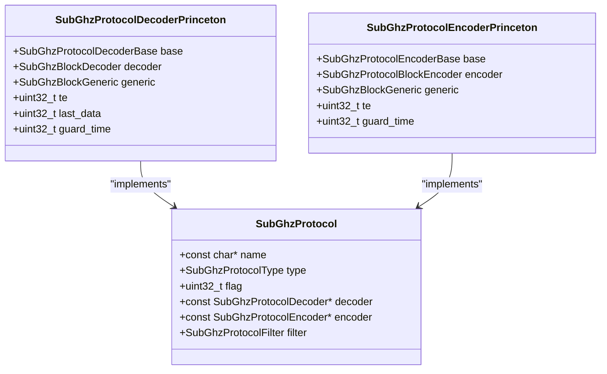
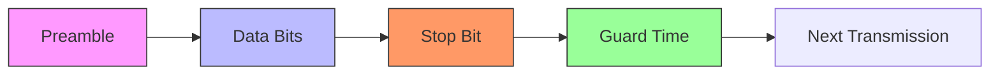
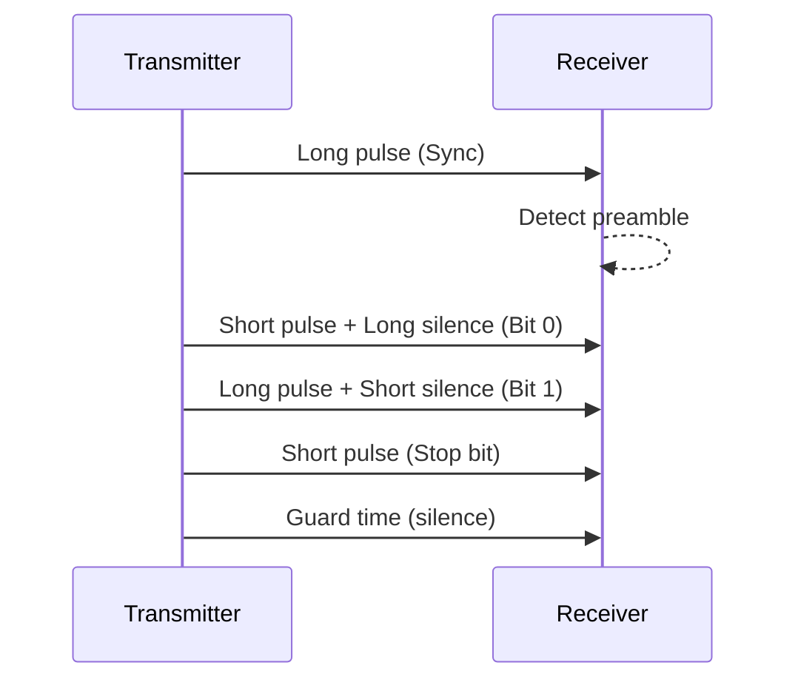
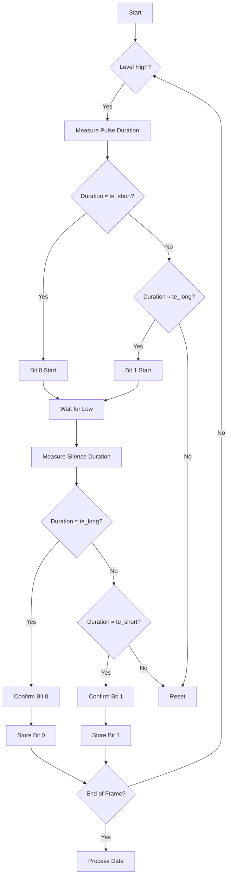

# Princeton Protocol

<cite>
**Referenced Files in This Document**   
- [princeton.c](file://lib/subghz/protocols/princeton.c#L0-L634)
- [princeton.h](file://lib/subghz/protocols/princeton.h#L0-L118)
</cite>

## Table of Contents
1. [Introduction](#introduction)
2. [Protocol Overview](#protocol-overview)
3. [Data Frame Structure](#data-frame-structure)
4. [Modulation Scheme](#modulation-scheme)
5. [Encoder Implementation](#encoder-implementation)
6. [Decoder Implementation](#decoder-implementation)
7. [PWM Timing Parameters](#pwm-timing-parameters)
8. [Practical Usage with Flipper Zero](#practical-usage-with-flipper-zero)
9. [Common Issues and Troubleshooting](#common-issues-and-troubleshooting)
10. [Applications](#applications)

## Introduction

The Princeton protocol is a widely used RF communication protocol in access control systems, particularly for garage door openers and security systems. This document provides a comprehensive analysis of its implementation within the Flipper Zero firmware, covering the encoder and decoder logic, data frame structure, timing parameters, and practical usage scenarios. The implementation is located in the `lib/subghz/protocols/` directory of the firmware repository and is designed to work with the sub-GHz radio hardware of the Flipper Zero device.

**Section sources**
- [princeton.c](file://lib/subghz/protocols/princeton.c#L0-L634)
- [princeton.h](file://lib/subghz/protocols/princeton.h#L0-L118)

## Protocol Overview

The Princeton protocol is a unidirectional RF communication protocol that uses amplitude shift keying (ASK) or on-off keying (OOK) modulation. It operates at common ISM frequencies such as 315 MHz, 433.92 MHz, and 868 MHz. The protocol is characterized by its simple Manchester-like encoding scheme and fixed packet structure, making it suitable for low-cost remote control applications.

The protocol implementation in the Flipper Zero firmware supports both transmission and reception of Princeton-encoded signals, allowing users to capture, analyze, and emulate signals from compatible devices. The implementation is structured as a state machine with dedicated encoder and decoder components that handle the signal generation and parsing logic.



**Diagram sources**
- [princeton.c](file://lib/subghz/protocols/princeton.c#L25-L45)
- [princeton.h](file://lib/subghz/protocols/princeton.h#L15-L25)

## Data Frame Structure

The Princeton protocol data frame consists of several components that are transmitted sequentially. The frame structure is designed to ensure reliable transmission and reception of control commands.

### Frame Components

The data frame includes the following elements:

- **Preamble**: A long synchronization pulse that indicates the start of transmission
- **Data Bits**: The actual payload containing address and command information
- **Stop Bit**: A final pulse that marks the end of the data transmission
- **Guard Time**: A silent period that separates consecutive transmissions

The protocol supports variable data lengths, with a minimum of 24 bits required for successful detection. The data is typically divided into two parts:
- **Serial/Address**: A unique identifier for the receiving device
- **Button/Command**: The specific command being transmitted (e.g., open, close, lock, unlock)

The implementation in the Flipper Zero firmware handles two different encoding types:
1. **4-bit button code**: Where the button code occupies 4 bits and the serial number is shifted accordingly
2. **8-bit button code**: Where the button code occupies 8 bits and has fixed values (0x30, 0xC0, 0xF3, 0xFC)



**Diagram sources**
- [princeton.c](file://lib/subghz/protocols/princeton.c#L500-L550)

## Modulation Scheme

The Princeton protocol uses Amplitude Shift Keying (ASK) or On-Off Keying (OOK) modulation, which is a simple and power-efficient modulation scheme well-suited for low-cost RF applications.

### Encoding Logic

The modulation scheme employs a form of Manchester encoding where each bit is represented by a specific pulse pattern:

- **Bit 0**: A short pulse followed by a long silence
- **Bit 1**: A long pulse followed by a short silence

The timing is based on a unit time (TE) parameter that is dynamically determined during signal reception. The implementation defines two time constants:
- **te_short**: 390 microseconds (short pulse duration)
- **te_long**: 1170 microseconds (long pulse duration)

The actual timing values may vary between devices, so the decoder includes a tolerance threshold (te_delta = 300 microseconds) to accommodate timing variations.



**Diagram sources**
- [princeton.c](file://lib/subghz/protocols/princeton.c#L250-L300)

## Encoder Implementation

The encoder component is responsible for generating the RF signal that represents the Princeton protocol data frame. It converts the digital data into a sequence of level and duration pairs that can be transmitted by the sub-GHz radio hardware.

### Key Functions

The encoder implementation includes the following key functions:

- **subghz_protocol_encoder_princeton_alloc()**: Allocates memory for the encoder instance
- **subghz_protocol_encoder_princeton_free()**: Frees memory used by the encoder
- **subghz_protocol_encoder_princeton_deserialize()**: Parses configuration data from a file format
- **subghz_protocol_encoder_princeton_yield()**: Generates the next level/duration pair for transmission

### Data Reconstruction

Before transmission, the encoder reconstructs the complete data word by combining the serial number and button code:

```c
// Reconstruction of the data
if(instance->generic.btn == 0x30 || instance->generic.btn == 0xC0) {
    instance->generic.data = ((uint64_t)instance->generic.serial << 8 | (uint64_t)instance->generic.btn);
} else if(instance->generic.btn == 0xF3 || instance->generic.btn == 0xFC) {
    instance->generic.data = ((uint64_t)instance->generic.serial << 8 | (uint64_t)(instance->generic.btn & 0xF));
} else {
    instance->generic.data = ((uint64_t)instance->generic.serial << 4 | (uint64_t)instance->generic.btn);
}
```

The encoder then generates the pulse sequence by iterating through each bit of the data word and creating the appropriate pulse pattern based on whether the bit is 0 or 1.

**Section sources**
- [princeton.c](file://lib/subghz/protocols/princeton.c#L200-L350)

## Decoder Implementation

The decoder component analyzes incoming RF signals to extract the data encoded in the Princeton protocol format. It processes the raw pulse train and reconstructs the original data.

### State Machine

The decoder operates as a state machine with three main states:

- **PrincetonDecoderStepReset**: Initial state, waiting for preamble detection
- **PrincetonDecoderStepSaveDuration**: Saving the duration of the current pulse
- **PrincetonDecoderStepCheckDuration**: Analyzing the pulse/silence pair to determine the bit value

### Preamble Detection

The decoder first looks for the preamble, which is a long synchronization pulse:

```c
if((!level) && (DURATION_DIFF(duration, subghz_protocol_princeton_const.te_short * 36) <
                subghz_protocol_princeton_const.te_delta * 36)) {
    // Found Preambula
    instance->decoder.parser_step = PrincetonDecoderStepSaveDuration;
    instance->decoder.decode_data = 0;
    instance->decoder.decode_count_bit = 0;
    instance->te = 0;
    instance->guard_time = PRINCETON_GUARD_TIME_DEFALUT;
}
```

Once the preamble is detected, the decoder enters the data parsing phase, where it analyzes each pulse/silence pair to determine the bit value.

### Bit Detection

The decoder uses timing comparisons to distinguish between 0 and 1 bits:

- **Bit 0**: Short pulse + Long silence
- **Bit 1**: Long pulse + Short silence

The implementation includes tolerance for timing variations to ensure reliable decoding across different devices.

**Section sources**
- [princeton.c](file://lib/subghz/protocols/princeton.c#L400-L500)

## PWM Timing Parameters

The Princeton protocol relies on precise timing parameters to ensure reliable communication between transmitter and receiver. The implementation in the Flipper Zero firmware defines several key timing constants.

### Timing Constants

The following timing constants are defined in the implementation:

- **te_short**: 390 microseconds - Duration of a short pulse
- **te_long**: 1170 microseconds - Duration of a long pulse
- **te_delta**: 300 microseconds - Tolerance for timing variations
- **PRINCETON_GUARD_TIME_DEFALUT**: 30 - Default guard time multiplier

### Dynamic Timing Adjustment

The decoder dynamically adjusts the timing parameters based on the received signal:

```c
instance->te /= (instance->decoder.decode_count_bit * 4 + 1);
```

This allows the decoder to adapt to slight timing variations between different transmitter devices. The guard time is also calculated dynamically based on the received signal duration:

```c
instance->guard_time = roundf((float)duration / instance->te);
```

The guard time value is constrained to be between 15 and 72; if it falls outside this range, the default value of 30 is used.



**Diagram sources**
- [princeton.c](file://lib/subghz/protocols/princeton.c#L450-L500)

## Practical Usage with Flipper Zero

The Flipper Zero provides a user-friendly interface for working with Princeton protocol devices, allowing users to capture, analyze, and emulate signals.

### Signal Capture

To capture a Princeton protocol signal:

1. Navigate to the Sub-GHz application on the Flipper Zero
2. Select "Sniff Unknown" to begin monitoring for RF signals
3. Press the button on the remote control you wish to capture
4. The Flipper Zero will automatically detect and decode the signal if it matches the Princeton protocol

### Signal Analysis

Once a signal is captured, the Flipper Zero provides detailed information about the signal:

- **Protocol**: Identifies the signal as "Princeton"
- **Frequency**: Shows the operating frequency (e.g., 433.92 MHz)
- **Data**: Displays the raw data in hexadecimal format
- **Serial**: Extracts the serial/address portion
- **Button**: Extracts the command/button portion

### Signal Emulation

To emulate a captured Princeton protocol signal:

1. Navigate to the Sub-GHz application
2. Select the saved Princeton protocol signal
3. Press the "Transmit" button to send the signal
4. The Flipper Zero will transmit the signal using the appropriate frequency and modulation

The device also supports custom button mapping, allowing users to remap the button codes for different functions (e.g., up/down/left/right navigation).

**Section sources**
- [princeton.c](file://lib/subghz/protocols/princeton.c#L200-L350)
- [princeton.c](file://lib/subghz/protocols/princeton.c#L500-L600)

## Common Issues and Troubleshooting

When working with Princeton protocol devices, several common issues may arise. Understanding these issues and their solutions can help ensure reliable operation.

### Signal Interference

RF interference from other devices operating in the same frequency band can cause signal corruption. To mitigate this:

- Ensure the Flipper Zero antenna is properly connected
- Move away from potential sources of interference (Wi-Fi routers, microwaves, etc.)
- Try capturing the signal at different times

### Timing Variations

Different manufacturers may implement slightly different timing parameters. The Flipper Zero's decoder includes tolerance for these variations, but extreme deviations may cause decoding failures. If a signal fails to decode:

- Try adjusting the receiver sensitivity settings
- Capture the signal multiple times to ensure consistency
- Verify that the signal is indeed using the Princeton protocol

### Battery Issues

Low battery power in the original remote control can cause timing variations that make signal capture difficult. Always ensure the remote control has fresh batteries when capturing signals.

### Range Limitations

The Flipper Zero's transmission range may be less than the original remote control. To maximize range:

- Ensure the antenna is fully extended
- Position the Flipper Zero close to the receiver
- Avoid obstacles between the transmitter and receiver

**Section sources**
- [princeton.c](file://lib/subghz/protocols/princeton.c#L300-L400)

## Applications

The Princeton protocol is widely used in various access control and remote control applications.

### Garage Door Openers

Many garage door opener systems use the Princeton protocol for communication between the remote control and the receiver unit. The protocol's simplicity and reliability make it well-suited for this application.

### Security Systems

Home security systems often use Princeton protocol remotes for arming and disarming functions. The unique serial number provides basic security by ensuring only authorized remotes can control the system.

### Gate Controllers

Automated gate controllers frequently use Princeton protocol remotes, allowing property owners to open and close gates remotely.

### Other Applications

The protocol is also found in:
- Lighting control systems
- Remote power outlets
- Motorized window blinds
- Industrial control systems

The Flipper Zero's ability to capture and emulate Princeton protocol signals makes it a valuable tool for testing, troubleshooting, and interacting with these various systems.

**Section sources**
- [princeton.c](file://lib/subghz/protocols/princeton.c#L0-L634)
- [princeton.h](file://lib/subghz/protocols/princeton.h#L0-L118)