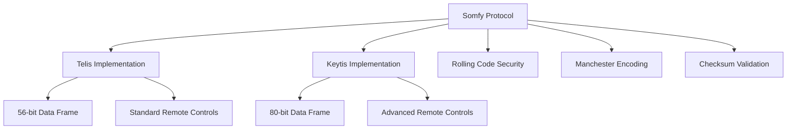
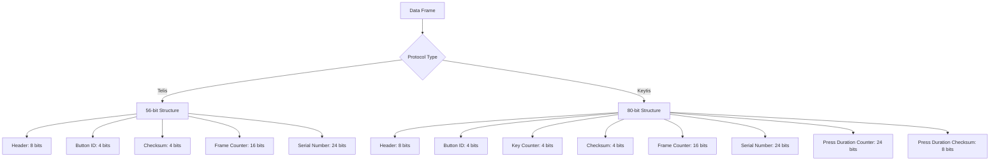
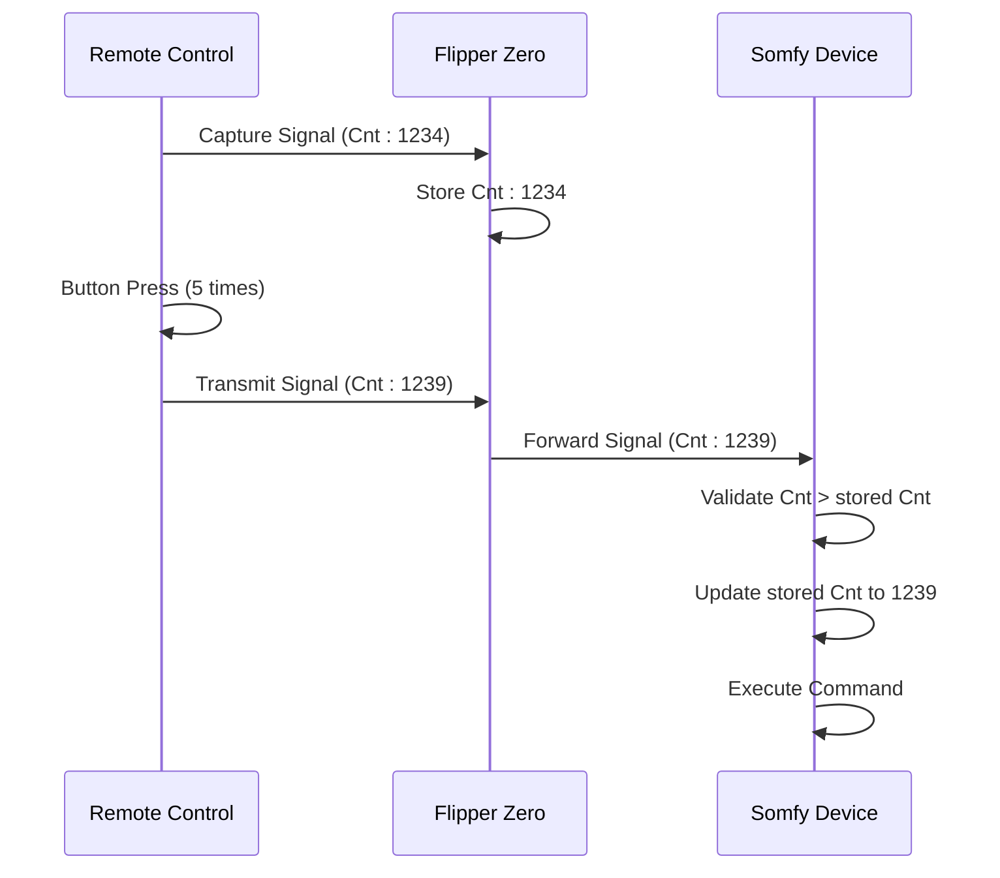
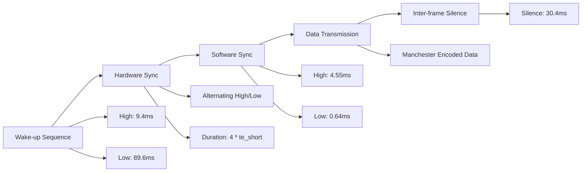
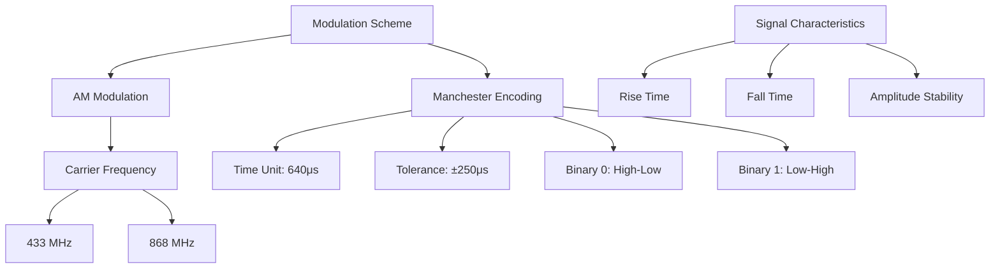
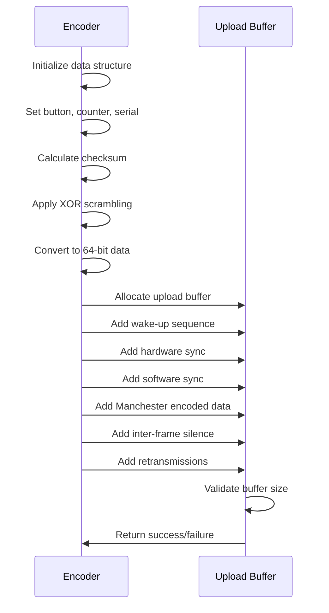
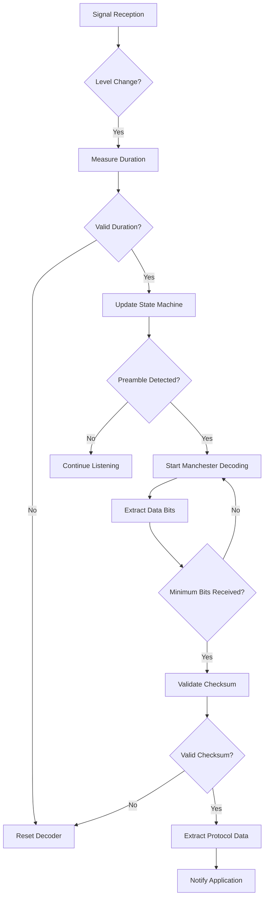
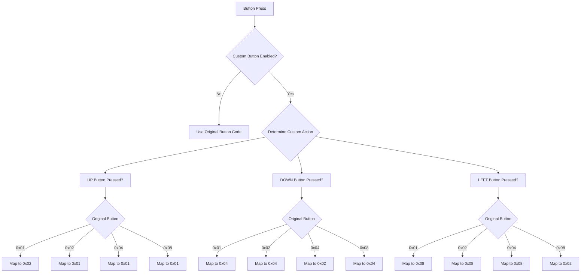
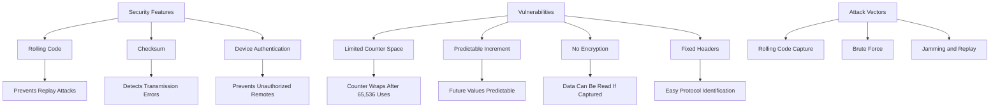

# Somfy Protocols

<cite>
**Referenced Files in This Document**   
- [somfy_keytis.c](file://lib/subghz/protocols/somfy_keytis.c)
- [somfy_telis.c](file://lib/subghz/protocols/somfy_telis.c)
</cite>

## Table of Contents
1. [Introduction](#introduction)
2. [Protocol Overview](#protocol-overview)
3. [Data Frame Structure](#data-frame-structure)
4. [Rolling Code Algorithm](#rolling-code-algorithm)
5. [Synchronization Mechanism](#synchronization-mechanism)
6. [Modulation Scheme](#modulation-scheme)
7. [Encoding Process](#encoding-process)
8. [Decoding Process](#decoding-process)
9. [Signal Analysis and Button Detection](#signal-analysis-and-button-detection)
10. [Learning Process for New Remotes](#learning-process-for-new-remotes)
11. [Security Considerations](#security-considerations)
12. [Practical Usage with Flipper Zero](#practical-usage-with-flipper-zero)
13. [Conclusion](#conclusion)

## Introduction
The Somfy Telis and Keytis protocols are wireless communication standards used primarily for controlling motorized blinds, awnings, and gates. These protocols implement a rolling code security mechanism to prevent replay attacks while maintaining compatibility across various Somfy remote control devices. This document provides a comprehensive analysis of the implementation details for both protocols within the Flipper Zero firmware, covering the data frame structure, rolling code algorithm, synchronization mechanism, modulation scheme, and practical usage scenarios. The analysis is based on the source code implementation in the Flipper Zero firmware repository, specifically the `somfy_telis.c` and `somfy_keytis.c` files.

## Protocol Overview
The Somfy Telis and Keytis protocols are implemented as part of the sub-GHz wireless communication system in the Flipper Zero firmware. Both protocols share similar architectural patterns but differ in specific implementation details such as data frame length and certain encoding parameters. The protocols are designed to work in the 433 MHz and 868 MHz frequency bands using amplitude modulation (AM). They support both decoding and encoding of signals, allowing the Flipper Zero to capture, analyze, and emulate Somfy remote controls.

The protocols are registered within the sub-GHz system with specific flags indicating their capabilities:
- Support for 433 MHz and 868 MHz frequency bands
- Amplitude modulation (AM) encoding
- Decodability and savability of captured signals
- Capability to transmit (send) signals



**Diagram sources**
- [somfy_telis.c](file://lib/subghz/protocols/somfy_telis.c#L50-L65)
- [somfy_keytis.c](file://lib/subghz/protocols/somfy_keytis.c#L50-L65)

**Section sources**
- [somfy_telis.c](file://lib/subghz/protocols/somfy_telis.c#L1-L100)
- [somfy_keytis.c](file://lib/subghz/protocols/somfy_keytis.c#L1-L100)

## Data Frame Structure
The data frame structure for Somfy protocols consists of several key components that are transmitted in a specific sequence. The structure differs slightly between the Telis and Keytis variants, with Keytis using a longer 80-bit frame compared to Telis's 56-bit frame.

### Telis Protocol Data Frame (56-bit)
The Telis protocol uses a 56-bit data frame structured as follows:
- **Header**: 8 bits (0xA7 prefix)
- **Button ID**: 4 bits
- **Checksum**: 4 bits
- **Frame Counter (Rolling Code)**: 16 bits (big-endian)
- **Serial Number**: 24 bits (little-endian)

The data frame is organized in memory as:
```
Byte 0: [A][7][btn][crc]
Byte 1: [MSB of Frame Counter]
Byte 2: [LSB of Frame Counter]
Byte 3: [LSB of Serial]
Byte 4: [Middle byte of Serial]
Byte 5: [MSB of Serial]
Byte 6: [XOR-encoded data]
```

### Keytis Protocol Data Frame (80-bit)
The Keytis protocol uses an 80-bit data frame with additional fields:
- **Header**: 8 bits (0xA prefix)
- **Button ID**: 4 bits
- **Key Counter**: 4 bits
- **Checksum**: 4 bits
- **Frame Counter (Rolling Code)**: 16 bits (big-endian)
- **Serial Number**: 24 bits (little-endian)
- **Press Duration Counter**: 24 bits
- **Press Duration Checksum**: 8 bits

The Keytis protocol includes a press duration counter that tracks how long a button was pressed, providing additional functionality for advanced remote controls.



**Diagram sources**
- [somfy_telis.c](file://lib/subghz/protocols/somfy_telis.c#L562-L580)
- [somfy_keytis.c](file://lib/subghz/protocols/somfy_keytis.c#L599-L620)

**Section sources**
- [somfy_telis.c](file://lib/subghz/protocols/somfy_telis.c#L562-L600)
- [somfy_keytis.c](file://lib/subghz/protocols/somfy_keytis.c#L599-L650)

## Rolling Code Algorithm
The rolling code algorithm is a critical security feature of Somfy protocols that prevents replay attacks by ensuring each transmitted signal is unique. The algorithm uses a 16-bit frame counter that increments with each button press.

### Implementation Details
The rolling code implementation in both Telis and Keytis protocols follows these steps:

1. **Counter Initialization**: The frame counter is initialized with a value from the remote's memory or a captured signal.
2. **Counter Increment**: When generating a new signal, the counter is incremented by a multiplier value obtained from the system.
3. **Overflow Handling**: If the counter exceeds 0xFFFF, it wraps around to zero.
4. **Zero Handling**: If the counter is already at 0xFFFF and the multiplier is non-zero, it resets to zero.

The algorithm is implemented in the `subghz_protocol_somfy_telis_gen_data` and `subghz_protocol_somfy_keytis_gen_data` functions:

```c
if(instance->generic.cnt < 0xFFFF) {
    if((instance->generic.cnt + furi_hal_subghz_get_rolling_counter_mult()) > 0xFFFF) {
        instance->generic.cnt = 0;
    } else {
        instance->generic.cnt += furi_hal_subghz_get_rolling_counter_mult();
    }
} else if((instance->generic.cnt >= 0xFFFF) && (furi_hal_subghz_get_rolling_counter_mult() != 0)) {
    instance->generic.cnt = 0;
}
```

The rolling counter multiplier is obtained from `furi_hal_subghz_get_rolling_counter_mult()`, which likely returns a configurable value that determines how much the counter increments with each transmission.

### Synchronization Mechanism
The rolling code system includes a synchronization mechanism that allows receivers to accept signals with frame counters slightly ahead of their current expectation. This prevents desynchronization when buttons are pressed without a receiver in range. The receiver will accept signals with counters within a reasonable range ahead of its current counter, updating its stored counter value accordingly.



**Diagram sources**
- [somfy_telis.c](file://lib/subghz/protocols/somfy_telis.c#L250-L270)
- [somfy_keytis.c](file://lib/subghz/protocols/somfy_keytis.c#L200-L220)

**Section sources**
- [somfy_telis.c](file://lib/subghz/protocols/somfy_telis.c#L250-L280)
- [somfy_keytis.c](file://lib/subghz/protocols/somfy_keytis.c#L200-L230)

## Synchronization Mechanism
The synchronization mechanism in Somfy protocols consists of both hardware and software synchronization pulses that ensure proper timing for signal decoding.

### Hardware Synchronization
The hardware synchronization consists of alternating high and low pulses with a duration of 4 times the short time unit (te_short). The duration of te_short is 640 microseconds for both protocols.

- **Telis Protocol**: Uses 2 hardware sync pulses during transmission and 7 during retransmission
- **Keytis Protocol**: Uses 12 hardware sync pulses during transmission and 6 during retransmission

### Software Synchronization
The software synchronization consists of a long high pulse followed by a short low pulse:
- High pulse: 4550 microseconds
- Low pulse: 640 microseconds (te_short)

This pattern helps the receiver establish proper timing for Manchester decoding of the subsequent data bits.

### Wake-up Sequence
Before the synchronization pulses, a wake-up sequence prepares the receiver:
- High pulse: 9415 microseconds
- Low pulse: 89565 microseconds

This long initial pulse ensures that the receiver's automatic gain control has time to adjust and that the device is fully awakened from any low-power state.



**Diagram sources**
- [somfy_telis.c](file://lib/subghz/protocols/somfy_telis.c#L200-L230)
- [somfy_keytis.c](file://lib/subghz/protocols/somfy_keytis.c#L200-L240)

**Section sources**
- [somfy_telis.c](file://lib/subghz/protocols/somfy_telis.c#L200-L250)
- [somfy_keytis.c](file://lib/subghz/protocols/somfy_keytis.c#L200-L260)

## Modulation Scheme
The Somfy protocols use Amplitude Modulation (AM) with Manchester encoding for data transmission. This combination provides reliable data transfer while maintaining compatibility with simple receiver hardware.

### Manchester Encoding
Manchester encoding is used to ensure clock synchronization between transmitter and receiver. In this scheme:
- A binary 0 is represented by a high-to-low transition
- A binary 1 is represented by a low-to-high transition

The time unit (te) is defined as 640 microseconds, with tolerances of ±250 microseconds to account for timing variations.

- **Short pulse (te_short)**: 640 microseconds
- **Long pulse (te_long)**: 1280 microseconds (2 * te_short)

The Manchester decoder state machine processes incoming pulses and reconstructs the original data stream by detecting these transitions.

### Frequency Bands
The protocols are designed to operate in two frequency bands:
- **433 MHz**: Commonly used for short-range applications
- **868 MHz**: Used in Europe for longer range and better penetration

The choice of frequency band is determined by regional regulations and the specific device model.



**Diagram sources**
- [somfy_telis.c](file://lib/subghz/protocols/somfy_telis.c#L50-L60)
- [somfy_keytis.c](file://lib/subghz/protocols/somfy_keytis.c#L50-L60)

**Section sources**
- [somfy_telis.c](file://lib/subghz/protocols/somfy_telis.c#L50-L80)
- [somfy_keytis.c](file://lib/subghz/protocols/somfy_keytis.c#L50-L80)

## Encoding Process
The encoding process transforms the protocol data into a sequence of level and duration pairs that can be transmitted by the Flipper Zero's sub-GHz radio.

### Data Generation
The encoding process begins with data generation, where the various components of the protocol frame are assembled:

```c
// Frame assembly for Telis protocol
uint8_t frame[7];
frame[0] = 0xA7; // Header
frame[1] = btn << 4; // Button ID in high nibble
frame[2] = instance->generic.cnt >> 8; // MSB of frame counter
frame[3] = instance->generic.cnt; // LSB of frame counter
frame[4] = instance->generic.serial >> 16; // MSB of serial
frame[5] = instance->generic.serial >> 8;
frame[6] = instance->generic.serial; // LSB of serial
```

### Checksum Calculation
A 4-bit checksum is calculated using the following algorithm:
```c
uint8_t checksum = 0;
for(uint8_t i = 0; i < 7; i++) {
    checksum = checksum ^ frame[i] ^ (frame[i] >> 4);
}
checksum &= 0xF;
frame[1] |= checksum; // Insert checksum into second nibble
```

### Data Scrambling
The data is scrambled using an XOR operation between consecutive bytes:
```c
for(uint8_t i = 1; i < 7; i++) {
    frame[i] ^= frame[i - 1];
}
```

This scrambling improves the signal's spectral characteristics and helps with synchronization.

### Manchester Encoding
The scrambled data is then converted to Manchester encoded pulses:
```c
for(uint8_t i = instance->generic.data_count_bit; i > 0; i--) {
    if(bit_read(instance->generic.data, i - 1)) {
        // Binary 1: low-high transition
        if(previous level was low) {
            extend previous pulse;
            add high pulse;
        } else {
            add low pulse;
            add high pulse;
        }
    } else {
        // Binary 0: high-low transition
        if(previous level was high) {
            extend previous pulse;
            add low pulse;
        } else {
            add high pulse;
            add low pulse;
        }
    }
}
```

### Transmission Sequence
The complete transmission sequence includes:
1. Wake-up pulse (9.4ms high, 89.6ms low)
2. Hardware synchronization (alternating pulses)
3. Software synchronization (4.55ms high, 0.64ms low)
4. Manchester encoded data
5. Inter-frame silence (30.4ms)
6. Two retransmissions with modified hardware sync



**Diagram sources**
- [somfy_telis.c](file://lib/subghz/protocols/somfy_telis.c#L200-L350)
- [somfy_keytis.c](file://lib/subghz/protocols/somfy_keytis.c#L200-L400)

**Section sources**
- [somfy_telis.c](file://lib/subghz/protocols/somfy_telis.c#L200-L400)
- [somfy_keytis.c](file://lib/subghz/protocols/somfy_keytis.c#L200-L500)

## Decoding Process
The decoding process analyzes incoming radio signals to extract the protocol data. It uses a state machine to identify the various components of the transmission.

### State Machine
The decoder operates through several states:
- **Reset**: Initial state, waiting for preamble
- **Check Preamble**: Verifying the synchronization pattern
- **Found Preamble**: Detected valid preamble, preparing to decode
- **Start Decode**: Beginning data decoding
- **Decoder Data**: Processing Manchester encoded data

### Preamble Detection
The decoder first looks for the hardware synchronization pattern:
```c
case SomfyTelisDecoderStepReset:
    if((level) && DURATION_DIFF(duration, te_short * 4) < te_delta * 4) {
        instance->decoder.parser_step = SomfyTelisDecoderStepFoundPreambula;
        instance->header_count++;
    }
    break;
```

### Manchester Decoding
Once the preamble is detected, the decoder uses the Manchester decoder library to extract bits from the signal:
```c
bool data_ok = manchester_advance(
    instance->manchester_saved_state,
    event,
    &instance->manchester_saved_state,
    &data);
```

### Data Validation
After receiving the minimum number of bits, the decoder validates the data:
```c
if(instance->decoder.decode_count_bit == min_count_bit_for_found) {
    // Check CRC
    uint64_t data_tmp = instance->decoder.decode_data ^ (instance->decoder.decode_data >> 8);
    if(((data_tmp >> 40) & 0xF) == subghz_protocol_somfy_telis_crc(data_tmp)) {
        // Valid data received
        instance->generic.data = instance->decoder.decode_data;
        instance->generic.data_count_bit = instance->decoder.decode_count_bit;
        
        // Notify callback
        if(instance->base.callback)
            instance->base.callback(&instance->base, instance->base.context);
    }
}
```

The CRC validation ensures that the received data is intact and not corrupted by transmission errors.



**Diagram sources**
- [somfy_telis.c](file://lib/subghz/protocols/somfy_telis.c#L400-L500)
- [somfy_keytis.c](file://lib/subghz/protocols/somfy_keytis.c#L400-L500)

**Section sources**
- [somfy_telis.c](file://lib/subghz/protocols/somfy_telis.c#L400-L550)
- [somfy_keytis.c](file://lib/subghz/protocols/somfy_keytis.c#L400-L550)

## Signal Analysis and Button Detection
The Flipper Zero firmware includes functionality for analyzing captured Somfy signals and detecting button presses.

### Button Mapping
The protocols support various button functions, mapped as follows:

**Telis Button Mapping:**
- 0x01: My (Stop or move to favorite position)
- 0x02: Up (Move up)
- 0x03: My + Up (Set upper motor limit)
- 0x04: Down (Move down)
- 0x05: My + Down (Set lower motor limit)
- 0x06: Up + Down (Change motor limit)
- 0x08: Prog (Register/deregister remotes)
- 0x09: Sun + Flag (Enable sun/wind detector)
- 0x0A: Flag (Disable sun detector)

**Keytis Button Mapping:**
- 0x01: Unknown
- 0x02: 0x02
- 0x03: Prog
- 0x04: Key_1
- 0x08: 0x08
- 0x09: 0x09
- 0x0A: 0x0A

### Custom Button Handling
The Telis implementation includes custom button handling that allows remapping of button functions:
```c
static uint8_t subghz_protocol_somfy_telis_get_btn_code(void) {
    uint8_t custom_btn_id = subghz_custom_btn_get();
    uint8_t original_btn_code = subghz_custom_btn_get_original();
    uint8_t btn = original_btn_code;

    if(custom_btn_id == SUBGHZ_CUSTOM_BTN_UP) {
        switch(original_btn_code) {
        case 0x1: btn = 0x2; break;
        case 0x2: btn = 0x1; break;
        case 0x4: btn = 0x1; break;
        case 0x8: btn = 0x1; break;
        }
    }
    // Similar handling for DOWN and LEFT buttons
    return btn;
}
```

This allows users to customize button behavior, such as mapping the "Up" button to different functions depending on the original button pressed.



**Diagram sources**
- [somfy_telis.c](file://lib/subghz/protocols/somfy_telis.c#L650-L750)
- [somfy_keytis.c](file://lib/subghz/protocols/somfy_keytis.c#L650-L700)

**Section sources**
- [somfy_telis.c](file://lib/subghz/protocols/somfy_telis.c#L650-L761)
- [somfy_keytis.c](file://lib/subghz/protocols/somfy_keytis.c#L650-L807)

## Learning Process for New Remotes
The learning process for new Somfy remotes involves capturing the device's serial number and initial frame counter value, which are required for successful emulation.

### Registration Procedure
To register a new remote with a Somfy device:
1. Put the Somfy device into learning mode (typically by holding a button for several seconds)
2. Capture the signal from the original remote using the Flipper Zero
3. Extract the serial number and current frame counter from the captured signal
4. Program the Flipper Zero with these values
5. Transmit the signal from the Flipper Zero while the device is in learning mode

The "Prog" button (0x08) on Telis remotes is specifically designed for this registration process, allowing devices to (de-)register remotes.

### Data Extraction
When capturing a signal, the Flipper Zero extracts the following information:
- **Serial Number**: 24-bit unique identifier of the remote
- **Frame Counter**: 16-bit rolling code value
- **Button Code**: 4-bit identifier of the pressed button
- **Checksum**: 4-bit validation code

This information is stored in a file format that can be later used for transmission.

### Synchronization Considerations
When emulating a remote, it's important to maintain synchronization with the receiver's expected frame counter. If the emulated device's counter is too far behind the receiver's expectation, the signal will be rejected. The Flipper Zero's implementation handles this by incrementing the counter appropriately when generating new signals.

## Security Considerations
The Somfy protocols implement several security features to protect against unauthorized access, but also have potential vulnerabilities.

### Security Features
- **Rolling Code**: The 16-bit frame counter prevents replay attacks by ensuring each transmission is unique
- **Checksum Validation**: 4-bit checksum detects transmission errors and some forms of tampering
- **Device Authentication**: The 24-bit serial number ensures only authorized remotes can control a device

### Potential Vulnerabilities
Despite these security measures, the protocols have some limitations:
- **Limited Counter Space**: The 16-bit counter provides only 65,536 unique values before wrapping
- **Predictable Increment**: The counter typically increments by 1, making future values somewhat predictable
- **No Encryption**: The data is not encrypted, only scrambled with a simple XOR operation
- **Fixed Header Values**: The header bytes (0xA7 for Telis, 0xA for Keytis) are constant and easily identifiable

### Attack Vectors
Potential attack vectors include:
- **Rolling Code Capture**: Capturing a sequence of signals to predict future counter values
- **Brute Force**: Attempting all possible serial numbers (though 24 bits provides 16 million possibilities)
- **Jamming and Replay**: Jamming the receiver while capturing a valid signal, then replaying it later

The Flipper Zero's implementation does not introduce additional vulnerabilities but provides the tools necessary for both legitimate use and security research.



**Diagram sources**
- [somfy_telis.c](file://lib/subghz/protocols/somfy_telis.c#L250-L270)
- [somfy_keytis.c](file://lib/subghz/protocols/somfy_keytis.c#L200-L220)

**Section sources**
- [somfy_telis.c](file://lib/subghz/protocols/somfy_telis.c#L250-L300)
- [somfy_keytis.c](file://lib/subghz/protocols/somfy_keytis.c#L200-L250)

## Practical Usage with Flipper Zero
The Flipper Zero provides a complete toolkit for working with Somfy protocols, enabling users to capture, analyze, and emulate remote controls.

### Capturing Signals
To capture a Somfy signal:
1. Navigate to the Sub-GHz application on the Flipper Zero
2. Select "Sniff Unknown" or "Receive"
3. Press a button on the Somfy remote
4. The Flipper Zero will capture and decode the signal
5. Save the signal to a file for later use

### Analyzing Signals
The Flipper Zero displays detailed information about captured signals:
- Protocol name and data length
- Full key value (hexadecimal)
- Serial number (Sn)
- Frame counter (Cnt)
- Button pressed

This information is crucial for understanding the remote's configuration and for troubleshooting issues.

### Emulating Remotes
To emulate a Somfy remote:
1. Load a previously captured signal or create a new one
2. Configure the serial number, frame counter, and button
3. Transmit the signal using the "Transmit" function
4. The Somfy device should respond as if the original remote was used

### Handling Rolling Codes
When emulating remotes with rolling codes, it's important to:
- Start with a recently captured frame counter value
- Allow the Flipper Zero to increment the counter appropriately
- Avoid excessive transmissions that could desynchronize the counter

The Flipper Zero automatically handles counter incrementation based on the system's rolling counter multiplier.

### Button Sequence Detection
For advanced applications, the Flipper Zero can detect and replicate complex button sequences:
- Multiple button presses in sequence
- Long button presses (using the press duration counter in Keytis protocol)
- Combination button presses (Up+Down, My+Up, etc.)

This enables automation of complex operations like setting motor limits or programming new devices.

## Conclusion
The Somfy Telis and Keytis protocols implementation in the Flipper Zero firmware provides a comprehensive solution for working with Somfy wireless devices. The implementation faithfully reproduces the key aspects of the protocols, including the rolling code security mechanism, Manchester encoding, and data frame structure. By understanding the detailed implementation of these protocols, users can effectively capture, analyze, and emulate Somfy remote controls for legitimate purposes. The Flipper Zero's capabilities in this domain make it a powerful tool for both everyday use and security research, while the open-source nature of the implementation allows for continuous improvement and verification of its correctness.