# Sub-GHz Protocols

<cite>
**Referenced Files in This Document**   
- [princeton.h](file://lib/subghz/protocols/princeton.h)
- [keeloq.h](file://lib/subghz/protocols/keeloq.h)
- [x10.h](file://lib/subghz/protocols/x10.h)
- [somfy_telis.h](file://lib/subghz/protocols/somfy_telis.h)
- [came.h](file://lib/subghz/protocols/came.h)
- [linear.h](file://lib/subghz/protocols/linear.h)
- [nice_flo.h](file://lib/subghz/protocols/nice_flo.h)
- [honeywell.h](file://lib/subghz/protocols/honeywell.h)
- [hormann.h](file://lib/subghz/protocols/hormann.h)
- [ido.h](file://lib/subghz/protocols/ido.h)
- [intertechno_v3.h](file://lib/subghz/protocols/intertechno_v3.h)
- [kinggates_stylo_4k.h](file://lib/subghz/protocols/kinggates_stylo_4k.h)
- [legrand.h](file://lib/subghz/protocols/legrand.h)
- [magellan.h](file://lib/subghz/protocols/magellan.h)
- [marantec.h](file://lib/subghz/protocols/marantec.h)
- [mastercode.h](file://lib/subghz/protocols/mastercode.h)
- [megacode.h](file://lib/subghz/protocols/megacode.h)
- [nero_radio.h](file://lib/subghz/protocols/nero_radio.h)
- [phoenix_v2.h](file://lib/subghz/protocols/phoenix_v2.h)
- [power_smart.h](file://lib/subghz/protocols/power_smart.h)
- [revers_rb2.h](file://lib/subghz/protocols/revers_rb2.h)
- [roger.h](file://lib/subghz/protocols/roger.h)
- [scher_khan.h](file://lib/subghz/protocols/scher_khan.h)
- [secplus_v1.h](file://lib/subghz/protocols/secplus_v1.h)
- [secplus_v2.h](file://lib/subghz/protocols/secplus_v2.h)
- [smc5326.h](file://lib/subghz/protocols/smc5326.h)
- [star_line.h](file://lib/subghz/protocols/star_line.h)
- [alutech_at_4n.h](file://lib/subghz/protocols/alutech_at_4n.h)
- [ansonic.h](file://lib/subghz/protocols/ansonic.h)
- [bett.h](file://lib/subghz/protocols/bett.h)
- [clemsa.h](file://lib/subghz/protocols/clemsa.h)
- [dickert_mahs.h](file://lib/subghz/protocols/dickert_mahs.h)
- [doitrand.h](file://lib/subghz/protocols/doitrand.h)
- [dooya.h](file://lib/subghz/protocols/dooya.h)
- [faac_slh.h](file://lib/subghz/protocols/faac_slh.h)
- [feron.h](file://lib/subghz/protocols/feron.h)
- [gate_tx.h](file://lib/subghz/protocols/gate_tx.h)
- [hay21.h](file://lib/subghz/protocols/hay21.h)
- [hollarm.h](file://lib/subghz/protocols/hollarm.h)
- [kia.h](file://lib/subghz/protocols/kia.h)
- [holtek.h](file://lib/subghz/protocols/holtek.h)
- [holtek_ht12x.h](file://lib/subghz/protocols/holtek_ht12x.h)
- [base.h](file://lib/subghz/protocols/base.h)
- [public_api.h](file://lib/subghz/protocols/public_api.h)
</cite>

## Table of Contents
1. [Introduction](#introduction)
2. [Supported Sub-GHz Protocols](#supported-sub-gz-protocols)
3. [Protocol Architecture](#protocol-architecture)
4. [Modulation and Encoding Schemes](#modulation-and-encoding-schemes)
5. [Protocol Implementation Details](#protocol-implementation-details)
6. [Signal Analysis and Emulation](#signal-analysis-and-emulation)
7. [Protocol Registry System](#protocol-registry-system)
8. [Brute Force Techniques](#brute-force-techniques)
9. [Conclusion](#conclusion)

## Introduction

The Flipper Zero is a versatile multi-tool device capable of interacting with various wireless protocols, particularly in the Sub-GHz frequency range. This document provides comprehensive technical documentation for the Sub-GHz protocols supported by the Flipper Zero, detailing their specifications, implementation, and usage. The device supports a wide range of proprietary protocols used in garage door openers, gate controllers, alarm systems, and other wireless devices.

The Sub-GHz functionality is implemented through a modular architecture that allows for easy addition of new protocols. The system is designed to handle signal analysis, frequency scanning, remote control emulation, and brute force attacks on rolling code systems. This documentation will cover the technical specifications of supported protocols, their implementation details, and the underlying architecture that enables these capabilities.

**Section sources**
- [princeton.h](file://lib/subghz/protocols/princeton.h#L1-L118)
- [keeloq.h](file://lib/subghz/protocols/keeloq.h#L1-L111)

## Supported Sub-GHz Protocols

The Flipper Zero supports a comprehensive collection of Sub-GHz protocols, each designed for specific manufacturers and applications. These protocols are implemented as separate modules within the firmware, allowing for independent development and maintenance.

### Major Protocol Categories

**Garage Door and Gate Controllers:**
- **Somfy Telis/Keytis**: French manufacturer of motorized systems
- **Came**: Italian automation systems
- **Linear**: American gate and door operators
- **Nice**: Italian automation systems
- **Marantec**: German garage door systems
- **Alutech**: Russian gate automation
- **King Gates**: American gate operators

**Security and Alarm Systems:**
- **KeeLoq**: Rolling code security system
- **Honeywell**: Security systems
- **Hormann**: German security systems
- **IDO**: Security systems
- **Scher-Khan**: Russian security systems

**Lighting and Home Automation:**
- **X10**: Power line and RF home automation
- **Intertechno**: Home automation systems
- **Legrand**: Electrical systems
- **Feron**: Lighting systems

**Other Proprietary Protocols:**
- **Princeton**: Simple fixed-code remotes
- **Gangqi**: Chinese manufacturer
- **Holtek**: Microcontroller-based systems
- **Magellan**: Various applications
- **Mastercode**: Security systems
- **Megacode**: Security systems
- **Nero**: Various applications
- **Phoenix**: Various applications
- **Power Smart**: Power management systems
- **Revers**: Various applications
- **Roger**: Various applications
- **SecPlus**: Security systems
- **SMC5326**: Various applications
- **Star Line**: Automotive security
- **Ansonic, Bett, Clemsa, Dickert, Doitrand, Dooya, Faac, Gate TX, Hay21, Hollarm, Kia**: Various manufacturers

**Section sources**
- [princeton.h](file://lib/subghz/protocols/princeton.h#L1-L118)
- [keeloq.h](file://lib/subghz/protocols/keeloq.h#L1-L111)
- [x10.h](file://lib/subghz/protocols/x10.h#L1-L84)
- [somfy_telis.h](file://lib/subghz/protocols/somfy_telis.h#L1-L110)
- [came.h](file://lib/subghz/protocols/came.h#L1-L110)
- [linear.h](file://lib/subghz/protocols/linear.h#L1-L110)
- [nice_flo.h](file://lib/subghz/protocols/nice_flo.h#L1-L110)

## Protocol Architecture

The Sub-GHz protocol implementation follows a consistent architectural pattern across all supported protocols. Each protocol is implemented with both encoder and decoder components that handle the transmission and reception of signals respectively.

### Core Components

```mermaid
classDiagram
class SubGhzProtocol {
+const char* name
+SubGhzProtocolDecoder decoder
+SubGhzProtocolEncoder encoder
}
class SubGhzProtocolDecoder {
+void* (*alloc)(SubGhzEnvironment*)
+void (*free)(void*)
+void (*reset)(void*)
+void (*feed)(void*, bool, uint32_t)
+uint32_t (*get_hash_data)(void*)
+SubGhzProtocolStatus (*serialize)(void*, FlipperFormat*, SubGhzRadioPreset*)
+SubGhzProtocolStatus (*deserialize)(void*, FlipperFormat*)
+void (*get_string)(void*, FuriString*)
}
class SubGhzProtocolEncoder {
+void* (*alloc)(SubGhzEnvironment*)
+void (*free)(void*)
+SubGhzProtocolStatus (*deserialize)(void*, FlipperFormat*)
+void (*stop)(void*)
+LevelDuration (*yield)(void*)
}
class SubGhzEnvironment {
+void* context
+SubGhzProtocolRegistry* protocol_registry
+SubGhzTxRx* txrx
}
SubGhzProtocolDecoder <|-- SubGhzProtocolDecoderPrinceton
SubGhzProtocolDecoder <|-- SubGhzProtocolDecoderKeeloq
SubGhzProtocolDecoder <|-- SubGhzProtocolDecoderX10
SubGhzProtocolDecoder <|-- SubGhzProtocolDecoderSomfyTelis
SubGhzProtocolDecoder <|-- SubGhzProtocolDecoderCame
SubGhzProtocolDecoder <|-- SubGhzProtocolDecoderLinear
SubGhzProtocolDecoder <|-- SubGhzProtocolDecoderNiceFlo
SubGhzProtocolEncoder <|-- SubGhzProtocolEncoderPrinceton
SubGhzProtocolEncoder <|-- SubGhzProtocolEncoderKeeloq
SubGhzProtocolEncoder <|-- SubGhzProtocolEncoderX10
SubGhzProtocolEncoder <|-- SubGhzProtocolEncoderSomfyTelis
SubGhzProtocolEncoder <|-- SubGhzProtocolEncoderCame
SubGhzProtocolEncoder <|-- SubGhzProtocolEncoderLinear
SubGhzProtocolEncoder <|-- SubGhzProtocolEncoderNiceFlo
SubGhzProtocol *-- SubGhzProtocolDecoder
SubGhzProtocol *-- SubGhzProtocolEncoder
SubGhzEnvironment o-- SubGhzProtocolRegistry
SubGhzEnvironment o-- SubGhzTxRx
```

**Diagram sources**
- [princeton.h](file://lib/subghz/protocols/princeton.h#L1-L118)
- [keeloq.h](file://lib/subghz/protocols/keeloq.h#L1-L111)
- [base.h](file://lib/subghz/protocols/base.h)

**Section sources**
- [princeton.h](file://lib/subghz/protocols/princeton.h#L1-L118)
- [keeloq.h](file://lib/subghz/protocols/keeloq.h#L1-L111)
- [base.h](file://lib/subghz/protocols/base.h)

## Modulation and Encoding Schemes

The Flipper Zero supports various modulation and encoding schemes used by different Sub-GHz protocols. These schemes determine how digital data is converted into radio signals for transmission and how received signals are decoded back into digital data.

### Modulation Types

**Amplitude Shift Keying (ASK)/On-Off Keying (OOK):**
- Most common modulation for Sub-GHz devices
- Binary data represented by presence or absence of carrier wave
- Used by Princeton, X10, and many other protocols
- Simple to implement but susceptible to noise

**Frequency Shift Keying (FSK):**
- Binary data represented by shifting between two frequencies
- More robust against noise than ASK/OOK
- Used by some security systems and industrial applications
- Requires more complex hardware

### Data Encoding Methods

**Pulse Width Modulation (PWM):**
- Data encoded in the width of pulses
- Common in garage door openers and gate controllers
- Princeton protocol uses PWM with fixed and variable pulse widths

**Pulse Position Modulation (PPM):**
- Data encoded in the position of pulses within a time frame
- Used by some remote control systems

**Manchester Encoding:**
- Each bit period is divided into two halves
- Transition in the middle of each bit period represents data
- Provides self-clocking and error detection
- Used by some industrial and security systems

**Bi-phase Encoding:**
- Similar to Manchester but with different transition rules
- Provides good synchronization properties

### Frequency Bands

The Flipper Zero operates in the Sub-GHz frequency range, primarily supporting:
- 315 MHz: Common in North America
- 345 MHz: Used by some security systems
- 433.92 MHz: Most common frequency, used worldwide
- 868.3 MHz: Common in Europe
- 915 MHz: Used in North America

**Section sources**
- [princeton.h](file://lib/subghz/protocols/princeton.h#L1-L118)
- [x10.h](file://lib/subghz/protocols/x10.h#L1-L84)
- [public_api.h](file://lib/subghz/protocols/public_api.h)

## Protocol Implementation Details

Each Sub-GHz protocol is implemented with a consistent interface that allows the Flipper Zero to handle them uniformly. The implementation details vary based on the specific requirements of each protocol.

### Princeton Protocol

The Princeton protocol is one of the simplest fixed-code protocols, commonly used in basic remote controls.

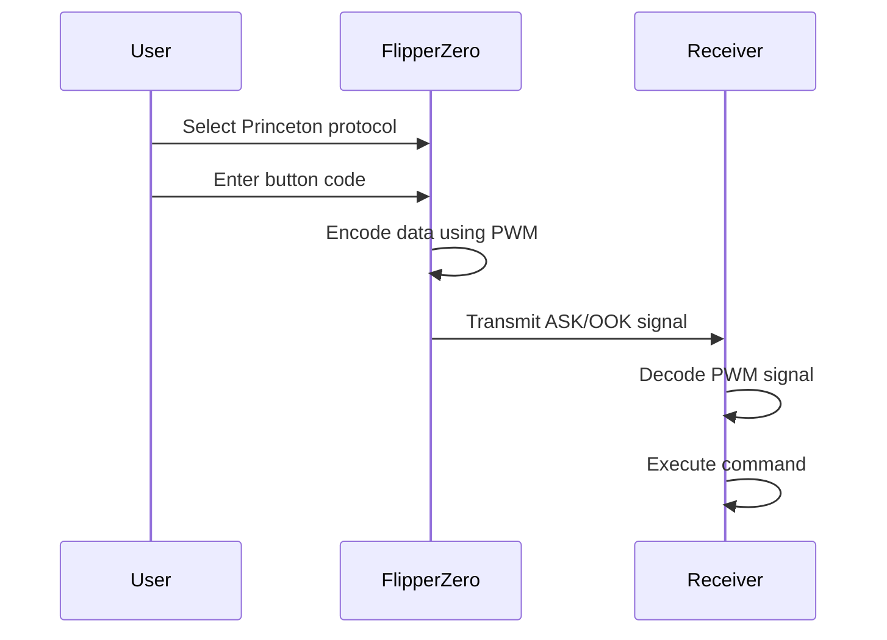

**Key Features:**
- Fixed 24-bit address code
- 4-bit button code
- Pulse width modulation with 300µs/900µs timing
- No rolling code or encryption
- Simple to clone and replay

**Section sources**
- [princeton.h](file://lib/subghz/protocols/princeton.h#L1-L118)

### KeeLoq Protocol

The KeeLoq protocol is a rolling code system that provides enhanced security compared to fixed-code systems.

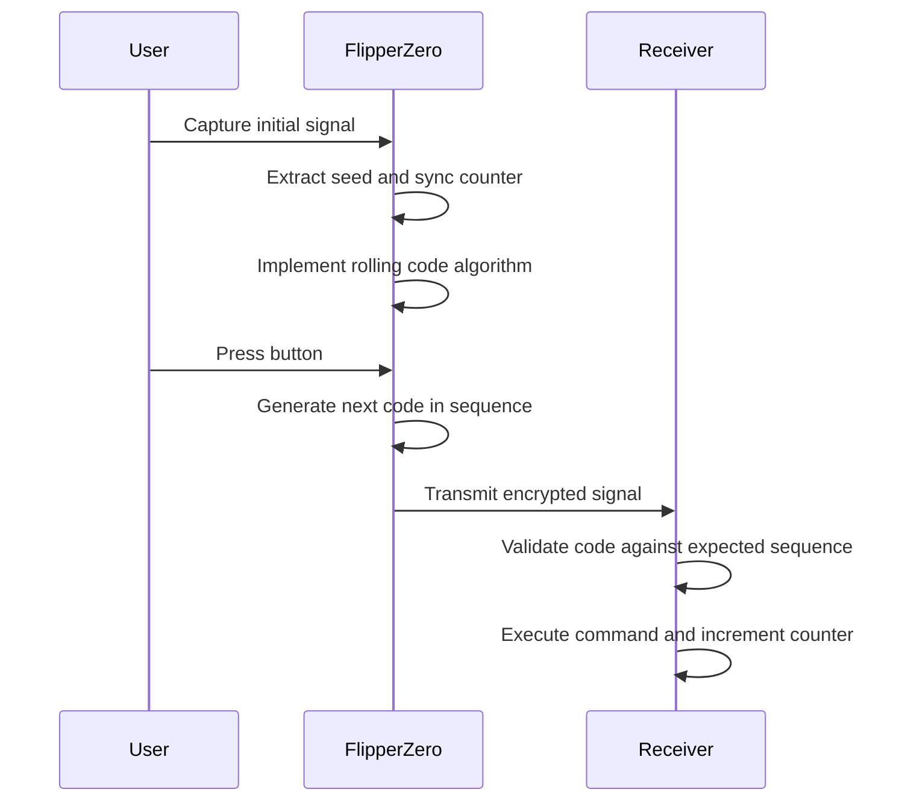

**Key Features:**
- 64-bit encryption key
- 32-bit hopping code with 16-bit sync counter
- Non-linear feedback shift register for code generation
- Resistant to simple replay attacks
- Vulnerable to certain cryptographic attacks

**Section sources**
- [keeloq.h](file://lib/subghz/protocols/keeloq.h#L1-L111)
- [keeloq_common.h](file://lib/subghz/protocols/keeloq_common.h)

### X10 Protocol

The X10 protocol is used for home automation systems, both over power lines and via RF.

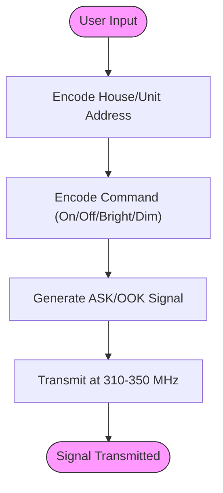

**Key Features:**
- 4-bit house code (A-P)
- 4-bit unit code (1-16)
- Command codes for on, off, bright, dim
- Asynchronous transmission
- Low data rate for reliability

**Section sources**
- [x10.h](file://lib/subghz/protocols/x10.h#L1-L84)

### Somfy Telis Protocol

The Somfy Telis protocol is used for motorized window coverings and gate systems.

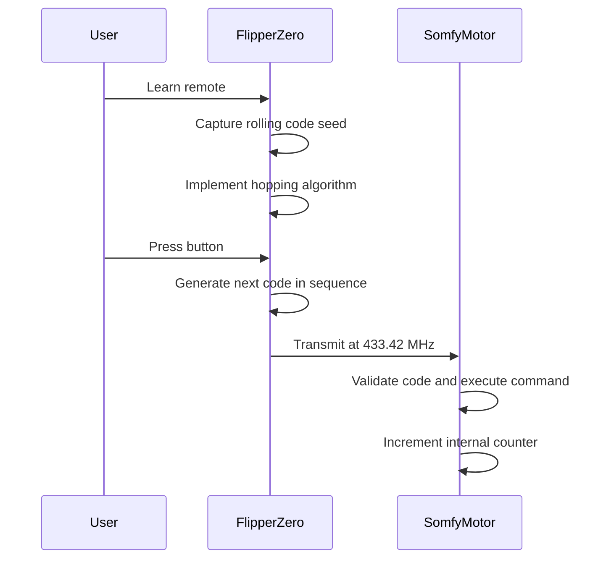

**Key Features:**
- 26-bit address code
- 8-bit rolling code
- Synchronization mechanism for code alignment
- Bidirectional communication capability
- High reliability for motor control

**Section sources**
- [somfy_telis.h](file://lib/subghz/protocols/somfy_telis.h#L1-L110)

### CAME Protocol

The CAME protocol is used in Italian automation systems for gates and doors.

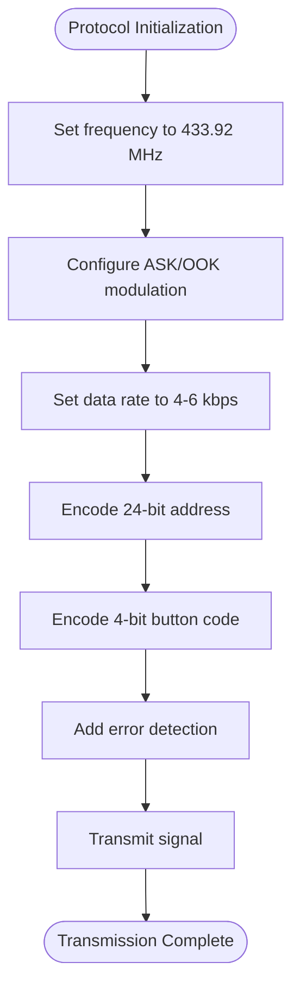

**Key Features:**
- Fixed code system with address and button codes
- Error detection mechanisms
- Standardized timing parameters
- Compatibility with various CAME devices

**Section sources**
- [came.h](file://lib/subghz/protocols/came.h#L1-L110)

### Linear Protocol

The Linear protocol is used in American gate and door operators.

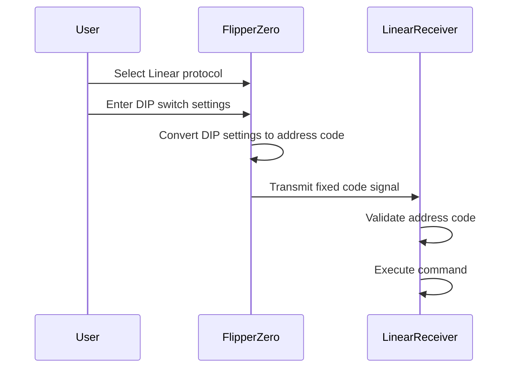

**Key Features:**
- Fixed code system with DIP switch configuration
- Simple encoding scheme
- Reliable transmission for gate control
- Wide compatibility with Linear products

**Section sources**
- [linear.h](file://lib/subghz/protocols/linear.h#L1-L110)

### Nice FLO Protocol

The Nice FLO protocol is used in Italian automation systems.

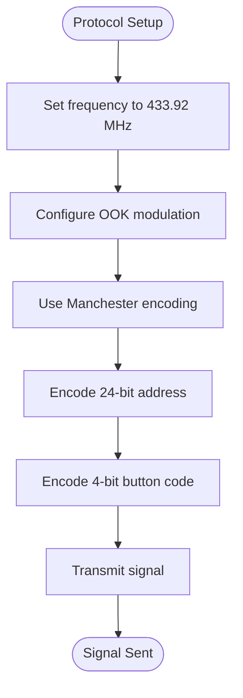

**Key Features:**
- Manchester encoding for reliable data transmission
- Fixed address and button codes
- Standard frequency and modulation
- Compatibility with Nice automation products

**Section sources**
- [nice_flo.h](file://lib/subghz/protocols/nice_flo.h#L1-L110)

## Signal Analysis and Emulation

The Flipper Zero provides comprehensive tools for analyzing and emulating Sub-GHz signals. These capabilities enable users to understand, capture, and replicate wireless communications.

### Signal Analysis Process

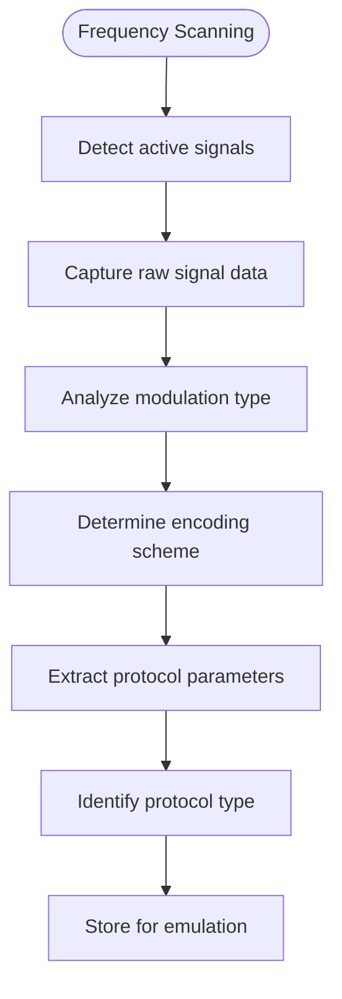

The signal analysis process begins with frequency scanning to detect active transmissions. Once a signal is detected, the Flipper Zero captures the raw data consisting of level and duration pairs. This data is then analyzed to determine the modulation type (ASK/OOK or FSK), encoding scheme (PWM, Manchester, etc.), and other protocol parameters such as data rate and packet structure.

### Remote Control Emulation

Remote control emulation allows the Flipper Zero to replicate the functionality of existing remote controls. This process involves:

1. **Signal Capture**: Recording the original signal from a remote control
2. **Protocol Identification**: Determining which protocol is being used
3. **Parameter Extraction**: Extracting address codes, button codes, and other parameters
4. **Signal Reproduction**: Generating and transmitting the same signal

The emulation process is facilitated by the consistent interface provided by the Sub-GHz protocol architecture, allowing the same workflow to be used for different protocols.

### Timing Diagrams

Timing diagrams are essential for understanding the structure of Sub-GHz signals. For example, the Princeton protocol uses a specific timing pattern:

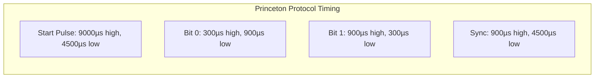

These timing diagrams help visualize the structure of the signal and are crucial for implementing accurate encoders and decoders.

**Section sources**
- [princeton.h](file://lib/subghz/protocols/princeton.h#L1-L118)
- [subghz_test_app.c](file://applications/debug/subghz_test/subghz_test_app.c)
- [subghz_remote_app.c](file://applications/external/subghz_remote/subghz_remote_app.c)

## Protocol Registry System

The Sub-GHz protocol registry system provides a centralized mechanism for managing all supported protocols. This system allows for dynamic registration and lookup of protocols.

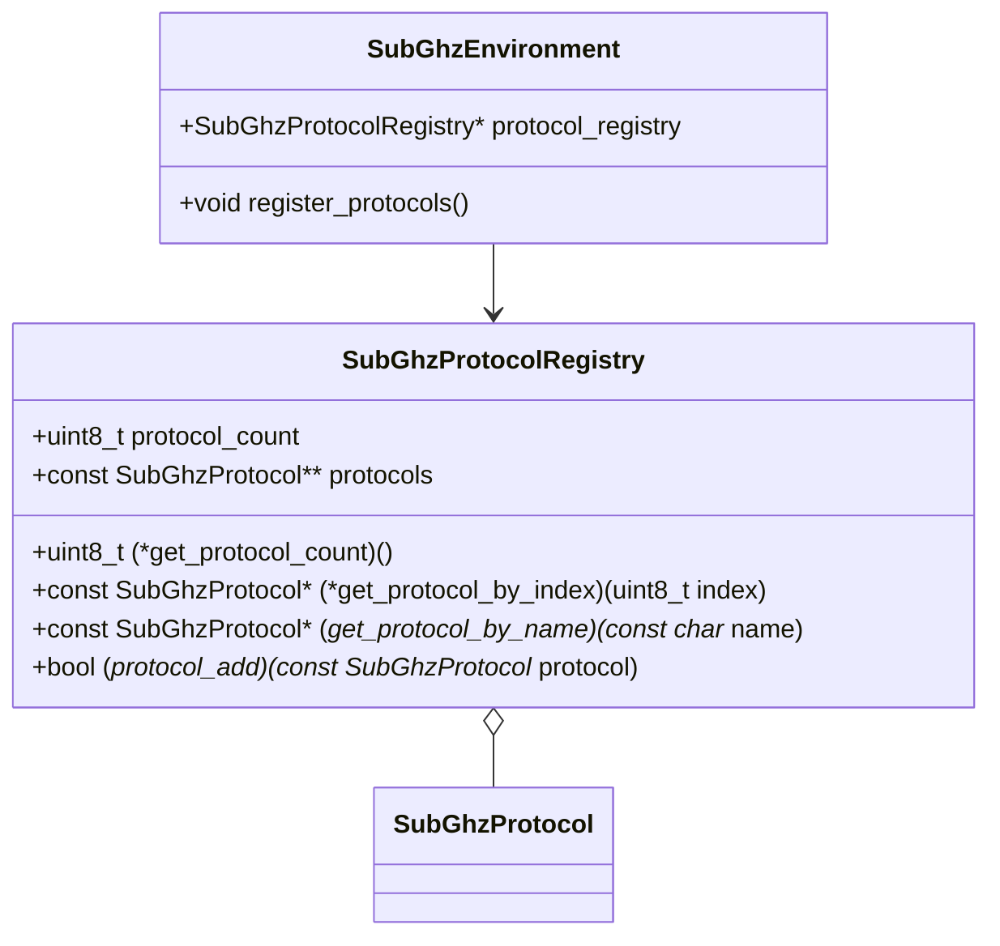

**Key Functions:**
- **Protocol Registration**: Adding new protocols to the system
- **Protocol Lookup**: Finding protocols by name or index
- **Dynamic Management**: Allowing protocols to be added or removed
- **Centralized Access**: Providing a single point of access to all protocols

The registry system is initialized during startup, when all supported protocols are registered. This allows the user interface to display a list of available protocols and enables the system to route signals to the appropriate decoder.

**Diagram sources**
- [registry.h](file://lib/subghz/registry.h)
- [subghz_protocol_registry.h](file://lib/subghz/subghz_protocol_registry.h)

**Section sources**
- [registry.h](file://lib/subghz/registry.h)
- [subghz_protocol_registry.h](file://lib/subghz/subghz_protocol_registry.h)

## Brute Force Techniques

The Flipper Zero supports brute force techniques for testing the security of Sub-GHz systems, particularly those with weak security implementations.

### Brute Force Attack Types

**Fixed Code Systems:**
- Iterate through all possible address codes
- Test each code until a response is detected
- Effective against systems like Princeton and X10

**Rolling Code Systems:**
- Capture initial code and synchronize counter
- Predict next codes in sequence
- Test predicted codes within acceptable window

**Dictionary Attacks:**
- Use common code combinations
- Target systems with default or weak configurations
- Faster than exhaustive search

### Implementation Considerations

When implementing brute force techniques, several factors must be considered:

- **Transmission Rate**: Limiting transmissions to avoid detection
- **Power Management**: Conserving battery during extended operations
- **Error Handling**: Managing failed transmissions and retries
- **User Feedback**: Providing status updates during long operations

The Flipper Zero's modular architecture allows brute force tools to work with any protocol that supports the standard interface, making it a versatile tool for security testing.

**Section sources**
- [subghz_bruteforcer](file://applications/external/subghz_bruteforcer)
- [rolling_flaws](file://applications/external/rolling_flaws)

## Conclusion

The Sub-GHz protocol implementation in the Flipper Zero represents a comprehensive and flexible system for interacting with wireless devices in the Sub-GHz frequency range. The modular architecture, consistent interface, and wide protocol support make it a powerful tool for both practical applications and security research.

The system's design allows for easy addition of new protocols, ensuring that the Flipper Zero can adapt to new devices and technologies. The combination of signal analysis, emulation, and brute force capabilities provides users with a complete toolkit for working with Sub-GHz systems.

Understanding the technical details of these protocols is essential for using the Flipper Zero effectively and responsibly. The documentation provided here covers the key aspects of the supported protocols, their implementation, and the underlying architecture that makes the Flipper Zero such a versatile tool.

**Section sources**
- [princeton.h](file://lib/subghz/protocols/princeton.h#L1-L118)
- [keeloq.h](file://lib/subghz/protocols/keeloq.h#L1-L111)
- [base.h](file://lib/subghz/protocols/base.h)
- [public_api.h](file://lib/subghz/protocols/public_api.h)