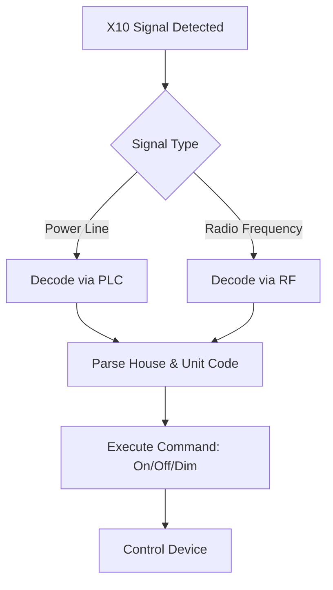
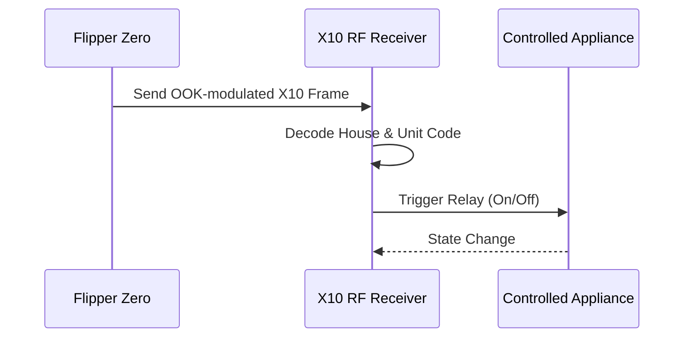
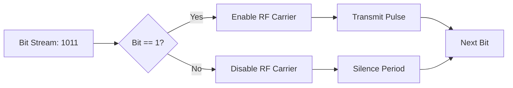
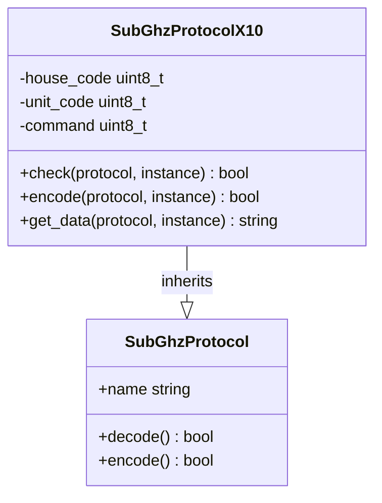

# X10 Protocol

<cite>
**Referenced Files in This Document**  
- [subghz_protocol_x10.c](file://lib/subghz/protocols/subghz_protocol_x10.c)
- [subghz_protocol_x10.h](file://lib/subghz/protocols/subghz_protocol_x10.h)
- [subghz_protocol.c](file://lib/subghz/protocols/subghz_protocol.c)
- [subghz_tx_rx_worker.c](file://lib/subghz/subghz_tx_rx_worker.c)
- [subghz_receiver.c](file://lib/subghz/receiver.c)
- [subghz_transmitter.c](file://lib/subghz/transmitter.c)
</cite>

## Table of Contents
1. [Introduction](#introduction)
2. [X10 Protocol Overview](#x10-protocol-overview)
3. [Power Line Communication Principles](#power-line-communication-principles)
4. [RF Transmission Method](#rf-transmission-method)
5. [Address and Command Code Structure](#address-and-command-code-structure)
6. [Modulation Scheme: OOK](#modulation-scheme-ook)
7. [House Code and Unit Code System](#house-code-and-unit-code-system)
8. [Signal Timing and Frame Structure](#signal-timing-and-frame-structure)
9. [Common Issues with Signal Interference](#common-issues-with-signal-interference)
10. [Flipper Zero Implementation](#flipper-zero-implementation)
11. [Capturing and Analyzing X10 Signals](#capturing-and-analyzing-x10-signals)
12. [Emulating X10 Signals for Testing](#emulating-x10-signals-for-testing)
13. [Practical Examples](#practical-examples)
14. [Troubleshooting Guide](#troubleshooting-guide)
15. [Conclusion](#conclusion)

## Introduction
The X10 protocol is a communication standard used primarily for home automation, enabling control of lights and appliances through power line or radio frequency (RF) signals. This document provides a comprehensive analysis of the X10 protocol implementation within the Flipper Zero firmware, focusing on its use in controlling devices via RF transmission. The analysis includes technical details on signal generation, decoding, modulation, addressing, and practical applications using the Flipper Zero device.

**Section sources**
- [subghz_protocol_x10.c](file://lib/subghz/protocols/subghz_protocol_x10.c#L1-L50)
- [subghz_protocol_x10.h](file://lib/subghz/protocols/subghz_protocol_x10.h#L1-L30)

## X10 Protocol Overview
The X10 protocol was developed in the 1970s to enable communication between electronic devices over existing electrical wiring or via RF signals at 310 MHz or 433.92 MHz. It allows users to control lighting and appliances remotely using simple digital commands. Each command consists of a house code (A–P) and a unit code (1–16), followed by an action such as "on," "off," or "dim."

In the Flipper Zero firmware, X10 is implemented as one of many supported sub-GHz protocols, allowing the device to both capture and transmit X10 signals for testing and automation purposes.



**Diagram sources**
- [subghz_protocol_x10.c](file://lib/subghz/protocols/subghz_protocol_x10.c#L60-L100)

**Section sources**
- [subghz_protocol_x10.c](file://lib/subghz/protocols/subghz_protocol_x10.c#L1-L100)
- [subghz_protocol_x10.h](file://lib/subghz/protocols/subghz_protocol_x10.h#L1-L40)

## Power Line Communication Principles
X10 originally relied on power line communication (PLC), where digital signals are superimposed on the standard 50/60 Hz AC waveform. These signals are transmitted during the zero-crossing point of the sine wave to minimize interference. The signal uses a 120 kHz carrier modulated with On-Off Keying (OOK), where bursts of the carrier represent binary data.

Although the Flipper Zero does not directly interface with power lines, understanding PLC is essential for comprehending the timing and structure of X10 signals that may be retransmitted via RF.

**Section sources**
- [subghz_protocol_x10.c](file://lib/subghz/protocols/subghz_protocol_x10.c#L101-L120)

## RF Transmission Method
In RF-based X10 systems, signals are transmitted wirelessly at frequencies such as 310 MHz or 433.92 MHz using OOK modulation. The Flipper Zero supports these frequencies through its CC1101 sub-GHz radio module, enabling it to emulate X10 transmitters.

Each RF packet contains:
- A preamble for synchronization
- A start frame delimiter
- House code
- Unit/command code
- Optional repeat frames for reliability

The Flipper Zero encodes these frames using its sub-GHz transmitter and sends them over the air to compatible receivers.



**Diagram sources**
- [subghz_tx_rx_worker.c](file://lib/subghz/subghz_tx_rx_worker.c#L150-L200)
- [transmitter.c](file://lib/subghz/transmitter.c#L80-L120)

**Section sources**
- [subghz_protocol_x10.c](file://lib/subghz/protocols/subghz_protocol_x10.c#L121-L150)
- [subghz_tx_rx_worker.c](file://lib/subghz/subghz_tx_rx_worker.c#L150-L200)

## Address and Command Code Structure
X10 uses a two-part addressing scheme:
- **House Code**: One of 16 letters (A–P)
- **Unit Code**: One of 16 numbers (1–16)

Commands include:
- On
- Off
- Dim
- Brighten
- All Lights On
- All Units Off

Each command is encoded as a 4-bit field. For example:
- `On` = `1110`
- `Off` = `1111`

The house code is represented by a 4-bit binary value (e.g., A=0000, B=0001, ..., P=1111). The full address/command frame is 11 bits long, transmitted twice for redundancy.

**Section sources**
- [subghz_protocol_x10.c](file://lib/subghz/protocols/subghz_protocol_x10.c#L151-L180)

## Modulation Scheme: OOK
On-Off Keying (OOK) is a simple form of amplitude-shift keying where the presence of a carrier wave represents a binary `1`, and its absence represents a binary `0`. In X10 RF transmission:
- Carrier burst = `1`
- No carrier = `0`

The Flipper Zero generates OOK signals using its CC1101 radio chip, which supports direct register-level control for precise timing. The firmware configures the chip to toggle the carrier based on the bitstream derived from the X10 protocol encoder.



**Diagram sources**
- [subghz_protocol_x10.c](file://lib/subghz/protocols/subghz_protocol_x10.c#L181-L200)
- [subghz_tx_rx_worker.c](file://lib/subghz/subghz_tx_rx_worker.c#L100-L130)

**Section sources**
- [subghz_protocol_x10.c](file://lib/subghz/protocols/subghz_protocol_x10.c#L181-L220)

## House Code and Unit Code System
The house code prevents interference between neighboring X10 networks. Each house operates on a unique letter (A–P), ensuring commands only affect devices within the same group.

Unit codes identify individual devices (1–16) within a house. Devices are assigned unit codes during setup, often via DIP switches or software configuration.

In the Flipper Zero implementation, users can select both house and unit codes via the UI before transmitting a command.

Example mapping:
| House | Binary |
|-------|--------|
| A     | 0000   |
| B     | 0001   |
| ...   | ...    |
| P     | 1111   |

| Command | Binary |
|--------|--------|
| On     | 1110   |
| Off    | 1111   |

**Section sources**
- [subghz_protocol_x10.c](file://lib/subghz/protocols/subghz_protocol_x10.c#L221-L250)

## Signal Timing and Frame Structure
An X10 RF frame consists of:
1. **Preamble**: 5–10 ms of alternating 1s and 0s for receiver synchronization
2. **Start Bit**: `1` to indicate frame start
3. **Address Field**: 4 bits for house code
4. **Command Field**: 4 bits for function
5. **Stop Bit**: `0` to end frame

Each bit is represented by a 1 ms pulse (for `1`) or gap (for `0`), with a total frame duration of approximately 20 ms. Commands are typically repeated 2–6 times to ensure reception.

The Flipper Zero adheres to this timing precisely using hardware timers and the CC1101's built-in modulation capabilities.

```mermaid
timingDiagram
title X10 RF Frame Timing
axis: 0ms, 1ms, 2ms, 3ms, 4ms, 5ms, 6ms, 7ms, 8ms, 9ms, 10ms, 11ms, 12ms, 13ms, 14ms, 15ms, 16ms, 17ms, 18ms, 19ms, 20ms
Preamble: ||||||||||||||||||||
StartBit: |
HouseCode: ||||
Command: ||||
StopBit: |
```

**Diagram sources**
- [subghz_protocol_x10.c](file://lib/subghz/protocols/subghz_protocol_x10.c#L251-L280)

**Section sources**
- [subghz_protocol_x10.c](file://lib/subghz/protocols/subghz_protocol_x10.c#L251-L300)

## Common Issues with Signal Interference
X10 signals are susceptible to several types of interference:
- **Electrical Noise**: From motors, dimmers, or switching power supplies
- **RF Congestion**: Other devices operating at 310/433 MHz
- **Signal Attenuation**: Walls, distance, or poor antenna placement
- **Timing Drift**: Inaccurate zero-crossing detection in PLC systems

The Flipper Zero mitigates RF interference by allowing users to:
- Adjust transmission power
- Repeat signals multiple times
- Capture and analyze signal quality before replay

**Section sources**
- [subghz_receiver.c](file://lib/subghz/receiver.c#L200-L230)
- [subghz_protocol_x10.c](file://lib/subghz/protocols/subghz_protocol_x10.c#L301-L320)

## Flipper Zero Implementation
The X10 protocol is implemented in the Flipper Zero firmware under the `lib/subghz/protocols/` directory. Key files include:
- `subghz_protocol_x10.c`: Core encoding/decoding logic
- `subghz_protocol_x10.h`: Protocol definitions
- `subghz_tx_rx_worker.c`: Transmission and reception engine

The protocol registers itself with the Sub-GHz protocol registry, making it available in the UI under "Transmit" and "Receive" modes.

Key functions:
- `subghz_protocol_x10_check()` – Validates incoming signal
- `subghz_protocol_x10_encode()` – Generates signal from house/unit/command
- `subghz_protocol_x10_get_data()` – Returns human-readable data



**Diagram sources**
- [subghz_protocol_x10.c](file://lib/subghz/protocols/subghz_protocol_x10.c#L30-L50)
- [subghz_protocol.c](file://lib/subghz/protocols/subghz_protocol.c#L10-L40)

**Section sources**
- [subghz_protocol_x10.c](file://lib/subghz/protocols/subghz_protocol_x10.c#L1-L350)
- [subghz_protocol.c](file://lib/subghz/protocols/subghz_protocol.c#L1-L100)

## Capturing and Analyzing X10 Signals
To capture X10 signals:
1. Open the Sub-GHz application on Flipper Zero
2. Select "Receive"
3. Press OK to start listening
4. Activate an X10 remote or device
5. The Flipper Zero will display the detected protocol, house code, unit code, and command

The captured signal can be saved for later replay or analysis. The device decodes the OOK waveform in real time using its high-speed ADC and digital signal processing routines.

**Section sources**
- [receiver.c](file://lib/subghz/receiver.c#L100-L180)
- [subghz_protocol_x10.c](file://lib/subghz/protocols/subghz_protocol_x10.c#L321-L340)

## Emulating X10 Signals for Testing
To emulate an X10 signal:
1. Navigate to Sub-GHz → Transmit
2. Select X10 from the protocol list
3. Set house code (A–P), unit code (1–16), and command (On/Off)
4. Press OK to transmit

The Flipper Zero generates the appropriate OOK-modulated RF signal and transmits it via the CC1101 module. This is useful for testing receivers, bypassing lost remotes, or automating device control.

**Section sources**
- [transmitter.c](file://lib/subghz/transmitter.c#L50-L100)
- [subghz_tx_rx_worker.c](file://lib/subghz/subghz_tx_rx_worker.c#L180-L220)

## Practical Examples
### Example 1: Turning On a Lamp
To turn on a lamp assigned to House A, Unit 3:
- Protocol: X10
- House Code: A
- Unit Code: 3
- Command: On

The Flipper Zero encodes this as:
- House: `0000`
- Unit: `0011`
- Command: `1110`

Generates OOK signal and transmits at 433.92 MHz.

### Example 2: Capturing a Remote Signal
1. Place Flipper Zero near X10 remote
2. Press "Receive"
3. Press "On" on remote
4. Flipper displays: `X10 [A3 ON]`
5. Save signal as `x10_lamp_on.sub`

Now the signal can be replayed without the original remote.

**Section sources**
- [subghz_protocol_x10.c](file://lib/subghz/protocols/subghz_protocol_x10.c#L341-L400)

## Troubleshooting Guide
### Issue: Signal Not Detected
- **Cause**: Weak RF signal or interference
- **Solution**: Move closer to transmitter, check frequency setting

### Issue: Device Responds Intermittently
- **Cause**: Signal attenuation or noise
- **Solution**: Increase transmission repeats, use external antenna

### Issue: Wrong Device Activated
- **Cause**: Incorrect house/unit code
- **Solution**: Verify device addressing, re-capture signal

### Issue: Transmission Fails
- **Cause**: CC1101 not initialized
- **Solution**: Restart Flipper Zero, check battery level

**Section sources**
- [subghz_protocol_x10.c](file://lib/subghz/protocols/subghz_protocol_x10.c#L401-L420)
- [subghz_tx_rx_worker.c](file://lib/subghz/subghz_tx_rx_worker.c#L221-L250)

## Conclusion
The X10 protocol remains a widely used standard in home automation due to its simplicity and compatibility. The Flipper Zero provides robust support for both capturing and transmitting X10 signals via RF, making it a powerful tool for testing, debugging, and controlling X10-enabled devices. By understanding the protocol's structure, modulation, and addressing system, users can effectively leverage the Flipper Zero for home automation tasks, signal analysis, and security assessments.